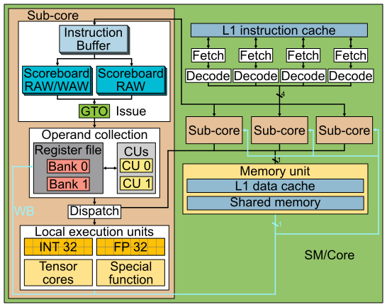
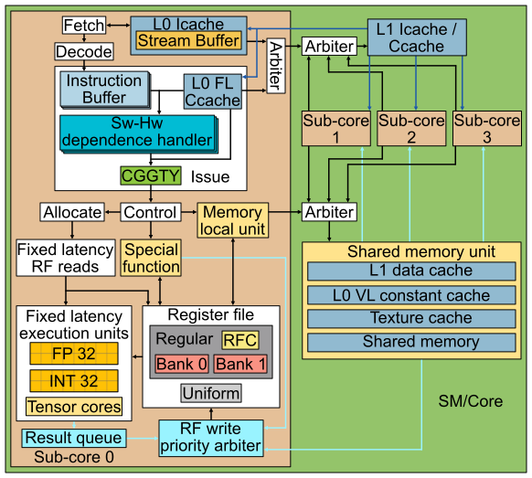
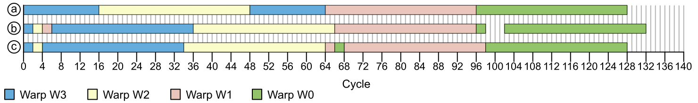
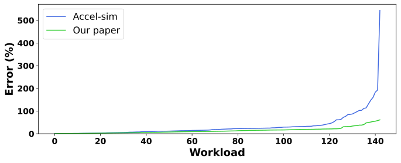

# 引言 {#sec-introduction}

近年来，GPU 已不仅用于图形渲染，也被广泛用于通用计算负载[@usageOfGPUs]。GPU 架构提供的大规模并行性可被许多现代应用充分利用，例如生物信息学[@cudaInGPUS; @markovGPUBioinformatics]、物理模拟[@molecularPhysicsCuda; @fdtdPhysicsCuda]、化学计算[@detailedChemistry; @cheminformaticsGPU]等。如今，GPU 是加速现代机器学习工作负载的核心平台，这些工作负载对内存带宽与计算能力的需求极高[@cuDNNLibraryIA]。近年来 GPU 微架构、互连技术（如 NVLink[@nvlink]）与通信框架（如 NCCL[@nccl]）持续演进，这些进步使得需要数千块 GPU 的大语言模型训练与推理成为可能[@articuloWebMSNumGPUsIA]。

然而，现代商业 GPU 的微架构细节信息十分稀缺，学术研究中常用的模型仍以 2006 年发布的 Tesla 架构为基线[@gpgpusim3; @accelsim; @teslaHotchips]。现代 GPU 相比 Tesla 已发生了显著变化，基于旧架构的模型可能导致结论偏差。本文旨在揭示现代 NVIDIA GPU 架构中的关键特性与组件细节，以提升学术界 GPU 微架构模型的准确性，从而帮助研究者更好地识别未来 GPU 的挑战与机会。本文的主要贡献如下：

- 描述发射阶段的运行机制，包括依赖处理、warp 就绪条件以及发射调度策略。
- 描述一种可信的取指阶段与其调度器，并说明其与发射阶段的协调方式。
- 给出寄存器文件的重要细节并解释寄存器文件缓存的行为，表明现代 NVIDIA GPU 不使用 operand collection 阶段或 collector units。
- 揭示内存流水线的多项细节。
- 重新设计 Accel-Sim 模拟器中的 SM/Core 模型，并整合本文揭示的全部细节。
- 将新模型与真实硬件进行验证并与 Accel-Sim 对比。对 NVIDIA RTX A6000（Ampere）而言，我们的新模型在执行周期上的 MAPE 为 13.98%，比旧模型提升 18.24%。
- 证明基于流缓冲的朴素指令预取在性能精度上优于预期，效果接近“完美指令缓存”。
- 分析寄存器文件缓存和寄存器文件读端口数量对仿真精度与性能的影响。
- 比较本文揭示的依赖管理机制与传统记分牌方法在性能、面积与仿真精度上的差异，表明这种软硬协同设计更高效。
- 证明模型对 NVIDIA 其他架构（如 Turing）的可移植性。

本文其余部分结构如下：第 @sec-backgroundmotivation 节介绍背景与动机；第 @sec-researchmethodology 节说明逆向方法；第 @sec-moderngpuarch 节描述现代 NVIDIA GPU 的控制位（control bits）及其行为；第 @sec-design 节呈现 GPU 核心微架构；第 @sec-modeling 节描述仿真模型；第 @sec-validation 节评估模型准确性并分析指令预取、寄存器文件缓存与依赖管理机制等因素；第 @sec-relatedwork 节回顾相关工作；最后第 @sec-conclusion 节总结全文。

# 背景与动机 {#sec-backgroundmotivation}

学术界对 GPU 微架构的研究多依赖 GPGPU-Sim 模拟器所采用的模型[@gpgpusim3; @gpgpuBook]。该模拟器近年来更新为包含 Volta 起引入的 sub-core（NVIDIA 术语为 Processing Blocks）方案。@fig-academia 展示了该模型的架构示意图，可以看到其包含四个 sub-core 以及若干共享组件，如 L1 指令缓存、L1 数据缓存、共享内存与纹理单元。

{#fig-academia}

在该 GPU 流水线的取指阶段，轮转调度器会选择一个 warp，其下一条指令位于 L1 指令缓存且其指令缓冲区有空位。每个 warp 维护一个独占的指令缓冲区，用于存放取指与译码后的连续指令，直到这些指令就绪并被发射。

在发射阶段，采用 GTO（Greedy Then Oldest）调度器[@GTO]，只要 warp 不在等待 barrier 且其最老指令与流水线中的更早指令无数据依赖，就会被发射。以往工作通常假设每个 warp 有两个记分牌用于依赖检测：第一个记录寄存器待写入以追踪 WAW 与 RAW，只有当所有源操作数在该记分牌中清零时指令才可发射；第二个记分牌统计寄存器的在途消费者数量，用于防止 WAR 冒险[@warHazards]。第二个记分牌的必要性在于：虽然指令按序发射，但由于可变延迟指令（如内存指令）可能在发射后排队，其源操作数的读取可能晚于更年轻指令的写回，导致 WAR 冒险。

指令发射后进入 Collector Unit（CU），等待源寄存器操作数就绪。每个 sub-core 的私有寄存器文件由多个 bank 组成，每个 bank 有若干端口以在单周期内支持多次访问；仲裁器负责处理同一 bank 的并发访问冲突。当指令的所有源操作数都在 CU 中就绪后，进入 Dispatch 阶段并派发到对应的执行单元（如内存、单精度、特殊函数单元）。不同单元的延迟各不相同，写回阶段将结果写入寄存器文件。

Accel-Sim 所建模的 GPU 架构类似基于 Tesla 的 NVIDIA GPU[@teslaHotchips]，该架构发布于 2006 年，并仅做了少量现代化更新（例如 sub-core 模型与类似 Volta 的分区缓存与 IPOLY 索引[@accelsim; @IPOLYPaper]）。但该模型缺少现代 NVIDIA GPU 中存在的关键组件，例如 L0 指令缓存[@voltaPaper; @turingPaper; @amperePaper; @hopperPaper; @adaPaper; @voltaHotChips; @turingHotChips]与统一寄存器文件[@turingHotChips]。此外，sub-core 中的多个关键组件（如发射逻辑、寄存器文件、寄存器文件缓存）并未更新以反映当前设计。

本文旨在逆向现代 NVIDIA GPU 的核心微架构，并更新 Accel-Sim 以纳入这些新特性，从而让该模拟器的基线更贴近工业界已验证的商业设计。

# 逆向方法 {#sec-researchmethodology}

本节阐述我们用于发现 NVIDIA Ampere GPU 核心（SM）微架构的研究方法。

我们的做法是编写由少量指令组成的 microbenchmarks，通过测量一段特定指令序列的执行时间来推断微架构特性。具体做法是：在代码段前后插入读取 GPU `CLOCK` 计数器的指令，将计数器保存到寄存器并写入主存，便于后续分析。被测指令序列通常由手写 SASS 指令及其控制位构成。根据测试需求，我们对记录的周期进行可视化，以验证或否定某一控制位语义或微架构特性。以下是两个示例：

- 使用下面代码揭示多 bank 寄存器文件的读冲突（见 @sec-regfile）。若将 `R_X` 与 `R_Y` 都设为奇数（例如 `R19` 和 `R21`），耗时为 5 个周期（每 sub-core 每周期可发射一条指令的理论最小值）。若将 `R_X` 改为偶数（如 `R18`）而 `R_Y` 仍为奇数（如 `R21`），耗时变为 6 个周期；若两个操作数均为偶数（如 `R18` 与 `R20`），耗时为 7 个周期。也就是说，两条连续指令之间可能出现 0 到 2 个气泡（bubble），取决于寄存器选择。
- @fig-issue-scheduling-timeline 展示了多次记录的时间标记在图形上的体现，用于揭示 warp 发射策略（详见 @sec-schedulingpolicy）。

```python
# 用于检查寄存器文件读冲突的代码
CLOCK
NOP
FFMA R11, R10, R12, R14
FFMA R13, R16, R_X, R_Y
NOP
CLOCK
```

尽管 NVIDIA 没有官方工具可直接编写 SASS（NVIDIA 汇编语言），但已有多种第三方工具支持重排与修改汇编指令（包括控制位），常用于优化关键内核。MaxAS[@maxas] 是最早的 SASS 修改工具；随后 KeplerAS[@KeplerASRepo; @KeplerASPaper] 针对 Kepler 架构出现；之后 TuringAS[@turingas] 与 CUAssembler[@CuAssembler] 支持更新架构。我们选择 CUAssembler，因为它具有更高的灵活性、可扩展性，并支持最新硬件。

# 现代 NVIDIA GPU 架构中的控制位 {#sec-moderngpuarch}

现代 NVIDIA GPU 的 ISA 包含控制位，编译器借此保证正确性并优化性能。与以往在运行时追踪寄存器读写以处理数据依赖的架构不同（见 @sec-backgroundmotivation），现代 NVIDIA GPU 依赖编译器管理寄存器数据依赖[@gtx680WhitePaper]。因此，每条汇编指令都携带控制位用于依赖管理、性能与能耗优化。

下文描述每条指令中的控制位行为。我们的解释参考了多份文档[@dissectingVolta; @dissectingTuring; @CuAssembler; @maxas]，但这些文档常不完整或存在歧义，因此我们结合 @sec-researchmethodology 的方法来验证这些控制位的语义。

sub-core 每周期最多发射一条指令。默认情况下，发射调度器倾向于从同一 warp 发射指令，只要该 warp 中程序顺序最老的指令已就绪。编译器通过控制位标记指令何时可发射；若上一周期被选中的 warp 的最老指令未就绪，则发射逻辑按照 @sec-warpscheduler 描述的策略从其他 warp 中选择。

对于固定延迟指令的生产者—消费者依赖，每个 warp 有一个称为“停顿计数器（Stall counter）”的计数器。若该计数器非零，则该 warp 不可发射。编译器将“生产者指令的延迟 - 生产者与首个消费者之间的指令数”写入停顿计数器。所有 warp 的停顿计数器每周期减 1，直到为 0；发射逻辑仅需检查该计数器即可判断是否可从同一 warp 继续发射。

例如，一条延迟为 4 周期的加法指令，且其首个消费者是下一条指令，则停顿计数器被设为 4。我们验证了如果停顿计数器设置不正确，程序结果会出错，因为硬件不检查 RAW 冒险，而完全依赖编译器设置的计数器。该机制也节省面积与布线能耗，因为固定延迟单元到依赖处理逻辑的连线不再需要，而传统记分牌方案则需要这些连线。

另一个控制位是“Yield”，用于告知硬件下一周期不要从同一 warp 发射指令。如果其他 warp 也未就绪，则该周期不会发射任何指令。

每条指令都会设置停顿计数器与 Yield 位。当停顿计数器大于 1 时，warp 至少停顿一个周期，此时无论 Yield 是否置位均无影响。

另一方面，部分指令（如内存或特殊函数）具有可变延迟，编译器无法预知其执行时间，因此不能仅靠停顿计数器处理。这类冒险通过“依赖计数器（Dependence counters）”解决。每个 warp 有 6 个专用寄存器（`SB0` 到 `SB5`），每个计数器可计数至 63。

这些计数器在 warp 启动时置零。对于生产者—消费者依赖，生产者在发射后增加某计数器，并在写回时减小；消费者指令会等待该计数器归零后才能发射。

对于 WAR 冒险，机制类似，但计数器在读取源操作数后减小，而非在写回时减小。

每条指令的控制位可以指明最多两个在发射时递增的计数器，其中一个在写回时递减（用于 RAW/WAW），另一个在寄存器读取时递减（用于 WAR）。为此，每条指令有两个 3 位字段用于指示这两个计数器，并有一个 6 位掩码，用于指定该指令在发射前需要检查哪些依赖计数器（最多可检查 6 个）。

如果一条指令有多个源操作数且其生产者均为可变延迟指令，那么这些生产者可共用同一个依赖计数器而不降低并行性。但当存在超过 6 个不同可变延迟生产者时，会受到并行度限制，编译器需在“合并计数器”与“重排指令”之间权衡。

依赖计数器的自增发生在生产者发射后的下一周期，因此不会在当周期生效。如果消费者紧随其后，则生产者需要将停顿计数器设为 2，以避免下一周期错误发射消费者指令。

{#fig-control-bits-example}

如 @fig-control-bits-example 所示，该代码包含四条指令（3 条 load 与 1 条 add）及其编码。由于 add 依赖于可变延迟的 load，需依赖计数器避免数据冒险。PC 为 `0x80` 的指令对 `0x50` 与 `0x60` 存在 RAW 依赖，因此 `SB3` 在 `0x50` 与 `0x60` 发射时增加，在写回时减少。另一方面，add 对 `0x60` 与 `0x70` 有 WAR 依赖，于是 `SB0` 在 `0x60` 与 `0x70` 发射时增加，在读取源操作数后减少。add 的依赖计数器掩码要求 `SB0` 与 `SB3` 在发射前均为 0。注意 `0x70` 还使用 `SB4` 控制与后续指令的 RAW/WAR 冒险，但 `0x80` 与该 load 无依赖，因此不等待 `SB4`。在读取源操作数后清除 WAR 依赖是重要的优化，因为源操作数往往在结果写回之前很早就已读取，尤其在内存指令中更为明显。

另一种检查计数器就绪性的方式是使用 `DEPBAR.LE` 指令。例如，`DEPBAR.LE SB1, 0x3, {4,3,2}` 要求依赖计数器 `SB1` 的值小于等于 3 才能继续执行；最后一个参数是可选项，如果使用，则该指令还要求指定的依赖计数器（例中为 4、3、2）全部为 0 才能发射。

`DEPBAR.LE` 在某些场景非常有用。例如，当有一串 `N` 条可变延迟指令按序写回（如带 `STRONG.SM` 的内存指令），而消费者只需等待前 `M` 条指令完成时，可设置 `DEPBAR.LE` 的参数为 `N-M` 来等待前 `M` 条。另一个例子是复用同一依赖计数器来同时保护 RAW/WAW 与 WAR：由于 WAR 先于 RAW/WAW 解决，后续的 `DEPBAR.LE SBx, 0x1` 可等待 WAR 解除并继续执行，而真正的消费者则等待计数器归零以确保结果写回。

此外，GPU 还使用寄存器文件缓存（RFC）以节能并减少寄存器文件读端口竞争。该结构由软件管理：每个源操作数都有一个 `reuse` 控制位，指示硬件是否缓存该寄存器内容。RFC 的组织细节见 @sec-reg-file-cache。

最后，虽然本文聚焦 NVIDIA 架构，但 AMD GPU ISA 的公开文档[@amdCDNA1; @amdCDNA2; @amdCDNA3; @amdRDNA1; @amdRDNA2; @amdRDNA35; @amdRDNA3; @amdVega7nm; @amdGCN3; @amdVega] 显示 AMD 同样依赖软硬协同机制管理依赖、提升性能。类似 NVIDIA 的 `DEPBAR.LE`，AMD 使用 `waitcnt` 指令；根据架构，每个 wavefront（warp）有 3 或 4 个计数器，且每个计数器绑定特定指令类型并必须使用以避免相关冒险。AMD 不允许普通指令通过控制位等待计数器归零，必须显式插入 `waitcnt`，这增加了指令数量。该设计降低了解码开销，但提高了指令数。相比之下，NVIDIA 提供更多计数器且不与指令类型绑定，因此可在同一指令类型内部保持更多并发依赖链。虽然 AMD 的 ALU 指令不需要软件或编译器干预即可避免冒险，但在 RDNA 3/3.5 中引入了 `DELAY_ALU` 以缓解依赖导致的流水线停顿[@amdRDNA35; @amdRDNA3]。而 NVIDIA 则依赖编译器为固定延迟指令正确设置停顿计数器，以较少的指令数换取更高的解码开销。

# GPU 核心微架构 {#sec-design}

本节基于 @sec-researchmethodology 所述的方法，介绍我们对现代 NVIDIA 商用 GPU 核心微架构的发现。@fig-ourcore 展示了 GPU 核心的关键组件。下文分别展开介绍发射调度器、前端、寄存器文件以及内存流水线。

{#fig-ourcore}

## 发射调度器 {#sec-warpscheduler}

本小节解析现代 NVIDIA GPU 的发射调度器。我们先在 @sec-readinesschecking 中描述每周期哪些 warp 会被视为“可发射”，再在 @sec-schedulingpolicy 中说明选择策略。

{#fig-issue-scheduling-timeline}

### Warp 就绪条件 {#sec-readinesschecking}

若一个 warp 在某周期要被视为其最老指令的候选发射者，需要满足若干条件。这些条件既依赖该 warp 的历史指令状态，也依赖核心的全局状态。

显然，需要指令缓冲区中存在有效指令。另一个条件是该 warp 的最老指令不能与同一 warp 中尚未完成的更老指令存在数据依赖。依赖由控制位进行软件处理，如 @sec-moderngpuarch 所述。

此外，对于固定延迟指令，只有在能够保证其发射后执行所需资源可用时，该 warp 才能在该周期发射最老指令。

其中一类资源是执行单元。执行单元存在输入锁存器，指令到达执行阶段时该锁存器必须为空。当执行单元宽度为半个 warp 时，锁存器会被占用两个周期；宽度为一个 warp 时则占用一个周期。

对于源操作数位于常量缓存（Constant Cache）的指令，标签查找在发射阶段进行。若所选 warp 的最老指令需要常量缓存而发生 miss，则调度器不会发射任何指令直到 miss 被服务；如果 4 个周期后 miss 仍未完成，则调度器切换到另一条指令就绪的 warp（选择最年轻的）。

关于寄存器文件读端口的可用性，我们观察到发射调度器并不会考虑“未来若干周期是否会发生端口冲突”。我们的实验表明，即使移除最后一个 `FFMA` 与 `CLOCK` 之间的 `NOP`，寄存器读冲突也不会阻止第二个 `CLOCK` 的发射。我们进行了大量实验以推断从发射到执行之间的流水线结构，虽然无法完全拟合所有案例，但以下模型对绝大多数实验有效，因此采用该模型：固定延迟指令在发射阶段与读操作数阶段之间有两个中间阶段。第一个阶段称为 Control，适用于固定和可变延迟指令，用于递增依赖计数器或读取时钟计数器等。由此可以解释：如果一条指令递增依赖计数器，紧随其后的指令又需要等待该计数器归零，则两者之间至少需要插入一个周期，否则递增在下一周期才生效，因此连续指令无法依赖计数器直接避免冒险，除非前一条指令设置了 Yield 或设置了大于 1 的停顿计数器。

第二个阶段仅用于固定延迟指令，我们称之为 Allocate。在该阶段检查寄存器文件读端口是否可用，若无法保证在后续周期无冲突读取操作数，则在该阶段停顿，直到可以保证读取。寄存器文件读写流水线及其缓存细节见 @sec-regfile。

可变延迟指令（如内存指令）在通过 Control 阶段后直接进入队列，不经过 Allocate。队列中的指令只有在确认不会发生读端口冲突时才进入寄存器文件读流水线。固定延迟指令优先于可变延迟指令获得读端口分配，因为固定延迟指令必须在固定周期内完成以保证依赖正确性。

### 调度策略 {#sec-schedulingpolicy}

为揭示发射调度策略，我们设计了多种涉及多个 warp 的测试，记录每周期调度器选择哪个 warp 发射。该信息通过保存 GPU `CLOCK` 计数器的指令获取，但硬件不允许连续发射两条此类指令，因此我们在中间插入固定数量的其他指令（通常为 `NOP`），并变化 `Yield` 与停顿计数器控制位的取值。

实验结果表明，warp 调度器采用贪心策略：若同一 warp 满足就绪条件，则继续从该 warp 发射；当需要切换 warp 时，选择满足就绪条件的“最年轻”warp。

@fig-issue-scheduling-timeline 展示了四个 warp 在同一 sub-core 中执行时的发射时间线。每个 warp 执行相同的代码，包含 32 条彼此独立的指令，理论上每周期可发射 1 条。

在情况 (a) 中，所有停顿计数器、依赖掩码与 Yield 均为 0。调度器从最年轻的 warp（W3）开始发射，直到其 ICache miss；此时 W3 没有有效指令，调度器切换到 W2。由于 W2 复用了 W3 带入的指令，因此其 ICache 命中；当 W2 执行到 W3 miss 的位置时，miss 已被服务，后续指令命中，于是调度器继续贪心地完成 W2。随后调度器继续从 W3（最年轻）发射至结束，再转到 W1、W0。

情况 (b) 中，每个 warp 的第二条指令将停顿计数器设为 4。调度器在 W3 发射两条后切换至 W2，再两条后切换至 W1，然后回到 W3（其停顿计数器已归零）。当 W3、W2、W1 结束后，调度器开始发射 W0。W0 发射第二条指令后，由于没有其他 warp 可隐藏停顿，产生 4 个气泡。

情况 (c) 中，每个 warp 的第二条指令设置 Yield。调度器在发射第二条指令后切换到其他 warp 中最年轻的一个，例如 W3 切换到 W2，W2 再切回 W3。我们还测试了“Yield 置位且无其他 warp 可选”的情况（图中未示），此时调度器产生 1 个周期的气泡。

我们将该策略称为“编译器引导的贪心后选最年轻（CGGTY）”，因为调度器由控制位（停顿计数器、Yield 与依赖计数器）引导。

需要说明的是，我们仅验证了同一 CTA 内 warp 的行为；尚未有可靠方法分析不同 CTA 之间 warp 的交互。

## 前端 {#sec-frontend}

根据 NVIDIA 多份文档中的 SM 结构图[@voltaPaper; @turingPaper; @amperePaper; @hopperPaper; @adaPaper; @voltaHotChips; @turingHotChips]，SM 包含四个 sub-core，warp 以轮转方式分配到 sub-core（即 warp ID `mod 4`）[@dissectingVolta; @dissectingTuring]。每个 sub-core 有私有 L0 指令缓存，并连接到全 SM 共享的 L1 指令缓存。我们假设存在仲裁器协调多个 sub-core 的请求。

每个 L0 ICache 都有指令预取器[@nvidiaInstPrefeching]。我们的实验印证了 Cao 等人关于 GPU 指令预取有效性的结论[@GPUinstPrefeching]。尽管我们无法确认 NVIDIA 的具体实现，但推测为类似流缓冲的简单方案[@streamBufferPrefetching]，即在 miss 发生时预取后续连续的缓存行。基于分析，我们假设流缓冲大小为 16（见 @sec-results-instruction-prefetching）。

我们无法通过实验确认精确的取指策略，但若其与发射策略差异过大，将频繁出现“指令缓冲区无有效指令”的情况，而我们并未观察到这一现象。因此，我们假设每个 sub-core 每周期可取指并译码 1 条指令。取指调度器优先从上次（或最近一次）发射指令的 warp 取指，除非该 warp 的指令缓冲区中已存在的指令数加上在途取指数达到缓冲区容量。此时调度器切换到指令缓冲区有空位的最年轻 warp。我们假设每个 warp 有 3 个指令缓冲区条目，足以支撑“贪心发射”策略，因为从取指到发射有 2 个流水阶段。如果缓冲区仅有 2 项，贪心策略将被破坏：例如在所有请求 ICache 命中、所有 warp 缓冲区均满的情况下，若第 1 周期发射 W1 同时取指 W0，第 2 周期将发射 W1 的第 2 条并取指第 3 条；第 3 周期 W1 的第 3 条仍在译码中，缓冲区无有效指令，贪心策略失败，被迫切换 warp。3 项缓冲区可避免该问题，这与我们的实验一致。多数文献假设取指/译码宽度为 2 且缓冲区为 2 项，并且只有当缓冲区为空才取指，这会导致每两个连续指令后就切换 warp，与我们的观察不符。

## 寄存器文件 {#sec-regfile}

我们通过大量实验（不同 SASS 指令组合、不同寄存器文件端口压力、是否使用寄存器文件缓存）来揭示寄存器文件组织。

现代 NVIDIA GPU 具有多种寄存器文件：

- **常规寄存器（Regular）**：最近架构每个 SM 有 65536 个 32 位寄存器[@voltaPaper; @turingPaper; @amperePaper; @hopperPaper; @adaPaper]，用于保存线程计算值。寄存器按 32 个为一组，对应 warp 中 32 个线程，形成 2048 个“warp 寄存器”。寄存器在 sub-core 间均匀分布，每个 sub-core 的寄存器文件分成两个 bank[@dissectingVolta; @dissectingTuring]。每个 warp 可使用 1 至 256 个寄存器，编译时确定。每 warp 使用寄存器越多，SM 并行 warp 数越少。
- **统一寄存器（Uniform）**：每个 warp 有 64 个私有 32 位寄存器，用于保存该 warp 所有线程共享的值[@dissectingTuring]。
- **谓词寄存器（Predicate）**：每个 warp 有 8 个 32 位寄存器，每个 bit 对应 warp 中一个线程，用于指示是否执行指令及分支走向。
- **统一谓词寄存器（Uniform Predicate）**：每个 warp 有 8 个 1-bit 寄存器，用于全 warp 共享的谓词。
- **SB 寄存器**：每个 warp 有 6 个“依赖计数器”寄存器，用于追踪可变延迟依赖（见 @sec-moderngpuarch）。
- **B 寄存器**：每个 warp 至少有 16 个 `B` 寄存器用于控制流重汇合（re-convergence）[@mojtabaControlFlow]。
- **特殊寄存器**：用于存放线程 ID、block ID 等特殊值。

与以往假设存在 operand collector 以处理寄存器端口冲突的工作不同[@GPU2OcusSubcore; @accelsim; @gpgpuBook]，现代 NVIDIA GPU 并未使用 operand collector。若使用 collector，会引入发射到写回的可变延迟，使得 NVIDIA ISA 的固定延迟无法在编译期确定，无法正确依赖管理（见 @sec-moderngpuarch）。我们通过多组生产者—消费者指令序列的实验验证了 collector 的不存在：无论寄存器端口冲突数量如何，停顿计数器所需值与指令执行时间均保持不变。

实验显示，每个寄存器文件 bank 有一个 1024-bit 专用写端口。此外，当一条 load 指令与一条固定延迟指令在同周期完成时，被延迟的是 load 指令；而当两个固定延迟指令（如 `IADD3` 与 `IMAD`）写同一 bank 时，两者都不延迟。这表明固定延迟指令使用了类似 Fermi 中引入的结果队列[@fermiWhitePaper]。其消费者不被延迟，说明存在旁路（bypass）以在写回前转发结果。

在读方面，我们观察到每 bank 1024-bit 带宽。通过连续 `FADD`、`FMUL`、`FFMA` 指令测得这一结果。[^fp32]

[^fp32]: Ampere 允许 FP32 操作在 FP32 与 INT32 执行单元上执行[@amperePaper]，因此两个连续 FP32 指令之间不会因执行单元冲突产生气泡。

例如，当 `FMUL` 的两个源操作数来自同一 bank 时会产生 1 个周期气泡；若来自不同 bank 则无气泡。`FFMA` 的三个源操作数都在同一 bank 时会产生 2 个周期气泡。

我们未能找到一个完全匹配所有案例的读端口仲裁策略，因为气泡生成还依赖指令类型与操作数角色。最接近实验结果的模型为：固定延迟指令在发射与读操作数之间有两个中间阶段 Control 与 Allocate（见 @sec-readinesschecking）。Allocate 负责保留寄存器文件读端口；每 bank 有一个 1024-bit 读端口，并通过寄存器文件缓存缓解读冲突。实验显示所有固定延迟指令读取操作数会持续 3 个周期，即便某些周期空闲（例如仅有两个源操作数），因为 `FADD` 与 `FMUL` 的延迟与 `FFMA` 相同，而 `FFMA` 不论三操作数是否在同一 bank 延迟都相同。若指令在 Allocate 阶段发现无法在后续三周期内读取完所有操作数，则其被阻塞在该阶段并向上游施加气泡，直到能够预留所需端口。

### 寄存器文件缓存 {#sec-reg-file-cache}

寄存器文件缓存（RFC）可缓解寄存器文件端口争用并节能，这一思路已被多项研究探讨[@registerFileCacheFirst; @registerFileCacheSimilar; @BOW; @ltrf; @mojtabaIsca]。

我们的实验表明 NVIDIA 的设计与 Gebhart 等人的方案类似[@registerFileCacheSimilar]。RFC 由编译器控制，仅用于常规寄存器操作数。关于 Last Result File 结构，我们称之为结果队列，其行为类似，但并未采用两级发射调度器（见 @sec-schedulingpolicy）。

RFC 组织结构如下：每个 sub-core 的两个寄存器 bank 各有一个入口，每个入口存放三个 1024-bit 值，对应三类常规寄存器源操作数。总容量为 6 个 1024-bit 操作数值（子条目）。某些指令的一个操作数可能需要连续两个寄存器（如张量核心指令），此时两个寄存器分别来自不同 bank，并缓存到对应入口。

编译器控制分配策略。当指令发射并读取操作数时，若该操作数设置了 `reuse`，其值将被写入 RFC。若后续指令来自同一 warp，且寄存器 ID 与 RFC 中一致、并且该操作数在指令中的位置一致，则可从 RFC 命中。若有新的读请求到达同一 bank 和同一操作数位置，则该缓存值将失效（无论命中与否）。这一行为在下面示例 2 中展示：为了让第三条指令命中 `R2`，第二条指令必须再次为 `R2` 设置 reuse，即便 `R2` 已经缓存。

```python
# 寄存器文件缓存行为示例
# Example 1
IADD3 R1, R2.reuse, R3, R4 # Allocates R2
FFMA R5, R2, R7, R8 # R2 hits and becomes unavailable
IADD3 R10, R2, R12, R13 # R2 misses

# Example 2
IADD3 R1, R2.reuse, R3, R4 # Allocates R2
FFMA R5, R2.reuse, R7, R8 # R2 hits and is retained
IADD3 R10, R2, R12, R13 # R2 hits

# Example 3. R2 misses in the second instruction since it is
# cached in another slot. R2 remains available in the first
# slot since R7 uses a different bank
IADD3 R1, R2.reuse, R3, R4 # Allocates R2
FFMA R5, R7, R2, R8 # R2 misses
IADD3 R10, R2, R12, R13 # R2 hits

# Example 4. R2 misses in the third instruction since the
# second instruction uses a different register that goes to
# the same bank in the same operand slot
IADD3 R1, R2.reuse, R3, R4 # Allocates R2
FFMA R5, R4, R7, R8 # R4 misses and R2 becomes unavailable
IADD3 R10, R2, R12, R13 # R2 misses
```

## 内存流水线 {#sec-memory-pipeline}

现代 NVIDIA GPU 的内存流水线包含每个 sub-core 本地的初始阶段，而实际访存的后续阶段由四个 sub-core 共享，因为数据缓存与共享内存为 SM 共享结构[@voltaHotChips; @turingHotChips]。本节揭示每个 sub-core 的 load/store 队列大小、sub-core 向共享结构发送请求的速率，以及不同内存指令的延迟。

注意内存访问分为两大类：共享内存访问（SM 内部、线程块共享）与全局内存访问（GPU 主存）。

为了确定队列大小与内存带宽，我们进行了一系列实验，每个 sub-core 要么执行一个 warp，要么空闲。每个 warp 执行一串相互独立的 load/store 指令，这些指令始终命中数据缓存或共享内存，并使用常规寄存器。@tbl-memoryconsecutive 展示实验结果。第一列为指令序号，其余四列为不同活跃 sub-core 数量下该指令的发射周期（每格按周期升序列出所有活跃 sub-core）。

| 指令编号 | 活跃 sub-core 数 = 1 | 活跃 sub-core 数 = 2 | 活跃 sub-core 数 = 3 | 活跃 sub-core 数 = 4 |
|---|---|---|---|---|
| 1 | 2 | 2/2 | 2/2/2 | 2/2/2/2 |
| 2 | 3 | 3/3 | 3/3/3 | 3/3/3/3 |
| 3 | 4 | 4/4 | 4/4/4 | 4/4/4/4 |
| 4 | 5 | 5/5 | 5/5/5 | 5/5/5/5 |
| 5 | 6 | 6/6 | 6/6/6 | 6/6/6/6 |
| 6 | 13 | 13/15 | 13/15/17 | 13/15/17/19 |
| 7 | 17 | 17/19 | 19/21/23 | 21/23/25/27 |
| 8 | 21 | 21/23 | 25/27/29 | 29/31/33/35 |
| $i>8$ | $(i-1)+4$ | $(i-1)+4$ | $(i-1)+6$ | $(i-1)+8$ |

: 每条内存指令的发射周期（每格为所有活跃 sub-core 按周期升序的列表）。 {#tbl-memoryconsecutive}

可以看到，在 Ampere 中每个 sub-core 可连续 5 条内存指令按每周期一条发射，第 6 条指令的发射会产生停顿，且停顿周期取决于活跃 sub-core 数量。这表明每个 sub-core 可无阻塞地缓冲 5 条指令，而全局共享结构可每两周期从任一 sub-core 接收一个内存请求。观察多 sub-core 情形可知：第 6 条及之后的指令在每个 sub-core 上以两周期间隔发射。

我们还可推断 sub-core 中的地址计算吞吐率为每 4 周期一条指令：当只有一个 sub-core 活跃时，第 6 条指令之后出现 4 周期间隔。两 sub-core 活跃时，由于共享结构吞吐率为每 2 周期一条，故每个 sub-core 可每 4 周期发射一条；更多 sub-core 活跃时共享结构成为瓶颈。例如四 sub-core 活跃时，每个 sub-core 只能每 8 周期发射一条，因为共享结构最大吞吐为每 2 周期一条。

关于每个 sub-core 内存队列大小，我们估计为 4，尽管每个 sub-core 可缓冲 5 条连续指令。指令进入单元时占用槽位，离开单元时释放槽位。

我们测量了不同内存指令在缓存命中且单线程执行时的两类延迟。第一类是从 load 发射到消费者或覆盖同一目的寄存器的指令可以发射的最早时间（RAW/WAW 延迟；store 不产生寄存器 RAW/WAW）。第二类是从 load/store 发射到能够写入其源寄存器的指令可发射的最早时间（WAR 延迟）。结果见 @tbl-mem-latencies。

| 指令 | 地址寄存器类型 | WAR | RAW/WAW |
|---|---|---:|---:|
| Load Global 32 bit | Uniform | 9 | 29 |
| Load Global 64 bit | Uniform | 9 | 31 |
| Load Global 128 bit | Uniform | 9 | 35 |
| Load Global 32 bit | Regular | 11 | 32 |
| Load Global 64 bit | Regular | 11 | 34 |
| Load Global 128 bit | Regular | 11 | 38 |
| Store Global 32 bit | Uniform | 10 | - |
| Store Global 64 bit | Uniform | 12* | - |
| Store Global 128 bit | Uniform | 16* | - |
| Store Global 32 bit | Regular | 14 | - |
| Store Global 64 bit | Regular | 16 | - |
| Store Global 128 bit | Regular | 20 | - |
| Load Shared 32 bit | Uniform | 9 | 23 |
| Load Shared 64 bit | Uniform | 9 | 23 |
| Load Shared 128 bit | Uniform | 9 | 25 |
| Load Shared 32 bit | Regular | 9 | 24 |
| Load Shared 64 bit | Regular | 9 | 24 |
| Load Shared 128 bit | Regular | 9 | 26 |
| Store Shared 32 bit | Uniform | 10 | - |
| Store Shared 64 bit | Uniform | 12 | - |
| Store Shared 128 bit | Uniform | 16 | - |
| Store Shared 32 bit | Regular | 12 | - |
| Store Shared 64 bit | Regular | 14 | - |
| Store Shared 128 bit | Regular | 18 | - |
| Load Constant 32 bit | Immediate | 10 | 26 |
| Load Constant 32 bit | Regular | 29 | 29 |
| Load Constant 64 bit | Regular | 29 | 29 |
| `LDGSTS` 32 bit | Regular | 13 | 39 |
| `LDGSTS` 64 bit | Regular | 13 | 39 |
| `LDGSTS` 128 bit | Regular | 13 | 39 |

: 内存指令延迟（周期）。带 `*` 的值为近似值。 {#tbl-mem-latencies}

我们观察到：使用统一寄存器计算地址的全局内存访问比使用常规寄存器更快，因为前者所有线程共享同一地址，仅需计算一个地址，而后者每线程可能不同。

共享内存 load 的延迟低于全局内存。其 WAR 延迟对常规与统一寄存器相同，而 RAW/WAW 延迟在统一寄存器时少 1 个周期。这表明共享内存的地址计算在共享结构中完成，WAR 依赖在源寄存器读取后即可解除。

如预期，延迟也受访问粒度影响。对于 WAR 依赖，load 延迟不随数据大小变化，因为源操作数仅用于地址计算且大小固定；对于 store，写入数据也是源操作数，数据越大 WAR 延迟越高。RAW/WAW 依赖（仅适用于 load）随数据大小增大而增大，因为需要更多数据传输到寄存器文件。我们测得该传输带宽为每周期 512 bit。

此外，常量缓存的 WAR 延迟显著高于全局内存 load，而 RAW/WAW 延迟略低。我们尚无法给出合理解释。但我们发现，固定延迟指令访问常量空间使用不同的缓存层级：通过 `LDC` 预加载常量地址并等待完成后，再发射使用同一常量地址的固定延迟指令，会出现约 79 周期的 miss 延迟，而非命中。这表明固定延迟指令访问常量空间使用 L0 FL（固定延迟）常量缓存，而 `LDC` 指令使用 L0 VL（可变延迟）常量缓存。

最后，我们分析 `LDGSTS` 指令，该指令用于减少寄存器文件压力并提升数据传输效率[@patentLDGSTS]。它从全局内存加载数据并直接写入共享内存，绕过寄存器文件，节省指令与寄存器。其延迟与指令粒度无关。WAR 依赖在地址计算完成后解除；RAW/WAW 依赖在读阶段完成后解除。

# 建模 {#sec-modeling}

我们重新设计 Accel-Sim 框架的 SM/core 模型[@accelsim]，通过修改流水线实现 @sec-moderngpuarch 与 @sec-design 解释的所有细节（见 @fig-ourcore）。主要新增组件如下：

首先，我们为每个 sub-core 添加了 L0 指令缓存与流缓冲预取器。L0 指令与常量缓存通过可参数化延迟连接到 L1 指令/常量缓存。缓存容量、层级与延迟依据既有测量与 Jia 等人关于 Ampere 的研究确定[@dissectingAmpere]。

我们修改了发射阶段以支持控制位、固定延迟指令对新 L0 常量缓存的标签查询，以及新的 CGGTY 发射调度器。我们加入了 Control 阶段（递增依赖计数器）与 Allocate 阶段（固定延迟指令检查寄存器文件与 RFC 冲突）。

针对内存指令，我们为每个 sub-core 建模了新的本地单元，并为 sub-core 共享部分建模了共享单元，其延迟与上一节一致。

此外，Abdelkhalik 等人表明张量核心指令延迟依赖其操作数数值类型与尺寸[@demystifyingAmpere]，因此我们在模型中为不同操作数类型与尺寸设置了对应延迟。

我们还建模了以下细节：在缺乏每 sub-core 双精度执行单元的架构中，双精度指令使用全 sub-core 共享的执行流水线；对使用多个寄存器的操作数，精确建模读写时序（此前模型常将其简化为一个寄存器）；修正此前工作中指令地址报告的部分不准确之处[@cams2023paper]。

除模拟器的 SM/core 模型更新外，我们还扩展了 tracer 工具：导出所有操作数类型的 ID（常规、统一、谓词、立即数等）；并增加获取控制位的能力（NVBit 不提供），通过 CUDA 二进制工具[@cudaBinaryUtils]在编译时提取 SASS。为此，我们修改应用编译流程，使其在编译期生成与微架构相关的代码而非 JIT。遗憾的是，少数内核（均来自 Deepbench）无法获取 SASS，导致控制位无法提取。对此我们采用“混合依赖模式”：无法获取控制位的内核使用传统记分牌，其他内核使用控制位。

我们还扩展工具以捕获通过描述符访问常量缓存或全局内存的指令。尽管该访问方式被认为在 Hopper 才引入[@cudaBinaryUtils]，我们发现 Ampere 已使用。描述符是编码内存访问的新方式，包含两个操作数：第一个为统一寄存器，用于编码指令语义；第二个编码地址。我们扩展 tracer 捕获地址，但未能追踪统一寄存器中编码的语义。

我们计划公开 Accel-Sim 框架中的所有模拟器与 tracer 改动。

# 验证 {#sec-validation}

本节评估所提出 GPU 核心微架构的准确性。首先在 @sec-methodoloy 描述方法；随后在 @sec-cycle-accuracy 验证设计；在 @sec-eval-rf 中研究寄存器文件缓存与读端口数量的影响；在 @sec-results-instruction-prefetching 中分析指令预取器，在 @sec-deps-analysis 中分析依赖检查机制；最后在 @sec-use-other-archs 讨论模型向其他 NVIDIA 架构的迁移。

## 方法 {#sec-methodoloy}

我们通过将模拟器结果与真实 GPU 的硬件计数器指标进行对比来验证准确性。使用了四种 Ampere GPU[@amperePaper]（规格见 @tbl-gpus-specs-and-results），CUDA 版本为 11.4，NVBit 为 1.5.5。我们也将模型与原始 Accel-Sim 进行对比，因为新模型基于其构建。

我们选取了来自 12 个基准套件的广泛基准。各套件、应用数量与输入集数量见 @tbl-bench-suites。总计 143 个基准，其中 83 个为不同应用，其余为同应用不同输入。

| 套件 | 应用数 | 输入集 |
|---|---:|---:|
| Cutlass[@cutlass] | 1 | 17 |
| Deepbench[@deepbenchWeb] | 3 | 27 |
| Dragon[@dragon] | 4 | 6 |
| GPU Microbenchmark[@accelsim] | 15 | 15 |
| ISPASS 2009[@gpgpusim3] | 8 | 8 |
| Lonestargpu[@lonestar] | 3 | 6 |
| Pannotia[@pannotia] | 7 | 11 |
| Parboil[@parboil] | 6 | 6 |
| Polybench[@polybench] | 8 | 8 |
| Proxy Apps DOE[@proxy] | 3 | 4 |
| Rodinia 2[@rodinia] | 10 | 10 |
| Rodinia 3[@rodinia] | 15 | 25 |
| **合计** | **83** | **143** |

: 基准套件。 {#tbl-bench-suites}

## 性能准确性 {#sec-cycle-accuracy}

| | RTX 3080 | RTX 3080 Ti | RTX 3090 | RTX A6000 | RTX 2080 Ti |
|---|---:|---:|---:|---:|---:|
| **规格** | | | | | |
| 核心频率 | 1710 MHz | 1365 MHz | 1395 MHz | 1800 MHz | 1350 MHz |
| 显存频率 | 9500 MHz | 9500 MHz | 9750 MHz | 8000 MHz | 7000 MHz |
| SM 数量 | 68 | 80 | 82 | 84 | 68 |
| 每 SM warp 数 | 48 | 48 | 48 | 48 | 32 |
| 每 SM 共享内存/L1D | 128 KB | 128 KB | 128 KB | 128 KB | 96 KB |
| 内存分区数 | 20 | 24 | 24 | 24 | 22 |
| L2 总容量 | 5 MB | 6 MB | 6 MB | 6 MB | 5.5 MB |
| **验证** | | | | | |
| 我们模型 MAPE | 17.15% | 18% | 17.93% | 13.98% | 19.73% |
| Accel-Sim MAPE | 27.95% | 28.19% | 28.5% | 32.22% | 26.67% |
| 我们模型相关系数 | 0.99 | 0.99 | 0.98 | 0.98 | 0.98 |
| Accel-Sim 相关系数 | 0.98 | 0.98 | 0.98 | 0.97 | 0.95 |

: GPU 规格与性能准确性。 {#tbl-gpus-specs-and-results}

@tbl-gpus-specs-and-results 展示了我们模型与 Accel-Sim 相对于真实硬件的 MAPE。可以看到，我们模型在所有 GPU 上都更准确，且对最大规模的 NVIDIA RTX A6000，MAPE 不到 Accel-Sim 的一半。相关系数方面，两者接近，但我们略优。

{#fig-cycles-results}

@fig-cycles-results 展示了 RTX A6000 上两种模型的 APE 分布（基准按误差排序）。我们模型在所有应用上 APE 更低，并且对约半数应用差距显著。Accel-Sim 在 10 个应用上 APE 大于等于 100%，最坏达到 543%，而我们的模型 APE 从未超过 62%。以 90 分位为衡量尾部准确性，Accel-Sim 为 82.64%，而我们为 31.47%。这表明我们的模型明显更准确且更稳健。

## 指令预取的敏感性分析 {#sec-results-instruction-prefetching}

流缓冲指令预取器的参数对模型准确性影响很大。我们评估了多种配置：关闭预取、完美指令缓存，以及流缓冲大小为 1、2、4、8、16、32 的配置，均基于 RTX A6000。结果见 @tbl-prefetching-analysis，可见最佳准确性对应流缓冲大小为 16。

| 配置 | 关闭 | 1 | 2 | 4 | 8 | 16 | 32 | 完美 ICache |
|---|---:|---:|---:|---:|---:|---:|---:|---:|
| MAPE | 56.61% | 43.94% | 28.59% | 18.55% | 14.67% | 13.98% | 14.35% | 15.2% |
| 加速比 | 1 | 1.08x | 1.2x | 1.33x | 1.42x | 1.47x | 1.46x | 1.58x |

: 不同预取配置的 MAPE 与相对性能提升。 {#tbl-prefetching-analysis}

从 @tbl-prefetching-analysis 的加速结果还可得出一条结论：简单的流缓冲预取器在 GPU 上的行为接近完美指令缓存。这是因为 sub-core 中的不同 warp 往往执行同一代码区域，而典型 GPGPU 应用控制流较简单，预取连续 $N$ 行通常有效。由于 GPU 不进行分支预测，采用 Fetch-Directed 预取[@fdpPrefetching] 不划算。

就仿真准确性而言，当不研究指令缓存增强时，完美指令缓存通常能以更高速度提供近似准确性。但对控制流较复杂的基准（如 Rodinia 的 `dwt2d`、`lud`、`nw`），完美指令缓存或不使用流缓冲会导致显著不准确（相对完美 ICache 误差超过 20%，相对无预取甚至超过 200%）。这是因为完美 ICache 无法体现频繁跳转带来的性能惩罚，而无预取则过度惩罚程序的其他部分，这也表明这些基准仍有改进空间。

## 寄存器文件架构的敏感性分析 {#sec-eval-rf}

@tbl-rf-analysis 展示了寄存器文件缓存（RFC）与每 bank 读端口数量对准确性与性能的影响，并给出了理想配置（所有操作数可在一个周期取回）。总体平均性能与准确性在各配置间相近，但特定基准表现更微妙：例如计算密集型的 `MaxFlops`（Accel-Sim GPU Microbenchmark）与使用 `sgemm` 参数的 Cutlass[@accelsim; @cutlass]。这两者高度依赖固定延迟算术指令，而这类指令通常有 3 个操作数，易受寄存器文件访问限制影响。

| 配置 | 1R + RFC 开 | 1R + RFC 关 | 2R + RFC 关 | 理想 |
|---|---:|---:|---:|---:|
| MAPE | 13.98% | 16.05% | 13.38% | 13.57% |
| 加速比 | 1x | 0.984x | 1.012x | 1.013x |
| MaxFlops APE | 2.82% | 2.82% | 28.97% | 28.97% |
| MaxFlops 加速比 | 1x | 1x | 1.44x | 1.44x |
| Cutlass APE | 9.72% | 39.35% | 0.97% | 2.3% |
| Cutlass 加速比 | 1x | 0.79x | 1.11x | 1.12x |

: 不同寄存器文件配置的 MAPE 与相对性能。 {#tbl-rf-analysis}

对 `MaxFlops` 而言，RFC 是否存在对性能影响不大，因为仅有一条静态指令使用 RFC。但当每 bank 读端口数增至 2（总共 4 个读端口）时，性能提升约 44%，因为每条指令常有 3 个操作数。相对地，从仿真准确性角度看，2 端口配置偏差明显。

对 Cutlass（`sgemm`）而言，单端口且无 RFC 会导致性能显著下降（0.78x），与程序中约 35.9% 的静态指令至少有一个操作数使用 RFC 的观察一致。引入每 bank 2 个读端口则提升约 12% 性能，说明寄存器文件与缓存结构仍有优化空间。

总之，寄存器文件架构及其缓存对个别基准影响显著，准确建模十分关键。平均而言，单端口 + 简单缓存已接近“无限端口”效果，但对某些基准差距仍很大，值得进一步研究。

## 依赖管理机制分析 {#sec-deps-analysis}

本小节比较本文揭示的软硬协同依赖管理机制与传统记分牌方法在性能与面积上的影响。@tbl-dependence-checking-mechanisms 给出结果。面积开销相对于一个 SM 的常规寄存器文件（256 KB）。

| 指标 | 控制位方案 | 记分牌（最大消费者 63） | 记分牌（无限制） |
|---|---:|---:|---:|
| 加速比 | 1 | 0.97x | 0.97x |
| 面积开销 | 0.09% | 5.32% | - |
| MAPE | 13.98% | 14.87% | 14.87% |

: 不同依赖管理机制的速度、面积与 MAPE。 {#tbl-dependence-checking-mechanisms}

传统记分牌机制需要为所有可写寄存器提供条目，即每 warp 332 个条目（255 常规寄存器、63 统一寄存器、7 谓词寄存器、7 统一谓词寄存器）。此外需两个记分牌：一个处理 RAW/WAW，另一个处理 WAR[@warHazards]，因为虽然发射顺序严格，但可变延迟指令的读写可能乱序，导致 WAR。WAR 记分牌需要记录每条目消费者数量。若支持最多 63 个消费者，则单 warp 需要 2324 bit（$332 + 332\times log2(63+1)$）。按 48 个 warp 的 SM 计算，总计 111,552 bit，占寄存器文件面积的 5.32%。

相比之下，本文的软硬协同机制仅需每 warp 6 个 6-bit 依赖计数器、4-bit 停顿计数器与 1-bit Yield，共 41 bit。每个 SM 仅 1968 bit，占寄存器文件面积的 0.09%，远小于记分牌方案。

综上，基于控制位的软硬协同机制在性能与面积上优于其他方案，且面积开销极小。在支持 64 个 warp/SM 的架构（如 Hopper[@hopperPaper]）中，对比更显著：控制位方案开销为 0.13%，而记分牌方案（63 消费者）为 7.09%。此外，在无法获取控制位的应用场景（如部分 Deepbench 内核）中，使用双记分牌（RAW/WAW 与 WAR）且最大消费者 63 的方案在仿真准确性上与控制位接近，因此是有效替代方案。

## 向其他 NVIDIA 架构的可移植性 {#sec-use-other-archs}

本文主要聚焦 Ampere，但结论同样适用于 Turing 等架构。除四种 Ampere GPU 的结果外，@tbl-gpus-specs-and-results 还给出 Turing GPU 结果，显示对 NVIDIA RTX 2080 Ti 的 MAPE 相比 Accel-Sim 提升 6.94%。

虽然我们仅在 Turing 与 Ampere 上验证了模型，但认为其结论可适用于更广泛的 NVIDIA 架构。公开资料与 SM 结构图显示，近期架构的重大变化主要集中在张量核心、光线追踪单元，以及如 TPC 内 SM 之间共享内存的分布式特性等小幅改动[@hopperPaper]。不过，为适配其他架构仍需重新估计部分指令（如内存指令）的延迟。

# 相关工作 {#sec-relatedwork}

模拟器是学术界与工业界评估体系结构设计的主要工具[@SimSurvey]，因为其成本低且可用于验证设计与真实硬件的接近程度。GPGPU 亦不例外。NVIDIA 公开了其内部模拟器（NVArchSim/NVAS）的部分开发过程[@NVAS]。学术界广泛使用两类公开模拟器：MGPUSim[@mgpusim]（建模 AMD GCN 3，面向支持虚拟内存的多 GPU 系统）与 Accel-Sim[@accelsim]（基于 GPGPU-Sim 3[@gpgpusim3] 的周期级 trace 驱动模拟器，支持 CUDA 且建模类似 NVIDIA 的现代架构）。

在 CPU 领域，有许多逆向研究，例如 Intel 分支预测器[@intelBranchPredictor]与缓存设计[@intelReverseCacheAddress; @intelReverseCacheSlice]。

针对 NVIDIA GPU，已有不少工作聚焦于特定组件：Ahn 等[@reverseNoc]与 Jin 等[@UncoveringNOC]逆向 Volta 与 Ampere 的片上网络；Lashgar 等[@reverseMshrPRT]研究 Fermi 与 Kepler 处理内存请求的能力；Jia 等[@dissectingVolta; @dissectingTuring]揭示缓存行大小、相联度、指令延迟与寄存器文件细节；Khairy 等[@voltaCaches]研究 Volta 的 L1 与 L2 缓存；Abdelkhalik 等[@demystifyingAmpere]建立了 Ampere 的 PTX 与 SASS 关系及执行延迟；张量核心方面已有多项工作[@dissectingVolta; @dissecTensorCoresVolta1; @dissecTensorCoresVolta2; @dissectingTuring; @dissecTensorCoresTuringVolta1; @dissecTensorCoresTuringVolta2; @dissecTensorCoresAmpere1; @dissecTensorCoresAmpere2]；张等[@tunnelsTLB]逆向 Turing/Ampere TLB 以进行 Multi-Instance GPU 攻击；Shoushtary 等[@mojtabaControlFlow]用 1.03% 误差提出 Turing 控制流指令的语义；Amert 等[@reverseTX2]研究 NVIDIA Jetson TX2 中 GPU 任务调度与 ARM CPU 交互；Wong 等[@demystifyingGPU]描述 Tesla 早期架构的缓存、TLB、SIMT 控制流与 CTA barrier。

关于其他 GPU 厂商，Gutierrez 等[@amdGap1]指出使用 AMD GPU 机器 ISA 而非中间语言对准确评估瓶颈与优化至关重要。GAP 工具[@amdGap2]揭示真实 AMD GPU 与 gem5 模拟之间的不一致，推动了 gem5 对 AMD GPU 的改进[@amdGap3; @amdGap4]。Gera 等[@intelGPUs]提出 Intel 集成 GPU 的模拟框架与特性分析。

编译器提示（控制位）至少从 NVIDIA Kepler 架构就已使用[@KeplerASPaper; @KeplerASRepo]，Gray 等[@maxas]公开描述了其细节。在 Kepler/Maxwell/Pascal 中，平均每 3 到 7 条指令就有一条是编译器插入的提示指令。Jia 等[@dissectingVolta; @dissectingTuring]指出新架构将指令位宽从 64 扩展到 128 bit，使得提示位内嵌于每条指令中。这些提示位既用于优化性能，也用于避免数据冒险以保证正确性。CPU 也使用编译器提示辅助硬件资源管理[@HardwareAwareCompilation]，如旁路、分支预测、缓存等。

据我们所知，本文首次揭示现代 NVIDIA GPU 核心微架构，并构建高准确度的微架构仿真模型。我们发现的关键新特性包括：控制位语义及其支持的微架构改变、发射调度器行为、寄存器文件及其缓存结构、内存流水线多个重要细节。这些因素对准确建模现代 NVIDIA GPU 至关重要。

# 结论 {#sec-conclusion}

本文通过在真实硬件上的逆向分析，揭示了现代 NVIDIA GPU 微架构。我们剖析了发射阶段逻辑，分析了 warp 就绪条件，并发现 warp 间发射调度遵循 CGGTY 策略；揭示了寄存器文件的端口数量与宽度，以及寄存器文件缓存的行为；分析了内存流水线的重要特性，如 load/store 队列大小、sub-core 间争用以及不同粒度访问对延迟的影响；并提出满足现代 NVIDIA GPU 需求的取指阶段设计。

本文还系统整理并扩展了控制位的公开信息。

此外，我们在模拟器中建模了这些细节，并与真实硬件对比，证明其在执行周期准确性上比以往模型提升超过 18.24%。

我们进一步展示，使用简单流缓冲的指令预取在准确性与性能上接近完美指令缓存；控制位驱动的依赖管理机制优于传统记分牌。

最后，我们分析了寄存器文件缓存与读端口数量对仿真准确性与性能的影响。

总体而言，GPU 是一种硬件—编译器协同设计：编译器引导硬件处理依赖，并通过提示位改进性能与能耗。
