原文：Dennis Abts 等，《Think Fast: A Tensor Streaming Processor (TSP) for Accelerating Deep Learning Workloads》，ISCA 2020。

说明：以下为逐句中文翻译，保留图注与表注；参考文献保持原文。

# 摘要

本文提出张量流处理器（Tensor Streaming Processor，TSP）架构。
该架构是一种“功能切片”的微架构，将存储单元与向量/矩阵深度学习功能单元交错布置，以利用深度学习算子的数据信流局部性。
TSP 的设计基于两个关键观察：（1）机器学习负载具有丰富的数据并行性，能够在硬件中自然映射为张量；（2）采用生产者-消费者流式编程模型的简单且确定性处理器，能对硬件组件进行精确推理与控制，从而获得良好的性能与能效。
TSP 旨在挖掘机器学习负载中的指令级并行、内存并发、数据并行与模型并行，同时通过消除硬件中所有“反应式”部件（如仲裁器与缓存）来保证确定性。
初步的 ResNet50 图像分类结果显示，在 batch size 为 1 时可达到每秒 20.4K 张图片（IPS），相比其他现代 GPU 与加速器提升约 4× [44]。
我们的首版 TSP 架构 ASIC 实现在 25×29 mm 的 14nm 芯片上，以 900 MHz 额定频率运行，计算密度超过每平方毫米 1 TeraOp/s。
TSP 展示了一种新的软硬件协同方法，在给定功耗包络内实现对机器学习负载“快速且可预测”的性能。

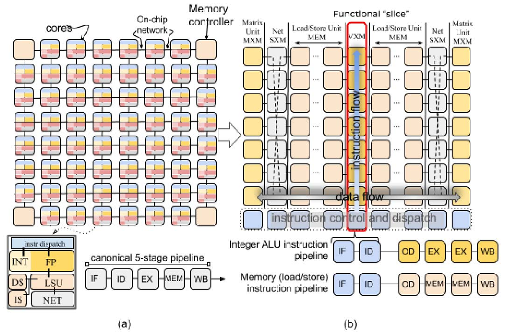

# 引言

世界正在越来越多地使用计算密集型深度学习算法来解决科学、交通、安全等领域的重要问题。
这些工作负载在规模和复杂度上持续增长，对传统 CPU 与 GPU 架构带来了严峻的可扩展性、性能和可用性挑战。
要跟上这种需求，必须配置大量片上 ALU，并在程序执行全过程中让其保持接近峰值的利用率。
然而，许多微架构的硬件复杂性使得运行时停顿难以预测与推理。
此外，虽然缓存、分支预测器与预取器等微架构增强对性能提升很大，但它们无法约束最坏情况性能。
过去十年，数据中心运营商已将多核系统作为仓库级计算机（WSC）的常规配置 [7], [11], [13]。
这些日益异构的系统包含数十个在形态与功能上差异巨大的处理核心，包括 GPU、TPU、FPGA，以及用于高效远程直接内存访问的智能 I/O 控制器。
这些努力主要聚焦于加速深度神经网络训练与推理，覆盖多种工作负载：用于推荐算法、计算机视觉与图像分类的卷积神经网络（CNN），用于自然语言处理的循环神经网络（RNN）[20], [58]，以及如今的注意力与 Transformer 模型 [10], [55]。
这些模型不断增长的计算需求，成为架构创新再度兴起的催化剂 [21]。
对领域专用架构的需求，以及其在云计算生态中的广泛采用 [34], [48]，为面向深度学习应用的全新微架构提供了独特机遇。
一系列创新方案正在涌现，从 Cerebras 的晶圆级集成 [15] 到更传统的芯片多处理器，如 GraphCore 的 IPU [25]。
总体而言，这些努力都聚焦于在数据中心单位机房面积内提供更高的计算能力。
换言之，重点是在固定功耗包络内提升计算密度。
我们的方法基于对传统芯片多处理器组织方式的重新思考，形成了以“张量抽象”为中心的新架构——张量流处理器（TSP）。
TSP 采用分块式微架构，使得向量长度可以方便地按其所代表的底层张量形状进行扩展。
张量计算通过流式处理模型完成，计算单元按功能在空间上排列，使得张量流经时能够利用数据信流的局部性。
这一新方法使我们能获得显著优于现有水平的性能：在 batch size 为 1 时，ResNet50 初步图像分类结果达到每秒 20.4K 张（IPS），相比其他现代 GPU 与加速器提升约 4× [44]。
在本节剩余部分，我们将讨论使 TSP 与众不同的核心架构要素。

## A. 功能切片

为理解我们方法的新颖性，请看图 1(a) 所示的芯片组织。
在传统芯片多处理器（CMP）[56] [12] 中，每个 “tile” 是一个独立核心，并通过片上网络互联以在核心间交换数据。
指令执行通常分为若干阶段 [46]：1）取指（IF），2）译码（ID），3）ALU 执行（EX），4）内存访问（MEM），5）回写（WB）以更新 GPR。
与传统多核“每个 tile 具备异构功能单元，但整体上同质”的组织方式不同，TSP 反其道而行，形成“局部功能同质、全芯片功能异质”的结构。
TSP 将图 1(a) 中同质的二维核心网格重组为图 1(b) 所示的功能切片微架构。
在该方法中，每个 tile 实现一个特定功能，并在二维片上网格的 Y 维度上垂直堆叠为一个“切片”。
我们按功能拆分图 1(a) 中核心的基本元素：指令控制与派发（ICU）、存储（MEM）、整数（INT）运算、浮点（FPU）运算与网络（NET）接口，对应图 1(b) 顶部的切片标注。
二维片上网格的每一行都包含所有功能切片的一个横截面（见图 2）。
在该组织方式下，每个功能切片由一组与其片上角色相匹配的指令序列独立控制。
例如，MEM 切片支持 Read 与 Write，但不支持 Add 或 Mul，这些仅存在于算术功能切片（VXM 与 MXM）中。
所有同一切片的 tile 执行相同的指令流（SIMD），因此我们可将通用的译码与派发逻辑抽离为独立的 tile（ICU），并将正常的指令执行流水线分为两个部分：（i）取指、译码与分发；（ii）读操作数、执行与回写。
这种方法将内存子系统 [52] 与获取操作数/提交结果的功能单元解耦。
每个功能切片实现一条跨越其所有 tile 的 20 级向量流水线，每个 tile 产生 320 元素最大向量长度中的 16 个元素。
这种组织方式自然地将指令流分解到垂直维度，并将数据流分解到水平维度，使其在不同功能类型上流动。
在该处理器组织下，指令执行由不同 tile 完成：ICU 负责取指与译码，而每个功能切片的各个 tile 负责操作数译码、执行与回写，此时（垂直流动的）派发指令与（水平流动的）操作数数据在交点处完成运算。

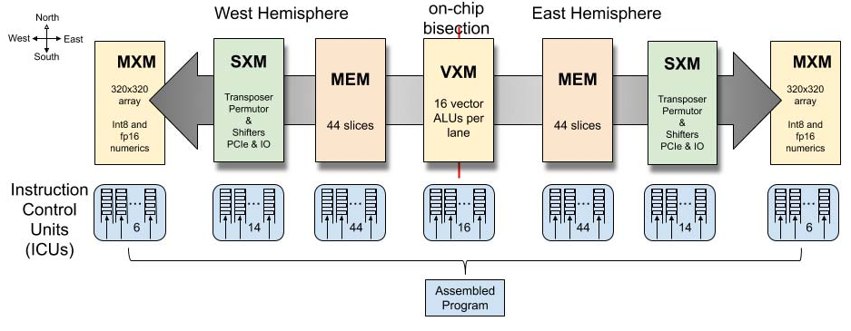

## B. 并行通道与流

每个切片的 SIMD 执行通过一种称为“并行通道（parallel lanes）”的编程抽象提供数据并行性。
这些并行通道对应数据向量的元素，这是许多机器学习框架（如 TensorFlow [2]）中常见的抽象。
在 TSP 模型中，指令从 ICU 向北流向功能切片，而数据（操作数与结果）在功能切片之间向东或向西流动。
向量内部的跨通道数据移动由片上网络（SXM）切片完成。
如图 1 与图 5 所示，片上网络由 X 维与 Y 维的 mesh 构成，并采用 X‑Y‑X 维度顺序路由。
每条指令都会指定第一跳方向（东或西），因此内存指令语义同时包含地址与数据流方向（见图 2）。
流在 X 维通过 MEM 路由，在 Y 维通过 SXM 的置换器与通道移位器进行垂直数据移动。
MEM 与 SXM 在 X 与 Y 维度上提供确定性路由 [16]。
每个流元素是 1 字节，较大数据类型（如 int16、int32、fp32）由多个流组合而成（分别为 2、4、4 个流）。
多字节数据类型总是按照类型大小自然对齐到流上。
数据对齐由编译器完成。
例如，int16 对齐到一对流，int32 对齐到四流组（如 SG4 0 为流 0‑3，SG4 1 为流 4‑7，以此类推）。
在传统 load-store 架构中，通用寄存器（GPR）为 ALU 操作数提供快速访问并存放 ALU 输出。
例如，对两个 N 元素向量 X 与 Y 求和得到 Z（见图 3）。
在该例中，RISC 核心需要循环四条指令执行逐元素加法：Add R1,R2,R3 之前必须先 LOAD R1,X 与 LOAD R2,Y 将操作数搬入 GPR，且 R3 中结果必须用 STORE R3,Z 回写到主存。
在 TSP 架构中，功能切片以生产者‑消费者方式与数据流交互。
也就是说，它们从流中消费操作数，并把结果产生到（可能不同的）流上，类似装配线工位（功能切片）与传送带（流）。
概念上，功能切片固定，数据在其处理单元上流动，如图 2 所示。
当数据流经切片时，每个功能单元可以选择性地截取操作数并计算结果（如果它是 ALU 之类的处理单元），或在网络中移动通道间的数据（如果它是交换单元）。
流提供一种编程抽象，是数据在功能切片之间流动的通道。
与 GPR 不同，功能切片操作的是在芯片上向东或向西流动的并行数据流。
水平流动的操作数流与垂直（向北）流动的指令相交（见图 2），在某个功能切片上完成计算。
编译器精确跟踪芯片的体系结构状态，并利用该知识确保指令正确地截获其流操作数。
流在硬件中由全芯片的流寄存器文件（SR）实现。
它们对体系结构可见，用于在切片之间传递操作数与结果。
一种常见的软件模式是：从一个或多个 MEM 切片读取操作数数据，随后由下游算术切片消费并运算。
运算结果产生到另一个流上，使其能够写回内存。
例如，Z=X+Y 可能需要四条指令：在两个 MEM 切片上执行 Read S1,X 与 Read S2,Y，并将其朝芯片中部送往 INT 切片以执行 Add S1,S2,S3。
最后，结果通过 Write S3,Z 写回内存。
这些流表示一个包含 N 个元素的集合，由每个功能切片以 SIMD 方式操作。

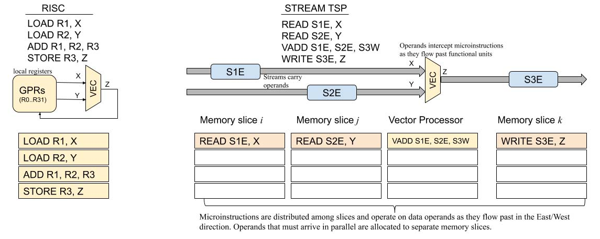

## C. 论文结构

本文其余部分将描述 Groq 张量流处理器（TSP）的微架构，贡献如下：

- 我们介绍功能切片的 tile 微架构，以及建立在其上的流式编程抽象。
- 我们描述 TSP 在 14nm ASIC 技术下的首个实现、内存系统与功能单元、编程模型、指令集架构（ISA）以及在 batch size 为 1 时实现高效运行的设计取舍。
- 我们给出 ResNet50 [27] 图像分类模型的早期性能结果：单样本查询用时不足 49μs，batch size 为 1 的推理吞吐达到 20.4K IPS，相比 Google TPU 或 Habana Labs GOYA 芯片提升约 4‑5×。
- 我们详细讨论面向机器学习工作负载的架构取舍，并总结将 ResNet50 v2 图像分类模型映射到 TSP 硬件的经验。

# 架构概览

张量流处理器架构在软硬件接口上做了若干有意取舍，将与调度相关的复杂性推给编译器。
具体而言，编译器需要精确调度指令，才能正确且高效地使用硬件。
这有时意味着在多种实现算法或“元操作”的方式中进行选择。
移除多发射执行单元的动态指令调度控制复杂性，使得指令控制单元（ICU）可以相对小巧，其面积占比不到 3%。
编译器可以访问如下体系结构可见状态：

- 覆盖在 TSP 方块图（图 5）上的 320 通道编程抽象，其中片上网格的每个 tile 以 SIMD 方式操作 16 通道。
- 我们将这 16 通道单元称为“超级通道（superlane）”，它是芯片上所有功能切片的横截面，也是计算的最小粒度。
- 因而，一个 superlane 表示体系结构的最小向量长度 minVL，即 16 个元素。
- 类似地，20 个 tile 纵向组成一个功能切片（图 5），产生最大向量长度 maxVL，即 20×16=320 个元素。
- 片上共有 144 个独立指令队列（ICU），每个可在每周期发射一条或多条指令，编译器可以显式控制每个队列内的程序顺序。
- 每个通道有 64 条逻辑流用于片上移动操作数或结果，其中 32 条向东、32 条向西（如图 2）。
- 共有 220 MiB 的全局共享 SRAM，可提供每通道 32 字节的流带宽，并以低延迟访问模型参数。
- 例如，MEM 能在不到 40 个周期内（包含 SRAM 与片上网络传输延迟）读出并由 MXM 安装 40 万个权重到四个 320×320 阵列中。

流由标识符 0..31 与方向共同指定，例如 in(28) 表示向内的 28 号流，out(24) 表示朝芯片外缘的 24 号流。
注：本文同时使用“向内/向外”（相对于芯片二分线与外缘）以及“向东/向西”的方位描述，见图 2 与图 4。

如图 2 所示，一个 superlane 的各组件在空间上组织。
TSP 的指令集架构（ISA）定义了跨五类功能区域的指令。
存储（MEM）切片提供的分区全局地址空间（PGAS [6]）赋予向量以内存语义，使其能够从 SRAM 被寻址并装载到具有数据流方向的体系结构可见流中，面向将要对其操作的功能切片。

1）指令控制单元（ICU）通过 Ifetch 提供显式取指，并通过 Sync 与 Notify 指令实现切片间同步，以进行全芯片的屏障同步。
重复 NOP（空操作）指令允许逐周期精确控制指令间延迟，例如编译器可在调度两条操作 A 与 B 时插入 NOP，使其相隔 N 个周期，即 OpA NOP(N) OpB。
2）向量执行模块（VXM）在每个通道内包含 4×4 的 ALU 网格，用于点算术操作。
3）矩阵执行模块（MXM）包含四个（4）独立的二维 MACC（乘加）阵列，支持 int8 或 fp16 数据类型。
4）片上数据移动使用交换执行模块（SXM），通过重新排列向量元素实现 superlane 内与通道间的交换。
SXM 类似于图 1 中用于核心通信的 NET 接口。
MEM 与 SXM 协同形成片上网络的 X 与 Y 维度。
5）片上内存模块（MEM）的东/西半区各由 44 条并行 SRAM 切片组成，提供充分的内存并发以充分利用每个方向的 32 条流。
每条切片提供 16 字节内存字的 13 位物理寻址，每个字节映射到一个通道，总计 220 MiB 片上 SRAM。
6）芯片到芯片（C2C）模块提供 Send/Receive 原语，以在一对芯片之间交换 320 字节向量。
首版 TSP 实现（图 5）共有 16 组 ×4 链路，每条 30 Gbps，总片外带宽为 16 × 4 × 30 Gb/s × 2 方向 = 3.84 Tb/s。
该带宽可灵活分配，以支持大规模系统中 TSP 的高径向互连网络 [37] [49] [3]。
PCIe Gen4 主机接口也由该模块处理。
它提供轻量级 DMA 引擎，将模型装载到 TSP 内存中，并提供启动模型执行的入口。
它还提供向主机传递中断的一般机制，例如在检测到多比特内存错误时可能需要。

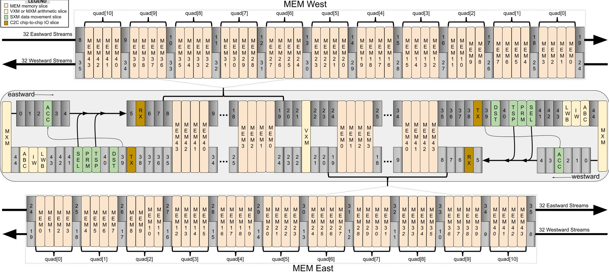

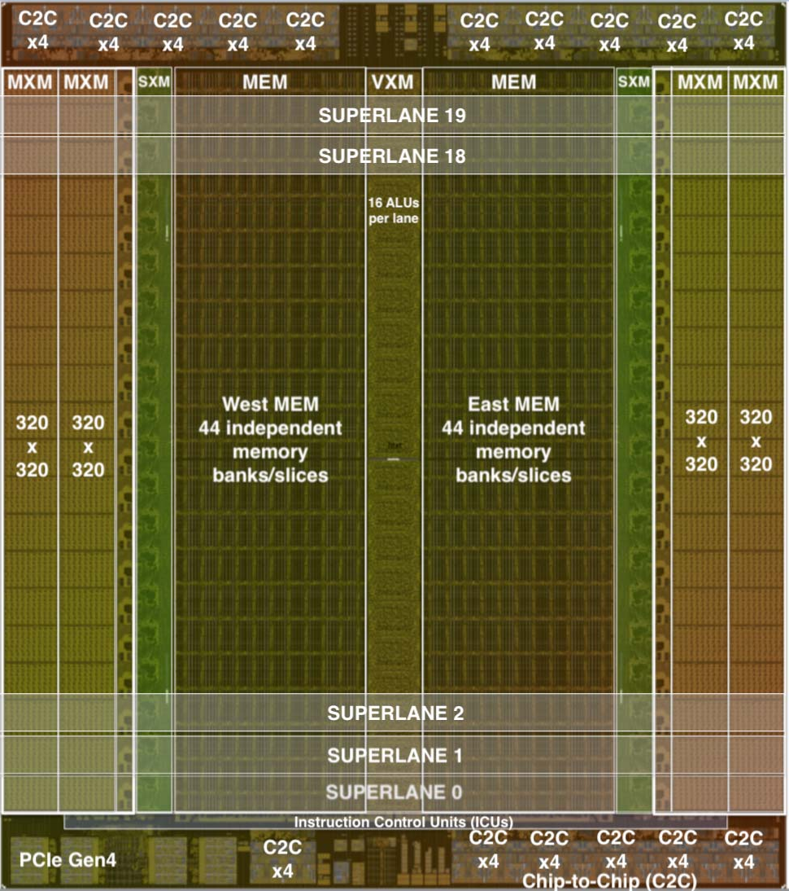

不同功能切片上的指令序列可以链式组合成更复杂的动作，而无需把中间结果写回内存。
这使我们能够以满带宽、最低延迟高效处理流。

## A. 并行流编程模型

机器学习算法通常在给定数据类型（如 int8、fp16）的向量上操作。
我们可以将这些向量视为底层数据的抽象，其元素可由同一操作以 SIMD 方式处理。
TSP 在向量上操作，有时组织为二阶张量，并依赖图下沉编译器将更高阶张量转换为硬件支持数据类型下的二阶张量。
TSP 的编程模型是生产者‑消费者模型，每个功能切片既是一个或多个流的消费者也是生产者。
当一个向量从主存读出时，会被赋予一个流标识符（0..31）以及方向：向东或向西。
一旦向量被读入流寄存器，它就成为一个在该方向“流动”的流，其含义如下：
假设在空间上相邻的功能切片位于坐标 x0、x1、x2（坐标沿流动方向递增），在时间 ti，位于 x1 的切片可将流 s1 的向量作为操作数访问。
同样，位于 x0 与 x2 的切片会访问同一流寄存器的不同流值。
在下一个周期 ti+1，s1 要么传播到 x2 处的功能切片，要么被 x1 切片在周期 t 产生的结果 r1 覆盖。
类似地，时刻 ti 在 x0 处可被功能单元消费的流值 s0，将在下一个周期 ti+1（若 x0 未覆盖该值）出现在 x1 处。
流操作数被导向正在消费它们并产生结果流的切片。
流在整个芯片上持续流动，是切片间通信的方式。
图 4 直观展示了功能单元与流寄存器的交错布局如何支持这种编程模型。

## B. 内存模型

片上内存通过从某个存储（MEM）切片读取地址来为各功能切片提供操作数，记作 MEMi。
内存被划分为两个半区（见图 5），每个半区有 44 条切片，编号 0 到 43，其中 MEM0 最接近 VXM，MEM43 最靠近 SXM。
每条 MEM 切片由 20 个 tile 组成垂直堆叠，每切片容量为 2.5 MiB，合计 88 条切片共 220 MiB。
这 88 条切片提供所需内存并发度，使得每个通道每周期可提供 32 个操作数。
内存切片被划分为 16 字节的字，每个字跨越一个 superlane，每个字节占据一个通道，作为输入通道或输出特征的一部分。
也就是说，字节 0 对应 lane0，字节 1 对应 lane1，依此类推。
每个 tile 产生向量的 ×16 部分，并与其下方相邻 tile 的 16 个元素拼接。
指令在切片的 20 个 tile 上以逐周期交错方式执行；指令在 20 个周期内向北流经每个 tile。
为便于说明，假设核心时钟频率为 1 GHz。
每个 MEM 半区东、西边缘的 MEM 接口所导出的流寄存器带宽 B，足以让功能单元获得充足操作数以饱和其峰值算术能力。
流寄存器提供的读（操作数）与写（结果）总带宽为 20 TiB/s，如式（1）所示。

$$
B = 2 \text{ directions} \times 32 \frac{\text{bytes}}{\text{lane}} \times 320 \text{ lanes} = 20 \text{ TiB/s} \tag{1}
$$

由于 SRAM bank 在流寄存器与 SRAM 单元之间搬运数据，SRAM 带宽 M 必须高于流带宽 B。
片上内存的 SRAM 带宽由式（2）给出。

$$
M = 2 \text{ hem} \times 44 \frac{\text{slices}}{\text{hem}} \times 2 \frac{\text{banks}}{\text{slice}} \times 320 \frac{\text{bytes}}{\text{cycle}} = 55 \text{ TiB/s} \tag{2}
$$

这相当于 55 TiB/s 的片上内存带宽，或每个半区 27.5 TiB/s 的 SRAM 带宽。
取指（见第 III‑A3 节）最多消耗 144×16 = 2.25 TiB/s 的 SRAM 带宽。
每个 MEM 半区从其 27.5 TiB/s 的 SRAM 带宽中输出 20 TiB/s 的流带宽，还需满足跨所有功能切片的 2.25 TiB/s 最大发射速率。
在 27.5 TiB/s 的 SRAM 带宽与 2.25 TiB/s 的取指带宽后，仍有 25 TiB/s 的 SRAM 带宽可用于为操作数与结果提供 20 TiB/s 的流寄存器带宽。

## C. 交错指令执行

在 TSP 编程模型中，指令在编译器调度的时间 t 发射到某个功能切片上，并以 SIMD 方式在流提供的操作数向量（最多 320 元素）上执行，产生等长的结果向量并写入结果流。
在微架构层面，320 元素 SIMD 指令在切片的垂直 tile 堆栈上流水化。
也就是说，在调度时间 t，指令发射到切片最底部 tile（对应第一个 16 元素 superlane 的操作数/结果向量）。
在下一周期，指令向北传播到下一个 tile，在那里对下一组 16 元素 superlane 执行。
该过程逐周期继续，直到穿过切片的全部 20 个 tile。
上述垂直指令流水化与操作数/指令必须精确相遇的要求结合，导致 SIMD 操作数与结果数据在空间上出现“交错”，如图 6 所示。
如图所示，一个 320 字节向量（以 20 个黑方块表示）沿流向东移动。
连续的 16 元素 superlane 数据相差 1 个周期，以配合在时间 t1 发射到最南端 tile 的 MXM 指令的流水执行。

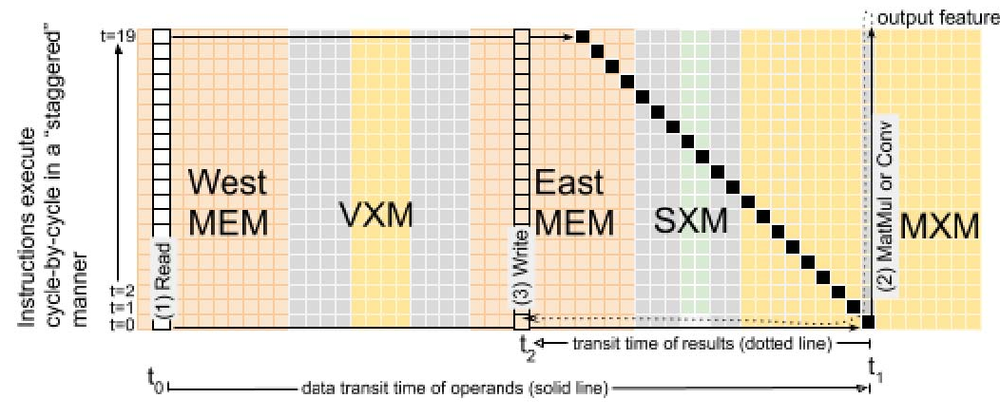

## D. 错误处理与可靠性

仓库级计算机 [11] 中的大规模部署要求在可能的情况下采用硬件纠错，以抵御瞬态错误。
用于保护 SRAM 向量的纠错码（ECC）也用于片上流寄存器中流动的数据。
由于内存系统高度分 bank 且有复制，我们希望避免在宽达 128 位的内存字上复制用于 ECC 计算的 XOR 树。
因此，我们利用流式编程模型的生产者‑消费者特性，只在生产者处生成 ECC 校验位，并将其与 128 位内存字一起存储为 9 位 ECC，总计 137 位。
该 ECC 方案采用 SECDED（单错纠正、双错检测），可容忍内存字或流式数据路径任意位置的单比特错误。
当某个功能切片将要对流进行操作（即消费流）时，会先检查 ECC 位以确保数据完整性。
该机制既覆盖 SRAM 的软错误，也覆盖流寄存器数据通路可能产生的软错误。
操作数或指令文本中的软错误翻转（SEU）会被自动纠正并记录在控制与状态寄存器（CSR）中，供错误处理器后续查询。
这些瞬态软错误及其自动纠正是芯片老化的早期信号，常用于在大规模系统中识别边缘芯片。

## E. 功能切片链

每个功能切片都有预定义的指令集合（如 Read、Write、Add、Mul 等）来定义其支持的操作。
此外，功能切片从流中消费操作数并向流产生结果。
更复杂的操作序列（微程序）由一个或多个切片以生产者‑消费者方式协同完成，产生一个或多个输出流。
这是通过将多个切片逻辑上“链式”连接起来完成的：从上游切片消费输入数据，对数据进行运算并产生新的结果流，随后由下游切片以相同方式继续消费。
一般而言，每个功能切片可以选择其结果流方向，因此流可以在任意切片处“掉头”（即从东向西或从西向东反向）。
通过这种在数据流上协同的生产者‑消费者模型，我们可以将不同功能切片链式组合成更复杂的操作，如式（3）所示，其中复合函数 F 是多个功能切片链式组合的结果。

$$
F(x, y, z) = MEM(x) \rightarrow SXM(y) \rightarrow MXM(z) \tag{3}
$$

这种数据流组合使我们能够利用“数据流局部性”，让相同数据跨越多个功能切片，并由其中任意切片选择性地产生输出流。
一个功能切片的输出可以作为另一个切片的输入，通过共享的流寄存器实现逻辑链式操作。

## F. 可伸缩向量

TSP 硬件支持的底层数据类型是向量。
每个向量的元素个数可从 16（一个 superlane）扩展到 320（使用芯片上的 20 个 superlane）。
也就是说，最小向量长度 minVL 为 16 字节，最大向量长度 maxVL 为 320 字节的元素数组。
与典型的 x86 SIMD 扩展（如 AVX512b [31]）相比，maxVL=320 字节相当长。
由于向量长度（VL）可在 16 至 320 元素间变化，我们提供指令将每个 tile 配置为低功耗模式，从而关闭未使用的 superlane（网格的一行）以降低功耗。
这种可伸缩向量的方法允许我们以 16 通道步进将 VL 从 16 增长到 320 字节，同时关闭未使用的 tile，从而构建更符合能量比例的系统 [14]。

# 指令集

TSP 的指令集架构（ISA）暴露每条指令的时间信息，使编译器能精确控制指令派发时间。
我们为每条指令附加以下时间参数：

- d_func 功能延迟：每条指令产生其流输出需要 1 个或多个周期。
- d_func 参数使编译器能够推断指令输出何时出现在体系结构可见的流寄存器上。
- d_skew 指令‑操作数偏斜：指令派发时间与其流操作数需要到达的时间关系。
- d_skew 参数告知编译器如何安排操作数到达时间与指令派发时间，以便它们在时间与空间上正确相交。

这些参数用于精确跟踪指令与操作数之间的空间关系。
从概念上讲，编译器在时间与空间两个维度上求解指令与数据的二维调度（即图 4 中流寄存器的片上位置）。
指令的执行时间包含指令功能延迟，以及从流寄存器位置 i（SRi）到 j（SRj）的流传播（传输）延迟，如图 4 中 superlane 数据流所示。

$$
T = N + d_{func} + \delta(j, i) \tag{4}
$$

式（4）中，T 为指令执行时间，N 为功能切片内 tile 的数量，d_func 为所执行指令的功能延迟（周期），用于描述输出流在 SRi（图 4 中位置 i 的流寄存器）出现并继续流向 SRj 的时间。
传输延迟 δ(j, i) 为 SRj 与 SRi 之间的距离（以周期计）。
TSP 编程模型依赖两个关键要素：（1）硬件中的确定性数据通路；（2）通过 ISA 暴露指令执行延迟的时间信息，使编译器后端能精确跟踪任意流在片上的位置与使用时刻。
在静态‑动态接口 [43] 上暴露这些额外的时间信息，产生了“软件定义硬件”的效果。
本节其余部分概述每类功能切片可用的不同指令，并给出汇编示例。

## A. 指令控制单元（ICU）

指令控制单元（ICU）中的指令对所有功能切片通用。
因此它们包含 NOP 与 Repeat 等通用指令，以及 Sync 与 Notify 等同步原语，使独立的功能切片能够初始对齐，从而便于编译器推理指令执行时间并在片上实现协同并行。

清单 1：流式加法示例（对应图 3）。
该示例展示了创建两个随机张量、将其读入不同流、在流上执行逐元素加法，并将结果写回内存的过程。

```python
import groq.api as g
x = g.random_tensor(shape=[1024, 320],
                    dtype=g.Int8)
y = g.random_tensor(shape=[1024, 320],
                    dtype=g.Int8)
x_strm = x.read(stream='S_0')
y_strm = y.read(stream='S_4')
z = g.add(x_strm, y_strm, stream='S_0')
out_addrs = g.malloc([1024, 320])
z.write(out_addrs)
```


1）空操作（No‑op）：
编译器使用显式 NOP 在程序顺序中为两条指令提供时间间隔。
NOP 具有 16 位重复计数字段，使单个 NOP 在 1 GHz 时钟下可等待 1 ns 到 65 μs。
编译器用 NOP 控制功能切片与其操作数据之间的相对时序。
重复 NOP 在 ICU 的 tile 中实现，且对所有功能切片通用。
当 NOP 持续超过几个周期时，它允许切片关闭时钟使能。
虽然 NOP 可能是最常用的指令，但对程序员并不可见，因为编译器会隐式插入它们。

2）同步（Synchronization）：
每个功能切片是独立的，但编译器会跟踪一个逻辑程序时间。
概念上这类似传统 CPU 的程序计数器，但编译器以逐周期方式跟踪 144 个独立指令队列（IQ）的状态。
因此在逻辑时间 t，编译器知道芯片上每个 IQ 的状态。
我们使用 NOP 指令来协调同一 IQ 内部或不同 IQ 之间指令的时序关系。
除了重复 NOP 之外，还必须提供跨全芯片功能切片的更高层同步，以保证程序正确性。
这正是 Sync 与 Notify 的作用。
它们提供了跨 144 个独立队列的屏障同步机制。
一个 IQ 被指定为通知者并发出 Notify 指令，其他所有 IQ 停在 Sync 指令上——收到 Notify 后会广播给所有 IQ，以满足挂起的 Sync 并恢复指令流。
该屏障同步仅在芯片复位后需要一次。
但在实践中，我们在每个程序开始时插入一组“前导”指令以配置各 tile，并执行一次 Sync，确保所有功能切片对齐到同一逻辑时间。
从发出 Notify 到 Sync 被满足并退役，使后续指令继续流动，全芯片屏障同步可在 35 个时钟周期内完成。
完成这一强制屏障同步后，功能切片可通过流寄存器在无需同步的情况下计算与通信，并利用芯片的简单时序模型（见图 4）来推理程序正确性。

3）取指（Instruction fetching）：
Ifetch 指令只有一个流操作数，用于携带指令文本并按程序顺序填充 IQ，每次填充 640 字节（两个 320 字节向量）的指令。
所有功能切片可在正常指令执行的同时进行取指。
编译器对程序文本进行“全知式”预取，通过在每个切片的指令流中插入 Ifetch，保证 144 个 IQ 在每个周期保持忙碌。
必须确保 IQ 永不为空，以维持全芯片一致的“逻辑时间”概念。

## B. 存储（MEM）

存储（MEM）切片提供“分区全局共享地址空间”的编程抽象，地址空间在 88 条切片上均匀分布。
每条 MEM 切片包含伪双端口 SRAM，可在同一周期同时服务一对读写请求，前提是它们不访问同一 bank。
因此我们暴露 bank 位，使编译器能高效、恰当地管理底层 SRAM。
这使编译器能够利用最高 176 路内存并发（88 条切片，每条 2 个 bank）来读取操作数或存储结果。
每条 MEM 切片同时支持直接寻址与流间接寻址模式。
Read 与 Write 使用直接寻址，因为地址在指令中已完整指定。
间接寻址使用流 s 的内容指定地址映射，用于 gather 或 scatter。
在间接寻址中，物理地址来自流值，从而在内存访问中引入一层间接。

## C. 向量执行模块（VXM）

每个 superlane 实现一个 4×4 的向量 ALU 网格，可进行 ×16‑SIMD 计算，即每个通道 16 个向量 ALU。
每个 ALU 的 32 位输入操作数以自然对齐的四流组（SG4）组织。
向量 ALU 不生成条件码或状态标志，它们是无状态的。
相反，VXM 为加法与乘法提供饱和与取模两种变体（add_sat、add_mod、mul_sat、mul_mod），以支持不同的异常处理语义。
TSP 支持在每个通道内将两个或多个向量 ALU 链式连接，从而在不提交中间结果到主存的情况下执行多步 ALU 运算，减少中间结果的写回与后续读出。
这使得批归一化、量化，或更复杂的激活函数（如 leaky ReLU）等算法可以高效并行实现。

## D. 矩阵执行模块（MXM）

矩阵执行模块（MXM）提供四个（4）独立的 320×320（见图 7）乘加（MACC）阵列。
每个 320×320 平面由 20 个 16×16 的超单元组成，每周期产生部分和并传递给相邻 tile 继续计算。
每周期需要 16 条流、每条 16 字节来在每个超单元安装 256 个 8 位权重（IW）。
在每个方向使用全部 32 条流，可在 MXM 的两个半区同时向两个平面装载权重，从而在不到 40 个周期内将 409,600 个权重装入片上。
权重安装完成后，MXM 每周期可生成一个新的 int32 点积结果（输入激活与已安装权重）。
MXM 的输出特征可在每条 int32 或 fp32 输出流上使用累加器进行累加。
MXM 同时支持 8 位整数与 16 位浮点数值，通过两个 320×320 字节平面并行实现 16 位浮点结果。
每个输出的 320 元素和仅在末尾进行一次舍入，以转换为 int32 或 fp32 结果。

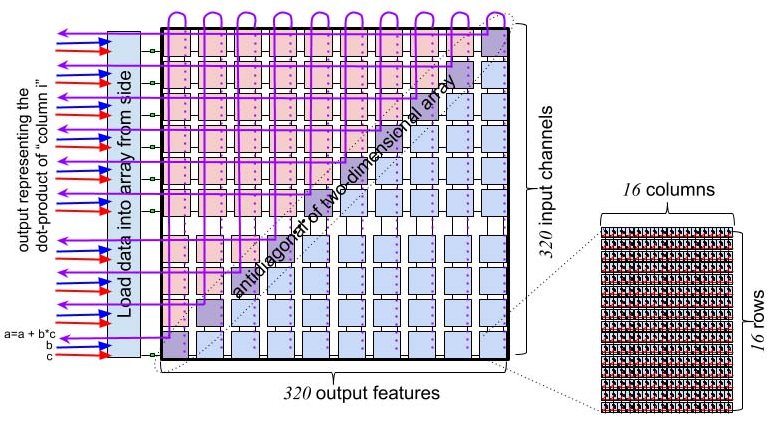

## E. 交换执行模块（SXM）

交换执行模块（SXM）包含若干用于转置、置换、移位与旋转数据元素的功能。
这些操作用于执行 ML 工作负载常见的张量重排，并实现图 1 中 NET 切片的功能。
片上数据移动在二维上路由：在 X 维度上水平传播流，在每个 superlane 内在 SRAM 与功能单元之间穿梭；在 Y 维度上通过 SXM 将流在南北方向移动。
SXM 提供两组通道移位器，可在南北方向执行移位指令（见图 8）。
通道移位器通常成对使用，因为我们通常需要将向量上移或下移，并在（i）北向移位、（ii）南向移位、（iii）未移位的数据中进行选择，如图 8 详示。
此外，SXM 提供置换指令，通过编程的双射映射重排 320 个通道在一组同索引流上的位置，每个 superlane 一条流。
SXM 内的 distributor 切片用于在每个 superlane 内任意重排 16 个通道。
流经过 distributor 时，可在满带宽下重新映射，或将任意元素置零。
这为零填充或重排 4×4 滤波器元素等常见张量操作提供了高效机制。
转置张量维度是张量数据类型中的常见操作。
TSP 支持对 256 个元素进行二维转置，这些元素组织为 16 条流、每条 16 个元素。
转置操作将 16 条输入流变为 16 条输出流，并交换行与列。
这使我们能够将原子 16 字节 MEM 字高效地分布到 16 条不同 MEM 切片中，从而可被寻址。
片上有两个 SXM 实例，分别位于两个半区（见图 5）。
每个实例可发出两条转置指令，因此最多可同时执行四个 16×16 转置。

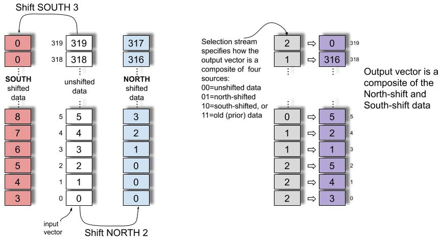

表 1：各功能切片的指令汇总。

| 功能切片 | 指令 | 说明 |
| --- | --- | --- |
| ICU | NOP N | 空操作，可重复 N 次以延迟 N 个周期 |
| ICU | Ifetch | 从流或本地内存取指 |
| ICU | Sync | 停在指令派发队列头部，等待屏障通知 |
| ICU | Notify | 释放挂起的屏障操作，恢复指令流 |
| ICU | Config | 配置低功耗模式 |
| ICU | Repeat n, d | 将上一条指令重复 n 次，迭代间隔 d 个周期 |
| MEM | Read a,s | 读取地址 a 处向量到流 s |
| MEM | Write a,s | 将流 s 的内容写入主存地址 a |
| MEM | Gather s, map | 按 map 指向的地址进行间接读并放入流 s |
| MEM | Scatter s, map | 将流 s 间接写入 map 指向的地址 |
| VXM | unary operation | z = op x，对单操作数 x 的逐点操作产生结果 z（如 mask、negate） |
| VXM | binary operation | z = x op y，对操作数 x 与 y 的逐点操作产生结果 z（如 add、mul、sub） |
| VXM | type conversions | 定点与浮点之间的类型转换 |
| VXM | ReLU | 线性整流激活函数 max(0, x) |
| VXM | TanH | 双曲正切激活函数 |
| VXM | Exp | 指数运算 e^x |
| VXM | RSqrt | 反平方根 |
| MXM | LW | 从流将权重加载到权重缓冲区 |
| MXM | IW | 从流或 LW 缓冲区将权重安装到 320×320 阵列 |
| MXM | ABC | 激活缓冲控制，用于启动与协同到达的激活 |
| MXM | ACC | 累加 MXM 产生的 INT32 或 FP32 结果 |
| SXM | Shift up/down N | 按 N 个通道上移/下移，并在南/北移位向量间选择 |
| SXM | Permute map | 对 320 个输入进行双射置换，得到 320 个输出 |
| SXM | Distribute map | 在一个 superlane（16 通道）内重排或复制数据 |
| SXM | Rotate stream | 旋转 n×n 输入，生成所有旋转的 n^2 条输出流（n=3 或 4） |
| SXM | Transpose sg16 | 转置 16×16 元素，生成行列互换的 16 条输出流 |
| SXM | Deskew | 管理跨近同步链路的倾斜 |
| C2C | Send | 发送 320 字节向量 |
| C2C | Receive | 接收 320 字节向量并放入主存 |

# ResNet50

本节介绍我们在 TSP 硬件上实现 ResNet50 [27] 的早期结果与经验。
在新硬件 bring‑up 过程中，软件栈至关重要，因为它要将底层张量操作映射到实现它们的 TSP 指令集。
编译器还负责张量（权重与激活）以及描述模型本身的程序文本的内存管理。
MEM 系统为编译器提供了扁平、全局共享的地址空间，总容量 220 MiB。
作为策略，编译器会预留若干 MEM 切片作为“指令派发”切片，用于存放机器码指令，并通过流供不同功能切片的 Ifetch 使用，最终在这些切片上执行。
总体目标上，模型实现希望最大化功能切片利用率并最小化延迟。
这意味着尽可能利用将操作数流式送入 MXM 与 VXM 的方式。
四个 320×320 的 MXM 平面用于矩阵乘法。
每通道的 16 个向量 ALU 负责对 MXM 的 int32 输出进行重新量化，产生 int8 结果，并通过 ReLU [8] 激活函数流式输出。
从性能与功耗角度看，当可能时我们希望将一个功能切片（如 MXM）的结果直接链到另一个功能切片（如 VXM）的输入，避免将中间结果读写到 MEM。
图 10 展示了程序逐层执行时的功耗变化。
功耗峰值对应我们同时执行四个 conv2d 操作、使 TSP 算术吞吐达到饱和的周期。

## A. 显式管理内存

为最大化流并发，编译器将张量的并发流操作数分配到不同 MEM 切片中——当流穿过 MEM 系统时，会沿途“拾取”来自各 MEM 切片的操作数并送往 MXM。
这种细粒度内存管理要求我们在 ISA 中暴露不同层级的内存并发度，使编译器能够显式调度每个 MEM 切片内的 bank。
存在一些用例，我们会在同一切片中同时从一个 bank 读操作数并向另一个 bank 写结果。
例如，转置指令接收 16 条输入流并产生 16 条输出流（行列互换）。
通过暴露 MEM 切片内的 bank 并发，我们可利用伪双端口 SRAM，在同一切片内实现一次读入、一次写出的双读写访问。
图 11 给出了这种并发的示例，展示了在最大池化操作中不同操作（读、写、转置、旋转等）的组织。
在图 11 中，实线表示操作数流，虚线表示结果数据流。
我们可以看到 16 条并发流由 Read(1) 从内存读出，送往 SXM 进行转置，随后 16 条流结果回到 MEM 并由 Write(1) 写入 SRAM。
由图可知，每个操作之前都有读指令提供流操作数，之后都有写指令将结果提交回 MEM。
传统 CPU 依赖内存层级结构在缓存之间隐式移动数据以服务 load/store。
缓存层级在数据路径中引入“反应式”代理与不确定性（非确定性），从而在内存层级中营造顺序一致性事务的错觉。
TSP 的 MEM 系统不同于传统 CPU。
相反，我们提供一层轻量的内存管理，用于在逐操作层面识别内存并发。
例如，下面的示例描述了转置操作的内存管理；该指令以 16 条流为输入并生成 16 条输出流。
malloc 函数返回跨 16 条内存切片分配的地址张量，每条切片对应一条并发流。

清单 2：内存管理示例。
该示例展示从 16 个切片读入 16 条流，执行转置，并将 16 条输出流写回 16 个切片的过程。

```python
# Read from 16 slices onto 16 streams
# Transpose data
# Write from 16 streams into 16 slices
import groq as g
tensor = g.random_tensor(shape=[1024, 320],
                         dtype=g.Int8, layout=[64, 16])
streams_16 = tensor.read(streams=range(16))
streams_16_t = g.transpose16(streams_16)
out_addrs = g.malloc(shape=[1024, 320],
                     layout=[64, 16])
streams_16_t.write(out_addrs)
```


## B. 资源瓶颈

为了最大化片上资源价值，我们希望充分利用最昂贵的资源，在 TSP 中即四个 320×320 的 MXM MACC 阵列以及为其供给的 MEM 切片。
在 ResNet50 实现中，我们发现 ALU 资源在最重的计算操作（卷积与矩阵乘）之间保持较好平衡，能够以满带宽将结果通过 VXM 进行重新量化与 ReLU，为下一层操作做准备。
少数情况下，VXM ALU 资源无法以满带宽流式处理，原因包括需要在 VXM 上执行的操作数量过多（即软件流水线深度），但该吞吐延迟较短，或可通过 VXM ALU 的并行性与每个 ALU 内对 Int8 数据的并发来最小化。

## C. 优化

ResNet50 的首个版本使用将操作分布到全芯片的算法，以充分利用 MXM 与 VXM 的计算性能。
ResNet50 中常见的模式是 Read → Conv2D → Requantize → ReLU → Write。
ResNet50 各层的张量规模足够大，可以在数百个周期内持续将数据流经 MXM 与 VXM。
下一条流水线在功能切片可用之前无法启动。
整个张量会被流经该流水线并写回内存，作为在下一条流水线前的延迟。
这种层级流水线方法在流水线填充与排空时产生延迟气泡，导致资源在开始与结束阶段未被充分利用。
初始的内存分配还导致在前一条流水线排空时无法启动下一条流水线，因为存在内存切片争用。
通过调整输入/输出张量的内存分配模式，将数据分散到多个切片，并在切片内精心交织 bank，我们能够在前一条流水线写入结果尚未完成时，从内存读出其输出。
这些优化进一步将 ResNet50 的总体延迟降低约 5,500 个周期，达到当前 20.4K IPS 的性能。

## D. 量化

在 ResNet50 的初始实现中，我们选择了训练后、按层的对称 int8 量化策略，用于卷积与矩阵乘。
MXM 接受 int8 或 fp16 输入，并分别累加到 int32 或 fp32。
这些值随后被重新量化回 int8 或 fp16。
VXM 具备 fp32 处理能力，可与 4 个 MXM 平面的输出速率匹配地流式处理。
该方法在矩阵乘与卷积之间提供更高精度，从而提升模型总体精度。
与对每个操作单独量化相比，其量化损失更小（约 0.5%）。
该初始方法仍有改进空间。
流式架构具有按轴非对称量化的能力，未来版本将采用该方法，以降低量化精度损失。

## E. 模型精度

MXM 具有 320×320 的矩阵乘能力。
ResNet50 各层的通道深度是 2 的幂。
卷积的输入/输出通道深度决定权重维度。
320×320 容量与 256×256 权重维度的错配导致 MXM 在多次分批执行中被低效利用。
通过使模型贴合 MXM 容量，我们能够在不增加延迟的情况下提升计算量。
我们训练了一个通道深度更大的 ResNet50 变体，以充分利用 MXM 容量。
我们发现额外权重有助于提升 fp32 模型精度。
标准 ResNet50 训练得到 Top‑1 75.6%、Top‑5 92.8%，而该变体在充分利用 320 元素 VL 的情况下，训练得到 Top‑1 77.2%、Top‑5 93.6%。
这一令人鼓舞的结果表明，在使用 maxVL=320 时，可利用额外模型容量在不增加计算成本与延迟的前提下提高精度。

## F. 确定性性能

TSP 硬件消除了仲裁器等反应式元素，使性能在不同运行之间保持确定且可精确预测。
在 ResNet50 模型中，我们可以确定每一层的精确延迟。
ResNet101 与 ResNet152 在结构上与 ResNet50 相同，只是多了一组重复层。
基于 TSP 上 ResNet50 的实测性能，我们可以逐周期预测 ResNet101 与 ResNet152 的性能。
根据当前 ResNet50 实现，ResNet101 吞吐将为 14.3k IPS，ResNet152 吞吐将为 10.7k IPS。

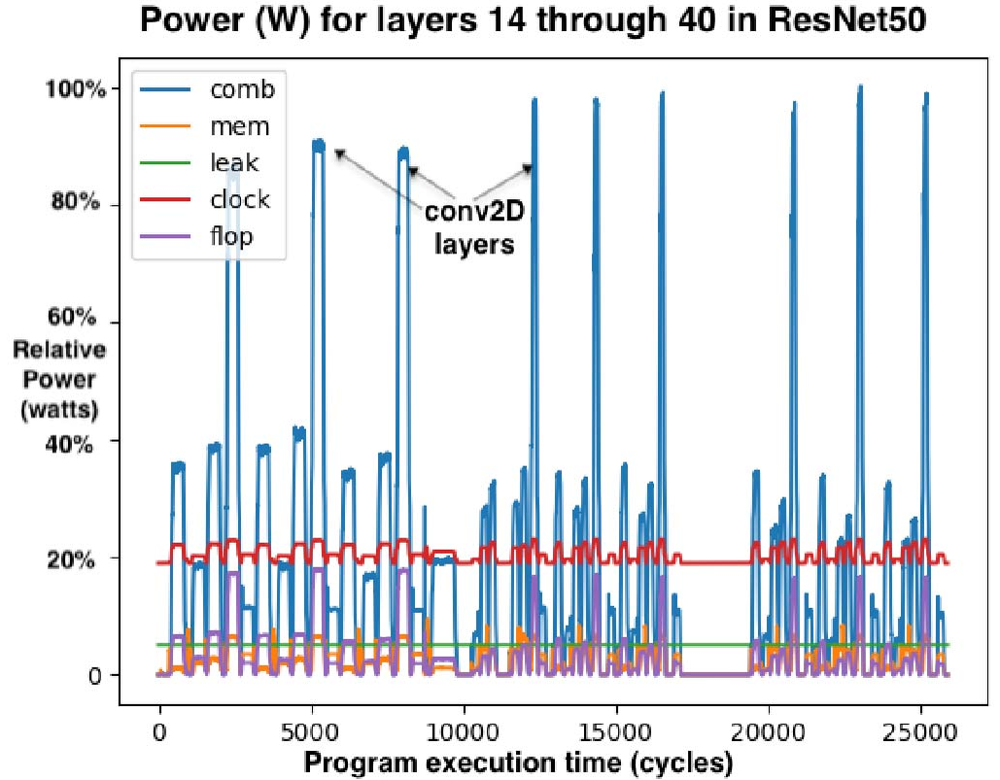

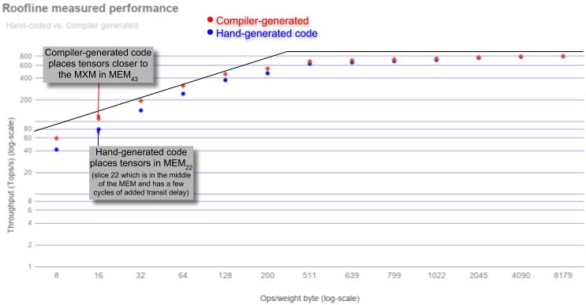

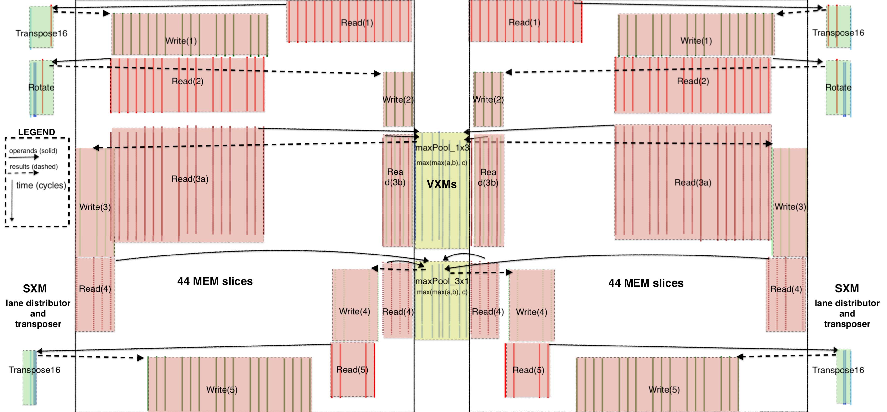

# 讨论

本节描述将 ResNet50 [27] v2 图像分类模型映射到 TSP 的初步验证与性能结果。
在展开讨论前，作者指出：我们在 2019 年 7 月从代工厂拿回硅片，距 ISCA 论文截止仅五个月。
在这短时间内，我们验证了 A0 芯片，并在新的架构、编译器、汇编器及调试/可视化工具链上实现了 ResNet50。
尽管如此，我们的 ResNet50 初始实现仍是编译器验证的 proof‑point 与参考模型：一次 ResNet 推理查询耗时 < 43 μs，吞吐 20.4K IPS，每张图片作为独立查询（即 batch size 为 1）。
这相对于 Google TPU v3 [44] 的大 batch 推理提升约 2.5×。
更重要的是，TSP 单样本推理延迟仅 49 μs，几乎是 Intel/Habana Goya [1] 批 1 推理延迟（240 μs [44]）的 1/5。

a）运行区间：
图 9 的屋顶线图 [57] 为理解芯片不同运行区间提供直观框架，其性能受限于（i）片上内存带宽或（ii）算术性能，二者由图中斜率峰值分界。
斜率区域表示 TSP 在为后续 conv2D 或 MatMul 装载权重到 MXM 阵列时变为内存带宽受限。
“屋顶线峰值”表示算术单元达到峰值利用率并受算术性能限制的点。

b）矩阵操作：
矩阵操作是 ML 工作负载的主力。
MEM 切片可在不到 40 个周期内从内存读取 409,600 个权重并装入四个 320×320 的 MXM 阵列，包含 SRAM 与片上网络传输延迟。
这之所以可行，是因为 MEM 切片为 320 条并行通道中的每条提供 32 条 1 字节流操作数，即向 MXM 注入 10 TiB/s 的操作数流带宽。
图中标注的数据点为测得结果，模型权重在 MEM 中布局，使其位于芯片中部的 MEM 切片附近。
也就是说，理想情况下编译器应将张量布局在 MEM 切片中，以最小化从 MEMi 到 MXM 的数据传输。

c）片上网络：
传统片上通信通常通过在核心之间路由分组 [19] 完成，分组经历路由、仲裁与输出端口调度，容易产生冲突，从而引入非确定性并需要流控 [16], [17]。
然而，在 TSP 中，每个核心时钟周期，流值按其流动方向在流寄存器之间前进一个 hop（见图 4）。
TSP 硬件不跟踪源或目的切片，流只是向东或向西传播，直到从芯片边缘流出或被某个功能切片覆盖。
与这种更传统的片上网络相对，TSP 使用每个 MEM 中的流寄存器（见图 4 的编号）在 X 维度（superlane）移动数据，并使用 SXM 在 Y 维度通过通道置换移动数据。

# 相关工作

GraphCore 的 IPU [25] 使用超过 1200 个核心，每个核心带有 256 KiB SRAM，总容量约 300 MiB 用于模型参数。
然而，GraphCore 的 IPU 采用批同步通信，会隐式同步。
相比之下，我们的流式编程模型不需要对生产者与消费者进行显式同步，除非在程序开始时进行一次同步。
粗粒度可重构架构（CGRA）[47] 关注高度规则的通信模式与图像变换，使 ML 工作负载近乎“尴尬并行”。
它们将张量操作映射到模式存储单元（PMU）与模式计算单元（PCU）。
Stanford Imagine [35] 与 Merrimac [18] 流式超级计算机将流构件映射到本地寄存器文件的编程层级，每个计算簇都可访问自身的流寄存器文件 bank 以在簇间通信。
相比之下，TSP 架构没有本地寄存器文件或用于通信的 FIFO，而是依赖全芯片的流寄存器在各功能切片的处理单元之间传递结果。
既有研究 [5], [9], [23], [26], [32], [33], [38], [51] 通过在存内计算、可变比特宽、压缩或局部性感知设计来减少片外通信。
由于 TSP 包含大量确定性的片上内存，我们避免频繁访问片外内存。
还有多项提案基于稀疏性进行剪枝 [45], [60]，基于模型或领域特定的数据模式 [4], [22], [24], [28]–[30], [36], [41], [50], [54], [61], [62]，或进行通信优化 [39], [40], [53]。
为了保持严格的确定性执行时间与功耗曲线，TSP 不采用这些优化。

# 结论

本文介绍了第一代 Groq 张量流处理器（TSP）的新型硬件架构。
TSP 架构将传统二维核心网格重组为功能切片的 tiled 微架构，可从最小向量长度 16 元素扩展到最大向量长度 320 元素。
它能够利用 superlane 内的数据流局部性显著降低延迟。
充沛的片上内存带宽可并行喂满四个 320×320 的 MXM 乘加阵列，以执行 MatMul 与 conv2D 等 ML 应用的核心操作。
此外，320 条并行通道每条都有 16 个强大的向量处理器，共计 5,120 个向量 ALU，支持 32 位定点与浮点运算。
同时支持 int8 与 fp16 原生数据类型，使单芯片方案可兼顾量化推理与浮点训练。
现代 ASIC 技术在单芯片上可集成约 250 亿个晶体管。
总体而言，我们将晶体管用于（1）定点或浮点 ALU 的计算，以及（2）在 ALU 之间存储与通信数据。
我们希望最大化能够以满带宽喂入操作数的 ALU 数量。
因此，架构从底层 CMOS 技术中“提取价值”的转换率，可用“每晶体管可执行的深度学习操作数（即原始性能）”来衡量。
第一代 Groq TSP（1 GHz，14nm ASIC，PCIe CEM 形态）在 26.8B 晶体管上达到 820 TeraOps/s 峰值性能，即 30K 深度学习 Ops/s/晶体管。
相比之下，Volta 100 在 12nm ASIC、815 mm²、21.1B 晶体管下可达 130 TeraFlops 混合精度运算，对应 6.2K Ops/s/晶体管。
与领先 GPU [42], [44], [59] 相比，TSP 架构提供约 5× 的深度学习计算密度。
我们在真实应用性能上也观察到直接的加速：batch size 为 1 的吞吐提升近 4×，推理延迟降低近 4×，均优于领先的 TPU、GPU 与 Habana Labs 的 GOYA 芯片。

# 致谢

在任何从想法起步的新项目中，都需要大量人员与努力将其综合并落地。
我们感谢 Christopher Clark、Sushma Honnavara‑Prasad、Greg Thorson 与 Srivi Dhruvanarayan 对项目的早期贡献。
我们也感谢 Michelle Tomasko 在工程进度紧张的情况下鼓励发表这些早期结果。

# 参考文献
[1] Habana Lab’s GOYA inference chip. https://habana.ai/wp-content/uploads/pdf/habanalabsgoyawhitepaper.pdf.

[2] Martı́n Abadi, Paul Barham, Jianmin Chen, Zhifeng Chen, Andy Davis, Jeffrey Dean, Matthieu Devin, Sanjay Ghemawat, Geoffrey Irving, Michael Isard, Manjunath Kudlur, Josh Levenberg, Rajat Monga, Sherry Moore, Derek G. Murray, Benoit Steiner, Paul Tucker, Vijay Vasudevan, Pete Warden, Martin Wicke, Yuan Yu, and Xiaoqiang Zheng. TensorFlow: A System for Large-Scale Machine Learning. In Symposium on Operating Systems Design and Implementation (OSDI), pages 265–283, Savannah, GA, November 2016.

[3] Jung Ho Ahn, Nathan Binkert, Al Davis, Moray McLaren, and Robert S. Schreiber. HyperX: Topology, Routing, and Packaging of Efficient Large-Scale Networks. In Conference on High Performance Computing Networking, Storage and Analysis (SC), pages 1–11, 2009.

[4] V. Akhlaghi, A. Yazdanbakhsh, K. Samadi, R. K. Gupta, and H. Esmaeilzadeh. SnaPEA: Predictive Early Activation for Reducing Computation in Deep Convolutional Neural Networks. In International Symposium on Computer Architecture (ISCA), pages 662–673, 2018.

[5] Berkin Akin, Zeshan A. Chishti, and Alaa R. Alameldeen. ZCOMP: Reducing DNN Cross-Layer Memory Footprint Using Vector Extensions. In International Symposium on Microarchitecture (MICRO), pages 126–138, 2019.

[6] George Almasi. PGAS (Partitioned Global Address Space) languages. Encyclopedia of Parallel Computing, pages 1539–1545, 2011.

[7] Alexey Andreyev. Introducing data center fabric, the next-generation Facebook data center network. https://code.facebook.com/posts/360346274145943.

[8] Raman Arora, Amitabh Basu, Poorya Mianjy, and Anirbit Mukherjee. Understanding deep neural networks with rectified linear units. arXiv preprint arXiv:1611.01491, 2016.

[9] A. Azizimazreah and L. Chen. Shortcut Mining: Exploiting Cross-Layer Shortcut Reuse in DCNN Accelerators. In International Symposium on High Performance Computer Architecture (HPCA), pages 94–105, 2019.

[10] Dzmitry Bahdanau, Kyunghyun Cho, and Yoshua Bengio. Neural Machine Translation by Jointly Learning to Align and Translate. In International Conference on Learning Representations (ICLR), 2015.

[11] Luiz Andre Barroso. Warehouse-Scale Computing. In International Conference on Management of Data (SIGMOD), 2010.

[12] Luiz André Barroso, Kourosh Gharachorloo, Robert McNamara, Andreas Nowatzyk, Shaz Qadeer, Barton Sano, Scott Smith, Robert Stets, and Ben Verghese. Piranha: A Scalable Architecture Based on Single-chip Multiprocessing. In International Symposium on Computer Architecture (ISCA), pages 282–293, 2000.

[13] Luiz Andre Barroso and Urs Hoelzle. The Datacenter As a Computer: An Introduction to the Design of Warehouse-Scale Machines. Morgan and Claypool Publishers, 1st edition, 2009.

[14] Luiz André Barroso and Urs Hölzle. The Case for Energy-Proportional Computing. IEEE Computer, 40(12):33–37, December 2007.

[15] Cerebras CS-1. http://cerebras.net.

[16] W. J. Dally and B. Towles. Principles and Practices of Interconnection Networks. Morgan Kaufmann, San Francisco, CA, 2004.

[17] William J. Dally. Virtual-Channel Flow Control. IEEE Transactions on Parallel and Distributed Systems, 3(2):194–205, 1992.

[18] William J Dally, Francois Labonte, Abhishek Das, Pat Hanrahan, JungHo Ahn, Jayanth Gummaraju, Mattan Erez, Nuwan Jayasena, Ian Buck, Timothy J Knight, et al. Merrimac: Supercomputing with streams. In Supercomputing (SC), pages 35–35, 2003.

[19] William J. Dally and Brian Towles. Route Packets, Not Wires: On-chip Interconnection Networks. In Design Automation Conference (DAC), pages 684–689, 2001.

[20] Jeffrey Dean, Greg Corrado, Rajat Monga, Kai Chen, Matthieu Devin, Mark Mao, Marc’aurelio Ranzato, Andrew Senior, Paul Tucker, Ke Yang, Quoc V. Le, and Andrew Y. Ng. Large-Scale Distributed Deep Networks. In Advances in Neural Information Processing Systems, pages 1223–1231. 2012.

[21] Jeffrey Dean, David Patterson, and Cliff Young. A New Golden Age in Computer Architecture: Empowering the Machine Learning Revolution. IEEE Micro, PP:1–1, 01 2018.

[22] Chunhua Deng, Fangxuan Sun, Xuehai Qian, Jun Lin, Zhongfeng Wang, and Bo Yuan. TIE: Energy-efficient Tensor Train-based Inference Engine for Deep Neural Network. In International Symposium on Computer Architecture (ISCA), pages 264–278, 2019.

[23] Charles Eckert, Xiaowei Wang, Jingcheng Wang, Arun Subramaniyan, Ravi Iyer, Dennis Sylvester, David Blaauw, and Reetuparna Das. Neural Cache: Bit-serial In-cache Acceleration of Deep Neural Networks. In International Symposium on Computer Architecture (ISCA), pages 383–396, 2018.

[24] Ashish Gondimalla, Noah Chesnut, Mithuna Thottethodi, and T. N. Vijaykumar. SparTen: A Sparse Tensor Accelerator for Convolutional Neural Networks. In International Symposium on Microarchitecture (MICRO), pages 151–165, 2019.

[25] GraphCore Intelligence Processing Unit IPU. https://www.graphcore.ai/posts/how-to-build-a-processor-for-machine-intelligence-part-2.

[26] Sumanth Gudaparthi, Surya Narayanan, Rajeev Balasubramonian, Edouard Giacomin, Hari Kambalasubramanyam, and Pierre-Emmanuel Gaillardon. Wire-Aware Architecture and Dataflow for CNN Accelerators. In International Symposium on Microarchitecture (MICRO), pages 1–13, 2019.

[27] Kaiming He, Xiangyu Zhang, Shaoqing Ren, and Jian Sun. Deep Residual Learning for Image Recognition. In Computer Vision and Pattern Recognition (CVPR), pages 770–778, 2016.

[28] K. Hegde, R. Agrawal, Y. Yao, and C. W. Fletcher. Morph: Flexible Acceleration for 3D CNN-Based Video Understanding. In International Symposium on Microarchitecture (MICRO), pages 933–946, 2018.

[29] Kartik Hegde, Hadi Asghari-Moghaddam, Michael Pellauer, Neal Crago, Aamer Jaleel, Edgar Solomonik, Joel Emer, and Christopher W. Fletcher. ExTensor: An Accelerator for Sparse Tensor Algebra. In International Symposium on Microarchitecture (MICRO), pages 319–333, 2019.

[30] Weizhe Hua, Yuan Zhou, Christopher De Sa, Zhiru Zhang, and G. Edward Suh. Boosting the Performance of CNN Accelerators with Dynamic Fine-Grained Channel Gating. In International Symposium on Microarchitecture (MICRO), pages 139–150, 2019.

[31] Intel AVX 512 Instructions. https://software.intel.com/en-us/articles/intel-avx-512-instructions.

[32] A. Jain, A. Phanishayee, J. Mars, L. Tang, and G. Pekhimenko. Gist: Efficient Data Encoding for Deep Neural Network Training. In International Symposium on Computer Architecture (ISCA), pages 776–789, 2018.

[33] Hanhwi Jang, Joonsung Kim, Jae-Eon Jo, Jaewon Lee, and Jangwoo Kim. MnnFast: A Fast and Scalable System Architecture for Memory-augmented Neural Networks. In International Symposium on Computer Architecture (ISCA), pages 250–263, 2019.

[34] Norman P. Jouppi, Cliff Young, Nishant Patil, David Patterson, Gaurav Agrawal, Raminder Bajwa, Sarah Bates, Suresh Bhatia, Nan Boden, Al Borchers, Rick Boyle, Pierre-luc Cantin, Clifford Chao, Chris Clark, Jeremy Coriell, Mike Daley, Matt Dau, Jeffrey Dean, Ben Gelb, Tara Vazir Ghaemmaghami, Rajendra Gottipati, William Gulland, Robert Hagmann, C. Richard Ho, Doug Hogberg, John Hu, Robert Hundt, Dan Hurt, Julian Ibarz, Aaron Jaffey, Alek Jaworski, Alexander Kaplan, Harshit Khaitan, Daniel Killebrew, Andy Koch, Naveen Kumar, Steve Lacy, James Laudon, James Law, Diemthu Le, Chris Leary, Zhuyuan Liu, Kyle Lucke, Alan Lundin, Gordon MacKean, Adriana Maggiore, Maire Mahony, Kieran Miller, Rahul Nagarajan, Ravi Narayanaswami, Ray Ni, Kathy Nix, Thomas Norrie, Mark Omernick, Narayana Penukonda, Andy Phelps, Jonathan Ross, Matt Ross, Amir Salek, Emad Samadiani, Chris Severn, Gregory Sizikov, Matthew Snelham, Jed Souter, Dan Steinberg, Andy Swing, Mercedes Tan, Gregory Thorson, Bo Tian, Horia Toma, Erick Tuttle, Vijay Vasudevan, Richard Walter, Walter Wang, Eric Wilcox, and Doe Hyun Yoon. In-Datacenter Performance Analysis of a Tensor Processing Unit. In International Symposium on Computer Architecture (ISCA), pages 1–12, 2017.

[35] Brucek Khailany, William J Dally, Ujval J Kapasi, Peter Mattson, Jinyung Namkoong, John D Owens, Brian Towles, Andrew Chang, and Scott Rixner. Imagine: Media Processing with Streams. IEEE Micro, 21(2):35–46, 2001.

[36] H. Kim, J. Sim, Y. Choi, and L. Kim. NAND-Net: Minimizing Computational Complexity of In-Memory Processing for Binary Neural Networks. In International Symposium on High Performance Computer Architecture (HPCA), pages 661–673, 2019.

[37] John Kim, William J. Dally, Brian Towles, and Amit K. Gupta. Microarchitecture of a high-radix router. In ISCA ’05: Proceedings of the 32nd Annual International Symposium on Computer Architecture, pages 420–431, Madison, WI, USA, 2005. IEEE Computer Society.

[38] Alberto Delmás Lascorz, Sayeh Sharify, Isak Edo, Dylan Malone Stuart, Omar Mohamed Awad, Patrick Judd, Mostafa Mahmoud, Milos Nikolic, Kevin Siu, Zissis Poulos, and Andreas Moshovos. ShapeShifter: Enabling Fine-Grain Data Width Adaptation in Deep Learning. In International Symposium on Microarchitecture (MICRO), pages 28–41, 2019.

[39] Y. Li, J. Park, M. Alian, Y. Yuan, Z. Qu, P. Pan, R. Wang, A. Schwing, H. Esmaeilzadeh, and N. S. Kim. A Network-Centric Hardware/Algorithm Co-Design to Accelerate Distributed Training of Deep Neural Networks. In International Symposium on Microarchitecture (MICRO), pages 175–188, 2018.

[40] Youjie Li, Iou-Jen Liu, Yifan Yuan, Deming Chen, Alexander Schwing, and Jian Huang. Accelerating Distributed Reinforcement Learning with In-Switch Computing. In International Symposium on Computer Architecture (ISCA), pages 279–291, 2019.

[41] M. Mahmoud, K. Siu, and A. Moshovos. Diffy: a Déjà vu-Free Differential Deep Neural Network Accelerator. In International Symposium on Microarchitecture (MICRO), pages 134–147, 2018.

[42] Stefano Markidis, Steven Wei Der Chien, Erwin Laure, Ivy Bo Peng, and Jeffrey S Vetter. Nvidia Tensor Core Programmability, Performance & Precision. In International Parallel and Distributed Processing Symposium Workshops (IPDPSW), pages 522–531, 2018.

[43] Stephen W Melvin and Yale N Patt. A Clarification of the Dynamic/Static Interface. In International Conference on Systems Sciences, 1987.

[44] MLPerf results. http://mlperf.org.

[45] A. Parashar, M. Rhu, A. Mukkara, A. Puglielli, R. Venkatesan, B. Khailany, J. Emer, S. W. Keckler, and W. J. Dally. SCNN: An accelerator for compressed-sparse convolutional neural networks. In 2017 ACM/IEEE 44th Annual International Symposium on Computer Architecture (ISCA), pages 27–40, 2017.

[46] David A. Patterson and John L. Hennessy. Computer Architecture: A Quantitative Approach. Morgan Kaufmann Publishers Inc., San Francisco, CA, USA, 1990.

[47] Raghu Prabhakar, Yaqi Zhang, David Koeplinger, Matt Feldman, Tian Zhao, Stefan Hadjis, Ardavan Pedram, Christos Kozyrakis, and Kunle Olukotun. Plasticine: A Reconfigurable Architecture For Parallel Patterns. In International Symposium on Computer Architecture (ISCA), pages 389–402, 2017.

[48] Andrew Putnam, Adrian M. Caulfield, Eric S. Chung, Derek Chiou, Kypros Constantinides, John Demme, Hadi Esmaeilzadeh, Jeremy Fowers, Gopi Prashanth Gopal, Jan Gray, Michael Haselman, Scott Hauck, Stephen Heil, Amir Hormati, Joo-Young Kim, Sitaram Lanka, James Larus, Eric Peterson, Simon Pope, Aaron Smith, Jason Thong, Phillip Yi Xiao, and Doug Burger. A Reconfigurable Fabric for Accelerating Large-scale Datacenter Services. In International Symposium on Computer Architecture (ISCA), pages 13–24, 2014.

[49] Steve Scott, Dennis Abts, John Kim, and William J. Dally. The BlackWidow high-radix Clos network. In Proceedings of the 33rd Annual International Symposium on Computer Architecture, ISCA ’06, page 16–28, USA, 2006. IEEE Computer Society.

[50] Sayeh Sharify, Alberto Delmas Lascorz, Mostafa Mahmoud, Milos Nikolic, Kevin Siu, Dylan Malone Stuart, Zissis Poulos, and Andreas Moshovos. Laconic Deep Learning Inference Acceleration. In International Symposium on Computer Architecture (ISCA), pages 304–317, 2019.

[51] Hardik Sharma, Jongse Park, Naveen Suda, Liangzhen Lai, Benson Chau, Vikas Chandra, and Hadi Esmaeilzadeh. Bit Fusion: Bit-level Dynamically Composable Architecture for Accelerating Deep Neural Networks. In International Symposium on Computer Architecture (ISCA), pages 764–775, 2018.

[52] James E. Smith. Decoupled Access/Execute Computer Architectures. In International Symposium on Computer Architecture (ISCA), pages 112–119, 1982.

[53] L. Song, J. Mao, Y. Zhuo, X. Qian, H. Li, and Y. Chen. HyPar: Towards Hybrid Parallelism for Deep Learning Accelerator Array. In International Symposium on High Performance Computer Architecture (HPCA), pages 56–68, 2019.

[54] M. Song, J. Zhao, Y. Hu, J. Zhang, and T. Li. Prediction Based Execution on Deep Neural Networks. In International Symposium on Computer Architecture (ISCA), pages 752–763, 2018.

[55] Ashish Vaswani, Noam Shazeer, Niki Parmar, Jakob Uszkoreit, Llion Jones, Aidan N. Gomez, Lukasz Kaiser, and Illia Polosukhin. Attention Is All You Need. CoRR, abs/1706.03762, 2017.

[56] D. Wentzlaff, P. Griffin, H. Hoffmann, Liewei Bao, B. Edwards, C. Ramey, M. Mattina, Chyi-Chang Miao, J.F. Brown, and A. Agarwal. On-Chip Interconnection Architecture of the Tile Processor. Micro, IEEE, 27(5):15–31, September-October 2007.

[57] Samuel Williams, Andrew Waterman, and David Patterson. Roofline: An Insightful Visual Performance Model for Floating-Point Programs and Multicore Architectures. Technical report, Lawrence Berkeley National Lab (LBNL), Berkeley, CA (United States), 2009.

[58] Yonghui Wu, Mike Schuster, Zhifeng Chen, Quoc V. Le, Mohammad Norouzi, Wolfgang Macherey, Maxim Krikun, Yuan Cao, Qin Gao, Klaus Macherey, Jeff Klingner, Apurva Shah, Melvin Johnson, Xiaobing Liu, Lukasz Kaiser, Stephan Gouws, Yoshikiyo Kato, Taku Kudo, Hideto Kazawa, Keith Stevens, George Kurian, Nishant Patil, Wei Wang, Cliff Young, Jason Smith, Jason Riesa, Alex Rudnick, Oriol Vinyals, Greg Corrado, Macduff Hughes, and Jeffrey Dean. Google’s Neural Machine Translation System: Bridging the Gap between Human and Machine Translation. CoRR, abs/1609.08144, 2016.

[59] Rengan Xu, Frank Han, and Quy Ta. Deep Learning at Scale on NVIDIA V100 Accelerators. In Performance Modeling, Benchmarking and Simulation of High Performance Computer Systems (PMBS), pages 23–32, 2018.

[60] J. Yu, A. Lukefahr, D. Palframan, G. Dasika, R. Das, and S. Mahlke. Scalpel: Customizing DNN Pruning to the Underlying Hardware Parallelism. In International Symposium on Computer Architecture (ISCA), pages 548–560, 2017.

[61] Jiaqi Zhang, Xiangru Chen, Mingcong Song, and Tao Li. Eager Pruning: Algorithm and Architecture Support for Fast Training of Deep Neural Networks. In International Symposium on Computer Architecture (ISCA), pages 292–303, 2019.

[62] Yuhao Zhu, Anand Samajdar, Matthew Mattina, and Paul Whatmough. Euphrates: Algorithm-SoC Co-design for Low-power Mobile Continuous Vision. In International Symposium on Computer Architecture (ISCA), pages 547–560, 2018.
