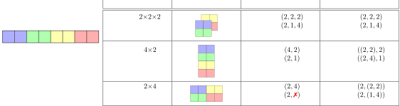
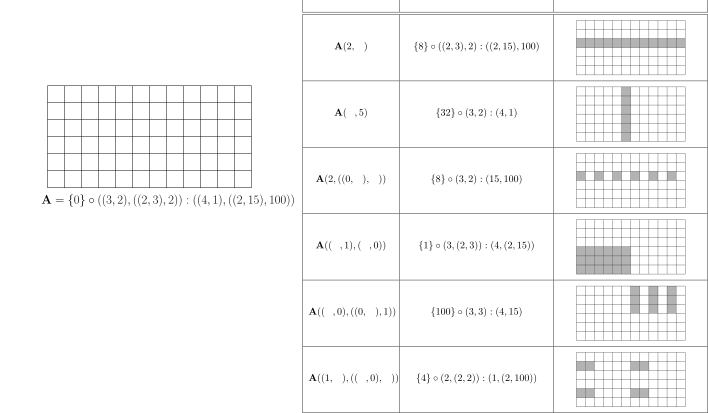
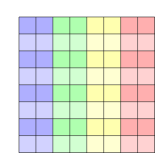
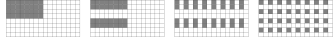
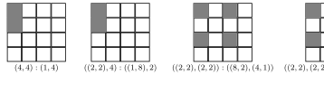
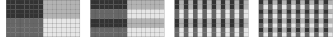

# 摘要 {#sec-abstract}

现代高性能计算与深度学习体系结构越来越多地集成专用张量指令，包括用于矩阵乘法的张量核以及用于多维数据的硬件优化拷贝操作。
这些指令规定了固定且常常较为复杂的数据布局，必须在整个执行流水线中被正确传播，以同时保证正确性与最优性能。
我们提出 CuTe，这是一个用于表示与操作张量的全新数学规范。
CuTe 提供两个关键创新：（1）一种层次化布局表示，直接扩展传统的扁平形状与扁平步长张量表示，使其能够描述现代硬件指令所需的复杂映射；（2）一套丰富的布局运算代数——包括拼接、合并、复合、补集、除法、平铺与求逆——可用于复杂的布局操作、推导、验证与静态分析。
CuTe 布局为 GPU 内核中的数据布局与线程安排提供了统一框架，而布局代数则支持在编译期对布局性质进行强有力的推理，并表达通用的张量变换。

在本文中，我们展示 CuTe 的抽象相较于传统方法能显著帮助软件开发，促进对架构规定布局的编译期验证，便于实现可推广到广泛应用的算法原语，并简洁表达现代专用张量指令所需的平铺与分区模式。

CuTe 已在生产系统中成功部署，构成 NVIDIA 的 CUTLASS 库以及一系列相关工作（包括 CuTe DSL）的基础。

# 致谢 {#sec-ack}

作者感谢 Vijay Thakkar 作为 CuTe 的早期使用者，在其推广与纳入 CUTLASS 的过程中发挥了关键作用，并为其基础设计与落地做出了重要贡献。
作者也感谢 Andrew Kerr、Pradeep Ramani 与 Manish Gupta，就在 CUTLASS 中使用 CuTe 提供了洞见，并推动其在高性能内核开发中的早期采用。
作者感谢 Muhammad Osama 与 Duane Merrill 在 CuTe 原型与底层性能优化方面所做的早期实验性工作。
最后，作者感谢 Michael Garland、Bastian Hagedorn、Jay Shah 与 Amanda Liu 的深刻反馈，以及他们反复对 CuTe 规范提出挑战。

# 引言与动机 {#sec-intro}

现代 GPU 正在越来越多地针对以张量为中心的计算进行优化，这一趋势由深度学习与科学计算的需求驱动。
NVIDIA 的 Volta 架构引入了张量核，使得小矩阵乘法可以在硬件中高效执行。[@NVIDIA:Volta]
这一能力在 Turing 和 Ampere 架构中进一步扩展，引入了用于在 GPU 存储层次中进行结构化矩阵搬运的专用指令。[@NVIDIA:Turing; @NVIDIA:Ampere]
Hopper 与 Blackwell 架构更进一步，引入了用于在全局内存与共享内存之间高效搬运 rank-5 张量的拷贝指令，并持续扩展张量核能力。[@NVIDIA:Hopper; @NVIDIA:Blackwell]
充分发挥这些面向张量的硬件特性对获得峰值 GPU 性能至关重要，从而驱动能够高效表示与操作这些张量的高性能编程模型。

现有与新兴硬件对多维数据在多层次内存空间与多层次并行结构中的存储与访问方式高度敏感。
数据存储布局一直会通过决定访存发生的方式与时机来影响性能，但当硬件指令规模变大并对输入输出规定固定布局时，其对正确性的影响也变得至关重要。
这些布局必须贯穿整个执行流水线被正确传播，以确保硬件指令被正确调用并获得优化的内存访问模式。

在本文中，我们给出 CuTe 的基础概念：CuTe 是 CUDA Tensors（或 Compute Unified Tensors）的规范，旨在为编写峰值性能的线性代数库提供构建模块。
其核心是，CuTe 引入了两个关键创新：

- *一种新的张量布局表示*：CuTe 的形状、布局与张量天然是层次化的，由更小的嵌套实例构成。这种层次结构能够表达现代张量指令所需的复杂映射，同时仍严格扩展了 `BLAS`、`torch.tensor`、`numpy.ndarray` 与 MATLAB 中的扁平形状与扁平步长表示。

- *一种新的布局操作代数*：CuTe 布局支持一组丰富的操作，包括拼接、合并、复合、补集、除法、平铺与求逆，这些操作都会产生新的 CuTe 布局。  
  这些操作支持复杂的分区、操纵、验证与推导。

CuTe 的布局表示为在编写通用算法时管理线程与数据提供了直观框架。
CuTe 的布局代数为在高性能线性代数内核开发中操纵布局与生成新布局提供了富有表达力的方法。
这些方法能够实现：

- 对复杂布局与分区的支持：CuTe 便于表示应用特定的数据模式与专用张量指令所需的复杂分区模式。

- 关注点分离：数据布局的声明与算法逻辑相互独立，促进清晰性与模块化。

- 静态分析与优化：代数化技术支持对张量参数的检查、重排与分区，以满足架构约束。

## 相关工作 {#sec-related}

CuTe 源自高效张量收缩的需求，而张量收缩是大量科学计算与机器学习应用的核心。
传统的通用张量收缩通常依赖于矩阵化，即将张量在逻辑上或物理上重排为矩阵，再通过调用 BLAS 库完成计算。

BLAS 提供了核心线性代数运算的高效、可移植实现，并针对多种架构提供了高度优化版本。[@blackford2002updated]
在 BLAS 原语中，通用矩阵乘法（GEMM）是最成熟、应用最广泛的操作。

BLIS 框架在 GEMM 的基础上支持行列两个方向的非单位步长，从而缓解了处理不规则内存布局时必须显式拷贝的负担。[@VanZee:BLIS]
BLAS 的 strided-batched GEMM 扩展进一步推广了这一原语，使其可用于更多张量收缩。[@Shi:BLASContractions]
推动 CuTe 的一个关键洞见是使用张量记号中的多重索引，将任意张量收缩转化为规范化的 batched-GEMM 原语。

大量现有库依赖于张量表示，并几乎都基于扁平形状与扁平步长。
在 Python 中，这些包括 `numpy.ndarray` 与 `torch.tensor`；在 C++ 中，对应的例子是 `std::mdspan`。

```python
>>> import numpy
>>> a = numpy.ndarray([3,7,5])
>>> a.dtype
dtype('float64')
>>> a.shape
(3, 7, 5)
>>> a.strides
(280, 40, 8)
```

```python
>>> import torch
>>> a = torch.empty(3,7,5)
>>> a.dtype
torch.float32
>>> a.shape
torch.Size([3, 7, 5])
>>> a.stride()
(35, 5, 1)
```

```cpp
std::mdspan a = std::mdspan(data, 3, 7, 5);
a.extent(0);  // 3
a.extent(1);  // 7
a.extent(2);  // 5
a.stride(0);  // 35
a.stride(1);  // 5
a.stride(2);  // 1
```

CuTe 支持这些表示，并在其基础上严格扩展，以支持层次化的形状与步长，从而表示更复杂的布局、非整数步长以及非整数的布局值域。

对密集张量表示的独立扩展包括 HeLayers、ThunderKittens，以及 OpenAI Triton 编译器中采用的 Linear Layouts 方法。[@Aharoni:HeLayers; @Spector:ThunderKittens; @Tillet:LinearLayouts; @Tillet:TritonAI]
Thunderkittens 针对寄存器内存、共享内存、行/列主序 tile，以及行/列主序子 tile 的行/列主序等情形提供了大量定制类型，并规定了 warp 与线程的访问模式。
这些类型基于架构布局需求与内存层次设计，但表示范围受限于既有类型与模式。
Linear Layouts 基于 $\mathbb{F}_2$ 线性代数，提供了更一般的张量布局表示与布局分析生成途径。
然而其对 $\mathbb{F}_2$ 的严格依赖使部分运算对人类难以检查，并将工作限定在 2 的幂形状与步长上，这对许多应用不可接受。

其他启发本工作的布局分析方法也依赖 $\mathbb{F}_2$ 线性代数，例如 Edelman 等人的工作、Cormen 等人的工作以及 Bouverot 等人的工作。[@Edelman:IndexTransforms; @Cormen:FastPermuting; @Bouverot:AffineIndex]
这些工作为分析与算法生成提供了基础，但也受限于其应用语境。

由于 CUTLASS v3 中 CuTe 的 C++ 实现是开源且配有部分文档，它已经在多项独立工作中被引用并用于分析 CuTe 布局与 CuTe 代数操作。
Bhaskaracharya 等人在整数集合关系（ISL）背景下分析 CuTe 与 Linear Layouts，但省略了允许将 Linear Layouts 表示为 CuTe 布局的步长抽象。[@Grover:ISLCuTe; @Tillet:LinearLayouts]
LEGO 使用了受限形式的 CuTe 布局与原始的 CuTe 复合操作来生成代码生成器中的复杂索引。[@Tavakkoli:LEGO]
Colfax Research 从范畴论角度分析了 CuTe 布局及其部分操作。[@Colfax:CategoryCuTe]
本文旨在对 CuTe 的概念与应用进行更系统、更正式的处理。

CuTe 的设计与概念已经在多项应用中证明其价值。
例如，CuTe 被用于 Graphene 张量编译器中，在表示张量操作方面发挥关键作用。[@Hagedorn:Graphene]
此外，CuTe 的 C++ 实现被用于 Stream-K 算法的实现，并成为 NVIDIA CUTLASS v3 库开发的核心。[@Osama:StreamK; @kerr2017cutlass]
CuTe 也是当前大语言模型的先进实现（包括 FlashAttention 及其多个迭代版本）的核心组件，凸显了其在深度学习前沿应用中的相关性。[@Dao:FlashAttention; @Dao:FlashAttention2; @Dao:FlashAttention3]
另外，CuTe 还是一系列相关编译器项目的基础，包括基于 Python 的动态 CUDA 线性代数 DSL——CuTe DSL。[@cute_dsl_nvidia]

## 规范循环与循环变换 {#sec-loops}

显式计算循环索引是高性能线性代数内核开发中的常见难题。
这些计算对程序员而言难以写对，也更难维护。
与其将数据访问的信息与算法逻辑耦合，我们更倾向于用矩阵/向量坐标清晰表达算法逻辑，并将数据访问模式抽象到数据布局中。

为说明这一点，我们首先定义本工作所能处理的循环嵌套类别。
具体而言，我们将**标准循环形式**定义为：只有一个索引、从零开始、上界为常数、每次迭代递增 1 的循环。

例如，考虑如下循环：

```cpp
for (int m = 2; m <= 50; m += 3)
  A[m] = e(m);
```

该循环将 `A[2]`、`A[5]`、`A[8]`、$\ldots$ 赋值为纯表达式 `e(m)` 的结果。
它可以被变换为如下规范循环：

```cpp
for (int i = 0; i < 17; ++i)
  (A + 2)[3*i] = g(i);
```

这里，指针被偏移一个循环不变量常数，循环步长被归一化为 1，下界被变换为 0，上界紧致且不包含上界，纯表达式被变换为 `g(i) = e(3*i+2)`。
现在可以直观地将上述例子解释为遍历一个逻辑上的 17 元素向量，其中逻辑坐标以 3 为步长，从基地址 `A + 2` 索引数据。
该程序可用以下数据表示：

```text
Accessor: A + 2
   Shape: 17
  Stride: 3
```

嵌套循环也可类似处理。
考虑如下二维循环嵌套：

```cpp
for (int n = 3; n < 43; n += 2)
  for (int m = 4; m <= 22; m += 5)
    A[p*m + q*n] = e(m,n);
```

它可以被变换为规范循环形式：

```cpp
for (int j = 0; j < 20; ++j)
  for (int i = 0; i < 4; ++i)
    (A + 4*p + 3*q)[5*p*i + 2*q*j] = g(i,j);
```

在规范循环嵌套下，将变换后的循环解释为遍历一个逻辑上的 $4 \times 20$ 矩阵是自然的，其中逻辑行坐标 $i$ 的步长为 $5p$，逻辑列坐标 $j$ 的步长为 $2q$，以索引基地址 `A + 4*p + 3*q` 处的数据。
这可表示为：

```text
Accessor: A + 4p + 3q
   Shape: ( 4, 20)
  Stride: (5p, 2q)
```

一个关键观察是，这个 $4 \times 20$ 矩阵也可以解释为一个具有非均匀、半仿射步长的 80 元素向量，并可用等价的规范循环形式表示：

```cpp
for (int k = 0; k < 80; ++k)
  (A + 4*p + 3*q)[5*p*(k%4) + 2*q*(k/4)] = f(k);
```

其中 `%` 为取模，`/` 为整数向下取整除法。
该变换是二维坐标 `(i,j)` 与一维坐标 `k` 之间的反词典序双射 `(i,j) = (k%4,k/4)`。
这一双射与前述形状表示等价，并可直接由其推导。
因此，形状表示既可接受二维坐标也可接受一维坐标，为索引数据提供了灵活且与秩无关的框架。

此外，规范循环形式还为张量计算优化编译器中常见的、可证正确的循环变换提供指导。
考虑最一般的规范循环嵌套：

```cpp
for (int i0 = 0; i0 < N0; ++i0)
  for (int i1 = 0; i1 < N1; ++i1)
    for (int i2 = 0; i2 < N2; ++i2)
      ...
        A[d0*i0 + d1*i1 + d2*i2 + ...] = e(i0,i1,i2,...);
```

其中 $(N_0, N_1, N_2, \ldots)$ 是计算的“形状”，$(d_0, d_1, d_2, \ldots)$ 是访问模式的“步长”：

```text
Accessor: A
   Shape: (N0,N1,N2,...)
  Stride: (d0,d1,d2,...)
```

由于 `Shape:Stride` 信息与循环嵌套本身一一对应，与其问如何对循环进行分裂、转置、拼接、置换、截断、向量化等变换，不如问“`Shape:Stride` 表示可以以哪些有效方式变换，又有哪些算子提供这些变换？”
确实，若 $\mathbf{L} = \text{Shape}:\text{Stride}$ 表示数据访问与循环嵌套，那么哪些函数 $P$ 使得

$$\mathbf{L}' = P(\mathbf{L}) = \mathbf{L} \circ P$$

成为对 $\mathbf{L} = \text{Shape}:\text{Stride}$ 的有意义变换，把具有某形状与步长的循环嵌套变为新的 $\mathbf{L}' = \text{Shape}':\text{Stride}'$，其形状与步长可能不同。
这些变换 $P$ 本质上是在**重写**循环嵌套，并且如果定义得当，它们本身可组合、可逆，并提供类似函数式编程的对命令式循环的控制。
结合前述一维坐标与 ND 坐标之间的双射，本文展示了对这些变换算子的一种非常有效的表示：$P = \mathbf{P} = \text{Shape}^*:\text{Stride}^*$，即我们用来表示数据访问与循环嵌套的同类对象。

## 张量与折叠 {#sec-tensors-folding}

为进一步说明形状可以被 ND 坐标索引的动机，我们推广了在将张量收缩映射到规范化 BLAS 原语时的观察。[@Shi:BLASContractions]

在本文中，张量用黑体字母表示，指标用小写字母表示，指标的上界用相应的大写字母表示。
张量的秩指其维度数量，也称为模式（mode）的数量。
例如：

- 标量 $\alpha$ 是 rank-0 张量。
- 向量 $\mathbf{a}_i$ 是 rank-1 张量，满足 $0 \le i < I$。
- 矩阵 $\mathbf{A}_{mn}$ 是 rank-2 张量，满足 $0 \le m < M$ 且 $0 \le n < N$。
- 三维数组 $\mathbf{A}_{mnp}$ 是 rank-3 张量，满足 $0 \le m < M$、$0 \le n < N$、$0 \le p < P$。

重复指标在等式单侧出现时隐含求和（爱因斯坦记号），因此一个张量收缩可写为

$$\mathbf{C}_{stqp} = \mathbf{A}_{stupr} \, \mathbf{B}_{qtru}$$

它表示一个 rank-5 张量与一个 rank-4 张量收缩得到一个 rank-4 张量。
这种形式的收缩可以在 `numpy.einsum` 与 `torch.einsum` 中紧凑表达。

上述张量收缩可改写为

$$\mathbf{C}_{(sp)(q)(t)} = \mathbf{A}_{(sp)(ur)(t)} \, \mathbf{B}_{(q)(ur)(t)}$$

其中原始张量收缩的模式被分为四类：

- **行模式 $\hat{m}$**：出现在 $\mathbf{A}$ 与 $\mathbf{C}$ 中，但不出现在 $\mathbf{B}$ 中。
- **列模式 $\hat{n}$**：出现在 $\mathbf{B}$ 与 $\mathbf{C}$ 中，但不出现在 $\mathbf{A}$ 中。
- **归约模式 $\hat{k}$**：出现在 $\mathbf{A}$ 与 $\mathbf{B}$ 中，但不出现在 $\mathbf{C}$ 中。
- **批模式 $\hat{\ell}$**：出现在 $\mathbf{A}$、$\mathbf{B}$ 与 $\mathbf{C}$ 中。

这称为张量的**折叠**。
折叠张量不一定需要显式拷贝，它可以仅仅是对数据视图的改变。

作为折叠的显式例子，考虑图 @fig-folding 第一行中的 $2 \times 2 \times 2$ 张量，共 8 个元素。
扁平表示为张量每个模式保存形状与步长，用以索引物理数据。
该扁平表示与 C++ 中 `std::mdspan`、PyTorch 的 `torch.tensor`、NumPy 的 `numpy.ndarray` 等库采用的表示一致。
该 $2 \times 2 \times 2$ 张量可以通过将第三个模式折叠进第一个模式变为 $4 \times 2$ 矩阵，如第二行所示。
此时扁平表示的形状为 $(4,2)$，步长为 $(2,1)$。
原则上，也可以将第三个模式折叠进第二个模式得到 $2 \times 4$ 矩阵。
但此时已无法用扁平表示描述——不存在可以表示第二个模式步长的整数。

{#fig-folding}

上表最后一列给出了折叠矩阵的 CuTe 表示，强调折叠本质上只是对模式进行分组。
在 $4 \times 2$ 矩阵的情形下，扁平表示是 CuTe 表示的**合并版本**（coalesced）。
而在 $2 \times 4$ 矩阵的情形下，不存在这样的扁平表示。

这种广义的张量折叠允许所有张量收缩被写成统一的规范形式：

$$\mathbf{C}_{\hat{m}\hat{n}\hat{\ell}} = \mathbf{A}_{\hat{m}\hat{k}\hat{\ell}} \, \mathbf{B}_{\hat{n}\hat{k}\hat{\ell}}.$$

其中每个模式可以是单一模式或模式组，我们称其为**多重模式**。
结合第 @sec-loops 节中的规范循环，无论 $\hat{m}$ 的形状是 $M$ 还是 $(M_0,M_1)$，我们都可以用一维坐标 $m$ 对其遍历。
因此，任意张量收缩都可以折叠为规范的 `batched-GEMM`，并通过四重循环的简单参考实现来求值：

```cpp
for (int l = 0; l < L; ++l)
  for (int m = 0; m < M; ++m)
    for (int n = 0; n < N; ++n)
      for (int k = 0; k < K; ++k)
        C(m,n,l) += A(m,k,l) * B(n,k,l);
```

这一简单实现可用于评估广泛的兼容张量收缩，包括任意矩阵乘法（`GEMM`）、张量收缩（`GETT`）与卷积（`CONV`），只需智能构造折叠布局即可。
有关通用 `GEMM` 及其应用细节，请参见 @sec-gemm 节。

随后优化可以集中在循环重排、平铺、向量化等常见优化上，通过变换循环嵌套的顺序与秩来实现。
这些变换往往可以被表示为坐标空间上的布局置换。
这些变换布局与数据布局函数性复合后，将生成新的循环嵌套，同时保证与原问题一致。
关于布局复合与通用分区的应用，请参见 @sec-composition 节。

# 布局表示 {#sec-layout-rep}

CuTe 布局是灵活的对象，能够表示广泛的数据与线程安排，并在抽象物理地址、分离迭代顺序与存储顺序方面具有重要价值。
本节定义 CuTe 的形状、布局与张量的表示，并构造它们与坐标之间的关系。
CuTe 布局使得通用算法只需一次实现，便能适用于任何可折叠为该算法规范形式的复杂数据布局。
此类算法及其应用范围示例见 @sec-algorithms 节。

## Tuple 与 HTuple

`Tuple` 与 `HTuple` 是本文贯穿始终的基础数据结构。

**定义：** `Tuple(T)` 是从集合 $\mathcal{T}$ 中选取元素构成的有限有序列表。
对 $X = (X_0, X_1, \ldots, X_{n-1}) \in \texttt{Tuple}(\mathcal{X})$，定义如下操作：

- **Rank：** rank($X$)。元组长度 $n$。
- **Access：** $X_i$。即 `Tuple` $X$ 的第 `i` 个元素，满足 $0 \le i < \text{rank}(X)$。

`Tuple(T)` 是扁平的元素集合，而 `HTuple(T)` 是“分层的 `T` 元组”。

**定义：** `HTuple(T)` 要么是集合 $\mathcal{T}$ 中的一个元素，要么是 `Tuple(HTuple(T))`。
对 $X \in \texttt{HTuple}(\mathcal{X})$，定义如下操作：

- **Rank：** rank($X$)。若 $X \in \texttt{Tuple}$，则为元组长度，否则为 1。
- **Access：** $X_i$。即 `HTuple` $X$ 的第 `i` 个元素，满足 $0 \le i < \text{rank}(X)$。
- **Depth：** depth($X$)。若 $X \in \texttt{Tuple}$，则为 $1 + \max(\text{depth}(X_0), \text{depth}(X_1), \ldots)$，否则为 0。

例如，

$$
31 \quad (16,32) \quad (3,-8,7) \quad (2,(4,1),-1) \quad ((4,6),(3,(2,2),8))
$$

都是 $\texttt{HTuple}(\mathbb{Z})$ 的实例。

在推理 `HTuple` 时，引入**同余**与**弱同余**概念很有用。

**定义：** 同余 $\sim$ 是 `HTuple` 上的等价关系。
对 $P \in \texttt{HTuple}(\mathcal{P})$ 与 $S \in \texttt{HTuple}(\mathcal{S})$，若满足下式，则称 $P$ 与 $S$ 同余，并具有相同的**轮廓**（profile）：

$$
P \sim S \quad \text{当且仅当} \quad
\begin{cases}
P \in \mathcal{P} \text{ 且 } S \in \mathcal{S}, \text{ 或} \\
P,S \in \texttt{Tuple} \text{ 且 } \text{rank}(P)=\text{rank}(S) \text{ 且 } \forall_i\ P_i \sim S_i
\end{cases}
$$

例如，

$$
(4,8) \sim (5,7), \quad (4,(2,4)) \sim (7,(3,2)), \quad (\mathbf{v},((\mathbf{p},3))) \sim (0,((0,0)))
$$

但 $(4,8)$ 与 $(4,(2,4))$ 不同余，$(4,(2,4))$ 与 $(0,((0,0)))$ 也不同余。

弱同余用于测试一个 `HTuple` 的轮廓是否至少与另一个一样“细化”。

**定义：** 弱同余 $\lesssim$ 是 `HTuple` 上的偏序关系。
对 $P \in \texttt{HTuple}(\mathcal{P})$ 与 $S \in \texttt{HTuple}(\mathcal{S})$，若满足下式，则称 $P$ 与 $S$ **弱同余**，$P$ 对 $S$ 的轮廓是**粗化**，而 $S$ 对 $P$ 的轮廓是**细化**：

$$
P \lesssim S \quad \text{当且仅当} \quad
\begin{cases}
P \in \mathcal{P}, \text{ 或} \\
P,S \in \texttt{Tuple} \text{ 且 } \text{rank}(P)=\text{rank}(S) \text{ 且 } \forall_i\ P_i \lesssim S_i
\end{cases}
$$

例如，

$$
30 \lesssim (a,b) \lesssim (\mathbf{v},(0,\alpha)), \quad 30 \lesssim (a,b,c) \lesssim ((0,0),0,0)
$$

但 $(a,b)$ 与 $(a,b,c)$ 不弱同余，$(\mathbf{v},(0,\alpha))$ 与 $((0,0),0)$ 也不弱同余。

## 形状 {#sec-shape}

多维数组通常由其**形状**表征，即描述各模式长度的正整数序列。
一个 $M \times N$ 矩阵的二维形状表示为 $(M,N)$，天然由坐标 $(m,n)$ 索引，满足 $0 \le m < M$ 且 $0 \le n < N$。
将形状表示为正整数的层次化元组是这一概念的自然扩展。

**定义：** 形状是 $\texttt{HTuple}(\mathbb{Z}^+)$，其中 $\mathbb{Z}^+ = \{1,2,3,\ldots\}$ 是正整数集合。
形状 $S$ 的秩为 `HTuple` 的秩。
形状 $S$ 的大小是其元素的乘积，记为 $\left| S \right| = \prod_k \left| S_k \right|$。

层次化形状的一个重要特性是它们可由多种坐标系统索引。
考虑不超过 $N$ 的整数集合：

$$
\mathbb{Z}_N = \{0,1,2,\ldots,N-1\}.
$$

CuTe 观察到二维形状 $(M,N)$ 也可以解释为一维 $MN$ 元素，只要存在双射

$$
S : \mathbb{Z}_{MN} \longleftrightarrow \mathbb{Z}_M \times \mathbb{Z}_N
$$

将一维整数坐标 $i \in \mathbb{Z}_{MN}$ 与二维自然坐标 $(m,n) \in \mathbb{Z}_M \times \mathbb{Z}_N$ 相互映射。

类似地，二维形状 $(M,NP)$ 可以解释为层次化形状 $(M,(N,P))$，由自然坐标 $(m,(n,p))$ 索引，满足 $0 \le m < M$、$0 \le n < N$、$0 \le p < P$。
对应的双射为

$$
S : \mathbb{Z}_M \times \mathbb{Z}_{NP} \longleftrightarrow \mathbb{Z}_M \times (\mathbb{Z}_N \times \mathbb{Z}_P),
$$

用于在二维坐标 $(m,q) \in \mathbb{Z}_M \times \mathbb{Z}_{NP}$ 与自然坐标 $(m,(n,p)) \in \mathbb{Z}_M \times (\mathbb{Z}_N \times \mathbb{Z}_P)$ 之间映射。

层次化形状与坐标的直接结果是：张量算法可以针对最自然的形状来编写（见 @sec-algorithms 节）——`COPY` 中向量的一维形状、`GEMM` 中矩阵的二维形状、`batched-GEMM` 中张量的三维形状，等等——同时仍可接受被折叠为与算法规范弱同余的层次化形状张量（见 @sec-compatibility 节）。
数据张量的形状往往以扁平整数序列表示，也可以任意折叠为通用张量算法所接受的形状。
此外，由于张量的每个模式都与一个步长相关联（见 @sec-stride 节）以索引数据，这种模式折叠使得能够表示比 `COPY` 中的简单连续数组或 `BLAS GEMM` 中的行/列主序矩阵更复杂得多的数据布局（见 @sec-layout 节）。

在接下来的小节中，我们定义这种兼容性的概念以及形状内部坐标集合之间的关系。

### 坐标集合与兼容性 {#sec-compatibility}

如前所述，层次化形状允许使用多种坐标系统进行索引。
这里我们为特定形状定义坐标集合，并给出形状之间共享坐标集合的兼容性概念。

**定义：** **坐标集合**是非负整数集合 $\mathbb{Z}_N = \{0,1,2,\ldots,N-1\}$，或坐标集合的笛卡尔积 $\mathbb{Z}_N \times \mathbb{Z}_M = \mathbb{Z}_{(N,M)}$。

例如，以下是坐标集合的示例：

$$
\mathbb{Z}_6 = \{0,1,2,3,4,5\}
$$

$$
\mathbb{Z}_3 \times \mathbb{Z}_4 = \mathbb{Z}_{(3,4)} = \{(0,0),(1,0),(2,0),(0,1),(1,1),(2,1),(0,2),(1,2),(2,2),(0,3),(1,3),(2,3)\}
$$

$$
(\mathbb{Z}_2 \times \mathbb{Z}_1) \times \mathbb{Z}_3 = \mathbb{Z}_{((2,1),3)} = \{((0,0),0),((1,0),0),((0,0),1),((1,0),1),((0,0),2),((1,0),2)\}
$$

形状 $S$ 的坐标集合 $\mathbb{Z}_S$ 正是形状 $S$ 的自然坐标集合。
形状 $S$ 的其他坐标集合是任意与 $S$ **兼容**且**粗化** $S$ 的形状所对应的坐标集合。

**定义：** **兼容性** $\preceq$ 是形状集合上的偏序关系。
对形状 $P$ 与 $S$，

$$
P \preceq S \quad \text{当且仅当} \quad
\begin{cases}
P \in \mathbb{Z}^+ \text{ 且 } P = \left| S \right|, \text{ 或} \\
P,S \in \texttt{Tuple} \text{ 且 } \text{rank}(P)=\text{rank}(S) \text{ 且 } \forall_i\ P_i \preceq S_i
\end{cases}
$$

我们称 $P$ 与 $S$ 兼容，$P$ **粗化** $S$，而 $S$ **细化** $P$。

兼容性要求两个形状大小相同，因此 `HTuple` 的整数值很重要。
例如，

$$
30 \preceq (2,15) \preceq (2,(3,5)) \quad \text{且} \quad 30 \preceq (6,5) \preceq ((3,2),5)
$$

但 $(2,(3,5))$ 与 $((3,2),5)$ 虽然大小相同，却不兼容。
它们确实共享一个共同的兼容形状 $30$。

有了坐标集合与形状兼容性的定义，我们可以为任意形状定义所有兼容坐标的集合。

**定义：** 形状 $S$ 定义了一组**兼容坐标集合** $\mathbb{Z}(S)$，它由所有粗化 $S$ 的形状的坐标集合构成：

$$
\mathbb{Z}(S) = \{\mathbb{Z}_{S'} \mid S' \preceq S\}.
$$

每个形状都有一个整数坐标集合：

$$
\{0,1,2,\ldots,\left| S \right| - 1\} = \mathbb{Z}_{\left| S \right|} \in \mathbb{Z}(S),
$$

且每个秩为 $r$ 的形状都有一个秩为 $r$ 的坐标集合：

$$
\{(a_0,\ldots,a_{r-1}) \mid a_i \in \mathbb{Z}_{\left| S_i \right|}\} = \mathbb{Z}_{(\left| S_0 \right|,\left| S_1 \right|,\ldots,\left| S_{r-1} \right|)} \in \mathbb{Z}(S).
$$

注意，如果形状 $P$ 粗化形状 $S$，则 $\mathbb{Z}(P) \subseteq \mathbb{Z}(S)$。
这意味着形状 $P$ 中的任何坐标也是形状 $S$ 的坐标。

### 坐标

本小节定义坐标的类型，定义形状兼容坐标集合之间的双射，并给出这些坐标映射的示例。

**定义：** 形状 $S$ 的**界内坐标**（in-bounds coordinate），或简称**坐标**，是其某个坐标集合中的元素 $c \in \mathbb{Z}_{S'} \in \mathbb{Z}(S)$。
注意坐标总是 $\texttt{HTuple}(\mathbb{N})$。
在语境清晰时，我们简写为 $c \in \mathbb{Z}(S)$。

**定义：** 形状 $S$ 的**整数坐标**是坐标 $\bar{c} \in \mathbb{Z}_{\left| S \right|} \in \mathbb{Z}(S)$。
注意整数坐标总是整数 $\bar{c} \in \mathbb{N}$。

**定义：** 形状 $S$ 的**自然坐标**是坐标 $\tilde{c} \in \mathbb{Z}_S \in \mathbb{Z}(S)$。
注意自然坐标总是与形状同余的 $\texttt{HTuple}(\mathbb{N})$，即 $\tilde{c} \sim S$。

为在界内坐标之间进行变换，我们在形状 $S$ 的坐标集合上构造枚举以定义**坐标列表**。
本文采用反词典序（colexicographical）顺序 $<$，其定义为：

$$
(a_0,\ldots,a_n) < (b_0,\ldots,b_n)
\quad \text{当且仅当} \quad
\begin{cases}
a_n < b_n, \text{ 或} \\
a_n = b_n \ \ \text{且} \ \ (a_0,\ldots,a_{n-1}) < (b_0,\ldots,b_{n-1})
\end{cases}
$$

并按需递归应用。
反词典序枚举在坐标列表之间定义了一个双射。
函数 `idx2crd` 定义为：

$$
\texttt{idx2crd} : \mathbb{Z}_{\left| S \right|} \to \mathbb{Z}_{(\left| S_0 \right|,\left| S_1 \right|,\ldots,\left| S_{r-1} \right|)},
$$

将 $\mathbb{Z}_{\left| S \right|}$ 的第 $i$ 个坐标（形状 $S$ 的第 $i$ 个整数坐标）映射到 $\mathbb{Z}_{(\left| S_0 \right|,\left| S_1 \right|,\ldots,\left| S_{r-1} \right|)}$ 的第 $i$ 个坐标（形状 $(\left| S_0 \right|,\left| S_1 \right|,\ldots,\left| S_{r-1} \right|)$ 的第 $i$ 个自然坐标）。
也可以使用反向和/或镜像的字典序或反词典序等其他双射。

对于给定形状 $S$，`idx2crd` 的具体形式为

$$
\texttt{idx2crd}(i) = \Bigl(i \bmod \left| S_0 \right|,\ \bigl\lfloor\tfrac{i}{\left| S_0 \right|}\bigr\rfloor \bmod \left| S_1 \right|,\ \ldots,\ \bigl\lfloor\tfrac{i}{\prod_{k=0}^{r-3}\left| S_k \right|}\bigr\rfloor \bmod \left| S_{r-2} \right|,\ \bigl\lfloor\tfrac{i}{\prod_{k=0}^{r-2}\left| S_k \right|}\bigr\rfloor\Bigr).
$$ {#eq-idx2crd}

其逆映射 `crd2idx` 为：

$$
\texttt{crd2idx}(c_0,c_1,\ldots,c_{r-1}) = c_0 + c_1\cdot\left| S_0 \right| + \ldots + c_{r-1}\cdot \prod_{k=0}^{r-2}\left| S_k \right|.
$$ {#eq-crd2idx}

它将 $\mathbb{Z}_{(\left| S_0 \right|,\left| S_1 \right|,\ldots,\left| S_{r-1} \right|)}$ 的第 $i$ 个坐标映射到 $\mathbb{Z}_{\left| S \right|}$ 的第 $i$ 个坐标。

若两个形状兼容（$P \preceq S$），则可通过反复应用 `idx2crd` 将 $\mathbb{Z}_P$ 中坐标映射到 $\mathbb{Z}_S$，并通过反复应用 `crd2idx` 将 $\mathbb{Z}_S$ 中坐标映射回 $\mathbb{Z}_P$。
按照反词典序坐标顺序，图 @fig-coordlists 展示了不同形状的整数坐标与自然坐标之间的映射示例。

{#fig-coordlists}

### 越界坐标

除了已定义的坐标集合，还需要定义具有特定轮廓但可能不在形状坐标集合中的坐标。

**定义：** 形状 $S$ 的**可接收坐标**（admissible coordinate）是任意 $c \in \texttt{HTuple}(\mathbb{Z})$，且满足弱同余 $c \lesssim S$。

**定义：** 形状 $S$ 的**越界坐标**是任意可接收坐标 $c \in \texttt{HTuple}(\mathbb{Z})$，但不在界内，即 $c \notin \mathbb{Z}(S)$。

**定义：** 形状 $S$ 的**同余坐标**是任意 $c \in \texttt{HTuple}(\mathbb{Z})$，且满足 $c \sim S$。
记为 $\mathbb{Z}^S = \{c \in \texttt{HTuple}(\mathbb{Z}) \mid c \sim S\}$。

也就是说，$\mathbb{Z}_S$ 是由形状 $S$ 限定的有限坐标集合，$\mathbb{Z}^S$ 是与 $S$ 同余的所有坐标构成的无限集合。
由于 $\mathbb{Z}^S$ 中与形状 $S$ 内部值相关的部分并不重要，我们有时用 $(\ast,\ast)$ 作为占位轮廓。
例如，

$$
\mathbb{Z}^{(\ast,\ast)} = \{(a,b) \mid a,b \in \mathbb{Z}\}, \quad \mathbb{Z}^{(\ast,(\ast,\ast))} = \{(a,(b,c)) \mid a,b,c \in \mathbb{Z}\}.
$$

注意 `idx2crd` 对所有整数都是良定义的，即可用于 $\mathbb{Z}^{\left| S \right|}$ 中的坐标，而不只是 $\mathbb{Z}_{\left| S \right|}$。
当对整数 $i \ge \left| S \right|$ 求值时，它将返回一个相对于形状 $(\left| S_0 \right|,\left| S_1 \right|,\ldots,\left| S_{r-1} \right|)$ 的越界坐标 $(c_0,c_1,\ldots,c_{r-1})$。
相比之下，`crd2idx` 对越界坐标输入无法保证得到越界结果。
因此，`crd2idx` 与 `idx2crd` 仅在界内坐标上互为逆映射。

## 步长 {#sec-stride}

上一节描述了形状、其层次结构以及对应坐标。
为了构造数据、线程或其他对象的**布局**，我们定义从形状内坐标到偏移的映射。

**定义：** 形状 $S$ 的**步长** $D$ 是一个与形状同余的 $\texttt{HTuple}(\mathcal{D})$，即 $S \sim D$。
该步长通过如下内积映射，将自然坐标 $\tilde{c} \in \mathbb{Z}_S$ 映射到值域 $\mathcal{D}$：

$$
\texttt{inner\_product} : \mathbb{Z} \cdot \mathcal{D} \to \mathcal{D}, \quad c\cdot d \mapsto cd, \\
\texttt{inner\_product} : \texttt{HTuple}(\mathbb{Z}) \cdot \texttt{HTuple}(\mathcal{D}) \to \mathcal{D}, \quad c \cdot d \mapsto \sum_i \texttt{inner\_product}(c_i, d_i).
$$ {#eq-innerprod}

在大多数情况下，步长也是 $\texttt{HTuple}(\mathbb{Z})$，即 $\mathcal{D} = \mathbb{Z}$。
此时 `inner_product` 产生的整数通常被解释为数据数组中的偏移。
然而，步长元素的概念可推广到任意整数半模（integer-semimodule）中的元素，这显著扩展了布局可表示函数的范围。

### 整数半模

**定义：** 整数半模是一个集合 $M$，配备可结合的加法 $M + M \to M$ 以及标量乘法 $\mathbb{Z} \cdot M \to M$。
对 $a,b \in \mathbb{Z}$ 与 $m,n,p \in M$，加法与标量乘法满足：
`乘法单位元`：$1 \cdot m = m$。
`加法结合律`：$m + (n + p) = (m + n) + p$。
`乘法结合律`：$a \cdot (b \cdot m) = (ab) \cdot m$。

加法单位元与逆元不是必需的，因此 $(M,+)$ 只是半群。
我们用 $(M,+,\cdot)$ 表示整数半模。

整数集合 $\mathbb{Z}$ 是整数半模。
有理数集合 $\mathbb{Q}$ 是整数半模。
模 2 运算的域 $\mathbb{F}_2 = (\{0,1\}, \text{XOR}, \text{AND})$ 也是整数半模。
任意整数半模的笛卡尔积或 `HTuple` 在逐元素加法与标量乘法下依然构成整数半模。

一个特别有用的整数半模是 $(\mathbb{Z}^S,+,\cdot)$，其中 $\mathbb{Z}^S$ 是所有与 $S$ 同余的 `HTuple(Z)`。
例如，秩为 2 的算术元组基向量构成整数半模：

$$
e_0 = (1,0), \quad e_1 = (0,1), \quad \mathbb{Z}^{(\ast,\ast)} = \{a \cdot e_0 + b \cdot e_1 \mid a,b \in \mathbb{Z}\}
$$

a 与 b 的整数缩放与加法按元素定义：

$$
a \cdot e_0 + b \cdot e_1 = (a,b).
$$

因此，$e_0$、$e_1$ 以及它们的任意线性组合都可以作为布局中的步长。
通过从 $\mathbb{Z}^S$ 中选择步长元素，布局可以通过 `inner_product` 运算生成形状 $S$ 的自然坐标。

## 布局 {#sec-layout}

CuTe 使用形状 $S$ 与步长 $D$ 定义一个**布局函数**（layout function），简称**布局**。
形状 $S$ 定义布局函数的域，而步长 $D$ 定义布局函数的值域。

对形状的另一种解释是：它是从所有坐标列表集合映射到自然坐标的一个双射。
因此每个坐标都映射到形状内唯一且等价的自然坐标。
类似地，步长是从形状的自然坐标映射到某个值域的函数：

$$
S \colon Z \leftrightarrow \mathbb{Z}_S, \quad \forall Z \in \mathbb{Z}(S)
$$

$$
D \colon \mathbb{Z}_S \to \mathcal{D}
$$

这里的 $\leftrightarrow$ 即 `idx2crd` 与 `crd2idx`（见式 @eq-idx2crd 与 @eq-crd2idx）在兼容形状之间的映射，而 $\to$ 对应自然坐标与步长之间的 `inner_product` 映射（式 @eq-innerprod）。

形状与步长的复合定义了布局函数，它将任意坐标列表映射到值域。

**定义：** 布局 $\mathbf{L} = D \circ S$ 是形状 $S$ 与步长 $D$ 的函数复合，其中 $S \sim D$，并为每个 $Z \in \mathbb{Z}(S)$ 定义 $Z \to \mathcal{D}$ 的映射。

### 记号与操作 {#sec-layout-notation}

根据语境，我们会用不同记号书写布局 $\mathbf{L}$。
例如：

$$
\begin{array}{ccc} (4, & (3, & 2)) \\ (2, & (8, & 1)) \end{array} = \begin{array}{c} S \\ D \end{array}
\quad\text{或}\quad
(4,(3,2)) : (2,(8,1)) = S : D
\quad\text{或}\quad
(2,(8,1)) \circ (4,(3,2)) = D \circ S.
$$

最后一种写法强调形状与步长本身也可以被视为函数，其复合即为布局函数。

由于布局的域由其形状决定，布局性质与形状性质高度一致。
对布局 $\mathbf{L} = S:D$ 与 $\mathbf{U} = X:Y$，定义：

- $\text{rank}(\mathbf{L}) = \text{rank}(S)$：布局的秩等于其形状的秩。
- $\text{depth}(\mathbf{L}) = \text{depth}(S)$：布局的深度等于其形状的深度。
- $\left| \mathbf{L} \right| = \left| S \right|$：布局的大小等于其形状的大小。
- $\mathbf{L}_i = S_i : D_i$：第 $i$ 个子布局由形状与步长的第 $i$ 个元素构成。
- $\mathbb{Z}(\mathbf{L}) = \mathbb{Z}(S)$：布局的坐标集合等于其形状的坐标集合。
- $\mathbf{L} \sim \mathbf{U} \Leftrightarrow S \sim X$：布局同余等价于形状同余。
- $\mathbf{L} \preceq \mathbf{U} \Leftrightarrow S \preceq X$：布局兼容等价于形状兼容。

作为布局求值示例，考虑图 @fig-layouts 中的布局 $\mathbf{L} = ((2,2),(4,2)):((1,8),(2,16))$，以及整数坐标 $22 \in \mathbb{Z}_{32} \in \mathbb{Z}(\mathbf{L})$，则

$$
\mathbf{L}(22) = \mathbf{L}(2,5) = \mathbf{L}((0,1),(1,1)) = 26.
$$

这里依次展示了整数坐标、等价二维坐标、等价自然坐标以及最终计算出的偏移。

布局的界内域是所有坐标 $c \in \mathbb{Z}(\mathbf{L})$ 的集合。
布局也可在越界坐标上求值，类似数组在越界索引处的未定义行为。
因此，虽然布局的域是有限集合 $\mathbb{Z}(\mathbf{L})$，其**扩展域**是所有与形状弱同余的无限集合 $\mathbb{Z}^{\mathbf{L}}$。

我们还区分布局的值域与像。
布局的值域是 $\mathcal{D}$（通常是无限集合，如 $\mathbb{Z}$ 或 $\mathbb{Z}^D$），而布局的像是有限集合，即对域内所有坐标求值的结果范围：

$$
\text{image}(\mathbf{L}) = \mathbf{L}(\mathbb{Z}(\mathbf{L})) = \mathbf{L}(\mathbb{Z}_{\left| \mathbf{L} \right|}) \subseteq \text{codomain}(\mathbf{L}).
$$

### 布局示例 {#sec-layout-examples}

在定义了形状、步长与布局之后，我们给出一些示例，说明 CuTe 布局严格推广了常见的扁平 N 维布局。

{#fig-layouts}

{#fig-layouts2}

图 @fig-layouts 展示了密集线性代数库（如 CUTLASS）中常见的数据布局示例。
每个布局都表示为从逻辑坐标 $(m,n) \in \mathbb{Z}_{(4,8)}$ 到偏移 $k \in \mathbb{Z}$ 的映射。
这些偏移例如可用于索引数据数组中的元素。
常见的行主序、列主序与带填充的布局都可由 CuTe 布局直接表示，而交织与混合布局表明，通过嵌套形状与步长，布局表示集合被严格扩展。
特别地，网格-由-tiles-组成的数据布局可以直接由 CuTe 布局表示。

图 @fig-layouts2 展示了使用整数半模步长而非整数步长构造的布局示例。
图 @fig-layouts2 中的两个坐标布局示例展示了能够生成坐标的布局。
在后续章节中我们将看到，这些坐标布局与其数据布局对应物在变换上是对称的，并常用作检测与谓词化数据张量越界访问的工具。
此外，坐标张量在 Hopper 与 Blackwell 中的 TMA 等指令上非常有用，因为这些指令消耗坐标作为参数而非地址。
图 @fig-layouts2 中的 swizzle 示例使用了一种整数半模，其中群加法被二进制 XOR 所替代。
这可用于生成所谓的 swizzle 数据模式，有助于避免共享内存读写访问中的 bank 冲突。
这些示例凸显了 CuTe 布局概念的统一性以及它所能表示函数的通用性。

### 完备性 {#sec-completeness}

任何满足 $f(0)=0$ 且域为有限集合 $\mathbb{Z}_N$ 的函数 $f$ 都可以表示为有限序列的 CuTe 布局的函数复合。
这意味着 CuTe 布局在函数复合下构成一个生成集合。
这样的函数 $f$ 可以表示为如下复合序列：

$$
f \equiv (2,2,2,\ldots):(f(1),f(2),f(3),\ldots) \ \circ\ (3,1):(1,4) \ \circ\ (4,1):(1,6) \ \circ\ \cdots \ \circ\ (N-1,1):(1,2(N-2)).
$$

对所有 $i \in \mathbb{Z}_N / \{0\}$，右侧的 $N-3$ 个布局将 $i \mapsto 2^{i-1}$，而最左侧的布局将 $2^{i-1} \mapsto f(i)$。
注意这里使用的是扩展域 $\mathbb{Z}$ 而非界内域 $\mathbb{Z}_N$ 来评估中间布局。

### 半线性 {#sec-semi-linearity}

形状-步长定义 $\mathbf{L} = D \circ S$ 与广义整数半模步长带来一种特别有用的线性代数视角：

$$
\mathbf{L}(c) = (D \circ S)(c) = d \cdot S(c) = d \cdot \tilde{c}.
$$

形状函数是到自然坐标的半仿射双射 $\tilde{c} \in \mathbb{Z}^S$，而步长函数是自然坐标的线性函数。
确实，这是因为在自然坐标上形状函数是恒等映射，而步长函数是线性的。
确实，对任意自然坐标 $\tilde{c}_0, \tilde{c}_1 \in \mathbb{Z}^S$，布局在自然坐标上是线性的：

$$
\mathbf{L}(\alpha \tilde{c}_0 + \beta \tilde{c}_1)
= d \cdot (\alpha \tilde{c}_0 + \beta \tilde{c}_1)
= \alpha (d \cdot \tilde{c}_0) + \beta (d \cdot \tilde{c}_1)
= \alpha \mathbf{L}(\tilde{c}_0) + \beta \mathbf{L}(\tilde{c}_1).
$$

然而对任意坐标 $c_0, c_1 \in \mathbb{Z}(S)$，布局并不线性，因为形状函数不是线性的：

$$
\tilde{c} = S(c_0 + c_1) \neq S(c_0) + S(c_1) = \tilde{c}_0 + \tilde{c}_1.
$$

因此，布局函数在自然坐标 $\tilde{c} \in \mathbb{Z}^S$ 上是线性的，但在任意坐标 $c \in \mathbb{Z}(S)$ 上是非线性的。

在自然坐标下，$d \cdot \tilde{c}$ 可以解释为广义矩阵-向量乘积：

$$
\mathbf{L}(c) = d \cdot \tilde{c} = \mathbf{D} \, \tilde{c},
$$

其中 $\mathbf{D}$ 的元素来自整数半模 $\mathcal{D}$。
在最常见的整数步长情形（$\mathcal{D} = \mathbb{Z}$）中，这是 $\mathbf{D} \in \mathbb{Z}^{1 \times n}$ 的矩阵-向量乘积。
当步长来自坐标整数半模（$\mathcal{D} = (\mathbb{Z}^S,+,\cdot)$）时，这是 $\mathbf{D} \in \mathbb{Z}^{m \times n}$ 的矩阵-向量乘积。
当步长为二进制序列（$\mathcal{D} = F_2^m = (\mathbb{Z}_{2^m}, XOR, \cdot)$）时，这是 $\mathbf{D} \in \mathbb{F}_2^{m \times n}$ 的矩阵-向量乘积。

| $\mathbf{L}$ | 线性形式：$r = \mathbf{D}\,\tilde{c}$ | 说明 |
|---|---|---|
| $((2,2),(4,\ 2)):((1,8),(2,16))$ | $r = \begin{bmatrix}1 & 8 & 2 & 16\end{bmatrix} \begin{bmatrix} \tilde{c}_0 \\ \tilde{c}_1 \\ \tilde{c}_2 \\ \tilde{c}_3 \end{bmatrix}$ | 整数步长是 $1 \times n$ 的 $\mathbb{Z}$-矩阵列向量。 |
| $(4,(4,2)):(e_1,(e_0,6e_1))$ | $\begin{bmatrix}r_0 \\ r_1\end{bmatrix} = \begin{bmatrix}0 & 1 & 0 \\ 1 & 0 & 6 \end{bmatrix} \begin{bmatrix} \tilde{c}_0 \\ \tilde{c}_1 \\ \tilde{c}_2 \end{bmatrix}$ | 坐标步长是 $m \times n$ 的 $\mathbb{Z}$-矩阵列向量。 |
| $(4,4):(f_1,f_5) \equiv ((2,2),(2,2)):((f_1,f_2),(f_5,f_{10}))$ | $\begin{bmatrix}r_0 \\ r_1 \\ r_2 \\ r_3\end{bmatrix} = \begin{bmatrix}1 & 0 & 1 & 0 \\ 0 & 1 & 0 & 1 \\ 0 & 0 & 1 & 0 \\ 0 & 0 & 0 & 1 \end{bmatrix} \begin{bmatrix} \tilde{c}_0 \\ \tilde{c}_1 \\ \tilde{c}_2 \\ \tilde{c}_3 \end{bmatrix}$ | 二进制步长是 $m \times n$ 的 $\mathbb{F}_2$-矩阵列向量。 |
: 布局及其对应的线性形式。 {#tbl-linear-forms}

例如，表 @tbl-linear-forms 给出了整数布局、坐标布局与二进制布局的线性形式。
在 $\mathbb{F}_2$ 线性形式上，已有大量变换研究，例如 Bit Permute Complement（BCP）与 Bit Matrix Multiply Complement（BMMC），它们近年来在 SIMT GPU 编程中被广泛使用。[@Edelman:IndexTransforms; @Cormen:FastPermuting; @Bouverot:AffineIndex; @Tillet:LinearLayouts]
在这些工作中，所考虑的变换形式为

$$
f(\mathbf{v}) = \mathbf{A}\mathbf{v} + \mathbf{b},
$$

其中 $\mathbf{A}$ 是 $m \times n$ 的二进制矩阵，$\mathbf{v}$ 是长度为 $n$ 的二进制向量，$\mathbf{b}$ 是长度为 $m$ 的二进制向量，所有运算均在模 2 的有限域 $\mathbb{F}_2$ 上进行。

本文后续部分定义的 CuTe 布局代数操作可视为线性代数的一般化。
例如，CuTe 布局上的群复合可以解释为矩阵乘法的推广；右逆与左逆可视为线性代数中 Moore-Penrose 伪逆的推广。
事实上，BCP 与 BMMC 分析中也会出现类似的线性代数表达式，它们都使用分解、求逆与矩阵乘积来分析算法。[@Edelman:IndexTransforms; @Cormen:FastPermuting; @Bouverot:AffineIndex; @Tillet:LinearLayouts]
CuTe 布局代数可以被看作超越 $\mathbb{F}_2$ 域的线性代数 BCP/BMMC 操作的推广。
特别地，CuTe 布局代数的动机主要来自张量中存在的一般整数步长与复杂数据布局。
本文旨在展示，这些操作往往可以具有更一般的函数定义，并在广泛的分析与应用中发挥作用。

## 张量 {#sec-tensor}

最后，我们通过将布局与访问器绑定来定义张量，这是 CuTe 的核心对象。
访问器本质上是一个支持随机访问的、类似指针的对象。

**定义：** 访问器是支持偏移与解引用操作的对象：

$$
e + d \to e', \quad \text{将访问器 $e$ 按 $d \in \mathcal{D}$ 偏移得到访问器 $e'$；}
$$

$$
*e \to v, \quad \text{对访问器 $e$ 解引用得到值 $v$；}
$$

$$
e[d] \to *(e+d), \quad \text{常用的下标便利操作。}
$$

当 $\mathcal{D} = \mathbb{Z}$ 时，访问器的常见实现包括原始指针（如 `T*`）、数组（如 `T[N]`）以及随机访问迭代器（如 `thrust::counting_iterator`、`thrust::transform_iterator` 等）。
当 $\mathcal{D}$ 是更“异构”的整数半模时，访问器必须与该半群的加法运算相兼容。

**定义：** 张量由访问器 $e$ 与布局 $\mathbf{L}$ 的复合定义，表示为 $T = e \circ \mathbf{L}$。
张量通过将坐标 $c \in \mathbb{Z}(\mathbf{L})$ 映射到值域 $\mathcal{D}$，据此偏移访问器并解引用得到张量值：

$$
T(c) = (e \circ \mathbf{L})(c) = *(e + \mathbf{L}(c)) = e[\mathbf{L}(c)].
$$

大多数张量是以内存地址作为访问器的数据布局。
例如，内存地址 $p$ 可以作为指针访问器 $\{p\}$，并通过正常的偏移与解引用操作构造数据张量：

$$
\{p\} + b \to \{p+b\}, \quad *\{p\} \to *p, \quad T = \{p\} \circ \mathbf{L}.
$$

此外，图 @fig-layouts 中的所有布局都可以通过与计数迭代器 $\{a\}$ 复合而转化为隐式张量，该迭代器解引用得到一个存储的偏移 $a \in \mathbb{Z}$：

$$
\{a\} + b \to \{a+b\}, \quad *\{a\} \to a, \quad T = \{a\} \circ \mathbf{L}.
$$

类似地，图 @fig-layouts2 中的坐标布局也可以通过与访问器 $\{(a,b)\}$ 复合而转化为隐式张量，该访问器按坐标偏移并解引用得到存储的坐标 $(a,b) \in \mathbb{Z}^{(\star,\star)}$：

$$
\{(a,b)\} + (c,d) \to \{(a+c,b+d)\}, \quad *\{(a,b)\} \to (a,b), \quad T = \{(a,b)\} \circ \mathbf{L}.
$$

### 切片 {#sec-slicing}

张量既可以被完全求值，也可以通过切片进行部分求值。由于 CuTe 张量可视为带偏移的布局，因此可以沿自然坐标的任意模式进行切片。

- **完全求值**：对完整坐标 $c$ 求值会得到一个具体值。
- **部分求值（切片）**：当用不完整坐标 $c = c' + c^*$ 切片，其中 $c^*$ 表示未指定部分时，结果是一个新张量。该操作写为：

$$
T(c) = (e \circ \mathbf{L})(c' + c^*) = (e + \mathbf{L}(c')) \circ \mathbf{L}(c^*) = e' \circ \mathbf{L}(c^*) = T'(c^*),
$$

其中 $\mathbf{L}(c')$ 可以被完全求值并累加进 $e$，而 $\mathbf{L}(c^*)$ 是仍未求值的子布局。切片会创建一个子张量，可继续求值或进一步操作。

{#fig-slicing}

图 @fig-slicing 展示了在 $6 \times 12$ 矩阵中切片以提取行、列与子矩阵的示例。这些示例使用计数迭代器访问器 $\{a\}$ 表示偏移 $a \in \mathbb{Z}$。切片的关键在于将部分坐标累加进张量偏移，并确定布局中尚未求值的部分。

在 `numpy.ndarray`、`torch.tensor` 与 MATLAB 等张量库中，切片通常使用类似语法：例如 `my_matrix[2,:]` 提取矩阵第二行，`my_matrix[:,4]` 提取第四列。这些库也支持区间切片，如 `my_matrix[2:4,1:3]` 提取第 2 到第 4 行、以及第 1 到第 3 列的子矩阵。CuTe 不支持区间切片，原因如下：

- 区间切片无法表达图 @fig-slicing 中的所有切片。最后一个切片示例无法仅通过矩阵行列的区间切片来表达。
- 区间切片会鼓励如下模式：

```python
# Extract a TILE_SIZE of data for each thr_id
thr_data = my_data[thr_id*TILE_SIZE:(thr_id+1)*TILE_SIZE]
```

该模式试图为每个线程提取一个“tile”，却将通常是静态常量的 `TILE_SIZE` 与每线程动态索引 `thr_id` 混合在一起。CuTe 更偏好“先置换再切片”的两阶段方案，例如：

```python
# Permute and reshape my_data tensor into shape (TILE_SIZE,NumTiles)
# This is a wrapper around the more general composition(my_data, Transform_Layout)
tiled_data = logical_divide(my_data, TILE_SIZE)  # (TILE_SIZE, NumTiles)
assert size[1](tiled_data) == NumThrs            # Verify NumTiles == NumThrs
# Slice tiled tensor to retrieve TILE_SIZE local to thr_id
thr_data = thr_tile_data[None, thr_id]           # TILE_SIZE
```

该方案将 `TILE_SIZE` 与 `thr_id` 明确分离，更便于编译器推理与传播静态信息（例如 `thr_data` 的大小为 `TILE_SIZE`），且同样灵活。关于通用分区的细节与示例见 @sec-layouttv，关于逻辑除法（logical divide）的细节与示例见 @sec-logical-divide。
- 区间切片还可以表达一些无法由 CuTe 布局表示的切片。例如，图 @fig-slicing 中的 $\mathbf{A}$，切片 `\mathbf{A}(0,0:2:12)` 可能得到 $\{0\} \circ (3,2):(15,100)$，但切片 `\mathbf{A}(0:2:6,0)` 无法表示，这是因为请求的切片与 $\mathbf{A}$ 的布局不兼容。CuTe 更倾向于在置换与重塑阶段（`composition`）检测并暴露这一错误，而不是在切片阶段。有关布局群复合的可接收条件，见 @sec-composition-impl。

## 应用 {#sec-algorithms}

CuTe 提供的布局表示集合严格大于传统扁平形状与步长所能覆盖的范围。相较之下，诸如 CUTLASS v2[@kerr2017cutlass] 与 Thunderkittens[@Spector:ThunderKittens] 等库往往为每一种布局分别实现，这种方式开发成本高、易出错且维护压力大。以 CUTLASS v2 为例，其代码库中约有 300 个独立布局实现，分布在 87 个文件中，总计约 55,000 行代码。此外，CUTLASS v2 中的许多算法仅能在这些布局的有限子集上工作，进一步加剧了维护与可扩展性方面的挑战。相比之下，CuTe 的核心布局表示与布局代数仅需约 3,000 行代码，便能覆盖 CUTLASS v2 中全部 300 种布局及更多布局。CuTe 的算法可以对输入的秩或形状设置约束，但只要布局满足这些前置条件，就仍可兼容。这种将算法逻辑与具体数据/线程布局解耦的方式，使代码更加灵活且可组合。

上述优势已被认可，CuTe 现已成为 CUTLASS v3、CUTLASS v4 与 CuTe DSL 的基础。这些系统依托 CuTe 的统一表示，在多代 NVIDIA 指令集架构上稳定地描述与操纵现代张量指令所需的复杂布局与分区模式。

在本节中，我们仅使用布局与张量表示来给出两个最基础算法的通用实现：`COPY` 与 `GEMM`。这些算法以 CuTe 张量实现，说明逻辑上的实现可以适用于广泛应用场景。虽然它们常常已具备不错性能，但更重要的是它们为优化版本提供了良好的参考实现。@sec-layoutalgebra 中的布局代数则提供了进一步检查与操纵布局以执行这些优化的方法。

### COPY {#sec-copy}

用 CuTe 张量编写的通用 `COPY` 算法如下：

```cpp
// @pre size(src) == size(dst)
template <class TS, class SLayout,
          class TD, class DLayout>
void
copy(Tensor<TS,SLayout> const& src,  // N
     Tensor<TD,DLayout>      & dst)  // N
{
  for (int i = 0; i < size(dst); ++i) {
    dst(i) = src(i);
  }
}
```

```python
# @pre size(src) == size(dst)
def copy(src : Tensor,   # N
         dst : Tensor):  # N
  for i in range(size(dst)):
    dst[i] = src[i]
```

其中前置条件要求两个张量的大小相等。等价地，在张量参数注释中，两个张量都兼容形状 $N$。

这个简单的 `COPY` 实现可以通过改变源/目标张量布局覆盖广泛应用。表 @tbl-copy 给出了常见应用及其对应的源与目标布局示例。

| 应用 | 源布局 | 目标布局 |
|---|---|---|
| 一维数组 | $8:1$ | $8:1$ |
| N 维数组 | $(8,2,3):(1,16,32)$ | $(8,2,3):(1,16,32)$ |
| Gather | $(2,3,2):(42,1,128)$ | $12:1$ |
| Scatter | $12:1$ | $(2,3,2):(42,1,128)$ |
| Broadcast | $7:0$ | $7:1$ |
| Constant | $7:0$ | $7:0$ |
| 转置 | $(8,3):(1,8)$ | $(8,3):(3,1)$ |
| 张量转置 | $(8,(3,5)):(1,(57,8))$ | $(8,15):(1,8)$ |
: `COPY` 的应用及示例源/目标布局。 {#tbl-copy}

任意秩的张量都可以复制到任意秩的张量。因此，`COPY` 从本质上是一个秩为 1 的算法，这是秩无关编程的一个例子。

当源与目标张量的 `idx2crd` 计算成本很低（例如形状在编译期已知）时，上述实现实际上不会产生动态坐标变换。此时循环可被展开，`idx2crd` 可对循环索引 `i` 做静态求值，`inner_product` 的开销也极小。这体现了静态分析与优化的思想，因为布局的形状与步长往往在编译期已知并可被编译器利用。即使 `idx2crd` 存在运行时开销，该实现仍是可靠的参考，用以验证进一步通过 @sec-layoutalgebra 中的布局代数对布局与域进行检查与变换的优化版本。

### GEMM {#sec-gemm}

用 CuTe 张量编写的通用 `GEMM` 算法如下：

```cpp
// @pre M: size<0>(A) == size<0>(C)
// @pre N: size<0>(B) == size<1>(C)
// @pre K: size<1>(A) == size<1>(B)
template <class TA, class ALayout,
          class TB, class BLayout,
          class TC, class CLayout>
void
gemm(Tensor<TA,ALayout> const& A,  // (M,K)
     Tensor<TB,BLayout> const& B,  // (N,K)
     Tensor<TC,CLayout>      & C)  // (M,N)
{
  for (int k = 0; k < size<1>(B); ++k) {
    for (int n = 0; n < size<0>(B); ++n) {
      for (int m = 0; m < size<0>(A); ++m) {
        C(m,n) += A(m,k) * B(n,k);
  } } }
}
```

```python
# @pre M: size[0](A) == size[0](C)
# @pre N: size[0](B) == size[1](C)
# @pre K: size[1](A) == size[1](B)
def gemm(A : Tensor,   # (M,K)
         B : Tensor,   # (N,K)
         C : Tensor):  # (M,N)
  for k in range(size[1](B)):
    for n in range(size[0](B)):
      for m in range(size[0](A)):
        C[m,n] += A[m,k] * B[n,k]
```

这里的前置条件规定了 `GEMM` 算法的逻辑约束。在每个张量参数的注释中，我们写出该张量必须兼容的形状。

这个简单的 `GEMM` 实现（以及扩展到 `batched-GEMM`）可以通过改变张量布局覆盖多种应用。表 @tbl-gemm 列出一些常见应用与示例布局，包括 BLAS GEMM 的所有 N/T 变体，以及 BLIS GEMM 的通用步长（`dm*`、`dn*`、`dk*`）变体。它还可以作为通用张量-张量收缩（`GETT`），其中张量通过将行模式、列模式、归约模式与批模式分组，折叠为合适的矩阵形状。[@Shi:BLASContractions] 另外，构造一个实现 `im2col` 变换的布局（作为 CuTe 布局的函数复合）还能使 `GEMM` 实现 `CONV`，这在现代机器学习应用中非常核心。[@cuDNN]

| 应用 | $\mathbf{A}$-布局 | $\mathbf{B}$-布局 | $\mathbf{C}$-布局 |
|---|---|---|---|
| NT GEMM | $(M,K):(1,{\tt lda})$ | $(N,K):(1,{\tt ldb})$ | $(M,N):(1,{\tt ldc})$ |
| TN GEMM | $(M,K):({\tt lda},1)$ | $(N,K):({\tt ldb},1)$ | $(M,N):(1,{\tt ldc})$ |
| NTT GEMM | $(N,K):(1,{\tt ldb})$ | $(M,K):(1,{\tt lda})$ | $(N,M):(1,{\tt ldc})$ |
| BLIS GEMM | $(M,K):({\tt dma},{\tt dka})$ | $(N,K):({\tt dnb},{\tt dkb})$ | $(M,N):({\tt dmc},{\tt dnc})$ |
| GETT | $((M_1,M_2),K):((1,W),X)$ | $(N,K):(K,1)$ | $((M_1,M_2),N):((1,Y),Z)$ |
| GETT | $(M,(K_1,K_2)):((W,X),1)$ | $(N,(K_1,K_2)):((Y,Z),1)$ | $(M,N):(1,M)$ |
| CONV | $(K,(C,T,R,S)):D_A$ | $((N,Z,P,Q),(C,T,R,S)):D_B$ | $(K,(N,Z,P,Q)):D_C$ |
: `GEMM` 的应用及示例布局。 {#tbl-gemm}

通过抽象 fused-multiply-add 操作并提供足够强大的平铺工具，该算法可以在体系结构层级的每一层递归地适配与应用。

# 布局代数 {#sec-layoutalgebra}

虽然 CuTe 布局只是所有可能函数的一部分，但它能够表示的布局函数集合严格大于传统扁平形状与扁平步长表示（如 `BLAS`、`torch.tensor` 与 `numpy.ndarray`）所覆盖的范围。

除了表示能力，更关键的价值在于 CuTe 布局可被操纵与组合以构造新布局。这依赖于一组定义在布局上的核心代数操作，它们可进一步用于构建更高层的操作。

本节定义**布局同态**（layout homomorphisms）——这些操作以一个或多个 CuTe 布局为输入，产出满足特定函数性质的 CuTe 布局。

## 拼接 {#sec-concatenation}

一个布局可以表示为其子布局的**拼接**：

$$
\begin{aligned} \mathbf{L} &= S : D\\ &= (S_0, S_1, \ldots, S_n) : (D_0, D_1, \ldots, D_n) \\ &= (S_0 : D_0, S_1 : D_1, \ldots, S_n : D_n) \\ &= (\mathbf{L}_0, \mathbf{L}_1, \ldots, \mathbf{L}_n) \end{aligned}
$$

满足

$$
\forall c = (c_0,c_1,\ldots,c_n) \in \mathbb{Z}(\mathbf{L}), \ \ \mathbf{L}(c) = \mathbf{L}_0(c_0) + \mathbf{L}_1(c_1) + \cdots + \mathbf{L}_n(c_n).
$$ {#eq-concat}

拼接的可接收性要求所有子布局的值域必须位于同一整数半模中。例如，任意两个整数步长布局都可以拼接，但布局 $4:2$ 与 $3:e_0$ 不能拼接。

注意每个子布局本身也是布局，因此任何对布局的代数操作也可作用于任意子布局。我们称之为“按模式（by-mode）操作”。本节所有操作（coalesce、composition、complement、逻辑除法等）都可按模式应用。我们使用组合子表示这种用法：

$$
\mathbf{A} \star  \langle \mathbf{B}, \mathbf{C} \rangle = (\mathbf{A}_0, \mathbf{A}_1) \star  \langle \mathbf{B}, \mathbf{C} \rangle = (\mathbf{A}_0 \star  \mathbf{B}, \mathbf{A}_1 \star  \mathbf{C}),
$$ {#eq-layout-combinator}

其中 $\star$ 表示某个二元布局操作，$\langle \ \rangle$ 表示布局元组，用以区别于布局拼接。

## 合并 {#sec-coalesce}

给定布局 $\mathbf{A}$，其**合并**布局 $\mathbf{R}$ 满足：

\begin{align}
\text{一致的整数域：} && \left| \mathbf{R} \right| &= \left| \mathbf{A} \right|, \\
\text{扁平或整数形状：} && \text{depth}(\mathbf{R}) &\leq 1, \\
\text{一致的整数求值：} && \forall \bar{c} \in \mathbb{Z}_{\left| \mathbf{A} \right|}, \ \ \mathbf{R}(\bar{c}) &= \mathbf{A}(\bar{c}).
\end{align}

`coalesce` 通过把 $\mathbf{A}$ 视为整数上的函数来“简化”布局，并可能将其形状折叠成更浅的表示。该过程可能丢失秩与层次结构信息、修改坐标集合并合并多个模式，但能保证在整数坐标上的函数等价。

在实践中，当提到合并布局时，我们通常指能达到**最小秩**的合并布局。

例如，$(2,(1,6)):(1,(6,2))$ 的合并布局为 $12:1$。也可以按模式使用式 @eq-layout-combinator 对该布局合并：

$$
\begin{aligned} \texttt{coalesce}((2,(1,6)):(1,(6,2)), \ \langle \ast,\ast \rangle) &= \texttt{coalesce}((2:1,(1,6):(6,2)), \ \langle \ast,\ast \rangle) \\ &= (\texttt{coalesce}(2:1, \ \ast), \ \texttt{coalesce}((1,6):(6,2), \ \ast)) \\ &= (\texttt{coalesce}(2:1), \ \texttt{coalesce}((1,6):(6,2))) \\ &= (2:1,6:2) \\ &= (2,6):(1,2). \end{aligned}
$$

类似地，秩为 2 的布局 $((4,3),5):((15,1),3)$ 合并为 $(4,15):(15,1)$，而按模式合并的结果仍为 $((4,3),5):((15,1),3)$，因为行/列子布局分别合并后保持不变。布局 $(4,(3,5)):(15,(1,3))$ 也会合并到 $(4,15):(15,1)$，且按模式合并得到 $(4,15):(15,1)$，因为第二个模式可单独合并为 $15:1$。

## 复合 {#sec-composition}

给定布局 $\mathbf{A}$ 与 $\mathbf{B}$，其**群复合**布局 $\mathbf{R} = \mathbf{A} \circ \mathbf{B}$ 满足：

$$
\begin{aligned} \text{域兼容：} && \mathbf{B} &\preceq \mathbf{R}, \\ \text{函数复合：} && \forall c \in \mathbb{Z}(\mathbf{B}), \ \ \mathbf{R}(c) &= \mathbf{A}(\mathbf{B}(c)). \end{aligned}
$$ {#eq-compose-compat}

在此定义中，$\mathbf{B}$ 通过确定 $\mathbf{R}$ 的域来决定结果布局的形状与坐标集合，而 $\mathbf{A}$ 决定结果的值域。兼容性条件确保 $\mathbf{B}$ 的所有坐标都可用于 $\mathbf{R}$。对于群复合与函数复合的可接收性，$\mathbf{B}$ 的值域必须与 $\mathbf{A}$ 的域兼容，这通常意味着 $\mathbf{B}$ 的值域与 $\mathbf{A}$ 的某个坐标集合同余。

### 复合性质

**恒等布局。** 对任意形状 $S$，恒等布局 $\mathbf{I}_S$ 满足

$$
\forall c \in \mathbb{Z}_S, \ \ \mathbf{I}_S(c) = c.
$$

注意 $\mathbf{I}_S$ 实际上可以采用任意形状 $P$，只要 $S \preceq P$。例如，下列布局都可作为 $\mathbf{I}_{24}$，并满足 $\mathbf{L}(i) = i$（$i \in \mathbb{Z}_{24}$）：

$$
24 : 1, \quad (4,6) : (1,4), \quad (3,(4,2)) : (1,(3,12)).
$$

同样，下列布局都是 $\mathbf{I}_{(4,6)}$，并满足 $\mathbf{L}(i,j) = (i,j)$（$(i,j) \in \mathbb{Z}_{(4,6)}$）：

$$
(4,6) : (e_0,e_1), \quad (4,(3,2)) : (e_0,(e_1,3e_1)).
$$

对值域为 $\mathbb{Z}_D$ 的布局 $\mathbf{B}$，任一 $\mathbf{I}_D$ 都是**左恒等**：

$$
\mathbf{I}_D \circ \mathbf{B} = \mathbf{B}.
$$

对域为 $\mathbb{Z}_S$ 的布局 $\mathbf{A}$，形状为 $S$ 的 $\mathbf{I}_S$ 是**右恒等**：

$$
\mathbf{A} \circ \mathbf{I}_S = \mathbf{A}.
$$

**结合性。** 给定布局 $\mathbf{A}$、$\mathbf{B}$ 与 $\mathbf{C}$，若满足

$$
\text{image}(\mathbf{C}) \subseteq \mathbb{Z}(\mathbf{B}) \quad \text{且} \quad \text{image}(\mathbf{B}) \subseteq \mathbb{Z}(\mathbf{A}),
$$ {#eq-layout-image}

则有

$$
\mathbf{A} \circ (\mathbf{B} \circ \mathbf{C}) = (\mathbf{A} \circ \mathbf{B}) \circ \mathbf{C}.
$$

若式 @eq-layout-image 不成立，仍可能可以进行复合，但结合性不一定成立。例如：

$$
\begin{aligned} (5,3):(1,7) \ \circ \ [4:1 \ \circ \ 2:5] &= (5,3):(1,7) \ \circ \ 2:5 &= 2:7 \\ [(5,3):(1,7) \ \circ \ 4:1] \ \circ \ 2:5 &= 4:1 \ \circ \ 2:5 &= 2:5 \end{aligned}
$$

由于 $2:5$ 的像不在 $4:1$ 的域内，两种括号方式产生不同结果。不过考虑到 `idx2crd` 与 `inner_product` 的越界行为，两者仍可正常求值。

### 求值与限制 {#sec-composition-impl}

群复合的求值可由式 @eq-idx2crd 与 @eq-innerprod 的布局求值操作构造性地导出。本节给出布局 $\mathbf{A}$ 与 $\mathbf{B}$ 成功计算群复合所需的可接收条件。

首先，需要 $\mathbf{A}$ 与 $\mathbf{B}$ 在函数意义上兼容：$\mathbf{B}$ 的值域必须与 $\mathbf{A}$ 的形状弱同余。最常见的情形是 $\mathbf{B}$ 的值域是整数，因此与任何接受整数坐标的 $\mathbf{A}$ 兼容。更一般地，当 $\mathbf{B}$ 产生坐标时，这些坐标必须与 $\mathbb{Z}(\mathbf{A})$ 中某个坐标同余。

一般方法是令 $(\mathbf{A} \circ \mathbf{B})(i)$ 与 $\mathbf{R}(i)$ 的求值相等。实践中我们发现，只需分析最简单的基例 $\mathbf{B} = s : d$，其余情形可化归到该基例。

**基例。**

令 $\mathbf{B} = s : d$，其中 $s \in \mathbb{Z}^+$、$d \in \mathbb{N}$。令 $\mathbf{A} = S:D = (S_0, S_1, \ldots, S_R):(D_0, D_1, \ldots, D_R)$，其中 $S_r \in \mathbb{Z}^+$、$D_r \in \mathcal{D}$。定义 $S = (S_0, S_1, \ldots, S_R)$ 的排他前缀积为

$$
\bar{S}_r = \prod_{k=0}^{r-1} S_k.
$$

则复合 $\mathbf{R} = \mathbf{A} \circ \mathbf{B}$ 对每个 $i = 0,1,\ldots,s-1$ 的求值为：

$$
\begin{aligned} \mathbf{R}(i) = (\mathbf{A} \circ \mathbf{B})(i) &= (D \circ S \circ d \circ s)(i) \\ &= D(S(d(s(i)))) \\ &= \texttt{inner\_product}(\texttt{idx2crd}_S(\texttt{inner\_product}(\texttt{idx2crd}_s(i), d)), D) \\ &= \texttt{inner\_product}(\texttt{idx2crd}_S(\texttt{inner\_product}(i, d)), D) \\ &= \texttt{inner\_product}(\texttt{idx2crd}_S(i \cdot d), D) \\ &= \sum_{r=0}^{R-1} \left(\left\lfloor \frac{i \cdot d}{\bar{S}_r} \right\rfloor \bmod S_r\right) \cdot D_r + \left\lfloor \frac{i \cdot d}{\bar{S}_R} \right\rfloor \cdot D_R \\ &= \sum_{r=0}^{R-1} \left(\left\lfloor \frac{i}{\bar{S}'_r} \right\rfloor \bmod S'_r\right) \cdot D'_r + \left\lfloor \frac{i}{\bar{S}'_R} \right\rfloor \cdot D'_R. \end{aligned}
$$ {#eq-ABi}

若结果存在，则 $\mathbf{R}$ 定义为 $\mathbf{R} = S':D' = (S'_0, S'_1, \ldots, S'_R):(D'_0, D'_1, \ldots, D'_R)$。我们要确定 $S'$、$D'$ 以及其存在的条件。

首先，因 $\mathbf{B}$ 的值域是整数，我们可假定 $\mathbf{A}$ 已被合并。根据定义，这不会改变复合求值。

接着观察：若 $(s-1) \cdot d < \bar{S}_r$，则对所有 $i < s$ 与 $q > r$，都有 $\left\lfloor i \cdot d / \bar{S}_q \right\rfloor = 0$，也就是说 $\mathbf{A}$ 的所有 $q>r$ 模式对结果无贡献。我们不失一般性地假设 $(s-1) \cdot d \geq \bar{S}_R$，因为总可通过截断或扩展 $\mathbf{A}$ 的形状来满足该假设。这不会改变式 @eq-ABi，但可简化分析。

我们施加**步长可整除条件**：

$$
\bar{S}_r \mid d \ \text{或}\ \ d \mid \bar{S}_r \ \text{对每个 } r = 0, \ldots, R,
$$ {#eq-divis-stride}

并定义

$$
\delta_r = \left\lceil \frac{d}{\bar{S}_r} \right\rceil, \quad \rho_r = \left\lceil \frac{\bar{S}_r}{d} \right\rceil.
$$

则

$$
\sum_{r=0}^{R-1} \left(\left\lfloor \frac{i \cdot d}{\bar{S}_r} \right\rfloor \bmod S_r\right) \cdot D_r + \left\lfloor \frac{i \cdot d}{\bar{S}_R} \right\rfloor \cdot D_R =
\sum_{r=0}^{R-1} \left(\left\lfloor i \cdot \frac{\delta_r}{\rho_r} \right\rfloor \bmod S_r\right) \cdot D_r + \left\lfloor i \cdot \frac{\delta_R}{\rho_R} \right\rfloor \cdot D_R.
$$

利用恒等式 $(a b) \bmod (n b) = (a \bmod n) \cdot b$，并注意到 $\delta_r \mid S_r$，有

$$
\sum_{r=0}^{R-1} \left(\left\lfloor i \cdot \frac{1}{\rho_r} \right\rfloor \bmod \frac{S_r}{\delta_r}\right) \cdot (D_r \cdot \delta_r) + \left\lfloor i \cdot \frac{1}{\rho_R} \right\rfloor \cdot (D_R \cdot \delta_R).
$$

一旦验证

$$
\rho_r = \left\lceil \frac{\bar{S}_r}{d} \right\rceil = \left\lceil \frac{\prod_{k=0}^{r-1} S_k}{d} \right\rceil = \left\lceil \frac{S_0}{d} \right\rceil \left\lceil \frac{\prod_{k=1}^{r-1} S_k}{\left\lceil d / S_0 \right\rceil} \right\rceil = \cdots = \prod_{k=0}^{r-1} \left\lceil \frac{S_k}{\left\lceil d / \bar{S}_k \right\rceil} \right\rceil = \prod_{k=0}^{r-1} \left\lceil \frac{S_k}{\delta_k} \right\rceil = \bar{S}'_r,
$$

则结果形状与步长可写为

$$
S'_r = \frac{S_r}{\delta_r}, \quad D'_r = D_r \cdot \delta_r.
$$

为满足兼容性条件 @eq-compose-compat，形状还必须满足 $\left| S' \right| = \bar{S}'_{R+1} = s$。为此再施加**形状可整除条件**：

$$
\left\lceil \frac{\bar{S}_r}{d} \right\rceil \mid s \ \text{对每个 } r = 0, \ldots, R,
$$ {#eq-divis-shape}

并修改形状为

$$
S'_r = \frac{S_r}{\delta_r}, \quad S'_R = \frac{s}{\rho_R}, \quad D'_r = D_r \cdot \delta_r,
$$

其中 $s / \rho_R$ 用于将结果形状截断或扩展至大小 $s$。

因此，在 $\mathbf{A}$ 与 $\mathbf{B}$ 满足步长可整除条件 @eq-divis-stride 与形状可整除条件 @eq-divis-shape 时，我们即可计算结果布局 $\mathbf{R} = S':D'$。

**化归情形：可分配。**

为将更一般的复合化归到基例，我们利用复合对 $\mathbf{B}$ 子布局拼接的可分配性质：

$$
\mathbf{A} \circ \mathbf{B} = \mathbf{A} \circ (\mathbf{B}_0, \mathbf{B}_1, \ldots) = (\mathbf{A} \circ \mathbf{B}_0, \mathbf{A} \circ \mathbf{B}_1, \ldots).
$$ {#eq-layout-distributivity}

该性质在形状 $S$ 对 $\mathbf{B}$ 的和可分配时成立：

$$
\begin{aligned} (\mathbf{A} \circ \mathbf{B})(c) &= D(S(\mathbf{B}(c))) \\ &= D(S(\mathbf{B}_0(c_0) + \mathbf{B}_1(c_1) + \cdots)) && \text{$\mathbf{B} = (\mathbf{B}_0, \mathbf{B}_1, \ldots)$ 的拼接} \\ &\stackrel{?}{=} D(S(\mathbf{B}_0(c_0)) + S(\mathbf{B}_1(c_1)) + \cdots) && \text{要求 $S$ 对 $\mathbf{B}_i$ 可分配} \\ &= D(S(\mathbf{B}_0(c_0))) + D(S(\mathbf{B}_1(c_1))) + \cdots && \text{$D$ 线性} \\ &= (\mathbf{A} \circ \mathbf{B}_0, \mathbf{A} \circ \mathbf{B}_1,\ldots)(c). \end{aligned}
$$ {#eq-shape-distributivity}

满足式 @eq-shape-distributivity 的充分条件有两类：

- $\mathbf{B}$ 的值域与形状 $S$ 同余。在这种情况下，$S$ 的作用是恒等变换，自然可分配。
- 若 $S$ 不是恒等变换，则需满足

$$
\left\lfloor \frac{\sum_i c_i \cdot d_i}{\bar{S}_r} \right\rfloor \bmod S_r = \sum_i \left\lfloor \frac{c_i \cdot d_i}{\bar{S}_r} \right\rfloor \bmod S_r \ \text{对每个 } r = 0, \ldots, R-1, \quad
\left\lfloor \frac{\sum_i c_i \cdot d_i}{\bar{S}_R} \right\rfloor = \sum_i \left\lfloor \frac{c_i \cdot d_i}{\bar{S}_R} \right\rfloor.
$$

这在以下条件同时成立时出现：所有基子布局步长 $d_i$ 满足步长可整除条件 @eq-divis-stride，且所有基子布局 $s_i : d_i$ 的像彼此互相分离，即

$$
\forall i,j, \ \ s_i \cdot d_i \leq d_j \ \text{或}\ \ s_j \cdot d_j \leq d_i.
$$

**化归情形：坐标值域。**

当 $\mathbf{B}$ 产生坐标时，这些坐标必须与 $\mathbb{Z}(\mathbf{A})$ 中某个坐标同余，并且 $\mathbf{B}$ 的每个步长都必须是坐标整数半模的缩放基向量：$d = a \cdot e_i \in \mathbb{Z}^{S'}$，其中 $S' \preceq \mathbf{A}$。满足这些条件时，有

$$
\mathbf{A} \circ \mathbf{B} = \mathbf{A} \circ (a \cdot e_i) \circ s = \mathbf{A}_i \circ a \circ s = \mathbf{A}_i \circ \mathbf{B}',
$$

这将问题归约到基例，其中 $\mathbf{B}' = s : a$ 是秩 1、深度 0 且值域为整数的布局。对于 $\mathbf{B}$ 含有其他整数半模步长的情况，需要特别处理以将 $\mathbf{B}$ 的值域映射到 $\mathbf{A}$ 的域，且可能需要对 $\mathbf{A}$ 与 $\mathbf{B}$ 施加额外限制。

### 直觉与可整除性

当左侧布局 $\mathbf{A}$ 为秩 1 时，复合很直接，因为 $S_R$ 不出现在式 @eq-ABi 中：

$$
(S_0):(D_0) \ \circ \ s:d = s:D_0 \cdot d.
$$

此时没有非平凡的可整除性检查，因为 $R = 0$、$\bar{S}_0 = 1$、$\delta_0 = d$、$\rho_0 = 1$。这意味着即使 $\text{image}(\mathbf{B}) \not\subseteq \mathbb{Z}(\mathbf{A})$，群复合仍可能存在：

$$
7:11 \ \circ \ 3:4 = 3:44,
$$

并且 $\mathbf{B}$ 不必互相分离即可满足可分配性：

$$
7:11 \ \circ \ (3,5):(6,3) = (3,5):(66,33).
$$

当 $\mathbf{A}$ 的秩更大时，直觉上的策略分两步：

1. 通过“除去”$\mathbf{A}$ 的前 $d$ 个元素，构造一个产生 $\mathbf{A}$ 每隔 $d$ 个元素的中间布局。
2. 将中间步长布局的大小固定为 $s$，即“保留”前 $s$ 个元素。

例如

$$
(4,6,8,10):(2,3,5,7) \ \circ \ 6:12
$$

等价于

$$
(4,6,8,10):(2,3,5,7) \ \circ \ 6:12 = (1,2,8,10):(X,9,5,7) \ \circ \ 6:1,
$$

其中 $\mathbf{A}$ 的前 12 个元素被“除去”，并对步长进行缩放。然后保留修改后布局的前 6 个元素，得到

$$
(1,2,8,10):(X,9,5,7) \ \circ \ 6:1 = (2,3):(9,5).
$$

也可以先“保留”前 $6 \cdot 12$ 个元素，再“除去”前 12 个元素：

$$
(4,6,8,10):(2,3,5,7) \ \circ \ 6:12 = (4,6,3):(2,3,5) \ \circ \ 6:12 = (2,3):(9,5).
$$

可整除性条件确保“除去”与“保留”步骤中的逐步除法能产生整数形状。

**违反可整除条件。**

某些复合会违反步长或形状可整除条件。例如

$$
(4,6,8):(2,3,5) \ \circ \ 6:3
$$

违反步长可整除条件 @eq-divis-stride，因为 $\bar{S}_1 = 4$ 与 $d = 3$ 不可整除，因而不存在能表示每隔 3 个元素的布局。

类似地，复合

$$
(4,6,8):(2,3,5) \ \circ \ 6:1
$$

违反形状可整除条件 @eq-divis-shape，因为

$$
\left\lceil \frac{\bar{S}_1}{d} \right\rceil = \left\lceil \frac{4}{1} \right\rceil = 4
$$

不能整除 $s = 6$，因此不存在能表示该布局前 6 个元素的结果布局。

这意味着 CuTe 布局在群复合下并非严格闭合。然而实践中，可整除性条件的违反通常源于概念性错误、布局/硬件不兼容、程序员失误等问题，这些问题往往可在编译期被捕获，从而提升程序安全性与开发速度。

**表面上的违反。**

考虑复合

$$
(4,2,8):(3,12,97) \ \circ \ 3:3,
$$

它表面上违反步长可整除条件，因为 $\bar{S}_1 = 4$ 与 $d = 3$ 不可整除。该问题可通过对 $\mathbf{A}$ 合并（见 @sec-composition-impl）并截断 $\mathbf{A}$（对应 $(s-1) \cdot d < \bar{S}_r$ 的情形）解决。等价复合为

$$
(4,2,8):(3,12,97) \ \circ \ 3:3 = (8,8):(3,97) \ \circ \ 3:3 = (8):(3) \ \circ \ 3:3 = 3:9.
$$

然而下列复合确实违反可整除条件：

$$
(4,2,8):(3,12,97) \ \circ \ 4:3 \quad\text{与}\quad (4,2,8):(3,15,97) \ \circ \ 3:3.
$$

左侧无法充分截断，右侧无法合并。

### 应用：分区示例 {#sec-layouttv}

复合是 CuTe 布局代数的核心，它支撑了重塑、重步长、置换、分区、平铺与子布局提取等操作。本节展示利用复合按照任意线程-值模式对数据张量进行分区。

{#fig-tv-layout}

考虑一个细化到形状 $(8,8)$ 的数据布局，我们希望用图 @fig-tv-layout 所示的线程-值模式进行分区。这一指令的线程-值分区可由布局表示为

$$
\texttt{ThrValLayoutC:} \quad ((4,8),2):((16,1),8),
$$

它将 $(\texttt{thread\_idx}, \texttt{value\_idx})$ 映射到 $8 \times 8$ 矩阵中的一维坐标。图 @fig-tv-layout 实际绘制的是其逆映射，以便人类理解——它展示了从矩阵二维坐标到 $(\texttt{thread\_idx}, \texttt{value\_idx})$ 的对应关系。`ThrValLayoutC` 被视为 Ampere Tensor Core 指令的静态元数据：它是该指令与硬件功能的内在属性，在 CuTe 出现之前通常仅以 ISA 图示的方式存在。

任何 $8 \times 8$ 数据布局都可以通过与线程-值布局 `ThrValLayoutC` 复合进行置换。每次复合都会得到一个兼容形状 $(32,2)$ 的布局，并定义 $(\texttt{thread\_idx}, \texttt{value\_idx})$ 与数据偏移之间的映射。表 @tbl-tv-layout-examples 给出了若干示例。

| 数据名称 | 数据布局 $8 \times 8$ ($\mathbf{A}$) | TV 布局 $32 \times 2$ ($\mathbf{B}$) | 结果 $32 \times 2$ ($\mathbf{R}$) |
|---|---|---|---|
| `ColMajor` | $(8,8):(1,8)$ | $((4,8),2):((16,1),8)$ | $((4,8),2):((16,1),8)$ |
| `RowMajor` | $(8,8):(8,1)$ | $((4,8),2):((16,1),8)$ | $((4,8),2):((2,8),1)$ |
| `Padded` | $(8,8):(1,9)$ | $((4,8),2):((16,1),8)$ | $((4,8),2):((18,1),9)$ |
| `ColInterleaved` | $((4,2),(2,4)):((2,16),(1,8))$ | $((4,8),2):((16,1),8)$ | $((4,(4,2)),2):((8,(2,16)),1)$ |
| `Swizzled` | $(8,8):(f_1,f_9)$ | $((4,8),2):((16,1),8)$ | $((4,8),2):((f_{18},f_1),f_9)$ |
| `Coordinate` | $(8,8):(e_0,e_1)$ | $((4,8),2):((16,1),8)$ | $((4,8),2):((2e_1,e_0),e_1)$ |
: 通过 TV 布局复合得到的数据布局示例。 {#tbl-tv-layout-examples}

下面代码展示了一个常见的线程-值分区模式：

```python
smem_data = Tensor(MyAccessor, MyLayout8x8)     # Tensor:        Coord -> Offset
tv_layout   = Layout(((4,8),2), ((16,1),8))     # TV Layout: (Thr,Val) -> Coord
smem_tv     = composition(smem_data, tv_layout) # Compose:   (Thr,Val) -> Offset
smem_v      = smem_tv[thr_id, None]             # Slice by thread to get subtensor
copy(smem_v, rmem_data)                         # Copy to register tensor/array
```

该模式在 SIMD 编程中极为常见：每个处理元素获取父数据的对称分区。一般而言，CuTe 将任意分区视为“复合（置换与/或重塑）+ 切片”。如 @sec-slicing 所述，这种“先复合后切片”的模式将分区模式（`ThrValLayoutC`）与实际切片（含 `thr_id`）分离。由于分区模式往往是与指令或优化参数相关的编译期元数据，而切片通常是运行期线程标识索引，因此这种模式更利于静态信息传播与运行时开销降低。

### 按模式复合与 Tiler {#sec-tiler}

群复合可按模式应用，从而在布局子域上进行操作。例如，常需要分别对矩阵的行与列进行复合。我们使用式 @eq-layout-combinator 的组合子，将 $\star$ 识别为群复合 $\circ$，以对独立子布局分别复合。

我们将式 @eq-layout-combinator 中的布局元组称为 **Tiler**。

**定义：** Tiler 是 $\texttt{HTuple}(\texttt{Tile})$，其中每个 `Tile` 是

- 一个 **布局** $S:D$，或
- 一个 **整数** $S$，等价于布局 $S:1$。

该定义意味着：所有布局都是 Tiler，所有整数也是 Tiler，并允许像 $(4,8)$ 这样的形状用作 Tiler。这一常见情形可见图 @fig-tilers 的第一个示例，其中形状被用作便捷的 Tiler 来提取并操作子布局。

{#fig-tilers}

图 @fig-tilers 展示了如何通过复合将 Tiler 应用于任意布局。该图演示了从一个与形状 $(8,16)$ 兼容的布局出发，使用多种 Tiler 分别从列与行中抽取元素，从而得到与形状 $(4,8)$ 兼容的子布局。例如，Tiler $\langle 4:1, 8:1 \rangle$ 从每一列提取前 4 个元素、从每一行提取前 8 个元素，得到与形状 $(4,8)$ 兼容的子布局。

此外，Tiler 的复合与坐标布局的复合之间存在等价关系。对布局 $\mathbf{L} = (M,N) : (X,Y)$ 与 Tiler $\mathbf{T} = \langle \mathbf{T}_0, \mathbf{T}_1 \rangle$，有

$$
\mathbf{L} \ \circ \ \mathbf{T} \ \equiv \ \mathbf{L} \ \circ \ (M,N):(e_0,e_1) \ \circ \ \mathbf{T}
$$

也就是说，$(M,N):(e_0,e_1) \circ \mathbf{T}$ 与 $\mathbf{T}$ 对 $\mathbf{L}$ 的作用相同。这里 $(M,N):(e_0,e_1)$ 是恒等布局，将二维自然坐标映射到二维坐标。该表述进一步巩固了“形状可以被视为坐标到自然坐标的映射”的观念（见 @sec-layout）。特别地，以下对象在复合中应视为等价：

$$
(4,8) \equiv \langle 4, 8 \rangle \equiv (4:1, 8:1) \equiv (4,8):(e_0,e_1).
$$

## 逆 {#sec-inverse}

布局可以是单射、满射或双射，并可定义右逆、左逆、完全逆与准逆。当把布局视为“坐标到偏移”的函数时，逆布局可视为“偏移到坐标”的函数。布局的逆在确定某些偏移在布局中的位置、提取特定偏移组、或判断两个布局的公共子布局时非常有用。

本节定义布局的广义左逆与右逆，并给出应用示例。

### 右逆

布局 $\mathbf{L} : \mathbb{Z}_{\left| \mathbf{L} \right|} \to \mathcal{D}$ 的**右（伪）逆**是一个单射布局 $\mathbf{L}^{\ddagger} : \mathcal{D}_{\mathbf{L}^{\ddagger}} \to \mathbb{Z}_{\left| \mathbf{L} \right|}$，满足

$$
\forall k \in \mathcal{D}_{\mathbf{L}^{\ddagger}}, \ \ \mathbf{L}^\ddagger(\mathbf{L}(\mathbf{L}^\ddagger(k))) = \mathbf{L}^\ddagger(k).
$$ {#eq-right-inverse}

该定义在 $\mathbf{L}$ 的值域为一般整数半模 $\mathcal{D}$ 时有用。在常见情形 $\mathcal{D} = \mathbb{Z}$ 下，可恢复经典右逆定义：

$$
\forall k \in \mathbb{Z}_{\left| \mathbf{L}^{\ddagger} \right|}, \ \ \mathbf{L}(\mathbf{L}^{\ddagger}(k)) = k.
$$

对于更一般的值域（如 $\mathcal{D} = \mathbb{Z}^{(\ast,\ast)}$），由式 @eq-right-inverse 可推出 $\mathcal{D} \lesssim \mathbf{L}^\ddagger$，即右逆的域轮廓是 $\mathbf{L}$ 值域轮廓的粗化，以便接收来自 $\mathbf{L}$ 的偏移。

若布局 $\mathbf{L}$ 存在右逆 $\mathbf{L}^\ddagger$，则 $\left| \mathbf{L}^\ddagger \right| \leq \left| \mathbf{L} \right|$。实践中通常关注**最大尺寸**的右逆。图 @fig-layouts 与 @fig-layouts2 中布局的最大右逆示例如表 @tbl-rinv 所示。

| $\mathbf{L}$ | $\mathbf{L}^\ddagger$ | 说明 |
|---|---|---|
| $(4,8):(1,4)$ | $32:1$ |  |
| $(4,8):(8,1)$ | $(8,4):(4,1)$ |  |
| $(3,7,5):(5,15,1)$ | $(5,21):(21,1)$ | 非 2 的幂尺寸/步长也可。 |
| $(4,8):(1,5)$ | $4:1$ | 对非连续像给出更小结果。 |
| $(4,(4,2)):(4,(1,16))$ | $(4,4,2):(4,1,16)$ | 结果域与值域 $\mathbb{Z}$ 同余。 |
| $((2,2),(4,2)):((1,8),(2,16))$ | $(2,4,2,2):(1,4,2,16)$ |  |
| $((2,2),(2,4)):((0,1),(0,2))$ | $(2,2):(4,8)$ | 步长为 0 的模式不贡献。 |
| $((2,2),(2,4)):((0,2),(0,4))$ | $1:0$ | 平凡右逆。 |
| $(4,8):(e_0,e_1)$ | $(4,8):(1,4)$ | 结果域与值域 $\mathbb{Z}^{(\ast,\ast)}$ 同余。 |
| $(4,(4,2)):(e_1,(e_0,6e_1))$ | $(4,4):(4,1)$ | 更小的结果且域兼容。 |
| $(4,(4,3)):(f_1,(f_5,f_{16}))$ | $(4,4,3):(f_1,f_5,f_{16})$ | 可为整数半模步长定义。 |
: 布局右逆示例。 {#tbl-rinv}

当布局 $\mathbf{L}$ 在 $\mathbb{Z}_{\left| \mathbf{L} \right|}$ 上为双射时，右逆也就是布局的**逆** $\mathbf{L}^{-1}$，并满足

$$
\forall k \in \mathbb{Z}_{\left| \mathbf{L} \right|}, \ \ \mathbf{L}(\mathbf{L}^{-1}(k)) = k = \mathbf{L}^{-1}(\mathbf{L}(k)).
$$

若布局 $\mathbf{L}$ 存在完全逆 $\mathbf{L}^{-1}$，我们称该布局为**紧凑**（compact）。

### 应用：向量化示例

右逆在检查数据布局、判断是否存在连续元素方面非常有用。例如，布局 $(4,8):(1,4)$ 与 $(4,8):(8,1)$ 的右逆分别为 $32:1$ 与 $(8,4):(4,1)$。这意味着两个布局都索引 32 个连续物理元素。

更进一步，CuTe 的一个常见拷贝优化是**向量化拷贝**：寻找两个张量之间可以一次性拷贝的最大元素数。右逆可用于确定两个布局的**最大公共子布局**，并结合硬件能力与指针对齐信息，代数化地推断可安全向量化的元素数量与位置。

{#fig-autovec}

图 @fig-autovec 展示了两个向量化示例。在左图中，源/目标布局在偏移 $k \in \{0,1\}$ 处的坐标一致，若访问器、数据类型与对齐条件允许，拷贝宽度可扩展为每次 2 个元素。在右图中，源/目标布局在偏移 $k \in \{0,1,2,3\}$ 处坐标一致，坐标集合为 $\bar{c} = \{0,2,8,10\}$，拷贝宽度可扩展为每次 4 个元素。

一般地，对布局 $\mathbf{A} : \mathbb{Z}(\mathbf{A}) \to \mathbb{Z}_\alpha$ 与 $\mathbf{B} : \mathbb{Z}(\mathbf{B}) \to \mathbb{Z}_\beta$，且 $\left| \mathbf{A} \right| = \left| \mathbf{B} \right|$，我们希望找到最大的整数 $K$ 使得坐标匹配：

$$
\forall \, k \in \mathbb{Z}_K, \ \ \mathbf{A}^\ddagger(k) = \mathbf{B}^\ddagger(k),
$$

这可通过寻找满足如下条件的 $K$ 高效计算：

$$
\forall \, k \in \mathbb{Z}_K, \ \ k = \mathbf{A}(\mathbf{B}^\ddagger(k)) = (\mathbf{A} \circ \mathbf{B}^\ddagger)(k) \quad \text{或} \quad
\forall \, k \in \mathbb{Z}_K, \ \ k = \mathbf{B}(\mathbf{A}^\ddagger(k)) = (\mathbf{B} \circ \mathbf{A}^\ddagger)(k).
$$

这相当于 $\mathbf{A} \circ  \mathbf{B}^\ddagger = (\mathbf{I}_K, \mathbf{X})$ 或 $\mathbf{B} \circ \mathbf{A}^\ddagger = (\mathbf{I}_K, \mathbf{Y})$ 中恒等部分（步长为 1 的模式）的大小。

此外，这些互相连续元素的整数坐标由下式给出：

$$
\begin{aligned} \mathbf{A}^\ddagger \circ \left\lfloor \mathbf{B} \circ \mathbf{A}^\ddagger \right\rfloor_K &= \mathbf{A}^\ddagger \circ \mathbf{I}_K = \left\lfloor \mathbf{A}^\ddagger \right\rfloor_K \ \colon \ \mathbb{Z}_K \to \mathbb{Z}_{\left| A \right|} \\ \mathbf{B}^\ddagger \circ \left\lfloor \mathbf{A} \circ \mathbf{B}^\ddagger \right\rfloor_K &= \mathbf{B}^\ddagger \circ \mathbf{I}_K = \left\lfloor \mathbf{B}^\ddagger \right\rfloor_K \ \colon \ \mathbb{Z}_K \to \mathbb{Z}_{\left| B \right|} \end{aligned}
$$ {#eq-common-layout}

其中 $\left\lfloor \cdot \right\rfloor_K$ 是“截断到大小 $K$”的操作。该布局给出了数据中前 $K$ 个物理元素的逻辑坐标，可用于通过逻辑除法或 `zipped_divide`（见 @sec-logical-divide）提取公共子向量。

实践中，考虑 @sec-copy 中的 `COPY` 参考实现。该实现可以在不改变可观察行为的前提下内部重排迭代顺序。重排迭代顺序等价于对源/目标张量布局施加一致置换。若选择的置换与式 @eq-common-layout 定义的布局一致，则可将连续元素置于第一模式，从而启用向量化指令的特殊处理。该过程不仅能检测向量化元素的位置，还能推断可安全向量化的最大元素数量，为**自动向量化**提供框架。

### 左逆

布局 $\mathbf{L} : \mathbb{Z}_{\left| \mathbf{L} \right|} \to \mathcal{D}$ 的**左（伪）逆**是一个布局 $\mathbf{L}^{\dagger} : \mathcal{D}_{\mathbf{L}^\dagger} \to \mathbb{Z}_{\left| \mathbf{L} \right|}$，满足

\begin{align}
\forall k \in \mathbb{Z}_{\left| \mathbf{L} \right|}, \ \ \mathbf{L}(\mathbf{L}^{\dagger}(\mathbf{L}(k))) = \mathbf{L}(k).
\end{align}

左逆不必唯一，对不在 $\mathbf{L}$ 像中的输入可以取任意值。该广义定义在 $\mathbf{L}$ 值域为一般整数半模 $\mathcal{D}$ 时很有用。在常见的单射情形，可恢复经典左逆定义：

$$
\forall k \in \mathbb{Z}_{\left| \mathbf{L} \right|}, \ \ \mathbf{L}^\dagger(\mathbf{L}(k)) = k.
$$

图 @fig-layouts 与 @fig-layouts2 中布局的左逆示例如表 @tbl-linv 所示。

| $\mathbf{L}$ | $\mathbf{L}^\dagger$ | 说明 |
|---|---|---|
| $(4,8):(1,4)$ | $32:1$ |  |
| $(4,8):(8,1)$ | $(8,4):(4,1)$ | 连续像的情形与右逆相同。 |
| $(3,7,5):(5,15,1)$ | $(5,21):(21,1)$ | 非 2 的幂尺寸/步长也可。 |
| $(4,8):(1,5)$ | $(5,8):(1,4)$ | 对非连续像给出更大结果。 |
| $(4,(4,2)):(4,(1,16))$ | $(4,4,2):(4,1,16)$ | 结果域与值域 $\mathbb{Z}$ 同余。 |
| $((2,2),(4,2)):((1,8),(2,16))$ | $(2,4,2,2):(1,4,2,16)$ |  |
| $((2,2),(2,4)):((0,2),(0,4))$ | $(2, 2, 4):(0, 2, 8)$ | 结果不唯一——任意 mode-0 步长均可。 |
| $((2,2),(2,4)):((0,1),(0,2))$ | $(2,2):(4, 8)$ |  |
| $(4,8):(e_0,e_1)$ | $(4,8):(1,4)$ | 结果域与值域 $\mathbb{Z}^{(\ast,\ast)}$ 同余。 |
| $(4,(4,2)):(e_1,(e_0,6e_1))$ | $(4,(6,2)):(4,(1,16))$ | 更大结果且域兼容。 |
| $(4,(4,3)):(f_1,(f_5,f_{16}))$ | $(4,4,3):(f_1,f_5,f_{16})$ | 可为整数半模步长定义。 |
: 布局左逆示例。 {#tbl-linv}

### 应用：可接收性示例

左逆可用于判断数据布局是否包含特定指令所访问的偏移，以及这些偏移在逻辑坐标中的位置。

::: {#fig-tmem-fragments layout-ncol=2 fig-cap="TMEM load/store 指令访问特定偏移并将数据分配到线程本地寄存器。[@NVIDIA:PTX:9.0]"}
{#fig-tmem-fragment-32x32}

{#fig-tmem-fragment-16x256}
:::

Blackwell 的“张量内存”（TMEM）读写指令会访问一组预定义的、非常特定的 TMEM 偏移，如图 @fig-tmem-fragments 所示。TMEM 的物理寻址是一个最多 512 个“列”（cols）与 128 个“通道”（lanes）的二维网格。图中展示了每条指令对一个 warp 的访问模式，但每条指令实际使用 4 个 warp，因此上述模式会在 32 个 lanes 上重复 4 次。物理寻址中，沿 32 位的 cols 方向步进会使 TMEM 地址加 1，沿 lanes 方向步进会使 TMEM 地址加 16384。基于该物理寻址，我们定义记录每条指令所访问物理偏移的布局：

\begin{center}
\begin{tabular}{l | r@{:}l}
\quad\quad\quad\quad \textbf{指令} & \multicolumn{2}{c}{$(\text{InstrCOL}, \text{InstrLANE}) \to \text{TMEM Offset}$} \\
\hline
\texttt{tcgen05\{.ld,.st\}.32x32b.x1} & $(1,128)$ & $(1,16384)$ \\
\texttt{tcgen05\{.ld,.st\}.32x32b.x2} & $(2,128)$ & $(1,16384)$ \\
\texttt{tcgen05\{.ld,.st\}.16x256b.x1} & $(8,(16,4))$ & $(1,(16384,32\cdot 16384))$ \\
\end{tabular}
\end{center}

这些布局是指令特定的，可用于精确确定每条指令在 TMEM 中会访问哪些偏移。

尽管 TMEM 寻址是二维的，并且 TMEM 作为形状 $(M,N)$ 的 MMA 累加器，TMEM 的 lanes 与 cols 并不总是对应逻辑矩阵的行与列。与任何寻址方式一样，物理偏移可以通过任意 CuTe 布局包装并折叠到任意形状。因此，给定数据布局与 TMEM 指令，我们希望确定：

1. 数据布局是否包含指令将访问的所有偏移。
2. 这些偏移在数据布局的逻辑坐标中位于何处。

一般地，对数据布局 $\mathbf{A} : \mathbb{Z}(\mathbf{A}) \to \mathbb{Z}_\alpha$ 与指令布局 $\mathbf{T} : \mathbb{Z}(\mathbf{T}) \to \mathbb{Z}_\beta$，我们希望判断所有偏移 $\mathbf{T}(i)$ 是否存在于 $\mathbf{A}$ 的像中：

$$
\forall i \in \mathbb{Z}_{\left| \mathbf{T} \right|}, \exists c \in \mathbb{Z}(\mathbf{A}) \ \text{s.t.} \ \ \mathbf{T}(i) = \mathbf{A}(c).
$$

这可通过计算 $\mathbf{A}$ 的左逆并检查

$$
\mathbf{A}(\mathbf{A}^\dagger(\mathbf{T}(i))) = \mathbf{T}(i)
$$

来高效完成。也就是说：

- 所有 $\mathbf{T}(i)$ 都在 $\mathbf{A}^\dagger$ 的域内。
- 所有 $\mathbf{A}^\dagger(\mathbf{T}(i))$ 在 $\mathbf{A}$ 的域内且互不相同。

满足这些条件即可说明每个 $\mathbf{T}(i)$ 都出现在 $\mathbf{A}$ 的像中，并位于坐标 $\mathbf{A}^\dagger(\mathbf{T}(i))$。布局 $\mathbf{A}^\dagger \circ \mathbf{T}$ 从指令坐标映射到逻辑数据坐标，可用于例如 `zipped_divide`，以把数据布局 $\mathbf{A}$ 分区成与指令访问偏移对应的子布局。

## 补集 {#sec-complement}

布局 $\mathbf{L} : \mathbb{Z}(\mathbf{L}) \to \mathcal{D}$ 的**补集**是一个布局 $\mathbf{L}^* : \mathbb{Z}(\mathbf{L}^*) \to \mathcal{D}$，满足：

$$
\text{与值域弱同余：} \quad \mathcal{D} \lesssim \mathbf{L}^*,
$$ {#eq-comp-congruence}

$$
\text{像互不相交：} \quad \forall b \in \mathbb{Z}(\mathbf{L}), \ \forall a \in \mathbb{Z}^{\mathbf{L}^*}/\{0\}, \ \mathbf{L}(b) \neq \mathbf{L}^*(a),
$$ {#eq-comp-disjoint}

$$
\text{像有序：} \quad \forall a \in \mathbb{Z}_{\left| \mathbf{L}^* \right|}/\{0\}, \ \mathbf{L}^*(a-1) < \mathbf{L}^*(a).
$$ {#eq-comp-ordered}

补集布局生成原布局值域中但不在其像内的元素。在复合中，布局 $\mathbf{L}$ 常作为另一布局的间接索引，因此补集 $\mathbf{L}^*$ 指向 $\mathbf{L}$ 忽略的元素。`complement` 操作可用于通过逻辑除法（见 @sec-logical-divide）将布局拆分，也可用于通过逻辑乘积（logical product，见 @sec-logical-product）重复与扩展布局。

本节仅关注值域 $\mathcal{D}$ 为 `HTuple(\mathbb{Z})` 的布局：即整数或坐标（$\mathcal{D} = \mathbb{Z}^D$）。这使得弱同余条件 @eq-comp-congruence 可用。像不相交条件 @eq-comp-disjoint 确保补集生成的值与原布局值互异。注意这里原布局使用的是有限域 $\mathbb{Z}(\mathbf{L})$，而补集使用的是无限扩展域 $\mathbb{Z}^{\mathbf{L}^*}$，从而保证无论补集形状被截断还是扩展（例如在右侧与其他布局复合），都能产生互异值。最后，像有序条件 @eq-comp-ordered 保证补集布局的唯一性。

补集示例见表 @tbl-complements。

| $\mathbf{L}$ | $\mathbf{L}^*$ | 说明 |
|---|---|---|
| $(4,8):(1,4)$ | $1:32$ | 注意对任意 $i \in \mathbb{Z}^+$，$\mathbf{L}(i) > \max_{j \in \mathbb{Z}_{\mathbf{L}}} \mathbf{L}(j)$。 |
| $(4,8):(8,1)$ | $1:32$ | 输入顺序不影响。 |
| $(4,(4,2)):(4,(1,16))$ | $1:32$ | 输入层次结构不影响。 |
| $(4,8):(1,5)$ | $1:40$ |  |
| $(4,8):(1,8)$ | $(2,1):(4,64)$ | 仍然互不相交，但“填补”值域中的空洞。 |
| $((2,2),(2,4)):((0,1),(0,2))$ | $1:8$ | 步长为 0 的模式不贡献。 |
| $((2,2),(2,4)):((0,2),(0,4))$ | $(2,1):(1,16)$ |  |
| $(4,8):(e_0,e_1)$ | $(1,1):(4e_0,4e_1)$ | 结果域与值域 $\mathbb{Z}^{(\ast,\ast)}$ 同余。 |
| $(4,(4,2)):(e_1,(e_0,12e_1))$ | $(1,(3,1)):(4e_0,(4e_1,24e_1))$ | 弱同余、互不相交且有序。 |
: 布局补集示例。 {#tbl-complements}

### 应用：逻辑乘积 {#sec-logical-product}

两个布局 $\mathbf{A}$ 与 $\mathbf{B}$ 的**逻辑乘积**是一个布局 $\mathbf{R}$，其含义是“将布局 $\mathbf{B}$ 的每个元素替换为布局 $\mathbf{A}$ 的唯一平移版本”。

具体地，逻辑乘积定义为生成一个秩 2 布局：

$$
\mathbf{A} \otimes \mathbf{B} = (\mathbf{A}, \mathbf{A}^* \circ \mathbf{B}),
$$

其中 $\mathbf{A}^*$ 是 $\mathbf{A}$ 的补集。结果的第一模式就是输入布局 $\mathbf{A}$，第二模式与布局 $\mathbf{B}$ 在形状与元素顺序上兼容。第一模式通常称为“tile”，它在第二模式（“grid”）指定的布局上重复出现。

考虑如下示例：将行主序 tile $(\textcolor{red}{3},\textcolor{red}{4}):(\textcolor{red}{4},\textcolor{red}{1})$ 复制到列主序 grid $(\textcolor{blue}{2},\textcolor{blue}{5}):(\textcolor{blue}{1},\textcolor{blue}{2})$：

$$
\begin{array}{cc} (\textcolor{red}{3}, & \textcolor{red}{4}) \\ (\textcolor{red}{4}, & \textcolor{red}{1}) \end{array}
\ \otimes \
\begin{array}{cc} (\textcolor{blue}{2}, & \textcolor{blue}{5}) \\ (\textcolor{blue}{1}, & \textcolor{blue}{2}) \end{array}
\ =\
\left(
\begin{array}{cc} (\textcolor{red}{3}, & \textcolor{red}{4}) \\ (\textcolor{red}{4}, & \textcolor{red}{1}) \end{array}, \
\begin{array}{c} 1 \\ 12 \end{array}
\ \circ \
\begin{array}{cc}(\textcolor{blue}{2}, & \textcolor{blue}{5}) \\ (\textcolor{blue}{1},& \textcolor{blue}{2}) \end{array}
\right)
\ = \
\begin{array}{cccc}((\textcolor{red}{3}, & \textcolor{red}{4}), & (\textcolor{blue}{2}, & \textcolor{blue}{5})) \\ ((\textcolor{red}{4}, & \textcolor{red}{1}), & (\textcolor{blue}{12}, & \textcolor{blue}{24})) \end{array}
$$

其中 $1:12$ 是 $(\textcolor{red}{3},\textcolor{red}{4}):(\textcolor{red}{4},\textcolor{red}{1})$ 的补集。结果的第一模式保留原始 tile，第二模式在 $2 \times 5$ 列主序顺序下重复该 tile 共 10 次。

再看一个示例：将布局 $(\textcolor{red}{4},\textcolor{red}{8}):(\textcolor{red}{20},\textcolor{red}{2})$ 的 tile 复制到行主序 grid $(\textcolor{blue}{3},\textcolor{blue}{2}):(\textcolor{blue}{2},\textcolor{blue}{1})$：

$$
\begin{array}{cc} (\textcolor{red}{4}, & \textcolor{red}{8}) \\ (\textcolor{red}{20}, & \textcolor{red}{2}) \end{array}
\ \otimes \
\begin{array}{cc} (\textcolor{blue}{3}, & \textcolor{blue}{2}) \\ (\textcolor{blue}{2}, & \textcolor{blue}{1}) \end{array}
\ = \
\left(
\begin{array}{cc} (\textcolor{red}{4}, & \textcolor{red}{8}) \\ (\textcolor{red}{20}, & \textcolor{red}{2}) \end{array}, \
\begin{array}{cc} (2, & 1) \\ (1, & 80) \end{array}
\ \circ \
\begin{array}{cc} (\textcolor{blue}{3}, & \textcolor{blue}{2}) \\ (\textcolor{blue}{2}, & \textcolor{blue}{1}) \end{array}
\right)
\ = \
\begin{array}{cccc}((\textcolor{red}{4}, & \textcolor{red}{8}), & (\textcolor{blue}{3}, & \textcolor{blue}{2})) \\ ((\textcolor{red}{20}, & \textcolor{red}{2}), & (\textcolor{blue}{80}, & \textcolor{blue}{1})) \end{array}
$$

其中 $(2,1):(1,80)$ 是 $(\textcolor{red}{4},\textcolor{red}{8}):(\textcolor{red}{20},\textcolor{red}{2})$ 的补集。此时 grid 会交错 tile 以得到更小的值域。补集布局决定了结果对 $\mathbf{B}$ 的步进方式，而布局 $\mathbf{B}$ 决定补集布局的顺序与形状。

**相关乘积。**

逻辑乘积产生一个秩 2 布局，其中第一模式为原始 tile，第二模式为 grid（“tiling”）。

逻辑乘积对 $\mathbf{A}$ 与 $\mathbf{B}$ 的秩或兼容性没有要求，但 `blocked_product` 通常更直观，它要求 $\mathbf{A}$ 与 $\mathbf{B}$ 的秩相同：

我们可能期望将一个 $3 \times 4$ 布局与一个 $2 \times 5$ 布局做乘积得到一个 $6 \times 20$ 布局。

$$
\text{rank}(\mathbf{A}) = \text{rank}(\mathbf{B})
$$

以便对行模式与行模式、列模式与列模式进行 zip。对前面的例子重新排列模式：

$$
\begin{array}{cccc}((\textcolor{red}{3}, & \textcolor{red}{4}), & (\textcolor{blue}{2}, & \textcolor{blue}{5})) \\ ((\textcolor{red}{4}, & \textcolor{red}{1}), & (\textcolor{blue}{12}, & \textcolor{blue}{24})) \end{array}
\ \Longrightarrow \
\begin{array}{cccc}((\textcolor{red}{3}, & \textcolor{blue}{2}), & (\textcolor{red}{4}, & \textcolor{blue}{5})) \\ ((\textcolor{red}{4}, & \textcolor{blue}{12}), & (\textcolor{red}{1}, & \textcolor{blue}{24})) \end{array}
$$

将得到一个 $6 \times 20$ 布局。图 @fig-blockedproduct 绘制了该结果布局，并对每个 $3 \times 4$ tile 进行着色。之所以称为 “blocked”，是因为结果中每个 $3 \times 4$ 的块都是原始 tile 的平移版本。

{#fig-blockedproduct}

与之类似，`raked_product` 将模式以相反次序进行 zip：

$$
\begin{array}{cccc}((\textcolor{red}{3}, & \textcolor{red}{4}), & (\textcolor{blue}{2}, & \textcolor{blue}{5})) \\ ((\textcolor{red}{4}, & \textcolor{red}{1}), & (\textcolor{blue}{12}, & \textcolor{blue}{24})) \end{array}
\ \Longrightarrow \
\begin{array}{cccc}((\textcolor{blue}{2}, & \textcolor{red}{3}), & (\textcolor{blue}{5}, & \textcolor{red}{4})) \\ ((\textcolor{blue}{12}, & \textcolor{red}{4}), & (\textcolor{blue}{24}, & \textcolor{red}{1})) \end{array}
$$

此时 $3 \times 4$ tile 在 $2 \times 5$ tile 上以“raked”的方式滑过，而不是“blocked”。图 @fig-rakedproduct 给出了结果布局并对每个 $3 \times 4$ tile 着色。

{#fig-rakedproduct}

此外，还可以生成其他逻辑乘积变体，通过额外分组或重排模式以得到更方便的结果。

### 应用：逻辑除法 {#sec-logical-divide}

两个布局 $\mathbf{A}$ 与 $\mathbf{B}$ 的**逻辑除法**是一个布局 $\mathbf{R}$，其含义是“将布局 $\mathbf{A}$ 分成两部分：被 $\mathbf{B}$ 指向的元素与未被指向的元素”。

具体地，逻辑除法定义为生成一个秩 2 布局：

$$\mathbf{A} \oslash \mathbf{B} = \mathbf{A} \circ (\mathbf{B}, \mathbf{B}^*_{\left| \mathbf{A} \right|}) = \mathbf{A} \circ \mathbf{B}^\bigstar,$$

其中 $\mathbf{B}^*_{\left| \mathbf{A} \right|}$ 是相对于 $\left| \mathbf{A} \right|$ 的补集。由于该操作旨在保留 $\mathbf{A}$ 的全部元素并将其拆分为两部分，我们要求 $\mathbf{B}^\bigstar = (\mathbf{B},\mathbf{B}^*_{\left| \mathbf{A} \right|})$ 在 $\mathbb{Z}_{\left| A \right|}$ 上是满射。这通常意味着需要扩展 $\mathbf{B}^*$ 的大小，使得 $\left| \mathbf{B}^\bigstar \right| \geq \left| \mathbf{A} \right|$。此外，我们还要求补集 $\mathbf{B}^*$ 能“补全” $\mathbf{B}$，即 $\mathbf{B}^\bigstar = (\mathbf{B},\mathbf{B}^*_{\left| A \right|})$ 具有一个反射型广义逆 $\mathbf{B}^+$，满足：

\begin{align}
\mathbf{B}^\bigstar \mathbf{B}^+ \mathbf{B}^\bigstar = \mathbf{B}^\bigstar \\
\mathbf{B}^+ \mathbf{B}^\bigstar \mathbf{B}^+ = \mathbf{B}^+
\end{align}

类似于逻辑乘积，结果布局 $\mathbf{A} \circ \mathbf{B}$ 的第一模式常称为“tile”，它在“grid”（即 $\mathbf{A} \circ \mathbf{B}^*_{\left| \mathbf{A} \right|}$）上重复；参数 $\mathbf{B}$ 称为“tiler”，其含义可超越纯布局（见 @sec-tiler）。

作为直接示例，若想从一个布局中提取“每隔三个元素”，可使用复合：

$$
\begin{aligned} \begin{array}{c} \textcolor{red}{24} \\ \textcolor{red}{3} \end{array} \ \circ \ \begin{array}{c} \textcolor{blue}{8} \\ \textcolor{blue}{3} \end{array} &= \begin{array}{c} \textcolor{blue}{8} \\ \textcolor{blue}{9} \end{array} \\\\ \begin{array}{ccc} (\textcolor{red}{6}, & \textcolor{red}{2}, & \textcolor{red}{2}) \\ (\textcolor{red}{2}, & \textcolor{red}{1}, & \textcolor{red}{20}) \end{array} \ \circ \ \begin{array}{c} \textcolor{blue}{8} \\ \textcolor{blue}{3} \end{array} &= \begin{array}{ccc} (\textcolor{blue}{2}, & \textcolor{blue}{2}, & \textcolor{blue}{2}) \\ (\textcolor{blue}{6}, & \textcolor{blue}{1}, & \textcolor{blue}{20}) \end{array} \end{aligned}
$$

两种情形都表示将 24 元素布局与 $8:3$ 复合，从而得到“每隔三元素”的布局。但左侧布局中其余元素如何处理？逻辑除法将其拆成“被命中的部分”和“其余部分”：

$$
\begin{aligned} \begin{array}{c} \textcolor{red}{24} \\ \textcolor{red}{3} \end{array} \ \oslash \ \begin{array}{c} \textcolor{blue}{8} \\ \textcolor{blue}{3} \end{array} &=& \begin{array}{c} \textcolor{red}{24} \\ \textcolor{red}{3} \end{array} \ \circ \ \begin{array}{cc} (\textcolor{blue}{8}, & 3) \\ (\textcolor{blue}{3}, & 1) \end{array} \\\\ &=& \begin{array}{cc} (\textcolor{blue}{8}, & 3) \\ (\textcolor{blue}{9}, & 3) \end{array} \\ \begin{array}{ccc} (\textcolor{red}{6}, & \textcolor{red}{2}, & \textcolor{red}{2}) \\ (\textcolor{red}{2}, & \textcolor{red}{1}, & \textcolor{red}{20}) \end{array} \ \oslash \ \begin{array}{c} \textcolor{blue}{8} \\ \textcolor{blue}{3} \end{array} &=& \begin{array}{ccc} (\textcolor{red}{6}, & \textcolor{red}{2}, & \textcolor{red}{2}) \\ (\textcolor{red}{2}, & \textcolor{red}{1}, & \textcolor{red}{20}) \end{array} \ \circ \ \begin{array}{cc} (\textcolor{blue}{8}, & 3) \\ (\textcolor{blue}{3}, & 1) \end{array} \\\\ &=& \begin{array}{cccc} ((\textcolor{blue}{2}, & \textcolor{blue}{2}, & \textcolor{blue}{2}), & 3) \\ ((\textcolor{blue}{6}, & \textcolor{blue}{1}, & \textcolor{blue}{20}), & 2) \end{array} \end{aligned}
$$

其中 $3:1$ 是在大小 24 下 $8:3$ 的补集。结果的第一模式仍是所需的“每隔三元素”布局，第二模式给出这些 tile 在原布局中的数量与步长。补集用于确定哪些元素缺失以及它们的保留顺序。

**相关除法。**

类似于复合，逻辑除法也常按模式应用：

$$
\mathbf{A} \oslash \langle \mathbf{B},\mathbf{C} \rangle = (\mathbf{A}_0,\mathbf{A}_1) \oslash \langle \mathbf{B},\mathbf{C} \rangle = (\mathbf{A}_0 \oslash \mathbf{B}, \mathbf{A}_1 \oslash \mathbf{C}).
$$

其直觉是分别对列与行进行操作，然后可通过重新排列模式构造新布局，类似布局乘积。回到 @sec-tiler 的 tiler 示例，若用逻辑除法替换复合，可得到一个 $2 \times 2$ 的布局，用来枚举 tiler 指向的 $4 \times 8$ 子布局。这一点如图 @fig-tilers-divide 所示，可以将其理解为一个 $2 \times 2$ 布局映射到每个着色 tile。

{#fig-tilers-divide}

例如，给定布局 $(\textcolor{red}{8},\textcolor{red}{16}):(\textcolor{red}{20},\textcolor{red}{1})$，我们希望提取一个 tile，使其在每列方向上取连续 4 个元素、在每行方向上取隔一个元素。按模式逻辑除法得到：

$$
\begin{array}{cc} (\textcolor{red}{8}, & \textcolor{red}{16})\\
                  (\textcolor{red}{20},& \textcolor{red}{1}) \end{array}
\ \oslash \
\left\langle
\begin{array}{c} \textcolor{blue}{4} \\ \textcolor{blue}{1} \end{array},
\begin{array}{c} \textcolor{blue}{8} \\ \textcolor{blue}{2} \end{array}
\right\rangle
\ = \
\begin{array}{cc} (\textcolor{red}{8}, & \textcolor{red}{16}) \\ (\textcolor{red}{20}, & \textcolor{red}{1}) \end{array}
\ \circ \
\left\langle
\begin{array}{cc} (\textcolor{blue}{4}, & \textcolor{black}{2}) \\ (\textcolor{blue}{1}, & \textcolor{black}{4}) \end{array},
\begin{array}{cc} (\textcolor{blue}{8}, & \textcolor{black}{2}) \\ (\textcolor{blue}{2}, & \textcolor{black}{1}) \end{array}
\right\rangle
\ = \
\begin{array}{cccc}((\textcolor{blue}{4}, & \textcolor{black}{2}), & (\textcolor{blue}{8}, & \textcolor{black}{2})) \\ ((\textcolor{blue}{20}, & \textcolor{black}{80}), & (\textcolor{blue}{2}, & \textcolor{black}{1})) \end{array}
$$

其中“tile”模式用蓝色表示，“其余”模式用黑色表示。结果布局仍为 $8 \times 16$，且 tiler 指向的元素被置换到前 $4 \times 8$ 块中。

`zipped_divide` 操作先进行按模式逻辑除法，再将同类模式 zip 在一起：

$$
\begin{array}{cccc}((\textcolor{blue}{4}, & \textcolor{blue}{8}), & (\textcolor{black}{2}, & \textcolor{black}{2})) \\ ((\textcolor{blue}{20}, & \textcolor{blue}{2}), & (\textcolor{black}{80}, & \textcolor{black}{1})) \end{array}
$$

它生成一个“tile”模式（蓝色），恰好是 tiler 指向的子布局；另一个“rest”模式（黑色）在 tile 间迭代。`zipped_divide` 总是返回秩 2 布局，其中第一模式等于与 tiler 的复合，第二模式等于与补集的复合。

软件中一个常见模式是将数据布局划分为 tile 网格，并为每个处理元素选择一个特定 tile。在 PyCuTe 实现中形如：

```python
data       = Tensor(MyAccessor, MyLayoutMxN)   # Tensor:                  Coord -> Offset
tiler      = (4,8)                             # Tiler:               TileCoord -> Coord
tiled_data = zipped_divide(data, tiler)        # Compose: (TileCoord,GridCoord) -> Offset
tile       = tiled_data[None, blk_id]          # Slice for a 1D block id
tile       = tiled_data[None, (blk_x, blk_y)]  # Slice for a 2D block id, equivalently
```

如上所示，该模式与 @sec-layouttv 的线程-值分区非常相似，但这里只指定 tile 模式，缺失的“Grid”模式由 tiler 的补集计算得出。这个“补全”的 tiler 形状为 $(\text{Tile}, \text{Grid})$，随后与数据布局复合形成 tile 网格，再在第二模式上通过 block 标识切片以提取特定 tile。

与逻辑乘积类似，逻辑除法还可生成许多变体，通过额外分组或重排模式来得到更方便的结果。

# 结论 {#sec-conclusion}

本文提出了 CuTe，这是一套用于表示与操纵张量布局的数学框架，旨在应对现代 GPU 架构不断增长的复杂性。通过层次化布局表示，CuTe 为表达现代专用张量指令所需的复杂数据布局与分区模式提供了通用方法；通过丰富的布局代数操作，CuTe 为高性能线性代数内核开发中的布局操纵与布局生成提供了规范化路径。表示与代数的结合支持复杂布局与分区、关注点分离以及静态分析与优化。

CuTe 的布局表示在多个关键应用中已证明其表达力。例如，CuTe 使得通用张量-张量收缩（GETT）与卷积（CONV）可被视为通用矩阵乘法（GEMM）的实例，从而促进代码复用与算法统一。CuTe 允许矩阵以 $(m,n)$ 坐标进行索引而不依赖具体数据布局，使通用算法与具体布局相互解耦，而对于需要特定布局的算法或指令，则可进行静态检查、验证与推理。

CuTe 的布局代数支持对张量布局的静态分析与变换，以实现并验证通用算法。例如，它可以推导 `COPY` 的最大向量化机会，验证矩阵乘加（`MMA`）与 `COPY` 指令的输入/输出布局，并生成最优的共享内存布局（包含避免 bank conflict 的 swizzle 模式）。这些能力将易错的手工布局管理转化为系统化、可验证的方法论。

CuTe 的实践价值已在生产系统中得到验证，最显著的例子是它作为 NVIDIA 的 CUTLASS v3 与 v4 的基础。CUTLASS 与 FlashAttention 等应用的性能评估表明，CuTe 的抽象不会引入性能开销，同时显著提升软件开发效率。其被广泛采用验证了双重承诺：在保持手工优化性能特征的同时，大幅降低开发复杂度与时间成本。

展望未来，CuTe 的数学基础与代数方法使其具备可持续演进的能力，能够适应未来架构创新。通过将布局关注点从算法逻辑中分离，并提供强大的编译期推理能力，CuTe 为张量中心的编程建立了一套可适用于广泛计算系统与应用的方法论。
