# 摘要 {#sec-abstract}

大规模 AI 模型（如大语言模型 LLM 与扩散模型 DM）规模迅速增长，使其在资源受限硬件上的高效部署面临巨大挑战。
本文提出 *Dynamic-Length Float*（DFloat11），一种无损压缩框架，可在保持输出与原模型逐位一致的前提下，将 LLM 与 DM 的规模缩小 30%。
DFloat11 的动机来自 LLM 的 BFloat16 权重表示中存在的低熵，这揭示了现有存储格式的显著低效。
通过熵编码，DFloat11 按频率为权重分配可变长度编码，在不损失精度的情况下实现接近信息最优的压缩。

为支持动态长度编码的高效推理，我们设计了用于快速在线解压的定制 GPU 核函数。
我们的设计包含以下三点：

1. 能放入 GPU SRAM 的紧凑分层查找表（LUT），用于高效解码。
2. 使用轻量辅助变量协调线程读写位置的两阶段 GPU kernel。
3. 以 Transformer block 为粒度的解压以降低延迟。

在 Llama 3.3、Qwen 3、Mistral 3、FLUX.1 等模型上的实验验证：DFloat11 在保持逐位一致输出的同时，实现约 30% 的模型规模缩减。
与一种可能的替代方案（将未压缩模型的一部分卸载到 CPU 以满足显存限制）相比，DFloat11 在 token 生成吞吐上可提升 2.3–46.2 倍。
在固定 GPU 显存预算下，DFloat11 可支持比未压缩模型长 5.7–14.9 倍的生成长度。
值得注意的是，该方法使得在单节点（8×80GB GPU）上对 *Llama 3.1 405B*（810GB）实现无损推理成为可能。

# 引言 {#sec-intro}

基础模型（如 LLM 与 DM）在自然语言处理（NLP）[@yang2024harness_survey] 与计算机视觉（CV）任务[@yang2023diffusion] 上展现了强大的能力。
然而，其庞大模型规模给高效部署带来巨大障碍，尤其是在内存受限环境中。
例如，一个具有竞争力的最新 LLM——*Llama 3.1 405B*[@grattafiori2024llama]——拥有 4050 亿个参数，采用 16 位 BFloat16 格式存储，完整推理约需 810GB 显存，超出典型高端 GPU 服务器（如 8×80GB 的 DGX A100/H100）的容量。
因此部署该模型往往需要多节点，成本高且难以普及。
**本文提出一种解决方案：将任意 BFloat16 模型压缩到约 70% 体积，同时在任何任务上保持 100% 精度。**

**通过量化进行模型压缩存在局限。** 量化是一种*有损*压缩方法，将权重转换为更低比特宽度的表示[@frantar2022gptq; @lin2024awq; @li2023q; @sui2024bitsfusion]。
尽管它能显著降低内存占用并常常提升推理速度，但量化并非放之四海皆准，存在多个关键局限。
1. **精度下降。** 量化在设计上会引入近似误差。
精度损失的程度取决于基础模型、量化方法、评测基准与目标比特宽度等多种因素[@eval_quantized]。
这些因素的相互作用使影响难以预测或量化。
即便是轻度量化，也可能产生显著性能下降。
例如，将 8-bit SmoothQuant[@xiao2023smoothquant] 应用于 *DeepSeek-R1-Distill-Qwen-1.5B*[@guo2025deepseek]，会在推理任务上带来 9.09% 的平均精度下降[@liu2025quant_reason_bench]。
2. **行为偏移。** 即便总体精度指标看似变化不大，量化模型的行为也可能与全精度模型不同。
例如 Dutta 等人[@dutta2024accuracy_not] 发现一种称为 *flips* 的现象：量化模型会将答案从正确翻转为错误，或反之。
这表明即便标准精度指标几乎不变，量化也可能显著改变模型行为。
比如，W8A16 GPTQ 量化的 Qwen2-1.5B[@frantar2022gptq; @yang2024qwen2] 在 GSM8K（8-shot）上仅下降 0.3%[@cobbe2021gsm8k]，但其答案正确性翻转比例高达 6.37%[@dutta2024accuracy_not]。
3. **合规与可靠性风险。** 在金融或医疗等领域，量化模型的输出可能无法满足监管或可靠性要求，因为其结果与原模型并不一致[@kharinaev2025invest_quant_safety]。
我们在附录 @sec-motivation 中对量化问题进行更深入讨论。

**现有无损模型压缩无法支持高效 GPU 推理。** 与有损压缩不同，*无损压缩*在保留权重全精度的同时减少模型规模。
这使得模型输出分布与未压缩模型保持一致。
然而，现有无损方法多聚焦于存储效率（如压缩模型检查点[@han2015deep_comp; @hershcovitch2024zipnn]），或面向 FPGA 等专用硬件[@yubeaton2025huffllm]，而非在通用 GPU 上加速推理。
这些方法虽可用于训练过程中的检查点回滚[@wang2023gemini_ckpt] 或减少模型下载时间[@hershcovitch2024zipnn]，但对 GPU 推理几乎没有帮助。

**我们提出 Dynamic-Length Float (DFloat11)，一种为高效 GPU 推理优化的无损压缩框架。**
我们发现 BFloat16 的一个关键低效：其 8 位指数域仅携带约 2.6 位的实际信息量。
该冗余在多种 LLM 中普遍存在，如 @sec-entropy 所示。
为利用这一点，我们对 BFloat16 权重的指数位应用 Huffman 编码[@huffman_coding]，而符号位与尾数位保持不压缩。
得到的指数使用动态长度编码：常见值分配短码，稀有值分配长码。
然而，标准 Huffman 解码依赖按位遍历树结构，GPU 上并行度低且效率差。
为每个解压任务分配一个 GPU 线程会导致严重的硬件闲置与高延迟。
为克服这些问题，我们设计了一种面向硬件的算法，支持 GPU 上高效的动态长度浮点在线解压。
我们的方案包含三项核心组件：
1. 使用可放入 GPU SRAM 的紧凑查找表实现快速查表式 Huffman 解码。
2. 采用两阶段 kernel 设计，以轻量辅助变量协调所有线程的读写操作。
3. 在 Transformer block 级别进行批量解压以最大化吞吐。

我们总结贡献如下：

1. 提出 **Dynamic-Length Float（DFloat11）**，一种无损压缩浮点格式，将 BFloat16 权重压缩到约 11 位，实现约 30% 的模型体积缩减，并保持逐位一致输出。
2. 设计硬件感知的优化算法，利用 GPU 内存与计算层次结构，实现 DFloat11 压缩模型的高效推理。
3. 在 Llama 3、Qwen 3、Mistral 3、DeepSeek R1 Distilled、FLUX.1 与 Stable Diffusion 3.5 等模型上评估 DFloat11[@grattafiori2024llama; @qwen3; @mistral2025small3; @guo2025deepseek; @flux; @stablediffusion35]。
结果显示，该方法在所有模型上都能实现约 30% 的压缩且输出完全不变。
尤其值得注意的是，它让 *Llama-3.1-405B* 在单节点（8×80GB A100 GPU）上运行成为可能，硬件需求减半且精度不损失。

# 方法 {#sec-method}

本节介绍我们提出的浮点格式 Dynamic-Length Float（DFloat11），以及为高效 GPU 推理设计的解压 kernel。

## 预备知识 {#sec-prelim}

### Brain Float（BFloat16）

当前最先进的 LLM 主要使用 16 位 Brain Float（BFloat16 或 BF16）来存储权重，因其在数值精度与内存效率之间取得平衡。
BF16 将 16 位分配为：1 位*符号*、8 位*指数*、7 位*尾数*。
BF16 数值的计算公式为：

$$
(-1)^{\text{sign}} \times 2^{\text{exponent} - 127} \times (1.\text{mantissa}).
$$ {#eq-bfloat16}

其中 $\mathrm{mantissa}$ 被解释为二进制小数。

### 熵编码

熵编码是无损数据压缩的核心技术，利用统计冗余来缩减数据规模。
常见方法包括 Huffman 编码[@huffman_coding]、算术编码[@arithmetic_coding] 与不对称数系统（ANS）[@ans]。
其中 Huffman 编码最为常用，它通过可变长度编码最小化编码结果大小。
它为更常见的符号分配更短的二进制码，为稀有符号分配更长的码。
解码依赖前缀无歧义的 Huffman 树。
由于 Huffman 码具有前缀无歧义性质，任何码字都不是另一码字的前缀，从而无需分隔符即可唯一解码。
该树基于符号频率构建，并在给定频率分布下可证明是最优的。
然而，由于其本质上是顺序解码，难以在大规模并行环境下高效解码。

### GPU 计算与内存范式

GPU 被设计用于大规模并行计算。
现代 GPU 由成千上万线程组成，这些线程被组织成线程块并运行在流式多处理器（SM）上。
每个线程块可以访问片上小而快的共享内存（通常称为 SRAM），其延迟远低于片外的全局内存（HBM）。
共享内存容量有限，通常每个线程块不超过 100KB。
本文利用 SRAM 的快速访问特性，实现推理过程中的在线解压。

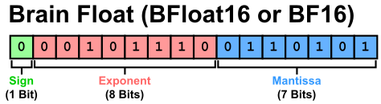{#fig-bfloat16-bits width=100%}

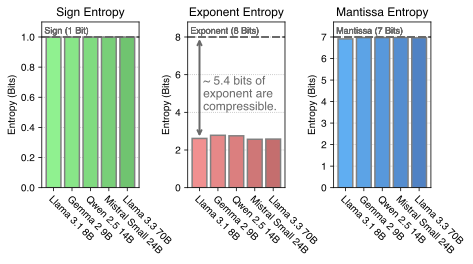{#fig-entropy width=100%}

## 动机：BFloat16 表示在信息上低效 {#sec-entropy}

为说明对 LLM 权重进行无损压缩的必要性，我们分析近期 LLM 的 BFloat16 权重可压缩性。
具体而言，我们使用香农熵度量 LLM 所有线性投影矩阵中 BFloat16 各组成部分（符号、指数、尾数）的信息量。
香农熵 $H(\cdot)$ 定义为：

$$
H(X) = -\sum_{x \in \mathcal{X}} p(x) \log_2 p(x).
$$ {#eq-entropy}

其中 $X$ 是取值空间为 $\mathcal{X}$ 的离散随机变量，$p: \mathcal{X} \to [0,1]$ 为其概率质量函数。
我们在图 @fig-entropy 中展示了计算得到的熵值。
可以看到，符号位与尾数位的熵接近各自位宽，表明压缩潜力有限。
相比之下，指数位熵显著更低，约为 2.6 位，而其分配位宽为 8 位，显示出巨大无损压缩潜力。

为理解这一差异，我们在附录中可视化了所有 BFloat16 组成部分的频率分布（图 @fig-relative-frequency），以及指数值的排序频率（图 @fig-frequency-vs-rank）。
符号与尾数在各自范围内分布相对均匀，而指数分布高度不均衡：256 个 8-bit 值中仅约 40 个会出现，其余从未出现。
排序频率也快速衰减。
这些观察揭示了指数的低熵及其可压缩性。

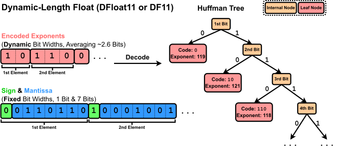{#fig-dfloat11 width=100%}

## Dynamic-Length Float：面向高效 GPU 推理的无损 LLM 压缩 {#sec-dfloat11}

为解决 BFloat16 权重表示的显著信息低效，我们提出一种基于熵编码的无损压缩框架，用于编码浮点参数。
具体来说，我们根据模型权重中指数的分布构建 Huffman 树。
然后对指数进行 Huffman 编码，而符号与尾数保持原样。
指数被编码并紧密打包进字节数组 $\mathsf{EncodedExponent}$，而符号与尾数保存在另一个字节数组 $\mathsf{PackedSignMantissa}$ 中。
图 @fig-dfloat11 展示了 DFloat11（DF11）格式，用于紧凑表示 BFloat16 模型参数。

### 核心挑战：使用压缩权重实现高效 GPU 推理

尽管 DFloat11 实现了无损压缩，但高效 GPU 推理仍是关键挑战。
熵编码后的权重使用可变长度编码，无法直接参与矩阵乘法。
因此，每个权重矩阵必须在使用前在线解压回 BFloat16，完成计算后立即丢弃以节省显存。
然而，传统 Huffman 解码本质上是顺序的，需要对每个元素逐位遍历树结构，难以适配 GPU 并行架构。
简单地为每个权重分配一个线程进行解压会导致低利用率与高延迟。
解决这一瓶颈是可用压缩推理的关键。

在接下来的段落中，我们详细介绍我们的解决方案：一组面向硬件的算法设计，用于在大规模并行环境下进行低延迟解码。
我们的方案包括三项关键组件：
1. 使用可放入 GPU SRAM 的紧凑查找表进行基于查表的高效解码。
2. 通过轻量辅助变量引入两阶段 kernel 以协调所有线程的读写。
3. 在 Transformer block 级别进行解压以降低延迟。

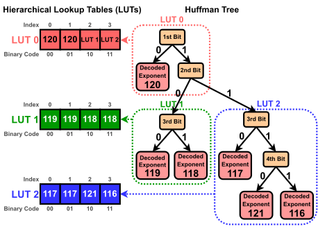{#fig-hierarchical-luts width=100%}

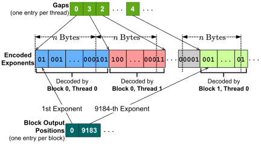{#fig-gaps-outputpos width=100%}

### 使用分层查找表实现高效解码 {#sec-lut}

传统 Huffman 解码需要逐位读取编码流并沿树遍历。
然而，这种方法在 GPU 上效率低下，原因是分支频繁且并行性不足。
为实现高效解码，我们采用基于查找表的方法[@huffman_gap_arrays]。

设 Huffman 码的最大长度为 $L$，我们构建大小为 $2^L$ 的查找表 $\mathsf{LUT}$。
在每个索引 $i$ 处，$\mathsf{LUT}$ 存储与 $i$ 的二进制表示前缀匹配的解码指数。
为解码下一个指数，我们从编码流中读取接下来的 $L$ 位，将其解释为 $\mathsf{LUT}$ 的索引，并取出对应的值。
为了确定在流中前进多少位，我们使用辅助表 $\mathsf{CodeLengths}$，其将每个指数映射到对应 Huffman 码长。
该解码过程的详细示例见附录 @sec-lut-decode。

在实际中，$L$ 可能很大。
对 LLM 而言，$L$ 通常在 24 到 32 之间，对应的 $\mathsf{LUT}$ 规模可达 $2^{32}$，无法放入 GPU SRAM。
为此，我们将单一 $\mathsf{LUT}$ 分解为一层层紧凑的查找表[@huffman_gap_arrays]。
具体地，我们将 Huffman 树划分为高度为 8 的若干不重叠子树。
每个子树对应一个可解码 8 位的紧凑 LUT，仅需 $2^8=256$ 个条目。

图 @fig-hierarchical-luts 给出了一个高度为 4 的 Huffman 树如何分解为多个紧凑 LUT 的示例。
由于分层组织，某些条目需要作为指向下层 LUT 的引用。
我们利用 8 位指数值的稀疏性：虽然理论上有 256 个值，但在 LLM 中通常仅使用约 40 个（见附录图 @fig-frequency-vs-rank）。
因此我们将未使用的值（具体为 240–255）复用为指向其他 LUT 的指针。
这些值对应极大数值（$\pm 2^{113}$ 至 $\pm 2^{128}$），在 LLM 权重中不会出现，因此可安全作为内部标记。

我们用 $k$ 表示紧凑 LUT 的数量。
在实验中，基于 BFloat16 指数构建的 Huffman 树对应的 $k$ 通常在 4 到 8 之间。
这些 LUT 与 $\mathsf{CodeLengths}$ 合计最多占用 $(8+1)\times256$ 字节，能够轻松放入 SRAM 并支持快速重复查表。

### 两阶段 kernel 与轻量辅助变量

为利用 GPU 的并行能力，我们为每个线程分配一段连续且互不重叠的指数编码块，长度为 $n$ 字节（实验中 $n=8$）。
每个线程解码其块内 Huffman 码起始于该块范围内的元素。
由于 Huffman 码是可变长度的，线程需要先跳过若干比特才能找到第一个元素。
同样，最后一个元素可能跨越该块的末端。

该方法带来两个关键挑战：
1. 由于码长可变，每个线程的起始比特位置并不明确。
2. 除首线程外，解码元素的索引未知，因而难以确定正确的输出位置。

为解决第一个问题，我们使用 gap 数组[@huffman_gap_arrays] 指定每个线程的起始比特偏移。
数组 $\mathsf{Gaps}$ 为每个线程提供一个偏移值，表示相对于该线程起始字节的第一个有效 Huffman 码偏移。
由于最大码长为 32 位，偏移范围为 $[0,31]$，仅需 5 位存储。

对于第二个问题，若为每个线程维护输出位置，内存开销过大。
每个位置需要 32 位整数，而每个矩阵可能包含数万线程，会显著抵消 DFloat11 的压缩收益。
为降低开销，我们只保存每个线程块第一个元素的输出位置，而不是每个线程都保存。
由于每个线程块通常包含数百到数千线程，这一优化将开销从“每线程一个 32 位整数”降为“每块一个”，使内存成本可忽略。
图 @fig-gaps-outputpos 展示了 *gap* 与 *block-level output position* 数组如何编码与指数编码相关的元数据。

为支持该设计，我们实现了**两阶段** kernel。
在**第一阶段**，每个线程解码其分配块并统计元素数量，但不向 HBM 写入。
随后，同一线程块内的线程同步，对元素计数做前缀和以计算每线程输出位置。
该步骤使用 Blelloch 算法[@blelloch]。
在**第二阶段**，每个线程再次解码同一块，并将结果写入 SRAM 的写缓冲区中对应位置。
为避免冗余的全局内存访问，指数编码在第一阶段前被加载进 SRAM。
当所有解码值写入 SRAM 后，再一次性合并写回 HBM。
两阶段 kernel 的伪代码见附录“算法 1”。

### Transformer block 级别解压

至此，我们给出了在大规模并行环境下解压熵编码指数的完整方案。
推理时，DFloat11 格式的权重以及辅助变量（线程级 gap 数组与块级输出位置数组）都保存在 GPU 内存中。
当需要进行矩阵乘法时，权重矩阵会在线解压成 BFloat16 格式。
矩阵乘法完成后，该 BFloat16 矩阵立即丢弃以节省显存。

在实践中，单个权重矩阵的解压往往难以充分利用 GPU 资源。
矩阵越大，解压吞吐越高。
图 @fig-transfer-vs-decompression 展示了 DFloat11 解压随矩阵规模增长的趋势。
为提高吞吐并隐藏延迟，我们提出将多个矩阵的解压合并为批次。
具体而言，我们以 Transformer block 为单位，对其中的所有 DFloat11 权重矩阵进行一次批量解压。
该批量解压发生在 Transformer block 前向计算之前。
我们也压缩 token embedding 与语言模型输出头。
由于这些矩阵足够大以饱和 GPU 资源，因此不需要批量解压。

# 实验 {#sec-experiments}

::: {style="overflow-x:auto"}
: DF11 在不同模型上的统计信息。表中展示压缩前后的模型规模。 {#tbl-compression}

| 模型 | 原始 $\rightarrow$ DF11 压缩 | 压缩比 | 平均比特宽度 |
|---|---:|---:|---:|
| *Large Language Models* |  |  |  |
| Llama 3.1 8B Instruct | 16.06 GB $\rightarrow$ 10.90 GB | 67.84% | 10.85 |
| Llama 3.3 70B Instruct | 141.11 GB $\rightarrow$ 95.40 GB | 67.61% | 10.82 |
| Llama 3.1 405B Instruct | 811.71 GB $\rightarrow$ 551.22 GB | 67.91% | 10.87 |
| Qwen 3 14B | 29.54 GB $\rightarrow$ 20.14 GB | 68.17% | 10.91 |
| QwQ 32B | 65.53 GB $\rightarrow$ 44.65 GB | 68.14% | 10.90 |
| Mistral Nemo Instruct | 24.50 GB $\rightarrow$ 16.59 GB | 67.74% | 10.84 |
| Mistral Small 3 | 47.14 GB $\rightarrow$ 31.86 GB | 67.58% | 10.81 |
| Phi 4 Reasoning Plus | 29.32 GB $\rightarrow$ 19.83 GB | 67.64% | 10.82 |
| DeepSeek R1 Distill Llama 8B | 16.06 GB $\rightarrow$ 10.89 GB | 67.81% | 10.85 |
| *Diffusion Transformers* |  |  |  |
| FLUX.1 dev | 23.80 GB $\rightarrow$ 16.33 GB | 68.61% | 10.98 |
| FLUX.1 schnell | 23.78 GB $\rightarrow$ 16.31 GB | 68.58% | 10.97 |
| Stable Diffusion 3.5 Large | 16.29 GB $\rightarrow$ 11.33 GB | 69.52% | 11.12 |
:::

::: {style="overflow-x:auto"}
: BF16 与 DF11 在不同基准上的精度与困惑度对比。DF11 压缩在精度与困惑度上完全无损。 {#tbl-accu-ppl}

| 模型 | 数据类型 | MMLU | TruthfulQA | WikiText | C4 |
|---|---|---:|---:|---:|---:|
| Llama 3.1 8B Instruct | BF16 | 68.010 $\pm$ 0.375 | 36.965 $\pm$ 1.690 | 8.649 | 21.677 |
| Llama 3.1 8B Instruct | DF11（本文） | 68.010 $\pm$ 0.375 | 36.965 $\pm$ 1.690 | 8.649 | 21.677 |
:::

::: {style="overflow-x:auto"}
: 扩散模型在 BF16 与 DF11 下的峰值显存与文生图耗时对比（单张 A5000 GPU）。 {#tbl-img-gen}

| 模型 | 峰值显存 BF16 (GB) | 峰值显存 DF11 (GB) | 生成时间 BF16 (s) | 生成时间 DF11 (s) |
|---|---:|---:|---:|---:|
| Stable Diffusion 3.5 Large | 16.44 | 11.78 | 66.36 $\pm$ 0.13 | 69.08 $\pm$ 0.11 |
| FLUX.1 dev | 23.15 | 16.72 | 74.41 $\pm$ 0.15 | 78.53 $\pm$ 0.18 |
:::

我们评估 DF11 压缩效果以及其 GPU 推理效率。
我们将多种最新 LLM 与 DM 从原始 BFloat16 格式压缩为 DF11，并报告压缩比。
随后，我们在不同 GPU 上对 DF11 压缩模型与未压缩模型进行推理性能对比，并进行消融分析以理解压缩影响。

**软件与硬件。** 我们用 CUDA 与 C++ 实现 DF11 解压 kernel，并将其集成进 HuggingFace Transformers 推理框架[@huggingface]。
我们将 DF11 模型的推理效率与原始 BF16 模型进行对比。
我们使用 HuggingFace Accelerate 以支持 CPU offloading 与多 GPU 推理。
为评估 DF11 kernel 在不同硬件上的性能，我们在多台具有不同 GPU/CPU 配置的机器上开展实验。
所有实验机器的硬件规格见附录表 @tbl-hardware。

## 结果 {#sec-results}

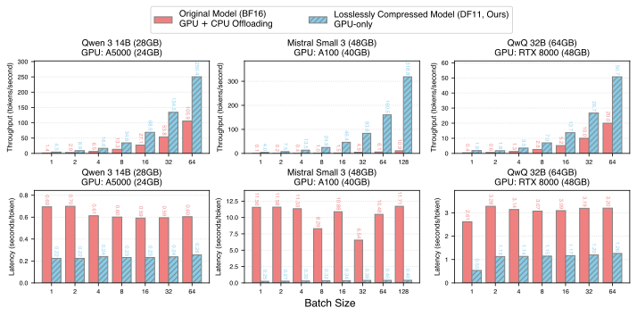{#fig-latency-throughput-cpu width=100%}

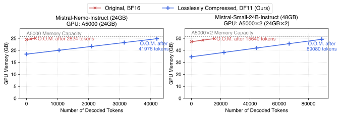{#fig-memory-usage width=100%}

**DF11 将模型压缩到 70% 体积。** 表 @tbl-compression 给出了 DF11 在多种 LLM 与 DM 上的压缩比。
具体而言，我们对 LLM 的所有权重矩阵与 token embedding 进行压缩，对 DM 的 transformer block 中所有权重矩阵进行压缩。
被压缩的模型包括 Llama 3.1/3.3[@grattafiori2024llama]、Qwen 3[@yang2024qwen2]、Mistral Nemo/Small[@mistral2024nemo; @mistral2025small3]、Phi 4[@phi4]、DeepSeek R1 Distilled[@guo2025deepseek]、Stable Diffusion 3.5[@stablediffusion35] 与 FLUX.1[@flux]。
DF11 在所有模型上实现约 70% 压缩，对应有效比特宽度约 11 位。

**精度与困惑度评估验证 DF11 无损。** 我们在标准基准上对 DF11 的无损性进行评估。
评估使用 `lm_evaluation_harness`[@eval-harness]，报告 MMLU[@mmlu] 与 TruthfulQA[@truthfulqa] 的精度，以及 WikiText[@wikitext] 与 C4[@c4] 的词级困惑度。
结果见表 @tbl-accu-ppl。
可以看到，压缩模型在精度与困惑度上与原 BF16 模型完全一致。
我们还在附录 @sec-sd35 中给出了 BF16 与 DF11 的 Stable Diffusion 3.5 Large 文生图对比。
在相同随机种子与提示词下，两者生成图像像素级一致。

**DF11 在推理效率上优于 CPU offloading。** 我们在多种硬件平台上对 DF11 与 BF16 的推理性能进行对比。
由于显存限制，BF16 模型无法完全放入单 GPU，需要部分 CPU offloading，而 DF11 模型可以完全放入 GPU。
为公平比较，我们尽量保留 BF16 模型的 GPU 计算，仅将必要部分卸载到 CPU。
延迟与吞吐在 100-token 预热后测量，然后在空提示词上生成 100 个 token，批大小取不同值。
每组配置运行五次，报告平均结果。
如图 @fig-latency-throughput-cpu 所示，DF11 在所有场景下均优于 BF16+CPU offloading，延迟降低或吞吐提升 2.31–46.24 倍。
多 GPU 对比见附录图 @fig-latency-throughput-gpu。

**DF11 降低扩散模型显存占用且延迟影响很小。**
我们在扩散模型上评估 DF11 压缩的影响，测量 1024×1024 图像的峰值显存与生成延迟（五次平均）。
BF16 与 DF11 都未使用 CPU offloading。
表 @tbl-img-gen 显示，DF11 为 Stable Diffusion 3.5 与 FLUX.1 分别减少 28.3% 与 27.8% 的显存占用。
延迟增加很小：Stable Diffusion 增加 4.1%，FLUX.1 增加 5.5%。

**DF11 的显存节省可支持更长的生成长度。** DF11 不仅减少推理所需 GPU 数量，还能在相同显存预算下支持更长生成。
在解码过程中，KV cache 随 token 数量线性增长，很快成为显存瓶颈。
图 @fig-memory-usage 展示了 batch size 1 时 BF16 与 DF11 的显存占用随 token 数量的变化。
DF11 允许在触及显存上限之前多生成 5.70–14.86 倍的 token。

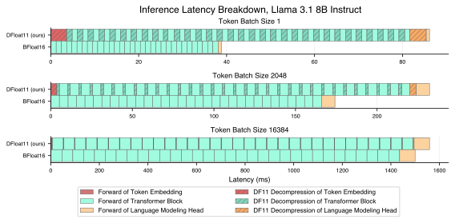{#fig-latency-breakdown width=100%}

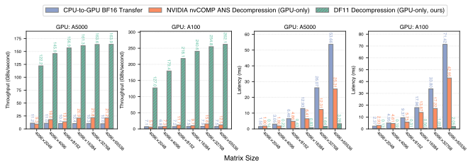{#fig-transfer-vs-decompression width=100%}

## 消融研究 {#sec-ablation}

**延迟分解显示：大批量下解压开销被摊薄。** 我们在 A100-40GB 上评估 *Llama 3.1 8B Instruct* 的 BF16 与 DF11 延迟分解，批大小不同。
每个设置下，我们统计 10 次运行的各组件平均延迟，如图 @fig-latency-breakdown 所示。
DF11 额外增加了 token embedding、Transformer block 与 LM head 的解压延迟。
该开销为常数，与 batch size 无关，因此 batch size 增大时可被摊薄。

**DF11 解压显著快于 CPU→GPU 传输与 nvCOMP ANS。** 我们将 DF11 的解压延迟与吞吐与两种基线进行比较：CPU→GPU 权重传输，以及 NVIDIA nvCOMP 的 ANS 解压[@ans; @nvcomp]。
实验使用 Llama 3.1 8B Instruct 的 LM head 切片矩阵。
如图 @fig-transfer-vs-decompression 所示，DF11 的吞吐最多可比 CPU 传输高 34.95 倍，解压速度最多可比 nvCOMP 快 20.97 倍。
DF11 的压缩率也更高（68% vs. nvCOMP 的 79%）。
此外，随着矩阵规模增大，DF11 解压吞吐提升更明显，得益于 GPU 更高利用率。

# 相关工作 {#sec-related}

**模型权重的数据格式。** 全精度模型权重通常存储为 BF16、FP16 或 FP32。
已有工作提出了多种 4-bit 压缩格式，如 FP4、INT4、NF4（NormalFloat）[@dettmers2023qlora]、AF4（AbnormalFloat）[@yoshida2023af4]、SF4（Student Float）[@dotzel2024learning]，它们用 4 位表示每个参数。
与这些有损格式不同，本文提出的 DF11 是无损压缩格式。

**无损模型压缩。** 虽然剪枝[@frantar2023sparsegpt] 与量化[@lin2024awq; @frantar2022gptq] 等有损方法研究充分，无损压缩研究仍较少。
已有约四项工作涉及该方向。
*Deep Compression*[@han2015deep_comp] 对量化 CNN 使用 Huffman 编码[@huffman_coding]，额外带来 22% 压缩。
*ZipNN*[@hershcovitch2024zipnn] 将该方法扩展至语言模型，并优于传统压缩方法。
但二者都只关注存储效率，不支持推理时收益。
*NeuZip*[@hao2024neuzip] 是唯一支持 GPU 推理的先前工作，它使用 ANS 并进行逐层解压，依赖 NVIDIA 的 nvCOMP 实现 GPU 操作。
然而 nvCOMP 已不再开源，只有二进制版本，限制了其可用性。
此外如图 @fig-transfer-vs-decompression 所示，nvCOMP ANS 的延迟更高、吞吐更低，明显落后于 DFloat11 kernel。
*Huff-LLM*[@yubeaton2025huffllm] 面向 FPGA 等硬件，不适用于 GPU。
更多相关格式的讨论见附录 @sec-extended-related-work。

# 结论 {#sec-conclusion}

我们提出 *Dynamic-Length Float*（DFloat11），一种面向高效 GPU 推理的无损压缩框架，可用于 BFloat16 模型（包括 LLM 与 DM）。
DFloat11 利用基础模型权重中的信息冗余，通过熵编码的动态长度编码实现接近信息论极限的压缩率。
为实现高效部署，我们设计了硬件感知的算法，使得压缩权重可直接进行高速推理。
大量实验表明，DFloat11 显著降低 LLM 与 DM 的显存需求、支持更长生成长度，并在保持逐位一致精度的同时只引入极小的解压开销。

# 致谢 {#sec-ack}

本工作得到 NSF SHF-2211815 与 Ken Kennedy Institute Cluster Grants 的支持。
此外，Henry 与 Xia 得到 ITE-2429680、IIS-2310260 与美国交通部（USDOT）Tier-1 University Transportation Center（UTC）Transportation Cybersecurity Center for Advanced Research and Education（CYBER-CARE）项目 #69A3552348332 的支持。
Mohsen 与 Vipin 得到 OAC-2320952、OAC-2112606 与 OAC-2117439 的支持。
本文观点与结论仅代表作者本人，不代表任何资助或支持机构的观点。

# 附录 {#sec-appendix}

## 讨论：量化是否是通用解？ {#sec-motivation}

我们的工作动机之一是理解：**对于像 LLM 这样的大规模模型，在保持与原模型 100% 一致输出的前提下进行无损压缩，是否是一条值得深入研究的实践方向。**
具体来说，DFloat11 将 LLM 压缩到约 11 位，与常见有损量化技术相比（模型通常被压缩到更低比特宽度，如 8 位或 4 位[@frantar2022gptq; @lin2024awq]），其表现如何？

答案远比简单的“是/否”或一刀切的优劣判断更复杂。
例如，一些基准研究（如[@gong2024llmc; @yang2024llmcbench; @jin2024comp_eval_quant]）常提示 8-bit 量化是一种相对“安全”的压缩方案。
尽管是有损的，8-bit 模型在多种标准基准上仍能保持较强性能。
但我们注意到，这些基准通常聚焦在有限任务集合（如 WikiText2 困惑度、MMLU、常识推理），无法全面反映真实使用场景，尤其是终端用户视角下的表现。

即便如此，“现有基准无法捕捉 8-bit 与 16-bit 模型性能差距”的论点本身也受限于当前基准体系的局限性，因此难以提供大量直接证据。
但已有一些报告开始揭示差距。
例如，LLM Arena 的人类评测[^lmarena]显示，Llama-3.1-405B-Instruct[@grattafiori2024llama] 与其 W8A8 版本（Llama-3.1-405B-Instruct-FP8）之间存在显著差距，尤其是在编码（1293 vs. 1277）与长查询任务（1282 vs. 1275）上。
类似地，将 DeepSeek-R1-Distill-Llama-70B[@guo2025deepseek] 从 16 位量化到 8 位后，其 GPQA 分数从 9.51% 降到 7.25%，下降 23.7%[^r1quant]。
此外，推理能力对压缩损失尤为敏感。
最新基准[@liu2025quant_reason_bench] 表明，对 DeepSeek-R1-Distill-Qwen-1.5B 使用 8-bit SmoothQuant[@xiao2023smoothquant]（涵盖权重、注意力与 KV cache）会在 AIME、MATH-500、GPQA-Diamond 与 LiveCodeBench 等数据集上导致 9.09% 的平均下降（48.82% 降至 44.29%）。
更多关于 8-bit 量化与未压缩模型性能差距的证据见附录 @sec-lossy-quant-impact。

虽然“在哪些任务、哪种模型、哪种量化方式、何种条件下会对 FP16/BF16 造成明显下降”的问题仍难以穷尽，但可以认为有损量化为终端用户引入了需额外验证的复杂变量。
为消除这种负担，DFloat11 提供了一个有吸引力的替代方案：**在保持与原模型 100% 一致性能的同时，将显存占用降至约 70%，并带来吞吐收益**，这对资源受限部署尤为实用。

## 扩展相关工作 {#sec-extended-related-work}

**模型权重的数据格式。** LLM 权重通常存储为 FP16 或 BFloat16（官方写法 *bfloat16*[^bfloat16]）。
FP16 分配 1 位符号、5 位指数、10 位尾数，而 BFloat16 分配 1 位符号、8 位指数、7 位尾数。
相比 FP16，BFloat16 具有更大的动态范围，代价是精度略低，这在训练中可提高数值稳定性并缓解溢出问题[@fujii2024fp8vsbf16; @kalamkar2019studybf16]。

压缩数据格式通常追求更低比特宽度。
例如 FP8 有 E4M3（4 指数位、3 尾数位、1 符号位）与 E5M2 两种配置，并已在 LLM 训练与开发中得到一定使用。
INT8 也有广泛研究，如 `LLM.int8()`[@dettmers2022llmint8] 及其后续工作。
更强调效率的格式，如 FP4、INT4、NF4[@dettmers2023qlora] 与 AF4[@yoshida2023af4] 仅使用 4 位。
本文主要关注 ≥8 位的格式，因为基准文献[@yang2024llmcbench; @gong2024llmc; @liu2025quant_reason_bench] 常认为 8-bit 量化的性能损失可忽略，但我们在 @sec-motivation 中指出该结论可能受到基准选择的偏差影响。

**无损模型压缩。** 虽然剪枝与量化[@frantar2023sparsegpt; @lin2024awq; @frantar2022gptq] 等有损压缩技术已广泛研究，但无损压缩仍相对冷门。
我们查明此前大约有四项工作进行有意义探索。
*Deep Compression*[@han2015deep_comp] 对量化 CNN 使用 Huffman 编码[@huffman_coding]，在检查点上额外实现约 22% 压缩。
*ZipNN*[@hershcovitch2024zipnn] 将该思路扩展到语言模型，并与 zlib[@deutsch1996zlib] 与 zstd[^zstd] 等传统压缩工具相比取得更好效果。
但这条路线（及其工业版，如 ezm7[^ezm7][^ezm7b]）仅对存储有效，对推理无益。
在大规模训练中，存储节省确有意义（频繁快照与回滚[@wang2023gemini_ckpt]），但对日常 LLM 用户影响有限，因为下载通常是一次性成本。
即使将 checkpoint 压缩 50%，也只是最多将下载时间减半，且对整个生命周期影响有限。
更重要的是，checkpoint 存储在磁盘上，容量通常远大于推理时的 GPU HBM，推理的主要瓶颈仍是显存。

我们认为，如果无损压缩能在推理阶段带来效率提升，其价值将更高，尤其是在 GPU 上进行服务时。
在这方面，*NeuZip*[@hao2024neuzip] 是唯一支持 GPU 推理的先前工作。
NeuZip 通过逐层解压保持较小内存占用，但依赖 NVIDIA nvCOMP——“针对 NVIDIA GPU 优化的高速压缩/解压库”[^nvcomp]。
遗憾的是，nvCOMP 已不再开源，仅提供二进制，限制了研究可持续性。
并且我们实证发现，nvCOMP 的推理吞吐与延迟显著劣于 DFloat11 kernel，导致以显存换性能的代价过高（见图 @fig-transfer-vs-decompression）。

另一项相关工作是 *Huff-LLM*[@yubeaton2025huffllm]，其目标是降低显存开销并保持高效推理，但适用于 FPGA 类硬件，不适用于 GPU。
据我们所知，本文提出的 DFloat 数据格式（及 DFloat11 kernel）是唯一具有无损压缩优势且能在 GPU 上高效推理的格式。

**高效 LLM 推理。** LLM 计算密集且资源需求高，因此推理效率是研究重点[@efficient_llm_survey]。
FlashAttention[@dao2022flashattention] 通过 kernel 融合加速 GPU 上的精确注意力计算，NoMAD Attention[@nomadattention] 通过寄存器内查表加速 CPU 上的注意力计算。
模型压缩也是降低推理资源需求的重要途径。
量化方法如 GPTQ[@frantar2022gptq]、AWQ[@lin2024awq]、SmoothQuant[@xiao2023smoothquant]、LeanQuant[@leanquant]、CQ[@cq]、KVQuant[@hooper2024kvquant] 与 KIVI[@liu2024kivi] 通过压缩权重、激活或 KV cache 来减少显存占用与提升效率。
压缩也用于微调：LoRA[@lora]、QLoRA[@dettmers2023qlora] 与 SketchTune[@sketchtune] 压缩权重增量，GaLore[@galore] 与 SARA[@sara] 压缩优化器状态。
另一条相关路线是*无损高效解码*，例如*推测解码*[@xia2022sd; @leviathan2023sd; @xia2024unlocking_sd_survey] 与 *n-gram 候选解码*[@fu2024lookahead; @anonymous2025fafo]，在保持生成质量的同时降低延迟。
DFloat11 与这些工作的差异在于：它在保持无损生成质量的同时显著降低显存占用，而多数无损高效解码方法的显存消耗不低于原模型。

## BFloat16 值的频率分布 {#sec-bfloat16-freq}

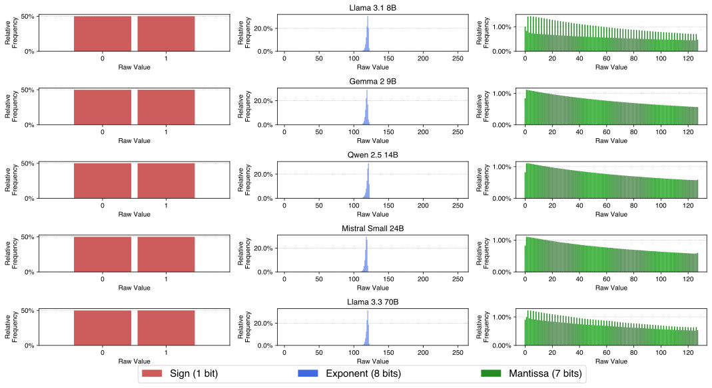{#fig-relative-frequency width=100%}

图 @fig-relative-frequency 展示了多种 LLM 的 BFloat16 权重中符号、指数与尾数不同取值的频率分布。
图 @fig-frequency-vs-rank 展示了 LLM 权重中指数值的排序频率分布。

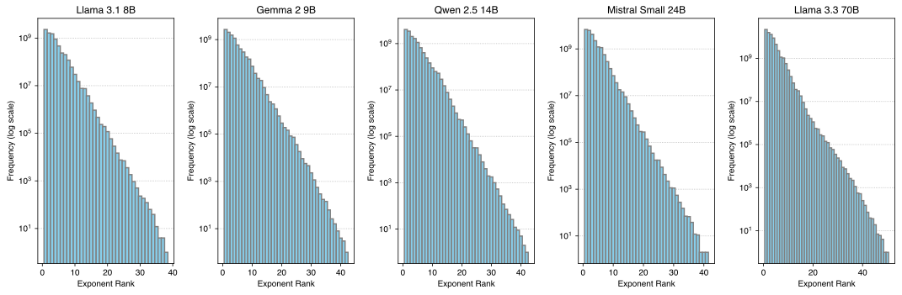{#fig-frequency-vs-rank width=100%}

## DFloat11 解压 GPU kernel 的伪代码 {#sec-alg}

算法 1 给出了将 DFloat11 解压为 BFloat16 的两阶段 GPU kernel 伪代码。

```text
算法 1：将 DFloat11 解压为 BFloat16 的 GPU kernel

过程 DF11ToBF16
  需求：
    - EncodedExponent, PackedSignMantissa：字节数组
    - LUT_1..LUT_k, CodeLengths：大小为 256 的 8-bit 无符号数组
    - Gaps：5-bit 无符号数组（每个线程一个）
    - BlockOutputPos：32-bit 无符号数组（每个块一个）
    - Outputs：BFloat16 数组
    - B, T, n, k：线程块数、线程数、每线程处理字节数、紧凑 LUT 数
  将 EncodedExponent 划分为块：
    EncodedExponent_1..EncodedExponent_B，每块大小为 nT 字节
  对于每个块 b=1..B（块间并行）：
    将 EncodedExponent_b 载入 SRAM
    将 EncodedExponent_b 划分为：EncodedExponent_{b,1}..EncodedExponent_{b,T}，每块 n 字节
    将 LUT_1..LUT_k 与 CodeLengths 载入 SRAM
    初始化 NumElements[1..T], ThreadOutputPos[1..T] 为 0
    初始化 SRAM 中的 BFloat16 写缓冲 WriteBuffer
    对于每个线程 t=1..T（线程间并行）：
      Phase 1：确定每线程初始输出位置
      BitOffset ← Gaps[bT+t]
      while BitOffset < 8n:
        读取 EncodedExponent_{b,t} 中从 BitOffset 开始的 4 字节到 Byte_1..4
        i ← 1
        Exponent ← LUT_1[Byte_i]
        while Exponent ≥ 240:
          i ← i + 1
          Exponent ← LUT_{(257 - Exponent)}[Byte_i]
        BitOffset ← BitOffset + CodeLengths[Exponent]
        NumElements[t] ← NumElements[t] + 1
      线程同步
      用 Blelloch 前缀和计算 ThreadOutputPos
      ThreadOutputPos[t] ← BlockOutputPos[b] + Σ_{i=1}^{t-1} NumElements[i]
      Phase 2：写回解码的 BFloat16
      BitOffset ← Gaps[bT+t]
      while BitOffset < 8n:
        读取 EncodedExponent_{b,t} 中从 BitOffset 开始的 4 字节到 Byte_1..4
        i ← 1
        Exponent ← LUT_1[Byte_i]
        while Exponent ≥ 240:
          i ← i + 1
          Exponent ← LUT_{(257 - Exponent)}[Byte_i]
        Byte ← PackedSignMantissa[ThreadOutputPos[t]]
        Sign ← Byte bitwise_and 0b10000000
        Mantissa ← Byte bitwise_and 0b01111111
        WriteBuffer[ThreadOutputPos[t] - BlockOutputPos[b]] ←
          (Sign bitwise_left_shift 8) bitwise_or
          (Exponent bitwise_left_shift 7) bitwise_or Mantissa
        BitOffset ← BitOffset + CodeLengths[Exponent]
        ThreadOutputPos[t] ← ThreadOutputPos[t] + 1
    合并写回 HBM：
      Outputs[BlockOutputPos[b]..BlockOutputPos[b+1]-1] ←
        WriteBuffer[0..(BlockOutputPos[b+1]-BlockOutputPos[b]-1)]
```

::: {style="overflow-x:auto"}
: 实验所用服务器硬件规格。 {#tbl-hardware}

| 服务器 | GPU | GPU 显存 | CPU | CPU 内存 |
|---|---|---|---|---|
| Server 1 | NVIDIA RTX A5000 | 24564 MiB | AMD EPYC 7513 32-Core | 504 GB |
| Server 2 | NVIDIA A100 | 40960 MiB | AMD EPYC 7742 64-Core | 1.48 TB |
| Server 3 | NVIDIA Quadro RTX 8000 | 49152 MiB | AMD EPYC 7742 64-Core | 1.48 TB |
:::

## 实验硬件配置 {#sec-hardware}

表 @tbl-hardware 给出了实验所用服务器的硬件配置。

## DFloat11 压缩耗时 {#sec-compression-time}

::: {style="overflow-x:auto"}
: 不同模型中每个 Transformer block 的压缩耗时。 {#tbl-time}

| 模型 | 每个 Transformer block 的压缩耗时 (s) |
|---|---:|
| Llama 3.1 8B Instruct | 191 |
| Llama 3.3 70B Instruct | 547 |
| Llama 3.1 405B Instruct | 2133 |
:::

表 @tbl-time 报告了不同规模模型压缩单个 Transformer block 的时间。
压缩是一次性的预处理步骤，每个模型只需执行一次，且在单 CPU 线程上完成。
由于不同 Transformer block 的权重存储相互独立，压缩可在多线程并行执行，从而具备良好的可扩展性。

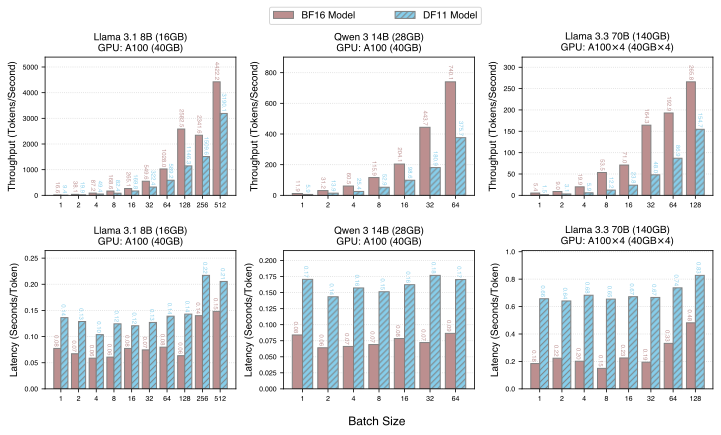{#fig-latency-throughput-gpu width=100%}

## GPU 推理效率对比：BF16 vs. DF11 {#sec-gpu-eff}

图 @fig-latency-throughput-gpu 展示了 BF16 与 DF11 模型在 A100 上、不同模型与 batch size 下的推理效率对比。

::: {style="overflow-x:auto"}
: INT8 量化在不同任务上的误差对比。“Math” 表示 MATH Hard（2 shots），“GPQA CoT” 为 2 shots，“Δ” 为 INT8 量化误差差值。 {#tbl-lossy-accuracy}

| 模型 | 数据类型 | Math | GPQA CoT |
|---|---|---:|---:|
| Llama-3.1-8B-Instruct | BF16 | 23.92 | 15.18 |
| Llama-3.1-8B-Instruct | INT8 | 19.92 | 14.06 |
| Llama-3.1-8B-Instruct | Δ | 4.0 | 1.12 |
:::

## 有损量化的影响 {#sec-lossy-quant-impact}

表 @tbl-lossy-accuracy 给出了原始 Llama 模型与 INT8 量化版本的精度对比。

## 使用紧凑查找表高效解码 Huffman 码 {#sec-lut-decode}

### 双查找表方法

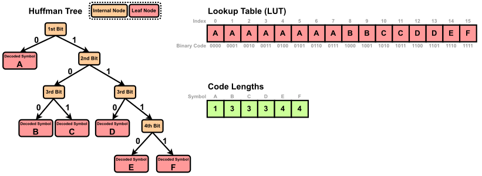{#fig-huffman-lut width=100%}

Huffman 解码可以通过遍历 Huffman 树完成：从根开始，编码流的每一位决定一次分支，直到叶节点得到符号。
这种逐位遍历在概念上简单，但在实践中效率低。
因为每次分支依赖前一位，导致频繁的内存访问与条件跳转。
这一模式在 GPU 上尤其低效，会引起分支发散并限制指令级并行。
一种广泛采用的替代方案是*基于查找表的解码*[@huffman_gap_arrays]，将 Huffman 树展平成两张紧凑查找表。
这使得每个符号可通过两次数组查找与一次位移完成解码，显著提升吞吐。

我们使用两张表 $\mathsf{LUT}$ 与 $\mathsf{CodeLengths}$，实现高效且无分支的 Huffman 解码。
设 $L$ 为 Huffman 码本中最长码字的长度。
我们构建大小为 $2^L$ 的主查找表 $\mathsf{LUT}$，其中每个条目将 $L$ 位二进制序列映射到其所编码的第一个符号。

图 @fig-huffman-lut 给出了 $L=4$ 的示例，符号集为 $\texttt{A, B, C, D, E, F}$。
为清晰起见，我们以字母表示符号，实际对应 BFloat16 指数值。
查找表 $\mathsf{LUT}$ 含 $2^4=16$ 个条目，索引为所有可能的 4 位序列。
每个条目存储其前缀匹配的符号。
若符号码长小于 $L$，其会占据多个连续条目。
例如，若 $\texttt{A}$ 编码为 `0`，则从 `0000` 到 `0111` 均以 `0` 开头，对应条目 0–7 都映射到 $\texttt{A}$。
相反，码长为 $L$ 的符号只占一个条目。
例如 $\texttt{E}=1110$ 与 $\texttt{F}=1111$ 分别映射到条目 14 与 15。
这样构造得到稠密前缀表，可用一次查表解码一个符号。

为推进编码流以解码下一个符号，我们还存储每个符号的码长。
第二张查找表 $\mathsf{CodeLengths}$ 将符号映射到 Huffman 码长。
示例中码长分别为：$\texttt{A:1, B:3, C:3, D:3, E:4, F:4}$。
这两张表使得解码过程快速且确定，可重复如下步骤：

1. 用编码流的下 $L$ 位索引 $\mathsf{LUT}$ 并取出符号。
2. 在 $\mathsf{CodeLengths}$ 中查询该符号的码长，确定要消耗多少位。
3. 前移编码流并重复。

该方法消除了分支与指针追踪，特别适合 GPU 并行计算。

### 将 $\mathsf{LUT}$ 分解为分层紧凑查找表 {#sec-hierarchical-luts}

主查找表 $\mathsf{LUT}$ 含 $2^L$ 个条目，其中 $L$ 是最长码长。
虽然这可实现常数时间解码，但表规模随 $L$ 指数增长。
在实践中，基于 BFloat16 指数构建的 Huffman 树中 $L$ 多为 24–32，表规模达 $2^{24}$–$2^{32}$，远超 GPU SRAM 容量。
为此，我们将 $\mathsf{LUT}$ 分解为多个更小的查找表，在片上内存内完成解码。

#### 分层表结构

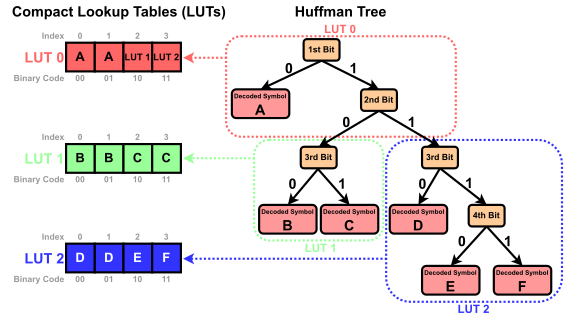{#fig-huffman-multi-lut width=100%}

我们将 $\mathsf{LUT}$ 分解为分层的紧凑查找表。
每个表对应 Huffman 树的一个子树，负责解码 $b$ 位。
每个表读取接下来 $b$ 位，并执行以下两种操作之一：

1. 直接返回解码出的符号。
2. 将解码任务委派给层次中下一张表。

这种分层结构与原 Huffman 树结构一致，但显著降低总内存开销。

图 @fig-huffman-multi-lut 示意将 Huffman 树划分为 3 个子树，每张表解码 2 位。
使用这三张 LUT 的解码过程如下：

- $\mathsf{LUT}_0$：读取前两位，出现三种情况：
  - `00` 或 `01` → 解码为 $\texttt{A}$。
  - `10` → 转入 $\mathsf{LUT}_1$。
  - `11` → 转入 $\mathsf{LUT}_2$。
- $\mathsf{LUT}_1$：读取第 3–4 位：
  - `00` 或 `01` → 解码为 $\texttt{B}$。
  - `10` 或 `11` → 解码为 $\texttt{C}$。
- $\mathsf{LUT}_2$：读取第 3–4 位：
  - `00` 或 `01` → 解码为 $\texttt{D}$。
  - `10` → 解码为 $\texttt{E}$。
  - `11` → 解码为 $\texttt{F}$。

在解码 Huffman 编码的 BFloat16 指数时，我们将 $\mathsf{LUT}$ 分解为多个紧凑 LUT，每张表解码 8 位（即 $b=8$）。
这使得每一步都可读取一个字节并在 256 项数组中查表。
在实践中，$\mathsf{LUT}$ 分解得到 4–8 张紧凑 LUT，每张 256 项，能够轻松放入 SRAM。

## BF16 与 DF11 扩散模型的文生图结果 {#sec-sd35}

{#fig-sd35 width=100%}

图 @fig-sd35 展示了 Stable Diffusion 3.5 Large 在 BF16 与 DF11 权重格式下生成图像的对比。
在相同提示词与随机种子下，生成结果逐像素一致。

## 局限性 {#sec-limitations}

本文仅关注对 BFloat16 权重的无损压缩。
我们未考虑 FP32、FP16 或 FP8 等其他格式，这些格式可能需要不同的压缩策略。
虽然 DF11 提升了显存效率，但由于解压操作，会引入小但非零的延迟开销。
该开销在大 batch size 下可被摊薄，但可能影响小 batch 的低延迟应用。
我们的评估仅限于 GPU，未评估 CPU、TPU 或定制加速器等其他硬件，它们可能需要平台特定优化。

[^lmarena]: https://x.com/lmarena_ai/status/1835760196758728898
[^r1quant]: https://huggingface.co/RedHatAI/DeepSeek-R1-Distill-Llama-70B-quantized.w8a8
[^bfloat16]: https://cloud.google.com/blog/products/ai-machine-learning/bfloat16-the-secret-to-high-performance-on-cloud-tpus
[^zstd]: https://github.com/facebook/zstd
[^ezm7]: https://github.com/liuliu/s4nnc/pull/11
[^ezm7b]: https://encode.su/threads/4067-Good-Compressors-for-16-bit-floats
[^nvcomp]: https://developer.nvidia.com/nvcomp
