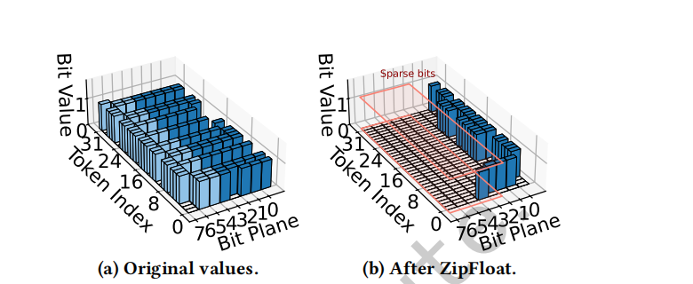
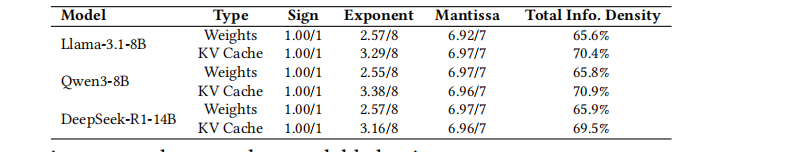
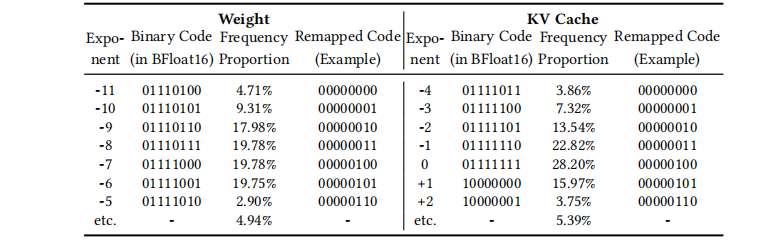
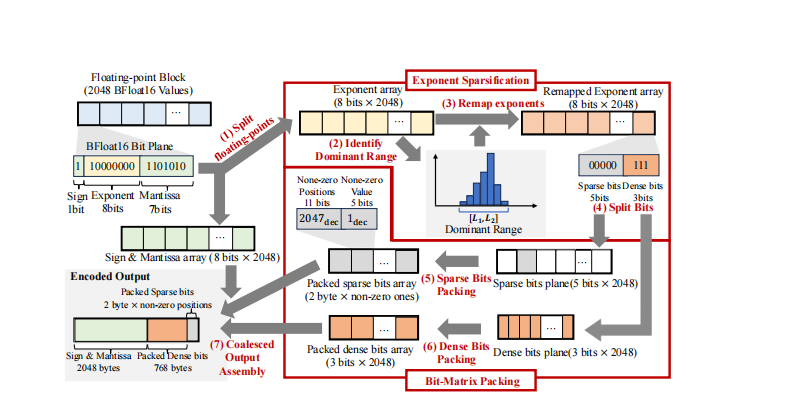
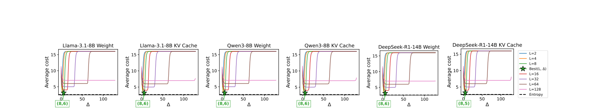
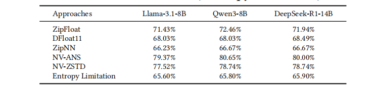
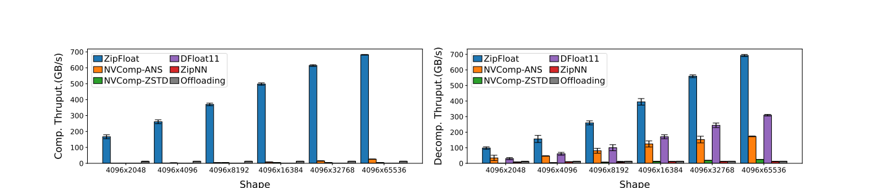
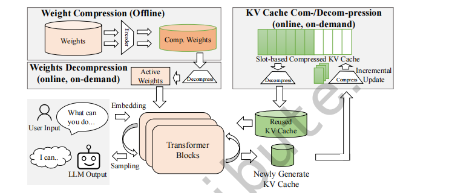
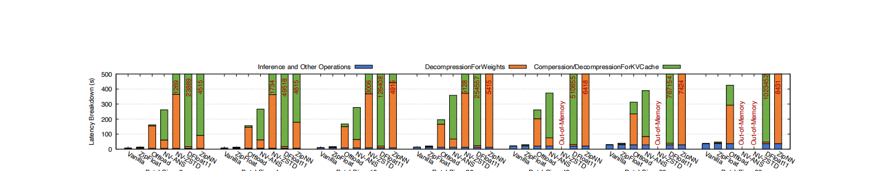
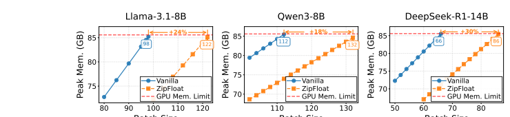

# 摘要 {#sec-abstract}

LLM 推理由于庞大的模型权重与 KV 缓存而对 GPU 显存造成巨大压力，这要求采用高效的压缩技术。
但现有方法要么牺牲精度（例如量化），要么采用吞吐受限的串行熵编码（例如 DFloat11），从而限制吞吐。
二者都会约束整体推理效率。

本文提出 ZipFloat，一种面向 LLM 的浮点压缩器，可在保持全精度的同时实现大规模并行的压缩与解压。
我们观察到，LLM 的权重与 KV 缓存值具有强烈的统计冗余，但现有浮点格式会掩蔽这种冗余，从而阻碍有效压缩。
为此，ZipFloat 采用两项技术：指数稀疏化（Exponent Sparsification）通过重新定义浮点数的二进制表示来恢复可压缩性；比特矩阵打包（Bit-Matrix Packing）利用这种结构并结合 GPU 原生并行性提供极高吞吐。

评估结果表明，ZipFloat 的压缩与解压吞吐最高可达 700 GB/s，在保持可比压缩率的同时，相比 SOTA 方法（例如 DFloat11）可提升多个数量级，从而在 LLM 系统中将 TTFT 降低超过 95%，并将推理吞吐提升超过 4 倍。

# 1 引言 {#sec-intro}

LLaMA [27]、Qwen [3] 与 DeepSeek [24] 等大语言模型（LLM）在多种任务上取得了显著成果 [5, 6, 16, 34]。
随着 LLM 规模扩大，其权重与键值（KV）缓存的规模快速增长，从而在推理阶段对 GPU 显存容量提出沉重要求。
例如，为一个具有 700 亿权重的模型提供长上下文推理服务可能需要数百 GB 的 GPU 显存，因为每生成一个 token 都会累积新的 KV 对并以浮点张量形式存储。
由于 GPU 显存极其昂贵且成本随容量近似线性增长（例如一张 48 GB 显卡往往接近 24 GB 显卡价格的两倍），这种显存膨胀会严重限制模型的可部署性并抬高成本。
这些挑战呼唤面向 LLM 推理工作负载中浮点数据的高效压缩技术。

针对这一场景的现有压缩技术可分为两类：有损与无损。

有损压缩（例如量化）[7, 25, 30, 32, 33, 37, 40] 可以显著降低 GPU 显存占用。
然而，近期研究 [36, 38] 表明，有损方法仍会引入不可忽略且常常难以预测的误差，尤其是在多轮对话、长上下文生成与代码密集型任务中。
例如，LLM-Arena [26] 显示，将 Llama-3.1-405B-Instruct 从 FP16 量化到 8-bit 会导致可感知的质量下降。
这种退化难以预测、依赖任务，并且由于需要大量验证而使生产部署复杂化（见 @sec-background）。
这些问题促使了若干近期的无损压缩方案。

{#fig-zipfloat-example width=100%}

与之相对，无损压缩保留精确的数值保真度并消除精度顾虑。
然而，现有方案（例如 DFloat11 [38]、ZipNN [14]）依赖熵编码（例如 Huffman 编码 [22]），而熵编码本质上是顺序的，因此难以适配 GPU 并行性。
因此，这些方法的吞吐通常只有数 GB/s（见 @sec-standalone），远低于 GPU 的内存带宽（约 1.8 TB/s），从而显著降低 LLM 推理的端到端效率（见 @sec-end-to-end）。

总的来说，高效的无损浮点压缩仍是 LLM 系统中的关键挑战，这需要新的技术，在保持精度的同时充分利用 GPU 并行性。

为此，我们提出 ZipFloat：一种面向 LLM 的浮点压缩器，在保持全精度的同时实现大规模并行的压缩与解压。
ZipFloat 的动机来自这样一个观察：现有浮点格式的二进制表示会在 LLM 场景中阻碍压缩。
这些浮点数的可压缩性源于其指数域的高重复性。
模型权重与 KV 缓存张量的指数强烈集中在零附近，从而产生大量冗余（见 @sec-background），其原因在于 LLM 中的层归一化与有界激活会将这些值限制在较窄的动态范围内。
然而，广泛使用的浮点格式（例如 FP16 与 BFloat16）会破坏这种可压缩性。
这些格式遵循 IEEE-754 风格，其中指数域采用带偏置（biased）的表示，从而将以零为中心的分布移位为离散且分散的二进制模式（见 @sec-motivation）。
因此，即便是数值上接近的常见指数（如 +1 与 -1），也会被编码为截然不同的比特串（10000001 vs. 01111110），使得整体比特流看起来近似随机，从而难以被传统无损压缩器有效压缩。

为解决这一问题，ZipFloat 引入指数稀疏化策略，以自适应方式恢复常见浮点数在比特层面的可压缩性。
其核心思想是重新定义指数域的二进制表示，使最常见的指数被映射到具有长前导零的冗余模式。
具体而言，ZipFloat 首先在一个压缩单元（即一段连续的浮点数）内识别最常见指数所在的区间，然后为该单元内所有指数重新分配二进制表示，使得占主导的指数共享长前导零前缀。
例如，指数 +1 与 -1 原本编码为 10000001 与 01111110，重映射后变为 00000101 与 00000011，此时它们具有很长的公共前缀，因此可以高效压缩（见 @sec-exponent-sparsification）。

接下来，ZipFloat 引入比特矩阵打包方案以高效利用这种比特层面的可压缩性。
由于指数稀疏化在每个单独的浮点值内部恢复了可压缩性，比特矩阵打包可以对每个值独立编码，消除先前方法中跨元素依赖带来的阻碍，并实现充分的 GPU 并行。
具体而言，它将这些重映射后的指数重组织为比特矩阵，通过 GPU 友好的矩阵运算消除新产生的前导零，并实现超高吞吐（见 @sec-bit-matrix-packing）。

我们的评估表明，ZipFloat 的压缩与解压吞吐最高可达 700 GB/s，并且在保持可比压缩率的同时，相比 SOTA 方法（例如 DFloat11）可提升至多两个数量级。
当集成到真实的 LLM 框架 HuggingFace Transformers 中时，ZipFloat 能显著降低 TTFT 并提升整体推理吞吐，从而展示其在 LLM 部署中的有效性。

# 2 背景与动机 {#sec-background}

## LLM 推理中的显存压力

大语言模型（LLM）推理对 GPU 显存容量与带宽造成巨大压力，这主要由两个因素驱动：模型权重与键值（KV）缓存。

**模型权重。** 现代 LLM 包含数百亿甚至上千亿个权重，每个权重都以浮点数表示。
例如，Llama-3-70B [8] 与 GPT-4 级别模型 [1] 在 16-bit 精度下需要 100–200 GB 的权重存储。
这些权重会在每个 token 生成时被反复访问，因此主导推理阶段的显存占用。
因此，高效存储这些参数对于维持高推理吞吐至关重要。

**KV 缓存。** 在自回归推理中，每个新 token 都依赖模型权重以及此前生成 token 的上下文。
为避免对完整历史重复计算注意力，现代 LLM 系统会维护键值（KV）缓存。
KV 缓存支持高效复用上下文并显著减少计算，但其大小会随会话长度与模型复杂度线性增长，对于大型 LLM 系统往往可达到上百 TB。
与模型权重类似，KV 缓存由必须驻留在 GPU 显存中的浮点张量组成以服务活跃会话，而非活跃会话的 KV 缓存可被换出到主机或磁盘存储 [23, 39]，从而带来可观的带宽开销。

模型权重与 KV 缓存共同主导了 LLM 推理期间的总体显存占用。
在如此巨大的显存需求下，提升它们的存储效率对于支撑大规模推理至关重要。

## LLM 推理中的浮点精度

数值表示的精度在决定 LLM 推理的可靠性与一致性方面起着关键作用。
尽管提出了量化等有损压缩方案以降低显存与计算成本，但它们不可避免地引入近似误差，从而可能改变模型行为。

例如，LLM-Arena 的人工评测报告显示，8-bit 量化的 Llama-3.1-405B-Instruct-FP8 在 coding（1293 vs. 1277）与 long-query（1282 vs. 1275）类别上均不如其 16-bit 版本 [8]。
类似地，将 DeepSeek-R1-Distill-Llama-70B 从 16-bit 量化到 8-bit，会导致 GPQA 准确率下降 23.7%（9.51% -> 7.25%）[11]。
推理类任务似乎尤其脆弱：当 DeepSeek-R1-Distill-Qwen-1.5B 采用 8-bit SmoothQuant 量化时，其在 AIME、MATH-500、GPQA-Diamond 与 LiveCodeBench 等数据集上的平均推理准确率下降 9.09%（48.82% -> 44.29%）[35]。
长上下文任务也表现出类似的脆弱性：我们在 RULER 基准 [15] 上的评估显示，在 Llama-3.1-8B 上进行 FP8 量化会使具有挑战性的 niah-multikey 任务平均分下降 5.3%（93.28 -> 87.98）。

这些观察表明，即便是“轻度”的量化也可能触发不可预测的精度损失或行为偏移，而这些影响往往依赖任务、模型与数据集。
因此，每次部署都必须通过实证验证以确保量化不会损害可靠性或合规性，而在金融或医疗等敏感领域这种验证可能代价高昂 [20, 21, 28, 31]。
这些局限凸显了对压缩技术的需求：既要保留全精度，又要缓解显存开销。

## 面向 LLM 的无损压缩

对 LLM 中的浮点张量进行无损压缩并不容易。
浮点数的尾数位呈现近似随机的模式，使得通用压缩器（例如 ZSTD、LZ4）几乎无从利用可压缩性。

近期研究 [12, 14, 38] 表明，浮点张量中主要可压缩的部分是指数域，这是由于其分布高度集中。
表 @tbl-entropy-analysis 报告了多种 LLM 中不同浮点域的 Shannon 熵，并验证只有指数域具有显著的可压缩性。
具体而言，尽管 BFloat16 的指数域占用 8 bit，但其在所有模型中的熵仅约 2–3 bit，暴露出大量冗余，使得整个位串的信息密度仅约 60%–70%。
表 @tbl-frequent-exponents 进一步解释了原因：指数值紧密聚集在狭窄的数值范围内，从而天然具有更低熵。

{#tbl-entropy-analysis width=100%}

DFloat11 [38] 与 ZipNN [14] 都对指数应用 Huffman 编码以捕获这种可压缩性并保持数值保真度。
然而，这类基于熵的编码本质上是顺序的，使其在根本上难以匹配现代 GPU 所提供的并行度。
这会严重限制压缩与解压吞吐，使其在大规模 LLM 推理中成为性能瓶颈（见 @sec-end-to-end）。

这些局限要求我们寻找一种新的方法：在不依赖可变长度、统计驱动的熵编码的前提下利用这种可压缩性，从而同时实现高压缩效率与 GPU 友好的并行。

{#tbl-frequent-exponents width=100%}

## 2.1 动机 {#sec-motivation}

**观察。** 我们观察到，现有浮点格式（例如 FP16、BFloat16）会掩盖由 LLM 权重与 KV 缓存的指数分布所带来的二进制表示冗余。
这些格式遵循 IEEE-754 的带偏置指数方案（例如在 BFloat16 中 ExponentField = exponent + 127），即便真实指数高度集中，也会将相近的指数值分散到密集且不规则的二进制模式中。

表 @tbl-frequent-exponents 展示了这一问题：常见指数（例如 -1、0、+1）出现概率很高，但它们的二进制表示（“Binary Code”：01111110、01111111、10000000）差异很大且通常包含密集的 1 位。
这种模式使其在比特层面难以被通用无损压缩器压缩。

**关键想法。** 我们的关键想法是重新定义指数域的二进制表示，从而在保持原始数值不变的前提下恢复其比特层面的可压缩性。
我们对所有可能指数的编码进行置换，使得出现频率最高的指数被重映射为具有长前导零的稀疏模式，从而在不改变数值语义的情况下引入结构化的可压缩性。

以表 @tbl-frequent-exponents（KV 缓存）的例子为例，重映射后常见指数（例如 -1、0、+1）分别映射为 00000011、00000100、00000101。
这些重映射表示具有长前导零前缀，可以用简单的比特打包式编码器高效压缩，而无需依赖任何串行的熵编码机制。

**效果。** 重映射后指数在数值上保持不变，但在其前导比特中呈现冗余。
这一特性使得完全独立的逐元素压缩与解压成为可能，从而允许 GPU 利用细粒度并行性。
与基于熵的方法（DFloat11 与 ZipNN）相比，这种逐元素形式消除了串行状态转移，并避免了熵编码固有的瓶颈。
总体而言，通过将这种冗余直接暴露给并行的比特级运算，我们的方法实现了 GPU 原生执行与面向 LLM 工作负载的高吞吐处理。

# 3 设计与实现 {#sec-design}

## 3.1 总体设计 {#sec-overall}

基于 @sec-motivation 中讨论的核心思想，我们提出 ZipFloat：一种面向 LLM 推理的 GPU 并行无损压缩器，目标覆盖模型权重与 KV 缓存。
ZipFloat 在块（block）级别工作：它将权重与 KV 缓存张量划分为大小为 $N_e$ 的块（例如 $N_e=2048$），并对每个块独立压缩。
如图 @fig-zipfloat-overview 所示，ZipFloat 包含两个模块。

**指数稀疏化。** 该模块自适应分析每个浮点块并识别其中大多数指数所在的主导区间（dominant range）。
随后它对所有可能的指数值进行二进制表示重映射，使主导区间内的指数被分配到具有长前导零的最稀疏二进制码上。
该重映射恢复了比特层面的可压缩性，并为下一个模块奠定基础。

**比特矩阵打包。** 在指数稀疏化之后，每个指数都变得可以被独立压缩。
比特矩阵打包利用这种逐元素可压缩性进行逐元素压缩：它将重映射后的指数位组织为紧凑的比特矩阵，通过 GPU 友好的矩阵运算在大规模并行下消除每个指数的长前导零，并提供超高吞吐。

{#fig-zipfloat-overview width=100%}

## 3.2 基于推测的指数稀疏化 {#sec-exponent-sparsification}

指数稀疏化用于识别主导指数区间并将常见指数重映射为稀疏的二进制表示。

**识别主导指数区间。** 对每个块动态搜索主导指数区间对 GPU 来说代价过高。
ZipFloat 转而采用推测（speculation）策略以识别一个近似的主导指数区间。

一方面，该推测策略基于如下的压缩效果模型。
令 $x$ 为一个浮点值，$e(x)$ 为其指数。
对现代 LLM 张量的经验观察表明，在一个较小的数值块内，指数域会高度集中在一个狭窄的整数区间内。
ZipFloat 将其形式化为如下假设：存在某个区间 $[l_b, l_b + L)$，使得随机选择的值其指数落入该区间的概率很高：

$$\varepsilon(l_b, L)=\Pr(e(x)\in[l_b, l_b + L)) \ge 1-\epsilon,$${#eq-dominant-prob}

其中 $\epsilon$ 是一个很小的裕量（margin）。
落入稠密区间内的指数可仅用 $\lceil \log_2 L \rceil$ bit 紧凑编码。
而那些落在区间之外的少量离群值（outliers）会以 `<index, value>` 对的形式显式存储，每出现一次固定代价为 $c$ bit（在我们的设计中 $c=16$）。

在该模型下，指数的逐元素期望开销为：

$$C(l_b, L)=(1-\varepsilon(l_b, L))\cdot\lceil \log_2 L\rceil+\varepsilon(l_b, L)\cdot c.$${#eq-expected-cost}

我们的目标是找到 $l_b^*$ 与 $L^*$ 来最大化压缩率：

$$(l_b^*, L^*)=\arg\min_{l_b,\,L} C(l_b, L).$${#eq-optimize-cost}

另一方面，该推测策略遵循三条假设以同时保证实现简单性与压缩有效性。

1. 区间大小 $L^*$ 总是选择为 2 的幂，以支持高效的比特操作与状态提取。
2. 出现频率最高的指数（MD）落在主导区间内。
3. 归一化层 [2] 与有界激活（例如 GELU [13]、softmax [4]）会将张量幅值保持在良好条件范围内，使指数紧密聚集并使得 $\Delta^*=MD-l_b^*$ 在不同块之间基本固定。

我们对三种常见 LLM 进行了大量测量，以搜索方程 @eq-optimize-cost 中定义的超参数 $l_b^*$ 与 $\Delta^*$ 的合适取值，结果汇总在图 @fig-superparam-selection 中。
在所有模型与张量类型上，最优配置都稳定地收敛到参数空间的一个狭小区域，从而得到一个非常稳定的选择：$\Delta^*=6$ 且 $L^*=8$。

主导指数区间的稳定性并非偶然，而是由现代 LLM 的结构设计所强制保证的。
Layer Normalization（LayerNorm）与激活函数（GELU）等层会显式约束张量值的幅值与方差，以确保训练稳定性。
这些架构约束将指数分布限制在狭窄且可预测的范围内，从而跨不同模型与层保持一致。
图 @fig-superparam-selection 中的经验扫描验证了这一理论预期。
因此，该推测策略并非仅是启发式方法，而是从 Transformer 模型的内在数值特性可靠推导得到的。

利用这一规律，ZipFloat 通过固定偏移规则，直接由最频繁指数推导主导指数区间，使得 $[MD-\Delta^*, MD-\Delta^*+L^*]$ 可作为主导区间的鲁棒近似。
最频繁指数（MD）可以通过现有 GPU 友好算法高效计算，而 $l_b^*$ 与 $L^*$ 可实例化为 $MD-6$ 与 $8$。

**指数二进制表示重映射。** 识别出块内主导指数区间后，重映射机制如下：

$$\mathsf{NewRepresent}(\text{exponent})=\mathsf{OldRepresent}(\text{exponent})-l_b^*.$${#eq-remap}

该平移保证所有区间内指数被映射到紧凑的连续区域 $[0, L^*)$（例如 00000000、00000001 等）。
因此，它们的二进制表示共享长前导零前缀，从而向表示中注入大量逐元素冗余。
该操作在数学上非常简单，且可用向量化算术执行，因此天然兼容 GPU 风格的细粒度并行。
通过该变换，ZipFloat 实现了预期的稀疏化：常见指数被改写为一种冗余丰富、跨元素独立且高度可压缩的形式。

{#fig-superparam-selection width=100%}

## 3.3 基于 SIMT 的比特矩阵打包 {#sec-bit-matrix-packing}

ZipFloat 使用基于 SIMT 的比特矩阵打包在 GPU 上高效编码每个块。
该阶段将重映射后的指数位组织为轻量的比特矩阵，使得 warp 可以按列处理并使用一致、无分支的指令，同时保持完全合并（coalesced）的内存访问。

**比特矩阵布局与 warp 对齐操作。** ZipFloat 将重映射后的指数转换为两个数组。
一是主导指数区间内数值对应的 3-bit dense 数组。
二是包含大量前导零前缀的 5-bit sparse 数组。
这些比特被放入两个逐块的比特矩阵中，其中每一列对应一个 dense 或 sparse 的 bitplane，每一行对应一个元素位置。

这种矩阵布局与 GPU 的 SIMT 执行模型匹配：warp 每次处理 32 行，对每一列执行相同的移位与掩码操作。
因此，成千上万个数值可以在无分歧（divergence）且无熵驱动状态更新的情况下并行打包。

**dense 与 sparse 的比特打包。** 内核对两类指数的处理如下。
对于 dense 值（3 bit），每个 warp 提取 dense 数组的三个 bitplane，并按列打包为连续的字节流，从而得到每块 $3\text{ bit}\times 2048=768\text{ byte}$ 的紧凑比特流。
对于 sparse 值（16 bit），非零项用 11-bit 的元素索引与 5-bit 的原始指数构成固定的 2-byte 记录，而 warp 在单次遍历中打包这些 sparse 项并避免控制流分歧。

这种 SIMT 友好的比特矩阵形状使所有线程沿同一条指令路径执行，从而最大化 GPU 占用并最小化共享内存争用。

**合并输出组装。** 打包后，内核将所有块组件合并到输出缓冲区中：原样的符号/尾数字节（2048 byte）、打包后的 sparse bitplane（2 byte × 非零项数量）、打包后的 dense bitplane（768 byte）以及紧凑的块元数据。
线程采用与 warp 边界对齐的条带式写入模式，确保全局内存写入完全合并。
这种设计消除内存瓶颈并允许每个块独立地以高吞吐编码。
ZipFloat 会针对不同工作负载选择不同输出策略：对于模型权重块通过全局 atomicAdd 预留空间，而对于 KV 缓存块直接写入固定的逐块槽位，从而实现完全无锁（lock-free）更新。

**解码。** 解码仅需使用存储的元数据反向执行比特矩阵展开，并且不需要任何串行的状态重建。
由于每个打包块都是自包含的，因此解压是天然可并行（embarrassingly parallel）的。

# 4 评估环境 {#sec-eval-env}

## 环境与基线

**环境设置。** 所有实验均在一台服务器上完成，该服务器配备 NVIDIA H100 GPU（80 GB）、128 GB 主机内存以及顺序带宽可达 4 GB/s 的 SSD。
KV 缓存数据由多个模型使用从 ShareGPT 数据集 [19] 中采样的相同 prompt 生成。

我们将 ZipFloat 与以下基线方法进行比较。

- DFloat11 [38]：一种近期提出的无损浮点压缩方法，面向神经网络权重。
- ZipNN [14]：一种近期提出的无损方法，面向离线的模型权重压缩。
- NV-ANS [9, 29]：NVIDIA 官方实现的 ANS 算法，来自 nvCOMP 库，是广泛使用的熵编码压缩器。
- NV-ZSTD [10, 29]：NVIDIA 官方实现的 Zstandard [10]，来自 nvCOMP 库，是广泛使用的通用压缩器。
- Offloading [17, 18]：将部分权重或 KV 缓存卸载到 CPU 内存作为“压缩”，其效果受限于 CPU-GPU 带宽。

## 4.1 算法层面的独立评估 {#sec-standalone}

**接近最优的压缩率。** 表 @tbl-compression-ratio 汇总了三种代表性 LLM 上所有评估方法的压缩率。
ZipFloat 始终达到接近最优的压缩效率，其结果仅略低于 DFloat11，同时已经非常接近基于熵推导的下界（“Entropy Limitation”）。
这一观察表明，ZipFloat 基本已经饱和了 BFloat16 权重分布的内在可压缩性，进一步压缩空间有限。

尽管 DFloat11 与 ZipNN 的压缩率略高，但这一微小优势会被其吞吐的严重受限所抵消，因为它们的吞吐比 ZipFloat 低多个数量级。

{#tbl-compression-ratio width=100%}

**超高压缩与解压吞吐。** 图 @fig-throughput 报告了不同张量形状下的压缩与解压吞吐。

在压缩方面，ZipFloat 的峰值压缩吞吐达到 698 GB/s，相比 DFloat11（5 MB/s）提升近 140,000 倍，相比 ZipNN（1.16 GB/s）提升 602 倍，相比 NV-ZSTD（5 GB/s）提升 140 倍，相比 NV-ANS（26.8 GB/s）提升 27 倍，相比 GPU offloading（13.5 GB/s）提升 50 倍。
这种显著加速源于 ZipFloat 的并行友好且无依赖的编码流水线，它消除了熵编码压缩器所受的串行符号依赖这一根本限制。
值得注意的是，ZipFloat 的压缩吞吐已接近原始 GPU 内存带宽（对简单读写而言约 900 GB/s），表明其性能接近硬件饱和。

对于所有方法，压缩与解压吞吐会随张量大小增长而提升。
这是因为小张量的浮点元素不足以启动足够多的并行工作来充分占满 GPU 的 CUDA 核心。
因此，大张量能维持更高的有效带宽，而小张量无法充分利用 GPU 的大规模 SIMT 并行。

在解压方面，ZipFloat 的峰值解压吞吐达到 709 GB/s，超过 DFloat11（316 GB/s）2.2 倍，超过 ZipNN（12 GB/s）58 倍，超过 NVComp-ANS（177 GB/s）4.0 倍，超过 NVComp-ZSTD（25.9 GB/s）27.3 倍，超过 GPU offloading（13.5 GB/s）52.5 倍。
解压同样得益于我们的 SIMT 友好设计，从而允许大量块彼此独立地并行解压。

这种在压缩与解压两条路径上的超高吞吐验证了 ZipFloat 的架构优势。
此外，不同张量尺寸下的稳定表现也表明 ZipFloat 的 CUDA 实现能够饱和 GPU 内存带宽，使其特别适合 LLM 权重与 KV 缓存压缩。

{#fig-throughput width=100%}

## 4.2 端到端评估 {#sec-end-to-end}

**评估设置。** 我们将所有方法集成到 HuggingFace Transformers 框架中（图 @fig-end-to-end-overview），并按照已有设置 [25, 38] 对权重与 KV 缓存压缩进行评估。
模型权重使用 GPU 并行进行离线压缩 [38]。
在推理阶段，压缩后的权重被加载到 GPU 显存中，并通过一个小的临时缓冲区选择性解压，从而引入解压延迟但保持与标准执行完全兼容。
KV 缓存遵循基于 slot 的布局 [25, 39]：新条目会增量地压缩写入预分配的 slot，而被复用的片段会按需完整解压，从而在不影响正确性的情况下减少活跃显存占用。

{#fig-end-to-end-overview width=100%}

**整体性能。** 图 @fig-latency-breakdown 与图 @fig-throughput-end2end 展示了在 Llama-3.1-8B 上的端到端推理延迟与吞吐。
其他 LLM 上的结果呈现相同趋势，因篇幅限制不再赘述。
为捕捉不同推理负载下的行为，我们改变 batch size，其中一个 batch 表示同时处理的更多并发用户会话。

在所有方法中，ZipFloat 是唯一能够在所有 batch size 下都保持有效且与 Vanilla（即不压缩）基线的性能差距最小的方法，这凸显了它在真实 LLM 推理中的实用性。
与其他压缩器相比，ZipFloat 可将延迟降低超过 95%，并提供超过 4 倍的推理吞吐提升，从而展示出清晰且持续的性能优势。

需要注意的是，在多 token 生成过程中，KV 缓存会持续增长、访问频率远高于权重，并且其规模常常超过模型权重，从而成为显存与端到端延迟的主导来源。
因此，任何无法支持快速在线压缩的压缩器在真实 LLM 推理中都从根本上不可行。
ZipFloat 能够在这条不断增长且高流量的路径上维持高吞吐压缩，使其比现有方法更易部署。

{#fig-latency-breakdown width=100%}

{#fig-throughput-end2end width=100%}

**ZipFloat 的显存节省效果。** 尽管 ZipFloat 的压缩与解压开销很小，但它仍带来清晰的端到端持续性能优势。
在重负载（即较大的 batch size）下的吞吐更具信息量。
随着 batch size 增大，ZipFloat 的吞吐越来越接近 Vanilla，这表明在规模化时它的额外开销会变得可以忽略，而这一优势源于 ZipFloat 极快的压缩与解压速度。

其他被评估的方法存在两类问题。
第一是压缩速度过慢，例如 DFloat11 是一个极端案例：尽管其解压相对较快，但其 CPU 端压缩器极慢。
在 batch size 为 80 时，它需要将近 1,000,000 秒（超过 11 天），使得 DFloat11 在任何包含 KV 缓存的工作流中都完全不可用。
第二是临时分配开销，nvCOMP 系方法会反复分配大型临时缓冲区与内部辅助结构，有时规模接近 KV 缓存本身。
由于这些方法闭源，其确切原因不透明，但经验上这些分配器经常触发 OOM 崩溃。

{#fig-peak-gpu-memory width=100%}

**推理延迟分解分析。** 图 @fig-latency-breakdown 进一步分解了端到端推理延迟。
在我们的部署中（如图 @fig-end-to-end-overview 所示），模型权重会离线压缩，并且仅需在推理期间解压（记为 “DecompressionForWeight”），而 KV 缓存必须同时在线执行压缩与解压（记为 “Compression/DecompressionForKVCache”）。
需要注意的是，这些开销不仅来自压缩与解压本身，还来自它们引入的额外 GPU 显存流量。
在 Vanilla 设置中，权重与 KV 缓存张量直接从 GPU 显存读取。
开启压缩后，每次访问都会读取压缩块、执行解压，并在推理 kernel 能消费之前将恢复后的值写回，从而引入额外的读-改-写事务。

除了 ZipFloat 之外，其他方法会引入显著额外开销：它们的解压有时尚可接受，但压缩速度极慢，使其不适用于在线 KV 缓存工作流。
相对而言，ZipFloat 能高效处理压缩与解压两条路径，并提供最稳定的延迟表现。

# 5 结论 {#sec-conclusion}

本文提出 ZipFloat，一种面向 LLM 系统设计的无损浮点压缩器。
它恢复了当前浮点格式中隐藏的比特级冗余，并实现超快的压缩与解压吞吐。
评估表明，ZipFloat 相比 SOTA 方法表现更优，并为 LLM 系统带来显著收益。

# 致谢 {#sec-ack}

本工作部分受到国家自然科学基金（Grant Nos. 62502119 与 62472127）、深圳市科技计划（Grant No. GXWD20231128111309001）、广东省基础与应用基础研究基金（Grant No. 2023A1515110072）的支持。
Xiangyu Zou 与 Wen Xia（{zouxiangyu, xiawen}@hit.edu.cn）为通讯作者。

# References {#sec-references}

[1] Josh Achiam, Steven Adler, Sandhini Agarwal, Lama Ahmad, Ilge Akkaya, Florencia Leoni Aleman, Diogo Almeida, Janko Altenschmidt, Sam Altman, Shyamal Anadkat, et al. 2023. GPT-4 technical report. arXiv preprint arXiv:2303.08774 (2023).

[2] Jimmy Lei Ba, Jamie Ryan Kiros, and Geoffrey E Hinton. 2016. Layer normalization. arXiv preprint arXiv:1607.06450 (2016).

[3] Jinze Bai, Shuai Bai, Yunfei Chu, Zeyu Cui, Kai Dang, Xiaodong Deng, Yang Fan, Wenbin Ge, Yu Han, Fei Huang, et al. 2023. Qwen technical report. arXiv preprint arXiv:2309.16609 (2023).

[4] Christopher M Bishop and Nasser M Nasrabadi. 2006. Pattern recognition and machine learning. Vol. 4. Springer.

[5] Tom Brown, Benjamin Mann, Nick Ryder, Melanie Subbiah, Jared D Kaplan, Prafulla Dhariwal, Arvind Neelakantan, Pranav Shyam, Girish Sastry, Amanda Askell, et al. 2020. Language models are few-shot learners. Advances in neural information processing systems 33 (2020), 1877-1901.

[6] Zina Chkirbene, Ridha Hamila, Ala Gouissem, and Unal Devrim. 2024. Large language models (LLM) in industry: A survey of applications, challenges, and trends. In 2024 IEEE 21st International Conference on Smart Communities: Improving Quality of Life using AI, Robotics and IoT (HONET). IEEE, 229-234.

[7] Brian Crafton, Xiaochen Peng, Xiaoyu Sun, Ashwin Lele, Bo Zhang, Win-San Khwa, and Kerem Akarvardar. 2025. Finding the Pareto Frontier of Low-Precision Data Formats and MAC Architecture for LLM Inference. In 2025 62nd ACM/IEEE Design Automation Conference (DAC ’20). IEEE, 1-7.

[8] Abhimanyu Dubey, Abhinav Jauhri, Abhinav Pandey, Abhishek Kadian, Ahmad Al-Dahle, Aiesha Letman, Akhil Mathur, Alan Schelten, Amy Yang, Angela Fan, et al. 2024. The Llama 3 herd of models. arXiv e-prints (2024), arXiv-2407.

[9] Jarek Duda. 2013. Asymmetric numeral systems: entropy coding combining speed of Huffman coding with compression rate of arithmetic coding. arXiv preprint arXiv:1311.2540 (2013).

[10] Facebook. 2022. ZStandard. https://github.com/facebook/zstd.

[11] Daya Guo, Dejian Yang, Haowei Zhang, Junxiao Song, Ruoyu Zhang, Runxin Xu, Qihao Zhu, Shirong Ma, Peiyi Wang, Xiao Bi, et al. 2025. DeepSeek-R1: Incentivizing reasoning capability in LLMs via reinforcement learning. arXiv preprint arXiv:2501.12948 (2025).

[12] Yongchang Hao, Yanshuai Cao, and Lili Mou. 2024. NeuZip: Memory-efficient training and inference with dynamic compression of neural networks. arXiv preprint arXiv:2410.20650 (2024).

[13] D Hendrycks. 2016. Gaussian Error Linear Units (GELUs). arXiv preprint arXiv:1606.08415 (2016).

[14] Moshik Hershcovitch, Andrew Wood, Leshem Choshen, Guy Girmonsky, Roy Leibovitz, Or Ozeri, Ilias Ennmouri, Michal Malka, Peter Chin, Swaminathan Sundararaman, and Danny Harnik. 2025. ZipNN: Lossless Compression for AI Models. In Proceedings of the 18th International Conference on Cloud Computing (Cloud ’25). 186-198.

[15] Cheng-Ping Hsieh, Simeng Sun, Samuel Kriman, Shantanu Acharya, Dima Rakeesh, Fei Jia, Yang Zhang, and Boris Ginsburg. 2024. RULER: What's the real context size of your long-context language models? arXiv preprint arXiv:2404.06654 (2024).

[16] Yingbing Huang, Lily Jiaxin Wan, Hanchen Ye, Manvi Jha, Jinghua Wang, Yuhong Li, Xiaofan Zhang, and Deming Chen. 2024. New solutions on LLM acceleration, optimization, and application. In Proceedings of the 61st ACM/IEEE Design Automation Conference. 1-4.

[17] Huggingface. 2022. Huggingface accelerate library. https://github.com/huggingface/accelerate.

[18] Huggingface. 2022. Huggingface transformers library. https://github.com/huggingface/transformers.

[19] Huggingface. 2023. ShareGPT V3 Unfiltered Cleaned Split Dataset. https://huggingface.co/datasets/anon8231489123/ShareGPT_Vicuna_unfiltered.

[20] Fareed Hassan Khan. 2025. Performance Comparison of Quantized Large Language Models in ICD-10 Medical Coding. (2025).

[21] Md Fahim Faysal Khan, Mohammad Mahdi Kamani, Mehrdad Mahdavi, and Vijaykrishnan Narayanan. 2020. Learning to quantize deep neural networks: A competitive-collaborative approach. In 2020 57th ACM/IEEE Design Automation Conference (DAC ’20). IEEE, 1-6.

[22] Donald E Knuth. 1985. Dynamic Huffman coding. Journal of Algorithms 6, 2 (1985), 163-180.

[23] Woosuk Kwon, Zhuohan Li, Siyuan Zhuang, Ying Sheng, Lianmin Zheng, Cody Hao Yu, Joseph Gonzalez, Hao Zhang, and Ion Stoica. 2023. Efficient memory management for large language model serving with PagedAttention. In Proceedings of the 29th Symposium on Operating Systems Principles. 611-626.

[24] Aixin Liu, Bei Feng, Bing Xue, Bingxuan Wang, Bochao Wu, Chengda Lu, Chenggang Zhao, Chengqi Deng, Chenyu Zhang, Chong Ruan, et al. 2024. DeepSeek-V3 technical report. arXiv preprint arXiv:2412.19437 (2024).

[25] Zirui Liu, Jiayi Yuan, Hongye Jin, Shaochen Zhong, Zhaozhuo Xu, Vladimir Braverman, Beidi Chen, and Xia Hu. 2024. KIVI: a tuning-free asymmetric 2-bit quantization for KV cache. In Proceedings of the 41st International Conference on Machine Learning. 32332-32344.

[26] lmarena.ai. 2024. Chatbot Arena Evaluation of LLaMA-3.1-405B in BF16 vs FP8 Precision. https://x.com/lmarena_ai/status/1835760196758728898.

[27] Meta. 2024. Llama by Meta. https://www.llama.com/.

[28] Md Talha Mohsin. 2025. Evaluating Large Language Models (LLMs) in Financial NLP: A Comparative Study on Financial Report Analysis. arXiv preprint arXiv:2507.22936 (2025).

[29] NVIDIA Corporation. 2024. nvCOMP: GPU-Accelerated Data Compression Library. https://github.com/NVIDIA/nvcomp. Accessed: 2025-08-01.

[30] Jongwoo Park, Hyeonseong Kim, Jiyun Han, and Seungkyu Choi. 2025. Precon: A precision-convertible architecture for accelerating quantized deep learning models across various domains including LLMs. In 2025 62nd ACM/IEEE Design Automation Conference (DAC ’20). IEEE, 1-7.

[31] Dannong Wang, Daniel Kim, Bo Jin, Xingjian Zhao, Tianfan Fu, Steve Yang, and Xiao-Yang Liu. 2024. FinLoRA: Finetuning quantized financial large language models using low-rank adaptation. arXiv preprint arXiv:2412.11378 (2024).

[32] Donglei Wu, Weihao Yang, Cai Deng, Xiangyu Zou, Shiyi Li, and Wen Xia. 2023. BIRD: A lightweight and adaptive compressor for communication-efficient distributed learning using tensor-wise bi-random sampling. In 2023 IEEE 41st International Conference on Computer Design (ICCD). IEEE, 605-613.

[33] Donglei Wu, Weihao Yang, Xiangyu Zou, Jinda Jia, Dingwen Tao, Wen Xia, and Zhihong Tian. 2025. BirdMoE: Reducing Communication Costs for Mixture-of-Experts Training Using Load-Aware Bi-random Quantization. In 2025 62nd ACM/IEEE Design Automation Conference (DAC ’20). IEEE, 1-7.

[34] Shengqiong Wu, Hao Fei, Leigang Qu, Wei Ji, and Tat-Seng Chua. 2024. Next-GPT: Any-to-any multimodal LLM. In Forty-first International Conference on Machine Learning.

[35] Guangxuan Xiao, Ji Lin, Mickael Seznec, Hao Wu, Julien Demouth, and Song Han. 2023. SmoothQuant: Accurate and efficient post-training quantization for large language models. In International Conference on Machine Learning. PMLR, 38087-38099.

[36] Weihao Yang, Hao Huang, Ningke Li, Shihao Wang, Darong Yang, Yanqi Pan, Wen Xia, Shiyi Li, and Xiangyu Zou. [n.d.]. RESA: Bringing Back What Sparse Attention Ignores with Residual Estimation. In The Fourteenth International Conference on Learning Representations.

[37] Zhuoquan Yu, Huidong Ji, Yue Cao, Junfu Wu, Xiaoze Yan, Lirong Zheng, and Zhuo Zou. 2025. DuoQ: A DSP Utilization-aware and Outlier-free Quantization for FPGA-based LLMs Acceleration. In 2025 62nd ACM/IEEE Design Automation Conference (DAC ’20). IEEE, 1-7.

[38] Tianyi Zhang, Mohsen Hariri, Shaochen Zhong, Vipin Chaudhary, Yang Sui, Xia Hu, and Anshumali Shrivastava. 2025. 70% Size, 100% Accuracy: Lossless LLM Compression for Efficient GPU Inference via Dynamic-Length Float (DFloat11). In Proceedings of the Thirty-ninth Annual Conference on Neural Information Processing Systems (NeurIPS ’25).

[39] Lianmin Zheng, Liangsheng Yin, Zhiqiang Xie, Chuyue Livia Sun, Jeff Huang, Cody Hao Yu, Shiyi Cao, Christos Kozyrakis, Ion Stoica, Joseph E Gonzalez, et al. 2024. SGLang: Efficient execution of structured language model programs. Advances in neural information processing systems 37 (2024), 62557-62583.

[40] Zihan Zou, Shikuang Chen, Chen Zhang, Xing Wang, Zhichao Liu, Haoran Du, Xin Si, Hao Cai, and Bo Liu. 2025. OutlierCIM: Outlier-Aware Digital CIM-Based LLM Accelerator with Hybrid-Strategy Quantization and Unified FP-INT Computation. In 2025 62nd ACM/IEEE Design Automation Conference (DAC ’20). IEEE, 1-7.
