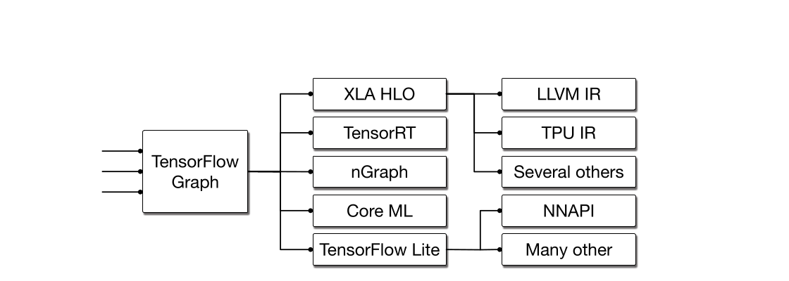
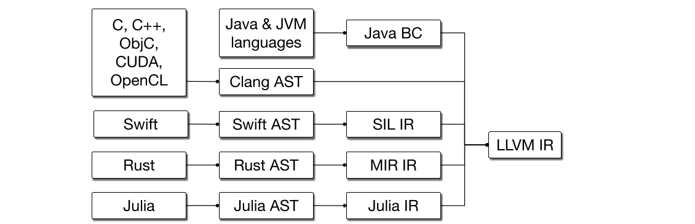
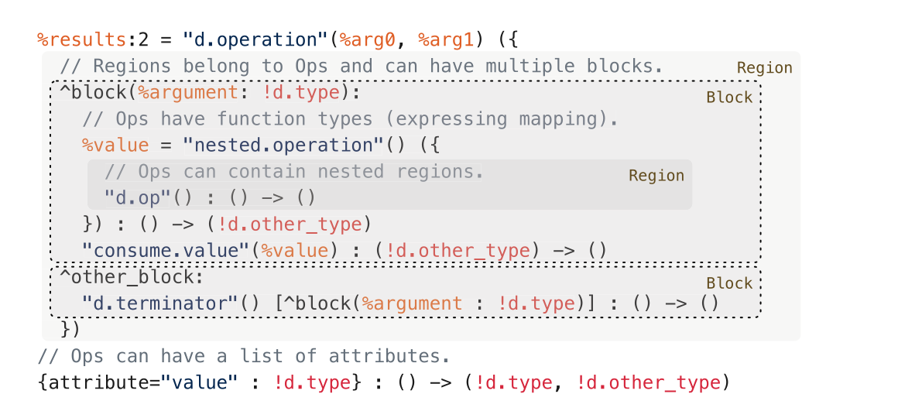

原文版权声明：本文依据公开来源论文 *MLIR: Scaling Compiler Infrastructure for Domain Specific Computation* 进行中文翻译整理，仅供学习与研究使用。我仅提供翻译与网页整理，不拥有原文版权；原文版权归作者及出版方所有。转载、分发或用于商业用途时，请遵守原论文及原始发布平台的版权规定。

原文信息：Chris Lattner, Mehdi Amini, Uday Bondhugula, Albert Cohen, Andy Davis, Jacques Pienaar, River Riddle, Tatiana Shpeisman, Nicolas Vasilache, Oleksandr Zinenko. *MLIR: Scaling Compiler Infrastructure for Domain Specific Computation*. 2021 IEEE/ACM International Symposium on Code Generation and Optimization (CGO 2021). DOI: [10.1109/CGO51591.2021.9370308](https://doi.org/10.1109/CGO51591.2021.9370308)。

说明：以下内容按原文句序逐句对应翻译。图注、脚注、代码示例、安装命令与参考文献信息均尽量保留原貌；其中代码与参考文献信息不做中文改写。

作者：Chris Lattner；Mehdi Amini；Uday Bondhugula；Albert Cohen；Andy Davis；Jacques Pienaar；River Riddle；Tatiana Shpeisman；Nicolas Vasilache；Oleksandr Zinenko

单位：Google, USA；Google, USA；Indian Institute of Science, India；Google, France；Google, USA；Google, USA；Google, USA；Google, USA；Google, USA；Google, France

注：`*` 发表时任职于 SiFive。`†` 本文工作期间在 Google 进行访问研究。

# 摘要 {#sec-abstract}

本文提出 MLIR，这是一种构建可复用、可扩展编译器基础设施的新方法。
MLIR 解决了软件碎片化、面向异构硬件的编译问题，显著降低了构建领域专用编译器的成本，并将现有编译器连接起来。
MLIR 促进了在不同抽象层次、跨应用领域、硬件目标和执行环境设计与实现代码生成器、翻译器和优化器。
本文的贡献包括：（1）将 MLIR 作为一个为扩展与演化而构建的研究工件进行讨论，并识别这种新颖设计、语义、优化规约、系统和工程所带来的挑战与机遇；（2）将 MLIR 作为一种降低构建编译器成本的通用基础设施进行评估，并通过多样化用例展示未来编程语言、编译器、执行环境和计算机体系结构中的研究与教学机会。
本文还介绍了 MLIR 的提出动机、原始设计原则、结构与语义。

# 引言 {#sec-introduction}

编译器设计是一个成熟领域，其应用包括代码生成、静态分析等。
这一领域已经发展出许多成熟的技术平台，并实现了大规模复用，其中包括 LLVM 编译器基础设施 [1]、Java Virtual Machine（JVM）[2] 等系统。
这些流行系统的一个共同特征是其“one size fits all”方法，即系统只提供一个抽象层次作为接口：LLVM Intermediate Representation（IR）大致相当于“带向量的 C”，而 JVM 提供的是“带垃圾回收器的面向对象类型系统”抽象。
这种“一刀切”方法极具价值，而且在实践中，从通用源语言映射到这些领域通常都很直接，例如 C/C++ 对 LLVM、Java 对 JVM。

与此同时，很多问题更适合用更高层或更低层的抽象来建模，例如，在 LLVM IR 上做 C++ 代码的源级分析就非常困难。
我们观察到，许多语言，包括 Swift、Rust、Julia、Fortran 等，都会发展出自己的 IR，以解决领域特定问题，例如语言或库特定的优化、流敏感类型检查（例如线性类型），以及改进 lowering 过程的实现。
类似地，机器学习系统通常也会以同样的方式使用 “ML graph” 作为领域专用抽象。

尽管开发领域专用 IR 已是一门研究充分的技艺，但其工程和实现成本仍然很高。
这些系统的实现者往往不会把基础设施质量放在首位，或者说很难为此提供足够的理由。
因此，这会导致较低质量的编译器系统，包括用户可感知的问题，例如编译时间慢、实现存在 bug、诊断质量不佳，以及优化后代码的调试体验差等。

MLIR 项目[^mlir-site] 旨在直接解决这些编程语言设计与实现层面的挑战，其方式是让定义并引入新的抽象层次变得廉价，并提供“开箱即用”的基础设施来解决常见的编译器工程问题。
MLIR 为此做了三件事：（1）标准化基于 Static Single Assignment（SSA）的 IR 数据结构；（2）提供一个用于定义 IR dialect 的声明式系统；（3）提供大范围的通用基础设施，包括文档、解析与打印逻辑、位置信息跟踪、多线程编译支持、pass 管理等。
本文还将介绍支撑 MLIR 设计与实现的总体原则。
我们将探讨该系统的关键设计点及其与这些总体原则的关系，并分享我们将 MLIR 应用于若干编译问题时的经验。

## 贡献 {#sec-contributions}

MLIR 系统的大多数组成部分都建立在众所周知的概念和算法之上。
然而，它的目标和设计足够新颖，对其展开研究将带来大量研究机会，尤其是在以下总体原则的边界内更是如此：

- `简约性（Parsimony）`：对内建语义、概念和编程接口运用奥卡姆剃刀。
  通过抽象操作和类型的属性，驾驭本质复杂性与偶发复杂性。
  不变量只规定一次，但在全过程中验证其正确性。
  在特定编译 pass 的上下文中查询属性。
  由于内建内容极少，这为可扩展性与可定制性打开了大门。
- `可追踪性（Traceability）`：保留信息，而不是事后恢复信息。
  通过声明规则和属性来支持变换，而不是用逐步的命令式规约。
  可扩展性伴随着通用的信息追踪手段，并由广泛验证来保障。
  组合式抽象来自对其属性进行“玻璃盒化”，并将其角色分离开来，例如类型、控制、数据流等。
- `渐进性（Progressivity）`：过早 lowering 是万恶之源。
  除了表示层次之外，还要允许多条变换路径按需对单个 region 做 lowering。
  再结合与抽象无关的原则和接口，这就能实现跨多个领域的复用。

尽管这些原则已经较为成熟，但它们中的某一个往往会以牺牲另一个为代价来实现，例如，网络栈和操作系统栈中的分层符合渐进性原则，却破坏了简约性。
在具有多层 IR 的编译器中，这种情况也同样存在。
此外，遵循这些原则可能会损害表达能力和有效性，例如，在安全关键和安全敏感系统中，实现可追踪性意味着要限制优化及其激进程度。

简而言之，我们识别出一组设计与工程原则，它们使编译器构造能够在一条狭窄的中间道路上繁荣发展，从而支持一个开放语义生态。
我们发现，复杂性可以在不限制表达能力的前提下得到驯服，这使得跨领域的 IR 设计探索与收敛能够快速进行，而这两点在生产系统中都严重缺失。

本文的贡献是：（1）以经过验证的设计与工程原则为基础，对构建可扩展、模块化编译器系统的问题进行定位；（2）描述一种遵循这些原则的新型编译器基础设施，并展示其重要的工业与研究应用；（3）探讨若干面向不同领域的应用，以说明这种方法的通用性，并分享开发基于 MLIR 基础设施的系统时的经验。

## MLIR 从何而来？ {#sec-where-mlir-came-from}

MLIR 的工作始于这样一个认识：现代机器学习框架由许多不同的编译器、图技术和运行时系统组成（见图 @fig-tensorflow-frameworks），而它们并不共享一套共同的基础设施或设计原则。
这在用户层面体现为多种可见问题，包括糟糕的错误消息、边界情形失败、性能不可预测，以及难以将整套技术栈推广到新硬件上。

我们很快意识到，整个编译器行业也存在类似问题：LLVM 这类现有系统在统一和整合多种语言工作负载方面非常成功，但高层语言最终往往会构建自己的高层 IR，并在更高抽象层上重新发明同类技术（见图 @fig-mid-level-language-irs）。
与此同时，LLVM 社区一直在并行结构表示、以及如何共享前端 lowering 基础设施（例如 C 调用约定，或者 OpenMP 这类跨语言特性）方面苦苦挣扎，而一直没有令人满意的解决方案。

面对这一挑战，考虑到我们无法承担实现 N 个“更好的编译器实例”的成本，我们决定转向一种更通用的解决方案：投资于高质量基础设施，使其能够惠及多个领域，渐进地升级现有系统，更容易应对诸如面向专用加速器的异构编译这类紧迫问题，并提供新的研究机会。
现在，我们已经积累了大量构建和部署基于 MLIR 系统的经验，因此能够回过头来审视它的提出动机和设计，并讨论我们为何选择这一路线。

{#fig-tensorflow-frameworks width=100%}

{#fig-mid-level-language-irs width=100%}

# 设计原则 {#sec-design-principles}

下面我们来探讨指导 MLIR 设计的需求，以及它们与上述总体原则之间的关系。

**内建极少，一切皆可定制 [简约性]：** 系统建立在极少数基本概念之上，将大多数中间表示保持为完全可定制。
类型、operation 与 attribute 是 IR 中最常见的几类抽象，因此应当用少数这些抽象来表达其他一切，从而形成更少且更一致、易于理解、扩展和采用的抽象。
从更广义上说，可定制性能够确保系统可以适应变化的需求，并更有可能适用于未来问题。
从这个意义上说，我们应当将 IR 构建为一套富有表现力的基础设施，它拥有可复用组件和编程抽象，用以支撑其中间语言的语法与语义。

衡量可定制性是否成功的一个标准，是系统能否表达多样化的抽象，包括机器学习图、AST、诸如 polyhedral 之类的数学抽象、Control Flow Graph（CFG），以及 LLVM IR 这样的指令级 IR，同时不把这些抽象中的概念硬编码进系统。
当然，可定制性也会带来由于抽象兼容性不佳而导致内部碎片化的风险。
尽管这不太可能有纯技术性的解决方案，但系统应鼓励人们设计可复用的抽象，并默认这些抽象会在其最初作用域之外被使用。

**SSA 与 Region [简约性]：** Static Single Assignment（SSA）形式 [3] 是编译器 IR 中一种广泛使用的表示。
它有诸多优点，包括让数据流分析更简单且更稀疏、因其与 continuation-passing style 的关系而被编译器社区广泛理解，并已在主要框架中得到确立。
因此，IR 强制采用 SSA 基于值的语义、其引用透明性以及算法效率，而这些都被视为现代编译器基础设施不可或缺的属性。
然而，尽管许多现有 IR 使用扁平、线性化的 CFG，但要表示更高层抽象，就必须把嵌套 region 引入为 IR 中的一等概念。
这超越了传统的 region 构造，它能把更高层抽象（例如循环树）提升出来，以加快编译过程，或提取指令级并行和 SIMD 并行 [4], [5], [6]。
为了支持异构编译，系统必须支持结构化控制流、并发结构、源语言中的闭包以及许多其他目的的表达。
其中一个具体挑战，是让基于 CFG 的分析与变换能够在嵌套 region 上组合。

为此，我们同意牺牲 LLVM 的规范化属性，有时也牺牲其 canonicalization 属性。
能够把多种数据与控制结构 lowering 成较小的一组规范化表示，是控制编译器复杂度的关键。
具有 pre-header、header、latch 和 body 的规范循环结构，就是前端语言中多种循环结构在线性化控制流表示上的典型例子。
我们的目标是为用户提供选择：根据所关注的编译算法、或者编译流程中的某个 pass，嵌套循环既可以表示为嵌套 region，也可以表示为线性化控制流。
通过提供这种选择，我们偏离了 LLVM 只强调规范化的取向，但保留了在真正需要时处理高层抽象的能力。
反过来，利用这类选择也会引出如何控制抽象规范化的问题，而下一段正是讨论这一点。

**保持高层语义 [渐进性]：** 系统需要保留分析与性能优化所需的信息和结构。
在 lowering 之后再试图恢复抽象语义通常十分脆弱，而把这些信息硬塞进低层表示往往具有侵入性，例如，如果使用调试信息来记录结构，就需要修改所有 pass。
因此，系统应保持计算的结构，并渐进地 lowering 到硬件抽象。
结构的丢失应是有意识的，而且只应发生在这种结构对匹配底层执行模型已经不再需要的地方。
例如，系统应在相关变换过程中保留结构化控制流，例如循环结构；一旦去掉这种结构，也就是 lowering 成 CFG，本质上就意味着后续不再执行利用这种结构的变换。
在生产编译器中对并行计算结构的建模现状表明，这项任务总体上可能相当困难 [7], [8]。

由此带来的一个推论是，在同一个 IR 中混合不同抽象层次和不同概念，是让表示中的一部分保持在更高抽象层、同时让另一部分完成 lowering 的关键。
例如，这能让一个面向定制加速器的编译器复用系统定义的一些高层结构和抽象，同时又并存该加速器特有的底层标量或向量指令。
另一个推论是，系统应支持渐进 lowering，即从高层表示一路向最低层表示 lowering，并沿多种抽象以小步前进。
之所以需要多个抽象层次，是因为编译器基础设施必须支持各种平台和编程模型。

以往的编译器会在流水线中引入多个固定抽象层，例如 Open64 的 WHIRL 表示 [9] 有五个层次，Clang 编译器也有五个 lowering 层次：从 AST 到 LLVM IR，再到 SelectionDAG、MachineInstr 和 MCInst。
若要支持可扩展性，就需要更灵活的设计。
这会对变换的 phase ordering 产生深远影响。
随着编译器专家实现越来越多的变换 pass，这些 pass 之间开始出现复杂交互。
早期工作已经表明，把多个优化 pass 组合起来能让编译器发现更多程序事实。
将常量传播、值编号和不可达代码消除结合起来，就是最早展示 pass 组合收益的例子之一 [10]。

**声明与验证 [简约性与可追踪性]：** 定义表示修饰器应像引入新抽象一样简单；编译器基础设施的好坏，归根结底取决于它支持哪些变换。
常见变换应能表示为声明式的重写规则，并采用机器可分析的格式，以便推理这些重写的性质，例如复杂度和完备性。
重写系统的正确性与效率已经得到了广泛研究，并被应用于从类型系统到指令选择等众多编译问题。
由于我们的目标是实现前所未有的可扩展性和增量 lowering 能力，这为将程序变换建模为重写系统打开了大量新路径。
这也带来了若干有趣问题：如何表示重写规则和策略，如何构建能在多个抽象层次上引导重写策略的机器描述。
系统需要在保留可扩展性的同时解决这些问题，并强制其行为保持单调且可复现。

开放生态还要求一套广泛的验证机制。
虽然验证与测试对于发现编译器 bug 和刻画 IR 不变量很有用，但在可扩展系统中，对稳健验证方法和工具的需求被进一步放大了。
这一机制应致力于让相关定义尽可能容易书写、尽可能声明化，并提供单一事实来源。
一个长期目标，是在可扩展编译器的语境下复现 translation validation [11], [12], [13], [14] 以及现代编译器测试方法 [15] 的成功经验。
而这两点目前都仍是开放问题。

**源位置跟踪 [可追踪性]：** 一个 operation 的来源信息，包括其原始位置以及经历过的变换，应当能够在系统中被方便地追踪。
这旨在解决复杂编译系统中常见的“不透明”问题，因为在这类系统里，几乎不可能理解最终表示究竟是如何从原始表示构造出来的。

当编译安全关键和安全敏感应用时，这一点尤为重要，因为追踪 lowering 和优化步骤是软件认证流程中的关键组成部分 [16]。
当处理诸如密码协议，或者作用于隐私敏感数据的算法等安全代码时，编译器常常会面对一些看似冗余或笨重的计算，而这些计算蕴含着并未被源程序函数语义完全捕获的安全或隐私属性：这类代码可能用于防止侧信道泄露，或者增强代码对网络攻击和故障攻击的防护。
优化可能会改变甚至完全破坏这些保护 [17]；这种缺乏透明性的现象在安全编译中被称为 WYSINWYX [18]。
准确地将高层信息传播到低层，其中一个间接目标就是帮助支持安全且可追踪的编译。

# IR 设计 {#sec-ir-design}

我们的主要贡献，是提出一种遵循前一节原则的 IR。
MLIR 正是这样做的，而我们将在本节回顾其主要设计点。

MLIR 具有一种通用文本表示，其示例如图 @fig-mlir-generic-representation 所示；该表示既支持 MLIR 的可扩展性，也完整反映其内存中表示，而这对于可追踪性、人工 IR 验证以及测试至关重要。
可扩展性会带来冗长性的负担，但 MLIR 支持的自定义语法可以补偿这一点；例如，图 @fig-affine-dialect-representation 就展示了图 @fig-mlir-generic-representation 的用户定义语法。

**Operation：** MLIR 中的语义单元是“operation”，简称 Op。
从“指令”到“函数”再到“模块”，在这个系统中都被建模为 Op。
MLIR 并不预设一组固定的 Op，而是允许并鼓励用户自定义扩展，这符合简约性以及“一切皆可定制”的原则。
基础设施基于 TableGen [19] 提供了一种定义 Op 的声明式语法，如图 @fig-ods 所示。[^tablegen-alternatives]

Op（见图 @fig-operation-main-entity）具有唯一的 opcode，也就是标识该 operation 及其所属 dialect 的字符串。
Op 接受并产生零个或多个值，分别称为 operand 和 result，而这些值都保持在 SSA 形式中。
值在运行时表示数据，并具有一个 Type，用来编码关于该数据的编译期知识。
除 opcode、operand 和 result 之外，Op 还可以具有 Attribute、Region、Successor Block 和 Location Information。
图 @fig-mlir-generic-representation 展示了值和 Op，其中以 `%` 开头的标识符表示具名值或值包；若值包中有多个值，则用 `:` 指定数量，而 `#` 用来指明其中某个具体值。
在通用文本表示中，operation 名称是带引号的字符串字面量，后面跟着圆括号中的 operand。

编译器 pass 会以保守方式处理未知 Op。
MLIR 也提供了丰富机制，用于通过 trait 与 interface 向 pass 描述 Op 的语义，如 @sec-reusable-passes 所述。
Op 的实现包含 verifier，用于强制 Op 不变量，并参与整体 IR 验证。

::: {#fig-mlir-generic-representation}
```text
// Attribute aliases can be forward-declared.
#map1 = (d0, d1) -> (d0 + d1)
#map3 = ()[s0] -> (s0)

// Ops may have regions attached.
"affine.for"(%arg0) ({
// Regions consist of a CFG of blocks with arguments.
^bb0(%arg4: index):
  // Block are lists of operations.
  "affine.for"(%arg0) ({
  ^bb0(%arg5: index):
    // Ops use and define typed values, which obey SSA.
    %0 = "affine.load"(%arg1, %arg4) {map = (d0) -> (d0)}
       : (memref<?xf32>, index) -> f32
    %1 = "affine.load"(%arg2, %arg5) {map = (d0) -> (d0)}
       : (memref<?xf32>, index) -> f32
    %2 = "std.mulf"(%0, %1) : (f32, f32) -> f32
    %3 = "affine.load"(%arg3, %arg4, %arg5) {map = #map1}
       : (memref<?xf32>, index, index) -> f32
    %4 = "std.addf"(%3, %2) : (f32, f32) -> f32
    "affine.store"(%4, %arg3, %arg4, %arg5) {map = #map1}
       : (f32, memref<?xf32>, index, index) -> ()
    // Blocks end with a terminator Op.
    "affine.terminator"() : () -> ()
  // Ops have a list of attributes.
  }) {lower_bound = () -> (0), step = 1 : index, upper_bound = #map3}
    : (index) -> ()
  "affine.terminator"() : () -> ()
}) {lower_bound = () -> (0), step = 1 : index, upper_bound = #map3}
  : (index) -> ()
```

MLIR 中使用 `affine` 与 `std` 方言表示多项式乘法的通用表示。相同的 IR 还以自定义语法形式展示于图 @fig-affine-dialect-representation。
:::

{#fig-operation-main-entity width=100%}

**Attribute：** MLIR attribute 保存与 opcode 无关、但与 operation 有关的编译期信息。
Attribute 具有类型，例如整数或字符串，而每个 Op 实例都具有一个开放的键值字典，从字符串名称映射到 attribute 值。
在通用语法中，attribute 出现在一个花括号包围、以逗号分隔的键值对列表中。
图 @fig-mlir-generic-representation 中使用 attribute 来定义那些已知为常量 affine 形式的循环边界：`{lower_bound = () -> (0), step = 1 : index, upper_bound = #map3}`，其中 `lower_bound` 是 attribute 名称的一个例子。
其中 `() -> (0)` 记法用于内联 affine 形式，在这里表示一个生成常量 `0` 的 affine 函数。
`#map3` 记法用于 attribute alias，它允许预先将 attribute 值与一个标签相关联。

Attribute 的含义要么来自 Op 语义，要么来自其所属方言（见 @sec-ir-design）。
与 opcode 一样，attribute 集合并不是固定的。
Attribute 可以引用外部数据结构，这对与现有系统集成很有用，例如机器学习系统中已知于编译期的数据存储内容。

**Location Information：** MLIR 为位置信息提供了一种紧凑表示，并鼓励在整个系统中处理和传播这类信息，这符合可追踪性原则。
它既可以用来保留生成某个 Op 的源程序栈轨迹，也可以用来生成调试信息。
它标准化了编译器发出诊断消息的方式，并被广泛用于各种测试工具。
位置信息同样是可扩展的，因此编译器可以引用现有的位置跟踪系统、高层 AST 节点、LLVM 风格的文件-行-列地址、DWARF 调试信息等。

**Region 与 Block：** 一个 Op 实例可以附带一个 region 列表。
Region 是 MLIR 中的嵌套机制：它包含一个 block 列表，而每个 block 又包含一个 operation 列表，其中的 operation 还可以继续包含 region。
与 attribute 一样，region 的语义由其所附着的 operation 来定义，但 region 内部的 block 如果不止一个，就共同形成一个 Control Flow Graph（CFG）。
例如，图 @fig-mlir-generic-representation 中的 `affine.for` operation 是一个循环，其单 block 的循环体作为一个 region 附着在该 operation 上，并位于 `({` 与 `})` 分隔符之间。
这个 Op 规定了跨 region 的控制流。
在这个例子中，循环体会被反复执行，直到到达上界。

每个 region 的主体是一个 block 列表，而每个 block 都以一个 terminator operation 结束，该 terminator 可能带有 successor block，控制流可以转移到这些 block。
每个 terminator，例如 `switch`、`conditional branch` 或 `unwind`，都定义自己的语义。
它可以选择把控制流转移到同一 region 中的另一个 block，也可以把控制流返回给包围这个 region 的 Op。
successor 图定义出一个 CFG，从而允许在 region 内使用标准的基于 SSA 的控制流。

MLIR 不使用 `φ` 节点，而是采用 SSA 的一种函数式形式 [20]，其中 terminator 会把值传递给 successor block 上定义的 block argument。
每个 block 都有一个可能为空的带类型 block argument 列表，而这些参数就是普通值，并遵循 SSA。
terminator Op 的语义规定了控制转移之后，该 block 的这些 argument 将取得什么值。
对于 region 的第一个也就是入口 block，其值由包围该 region 的 Op 的语义来定义。
例如，`affine.for` 使用入口 block argument `%arg4` 作为循环归纳变量。
最后，这种显式图设计以及 Op 的可扩展性，会让人联想到 sea-of-nodes 表示 [21]；这种联系是有意为之的，并且对我们选择 MLIR 所采用的 SSA 形式产生了重要影响。

**值支配与可见性：** Op 只能使用处于其作用域中的值，也就是依据 SSA 支配关系、嵌套关系以及包围 operation 所施加语义限制而可见的值。
在一个 CFG 内，如果值满足标准 SSA 支配关系，也就是控制流保证在到达使用点之前先经过定义点，那么该值就是可见的。

基于 region 的可见性则根据 region 的简单嵌套关系来定义：如果某个 Op 的 operand 位于当前 region 之外，那么它必须在词法上定义于使用点所在 region 之外并位于其上层。
这正是允许 `affine.for` operation 内部的 Op 使用外层作用域中定义值的原因。

MLIR 还允许将某些 operation 定义为 isolated from above，这表明该 operation 是一个作用域屏障，例如，`std.func` Op 定义一个函数，而函数内部的 operation 不允许引用函数外部定义的值。
除了提供有用的语义检查之外，如果一个 module 包含 isolated-from-above 的 Op，那么 MLIR 编译器就可以并行处理它，因为不会有 use-def 链跨越这些隔离边界。
这对于充分利用多核机器进行编译非常重要。

所有这些设计选择都突出了渐进性原则，同时在某个概念看起来不够通用、也不够关键时，仍尽量站在简约性一侧。

**Symbol 与 Symbol Table：** Op 可以附带一个 symbol table。
这个表是一种标准化机制，用于把字符串形式的名称关联到 IR 对象上，而这些 IR 对象被称为 symbol。
IR 并不规定 symbol 的具体用途，而是将其交给 Op 定义来决定。
Symbol 最适合表示那些不服从 SSA 规则的具名实体：它们不能在同一个表中被重新定义，但可以在定义之前被使用。
例如，全局变量、函数或具名 module 都可以表示为 symbol。
如果没有这种机制，就不可能定义例如递归函数这类在自身定义中引用自己的实体。
如果一个带有 symbol table 的 Op 还附带包含类似 Op 的 region，那么 symbol table 还可以嵌套。
MLIR 也提供了从某个 Op 引用 symbol 的机制，包括嵌套 symbol。

**Dialect：** MLIR 通过 Dialect 来管理可扩展性。
Dialect 在唯一命名空间下对 Op、attribute 和 type 进行逻辑分组。
Dialect 本身不引入新的语义，而是作为一种逻辑分组机制，为该 dialect 中的 Op 提供共同行为，例如所有 Op 的常量折叠行为。
它们组织起语言特定和领域特定的语义生态，同时遵循简约性原则。
Dialect 的命名空间以点分隔前缀的形式出现在 opcode 中，例如图 @fig-mlir-generic-representation 使用的就是 `affine` 和 `std` 方言。

将 Op、type 和 attribute 划分到 dialect 中，本质上是一种概念性分离，类似于设计一组模块化库。
例如，一个 dialect 可以包含操作硬件向量的 Op 和 type，例如 shuffle、insert/extract element、mask；另一个 dialect 则可以包含操作代数向量的 Op 和 type，例如绝对值、点积等。
这两个 dialect 是否使用同一种向量 type，以及该 type 应归属何处，都是交由 MLIR 用户做出的设计决定。

虽然可以把所有 Op、type 和 attribute 全都放进单一 dialect，但由于同时存在的概念过多、名称冲突等原因，这样很快就会变得难以管理。
尽管每个 Op、type 和 attribute 都只属于一个 dialect，MLIR 仍显式支持多 dialect 混用，以实现渐进 lowering。
不同 dialect 的 Op 可以在 IR 的任意层级、任意时刻共存，它们也可以使用不同 dialect 定义的 type，等等。
Dialect 的交错混用带来了更强的复用性、可扩展性和灵活性，否则开发者往往不得不求助于各种不可组合的变通办法。

**类型系统：** MLIR 中的每个值都具有类型，而该类型要么在产生该值的 Op 中指定，要么在将该值定义为参数的 block 中指定。
类型对值的编译期信息进行编码。
MLIR 的类型系统是用户可扩展的，因此它也可以引用现有的外部类型系统。
MLIR 强制执行严格的类型相等检查，而不提供类型转换规则。
Op 使用尾随的函数式语法列出其输入和结果类型。
在图 @fig-mlir-generic-representation 中，`std.load` 从 memory reference 与 index 类型映射到其加载值的类型。

从类型理论角度看，MLIR 只支持非依赖类型，其中包括平凡类型、参数化类型、函数类型、和类型与积类型。
尽管通过结合 Op、symbol 和用户定义 type，可以实现一种依赖类型系统，但这类类型对 IR 来说将是不透明的。

为了方便起见，MLIR 提供了一组标准化的常用类型，包括任意精度整数、标准浮点类型，以及一些简单常见的容器，例如 tuple、多维 vector 和 tensor。
这些类型只是一种工具，其使用并非必需，而这也体现了简约性。

**函数与模块：** 与传统 IR 类似，MLIR 通常也会组织成函数和模块。
不过，它们在 MLIR 中并不是独立概念，而是作为 builtin dialect 中的 Op 实现的，这再次体现了设计上的简约性。

一个 module 是一种 Op，它具有一个 region，该 region 中包含一个 block，并以一个不会转移控制流的 dummy Op 结尾。
像任何 block 一样，它的主体包含一个 Op 列表，而这些 Op 可以是函数、全局变量、编译器元数据或其他顶层构造。
Module 本身也可以定义一个 symbol，以供引用。

类似地，函数也是一种 Op，它具有一个 region，而该 region 可以包含零个 block（在声明情况下）或者多个 block。
内建函数与 `std` dialect 中的 `call` 和 `return` operation 兼容，这两种 operation 分别负责把控制流转入和转出函数。
其他 dialect 则完全可以定义它们自己的函数式 Op。

::: {#fig-ods}
```text
// An Op is a TableGen definition that inherits the "Op" class parameterized
// with the Op name
def LeakyReluOp: Op<"leaky_relu",
    // and a list of traits used for verification and optimization.
    [NoSideEffect, SameOperandsAndResultType]> {
  // The body of the definition contains named fields for a one-line
  // documentation summary for the Op.
  let summary = "Leaky Relu operator";

  // The Op can also a full-text description that can be used to generate
  // documentation for the dialect.
  let description = [{
    Element-wise Leaky ReLU operator
      x -> x >= 0 ? x : (alpha * x)
  }];

  // Op can have a list of named arguments, which include typed operands
  // and attributes.
  let arguments = (ins AnyTensor:$input, F32Attr:$alpha);

  // And a list of named and typed outputs.
  let results = (outs AnyTensor:$output);
}
```

Operation Definition Syntax（ODS）为在 MLIR 中定义新 Op 提供了一种简洁方式。这里定义了 LeakyRelu Op，它接受一个 tensor 和一个浮点值，并返回一个与输入 tensor 类型相同的 tensor。
:::

# 评估：MLIR 的应用 {#sec-evaluation}

MLIR 是一个试图概括并推动广泛编译器项目的系统，因此我们的主要评估指标，是展示它已经被不同项目采用并用于多样化任务。
这样做也意味着，我们承认这个问题及本文贡献本质上具有软件工程属性。
我们给出社区活动的概览，并更详细地描述若干用例，以突出 MLIR 的通用性与可扩展性，并评估编译器专家和领域专家对这一 IR 设计原则的实际体验。

今天，MLIR 已经是一个不断成长的开源项目，其社区横跨学界与工业界。[^c4ml]
例如，首个关于在高性能计算中使用 MLIR 的学术 workshop，吸引了来自 16 所大学的人员参与，并有来自 4 个不同国家的 4 个国家实验室参与其中。[^mlir4hpc]
MLIR 还得到了 14 家跨国公司的支持，并且在 2019 年 LLVM Developer Meeting 上，有超过 100 名工业界开发者参加了关于 MLIR 的圆桌活动。
社区采用与参与度是可用性和需求的代理指标。
目前已有超过 26 个 dialect 在公共或私有环境中开发，并且跨不同公司的 7 个项目正在用 MLIR 替换原有自定义基础设施。
我们认为，这表明 MLIR 的确满足了真实需求，同时也印证了它的可用性。

## TensorFlow 图 {#sec-tensorflow-graphs}

尽管前面讨论的其他表示形式对大多数编译器开发者都很熟悉，但 MLIR 的一个关键用例，是支持机器学习框架的开发。
这类框架的内部表示通常基于具有动态执行语义的数据流图 [22]。

TensorFlow [23] 就是这样一个框架。
它的表示是一种高层数据流计算，其中节点代表计算，而这些计算可以放置在不同设备上，包括特定的硬件加速器。

MLIR 被 TensorFlow 用来建模这种内部表示，并为图 @fig-tensorflow-frameworks 所示的那些用例执行变换：从简单的代数优化，到将图重定向为适合数据中心集群上并行与分布式执行、以及异步硬件加速的表示；从 lowering 到适合移动端部署的表示，再到使用 XLA [24] 这类领域专用代码生成器生成高效原生代码。
图 @fig-tensorflow-graph-ssa 中给出了 TensorFlow 图在 MLIR 中的表示。
它展示了异步并发的建模方式，其中数据流图通过隐式 future 被去同步化，而具有副作用的 Op 则通过显式控制信号被串行化，这同样遵循数据流语义。
尽管其中涉及的抽象极为不同，包括并发、异步、延迟求值等，MLIR 仍为其提供了与其他任何 dialect 或编译 pass 相同的基础设施、分析与变换能力。
特别是，Grappler[^tf-grappler] 中实现的关键图级变换，在 MLIR 中既可用于 TensorFlow 模型，也可用于低层 LLVM IR：死代码/死节点消除、常量折叠、canonicalization、循环不变代码外提、公共子表达式/子图消除、特定指令或设备内核选择、重物化、布局优化；而其他变换则可能是领域特定的，例如混合精度优化、op fusion 与形状算术优化。

::: {#fig-tensorflow-graph-ssa}
```text
%0 = tf.graph (%arg0 : tensor<f32>, %arg1 : tensor<f32>,
               %arg2 : !tf.resource) {
  // Execution of these operations is asynchronous, the %control return value
  // can be used to impose extra runtime ordering, for example the assignment
  // to the variable %arg2 is ordered after the read explicitly below.
  %1, %control = tf.ReadVariableOp(%arg2)
     : (!tf.resource) -> (tensor<f32>, !tf.control)
  %2, %control_1 = tf.Add(%arg0, %1)
     : (tensor<f32>, tensor<f32>) -> (tensor<f32>, !tf.control)
  %control_2 = tf.AssignVariableOp(%arg2, %arg0, %control)
     : (!tf.resource, tensor<f32>) -> !tf.control
  %3, %control_3 = tf.Add(%2, %arg1)
     : (tensor<f32>, tensor<f32>) -> (tensor<f32>, !tf.control)
  tf.fetch %3, %control_2 : tensor<f32>, !tf.control
}
```

TensorFlow 图在 MLIR 中的 SSA 表示。
:::

## Polyhedral 代码生成 {#sec-polyhedral-codegen}

MLIR 最初的动机之一，是探索面向加速器的 polyhedral 代码生成。
`affine` dialect 是一种简化的 polyhedral 表示，其设计目标是支持渐进 lowering。
虽然在本文中无法完整展开其全部设计点，但我们会展示 `affine` dialect 的若干方面，以说明 MLIR 的建模能力，并将 `affine` dialect 与既有表示进行对比 [25], [26], [27], [28], [29]。

**1) 相似性：** MLIR 的 `affine` dialect 在所有内存访问上都使用结构化多维类型。
在默认情形下，这些结构化类型是单射的：不同索引方式按构造保证不会别名，而这是 polyhedral 依赖分析的一个常见前提条件。

Affine 建模被拆分为两部分。
Attribute 用于在编译期建模 affine map 与整数集合，而 Op 则用于将 affine 约束施加到代码上。
具体而言，`affine.for` Op 是一种 `for` 循环，其边界由 affine map 表示，而这些 map 的值要求在函数内保持不变。
因此，这些循环具有静态控制流。
类似地，`affine.if` 是一种受 affine 整数集合限制的条件语句。
循环体与条件体都是 region，并通过 `affine.load` 与 `affine.store` 限制索引必须是外围循环迭代变量的 affine 形式。
这使得精确的 affine 依赖分析成为可能，同时避免了从有信息损失的低层表示中反推 affine 形式的需要。

::: {#fig-affine-dialect-representation}
```text
// Affine loops are Ops with regions.
affine.for %arg0 = 0 to %N {
  // Only loop-invariant values, loop iterators, and affine functions of
  // those are allowed.
  affine.for %arg1 = 0 to %N {
    // Body of affine for loops obey SSA.
    %0 = affine.load %A[%arg0] : memref<? x f32>
    // Structured memory reference (memref) type can have
    // affine layout maps.
    %1 = affine.load %B[%arg1] : memref<? x f32, (d0)[s0] -> (d0 + s0)>
    %2 = mulf %0, %1 : f32
    // Affine load/store can have affine expressions as subscripts.
    %3 = affine.load %C[%arg0 + %arg1] : memref<? x f32>
    %4 = addf %3, %2 : f32
    affine.store %4, %C[%arg0 + %arg1] : memref<? x f32>
  }
}
```

`affine` dialect 对多项式乘法 `C(i+j) += A(i) * B(j)` 的表示。
:::

**2) 与现有 polyhedral 的差异：** 差异很多。
（1）`丰富的类型`：MLIR 的结构化 memory reference 类型包含一个 layout map，用以连接 buffer 的索引空间与实际地址空间。
这种关注点分离使循环变换与数据变换更容易组合：数据布局变化不会影响代码，也不会污染依赖分析。
这类混合变换此前已有探索 [30]，但并不常见。

（2）`抽象混合`：在 MLIR 中，`affine` 循环体可以使用带类型的 SSA 值上的 operation 来表达。
因此，所有传统编译器分析与变换仍然适用，并且可以与 polyhedral 变换交错执行。
相反，polyhedral 编译器常常会把这类细节完全抽象掉，从而使 polyhedral 编译器难以处理例如向量类型等对象。

（3）`更小的表示鸿沟`：polyhedral 模型的一个关键特性，是它能够在类型系统中表示循环迭代顺序。
在这一系统里，大量循环变换可以直接组合，并能用简单数学抽象来推理 [26]。
然而，polyhedral 变换要求先提升到一种往往与原始表示截然不同的表示 [31], [32]。
此外，把变换后的 polyhedra 再转换回循环在计算上是困难的 [33]。
基于 MLIR 的表示会在较低层表示周围保留高层循环结构，从而消除了“再提升”的需要。

（4）`编译速度`：正如 @sec-parallel-compilation 所讨论的那样，编译速度是 MLIR 的一个关键目标，但这并非大多数现有 polyhedral 方法的关注重点。
这些方法严重依赖指数复杂度算法：既依赖整数线性规划来自动导出循环顺序，也依赖 polyhedron scanning 算法来把表示转换回循环。
而 MLIR 方法显式不依赖 polyhedron scanning，因为循环本身就被保留在 IR 中。
此外，代码生成既可以在 ahead-of-time 情况下发生，例如生成适用于动态 shape 的通用代码，也可以在 just-in-time 情况下发生，例如对静态 shape 的 tensor operation 做特化。
后者对可用资源提出了更严格约束，而这两类场景都很重要。

使用 `affine` dialect 的经验表明，一等 affine 抽象有助于设计和实现领域专用代码生成器，其中包括 `linalg` dialect[^linalg] 以及 RISE 中的声明式重写规则[^rise]。
这些发展以及 `affine` dialect 本身，都代表了 MLIR 设计所促成的重要探索。

## Fortran IR（FIR） {#sec-fir}

LLVM 的 Fortran 前端 `flang` 目前仍在大规模开发中，该工作由 NVIDIA/PGI 牵头。
与 Swift、Rust 等类似，`flang` 需要一种专门的 IR，以支持面向高性能 Fortran 代码库的高级变换，因此它使用 MLIR 来支持这些面向 Fortran 的特定优化 [34]。
这些高层优化，包括高级循环优化、数组复制消除、调用特化以及去虚化，如果只使用 LLVM 将很难实现。

例如，FIR 能够把 Fortran 的虚分发表建模为一等概念，如图 @fig-fir-dispatch-table 所示。

::: {#fig-fir-dispatch-table}
```text
// Dispatch table for type(u)
fir.dispatch_table @dtable_type_u {
  fir.dt_entry "method", @u_method
}

func @some_func() {
  %uv = fir.alloca !fir.type<u> : !fir.ref<!fir.type<u>>
  fir.dispatch "method"(%uv) : (!fir.ref<!fir.type<u>>) -> ()
  // ...
}
```

FIR 对动态虚函数分发表提供了一等支持。
:::

能够在结构化 IR 中建模编程语言的高层语义，是非常强大的能力。
例如，对分发表的一等建模使实现一个健壮的去虚化 pass 成为可能。
尽管这本来也可以借助专用编译器 IR 来实现，但使用 MLIR 使 `flang` 开发者能够把工程资源集中投入到其领域内的 IR 设计上，而不是重新实现基本基础设施。

选择 MLIR 还释放了其他非 Fortran 专用 dialect 的复用能力：一个语言无关的 OpenMP dialect 可以在 Fortran 和 C 语言前端之间共享。
类似地，在 MLIR 中，通过共享与复用面向 GPU 的 dialect 与 pass，针对异构平台支持 OpenACC 也变得可行。
这之所以直接可行，正是因为 MLIR 从一开始就是为支持可组合 dialect 混用而设计的。

## 领域专用编译器 {#sec-domain-specific-compilers}

上面的应用都处于较大的工作流之中。
但 MLIR 也有助于构建更小型的领域专用编译器。
一个可复用、模块化的基础设施，使这些专门路径变得可行，而且构建成本相对低廉。

**优化 MLIR Pattern Rewriting：** MLIR 拥有一个可扩展的模式重写系统。
除了静态声明的 pattern 之外，我们还遇到过一些应用场景，在这些场景中重写 pattern 需要在运行时动态扩展，以允许硬件厂商在驱动中添加新的 lowering。
解决方案是把 MLIR pattern rewrite 本身表示成一个 MLIR dialect，从而允许我们使用 MLIR 基础设施，在运行时即时构建并优化高效的 Finite State Machine（FSM）匹配器与重写器。
这项工作包括其他系统中已经出现过的 FSM 优化，例如 LLVM SelectionDAG 和 GlobalISel 的指令选择系统。

**Lattice Regression Compiler：** Lattice regression [35] 是一种以求值速度快且可解释性强而著称的机器学习技术。
该编译器的前身使用 C++ template 实现。
这种方式虽然能借助元编程获得高性能代码，但要对端到端模型表达通用优化却并不直接。
这个特定的 lattice regression 系统被用于拥有数百万用户的应用中，因此性能改进至关重要。

MLIR 被用作这一专门领域中新编译器的基础，而该编译器由一种专门的搜索方法驱动，也就是说，在编译期间实际上解决了一个机器学习问题。
这个最终编译器只投入了 3 人月的开发工作，却在某个生产模型上带来了最高 8× 的性能提升，同时也提高了编译过程的透明性。

# MLIR 设计带来的后果 {#sec-consequences}

MLIR 的设计有利于在复用现有通用抽象的同时，建模新的语言与编译器抽象。
实际上，很多问题的解决方式都变成了“增加新的 op、增加新的 type”，并可能把它们归入“一个新的 dialect”。
这对编译器工程来说是一种显著的设计转向。
它带来了新的机会、挑战和洞见。
本节将探讨其中的一部分。

## 可复用的编译器 Pass {#sec-reusable-passes}

能够在同一个 IR 中表示多个抽象层级，会激励那些跨这些层级工作的 pass。
MLIR 通过反转常见做法来处理可扩展性：因为 Op 的数量比 pass 多，所以让 Op 了解 pass 更容易。
这也改进了模块化，因为 dialect 特定逻辑是在 dialect 内部实现的，而不是塞进核心变换里。
由于 pass 很少需要知道某个 Op 的全部方面，MLIR 依赖以下机制来实现通用 pass。

**Operation Trait：** 许多常见的“面包黄油型”编译器 pass，例如死代码消除或公共子表达式消除，只依赖于诸如“是否是 terminator”或“是否可交换”这类简单属性。
我们把这类属性定义为 Op Trait。
一个 Op 无条件地具有某个 trait，例如，一个 `standard branch` Op 总是 terminator。
对许多 pass 来说，只要知道某个 Op 具备一组 trait，就足以对它操作，例如交换 operand，或者删除那些没有副作用且没有用户的 Op。

Trait 还可以充当验证钩子，以便在多个具备该 trait 的 Op 之间共享逻辑。
例如，`isolated from above` trait 会验证 Op 中的 region 不会使用由包围它的 region 中定义的值。
它允许对函数、模块以及其他自包含结构进行通用处理。

**Interface：** 当无条件、静态的行为表达力不足时，就可以通过 interface 对处理逻辑进行参数化，这一概念借鉴自面向对象编程。
Interface 定义了一个对 IR 对象行为的视图，并把不必要的细节抽象掉。
与 trait 不同，interface 是由 IR 对象通过任意 C++ 代码实现的，因此不同对象可以给出不同结果。
例如，`call` Op 实现了 `call-like` interface，但该 Op 的不同实例会调用不同的函数。

MLIR pass 可以基于 interface 来实现，从而与任何选择接入该 pass 的 Op 建立契约。
继续用 `call-like` 的例子，考虑 MLIR 的 inlining pass，它可以处理 TensorFlow 图、Flang 函数、函数式语言中的闭包等。
这样的 pass 需要知道两件事：（1）把一个 operation 内联进某个 region 是否有效；（2）当 terminator operation 在内联后跑到了 block 中间时，应当如何处理。

为了查询某个 Op 的这些属性，pass 会定义一个专用 interface，以便 Op 通过向 MLIR 注册其实现来受益于内联。
而内联 pass 会对任何没有实现相应 interface 的 operation 采取保守策略，也就是直接忽略。

常量折叠也是通过同样的机制实现的：每个 Op 都实现 `fold` interface，通过提供一个函数，在该 Op 可折叠时返回一个持有对应值的 attribute。
更通用的 canonicalization 也可以类似地实现：某个 interface 会填充一组适用于 pattern rewriting 的 canonicalization pattern。
这种设计把通用逻辑与 Op 特定逻辑分离开来，并将后者放进 Op 自身，从而减轻了 LLVM 中 `InstCombine`、`PeepholeOptimizer` 之类组件众所周知的维护与复杂性负担。

Interface 也可以由 dialect 而不是具体 Op 来实现，这允许共享行为，或把逻辑委托给外部实现，例如对 TensorFlow Op 执行常量折叠时就是如此。
Interface 同样支持 type 和 attribute，例如，一个加法 operation 可以支持任何自声明为“integer-like”且可查询其有符号语义的类型。

## 方言特定 Pass {#sec-dialect-specific-passes}

最后，定义只针对特定 dialect 的 pass 也是合理且有用的，因为这类 pass 可以充分利用它所面向 dialect 中 operation 的完整语义。
在 MLIR 系统里，这类 pass 与在其他编译器系统里一样有用。
例如，某些代码生成器希望基于特定机器约束，或者基于其他不适合纳入更广泛框架的技巧，对机器指令做定制调度。
对于不要求一般化的新变换来说，这是一种简单且实用的起点。

## 将多个 Dialect 混合在一起 {#sec-mixing-dialects}

MLIR 最深刻、但也最难让人一下子理解的一个方面，是它允许并鼓励在一个程序中混合来自不同 dialect 的 operation。
其中一些情况相对容易理解，例如在同一 module 中同时容纳主机端与加速器端的计算。
但最有趣的情况发生在 dialect 被直接混合时，因为这使一种我们此前在其他系统里从未见过的复用类别成为可能。

考虑 @sec-polyhedral-codegen 中描述的 `affine` dialect。
`affine` 控制流与 `affine` 映射的定义，独立于那些被包含在 `affine` region 中的 operation 语义。
在我们的例子里，我们把 `affine` dialect 与 `standard` dialect 组合在一起，后者以类似 LLVM IR 的目标无关形式表示简单算术，同时还会与多个针对内部加速器的目标相关机器指令 dialect 组合。
其他人也已经把它与来自其他问题域的抽象结合起来。

能够复用通用 polyhedral 变换，同时利用 Op interface 来获取特定变换中 operation 的语义，是一种非常强大、也让我们十分兴奋的编译器基础设施组织方式。
另一个例子是，OpenMP dialect 可以在多种源语言 IR 中被使用与复用。

## 并行编译 {#sec-parallel-compilation}

MLIR 的一个重要方面，是能够利用多核机器来提高编译速度。
特别地，`isolated from above` trait（见 @sec-reusable-passes）允许函数之类的 Op 接入 MLIR pass manager 支持的并发 IR 遍历机制。
事实上，这个 trait 保证 SSA use-def 链不会跨越 region 边界，因此相关区域可以被隔离处理。
MLIR 也不具有跨整个 module 的 use-def 链，而是通过 symbol table（见 @sec-ir-design）引用全局对象，并把常量定义为带 attribute 的 operation（见 @sec-ir-design）。

## 互操作性 {#sec-interoperability}

我们的工作涉及与大量现有系统互操作，例如以 protocol buffer 编码的机器学习图、包括 LLVM IR 在内的编译器 IR，以及专有指令集等。
这些表示形式往往都带有一些次优或不够理想的决定，而这些决定在原系统语境里可能是合理的，但 MLIR 的能力允许我们使用一种表达力更强的表示。
由于 importer 和 exporter 众所周知地很难测试，因为测试样例往往是二进制，我们希望尽可能降低它们的复杂度。

解决方案是定义一个尽可能直接对应外部系统的 dialect，从而允许与该格式进行简单且可预测的双向 round-trip。
一旦 IR 被导入 MLIR，就可以利用全部 MLIR 基础设施把它提升到更方便的 IR，再将其 lowering 回去；而这也使得这些变换可以像其他 MLIR pass 一样接受测试。

此类 dialect 已有大量例子，其中包括把 LLVM IR 映射进 MLIR 的 LLVM dialect。
这种做法对我们来说效果良好，而 MLIR 工具链也被证明对为这些外部文件格式编写测试很有帮助。

## 无预设立场的设计带来了新的挑战 {#sec-unopinionated-design}

尽管 MLIR 允许人们定义几乎任意的抽象，但它对究竟应当怎么做提供的指导却很少：什么样的做法实践中更好，什么样的做法更差？
我们已经积累了一些经验，看到不少工程师和研究者把这些技术与方法应用到新的问题域上，并认识到编译器与语言领域对于编译器 IR 设计和抽象设计这门“艺术”的理解并不充分；很多人都是在既有系统的约束内工作，但真正有机会亲自定义这些抽象的人相对较少。

这既是挑战，也是又一组未来研究机会。
更广泛的 MLIR 社区正在围绕这些抽象设计权衡建立经验，而我们预计，这会在未来成为一个富有成果的研究方向。

## 展望未来 {#sec-looking-forward}

MLIR 的设计与其他编译器基础设施差异足够大，以至于即便我们已经把它构建并应用于许多不同系统，我们仍在学习之中。
我们相信，仍然有大量内容有待发现，而且还需要若干年的研究，才能更好理解这些设计点并建立最佳实践。
例如，out-of-tree dialect 的兴起、越来越多使用 MLIR 的源语言前端、MLIR 在 Abstract Syntax Tree 上的潜在应用，以及其在结构化数据，例如 JSON 和 protocol buffer 上的应用，目前都还很早期，而它们很可能会揭示出新的有趣挑战与机会。
更好的 just-in-time 编译支持与精确垃圾回收支持，也会是有趣方向，因为它们都能利用 IR 的模块化与可编程性。

# 相关工作 {#sec-related-work}

MLIR 是一个与多个不同领域发生交叉的项目。
尽管其组合式基础设施构成了一个新系统，但其中各个独立组成部分在文献中都能找到某种对应物。
关于直接与 IR 设计本身相关的引用和讨论，请参见 @sec-design-principles。

MLIR 是一种类似 LLVM [1] 的编译器基础设施，但 LLVM 在标量优化和同构编译方面取得巨大成功，而 MLIR 的目标则是把丰富的数据结构与算法作为一等值和一等 operation 来建模，其中包括张量代数与算法、图表示，以及异构编译。
MLIR 允许以 mix-and-match 的方式组织优化，把编译 pass 拆成组件，并重新定义 lowering 与清理等角色。
这很大程度上归功于其 pattern rewriting 基础设施：它把完整变换捕获为一系列局部 pattern 的组合，并在单个 operation 粒度上控制哪些 pattern rewrite 被应用。
自动扩展、形式化并验证这种重写逻辑，将是一个重要的下一步 [36], [37]。
在后端一侧，MLIR 的 DDR 与 LLVM 指令选择基础设施存在类比，它支持可扩展 operation、multi-result pattern 以及以约束形式给出的规约 [38]。

众多编程语言与编程模型都在应对硬件异构性。
OpenMP 最初是一种同构编程模型，后来又基于 StarSs 与 OpenACC 等更早提案，为加速器 offload task 和 parallel region 增加了支持 [39], [40], [41]。
C++ AMP、HCC 和 SyCL 借助传统 Clang/LLVM 流程以及现代 C++，为硬件加速提供高层抽象 [42]。
遗憾的是，这些例子都会很快把高层结构 lowering 成对运行时执行环境的调用，并依赖宿主语言，通常是 C++，中已有的优化来缓解抽象开销。
真正把目标放在异构编译过程本身的努力要少得多。
扩展 LLVM IR 的并行中间表示只解决了部分问题，而且传统上仍聚焦于同构场景 [7], [8]。
迄今为止最雄心勃勃的努力，也许是 Liquid Metal [43]：它采用协同设计的 Domain Specific Language（DSL）和编译流程，把受管对象语义转换为静态、向量化或可重构硬件；但其 Lime 编译器中的大部分工作，本质上仍在于让圆形对象适配方形硬件，用 Kou 与 Palsberg 的话说就是如此 [44]。
MLIR 通过一组可扩展的 operation 与 type，为拥抱异构性的高层语言提供直接嵌入方式，同时提供一套共同基础设施，以尽可能复用通用组件的方式，逐步把这些结构 lowering 到不同目标之上。

应对语言异构性，一直是元编程系统，尤其是多阶段编程系统的长期承诺。
Lightweight Modular Staging（LMS）[45] 是目前最先进的框架与运行时代码生成器之一，它提供了一套核心组件库，用于高效代码生成以及在 Scala 中嵌入 DSL。
Delite [46] 则承诺显著提高 DSL 开发者的生产力，同时支持并行与异构执行。
这种方法与 MLIR 形成互补，它提供了更高层的抽象，用来嵌入 DSL，并通过通用元编程结构实现优化。

再往语言语法更上层走一步，ANTLR [47] 是一类 parser generator 的代表，旨在促进编译器前端开发。
MLIR 目前并不具有通用 parser generator、AST 构建或 AST 建模能力。
若将 MLIR 与 ANTLR 这样的系统结合起来，就可以把可复用性进一步向上游扩展，一直到前端与开发环境。

如果更窄地从机器学习应用来看，XLA [24]、Glow [48] 与 TVM [49] 都在解决类似的异构编译目标。
这些框架提供面向特定领域的代码生成实例，它们从图抽象出发，并面向加速器的多维向量抽象作为目标。
它们都可以把 MLIR 作为基础设施，在沿用现有代码生成策略的同时，受益于其中的通用功能。
类似地，来自 Halide [50] 与 TVM [49] 的 loop nest 元编程技术、更早的 loop nest 元编程工作 [26], [51], [52], [53]，以及诸如 PolyMage [54]、Tensor Comprehensions [29]、Stripe [55]、Diesel [56]、Tiramisu [57] 及其底层 polyhedral 编译技术 [25], [27], [58], [28]，都可以在一个基于 MLIR 的框架中并存为不同的代码生成路径。
这将极大提升代码复用、降低生态碎片化、增强跨领域互操作性并改善可移植性。
这实际上也是 IREE 项目[^iree] 的动机之一：它在多个抽象层次上构建于 MLIR 之上，从张量代数和算子图，一直到异步 coroutine 的低层编排，以及面向多种 CPU 和 GPU 架构的代码生成，且处于 Vulkan/SPIR-V 标准之内。

最后，诸如 ONNX [59] 这样的互操作格式，则通过提供一组共同 op 来应对 ML 前端多样性这一问题，让不同框架都可以映射到这一组 op 上。
ONNX 可以成为 MLIR 中的一个候选 dialect，而不同 op 也可以在它与其他 dialect 之间完成转换。

# 结论与未来工作 {#sec-conclusion}

我们介绍了 MLIR，它是对“如何设计一种灵活、可扩展的编译器构建基础设施”这一双重科学与工程挑战的一个具体回答，其覆盖面从后端代码生成和异构系统编排，到机器学习中的图级建模，再到编程语言与领域专用框架的高层语言语义。
我们展示了它在多个领域中的适用性，并讨论了它的研究意义。

受 LLVM 成功的激励，并着眼未来，我们非常期待看到编程语言与高性能计算中的既有社区，以及各类领域专家，如何从引入更高层、语言特定的 IR 中受益。
我们也相信，MLIR 将催化新的研究方向，以及教授编译器与 IR 设计艺术的新方式。

# 致谢 {#sec-acknowledgments}

如果没有众多其他个人的贡献，这篇论文和该项目都不可能完成。
我们向所有人致以感谢。
我们也感谢 Google Visiting Researcher Program 在 MLIR 早期阶段对第三位作者的支持。

# 附录 {#sec-appendix}

## 工件摘要 {#sec-appendix-abstract}

本文对应的工件包括 MLIR 系统、如何下载和构建它的说明，以及指向 TensorFlow 中与 MLIR 相关源代码的链接。

## 工件核对清单（元信息） {#sec-artifact-checklist}

- `Program`: MLIR
- `Compilation`: LLVM C++ toolchain
- `Run-time environment`: Recommended Linux
- `Publicly available?`: Yes
- `Archived`: DOI `10.5281/zenodo.4283090`

## 说明 {#sec-description}

**1) 交付方式：** 若要下载 MLIR，请执行：

```bash
git clone \
https://github.com/llvm/llvm-project.git
```

关于下载和构建 MLIR 的说明，也可见于 <https://mlir.llvm.org/getting_started>。
更多信息可见 <https://mlir.llvm.org>。

**2) 软件依赖：** 下载 MLIR 需要 `git`。
构建 MLIR 需要 Ninja（<https://ninja-build.org/>）以及一个可用的 C++ 工具链，其中包括 `clang` 和 `lld`。

## 安装 {#sec-installation}

要在 Linux 上构建并测试 MLIR，请执行以下命令：

```bash
mkdir llvm-project/build
cd llvm-project/build
cmake -G Ninja ../llvm \
  -DLLVM_ENABLE_PROJECTS=mlir \
  -DLLVM_BUILD_EXAMPLES=ON \
  -DLLVM_TARGETS_TO_BUILD="X86;NVPTX;AMDGPU" \
  -DCMAKE_BUILD_TYPE=Release \
  -DLLVM_ENABLE_ASSERTIONS=ON \
  -DCMAKE_C_COMPILER=clang \
  -DCMAKE_CXX_COMPILER=clang++ \
  -DLLVM_ENABLE_LLD=ON
cmake --build . --target check-mlir
```

## 应用 {#sec-applications}

TensorFlow 中对 MLIR 的使用可在代码位置 <https://github.com/tensorflow/tensorflow/tree/master/tensorflow/compiler/mlir/> 中看到。
位于 `tensorflow/tests` 子目录中的测试包含 MLIR 片段，它们展示了 TensorFlow 图表示与相关变换。
关于从源码构建 TensorFlow 的说明，可见 <https://www.tensorflow.org/install/source>。

[^mlir-site]: <https://mlir.llvm.org>
[^tablegen-alternatives]: 文中原注：已经有人提出替代方案，试图获得更高生产力、更强健全性保证，以及与高层语言更好的互操作性；这仍是积极设计讨论中的主题。
[^c4ml]: <https://www.c4ml.org/>
[^mlir4hpc]: <http://www.cs.utah.edu/~mhall/mlir4hpc>
[^tf-grappler]: <https://www.tensorflow.org/guide/graph_optimization>
[^linalg]: <https://mlir.llvm.org/docs/Dialects/Linalg/>
[^rise]: <https://rise-lang.org/mlir/>
[^iree]: <https://google.github.io/iree/>

# References {#sec-references}

[1] C. Lattner and V. Adve, “LLVM: A compilation framework for lifelong program analysis & transformation,” in *Proceedings of the International Symposium on Code Generation and Optimization: Feedback-directed and Runtime Optimization*, ser. CGO ’04. Washington, DC, USA: IEEE Computer Society, 2004, pp. 75–. [Online]. Available: <http://dl.acm.org/citation.cfm?id=977395.977673>

[2] T. Lindholm and F. Yellin, *Java Virtual Machine Specification*, 2nd ed. Boston, MA, USA: Addison-Wesley Longman Publishing Co., Inc., 1999.

[3] R. Cytron, J. Ferrante, B. K. Rosen, M. N. Wegman, and F. K. Zadeck, “Efficiently computing static single assignment form and the control dependence graph,” *ACM Trans. Program. Lang. Syst.*, vol. 13, no. 4, pp. 451–490, Oct. 1991. [Online]. Available: <http://doi.acm.org/10.1145/115372.115320>

[4] R. Johnson, D. Pearson, and K. Pingali, “The program structure tree: Computing control regions in linear time,” in *Proceedings of the ACM SIGPLAN 1994 Conference on Programming Language Design and Implementation*, ser. PLDI ’94. New York, NY, USA: ACM, 1994, pp. 171–185. [Online]. Available: <http://doi.acm.org/10.1145/178243.178258>

[5] W. A. Havanki, S. Banerjia, and T. M. Conte, “Treegion scheduling for wide issue processors,” in *Proceedings of the Fourth International Symposium on High-Performance Computer Architecture*, Las Vegas, Nevada, USA, January 31 - February 4, 1998, 1998, pp. 266–276. [Online]. Available: <https://doi.org/10.1109/HPCA.1998.650566>

[6] G. Ramalingam, “On loops, dominators, and dominance frontiers,” *ACM Trans. Program. Lang. Syst.*, vol. 24, no. 5, pp. 455–490, 2002. [Online]. Available: <https://doi.org/10.1145/570886.570887>

[7] D. Khaldi, P. Jouvelot, F. Irigoin, C. Ancourt, and B. Chapman, “LLVM parallel intermediate representation: Design and evaluation using OpenSHMEM communications,” in *Proceedings of the Second Workshop on the LLVM Compiler Infrastructure in HPC*, ser. LLVM ’15. New York, NY, USA: ACM, 2015, pp. 2:1–2:8. [Online]. Available: <http://doi.acm.org/10.1145/2833157.2833158>

[8] T. B. Schardl, W. S. Moses, and C. E. Leiserson, “Tapir: Embedding fork-join parallelism into LLVM’s intermediate representation,” *SIGPLAN Not.*, vol. 52, no. 8, pp. 249–265, Jan. 2017. [Online]. Available: <http://doi.acm.org/10.1145/3155284.3018758>

[9] Open64 Developers, “Open64 compiler and tools,” 2001.

[10] C. Click and K. D. Cooper, “Combining analyses, combining optimizations,” *ACM Trans. Program. Lang. Syst.*, vol. 17, no. 2, pp. 181–196, Mar. 1995. [Online]. Available: <http://doi.acm.org/10.1145/201059.201061>

[11] A. Pnueli, M. Siegel, and E. Singerman, “Translation validation,” in *Tools and Algorithms for Construction and Analysis of Systems, 4th International Conference, TACAS ’98, Held as Part of the European Joint Conferences on the Theory and Practice of Software, ETAPS’98, Lisbon, Portugal, March 28 - April 4, 1998, Proceedings*, 1998, pp. 151–166. [Online]. Available: <https://doi.org/10.1007/BFb0054170>

[12] G. C. Necula, “Translation validation for an optimizing compiler,” *SIGPLAN Not.*, vol. 35, no. 5, pp. 83–94, May 2000. [Online]. Available: <http://doi.acm.org/10.1145/358438.349314>

[13] J. Tristan and X. Leroy, “Formal verification of translation validators: a case study on instruction scheduling optimizations,” in *Proceedings of the 35th ACM SIGPLAN-SIGACT Symposium on Principles of Programming Languages, POPL 2008, San Francisco, California, USA, January 7-12, 2008*, 2008, pp. 17–27. [Online]. Available: <https://doi.org/10.1145/1328438.1328444>

[14] ——, “Verified validation of lazy code motion,” in *Proceedings of the 2009 ACM SIGPLAN Conference on Programming Language Design and Implementation, PLDI 2009, Dublin, Ireland, June 15-21, 2009*, 2009, pp. 316–326. [Online]. Available: <https://doi.org/10.1145/1542476.1542512>

[15] Y. Chen, A. Groce, C. Zhang, W. Wong, X. Z. Fern, E. Eide, and J. Regehr, “Taming compiler fuzzers,” in *ACM SIGPLAN Conference on Programming Language Design and Implementation, PLDI ’13, Seattle, WA, USA, June 16-19, 2013*, 2013, pp. 197–208. [Online]. Available: <https://doi.org/10.1145/2491956.2462173>

[16] B. Schommer, C. Cullmann, G. Gebhard, X. Leroy, M. Schmidt, and S. Wegener, “Embedded Program Annotations for WCET Analysis,” in *WCET 2018: 18th International Workshop on Worst-Case Execution Time Analysis*, vol. 63. Barcelona, Spain: Dagstuhl Publishing, Jul. 2018. [Online]. Available: <https://hal.inria.fr/hal-01848686>

[17] S. T. Vu, K. Heydemann, A. de Grandmaison, and A. Cohen, “Secure delivery of program properties through optimizing compilation,” in *ACM SIGPLAN 2020 International Conference on Compiler Construction (CC 2020)*, San Diego, CA, Feb. 2020.

[18] G. Balakrishnan and T. Reps, “Wysinwyx: What you see is not what you execute,” *ACM Trans. Program. Lang. Syst.*, vol. 32, no. 6, pp. 23:1–23:84, Aug. 2010. [Online]. Available: <http://doi.acm.org/10.1145/1749608.1749612>

[19] “TableGen - LLVM 10 Documentation,” Online, accessed Nov 22, 2019, 2019. [Online]. Available: <https://llvm.org/docs/TableGen/>

[20] A. W. Appel, “SSA is functional programming,” *ACM SIGPLAN NOTICES*, vol. 33, no. 4, pp. 17–20, 1998.

[21] C. Click and M. Paleczny, “A simple graph-based intermediate representation,” in *Papers from the 1995 ACM SIGPLAN Workshop on Intermediate Representations*, ser. IR ’95. New York, NY, USA: Association for Computing Machinery, 1995, pp. 35–49. [Online]. Available: <https://doi.org/10.1145/202529.202534>

[22] A. Veen, “Dataflow machine architecture,” *ACM Comput. Surv.*, vol. 18, pp. 365–396, Dec. 1986.

[23] M. Abadi, A. Agarwal, P. Barham, E. Brevdo, Z. Chen, C. Citro, G. S. Corrado, A. Davis, J. Dean, M. Devin, S. Ghemawat, I. Goodfellow, A. Harp, G. Irving, M. Isard, Y. Jia, R. Jozefowicz, L. Kaiser, M. Kudlur, J. Levenberg, D. Mané, R. Monga, S. Moore, D. Murray, C. Olah, M. Schuster, J. Shlens, B. Steiner, I. Sutskever, K. Talwar, P. Tucker, V. Vanhoucke, V. Vasudevan, F. Viégas, O. Vinyals, P. Warden, M. Wattenberg, M. Wicke, Y. Yu, and X. Zheng, “TensorFlow: Large-scale machine learning on heterogeneous systems,” 2015, software available from tensorflow.org. [Online]. Available: <https://www.tensorflow.org/>

[24] “XLA - TensorFlow, compiled,” *Google Developers Blog*, Mar. 2017. [Online]. Available: <https://developers.googleblog.com/2017/03/xla-tensorflow-compiled.html>

[25] P. Feautrier, “Some efficient solutions to the affine scheduling problem. part II. multidimensional time,” *Int. J. Parallel Program.*, vol. 21, no. 6, pp. 389–420, 1992.

[26] S. Girbal, N. Vasilache, C. Bastoul, A. Cohen, D. Parello, M. Sigler, and O. Temam, “Semi-automatic composition of loop transformations for deep parallelism and memory hierarchies,” *Int. J. Parallel Program.*, vol. 34, no. 3, pp. 261–317, Jun. 2006. [Online]. Available: <http://dx.doi.org/10.1007/s10766-006-0012-3>

[27] S. Verdoolaege, “ISL: An integer set library for the polyhedral model,” in *Proceedings of the Third International Congress Conference on Mathematical Software*, ser. ICMS ’10. Berlin, Heidelberg: Springer-Verlag, 2010, pp. 299–302. [Online]. Available: <http://dl.acm.org/citation.cfm?id=1888390.1888455>

[28] S. Verdoolaege, J. Carlos Juega, A. Cohen, J. Ignacio Gómez, C. Tenllado, and F. Catthoor, “Polyhedral parallel code generation for CUDA,” *ACM Trans. Archit. Code Optim.*, vol. 9, no. 4, pp. 54:1–54:23, Jan. 2013. [Online]. Available: <http://doi.acm.org/10.1145/2400682.2400713>

[29] N. Vasilache, O. Zinenko, T. Theodoridis, P. Goyal, Z. Devito, W. S. Moses, S. Verdoolaege, A. Adams, and A. Cohen, “The next 700 accelerated layers: From mathematical expressions of network computation graphs to accelerated GPU kernels, automatically,” *ACM Trans. Archit. Code Optim.*, vol. 16, no. 4, pp. 38:1–38:26, Oct. 2019. [Online]. Available: <http://doi.acm.org/10.1145/3355606>

[30] C. Reddy and U. Bondhugula, “Effective automatic computation placement and data allocation for parallelization of regular programs,” in *Proceedings of the 28th ACM International Conference on Supercomputing*, ser. ICS ’14. New York, NY, USA: ACM, 2014, pp. 13–22. [Online]. Available: <http://doi.acm.org/10.1145/2597652.2597673>

[31] T. Grosser, A. Größlinger, and C. Lengauer, “Polly - performing polyhedral optimizations on a low-level intermediate representation,” *Parallel Processing Letters*, vol. 22, no. 4, 2012. [Online]. Available: <https://doi.org/10.1142/S0129626412500107>

[32] L. Chelini, O. Zinenko, T. Grosser, and H. Corporaal, “Declarative loop tactics for domain-specific optimization,” *TACO*, vol. 16, no. 4, pp. 55:1–55:25, 2020. [Online]. Available: <https://doi.org/10.1145/3372266>

[33] C. Bastoul, “Code generation in the polyhedral model is easier than you think,” in *Proceedings of the 13th International Conference on Parallel Architectures and Compilation Techniques*, ser. PACT ’04. Washington, DC, USA: IEEE Computer Society, 2004, pp. 7–16. [Online]. Available: <https://doi.org/10.1109/PACT.2004.11>

[34] E. Schweitz, “An MLIR dialect for high-level optimization of fortran,” *LLVM Developer Meeting*, Oct. 2019.

[35] E. Garcia and M. Gupta, “Lattice regression,” in *Advances in Neural Information Processing Systems 22*, Y. Bengio, D. Schuurmans, J. D. Lafferty, C. K. I. Williams, and A. Culotta, Eds. Curran Associates, Inc., 2009, pp. 594–602. [Online]. Available: <http://papers.nips.cc/paper/3694-lattice-regression.pdf>

[36] M. Bravenboer, K. T. Kalleberg, R. Vermaas, and E. Visser, “Stratego/xt 0.17. A language and toolset for program transformation,” *Sci. Comput. Program.*, vol. 72, no. 1-2, pp. 52–70, 2008. [Online]. Available: <https://doi.org/10.1016/j.scico.2007.11.003>

[37] J. Meseguer, “Twenty years of rewriting logic,” in *Proceedings of the 8th International Conference on Rewriting Logic and Its Applications*, ser. WRLA ’10. Berlin, Heidelberg: Springer-Verlag, 2010, pp. 15–17. [Online]. Available: <http://dl.acm.org/citation.cfm?id=1927806.1927809>

[38] P. Thier, M. A. Ertl, and A. Krall, “Fast and flexible instruction selection with constraints,” in *Proceedings of the 27th International Conference on Compiler Construction*, ser. CC 2018. New York, NY, USA: ACM, 2018, pp. 93–103. [Online]. Available: <http://doi.acm.org/10.1145/3178372.3179501>

[39] OpenMP ARB, “The OpenMP API specification for parallel programming,” Online, accessed Feb 19, 2020. [Online]. Available: <https://www.openmp.org>

[40] J. Planas, R. M. Badia, E. Ayguadé, and J. Labarta, “Hierarchical task-based programming with starss,” *IJHPCA*, vol. 23, no. 3, pp. 284–299, 2009. [Online]. Available: <https://doi.org/10.1177/1094342009106195>

[41] “OpenACC application programming interface,” Online, accessed Feb 19, 2020. [Online]. Available: <https://www.openacc.org>

[42] “SyCL: C++ single-source heterogeneous programming for OpenCL,” Online, accessed Feb 19, 2020. [Online]. Available: <https://www.khronos.org/sycl>

[43] J. Auerbach, D. F. Bacon, I. Burcea, P. Cheng, S. J. Fink, R. Rabbah, and S. Shukla, “A compiler and runtime for heterogeneous computing,” in *Proceedings of the 49th Annual Design Automation Conference*, ser. DAC ’12. New York, NY, USA: ACM, 2012, pp. 271–276. [Online]. Available: <http://doi.acm.org/10.1145/2228360.2228411>

[44] S. Kou and J. Palsberg, “From oo to fpga: Fitting round objects into square hardware?” in *Proceedings of the ACM International Conference on Object Oriented Programming Systems Languages and Applications*, ser. OOPSLA ’10. New York, NY, USA: ACM, 2010, pp. 109–124. [Online]. Available: <http://doi.acm.org/10.1145/1869459.1869470>

[45] T. Rompf and M. Odersky, “Lightweight modular staging: a pragmatic approach to runtime code generation and compiled dsls,” *Commun. ACM*, vol. 55, no. 6, pp. 121–130, 2012. [Online]. Available: <https://doi.org/10.1145/2184319.2184345>

[46] A. K. Sujeeth, K. J. Brown, H. Lee, T. Rompf, H. Chafi, M. Odersky, and K. Olukotun, “Delite: A compiler architecture for performance-oriented embedded domain-specific languages,” *ACM Trans. Embedded Comput. Syst.*, vol. 13, no. 4s, pp. 134:1–134:25, 2014. [Online]. Available: <https://doi.org/10.1145/2584665>

[47] T. J. Parr and R. W. Quong, “Antlr: A predicated-ll(k) parser generator,” *Softw. Pract. Exper.*, vol. 25, no. 7, pp. 789–810, Jul. 1995. [Online]. Available: <http://dx.doi.org/10.1002/spe.4380250705>

[48] N. Rotem, J. Fix, S. Abdulrasool, G. Catron, S. Deng, R. Dzhabarov, N. Gibson, J. Hegeman, M. Lele, R. Levenstein, J. Montgomery, B. Maher, S. Nadathur, J. Olesen, J. Park, A. Rakhov, M. Smelyanskiy, and M. Wang, “Glow: Graph lowering compiler techniques for neural networks,” 2018.

[49] T. Chen, T. Moreau, Z. Jiang, L. Zheng, E. Yan, H. Shen, M. Cowan, L. Wang, Y. Hu, L. Ceze, C. Guestrin, and A. Krishnamurthy, “TVM: An automated end-to-end optimizing compiler for deep learning,” in *13th USENIX Symposium on Operating Systems Design and Implementation (OSDI 18)*. Carlsbad, CA: USENIX Association, Oct. 2018, pp. 578–594. [Online]. Available: <https://www.usenix.org/conference/osdi18/presentation/chen>

[50] J. Ragan-Kelley, A. Adams, D. Sharlet, C. Barnes, S. Paris, M. Levoy, S. Amarasinghe, and F. Durand, “Halide: Decoupling algorithms from schedules for high-performance image processing,” *Commun. ACM*, vol. 61, no. 1, pp. 106–115, Dec. 2017. [Online]. Available: <http://doi.acm.org/10.1145/3150211>

[51] G. Rudy, M. M. Khan, M. Hall, C. Chen, and J. Chame, “A programming language interface to describe transformations and code generation,” in *Languages and Compilers for Parallel Computing*, K. Cooper, J. Mellor-Crummey, and V. Sarkar, Eds. Berlin, Heidelberg: Springer Berlin Heidelberg, 2011, pp. 136–150.

[52] L. Bagnères, O. Zinenko, S. Huot, and C. Bastoul, “Opening polyhedral compiler’s black box,” in *Proceedings of the 2016 International Symposium on Code Generation and Optimization, CGO 2016, Barcelona, Spain, March 12-18, 2016*, 2016, pp. 128–138.

[53] A. Cohen, S. Donadio, M.-J. Garzaran, C. Herrmann, O. Kiselyov, and D. Padua, “In search of a program generator to implement generic transformations for high-performance computing,” *Sci. Comput. Program.*, vol. 62, no. 1, pp. 25–46, Sep. 2006. [Online]. Available: <http://dx.doi.org/10.1016/j.scico.2005.10.013>

[54] R. T. Mullapudi, V. Vasista, and U. Bondhugula, “PolyMage: Automatic optimization for image processing pipelines,” in *International Conference on Architectural Support for Programming Languages and Operating Systems (ASPLOS)*, 2015, pp. 429–443.

[55] T. Zerrell and J. Bruestle, “Stripe: Tensor compilation via the nested polyhedral model,” *CoRR*, vol. abs/1903.06498, 2019. [Online]. Available: <http://arxiv.org/abs/1903.06498>

[56] V. Elango, N. Rubin, M. Ravishankar, H. Sandanagobalane, and V. Grover, “Diesel: Dsl for linear algebra and neural net computations on gpus,” in *Proceedings of the 2nd ACM SIGPLAN International Workshop on Machine Learning and Programming Languages*, ser. MAPL 2018. New York, NY, USA: ACM, 2018, pp. 42–51. [Online]. Available: <http://doi.acm.org/10.1145/3211346.3211354>

[57] R. Baghdadi, J. Ray, M. B. Romdhane, E. Del Sozzo, A. Akkas, Y. Zhang, P. Suriana, S. Kamil, and S. Amarasinghe, “Tiramisu: A polyhedral compiler for expressing fast and portable code,” in *Proceedings of the 2019 IEEE/ACM International Symposium on Code Generation and Optimization*, ser. CGO 2019. IEEE Press, 2019, pp. 193–205.

[58] U. Bondhugula, A. Hartono, J. Ramanujam, and P. Sadayappan, “A practical automatic polyhedral parallelizer and locality optimizer,” in *Proceedings of the ACM SIGPLAN 2008 Conference on Programming Language Design and Implementation*, Tucson, AZ, USA, June 7-13, 2008, 2008, pp. 101–113. [Online]. Available: <https://doi.org/10.1145/1375581.1375595>

[59] The Linux Foundation, “ONNX: Open neural network exchange,” Online, accessed Feb 19, 2020. [Online]. Available: <https://github.com/onnx/onnx>
