原文版权声明：本文依据公开来源论文 *M100: An Orchestrated Dataflow Architecture Powering General AI Computing* 进行中文翻译整理，仅供学习与研究使用。
我仅提供翻译与网页整理，不拥有原文版权；原文版权归作者及出版方所有。
转载、分发或用于商业用途时，请遵守原论文及原始发布平台的版权规定。

原文信息：Yan Xie, Changkui Mao, Changsong Wu, Chao Lu, Chao Suo, Cheng Qian, Chun Yang, Danyang Zhu, Hengchang Xiong, Hongzhan Lu, Hongzhen Liu, Jiafu Liu, Jie Chen, Jie Dai, Junfeng Tang, Kai Liu, Kun Li, Lipeng Ge, Meng Sun, Min Luo, Peng Chen, Peng Wang, Shaodong Yang, Shibin Tang, Shibo Chen, Weikang Zhang, Xiao Ling, Xiaobo Du, Xin Wu, Yang Liu, Yi Jiang, Yihua Jin, Yin Huang, Yuli Zhang, Zhen Yuan, Zhiyuan Man, Zhongxiao Yao，Li Auto，Accepted to appear at ISCA 2026 Industry Track。

说明：以下内容按原文句序逐句对应翻译整理。
图注、表注、表格说明与参考文献信息尽量保留原貌；参考文献保持原文，不翻译作者名、标题和期刊会议信息。

作者：Yan Xie*；Changkui Mao；Changsong Wu；Chao Lu；Chao Suo；Cheng Qian；Chun Yang；Danyang Zhu；Hengchang Xiong；Hongzhan Lu；Hongzhen Liu；Jiafu Liu；Jie Chen；Jie Dai；Junfeng Tang；Kai Liu；Kun Li；Lipeng Ge；Meng Sun；Min Luo；Peng Chen；Peng Wang；Shaodong Yang；Shibin Tang；Shibo Chen；Weikang Zhang；Xiao Ling；Xiaobo Du；Xin Wu；Yang Liu；Yi Jiang；Yihua Jin；Yin Huang；Yuli Zhang；Zhen Yuan；Zhiyuan Man；Zhongxiao Yao。

单位：Li Auto。

注：`*` 表示项目负责人。
其余作者按名字字母顺序排列。
通讯作者：Yan Xie（`xieyan@lixiang.com`）和 Danyang Zhu（`zhudanyang@lixiang.com`）。

原始关键词：dataflow architecture, Neural Processing Unit, AI inference, Autonomous Driving, Large Language Model。

# 摘要 {#sec-abstract}

随着基于深度学习的 AI 技术在生活的几乎各个方面持续升温，对通用 AI 计算体系结构的需求也在不断增长。
尽管当前基于 GPGPU 的体系结构对多样化 AI 负载展现出极强的通用性，但它们在效率和成本效益方面往往仍有不足。
相比之下，各类 Domain-Specific Architectures (DSAs) 在特定 AI 任务上表现出色，但很难把能力扩展到更广泛的应用范围，更不用说适应快速演进的 AI 算法版图。

M100 是理想汽车对这一挑战给出的回答：它是一种兼顾性能与成本效益的体系结构，旨在满足 AD、LLM 以及智能人机交互的 AI inference 需求。
这些领域对于打造当今最具竞争力的汽车平台至关重要。
M100 采用数据流并行体系结构，在这种体系结构中，编译器与体系结构的协同设计不仅编排计算，更关键的是编排跨时间与空间的数据移动。
借助数据流计算的内在高效性，我们的软硬件一体化方法在提升整体系统性能的同时，显著降低了硬件复杂度与成本。
与数据流范式一致，M100 在很大程度上消除了缓存。
张量计算由编译器和运行时共同管理的数据流驱动，这些数据流在计算单元与片上/片外存储器之间流动，因此相较传统基于缓存的系统具备更高的效率与可扩展性。
另一项关键设计原则，是在编译器、固件和硬件各层面，为调度、发射与执行选择合适的操作粒度。
基于对 AI 负载共性的认识，我们选择把张量，无论大小，都作为 M100 体系结构中的基础数据元素。
M100 已在多种推理应用中展示出通用 AI 计算能力，其中包括面向 AD 的 UniAD 和面向 LLM 的 LLaMA。
基准测试结果表明，在自动驾驶应用中，M100 以更高的硬件利用率超过了 GPGPU 体系结构。
我们相信，M100 代表了通用 AI 计算体系结构未来走向融合的一个有前景方向。

# 引言 {#sec-introduction}

AD 技术长期处于 AI 技术演进的前沿。
最前沿的 VLA models [@black2024pi_0; @brohan2022rt; @zitkovich2023rt; @wu2023unleashing; @cheang2024gr] 涵盖了自动驾驶任务的许多方面，例如视觉感知、环境理解与动作规划。
广泛多样的 AI 推理任务，要求软硬件解决方案既具备高性能，又能适应多种深度学习推理算法形态。
此外，汽车内部的应用环境，且很可能是电动车环境，也要求加速器体系结构具有较小的物理体积和功耗占用。
理想汽车早已认识到，自研 AD 加速芯片对于交付在 AD 能力和 BOM 成本上都具竞争力的汽车产品至关重要。

与许多其他汽车制造商一样，理想汽车最初基于现成的 GPGPU 平台 [@karumbunathan2022nvidia; @nvidia_jetson_thor] 开发其 AD 系统。
尽管这些 GPGPU 平台凭借通用可编程性和成熟的软件生态，已经能够支撑理想汽车早期几代 AD 系统的开发与部署，但它们在峰值性能、效率、定制化和拥有成本等方面的局限也逐渐显现。
各大汽车制造商已选择开发与其 AD 模型和软件栈垂直整合的自研 AD 推理芯片 [@fsdhw3; @fsdhw4; @fsdhw5]。
为了在降低 BOM 成本的同时实现为客户提供卓越 AD 体验的终极目标，理想汽车也开始踏上开发此类 AI 推理加速芯片的道路，并为其设计了一种满足全部性能与成本指标的创新体系结构。
此外，这种体系结构还应具备面向未来的特征，使其能够适应快速演进的 AD 模型和算法。

这一努力的成果就是集成 M100 NPU 的 M100 SoC，这是一种编排式数据流体系结构，并已通过 AD 任务证明其具备强大的通用 AI 计算能力。
我们选择数据流体系结构，是因为绝大多数 DL inference 算法都包含张量计算与操作任务，而它们的数据移动与变换模式通常规则且可预测。
数据流体系结构 [@dataflowSupercomputers; @dataflowComputingModel; @Think2020; @soft2022Abts; @prabhakar2017plasticine; @prabhakar2021sambanova; @prabhakar2024sambanova; @Lie2024cerebras; @lie2023cerebras; @gwennap2020tenstorrent; @vasiljevic2024tenstorrent; @talpes2023microarchitecture; @rico2024amd; @perryman2023evaluation; @moreira2020neuronflow; @jouppi2017datacenter; @jouppi2023tpu; @firoozshahian2023mtia; @coburn2025meta; @baumgarte2003pact; @govindaraju2011dynamically; @singh2000morphosys] 能以极小的同步开销有效并行化这些任务。
在数据流编译器的帮助下，M100 通过让编译器以更高粒度编排任务执行，避免了传统数据流体系结构相关的设计复杂度与开销，因此我们称 M100 为“编排式数据流体系结构”。
M100 体系结构的成功还要求理想汽车团队在软硬件复杂度之间做出正确权衡，选定被加速操作的粒度，并选择硬件组件中确定性与非确定性行为的合适程度。
在我们看来，理想汽车的 M100 体系结构或许已经落在了解决通用 AI 推理计算挑战的最佳平衡点上。

本文余下部分将介绍 M100 体系结构及其应用结果。
第 3 节概述了理想汽车开发自研 AI 推理芯片的动机。
第 4 节解释了指导 M100 体系结构的设计原则。
第 5 节详细描述了 M100 NPU。
第 6 节简要介绍编译器与软件栈。
最后，第 7 节给出评估方法与真实世界结果，而第 8 节总结了理想汽车在 M100 项目上的工作并讨论未来方向。

# 动机 {#sec-motivation}

基于深度学习的 AD 系统依赖神经网络，利用摄像头图像和 LiDAR 数据执行感知、预测与规划。
这些任务计算强度极高，并且必须以低延迟执行，才能确保车辆在高速行驶时的安全运行。
像 NVIDIA Orin [@karumbunathan2022nvidia] 和 Thor [@nvidia_jetson_thor] 这样的基于 GPGPU 的平台，建立在经由 Tensor Core 增强的 SIMT 体系结构之上 [@nickolls2010gpu; @jia2018dissecting]。
尽管它们因通用性和强大的并行处理能力而被广泛采用，但它们也伴随着取舍。
这些现成方案并非针对特定的 AD 软件栈量身定制，往往包含未被使用的功能，并具有较高的 TCO。
它们基于缓存的存储层次结构也带来了优化难题和不可预测性。
作为回应，一些公司转向了 Domain-Specific Architectures (DSAs)，例如 Tesla 的 FSD 芯片 [@fsdhw3; @fsdhw4; @fsdhw5]，这类芯片把神经网络操作固化到固定流水线中。
尽管这类方案对目标任务极其高效，但它们往往难以跟上快速演进的 AI 算法，尤其是在端到端 VLA 模型兴起之后，从而导致更短的生命周期和更高的再工程成本。

意识到需要一种折中方案之后，理想汽车开始设计一种在效率与灵活性之间取得平衡的 NPU 体系结构。
结果便是 M100，这是一种可扩展、以数据流为驱动的体系结构，旨在支持广泛的边缘 AI 推理任务。
其模块化设计与分层互连使其在不同车辆代际之间都能保持较高的硬件利用率和适应性，从而帮助摊薄开发成本，并在 AI 需求快速变化的背景下继续保持性能领先。

# 编排式数据流体系结构 {#sec-architecture-intro}

## 设计理念

不同于 CPU 和 GPU 传统按指令顺序执行的模型，M100 NPU 采用了数据驱动的并行执行模型 [@suettlerlein2013implementation; @theobald1999earth]。
M100 NPU 不再执行预定义的指令流，而是把张量操作指令分发给大量执行单元，并由其中流动的数据触发这些指令的执行。
为了进一步提升 M100 NPU 的容量，系统通过一张针对节点间数据移动与同步优化的可扩展网络，将一组同构计算节点互连起来，而每个节点都能够执行完整的一套张量指令。
在每个节点内部，不同执行单元之间的数据通路与同步通路也可以被灵活构造，以支持节点内的数据流执行。
凭借模块化与可扩展的设计，M100 NPU 体系结构力图提供一层弹性的硬件抽象，使编译器能够在其上完成 AI 推理任务的映射，并以最佳性能编排其执行。
下面的各小节将讨论 M100 NPU 在不同方面的设计决策是如何形成的。

### 计算单元

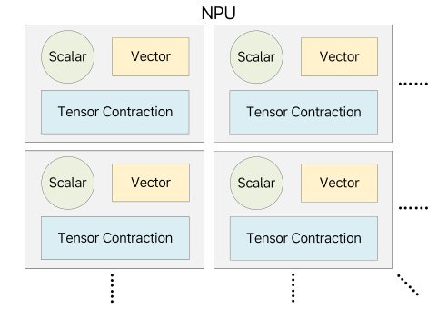{#fig-computing-elements width=100%}

M100 NPU 用于加速自动驾驶中的广泛深度学习推理任务，而其中许多任务都高度依赖卷积和矩阵乘法这类张量收缩操作，因此需要具备高计算密度的功能单元来实现高吞吐。
除此之外，向量运算在 AI 推理任务中也非常常见，虽然它们的计算强度较低，但涉及的操作类型极为多样，因此相关功能单元必须在灵活性和性能之间取得平衡。
标量计算同样普遍存在，因此仍然需要通用 CPU 核来承担这部分通用计算需求。
如图 @fig-computing-elements 所示，M100 将张量、向量和标量处理单元集成到统一的计算块中，并让它们共享本地存储器与同步资源。
该体系结构可以通过实例化多个通过片上通信网络互连的此类计算块来扩展，而软件则负责向这些计算单元分发粗粒度的计算指令，使其协同完成更大的任务。

### 存储层次

并行性仍然是加速 AI 推理负载的主要策略，但系统性能在很大程度上取决于数据如何在并行执行单元之间共享。
缓存一致性存储系统通过抽象出一个大型共享内存空间来简化编程，并在可能时利用时间与空间局部性。
然而，这类系统在大规模并行环境中难以扩展，而且常常会妨碍流式性能，而流式处理恰恰是 AI 推理的关键组成部分。
为解决这一问题，M100 采用了一种现代化的数据流计算模型。

如图 @fig-npu-design 所示，M100 NPU 在很大程度上避免了多级缓存。
每个 Tensor Processing Block (TPB) 都包含高带宽本地存储器，使功能单元在执行计算和数据处理任务时能够并行地把数据流入和流出。
TPB 存储器与 NPU 共享 SRAM 之间的数据传输由可编程 DMA 单元显式控制。
额外的 DMA 引擎则负责在 SRAM 与 DDR 存储器之间进行传输。
这种由软件管理的数据移动，再结合高效的数据流同步机制和充足的缓冲空间，使计算与数据传输能够重叠，从而最大化吞吐率。

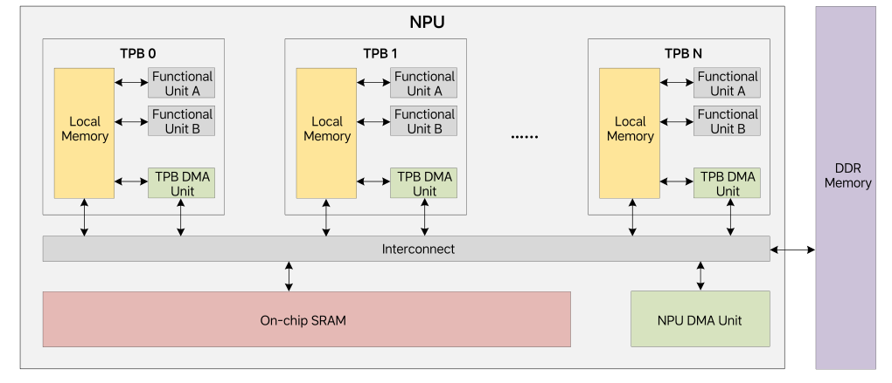{#fig-npu-design width=100%}

### 操作粒度

由于大多数 AI 推理负载都涉及以张量为中心的计算和数据传输，因此以张量粒度来定义加速器指令是很自然的选择。
这使得体系结构可以采用流式处理方式，让操作数与结果直接在存储器之间流入和流出，从而无需寄存器文件以及显式的 load/store 指令。
存储访问延迟可以在大张量上得到摊销，而流水化执行则能够最大化吞吐率。
尽管某些不规则操作仍然需要在传统 CPU 核上以更细粒度执行，但这些任务通常并不位于关键路径上。
因此，M100 将大部分硬件资源投入到规则的张量粒度计算上，并辅以轻量级 CPU 核来处理细粒度的通用计算需求。

### 数据流同步

M100 NPU 设计的另一个关键方面，是其高效的同步机制。
作为一个大规模并行系统，M100 通过图 @fig-dataflow-graph 所示的生产者-消费者同步模型来协调许多并发处理引擎。
图的上半部分展示了两个代理之间的生产者-消费者同步。
红色箭线表示内存读写操作。
黑色箭线表示对同步计数器（SC）的更新，蓝色箭线表示对 SC 的监视行为。
虚线箭头表示数据从生产者流向消费者的逻辑方向。
生产者把数据写入预分配缓冲区，并通过更新 SC 来发出“数据可用”的信号。
消费者监视该 SC，并在预期数据可用时开始处理。
反过来，消费者还会更新另一个 SC，以通知生产者缓冲区空间已被释放，从而允许数据流继续推进。
这些 SC 操作由专用硬件处理，因此同步开销极低。
同步粒度由软件控制，这使得生产者和消费者能够在张量操作期间灵活选择协调频率。
图的下半部分展示了这种基于 SC 的同步机制如何扩展到一组代理，其中某些代理既可充当生产者，也可充当消费者，从而使 M100 实质上成为一个数据流并行计算系统。

M100 NPU 还支持屏障、广播和归约等其他同步模式。
这些同步机制效率很高且易于编程，而且它们不仅适用于单个 NPU，也适用于多芯片配置下的多个 NPU。

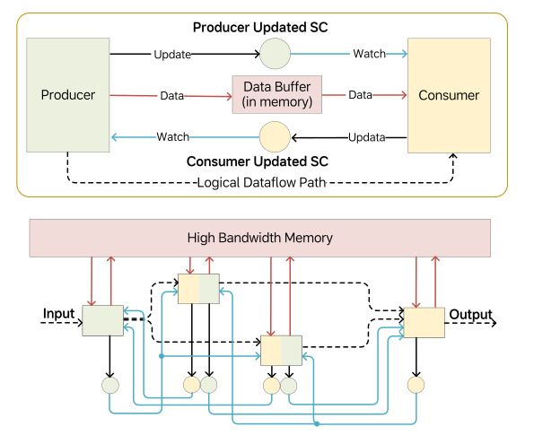{#fig-dataflow-graph width=100%}

### 指令派发

M100 NPU 使用集中式指令派发器，并借助指令链总线高效地把张量操作指令广播到多个处理单元。
为了简化硬件设计，体系结构要求发往每个处理单元的指令必须按派发顺序执行，而不同处理单元之间的指令则允许乱序完成。
当不同处理单元之间存在依赖时，由软件负责管理相应同步。
与传统数据流体系结构不同，这种设计把一部分复杂性转移给了编译器和运行时，它们可以利用 AI 推理负载中的规则性来规划与调度执行。
这种“编排式数据流体系结构”在硬件简洁性与软件控制之间实现了务实平衡，同时保留了数据流并行的高效性。

### 小结

总之，M100 NPU 集成了张量/向量计算引擎、DMA 单元和轻量级 CPU 核。
大部分计算都以张量粒度、以流式方式完成，数据直接在存储器之间流入和流出。
通用任务则由轻量级 CPU 处理，并在需要时配合向量扩展。
编译器负责通过分发计算与数据移动指令，并管理各处理单元之间的同步，来编排数据流执行。
下一节将进一步讨论该体系结构的细节。

## M100 概览

### M100 SoC

M100 是一款为支持理想汽车 AD 软件栈而设计的 SoC。
与其他 AD 芯片一样，它包含应用 CPU、多媒体 IP、安全岛以及标准 I/O 接口。
它的关键差异化特征，是由理想汽车自主研发、用于加速 AI 推理的 Neural Processing Unit (NPU)。
图 @fig-m100-soc 展示了其高层框图。

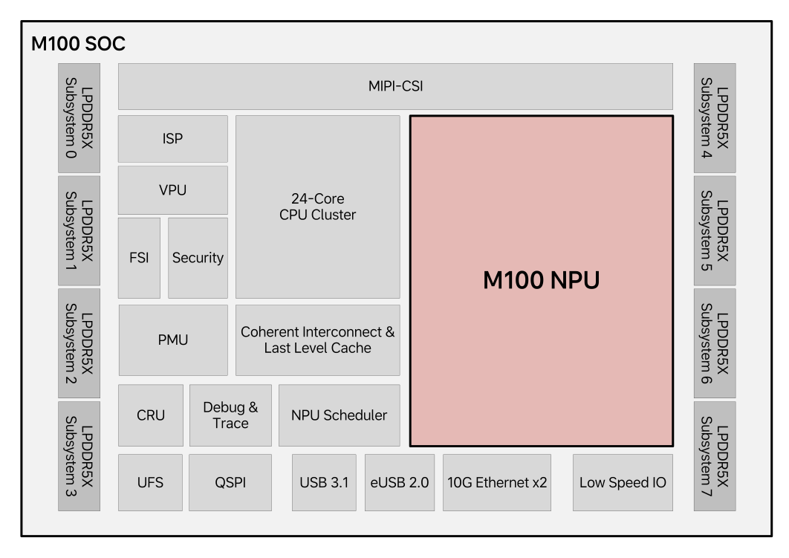{#fig-m100-soc width=100%}

图 @fig-m100-soc 突出了 M100 SoC 的主要功能模块。
它包含 8 个 LPDDR5X 子系统，可提供 64 GB 内存和 273 GB/s 的峰值带宽。
MIPI-CSI 系统支持最多 11 路摄像头输入，而 Image Signal Processor (ISP) 子系统负责处理原始图像并为 NPU 的 perception models 生成输入数据。
Video Processing Unit (VPU) 负责视频编解码，而 Functional Safety Island (FSI) 和安全引擎则分别保证 FuSa 合规和不可信内容的安全处理。
Power Management Unit (PMU) 与 Clock and Reset Unit (CRU) 协同完成上电时序控制以及时钟/复位分发。
专用的 NPU Scheduler 负责分发推理任务并收集结果。
Debug & Trace 模块为 CPU 和 NPU 子系统提供侵入式与非侵入式调试支持。
SoC 还包括用于外部存储的 UFS/QSPI 控制器、用于高速 I/O 的 USB/Ethernet 控制器，以及多种低速接口。
CPU 集群集成了 24 个 ARM Cortex-A78AE 核，并配有一致性的 CMN 互连和共享的末级缓存。

### M100 NPU

作为本文的核心，M100 NPU 是 SoC 中最重要的子系统。
它占据了芯片相当大的面积，并承担主要的 AI 推理计算工作。
其创新的数据流体系结构使 M100 区别于其他 AI 加速器。
图 @fig-m100-npu-top 展示了 NPU 的高层体系结构。

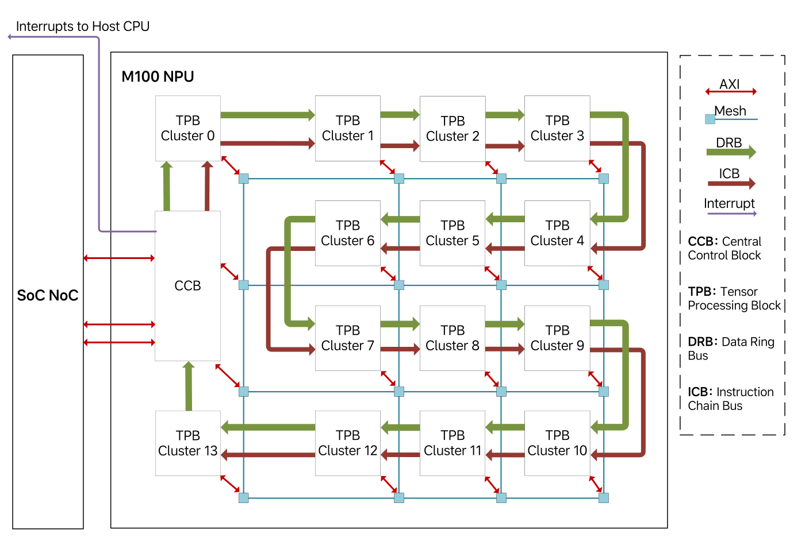{#fig-m100-npu-top width=100%}

NPU 通过三类主要接口与 SoC 其他部分相连。
首先，两条高带宽 AXI 主接口（每条 128 GB/s）通过 NoC 系统访问 DDR 存储器和其他 SoC 资源，而该 NoC 具有足够的未完成事务能力，以维持峰值存储吞吐。
其次，NPU 可以产生中断，以向调度 CPU 通知任务完成等事件。
最后，调度 CPU 通过一条较低带宽的 AXI 从接口与 NPU 通信，以发出命令、查询状态并访问内部资源。

在内部，NPU 由一个 Central Control Block (CCB) 和 14 个 Tensor Processing Block (TPB) clusters 组成，而每个 cluster 包含 4 个 TPB。
为支持 AI 推理中的数据移动需求，CCB 与 TPB 之间通过两类互连连接：二维 Mesh Bus 和 Data Ring Bus（DRB）。
Mesh Bus 在 TPB 集群、中央控制块、CPU、DMA 和块 SRAM 之间提供可扩展的高带宽点对点通信。
在低拥塞条件下，它可为每对节点提供最高 256 GB/s 的带宽，并可继续扩展。
相比之下，DRB 提供一种确定性更强、效率更高的广播通路，聚合带宽最高可达 256 GB/s，因此非常适合在多个 TPB 之间进行多播。
软件会根据通信需求在 Mesh 和 DRB 之间动态选择。

Instruction Chain Bus (ICB) 以菊花链方式把 CCB 连接到各 TPB 集群。
CCB 中的 RISC-V 核通过 ICB 把指令分发给单个或多个 TPB。
这些 TPB 指令定义张量操作，并携带张量形状和通信需求等丰富元数据。
虽然每条指令可能长达数千比特，以 64 bit/cycle 传输时需要数百个周期，但由于它们的执行时间通常长达数万个周期，因此指令分发并不会成为瓶颈。

后续各节将更详细地介绍 M100 NPU 的构建模块，并强调其数据流执行模型与精心选择的编程粒度如何同时带来高性能与灵活性。

# NPU 体系结构细节 {#sec-architecture-details}

## 中央控制块

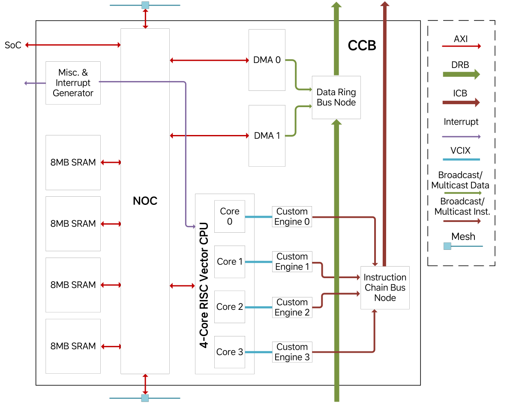{#fig-ccb width=100%}

图 @fig-ccb 所示的 Central Control Block (CCB) 是 NPU 的控制中心。
其固件运行在一颗 4 核 SiFive X280 RISC-V CPU 上，而每个 CPU 核都与一个自定义向量引擎配对，以便通过 ICB 分发 TPB 指令。
这些引擎会解析并转发大型而复杂的 TPB 指令，这类指令通常长达数千比特，用于定义矩阵乘法或逐元素加法等张量操作。
指令中同时包含操作数访问方式、计算方法以及结果处理方式。
借助四对 CPU 与自定义引擎，CCB 最多可支持四个并发的推理任务。
TPB 指令还可以通过目的掩码广播到多个 TPB，而鉴于这类指令的执行时长很长，ICB 的带宽通常足以支撑持续吞吐。
CCB 还集成了 32 MB 片上 SRAM，其被划分为四个 8 MB bank，并按 4 KB 粒度交错，以支持高带宽并行访问。
两条 DMA 引擎负责在 DDR 与 CCB SRAM 之间搬运数据，同时也能通过 DRB 直接把权重广播到 TPB，而 DRB 带宽最高可达 256 GB/s，与 DDR 读带宽相匹配。

CCB 的其他功能还包括屏障同步和中断生成。
屏障操作可确保一组 TPB 在继续执行之前先完成各自当前指令，这对于不频繁的全局同步点非常有用。
中断可通过控制寄存器触发到 CCB 或主机 CPU。
所有这些组件都通过 Arteris FlexNoC 互连。

## 张量处理块集群

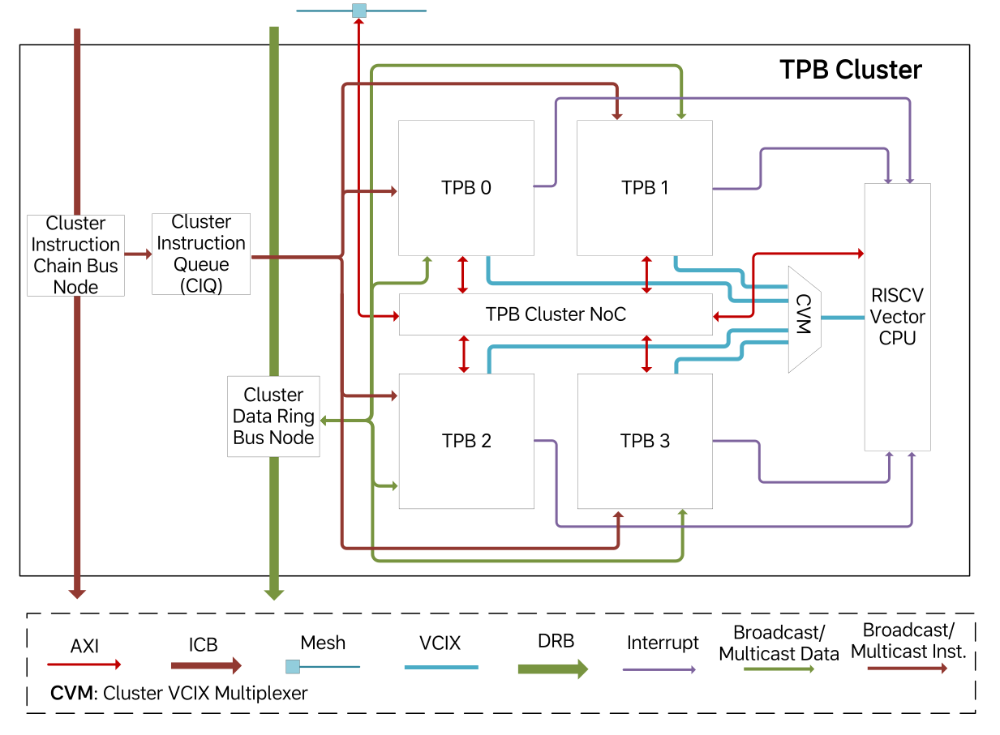{#fig-tpb-cluster width=100%}

图 @fig-tpb-cluster 展示了 TPB 集群的结构。
引入集群级层次结构主要有两个原因。
第一，四个 TPB 可以共享公共资源，例如指令缓冲区、ICB 与 DRB 节点，以及一颗 RISC-V CPU，从而让更多硅面积能够分配给张量处理逻辑，提升计算密度。
第二，四个 TPB 之间的物理邻近性使它们能够进行低延迟、高带宽通信，因此非常适合横跨少量 TPB 的任务，而这正是我们 AD 推理负载中的常见情况。
对于更大的任务，多个集群仍可通过 Mesh Bus 协同工作，不过编程人员应意识到不同集群之间 TPB 通信效率相对更低，并据此应用相应优化策略。

共享的 RISC-V 向量 CPU（SiFive X280）提供通用计算能力。
TPB 指令可以通过中断触发基于 CPU 的任务。
CPU 会取回任务参数，执行预加载的服务例程，并在完成后把对应 TPB 指令标记为结束。
最多可有四个 TPB 同时提出服务请求，而 CPU 会负责仲裁并按顺序处理。
这种机制使基于 CPU 的操作与张量操作能够遵循相同的指令语义，从而简化编译、调度和分发过程。

每个集群都包含一个 TPB 指令队列，用于从 ICB 下载指令并缓存在大容量缓冲区中。
指令会在功能单元准备就绪时分发给各 TPB 的功能单元，而无需维持全局执行顺序，只需保证同一 TPB 的同一功能单元内部保持顺序。
这体现了我们的编排式数据流体系结构的核心思想，即编译器生成一个宽松排序的指令流，而运行时执行则由数据就绪状态和同步条件驱动。
该指令队列确保只要输入和同步条件满足，功能单元就能立刻开始有效工作。

与 CCB 类似，每个集群内部也有一个 NoC，用于连接四个 TPB 与 CPU 存储端口。
集群 NoC 通过主/从端口与 NPU 级 Mesh Bus 相连，以支持双向数据访问。
ICB 节点负责 TPB 指令传递，而 DRB 节点负责集群收发广播数据。

## 张量处理块 {#sec-tpb}

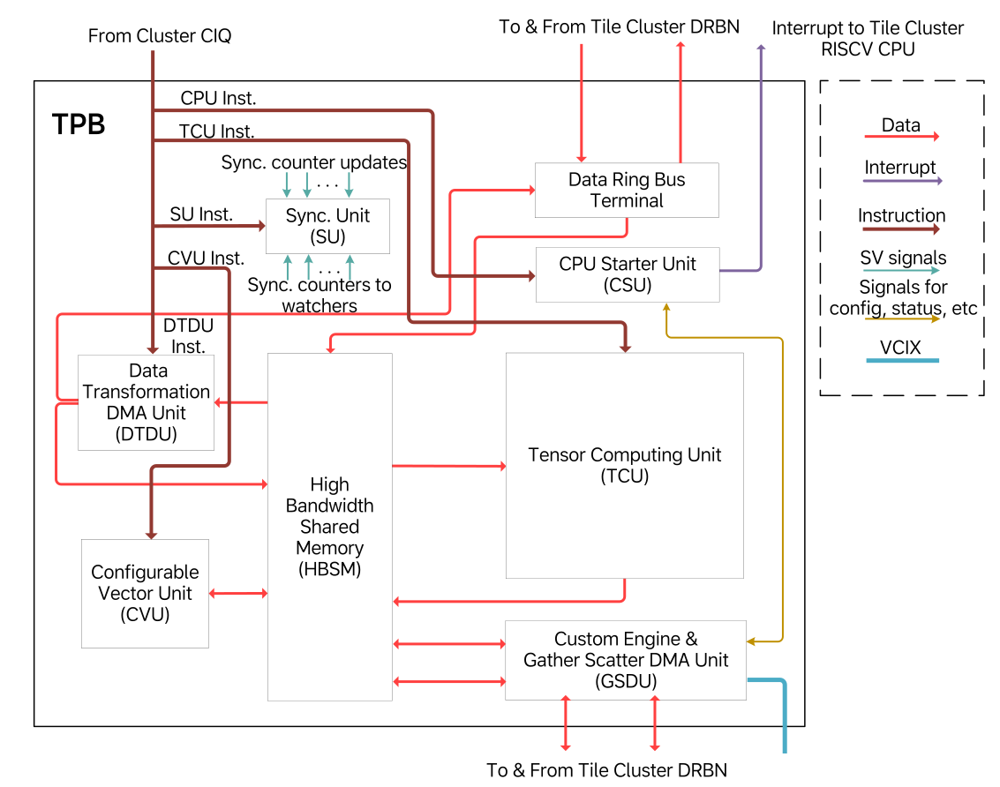{#fig-tpb width=100%}

TPB 是负责张量计算与变换的核心单元。
如图 @fig-tpb 所示，它由若干专门化功能单元构成，而每个功能单元都针对特定类型的张量操作进行了优化。
下面简要概述 TPB 中的主要功能单元。

- High Bandwidth Shared Memory (HBSM) 既是一个 2 MB 数据存储体，也是 TPB 功能单元之间灵活的通信枢纽。
  生产者与消费者通过预定义地址范围交换数据，并借助计数器完成同步，因此无需专用数据通路。
  为减少 SRAM 端口冲突并保持性能，HBSM 采用了 banked memory design。

- Tensor Computing Unit (TCU) 负责最密集的计算操作，例如卷积与矩阵乘法，并包含一个用于激活函数的非线性流水线。

- Configurable Vector Unit (CVU) 由模块化向量算术单元组成，可重构为定制流水线。
  它能够高效处理基本向量运算以及池化、Softmax 和 LayerNorm 等常见 AI 操作。

- Data Transformation DMA Unit (DTDU) 负责 TPB 内部的数据移动以及对其他 TPB 的广播。
  它还支持矩阵转置等张量布局变换。

- CPU Starter Unit (CSU) 负责处理请求集群 CPU 协助的 TPB 指令。
  它会保存指令参数并触发中断。
  随后 CPU 通过向量协处理器指令扩展（VCIX）接口访问请求 TPB 的数据和设备。

- 自定义引擎通过 VCIX 接口代表 CPU 执行 TPB 操作，包括控制寄存器与存储器访问。
  其中还包含一个 Gather/Scatter DMA 单元（GSDU），CPU 可以利用它执行不连续地址模式的数据搬运。

- Synchronization Unit (SU) 负责管理 TPB 功能单元可在本地更新和监视的同步计数器。
  它还支持通过 DRB 和 NPU NoC 进行远程同步。

下面的各小节将对 TPB 功能单元作更详细的讨论。

**1）高带宽共享存储器单元**

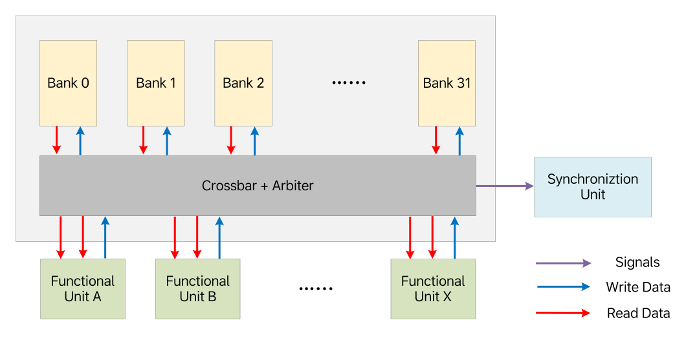{#fig-hbsm width=100%}

2 MB 的 HBSM SRAM 在 TPB 的所有功能单元之间统一共享。
如图 @fig-hbsm 所示，大多数单元会在执行任务时从 HBSM 并行地流入和流出张量。
由于一个单元的输出往往会成为另一个单元的输入，HBSM 无需专用数据通路就能支持高效的生产者-消费者通信。
虽然这种共享存储结构会引入大约 20 个周期的延迟，但 TPB 操作的流式特性使得这一点并不致命，前提是能够维持高带宽，而且这种高带宽不仅针对单个单元，也针对多个单元的并发访问，而这对维持 TPB 吞吐至关重要。

HBSM 通过 banked architecture 获得高带宽，它包含 32 个存储 bank，而每个 bank 都支持每周期 32 字节的数据传输。
地址空间以 32 字节粒度在这些 bank 之间交错，从而允许不同 bank 被同时访问。
尽管更多的 bank 能通过减少冲突来提升带宽，但它们也会增加布线拥塞，尤其是在这种高吞吐设计中。
经过大量建模和后端评估之后，我们选择了 32 个 bank 和 8 个请求端口，作为较优平衡点。

当多个请求者访问同一个 bank 时，HBSM 会采用轮询仲裁，并保证同一请求者内部的访问顺序。
同步动作，例如标记一块数据已被生产或消费，会附着在存储访问之上，并在请求赢得仲裁时触发。
从那一刻起，该访问就被视为全局可见，因为之后的任何请求都无法越过它。
通过统一数据移动与同步，HBSM 成为了 M100 数据流体系结构的 central backbone。

**2）张量遍历单元**

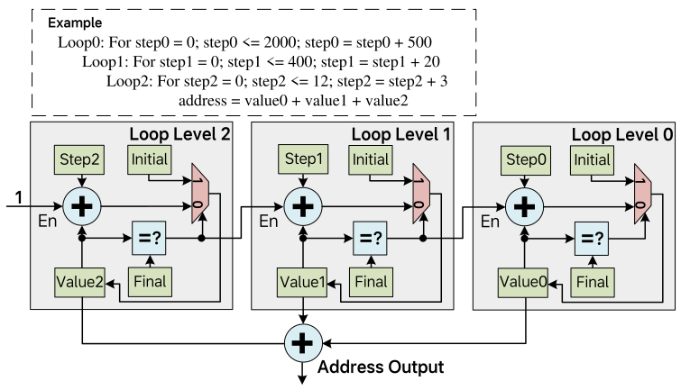{#fig-twu width=80%}

TPB 功能单元通过把输入数据流入、把输出数据流出，来访问存放在 HBSM 中的张量。
这要求系统生成适合特定计算模式的地址序列。
对于卷积这类操作，地址往往不是简单的线性递增序列，而是由嵌套循环定义的复杂非线性模式。
为支持这一需求，系统使用 Tensor Walking Unit (TWU) 来灵活生成所需地址序列，从而高效访问输入激活和权重。

一个 TPB 功能单元通常有两个或更多输入 TWU，以及一个输出 TWU。
该功能单元对应的 TPB 指令可以配置 TWU，指定嵌套循环层数，以及每层循环的 *Initial*、*Step* 和 *Final* 值。
完成配置之后，TWU 会在每次迭代中生成一个地址，直到每一层循环中的 *Value* 计数器都到达该层的 *Final* 值。
图 @fig-twu 展示了一个三级 TWU 的示例。
输出地址是所有循环层级 *Value* 计数器之和。
当内层循环层级的 *Value* 达到其 *Final* 值时，外一层循环的 *Value* 计数器就会按该层的 *Step* 值递增。
当然，最内层循环的 *Value* 计数器在每次迭代都会无条件递增。
每当某层循环的 *Value* 达到其 *Final* 值时，它在下一次递增时都会从 *Initial* 重新开始。
TWU 还支持双缓冲地址生成。
通过在外层循环指定带缓冲区偏移的 *Step* 值，程序员便可以无缝地在两个缓冲区之间交替。

TWU 生成丰富地址模式的能力，再结合基于 HBSM 的数据共享机制，使 TPB 功能单元之间能够在无需专用数据通路和专用缓冲的前提下，高效实现复杂的数据通信。
因此，TWU 成为 M100 NPU 简洁而强大的数据流体系结构中的关键支撑部件。

**3）同步单元**

同步是数据流并行计算中的关键组成部分。
功能单元必须在数据被生产或消费时通知对端，才能保证数据沿流水线阶段顺畅流动。
传统体系结构往往依赖原子操作或独占式 load/store 指令来实现同步，而这种方法通常效率不高，并且与缓存和存储子系统紧密耦合。
相比之下，在以数据流执行为优化目标的 AI 加速器 M100 NPU 中，同步可以大幅简化，并按如下方式处理。

- 一个代理在执行某项任务时更新自身执行状态。
- 另一个代理监视第一个代理的状态，并据此决定是否可以继续执行下一步。

这种更新/监视关系可以在两个代理之间双向存在。
例如，生产者在更新自身数据生产状态的同时，也在监视消费者的数据消费状态，而消费者也会在更新自身消费状态的同时监视生产者的数据生产状态。
这使得二者能够协同形成一条计算流水线。
同样的机制也可以扩展到多个代理，从而利用简单的状态更新和状态监视操作构建一个同步网络。

在每个 TPB 内部，Synchronization Unit (SU) 负责管理硬件计数器，用于跟踪和协调执行状态。
功能单元可以占用一个计数器来更新自身进度，也可以监视其他计数器，以判断依赖是否满足。
更新和监视动作会在 TPB 指令指定的特定执行阶段触发。
当收到更新请求时，SU 会将指定计数器加一。
监视请求会携带一个期望值，而只有当计数器达到或超过该值时，SU 才会做出响应。
在此之前，发出监视请求的单元会暂停执行。
软件负责决定在执行某项任务时，哪些计数器被更新，哪些计数器被监视，以及监视所对应的期望值。
通过合理分配这些计数器，便可以在多个并行功能单元之间构造出一个高效、同步良好的执行流水线。

**4）张量计算单元**

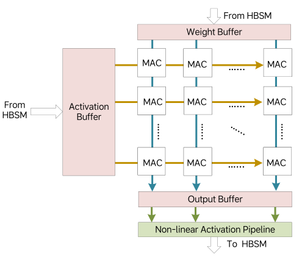{#fig-tcu width=100%}

Tensor Computing Unit (TCU) 通过一组致密排列的计算单元来加速张量收缩操作。
为了在受限的存储带宽下维持高吞吐，数据复用是必要条件。
如图 @fig-tcu 所示，TCU 将 Multiply-Accumulate (MAC) units 排列成一个 8×64 的二维阵列。
每个 MAC 每个周期可执行一个包含 4 对激活值和权重值的点积。
激活数据在行方向复用，而权重数据在列方向复用。
对于规模为 32×32 与 32×64 的矩阵乘法，TCU 可以在 32 个周期内完成计算，而在元素宽度为 1 字节时，这正好匹配激活缓冲区 32B/cycle 和权重缓冲区 64B/cycle 的输入带宽。
借助双缓冲，TCU 能够在矩阵乘法和卷积操作上持续保持峰值吞吐。

MAC 操作之后，部分和会被存入输出缓冲区，并随后通过带非线性函数的激活流水线，最终写回 HBSM。
由于张量收缩通常沿较长归约轴进行，因此输出数据量相对较小，所以写回带宽通常不是瓶颈。
对于更大的张量，TCU 提供外层循环控制逻辑，用于按块遍历源张量，从而以很少的空泡周期保持流水线工作。

**5）可配置向量单元**

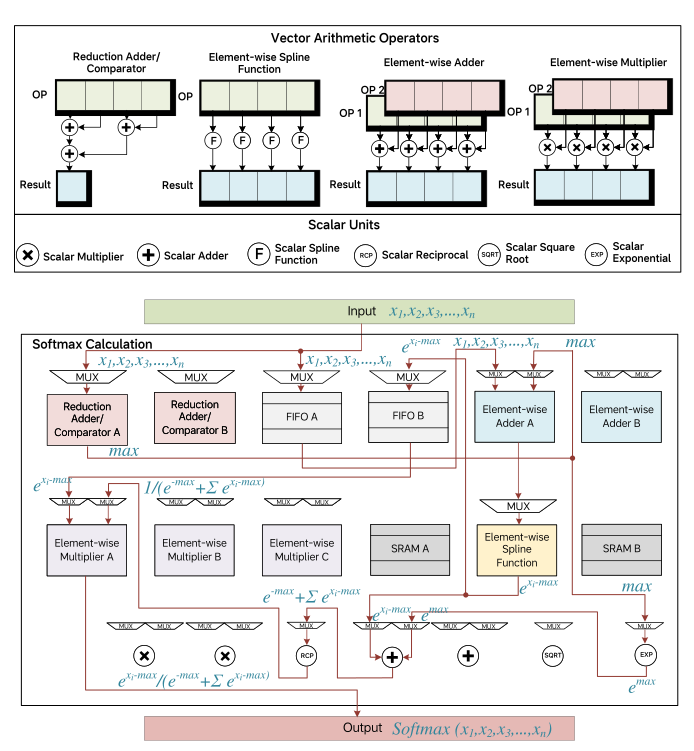{#fig-cvu width=100%}

图 @fig-cvu 展示了 Configurable Vector Unit (CVU) 的核心组成部分，它由若干单一功能的向量算术算子构成。
每个算子接收一个或两个输入向量流，并产生一个输出向量流。
TPB 指令可以把输入流路由到单个算子，也可以把多个算子和中间缓冲组合成多级流水线。
这种灵活性使 CVU 能够极高效地执行常见向量操作。
在图 @fig-cvu 的底部，展示了一种面向 Softmax 计算的 CVU 配置，而 Softmax 是 Transformer 模型中频繁出现的操作。
图中还在各参与向量算子上标注了配置后各流水级的计算步骤，以说明 CVU 如何高效完成 Softmax。

对于那些无法完全流水化的复杂向量操作，CVU 仍可以把它们拆分为多个阶段，并分别用不同 TPB 指令来处理。
尽管这种方式可能降低吞吐，但整体性能仍优于或不逊于传统向量核心方案。
由于 CVU 提供了巨大的配置空间，我们预计它对 AI 推理工作负载中的多样向量计算模式都具有良好适应性。

**6）DMA**

除了计算单元外，每个 TPB 还配备了高性能 DMA 引擎，以支持 TPB 内部以及跨多个 TPB 的数据流。
TPB 中存在两类 DMA。

- Data Transformation DMA Unit (DTDU) 像计算单元一样执行 TPB 指令。
  它负责 HBSM 内部的数据移动，支持矩阵转置等操作，并能够高效地将预定义值填充到指定地址范围，实现存储初始化。

- Gather-Scatter DMA 单元（GSDU）由集群 CPU 管理，并不直接执行 TPB 指令。
  它负责那些难以编码进标准 TPB 指令的不规则数据移动模式。
  具体来说，一条 TPB 指令会触发 CPU Starter Unit (CSU)，由后者启动 CPU 例程来控制 GSDU。
  GSDU 在本地 HBSM 与外部存储空间之间搬运数据，例如另一个 TPB 的 HBSM、CCB SRAM 或 DDR。
  顾名思义，它支持本地与远端存储空间之间的 gather/scatter 操作。

**7）CPU 启动单元**

CSU 通过执行一条 TPB 指令来触发中断，从而请求集群 CPU 协助完成某项任务。
任务参数会保存在 CSU 中，而 CPU 的中断服务例程会取回这些参数，以判断需要执行的具体操作。
这些任务可能涉及标量处理、向量处理，或者通过 VCIX 接口控制 GSDU 执行运行时决定的数据移动。
在例程完成之后，它会通知 CSU，而 CSU 则把对应的 TPB 指令标记为结束。

# 编译器与运行时软件栈 {#sec-software-stack}

作为垂直整合方案的一部分，M100 的编译器与运行时软件栈在确保功能正确和性能优异方面发挥着关键作用。

## 编译器

如图 @fig-compiler-architecture 所示，M100 AI 编译工具链包含时空调度器、图编译器和后端编译器。

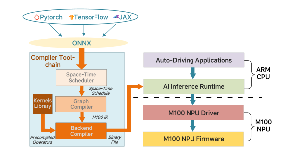{#fig-compiler-architecture width=100%}

- 时空调度器把神经网络子图映射到 M100 NPU 硬件上。
  如有必要，大张量会被划分为迷你张量，而这些迷你张量将沿着数据流编译器构造的处理流水线依次传递。
  图 @fig-space-time-compile 展示了一个时空调度示例。
  一个包含四个计算算子（OP1、OP2、OP3、OP4）的子图被空间地分布到四个 TPB 上。
  输入张量会沿多个轴进行维度分解，生成若干迷你张量，而这些迷你张量随后按照时间上调度好的阶段在分配到的 TPB 之间流动。

- 图编译器执行图优化，并为动态图张量完成动态内存分配。
  图优化包括张量融合、死代码消除、代数化简、布局变换等。

- 后端编译器是一个 C 扩展编译器，它生成内建指令，以利用 M100 体系结构中的硬件能力，例如张量计算、数据移动和同步。

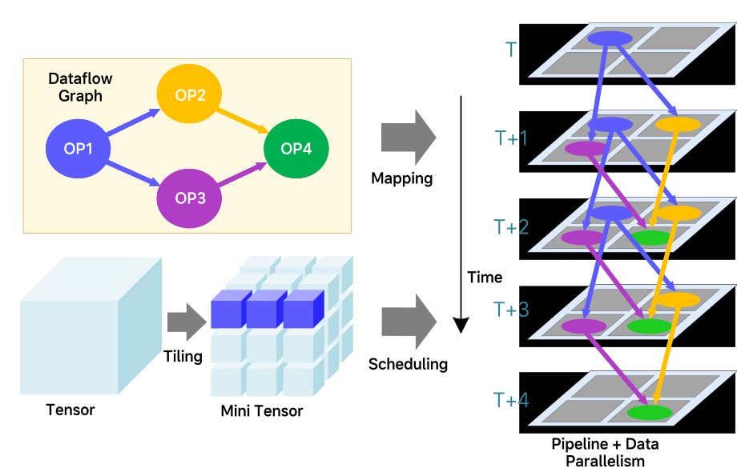{#fig-space-time-compile width=100%}

## 运行时软件

M100 运行时软件栈包含运行在 SoC ARM Cortex-A78 核上的 AI inference runtime 与 NPU 驱动，以及运行在 NPU RISC-V 核上的 NPU 固件。
AI inference runtime 负责准备输入数据、加载神经网络模型、在资源分配完成后启动任务，以及对推理结果进行后处理以供下游应用使用。
AI inference runtime 还会监视 NPU 运行过程中出现的错误或异常状态，并确保 NPU 满足 automotive FuSa 要求。
NPU 驱动为上层应用软件提供硬件抽象层。
NPU 固件采用 JIT 技术，依据 M100 编译工具链生成的二进制代码动态生成优化后的 TPB 指令。
固件还会在运行时动态计算张量形状以及张量存储的存储地址。
最后，NPU 固件把 TPB 指令发给分配到某项任务上的一组 TPB。

# 评估结果 {#sec-evaluation-results}

为了评估 M100 NPU 体系结构的性能，我们使用与 AD 应用相关的基准，在 M100 和 NVIDIA Thor-U 这一先进的 AD 与边缘 AI 推理 SoC 平台之间进行了对比研究。
在本节中，我们首先介绍两个平台的硬件配置。
然后，我们分析所选基准的特征。
最后，我们给出性能数据，以展示相较 Thor-U，M100 如何在关键 AD 工作负载中实现有竞争力甚至更优的 AI 推理效率和硬件利用率。

## 硬件配置

在本文撰写时，理想汽车尚未正式公开 M100 的详细性能规格，公开信息仅包括 DDR bandwidth 和 die size 等基本指标。
表 @tbl-hardware-config 给出了 M100 当前可公开的数据，并将其与 Thor-U 的可比数据并列展示。
两个平台具有相同的 DDR bandwidth，而 Thor-U 的 die size 略大，这暗示它们的原始计算能力大体相当。
为了保证公平性，基准测试时两个平台的数据都在相同功耗预算下采集。

| Metric | Thor-U | M100 |
|---|---:|---:|
| DDR memory bandwidth | 273 GB/s | 273 GB/s |
| Die size | 415 mm^2^ | 399.8 mm^2^ |
| Process | TSMC N4 | TSMC N5A |

: NVIDIA Thor-U 与 M100 的硬件配置对比。 {#tbl-hardware-config}

## 基准

自动驾驶与智能座舱是当代智能汽车中的两项重要特性。
我们选择端到端自动驾驶算法 UniAD [@hu2023planning] 作为自动驾驶基准应用。
对于智能座舱场景，像 LLaMA2-7B 这样的 LLM [@touvron2023llama] 是支持车与驾驶员/乘客之间智能交互的关键组成部分。
因此，我们将 LLaMA2-7B 选作另一个重要的性能评估基准。
此外，为了更全面地评估 AD 场景下集成式 VLA 能力，我们还选取了理想汽车自研 MindVLA 模型中的一个关键组件作为第三个基准。

在把 UniAD、LLaMA2-7B 和 MindVLA 移植到 Thor-U 与 M100 平台的过程中，我们确保在两个系统上执行基准时，使用了可比较的计算资源和功耗水平。
本节其余部分将给出这三个基准的更多细节。

### 模型结构

- 为了更好地代表理想汽车当前部署的 AD 算法，UniAD 基准将 ResNet-101 替换为 RegNet。
  如图 @fig-uniad-pipeline 所示，UniAD 算法提供了一个统一框架，可无缝集成自动驾驶的两个核心任务：感知与预测。
  感知涵盖目标检测与跟踪，而预测则处理运动预测与占用预测。
  Perception modules（BevFormer、TrackFormer、MapFormer）和 prediction modules（MotionFormer、OccFormer）都建立在 Transformer architecture 之上。
  这些组件之间通过大量查询 token（query token）相连，例如 TrackFormer 中有 900 个，这为推理过程中的并行处理提供了充足机会。
  在进入第一个 perception stage（BEVFormer）之前，系统会先利用 CNN-based backbone 从输入图像中提取特征。

  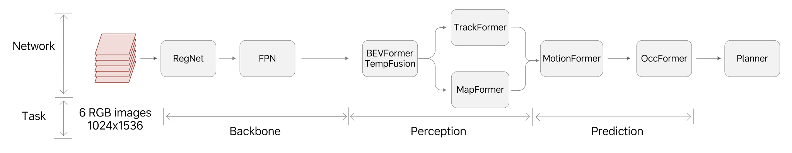{#fig-uniad-pipeline width=100%}

- LLaMA2-7B 是一个基于 Transformer 的大语言模型，参数规模约为 70 亿。
  它采用标准的 decoder-only Transformer architecture，包含多头自注意力和前馈网络。
  其推理过程由两个阶段组成，即并行处理输入序列的 prefill phase，以及顺序生成 token 的 decode phase。

- MindVLA 是理想汽车下一代自动驾驶算法，它通过 Mixture-of-Experts（MoE）Transformer 体系结构整合了 LLM 组件，以同时提升模型容量和推理效率。

### 计算复杂度分析

表 @tbl-uniad-parameters 给出了 UniAD 各 network model 的 parameter counts 与 MAC operations 概览。
CNN-based backbone 占据了大部分计算资源使用量，主要原因在于它需要对高分辨率图像执行高强度卷积运算。
在真实驾驶场景中，感知任务（BEVFormer、TrackFormer、MapFormer）通常以高于预测任务（MotionFormer 和 OccFormer）的帧率运行，因此也需要更多计算资源。
因此，我们的分析重点放在 UniAD 中的 CNN-based backbone 和 Transformer-based perception models 上。

| Module | Network Architecture | Network Model | Parameters (M) | MAC Operations (GFLOPS) |
|---|---|---|---:|---:|
| backbone | CNN-based | RegNet + FPN | 30 | 2381.6 |
| backbone | Transformer-based | BEVFormer | 85.6 | 1492.9 |
| backbone | Transformer-based | TempFusion | 0.2 | 49.0 |
| Perception | Transformer-based | TrackFormer | 8.5 | 97.17 |
| Perception | Transformer-based | MapFormer | 6 | 105.94 |
| Prediction | Transformer-based | MotionFormer | 22.6 | 266.55 |
| Prediction | Transformer-based | OccFormer | 46.2 | 687.62 |
| Planner | - | - | 3.5 | 220.75 |

: UniAD 各 network model 的 parameter sizes 与 MAC counts。 {#tbl-uniad-parameters}

LLaMA 推理由两个阶段组成，即 prefill 和 decode。
在 prefill phase，输入序列中的所有 token 会被并行处理，而数量庞大的并发 token 与 UniAD 中的并行查询类似，因而提供了很高的计算并行性。
相比之下，decode phase 每一步只生成一个 token，因此并行性有限，并呈现为一个存储带宽受限的操作。

不同于 LLaMA2-7B，MindVLA 的 LLM 组件采用了具有 8 个 expert 的 Mixture-of-Experts（MoE）策略。
在评估中，我们使用一个 4.31 亿参数的配置作为基准。

## 实验结果

需要指出的是，我们的实验在 M100 NPU 上使用了 14 个可用集群中的 12 个，这相当于其总计算能力的 86%。
这样配置的目的，是通过允许最多两个缺陷集群存在来提高芯片良率。
对于缺陷集群少于两个的芯片，利用额外硬件资源还可以获得更高性能。

### UniAD

表 @tbl-uniad-comparison 比较了运行在 M100 与 Thor-U 平台上的六个 UniAD 基准结果。
对于 M100 平台，我们在 14 个可用计算集群中拿出 8 个用于 UniAD 任务，而将剩余 6 个集群预留给其他座舱域功能。
这种资源分配策略展示了 M100 在维持性能隔离的同时处理多个域特定工作负载的能力。

结果表明，M100 在不同网络组件上获得了 1.2× 到 6.3× 的加速，其中多数模块的性能提升在 3.8× 到 4.4× 之间。
即使只有 8 个集群专用于 AD 任务，M100 仍能在感知任务上维持 30 FPS，从而满足自动驾驶的实时性要求。
相比之下，Thor-U 只能提供 7.9 FPS，这不足以支撑高速驾驶场景下的 Navigate on Autopilot 部署。

在相同功耗预算下，M100 的帧率是 Thor-U 的 3.8×。
这一性能提升归因于 M100 面向 AI 推理任务并行化的紧密软硬件一体化方案。
具体来说，其由编译器生成并精心编排的数据流执行方式，在计算单元与数据移动单元之间实现了极高程度的并行性，同时仅带来极小的同步开销。

|  | M100（启用 8 个集群） | Thor-U | M100 speedup |
|---|---:|---:|---:|
| RegNet | 13.1 ms | 57.4 ms | 4.4x |
| FPN | 4.23 ms | 5.1 ms | 1.2x |
| BEVFormer | 7.92 ms | 32.83 ms | 4.1x |
| TempFusion | 4.47 ms | 17 ms | 3.8x |
| TrackFormer | 1.27 ms | 7.95 ms | 6.3x |
| MapFormer | 1.46 ms | 6.14 ms | 4.2x |
| Frame rate | 30 FPS | 7.9 FPS | 3.8x |

: M100 与 Thor-U 上 UniAD 不同网络的性能对比。 {#tbl-uniad-comparison}

我们利用内部性能分析软件跟踪 M100 的行为，并采集了详细执行时间线数据。
由此得到的执行时间线如图 @fig-trace 所示。
不同颜色的块表示不同处理单元在不同时间段的活动，其中连续区段表示持续工作，而空隙表示空闲或等待。
在这条时间线上，于大部分采样窗口中，CCB 内的 DMA，以及某个 TPB 中的 TCU、CVU、CSU 和 GSDU 都保持持续活动，并且任务执行之间存在大量重叠。
这表明硬件利用率很高，同时也凸显了 M100 体系结构在并行执行能力和总体效率方面的优势。

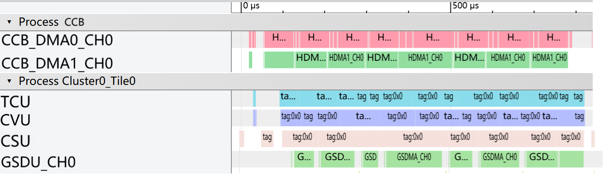{#fig-trace width=100%}

### LLaMA2-7B

在 LLaMA2-7B 基准设置中，输入序列长度被设为 1,024 个 token。
表 @tbl-llama-comparison 总结了 M100 与 Thor-U 平台在该推理任务 decode 与 prefill 两个阶段上的性能对比。
对于 decode phase，我们采用 W4A16 量化，即权重使用 4 位整数表示，而激活特征使用 16 位浮点数表示。
M100 在该阶段取得了 21.34 ms 的延迟，与 Thor-U 的 20 ms 性能相当。
尽管在这一指标上 Thor-U 略有优势，但这主要是因为 NVIDIA 平台已针对 LLaMA2-7B 这类开源模型进行了大量优化。
另一方面，由于 M100 与 Thor-U 具有相同的 DDR 存储带宽，而这正是 decode phase 性能的主要约束，因此两者表现接近是符合预期的。
对于 prefill phase，我们采用 W8A8 量化，即权重和激活都使用 8 位整数表示。
M100 展现出明显优势，以 79 ms 完成推理，而 Thor-U 需要 154 ms，达到 1.95× 加速。
这一提升归因于 M100 高效的 tensor processing units，以及使这些处理单元能够无缝协同的、由数据流驱动的同步机制。

|  | M100（启用 12 个集群） | Thor-U | M100 speedup |
|---|---:|---:|---:|
| decode | 21.34 ms (W4A16) | 20 ms (W4A16) | 0.94x |
| prefill | 79 ms (W8A8) | 154 ms (W8A8) | 1.95x |

: M100 与 Thor-U 上 LLaMA2-7B 推理各阶段的性能对比。 {#tbl-llama-comparison}

### MindVLA（LLM 部分）

除了评估开源模型之外，我们还测试了理想汽车自主开发的下一代自动驾驶模型 MindVLA。
这项评估展示了 M100 平台支持生产级 AD 应用的能力。
表 @tbl-mindvla 给出了 M100 与 Thor-U 平台在 MindVLA 的 LLM 组件上的性能对比。

|  | M100（启用 12 个集群） | Thor-U | M100 speedup |
|---|---:|---:|---:|
| decode | 0.1 ms | 0.3 ms | 3x |
| prefill | 0.84 ms | 1.74 ms | 2.1x |

: M100 与 Thor-U 上 MindVLA（LLM 组件）的性能对比。 {#tbl-mindvla}

在 decode phase，M100 实现了 0.1 ms 延迟，而 Thor-U 为 0.3 ms，因此获得了 3× 加速。
在 prefill phase，M100 以 0.84 ms 完成推理，而 Thor-U 为 1.74 ms，因此获得了 2.1× 加速。
尽管这里仅展示了 LLM 组件的性能，但这些结果仍然凸显了 M100 在支持更先进自动驾驶工作负载方面的优势。

# 结论 {#sec-conclusion}

我们介绍了 M100 SoC 与 NPU，这是一套面向通用 AI 推理工作负载的理想汽车解决方案，其建立在数据流体系结构之上，并通过让编译器与运行时软件来编排处理单元之间的计算与数据移动，从而降低了设计复杂度。
我们详细说明了关键功能模块的体系结构，并解释了主要设计决策背后的考虑。
对比评估结果表明，M100 NPU 在不牺牲灵活性的前提下，能够以明显优势超过领先的 GPGPU 平台。
我们相信，只要在软件与硬件设计复杂度之间取得有效平衡，经典的数据流体系结构就能被重新激活，以满足现代 AI 计算快速演进的需求。
