原文版权声明：本文依据公开来源论文 *DeepSeek-V4: Towards Highly Efficient Million-Token Context Intelligence* 进行中文翻译整理，仅供学习与研究使用。
我仅提供翻译与网页整理，不拥有原文版权；原文版权归作者及发布方所有。
转载、分发或用于商业用途时，请遵守原论文及原始发布平台的版权规定。

原文信息：DeepSeek-AI，`research@deepseek.com`。

说明：以下内容按原文句序逐段整理翻译。
为保持技术表述自然，technical terms 尽量保留英文。
正文中的作者年份引用按原文保留；末尾 references section 保留原文，不翻译作者名、标题与 venue 信息。

# 摘要 {#sec-abstract}

我们给出 DeepSeek-V4 系列的一个 preview 版本，其中包含两个强大的 Mixture-of-Experts (MoE) language models。
它们分别是拥有 1.6T parameters（49B activated）的 DeepSeek-V4-Pro，以及拥有 284B parameters（13B activated）的 DeepSeek-V4-Flash。
这两个模型都支持 one million tokens 的 context length。
DeepSeek-V4 系列在 architecture 和 optimization 上引入了若干关键升级：第一，采用结合 Compressed Sparse Attention (CSA) 与 Heavily Compressed Attention (HCA) 的 hybrid attention architecture，以提升 long-context efficiency；第二，引入 Manifold-Constrained Hyper-Connections (mHC) 来增强传统 residual connections；第三，引入 Muon optimizer，以实现更快的 convergence 和更强的 training stability。
我们在超过 32T 的多样且高质量 tokens 上对这两个模型进行了预训练，随后又使用一条完整的后训练流程来解锁并进一步提升它们的能力。
DeepSeek-V4-Pro-Max，也就是 DeepSeek-V4-Pro 的最大推理强度模式，为开源模型重新定义了最先进水平，并在核心任务上超越了此前的前代模型。
与此同时，DeepSeek-V4 系列在长上下文场景中也具备很高的效率。
在百万 token 上下文设定下，DeepSeek-V4-Pro 的 single-token inference FLOPs 仅为 DeepSeek-V3.2 的 27%，KV cache 仅为其 10%。
这使我们能够将 one-million-token contexts 作为常规能力提供出来，从而让 long-horizon tasks 和进一步的 test-time scaling 更加可行。
模型 checkpoints 可在 `https://huggingface.co/collections/deepseek-ai/deepseek-v4` 获取。

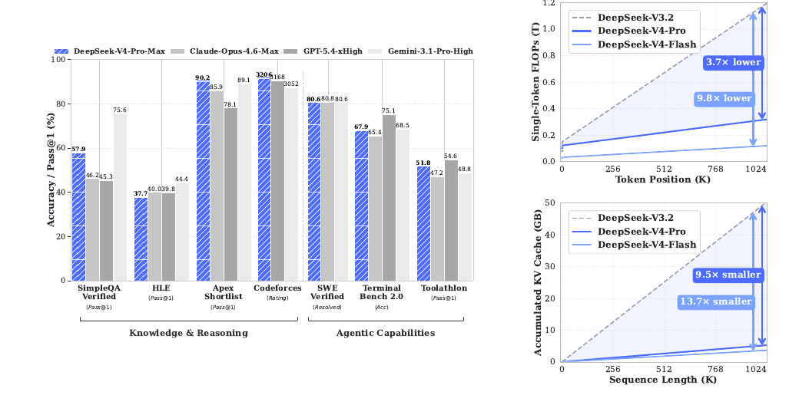{#fig-overview width=100%}

# 引言 {#sec-introduction}

reasoning models 的出现 [DeepSeek-AI, 2025; OpenAI, 2024c] 已经建立起一种新的 test-time scaling 范式，并推动了 Large Language Models (LLMs) 的显著性能提升。
然而，这种 scaling 范式从根本上受限于 vanilla attention mechanism 的 quadratic computational complexity [Vaswani et al., 2017]，这使其在 ultra-long contexts 和 reasoning process 中形成了一个难以承受的 bottleneck。
与此同时，从复杂的 agentic workflows 到大规模 cross-document analysis，long-horizon scenarios 与 tasks 的兴起，也使得对 ultra-long contexts 的高效支持成为未来进一步进展的关键条件。
尽管近期的 open-source efforts [Bai et al., 2025a; DeepSeek-AI, 2024; MiniMax, 2025; Qwen, 2025] 已经推进了通用能力，但在处理 ultra-long sequences 时，这种 core architectural inefficiency 仍是一个关键阻碍。
它限制了 test-time scaling 的进一步收益，也阻碍了对 long-horizon scenarios 与 tasks 的进一步探索。

为了打破 ultra-long contexts 下的 efficiency barrier，我们开发了 DeepSeek-V4 系列。
它包括 DeepSeek-V4-Pro 的 preview 版本，规模为 1.6T parameters（49B activated），以及 DeepSeek-V4-Flash 的 preview 版本，规模为 284B parameters（13B activated）。
借助 architecture innovations，DeepSeek-V4 系列在处理 ultra-long sequences 时实现了计算效率上的大幅跃升。
这一突破使得对 one million tokens context length 的高效支持成为现实，并把 next-generation LLMs 带入了 million-length contexts 的新时代。
我们相信，高效处理 ultra-long sequences 的能力将解锁 test-time scaling 的下一前沿，为对 long-horizon tasks 的深入研究铺平道路，并为探索 online learning 等未来范式建立必要基础。

相较 DeepSeek-V3 architecture [DeepSeek-AI, 2024]，DeepSeek-V4 系列保留了 DeepSeekMoE framework [Dai et al., 2024] 和 Multi-Token Prediction (MTP) strategy，同时在 architecture 与 optimization 上引入了若干关键创新。
为提升 long-context efficiency，我们设计了一种结合 Compressed Sparse Attention (CSA) 与 Heavily Compressed Attention (HCA) 的 hybrid attention mechanism。
CSA 会沿 sequence dimension 压缩 KV caches，然后执行 DeepSeek Sparse Attention (DSA) [DeepSeek-AI, 2025]。
HCA 则会对 KV caches 施加更激进的压缩，但仍保留 dense attention。
为增强 modeling capability，我们引入了 Manifold-Constrained Hyper-Connections (mHC) [Xie et al., 2026]，以升级传统 residual connections。
此外，我们还把 Muon [Jordan et al., 2024; Liu et al., 2025] optimizer 引入到 DeepSeek-V4 系列的训练中，从而带来更快的 convergence 和更好的 training stability。

为支持 DeepSeek-V4 系列的高效 training 与 inference，并提升开发生产率，我们引入了若干 infrastructure optimizations。
第一，我们为 MoE modules 设计并实现了一个 single fused kernel，用来完整重叠 computation、communication 与 memory access。
第二，我们使用 TileLang [Wang et al., 2026] 这一 Domain-Specific Language (DSL)，以在 development productivity 和 runtime efficiency 之间取得平衡。
第三，我们提供高效的 batch-invariant 和 deterministic kernel libraries，以确保 training 与 inference 的 bitwise reproducibility。
第四，我们将 FP4 quantization-aware training 引入到 MoE expert weights 和 indexer QK path 中，以降低 memory 与 computation 开销。
第五，在 training framework 方面，我们通过 tensor-level checkpointing 扩展 autograd framework，以实现 fine-grained recomputation control；同时，我们还通过面向 Muon optimizer 的 hybrid ZeRO strategy、通过 recomputation 与 fused kernels 实现的 cost-effective mHC、以及用于管理 compressed attention 的 two-stage contextual parallelism，进一步提升 training efficiency。
最后，在 inference framework 方面，我们设计了带 on-disk storage strategy 的 heterogeneous KV cache structure，以支持高效的 shared-prefix reuse。

通过 hybrid CSA 与 HCA，再结合 computation 与 storage 层面的 precision optimizations，DeepSeek-V4 系列相较 DeepSeek-V3.2 在 inference FLOPs 和 KV cache size 上都实现了显著下降，尤其是在长上下文设定下更为明显。
原文 Figure 1 的右侧展示了 DeepSeek-V3.2 与 DeepSeek-V4 系列的 estimated single-token inference FLOPs 和 accumulated KV cache size。
在 1M-token context 的场景下，即便是 activated parameters 更多的 DeepSeek-V4-Pro，其 single-token FLOPs（以等效 FP8 FLOPs 计）也仅为 DeepSeek-V3.2 的 27%，而 KV cache size 仅为后者的 10%。
进一步地，拥有更少 activated parameters 的 DeepSeek-V4-Flash 还把效率继续向前推进。
在 1M-token 上下文设定下，它的 single-token FLOPs 仅为 DeepSeek-V3.2 的 10%，KV cache size 仅为后者的 7%。
此外，DeepSeek-V4 系列中的 routed expert parameters 使用了 FP4 precision。
虽然在现有硬件上，FP4 × FP8 operations 的 peak FLOPs 与 FP8 × FP8 相同，但从理论上看，它们在未来硬件上可以实现额外 1/3 的效率提升，这将进一步增强 DeepSeek-V4 系列的效率优势。

在 pre-training 阶段，我们分别用 32T tokens 训练了 DeepSeek-V4-Flash，用 33T tokens 训练了 DeepSeek-V4-Pro。
经过 pre-training 之后，这两个模型都能够以原生且高效的方式支持 1M-length contexts。
在我们的内部评测中，DeepSeek-V4-Flash-Base 凭借更高的参数效率，已经在大多数基准上超越了 DeepSeek-V3.2-Base。
DeepSeek-V4-Pro-Base 则进一步把这种优势扩大，并在推理、代码、长上下文和世界知识任务上，为 DeepSeek 基础模型设立了新的性能标准。

DeepSeek-V4 系列的后训练流程采用了 two-stage paradigm：先分别培养领域专家模型，再通过 on-policy distillation [Lu and Lab, 2025] 统一整合到一个模型中。
首先，对于 mathematics、coding、agent 和 instruction following 等目标领域，我们分别独立训练对应的 expert model。
base model 会先在高质量、面向 domain 的数据上进行 Supervised Fine-Tuning (SFT)，以建立基础能力。
随后，我们使用 Group Relative Policy Optimization (GRPO) [DeepSeek-AI, 2025] 进行 Reinforcement Learning (RL)，并使用面向具体成功标准的 reward models，引导模型朝着 domain-aligned behaviors 优化。
这一阶段会得到一组多样化的 specialists，它们分别在各自领域内表现突出。
最后，为了整合这些不同的专长，我们通过 on-policy distillation 训练一个 unified model，在这个过程中 unified model 作为 student，学习对 teacher models 的 reverse KL loss 进行优化。

## 核心评测结果概览

- Knowledge：在广义世界知识评测中，DeepSeek-V4-Pro-Max，也就是 DeepSeek-V4-Pro 的最大推理强度模式，在 SimpleQA [OpenAI, 2024d] 和 Chinese-SimpleQA [He et al., 2024] 上显著优于领先的开源模型。
- Knowledge：在通过 MMLU-Pro [Wang et al., 2024b]、HLE [Phan et al., 2025] 和 GPQA [Rein et al., 2023] 衡量的教育知识任务上，DeepSeek-V4-Pro-Max 相比开源对手也保持小幅领先。
- Knowledge：尽管在这些知识类评测上仍落后于领先的闭源模型 Gemini-3.1-Pro，但 DeepSeek-V4-Pro-Max 已显著缩小了差距。
- Reasoning：通过扩展推理 tokens，DeepSeek-V4-Pro-Max 在标准推理基准上表现优于 GPT-5.2 和 Gemini-3.0-Pro。
- Reasoning：不过，它的表现仍略低于 GPT-5.4 和 Gemini-3.1-Pro，这意味着它与最前沿模型之间大约还存在 3 到 6 个月的开发时滞。
- Reasoning：同时，DeepSeek-V4-Flash-Max 取得了与 GPT-5.2 和 Gemini-3.0-Pro 相当的成绩，使其成为复杂推理任务中一种性价比极高的架构。
- Agent：在公开基准上，DeepSeek-V4-Pro-Max 与 Kimi-K2.6 和 GLM-5.1 等领先开源模型大体相当，但略逊于前沿闭源模型。
- Agent：在我们的内部评测中，DeepSeek-V4-Pro-Max 超过了 Claude Sonnet 4.5，并接近 Opus 4.5 的水平。
- Long-Context：DeepSeek-V4-Pro-Max 在 synthetic 和真实 use cases 中都展示了强劲表现，其 1-million-token context window 甚至在 academic benchmarks 上超过了 Gemini-3.1-Pro。
- DeepSeek-V4-Pro vs. DeepSeek-V4-Flash：由于 parameter scale 更小，DeepSeek-V4-Flash-Max 在 knowledge evaluations 上的表现更弱。
- DeepSeek-V4-Pro vs. DeepSeek-V4-Flash：不过，当给予更大的 thinking budget 时，它在 reasoning tasks 上能够取得可比结果。
- DeepSeek-V4-Pro vs. DeepSeek-V4-Flash：在 agent evaluations 中，DeepSeek-V4-Flash-Max 虽然能在若干 benchmarks 上追平 DeepSeek-V4-Pro-Max，但在更复杂、难度更高的 tasks 上仍落后于更大的 counterpart。

# 体系结构 {#sec-architecture}

## 继承自 DeepSeek-V3 的设计

总体而言，DeepSeek-V4 系列保留了 Transformer [Vaswani et al., 2017] architecture 和 Multi-Token Prediction (MTP) modules [DeepSeek-AI, 2024; Gloeckle et al., 2024]，同时在 DeepSeek-V3 的基础上引入了若干关键升级。
第一，我们引入 Manifold-Constrained Hyper-Connections (mHC) [Xie et al., 2026]，用于增强传统 residual connections。
第二，我们设计了一种 hybrid attention architecture，通过 Compressed Sparse Attention 和 Heavily Compressed Attention 大幅提升 long-context efficiency。
第三，我们采用 Muon [Jordan et al., 2024; Liu et al., 2025] 作为 optimizer。
对于 Mixture-of-Experts (MoE) 组件，我们仍然采用 DeepSeekMoE [Dai et al., 2024] architecture，只在 DeepSeek-V3 的基础上做了少量调整。
Multi-Token Prediction (MTP) [DeepSeek-AI, 2024; Gloeckle et al., 2024; Li et al., 2024; Qi et al., 2020] 的配置则与 DeepSeek-V3 保持一致。
其余未特别说明的细节，都沿用 DeepSeek-V3 [DeepSeek-AI, 2024] 中已经建立好的设置。

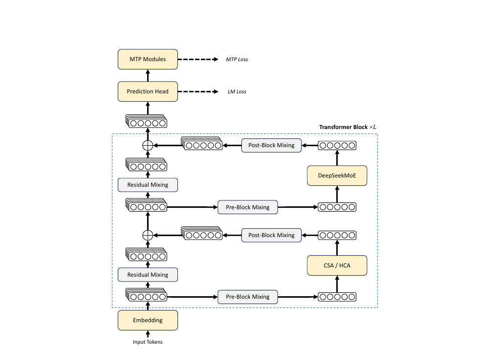{#fig-architecture-overall width=100%}

**Mixture-of-Experts（MoE）**

与此前的 DeepSeek 系列模型 [DeepSeek-AI, 2024; DeepSeek-AI, 2024] 一样，DeepSeek-V4 系列在 Feed-Forward Networks (FFNs) 中也采用了 DeepSeekMoE paradigm [Dai et al., 2024]，即同时设置 fine-grained routed experts 和 shared experts。
与 DeepSeek-V3 不同的是，我们将用于计算 affinity scores 的 activation function 从 `Sigmoid(·)` 改为 `Sqrt(Softplus(·))`。
为实现 load balancing，我们同样采用了 auxiliary-loss-free strategy [DeepSeek-AI, 2024; Wang et al., 2024a]，并额外加入了一个轻量的 sequence-wise balance loss，以防止单个 sequence 内部出现极端不平衡。
对于 DeepSeek-V4，我们去掉了 routing target nodes 数量上的约束，并仔细重构 parallelism strategy，以维持 training efficiency。
此外，相较 DeepSeek-V3，我们把前若干个 Transformer blocks 中的 dense FFN layers 替换为采用 Hash routing [Roller et al., 2021] 的 MoE layers。
Hash routing strategy 会依据输入 token ID 上的预定义 hash function，来决定每个 token 的 target experts。

**Multi-Token Prediction（MTP）**

与 DeepSeek-V3 一样，DeepSeek-V4 系列同样设置了 MTP modules 和 MTP objectives。
鉴于 MTP strategy 已经在 DeepSeek-V3 中得到验证，我们在 DeepSeek-V4 系列中直接沿用相同策略，不做修改。

## 流形约束超连接

如原文 Figure 2 所示，DeepSeek-V4 系列引入了 Manifold-Constrained Hyper-Connections (mHC) [Xie et al., 2026]，以增强相邻 Transformer blocks 之间的传统 residual connections。
相较 naive Hyper-Connections (HC) [Zhu et al., 2025]，mHC 的核心思想是把 residual mapping 约束到一个特定 manifold 上，从而在保留 model expressivity 的同时，增强跨层信号传播的稳定性。
这一小节会先简要介绍标准 HC，然后说明我们如何设计 mHC 来实现稳定训练。

**标准超连接**

标准 HC 会将 residual stream 的宽度按 $n_{hc}$ 倍扩展。
具体来说，residual stream 的形状会从 $R^d$ 扩展到 $R^{n_{hc} \times d}$，其中 $d$ 是实际 layer input 的 hidden size。
设第 $l$ 层之前的 residual state 为 $X_l = [x_{l,1}; \ldots; x_{l,n_{hc}}]^T \in R^{n_{hc} \times d}$。
HC 会引入三组 linear mappings：input mapping $A_l \in R^{1 \times n_{hc}}$、residual transformation $B_l \in R^{n_{hc} \times n_{hc}}$，以及 output mapping $C_l \in R^{n_{hc} \times 1}$。
于是 residual state 的更新可写为：

$$
X_{l+1} = B_l X_l + C_l F_l(A_l X_l).
$$

其中 $F_l$ 表示第 $l$ 层，例如一个 MoE layer，它的输入和输出形状都为 $R^d$。
需要注意的是，实际 layer input $A_l X_l \in R^d$ 依然是 $d$ 维，因此 residual width 的扩展并不会影响内部 layers 的设计。
HC 将 residual width 与实际 hidden size 解耦，提供了一条额外的 scaling axis，而且计算开销很小，因为 $n_{hc}$ 通常远小于 hidden size $d$。
不过，尽管 HC 在提升模型表现方面表现出潜力，我们发现当多个 layers 堆叠时，训练过程会频繁出现 numerical instability，这阻碍了 HC 的进一步 scaling。

**流形约束残差映射**

mHC 的核心创新在于把 residual mapping matrix $B_l$ 约束到 doubly stochastic matrices 的 manifold，也就是 Birkhoff polytope $M$ 上，从而增强跨层信号传播的稳定性：

$$
B_l \in M \coloneqq \left\{ M \in \mathbb{R}^{n \times n} \mid M \mathbf{1}_n = \mathbf{1}_n,\ \mathbf{1}_n^T M = \mathbf{1}_n^T,\ M \ge 0 \right\}.
$$

这一约束保证 mapping matrix 的 spectral norm $\lVert B_l \rVert_2$ 被 1 所界定，因此 residual transformation 是 non-expansive 的，从而同时提高 forward pass 和 backpropagation 过程中的 numerical stability。
此外，集合 $M$ 对乘法封闭，这保证了在深层 mHC stack 场景下的稳定性。
除此之外，input transformation $A_l$ 和 output transformation $C_l$ 也通过 $Sigmoid$ function 被约束为 non-negative 且有界，以避免 signal cancellation 的风险。

**动态参数化**

这三组 linear mappings 的参数都是动态生成的。
它们会被分解为 dynamic（input-dependent）component 与 static（input-independent）component。
给定输入 $X_l \in R^{n_{hc} \times d}$，我们首先将其展平并归一化为 $\hat{X}_l = \mathrm{RMSNorm}(\mathrm{vec}(X_l)) \in R^{1 \times n_{hc} d}$。
然后，我们沿用传统 HC 的思路，生成未加约束的原始参数 $\tilde{A}_l \in R^{1 \times n_{hc}}$、$\tilde{B}_l \in R^{n_{hc} \times n_{hc}}$ 与 $\tilde{C}_l \in R^{n_{hc} \times 1}$：

$$
\tilde{A}_l = \alpha_l^{\mathrm{pre}} \cdot (\hat{X}_l W_l^{\mathrm{pre}}) + S_l^{\mathrm{pre}},
$$

$$
\tilde{B}_l = \alpha_l^{\mathrm{res}} \cdot \mathrm{Mat}(\hat{X}_l W_l^{\mathrm{res}}) + S_l^{\mathrm{res}},
$$

$$
\tilde{C}_l = \alpha_l^{\mathrm{post}} \cdot (\hat{X}_l W_l^{\mathrm{post}})^T + S_l^{\mathrm{post}}.
$$

其中，$W_l^{\mathrm{pre}}, W_l^{\mathrm{post}} \in R^{n_{hc} d \times n_{hc}}$，$W_l^{\mathrm{res}} \in R^{n_{hc} d \times n_{hc}^2}$，它们都是用于生成 dynamic components 的 learnable parameters。
$Mat(\cdot)$ 会把一个大小为 $1 \times n_{hc}^2$ 的向量 reshape 成 $n_{hc} \times n_{hc}$ 的矩阵。
$S_l^{\mathrm{pre}} \in R^{1 \times n_{hc}}$、$S_l^{\mathrm{post}} \in R^{n_{hc} \times 1}$、$S_l^{\mathrm{res}} \in R^{n_{hc} \times n_{hc}}$ 是 learnable static biases。
$\alpha_l^{\mathrm{pre}}, \alpha_l^{\mathrm{res}}, \alpha_l^{\mathrm{post}} \in \mathbb{R}$ 则是初始化为较小数值的 learnable gating factors。

**施加参数约束**

在得到未加约束的原始参数 $\tilde{A}_l$、$\tilde{B}_l$、$\tilde{C}_l$ 之后，我们会对它们施加前面描述的约束，以提高 numerical stability。
对于 input mapping 和 output mapping，我们使用 $Sigmoid$ function $\sigma(\cdot)$ 来保证它们 non-negative 且有界：

$$
A_l = \sigma(\tilde{A}_l),
$$

$$
C_l = 2\sigma(\tilde{C}_l).
$$

至于 residual mapping $\tilde{B}_l$，我们会把它投影到 doubly stochastic matrices 的 manifold $M$ 上。
这一过程通过 Sinkhorn-Knopp algorithm 完成。
具体来说，算法先对 $\tilde{B}_l$ 施加 exponential function 以保证其为正，得到 $M^{(0)} = \exp(\tilde{B}_l)$，然后反复执行 column normalization 和 row normalization：

$$
M^{(t)} = T_r\bigl(T_c(M^{(t-1)})\bigr).
$$

其中 $T_r$ 和 $T_c$ 分别表示 row normalization 与 column normalization。
这一迭代会收敛到满足约束的 doubly stochastic matrix $B_l = M^{(t_{\max})}$。
我们将 $t_{\max} = 20$ 作为一个实用取值。

## 带 CSA 与 HCA 的混合注意力

当 context length 达到极端尺度时，attention mechanism 就会成为模型中的主要计算瓶颈。
为此，DeepSeek-V4 设计了两种高效 attention architectures，也就是 Compressed Sparse Attention (CSA) 与 Heavily Compressed Attention (HCA)，并将它们以交错方式组成 hybrid configuration，从而大幅降低 long-text scenarios 中 attention 的计算成本。
CSA 同时结合 compression 与 sparse attention 两种策略。
它首先把每 $m$ 个 tokens 的 Key-Value (KV) cache 压缩成一个 entry，然后应用 DeepSeek Sparse Attention (DSA) [DeepSeek-AI, 2025]，使每个 query token 只需关注 $k$ 个 compressed KV entries。
HCA 则追求更极致的压缩。
它会把每 $m'$（且 $m' \gg m$）个 tokens 的 KV cache 合并为一个 entry。
CSA 与 HCA 构成的 hybrid architecture 显著提升了 DeepSeek-V4 系列的 long-context efficiency，使 one-million-token context 在实践中真正可行。
这一小节会介绍这种 hybrid attention architecture 的核心技术；与此同时，作者也提供了 open-source implementation，用来更明确地说明实现细节：`https://huggingface.co/deepseek-ai/DeepSeek-V4-Pro/tree/main/inference`。

### 压缩稀疏注意力

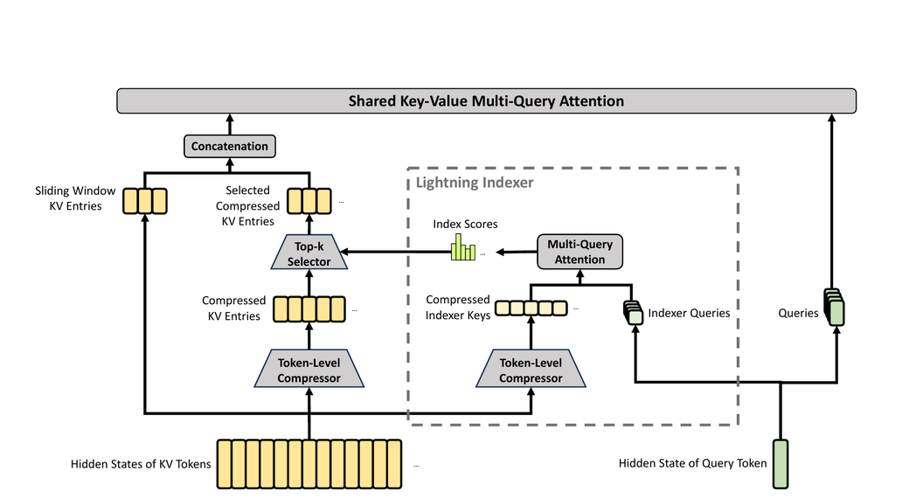{#fig-csa width=100%}

原文 Figure 3 展示了 CSA 的核心结构。
它先把每 $m$ 个 tokens 的 KV cache 压缩成一个 entry，然后再应用 DeepSeek Sparse Attention 做进一步加速。

**压缩 Key-Value 条目**

设 $H \in R^{n \times d}$ 为输入 hidden states 序列，其中 $n$ 是 sequence length，$d$ 是 hidden size。
CSA 首先计算两组 KV entries $C^a, C^b \in R^{n \times c}$，以及它们对应的 compression weights $Z^a, Z^b \in R^{n \times c}$，其中 $c$ 是 head dimension：

$$
C^a = H \cdot W^{aKV},\quad C^b = H \cdot W^{bKV},
$$

$$
Z^a = H \cdot W^{aZ},\quad Z^b = H \cdot W^{bZ}.
$$

其中 $W^{aKV}, W^{bKV}, W^{aZ}, W^{bZ} \in R^{d \times c}$ 都是 trainable parameters。
接下来，$C^a$ 与 $C^b$ 中每 $m$ 个 KV entries，都会依据它们各自的 compression weights 和 learnable positional biases $B_a, B_b \in R^{m \times c}$ 被压缩成一个 entry，得到 $C^{\mathrm{Comp}} \in R^{n/m \times c}$。
其中每个 compressed entry $C_i^{\mathrm{Comp}} \in R^c$ 的计算方式为：

$$
[S^a_{mi:m(i+1)-1};\ S^b_{m(i-1):mi-1}] =
\mathrm{Softmax}_{\mathrm{row}}\bigl([Z^a_{mi:m(i+1)-1}+B_a;\ Z^b_{m(i-1):mi-1}+B_b]\bigr),
$$

$$
C_i^{\mathrm{Comp}} =
\sum_{j=mi}^{m(i+1)-1} S_j^a \odot C_j^a +
\sum_{j=m(i-1)}^{mi-1} S_j^b \odot C_j^b.
$$

其中 $\odot$ 表示 Hadamard product；$\mathrm{Softmax}_{\mathrm{row}}(\cdot)$ 表示沿 row dimension 做 softmax，也就是在来自 $Z^a$ 与 $Z^b$ 的总计 $2m$ 个元素上进行归一化。
当 $i = 0$ 时，$Z^b_{m(i-1):mi-1}$ 会用 negative infinity padding，$C^b_{m(i-1):mi-1}$ 会用零 padding。
需要注意的是，每个 $C_i^{\mathrm{Comp}}$ 实际由 $2m$ 个 KV entries 推导而来，但 $C_i^{\mathrm{Comp}}$ 所使用的 $C^b$ 下标，与 $C_{i-1}^{\mathrm{Comp}}$ 所使用的 $C^a$ 下标存在重叠。
因此，从本质上说，CSA 是把 sequence length 压缩到了原来的 $1/m$。

**用于稀疏选择的 Lightning Indexer**

在得到 compressed KV entries $C^{\mathrm{Comp}}$ 之后，CSA 会应用 DSA strategy，从中选择 top-k 个 compressed KV entries 参与 core attention。
首先，CSA 用与 $C^{\mathrm{Comp}}$ 相同的压缩操作得到 compressed indexer keys $K^{I\mathrm{Comp}} \in R^{n/m \times c_I}$，其中 $c_I$ 是 indexer head dimension。
然后，对于 query token $t$，我们以低秩方式生成 indexer queries $\{q_{t,1}^I, q_{t,2}^I, \ldots, q_{t,n_h^I}^I\}$：

$$
c_t^Q = h_t \cdot W^{DQ},
$$

$$
[q_{t,1}^I;\ q_{t,2}^I;\ \ldots;\ q_{t,n_h^I}^I] = q_t^I = c_t^Q \cdot W^{IUQ}.
$$

其中 $h_t \in R^d$ 是 query token $t$ 的输入 hidden state，$c_t^Q \in R^{d_c}$ 是 query 的 compressed latent vector，$d_c$ 是 query compression dimension，$n_h^I$ 是 indexer query heads 的数量。
$W^{DQ} \in R^{d \times d_c}$ 与 $W^{IUQ} \in R^{d_c \times c_I n_h^I}$ 分别是 indexer queries 的 down-projection matrix 与 up-projection matrix。
接下来，query token $t$ 与一个先前的 compressed block $s$（满足 $s < \lfloor t/m \rfloor$）之间的 index score $I_{t,s} \in R$ 计算如下：

$$
[w_{t,1}^I;\ w_{t,2}^I;\ \ldots;\ w_{t,n_h^I}^I] = w_t^I = h_t \cdot W^{wI},
$$

$$
I_{t,s} =
\sum_{h=1}^{n_h^I}
w_{t,h}^I \cdot \mathrm{ReLU}\bigl(q_{t,h}^I \cdot K_s^{I\mathrm{Comp}}\bigr).
$$

其中 $W^{wI} \in R^{d \times n_h^I}$ 是 learnable matrix，$w_{t,h}^I \in R$ 是第 $h$ 个 indexer head 的权重。
给定 query token $t$ 的 index scores $I_{t,:}$ 后，我们用 top-k selector 只保留一部分 compressed KV entries，以供之后的 core attention 使用：

$$
C_t^{\mathrm{SprsComp}} =
\left\{ C_s^{\mathrm{Comp}} \mid I_{t,s} \in \mathrm{Top}\text{-}k(I_{t,:}) \right\}.
$$

**共享 Key-Value MQA**

在选出 sparse KV entries 之后，CSA 会以 Multi-Query Attention (MQA) [Shazeer, 2019] 的方式执行 core attention，其中 $C_t^{\mathrm{SprsComp}}$ 中的每个 compressed KV entry 会同时充当 attention key 和 attention value。
更具体地说，对于 query token $t$，我们首先从 compressed latent vector $c_t^Q$ 生成 attention queries $\{q_{t,1}, q_{t,2}, \ldots, q_{t,n_h}\}$：

$$
[q_{t,1};\ q_{t,2};\ \ldots;\ q_{t,n_h}] = q_t = c_t^Q \cdot W^{UQ},
$$

其中 $n_h$ 是 query heads 的数量，$W^{UQ} \in R^{d_c \times c n_h}$ 是 queries 的 up-projection matrix。
需要注意的是，这里的 latent query vector $c_t^Q$ 与前面 indexer queries 使用的是同一个。
接下来，我们在 $\{q_{t,i}\}$ 和 $C_t^{\mathrm{SprsComp}}$ 上执行 MQA：

$$
o_{t,i} =
\mathrm{CoreAttn}\bigl(
\mathrm{query}=q_{t,i},
\mathrm{key}=C_t^{\mathrm{SprsComp}},
\mathrm{value}=C_t^{\mathrm{SprsComp}}
\bigr),
$$

其中 $o_{t,i} \in R^c$ 是第 $i$ 个 head 在 token $t$ 上的 core attention output，$\mathrm{CoreAttn}(\cdot)$ 表示 core attention operation。

**分组输出投影**

在 DeepSeek-V4 的配置中，$c n_h$ 的规模相当大。
因此，如果把 core attention 的输出 $[o_{t,1}; o_{t,2}; \ldots; o_{t,n_h}] = o_t \in R^{c n_h}$ 直接投影回 $d$ 维 hidden state，就会带来相当可观的计算负担。
为降低这一开销，我们设计了 grouped output projection strategy。
具体来说，我们先把 $n_h$ 个 outputs 切成 $g$ 个 groups。
然后，对于每个 group 的输出 $o_{t,i}^G \in R^{c n_h / g}$，我们将其投影为 $d_g$ 维 intermediate output $o_{t,i}^{G\prime} \in R^{d_g}$，其中 $d_g < c n_h / g$。
最后，再把 intermediate outputs $[o_{t,1}^{G\prime}; o_{t,2}^{G\prime}; \ldots; o_{t,g}^{G\prime}] \in R^{d_g g}$ 投影为最终 attention output $\hat{o}_t \in R^d$。

### 高压缩注意力

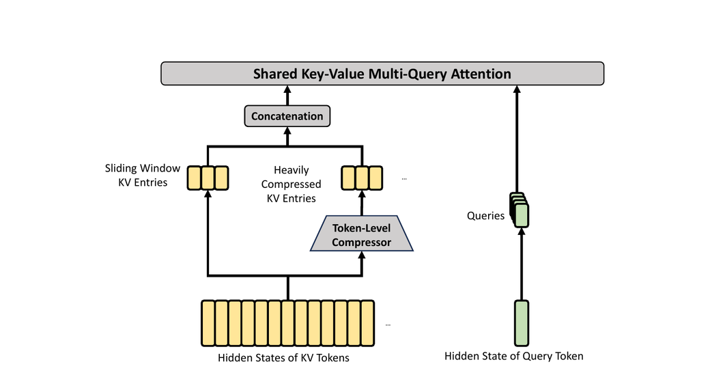{#fig-hca width=100%}

原文 Figure 4 展示了 HCA 的核心结构。
它以更重的方式压缩 KV cache，但不使用 sparse attention。

**压缩 Key-Value 条目**

总体上，HCA 的 compression strategy 与 CSA 相似，但它采用更大的 compression rate $m'$（并且 $m' \gg m$），同时不使用 overlapping compression。
设 $H \in R^{n \times d}$ 为输入 hidden states 序列。
HCA 首先计算原始 KV entries $C \in R^{n \times c}$ 及其对应的 compression weights $Z \in R^{n \times c}$：

$$
C = H \cdot W^{KV},
$$

$$
Z = H \cdot W^Z.
$$

其中 $W^{KV}, W^Z \in R^{d \times c}$ 是 trainable parameters。
接着，$C$ 中每 $m'$ 个 KV entries 会依据 compression weights 和 learnable positional biases $B \in R^{m' \times c}$ 被压缩成一个 entry，得到 $C^{\mathrm{Comp}} \in R^{n/m' \times c}$。
其中每个 compressed entry $C_i^{\mathrm{Comp}} \in R^c$ 的计算方式为：

$$
S_{m'i:m'(i+1)-1} = \mathrm{Softmax}_{\mathrm{row}}(Z_{m'i:m'(i+1)-1} + B),
$$

$$
C_i^{\mathrm{Comp}} = \sum_{j=m'i}^{m'(i+1)-1} S_j \odot C_j.
$$

通过这一压缩操作，HCA 会把 sequence length 压缩到原来的 $1/m'$。

**共享 Key-Value MQA 与分组输出投影**

和 CSA 一样，HCA 也采用 shared-KV MQA 与 grouped output projection。
在 KV compression 之后，对于 query token $t$，HCA 会以低秩方式生成 attention queries $\{q_{t,1}, q_{t,2}, \ldots, q_{t,n_h}\}$：

$$
c_t^Q = h_t \cdot W^{DQ},
$$

$$
[q_{t,1};\ q_{t,2};\ \ldots;\ q_{t,n_h}] = q_t = c_t^Q \cdot W^{UQ}.
$$

其中 $h_t \in R^d$ 是 query token $t$ 的输入 hidden state，$n_h$ 是 query heads 的数量，$W^{DQ} \in R^{d \times d_c}$ 与 $W^{UQ} \in R^{d_c \times c n_h}$ 分别是 queries 的 down-projection 与 up-projection matrices。
随后，我们在 $\{q_{t,i}\}$ 与 $C^{\mathrm{Comp}}$ 上执行 MQA：

$$
o_{t,i} =
\mathrm{CoreAttn}\bigl(
\mathrm{query}=q_{t,i},
\mathrm{key}=C^{\mathrm{Comp}},
\mathrm{value}=C^{\mathrm{Comp}}
\bigr).
$$

其中 $o_{t,i} \in R^c$ 是 token $t$ 上第 $i$ 个 head 的 core attention output。
之后，和 CSA 一样，HCA 会把 $n_h$ 个 outputs 分成 $g$ 个 groups。
对于每个 group 的输出 $o_{t,i}^G \in R^{c n_h / g}$，HCA 会将其投影为 $d_g$ 维 intermediate output $o_{t,i}^{G\prime} \in R^{d_g}$，其中 $d_g < c n_h / g$。
最后，HCA 会把 intermediate outputs $[o_{t,1}^{G\prime}; o_{t,2}^{G\prime}; \ldots; o_{t,g}^{G\prime}] \in R^{d_g g}$ 再投影为最终 attention output $\hat{o}_t \in R^d$。

### 其他细节

除了前面介绍的 CSA 与 HCA 核心结构之外，我们的 hybrid attention 还引入了若干其他技术。
为了让主体叙述更清晰，作者在前面的介绍中省略了这些额外技术，并在这里单独简要说明。
这一小节只聚焦于它们的核心思想，因此会省略某些细小实现细节；更完整而无歧义的内容仍建议参考其 open-source implementation。

**Query 与 Key-Value 条目归一化**

对于 CSA 和 HCA，我们都会在 core attention operation 之前，对每个 head 的 queries 和唯一一组 compressed KV entries 额外执行一次 RMSNorm。
这种 normalization 可以避免 attention logits 爆炸，并有助于提高 training stability。

**Partial Rotary Positional Embedding（部分旋转位置编码）**

对于 CSA 和 HCA，我们都只部分使用 Rotary Positional Embedding (RoPE) [Su et al., 2024]，并将其作用于 attention queries、KV entries 以及 core attention outputs。
更具体地说，对于 CSA 和 HCA 中使用的每个 query vector 与 KV entry vector，我们只在其最后 64 个维度上应用 RoPE。
由于这些 KV entries 同时充当 attention keys 和 values，直接计算得到的 core attention outputs $\{o_{t,i}\}$ 会携带来自 KV entries 的 absolute position embeddings。
为解决这一问题，我们也会在每个 $o_{t,i}$ 的最后 64 个维度上，以位置 $-i$ 再应用一次 RoPE。
这样一来，core attention 的输出就会携带 relative position embeddings，也就是说，每个 KV entry 对 core attention outputs 的贡献，将与 query 和该 KV entry 之间的距离相关。

**额外的 Sliding Window Attention（SWA）分支**

为了在 CSA 与 HCA 中严格保持 causality，每个 query 只能访问先前的 compressed KV blocks。
这意味着，一个 query 无法获取与其处于同一个 compressed block 内其他 tokens 的信息。
与此同时，在 language modeling 中，离 query token 更近的 recent tokens 往往更相关。
基于这两个原因，我们在 CSA 与 HCA 中都引入了一条 supplementary attention branch，并让它以 sliding window 的方式工作，以更好地建模 local dependencies。
具体来说，对于每个 query token，我们会额外生成与最近 $n_{\mathrm{win}}$ 个 tokens 对应的 $n_{\mathrm{win}}$ 组 uncompressed KV entries。
在 CSA 与 HCA 的 core attention 中，这些 sliding window 内的 KV entries 会和 compressed KV entries 一起参与计算。

**Attention Sink（注意力汇点）**

在 CSA 和 HCA 的 core attention 中，我们使用了 attention sink 技巧 [OpenAI, 2025; Xiao et al., 2024]。
更具体地说，我们设置了一组 learnable sink logits $\{z'_1, z'_2, \ldots, z'_{n_h}\}$。
对于第 $h$ 个 attention head，$\mathrm{Exp}(z_h')$ 会被加入 attention score 分母：

$$
s_{h,i,j} =
\frac{\mathrm{Exp}(z_{h,i,j})}{\sum_k \mathrm{Exp}(z_{h,i,k}) + \mathrm{Exp}(z_h')}.
$$

其中 $s_{h,i,j}, z_{h,i,j} \in R$ 分别表示第 $h$ 个 attention head 在第 $i$ 个 query token 与第 $j$ 个先前 token 或 compressed block 之间的 attention score 与 attention logit。
这一技巧使每个 query head 的总 attention scores 不必严格等于 1，甚至可以接近 0。

### 效率讨论

由于 hybrid CSA 与 HCA，再加上 computation 与 storage 的低精度设计，DeepSeek-V4 系列的 attention module 在 attention FLOPs 与 KV cache size 两个方面都获得了显著效率优势，尤其是在长上下文场景下更是如此。
第一，我们为 KV entries 采用 mixed storage format：rotary positional embedding (RoPE) 相关维度使用 BF16 precision，其余维度使用 FP8 precision。
这种 hybrid representation 相比纯 BF16 storage，可以将 KV cache size 几乎减半。
第二，lightning indexer 内部的 attention computation 使用 FP4 precision，这会在 ultra-long contexts 下进一步加速 attention operation。
第三，相比 DeepSeek-V3.2，DeepSeek-V4 系列选用了更小的 attention top-k，因此在 short- 与 medium-length texts 上也提升了 model efficiency。
最后也是最关键的一点，compressed attention 与 hybrid attention 技术本身显著降低了 KV cache size 和 computational FLOPs。

如果以使用 head dimension 为 128 的 BF16 GQA8 [Ainslie et al., 2023] 作为 baseline，也就是一种 LLM attention 中较常见的配置，那么在 1M-context 设定下，DeepSeek-V4 系列的 KV cache size 可以被压缩到该 baseline 的大约 2%。
此外，即便与已经相当高效的 DeepSeek-V3.2 [DeepSeek-AI, 2025] 相比，DeepSeek-V4 系列依然展现出显著的效率优势。
原文 Figure 1 的右侧给出了两者在 inference FLOPs 与 KV cache size 上的对比。

## Muon 优化器

我们在 DeepSeek-V4 系列的大多数 modules 中使用 Muon [Jordan et al., 2024; Liu et al., 2025] optimizer，因为它能带来更快的 convergence 和更强的 training stability。
原文用 Algorithm 1 总结了其 Muon optimization 的完整算法。

**基本配置**

我们仍然对 embedding module、prediction head module、mHC modules 中的 static biases 与 gating factors，以及所有 RMSNorm modules 的权重使用 AdamW [Loshchilov and Hutter, 2017] optimizer。
其余 modules 则统一使用 Muon 更新。
遵循 Liu et al. (2025)，我们同样会对 Muon parameters 使用 weight decay，使用 Nesterov [Jordan et al., 2024; Nesterov, 1983] trick，并对 update matrix 的 Root Mean Square (RMS) 做 rescaling，以复用现有的 AdamW hyper-parameters。
与他们不同的是，我们用 hybrid Newton-Schulz iterations 来完成 orthogonalization。

**混合 Newton-Schulz 迭代**

对于任意矩阵 $M$，设其 Singular Value Decomposition (SVD) 为 $M = U \Sigma V^T$。
Newton-Schulz iterations 的目标，是把 $M$ 近似正交化为 $UV^T$。
通常，我们会先将 $M$ 归一化为 $M_0 = M/\lVert M \rVert_F$，以保证其最大 singular value 不超过 1。
随后，每一步 Newton-Schulz iteration 执行如下操作：

$$
M_k =
a M_{k-1}
+ b (M_{k-1} M_{k-1}^T) M_{k-1}
+ c (M_{k-1} M_{k-1}^T)^2 M_{k-1}.
$$

我们的 hybrid Newton-Schulz 共执行 10 次 iterations，并分为两个阶段。
前 8 步使用系数 $(a,b,c) = (3.4445, -4.7750, 2.0315)$，以快速收敛，让 singular values 靠近 1。
最后 2 步则切换为 $(a,b,c) = (2, -1.5, 0.5)$，以把 singular values 更稳定地收束在 1 上。

**避免 attention logits 爆炸**

DeepSeek-V4 系列的 attention architecture 允许我们直接在 attention queries 与 KV entries 上施加 RMSNorm，这能够有效阻止 attention logits 爆炸。
因此，我们没有在 Muon optimizer 中采用 QK-Clip technique [Liu et al., 2025]。

# 通用基础设施 {#sec-infrastructures}

## Expert Parallelism 中的细粒度通信-计算重叠

Mixture-of-Experts (MoE) 可以通过 Expert Parallelism (EP) 来加速。
但与此同时，EP 也要求复杂的 inter-node communication，并对 interconnect bandwidth 与 latency 提出很高要求。
为缓解 EP 中的 communication bottleneck，并在更低 interconnection bandwidth 需求下实现更高的 end-to-end performance，我们提出了一种细粒度 EP 方案，把 communication 与 computation 融合进一个单一的 pipelined kernel 中，以实现 communication-computation overlap。

**通信延迟可以被隐藏**

我们这个 EP 方案的核心洞见，是 communication latency 在 MoE layers 中可以被有效隐藏到 computation 之下。
如原文 Figure 5 所示，在 DeepSeek-V4 系列中，每个 MoE layer 主要可以分解为四个阶段：两个 communication-bound stages，也就是 Dispatch 与 Combine；以及两个 computation-bound stages，也就是 Linear-1 与 Linear-2。
profiling 结果表明，在单个 MoE layer 内部，communication 的总时长小于 computation 的总时长。
因此，在把 communication 与 computation 融合为统一 pipeline 之后，系统的主要瓶颈依然是 computation，这意味着即便 interconnect bandwidth 更低，系统也可以在不降低 end-to-end performance 的情况下正常运行。

![我们的 EP 方案与相关工作对比示意。Comet [Zhang et al., 2025b] 分别将 Dispatch 与 Linear-1 重叠、将 Linear-2 与 Combine 重叠；而我们的 EP 方案通过把 experts 切分成 waves 并进行调度，实现了更细粒度的 overlap。图中的 theoretical speedup 是在 DeepSeek-V4-Flash architecture 配置下评估得到的。](../assets/deepseek-v4-towards-highly-efficient-million-token-context-intelligence/figure-05.png){#fig-ep width=100%}

**细粒度 EP 方案**

为了进一步降低 interconnect bandwidth requirement，并放大 overlap 带来的收益，我们引入了更细粒度的 expert partitioning scheme。
受多项相关工作 [Aimuyo et al., 2025; Zhang et al., 2025b] 启发，我们把 experts 切分成多个 waves 并进行调度。
每个 wave 只包含一小部分 experts。
只要某个 wave 中的全部 experts 完成了 communication，computation 就可以立刻开始，而不必等待其他 experts。
在 steady state 下，当前 wave 的 computation、下一 wave 的 token transfer，以及已完成 experts 的 result sending 会同时并发执行，如原文 Figure 5 所示。
这就在 experts 之间形成了一条细粒度 pipeline，使 computation 与 communication 在整个 wave 过程中都保持连续。
这种基于 wave 的调度方式，对 Reinforcement Learning (RL) rollout 这类常出现 long-tail small batches 的极端场景尤其有帮助。

**性能与开源 Mega-Kernel 对比**

我们在 NVIDIA GPUs 与 HUAWEI Ascend NPUs 两个平台上验证了这套 fine-grained EP scheme。
相较强大的 non-fused baselines，它在一般 inference workloads 上获得了 $1.50 \sim 1.73\times$ 的 speedup，而在 RL rollouts 和高速 agent serving 这类 latency-sensitive scenarios 上，speedup 可达 $1.96\times$。
我们已经把基于 CUDA 的 mega-kernel implementation 以 MegaMoE 的名字开源出来，作为 DeepGEMM 的一个组件。

**观察与方案**

- Computation-Communication Ratio：full communication-computation overlap 取决于 computation-communication ratio，而不仅仅是带宽本身。
- Computation-Communication Ratio：若记 peak compute throughput 为 $C$，interconnect bandwidth 为 $B$，则只有当 $C/B \le V_{\mathrm{comp}}/V_{\mathrm{comm}}$ 时，communication 才能被完全隐藏，其中 $V_{\mathrm{comp}}$ 是 computation volume，$V_{\mathrm{comm}}$ 是 communication volume。
- Computation-Communication Ratio：对于 DeepSeek-V4-Pro，每个 token-expert pair 需要 $6hd$ FLOPs（SwiGLU 的 gate、up 和 down projections），但只需要 $3h$ bytes 的 communication（FP8 Dispatch + BF16 Combine），于是条件可化为 $C/B \le 2d = 6144$ FLOPs/Byte。
- Computation-Communication Ratio：也就是说，每 1 GBps 的 interconnect bandwidth 就足以隐藏 $6.1$ TFLOP/s 的 compute；一旦 bandwidth 达到这个阈值，它就不再是瓶颈，继续为 bandwidth 投入更多硅面积将带来递减收益。
- Power Budget：极端 kernel fusion 会同时把 compute、memory 和 network 都推到高负载，因此 power throttling 会成为关键 performance limiter。
- Power Budget：作者建议未来硬件在面对这类 fully concurrent workloads 时，提供足够的 power headroom。
- Communication Primitives：这里采用的是 pull-based approach，也就是每张 GPU 主动从 remote GPUs 读取数据，以避免 fine-grained push 所带来的高 notification latency。
- Communication Primitives：如果未来硬件能提供更低延迟的 cross-GPU signaling，那么 push 也会变得可行，并支持更自然的 communication patterns。
- Activation Function：作者建议把 SwiGLU 换成一种不包含 exponential 或 division operations 的低成本 element-wise activation。
- Activation Function：这样既能直接减轻 post-GEMM processing，也能在相同 parameter budget 下，通过移除 gate projection 来扩大 intermediate dimension $d$，从而进一步放宽 bandwidth requirement。

## 用 TileLang 实现灵活且高效的 kernel 开发

在实际工程中，如此复杂的 model architecture 原本会产生数百个细粒度的 Torch ATen operators。
我们采用 TileLang [Wang et al., 2026] 来开发一整套 fused kernels，以替代其中绝大多数 operators，从而以很小的工程代价获得接近最优的性能。
它也使我们能够在 validation 阶段快速 prototype 各类 operators，例如不同的 attention variants。
这些 kernels 在 model architecture 开发、大规模训练以及最终 inference services 的 production deployment 中都扮演着关键角色。
作为一种 Domain-Specific Language (DSL)，TileLang 在 development productivity 与 runtime efficiency 之间取得了平衡，既支持快速开发，也支持在同一套 codebase 上进行深度、迭代式优化。
此外，我们也与 TileLang community 保持紧密协作，以推动更敏捷、更高效、更稳定的 kernel development workflow。

**用 Host Codegen 降低调用开销**

随着 accelerator 性能不断增强，CPU 侧 orchestration overhead 正变得越来越突出。
对于那些小而高度优化的 kernels，这种固定的 host overhead 很容易成为 utilization 与 throughput 的上限。
这种开销的一个常见来源，是 host-side logic 通常为了灵活性而用 Python 编写，因此每次调用都会引入固定成本。
为降低这部分开销，我们使用 Host Codegen，把大多数 host-side logic 移入自动生成的 host code。
具体来说，我们首先在 IR (Intermediate Representation) level 同时生成 device kernel 和一个轻量 host launcher，并把从 language frontend 解析出的必要 metadata 一并嵌入进去，例如 data types、rank/shape constraints 与 stride/layout assumptions。
随后，这个 launcher 会被 lower 成基于 TVM-FFI [Chen et al., 2018] framework 的 host source code。
TVM-FFI 紧凑的 calling convention 与 zero-copy tensor interop 能共同将 host-side overhead 压到最低。
在运行时，自动生成的 host code 会负责 validation 与 argument marshaling，从而把原本每次调用都要经过的检查逻辑搬离 Python execution path。
测量结果表明，CPU 侧 validation overhead 从原来的数十到数百微秒，下降到了每次调用不到一微秒。

**借助 SMT Solver 的形式化整数分析**

TileLang kernels 涉及复杂的 tensor index arithmetic，因此需要很强的 formal integer analysis 能力。
在 layout inference、memory hazard detection 与 bound analysis 等 compilation passes 中，compiler 必须验证整数表达式是否满足特定性质，才能启用对应优化。
因此，更强的 formal analysis 能力可以直接打开更高级、更复杂的优化机会。
为此，我们把 Z3 SMT solver [De Moura and Bjørner, 2008] 集成进了 TileLang 的 algebraic system，使其能为大多数 tensor programs 中的整数表达式提供 formal analysis。
我们通过把 TileLang 的整数表达式翻译为 Z3 的 quantifier-free non-linear integer arithmetic (QF_NIA)，在 computational overhead 和 formal expressiveness 之间取得平衡。
对于 kernels 中常见的标准线性整数表达式，QF_NIA 可以基于 Integer Linear Programming (ILP) solvers 自然求解。
与此同时，它的 non-linear reasoning 能力也能处理更高级的问题，例如变长 tensor shapes 下的 vectorization。
在合理的资源限制下，Z3 能显著提升整体优化能力，同时把 compilation time overhead 控制在数秒量级。
这种提升会体现在多个 passes 中，包括 vectorization、barrier insertion 与 code simplification。

**数值精度与按位可复现性**

在 production settings 中，numerical correctness 与 reproducibility 和原始吞吐一样重要。
因此，我们默认优先保证 accuracy：在 compiler level 禁用 fast-math optimizations，而会影响 precision 的近似操作，只能通过显式 opt-in 的 frontend operators 调用，例如 `T.__exp`、`T.__log` 和 `T.__sin`。
反过来，在需要严格 IEEE-754 semantics 时，TileLang 也提供带显式 rounding modes 的 IEEE-compliant intrinsics，例如 `T.ieee_fsqrt`、`T.ieee_fdiv` 与 `T.ieee_add`，使开发者可以精确指定数值行为。
与此同时，我们也把 bitwise reproducibility 作为和手写 CUDA baselines 对齐时的目标。
我们让 TileLang 的 algebraic simplification 与 lowering rules 对齐主流 CUDA toolchains，例如 NVCC，以避免那些会引入意外 bit-level differences 的变换。
layout annotations，例如 `T.annotate_layout`，还允许用户固定 layout-dependent 的 lowering decisions，使 evaluation 与 accumulation order 能与 reference CUDA implementation 保持一致，并在需要时得到 bit-identical outputs。
评测结果表明，这些面向 accuracy 与 reproducibility 的设计并没有牺牲性能：在保守默认设置下，TileLang kernels 依然具备竞争力；同时它也暴露了可选 knobs，用于在有需要时放宽数值约束，以换取更高速度。

## 高性能、batch-invariant 且 deterministic 的 kernel 库

为了支持高效 training 与 inference，我们开发了一整套高性能计算 kernels。
除基本功能与最大化 hardware utilization 之外，另一个关键设计目标是保证 pre-training、post-training 与 inference pipelines 之间的训练可复现性以及 bitwise 对齐。
因此，我们实现了一套 end-to-end、bitwise、batch-invariant 且 deterministic 的 kernels，并把额外性能开销压到很低。
这些 kernels 对 debugging、stability analysis 和 post-training 行为一致性都很有帮助。

**批次不变性**

batch invariance 的含义是：任意一个 token 的输出，无论它出现在 batch 中什么位置，都应当保持 bitwise identical。
为实现 batch invariance，主要有三类挑战：

- Attention：为了实现 batch invariance，我们不能使用 split-KV method [Dao et al., 2023]，因为它会把单个 sequence 的 attention computation 切分到多个 Stream Multiprocessors (SMs) 上，以平衡 SM 负载。
- Attention：一旦放弃这项技术，就会面临严重的 wave-quantization problem，这会伤害 GPU utilization。
- Attention：为此，我们为 batch-invariant decoding 设计了双 kernel 策略。
- Attention：第一个 kernel 在单个 SM 内完成一整个 sequence 的 attention output 计算，以确保在 fully occupied waves 中获得高 throughput。
- Attention：第二个 kernel 则针对最后一个部分填充 wave 的 latency 优化，会为一个 sequence 使用多个 SM，以缓解 wave-quantization。
- Attention：为了让这两个 kernels 保持 bitwise identity，我们仔细设计了第二个 kernel 的计算路径，使其 accumulation order 与第一个 kernel 完全一致。
- Attention：此外，第二个 kernel 还利用 thread-block clusters 中的 distributed shared memory，实现跨 SM 的高速数据交换。
- Attention：这种 dual-kernel 方法让 batch-invariant decoding 的额外开销几乎可以忽略。
- Matrix Multiplication：传统 cuBLAS library [NVIDIA Corporation, 2024] 无法实现 batch invariance。
- Matrix Multiplication：因此，我们在整个栈中用 DeepGEMM [Zhao et al., 2025] 完全替换了它。
- Matrix Multiplication：更进一步地，在极小 batch size 下，传统实现通常会使用 split-k [Osama et al., 2023] 提升性能，但 split-k 无法保证 batch invariance。
- Matrix Multiplication：因此，我们在大多数场景里放弃 split-k；为补偿这一点，我们引入了一系列优化，使得我们的 matrix multiplication 实现，在主要场景下可以匹配甚至超过标准 split-k 的性能。

**确定性**

deterministic training 对定位 hardware 或 software 问题非常有帮助。
而且，当训练出现 loss spikes 等异常时，determinism 也能帮助研究者更容易定位数值原因，并进一步修正 model design。
training 中的 non-determinism 通常来自 non-deterministic accumulation order，而其根源往往是 atomic addition instructions。
这个问题主要出现在 backward pass，尤其是以下几类环节：

- Attention Backward：在传统 sparse attention backward 实现中，我们通常会使用 `atomicAdd` 来累计 KV tokens 的 gradients，这会因为 floating-point addition 的非结合性而引入 non-determinism。
- Attention Backward：为解决这一问题，我们为每个 SM 分配独立 accumulation buffers，然后在所有 buffers 上执行全局 deterministic summation。
- MoE Backward：当来自不同 ranks 的多个 SM 同时向 receiving rank 上的同一 buffer 写数据时，写位置协商也会引入 non-determinism。
- MoE Backward：为解决这个问题，我们在每个 rank 内部设计了 token order pre-processing 机制，同时在不同 ranks 之间隔离 buffers。
- MoE Backward：这能同时保证 expert parallelism 的 send results 和 MoE backward 中 accumulation order 的 determinism。
- Matrix Multiplication in mHC：mHC 涉及一个 output dimension 只有 24 的 matrix multiplication。
- Matrix Multiplication in mHC：在很小的 batch size 下，我们被迫使用 split-k [Osama et al., 2023] algorithm，而其 naive implementation 会带来 non-determinism。
- Matrix Multiplication in mHC：为解决这一问题，我们分别输出每个 split 部分，再在后续 kernel 中执行 deterministic reduction，从而兼顾性能与 determinism。

## FP4 量化感知训练

为了在 deployment 阶段获得 inference acceleration 和 memory savings，我们在 post-training 阶段引入了 Quantization-Aware Training (QAT) [Jacob et al., 2018]，使模型能够适应 quantization 带来的 precision degradation。
我们把 FP4 (MXFP4) quantization [Rouhani et al., 2023] 应用在两个组件上。
第一是 MoE expert weights，它们是 GPU memory occupancy 的主要来源之一 [OpenAI, 2025]。
第二是 CSA indexer 中的 Query-Key (QK) path，在这里 QK activations 会以 FP4 形式被缓存、加载并参与乘法运算，从而在长上下文场景中加速 attention score 计算。
除此之外，在这一 QAT 过程中，我们还把 index scores $I_{:,:}$ 从 FP32 量化到 BF16。
这一优化在保持 99.7% KV entry recall rate 的同时，让 top-k selector 获得了 $2\times$ speedup。

对于 MoE expert weights，我们沿用 QAT 的常见做法：optimizer 维护的 FP32 master weights 会先被量化到 FP4，然后再反量化回 FP8 参与计算。
值得注意的是，这里的 FP4-to-FP8 dequantization 是 lossless 的。
原因在于，FP8 (E4M3) 相比 FP4 (E2M1) 多了 2 个 exponent bits，因此具备更大的 dynamic range。
只要 FP4 sub-blocks（大小为 $1 \times 32$ tiles）在每个 FP8 quantization block（大小为 $128 \times 128$ tiles）中的最大 scale factor 与最小 scale factor 之比，不超过某个阈值，那么这些 fine-grained scale information 就能完全被 FP8 更大的 dynamic range 吸收。
我们的经验验证表明，当前 weights 满足这一条件。
这意味着整个 QAT pipeline 可以在完全不修改现有 FP8 training framework 的前提下，直接复用它。
在 backward pass 中，gradients 是相对于 forward pass 中相同的 FP8 weights 计算的，然后直接传播回 FP32 master weights，这等价于在 quantization operation 上应用 Straight-Through Estimator (STE)。
这一做法还避免了重新量化 transposed weights 的需求。

在 RL training 的 inference 和 rollout phases 中，由于不涉及 backward pass，我们会直接使用真实的 FP4 quantized weights，而不是 simulated quantization。
这样既能保证 sampling 时的 model behavior 与在线 deployment 完全一致，也能通过降低 kernel memory loading 带来真实 speedup，并显著降低 memory consumption。
CSA indexer 中的 QK path 也按相同思路处理。

## 训练框架

我们的训练框架建立在为 DeepSeek-V3 开发的 scalable 且高效的基础设施之上 [DeepSeek-AI, 2024]。
在训练 DeepSeek-V4 时，我们继承了这套稳健基础，同时引入了若干关键创新，以适配它的新型 architecture components，尤其是 Muon optimizer、mHC 与 hybrid attention mechanism，并在此基础上保持较高的 training efficiency 和稳定性。

### Muon 的高效实现

Muon optimizer 需要完整的 gradient matrix 来计算 parameter updates，因此它与 Zero Redundancy Optimizer (ZeRO) [Rajbhandari et al., 2020] 结合时会带来挑战。
传统 ZeRO 是为 AdamW 这类 element-wise optimizers 设计的，在那种设置下，一张 parameter matrix 可以被拆分到多个 ranks 上更新。
为解决这种冲突，我们为 Muon 设计了一种 hybrid ZeRO bucket assignment strategy。

对于 dense parameters，我们限制 ZeRO parallelism 的最大规模，并使用 knapsack algorithm 将不同 parameter matrices 分配到这些 ranks 上，从而让每个 rank 的负载尽可能均衡。
每个 rank 上的 bucket 都会被 padding 到所有 ranks 中最大 bucket 的大小，以便高效执行 reduce-scatter。
在我们的设置中，每个 rank 管理的 parameter matrices 不超过 5 个，因此这种 padding 带来的 memory overhead 通常低于 10%。
当 data parallelism 的总体规模超过 ZeRO 所允许的上限时，我们会在额外的数据并行 groups 上重复计算 Muon update，以用额外计算换取更低的 total bucket memory。

对于 MoE parameters，我们则对每个 expert 独立优化。
我们首先把所有 layers 中 SwiGLU [Shazeer, 2020] 的 down projection matrices 拉平成一个向量，然后依次拼接 up projection matrices 与 gate matrices 的 flattened 版本。
接着，我们对这个 flattened vector 做 padding，使其能够被均匀分配到所有 ranks 上，同时又不会切开任何逻辑上独立的 matrix。
由于 experts 数量很多，我们不会对 MoE parameters 设置 ZeRO parallelism 的上限，而且由此引入的 padding overhead 也可以忽略不计。

此外，在每个 rank 上，形状相同且相邻的 parameters 会被自动合并，从而能以 batched 的方式执行 Newton-Schulz iterations，以提升 hardware utilization。
我们还观察到，Muon 中的 Newton-Schulz iterations 在使用 BF16 matrix multiplications 计算时依然稳定。
利用这一点，我们会以 stochastic rounding 的方式，把需要在 data-parallel ranks 之间同步的 MoE gradients 量化到 BF16 precision，从而把 communication volume 减半。
为了避免低精度 adder 带来的 accumulation errors，我们不用传统的 tree- 或 ring-based reduce-scatter collectives，而是采用两阶段方案：先通过 all-to-all 在各 ranks 之间交换本地 gradients，然后每个 rank 在本地用 FP32 做求和。
这种设计能保持数值上的稳健性。

### mHC 的低成本、低显存实现

引入 mHC 后，相比传统 residual connections，activation memory consumption 和 pipeline stages 间的 communication volume 都会增加。
为缓解这些成本，我们实现了若干优化策略。

第一，我们为 training 与 inference 都设计并实现了 mHC 的 fused kernels。
第二，我们引入了一种 recomputation strategy，对中间 tensors 做选择性 checkpoint。
具体来说，我们会重新计算 layers 之间的大多数 hidden states 以及所有 normalized layer inputs，但避免重新计算那些 compute-intensive operations。
这在 memory saving 与 computational overhead 之间取得了平衡。
第三，我们还调整了 DualPipe 1F1B overlapping scheme，使其能够适应额外的 pipeline communication，并让 mHC 中的一些 operations 可以并发执行。

综合这些优化之后，mHC 带来的 wall-time overhead 被限制在 overlapped 1F1B pipeline stage 的 6.7%。
更多工程细节可见专门的 mHC 论文 [Xie et al., 2026]。

### 面向 long-context attention 的上下文并行

传统 Context Parallelism (CP) 会沿 sequence dimension 做切分，让每个 rank 维护连续的 $s$ 个 tokens。
这对我们的 compressed attention mechanisms，也就是 CSA 与 HCA，会带来两个挑战。
一方面，training samples 是由多个 sequences 打包而成的，而每个 sequence 会被独立按 $m$（或 $m'$）做压缩，不足 $m$ 的尾部 tokens 会被丢弃。
因此，compressed KV lengths 往往小于 $s/m$，并且在不同 ranks 之间并不一致。
另一方面，compression 过程要求连续的 $m$ 个 KV entries，而这些 entries 可能横跨两个相邻 CP ranks 的边界。

为解决这两个问题，我们设计了一种 two-stage communication approach。
第一阶段中，每个 rank $i$ 都会把自己最后的 $m$ 个 uncompressed KV entries 发送给 rank $i+1$。
随后，rank $i+1$ 会将收到的一部分 entries 与本地的 $s$ 个 uncompressed KV entries 一起压缩，得到长度固定为 $s/m + 1$ 的 compressed entries，其中会包含部分 padding entries。
第二阶段则在所有 CP ranks 上执行一次 all-gather，把各 rank 本地压缩后的 KV entries 全部收集起来。
之后，一个 fused select-and-pad operator 会把它们重新整理成完整的 compressed KV entries，长度总计为 $\mathrm{cp\_size} \cdot s/m$，任何 padding entries 都被放在尾部。
对于 HCA 和 CSA 中的 indexer，每个 query token 可见的 compressed KV entries 范围都可以通过规则预计算出来。
而在 CSA 的 sparse attention 中，每个 query 的 visible compressed KV entries 则由 top-k selector 显式指定。

### 面向灵活 activation checkpointing 的扩展自动微分

传统 activation checkpointing 的实现通常以整个 module 为粒度，决定其输出 activations 是在 backward pass 中保留还是重算。
这种粗粒度方式常常无法在 recomputation cost 和 activation memory footprint 之间取得理想平衡。
另一种方案是手动实现整个 layer 的 forward 和 backward logic，并显式管理 tensor 的 checkpointing 状态。
虽然这种方法能提供细粒度控制，但会失去 automatic differentiation framework 的便利，并显著增加开发复杂度。

为在不牺牲编程效率的前提下实现细粒度控制，我们实现了一种支持 automatic differentiation 的 tensor-level activation checkpointing mechanism。
借助这一机制，开发者只需要实现 forward pass，并有选择地标注那些需要自动 checkpoint 与 recomputation 的 individual tensors。
我们的 framework 使用 TorchFX [Reed et al., 2022] 跟踪整个 computation graph。
对于每个被标注的 tensor，它都会向后遍历，找出重算该 tensor 所需的最小子图。
我们把这些最小子图定义为 recomputation graphs，并把它们插入到对应 gradient computation 之前的 backward logic 中。

与手写实现相比，这种设计不会引入额外训练开销。
在这个 framework 中，recomputation 的实现方式是直接释放被标注 tensor 的 GPU memory，并复用重算后 tensor 的 storage pointer，而不会发生 GPU memory copy。
另外，由于 graph tracing 是以 concrete execution 方式运行 model 的，我们还能跟踪每个 tensor 的底层 storage pointer。
这使 framework 能自动去重那些共享 storage 的 tensors 的 recomputation，例如一个 reshape operation 的输入与输出。
因此，开发者在标注 recomputation 时不需要自己推理底层 memory details。

## 推理框架

我们的 inference framework 大体继承自 DeepSeek-V3，但在 KV Cache management 上做了一些不同设计。

### KV cache 结构与管理

为了高效管理 DeepSeek-V4 中 hybrid attention mechanism 所带来的 heterogeneous KV caches，我们设计了一种定制化的 KV cache layout。
原文 Figure 6 展示了这一 layout，下面逐步说明其细节。

**DeepSeek-V4 中的异构 KV 条目**

DeepSeek-V4 系列的 hybrid attention mechanism 引入了多种不同类型的 KV entries，而它们具有不同的 KV cache sizes 和 update rules。
sparse selection 所使用的 lightning indexer，会在 KV cache 中引入额外维度，而这些维度的 embedding size 与主 attention 并不相同。
CSA 与 HCA 中使用的 compression techniques 会分别把 sequence length 压缩到原来的 $1/m$ 和 $1/m'$，从而降低整体 KV cache size。
因此，不同 layers 的 KV cache sizes 并不一致。
此外，Sliding Window Attention (SWA) layers 也拥有不同的 KV cache sizes，以及独立的 cache hit 与 eviction policies。
在 compression branch 中，每 $m$ 个 tokens 会生成一个 KV entry。
当剩余 tokens 的数量不足以触发下一次 compression 时，所有尚未压缩的 tokens 及其 hidden states 都必须暂存在 buffer 中，直到 compression 可以执行为止。
这些 buffered tokens 实际上是由 positional context 决定的 sequence state，因此也需要纳入 KV cache framework 管理。

**管理混合注意力 KV Cache 的挑战**

hybrid attention mechanism 打破了 PagedAttention 及其变体所依赖的一些基本假设。
虽然近期的一些 hybrid KV cache 管理算法，例如 Jenga [Zhang et al., 2025a] 与 Hymba [Dong et al., 2025]，已经开始面向更一般的 hybrid attention models 或特定结构进行设计，但要在 PagedAttention framework 下把所有 layers 的 KV caches 完全统一，仍面临两个主要障碍：

- 多样化的 cache policies，例如 Sliding Window Attention 所使用的策略。
- 高性能 attention kernels 的约束，例如 alignment requirements。

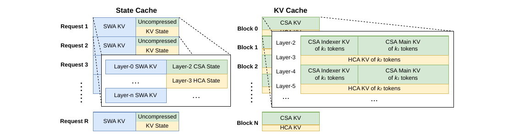{#fig-kv-layout width=100%}

为实现 DeepSeek-V4 的高效 KV cache management，我们设计了相应策略来解决这两类挑战。

**SWA 与未压缩尾部 tokens 的状态缓存**

为应对第一个障碍，我们采用了另一套 cache management mechanism。
由于 SWA 的设计目标本来就是在有限 KV cache size 下提升性能，因此把它与 compression branch 中未压缩的尾部 tokens 一起视作 state-space model 是合理的。
相应的 KV cache 也就可以看作仅依赖当前位置的 sequence-specific state。
因此，我们预先分配一个固定且大小受限的 state cache 池，并在运行时把它动态分配给每个 sequence。

**与 Sparse Attention Kernel 协同设计**

对于第二个障碍，传统高性能 attention kernels 往往假设每个 block 包含固定数量 $B$ 个 tokens，以便优化性能。
这在 CSA 中对应 $B \cdot m$ 个原始 tokens，在 HCA 中对应 $B \cdot m'$ 个原始 tokens。
通过采用高性能 sparse-attention kernel，不同 layers 可以在不损失性能的情况下支持可变的 tokens-per-block 配置。
实现这一点需要 KV cache layout 与 sparse attention kernel 的协同设计。
例如，把 blocks padding 到 cache-line 对齐位置就可能提升性能。
因此，对于 compression ratio 为 $m$ 的 CSA 与 compression ratio 为 $m'$ 的 HCA，每个 block 中所覆盖的原始 tokens 数量可以取 $\mathrm{lcm}(m, m')$ 的任意倍数，也就是这两个 compression ratios 的最小公倍数的任意倍数。

### 磁盘式 KV cache 存储

在服务 DeepSeek-V4 时，我们利用 on-disk KV cache storage mechanism 来避免 shared-prefix requests 的重复 prefilling。
对于 CSA/HCA 中的 compressed KV entries，以及 Sliding Window Attention (SWA) 中的 uncompressed KV entries，我们分别设计了不同的 storage management solutions。

对于 CSA 和 HCA，我们的做法相对直接：把所有 compressed KV entries 都写到磁盘上。
当某个 request 命中已存储的 prefix 时，我们就从磁盘读出并复用该 prefix 对应的 compressed KV entries，直到最后一个完整 compression block 为止。
但对于位于最后一个 incomplete block 中的 prefix tokens，我们仍然需要重新计算它们，以恢复未压缩的 KV entries，因为 CSA 与 HCA 的 uncompressed KV entries 并不会被存储。

对于 SWA KV entries，由于它们不经过压缩，并且在每一层都存在，所以其体积大约是压缩后 CSA/HCA KV entries 的 8 倍。
为高效管理这些体积巨大的 on-disk SWA KV entries，我们提出并实现了三种不同策略，每种策略都在 storage overhead 与 computational redundancy 之间做出不同取舍：

- Full SWA Caching：该策略存储所有 tokens 的完整 SWA KV entries，从而实现计算上的零冗余。
- Full SWA Caching：在该策略下，只要读取命中 prefix 中最后 $n_{\mathrm{win}}$ 个 tokens 的 on-disk cache，就能重建该 hitting prefix 的 SWA KV entries。
- Full SWA Caching：但它对现代基于 SSD 的 storage systems 并不友好，因为每次命中请求只会访问已存数据中的一个很小子集，导致读写模式严重失衡。
- Periodic Checkpointing：该策略会以每 $p$ 个 tokens 为间隔，对最后 $n_{\mathrm{win}}$ 个 tokens 的 SWA KV entries 做一次 checkpoint，其中 $p$ 是可调参数。
- Periodic Checkpointing：对于 hitting prefix，我们只需加载最近的 checkpoint state，并重算其后的尾部 tokens。
- Periodic Checkpointing：通过调节 $p$，这一策略可以在 storage 与 computation 之间实现按需折中。
- Zero SWA Caching：该策略不存储任何 SWA KV entries。
- Zero SWA Caching：对于 hitting prefix，我们需要做更多 recomputation 才能恢复 SWA KV entries。
- Zero SWA Caching：更具体地说，在每一层 attention 中，每个 token 的 SWA KV entry 只依赖前一层最近 $n_{\mathrm{win}}$ 个 tokens 的 SWA KV entries。
- Zero SWA Caching：因此，只要利用已缓存的 CSA 与 HCA KV entries，对一个 $L$ 层模型来说，只需重算最后 $n_{\mathrm{win}} \cdot L$ 个 tokens，就足以恢复最后 $n_{\mathrm{win}}$ 个 SWA KV entries。

在具体 deployment scenarios 中，我们会按需选择最合适的策略，以达到目标中的 storage-computation trade-off。

# 预训练 {#sec-pretraining}

## 数据构建

在 DeepSeek-V3 的 pre-training data 基础上，我们进一步构建了一个更高质量、更具多样性、且具有更长有效上下文的训练语料。
我们持续迭代 data construction pipelines。
对于来自 web 的数据，我们实现了过滤策略，用来移除批量自动生成内容和模板化内容，以降低 model collapse 风险 [Zhu et al., 2024]。
mathematical corpora 与 programming corpora 依然是训练数据的核心组成部分，而我们还在 mid-training 阶段引入了 agentic data，以进一步增强 DeepSeek-V4 系列的 coding capability。
对于 multilingual data，我们为 DeepSeek-V4 构建了更大的 corpus，以提升其对不同文化中 long-tail knowledge 的捕获能力。
对于 DeepSeek-V4，我们还特别强调 long-document data curation，优先纳入 scientific papers、technical reports 以及其他具有独特 academic value 的材料。
综合以上来源之后，我们的 pre-training corpus 包含超过 32T tokens，其中涵盖 mathematical contents、codes、web pages、long documents 以及其他高质量类别。

在 pre-training data 的预处理方面，我们大体沿用了 DeepSeek-V3 的策略。
在 tokenization 上，我们在 DeepSeek-V3 tokenizer 的基础上额外加入了少量 special tokens，用于 context construction，同时 vocabulary size 仍然保持在 128K。
我们也继承了 DeepSeek-V3 的 token-splitting [DeepSeek-AI, 2024] 和 Fill-in-Middle (FIM) [DeepSeek-AI, 2024] 策略。
受 Ding et al. (2024) 启发，我们会把来自不同来源的 documents 打包进合适的 sequences，以尽量减少 sample truncation。
与 DeepSeek-V3 不同的是，我们在 pre-training 中引入了 sample-level attention masking。

## 预训练设置

### 模型设置

**DeepSeek-V4-Flash**

我们将 Transformer layers 的数量设为 43，hidden dimension $d$ 设为 4096。
前两层使用 pure sliding window attention。
之后的 layers 中，CSA 与 HCA 以交错方式使用。
对于 CSA，我们把 compression rate $m$ 设为 4，把 indexer query heads 数量 $n_h^I$ 设为 64，把 indexer head dimension $c_I$ 设为 128，并把 sparse attention 中被选中的 KV entries 数量，也就是 attention top-k，设为 512。
对于 HCA，我们把 compression rate $m'$ 设为 128。
对于 CSA 与 HCA，我们都把 query heads 数量 $n_h$ 设为 64，把 head dimension $c$ 设为 512，把 query compression dimension $d_c$ 设为 1024。
output projection groups 数量 $g$ 设为 8，而每个 intermediate attention output 的维度 $d_g$ 设为 1024。
对于附加的 sliding window attention 分支，window size $n_{\mathrm{win}}$ 设为 128。
我们在所有 Transformer blocks 中都使用 MoE layers，但前 3 个 MoE layers 使用 Hash routing strategy。
每个 MoE layer 包含 1 个 shared expert 和 256 个 routed experts，其中每个 expert 的 intermediate hidden dimension 为 2048。
在这些 routed experts 中，每个 token 会激活其中 6 个 experts。
multi-token prediction depth 设为 1。
对于 mHC，expansion factor $n_{hc}$ 设为 4，Sinkhorn-Knopp iterations 的次数 $t_{\max}$ 设为 20。
在这套配置下，DeepSeek-V4-Flash 共包含 284B total parameters，其中每个 token 会激活 13B。

**DeepSeek-V4-Pro**

我们将 Transformer layers 的数量设为 61，hidden dimension $d$ 设为 7168。
前两层使用 HCA。
之后的 layers 中，CSA 与 HCA 以交错方式使用。
对于 CSA，我们把 compression rate $m$ 设为 4，把 indexer query heads 数量 $n_h^I$ 设为 64，把 indexer head dimension $c_I$ 设为 128，并把 sparse attention 中被选中的 KV entries 数量，也就是 attention top-k，设为 1024。
对于 HCA，我们把 compression rate $m'$ 设为 128。
对于 CSA 与 HCA，我们都把 query heads 数量 $n_h$ 设为 128，把 head dimension $c$ 设为 512，把 query compression dimension $d_c$ 设为 1536。
output projection groups 数量 $g$ 设为 16，而每个 intermediate attention output 的维度 $d_g$ 设为 1024。
对于附加的 sliding window attention 分支，window size $n_{\mathrm{win}}$ 设为 128。
我们在所有 Transformer blocks 中都使用 MoE layers，但前 3 个 MoE layers 使用 Hash routing strategy。
每个 MoE layer 包含 1 个 shared expert 和 384 个 routed experts，其中每个 expert 的 intermediate hidden dimension 为 3072。
这些 routed experts 中，每个 token 会激活其中 6 个。
multi-token prediction depth 设为 1。
对于 mHC，expansion factor $n_{hc}$ 设为 4，Sinkhorn-Knopp iterations 的次数 $t_{\max}$ 设为 20。
在这套配置下，DeepSeek-V4-Pro 共包含 1.6T total parameters，其中每个 token 会激活 49B。

### 训练设置

**DeepSeek-V4-Flash**

我们对大多数 parameters 使用 Muon optimizer [Jordan et al., 2024; Liu et al., 2025]，但对 embedding module、prediction head module，以及所有 RMSNorm modules 的 weights 使用 AdamW optimizer [Loshchilov and Hutter, 2017]。
对于 AdamW，我们设置其 hyper-parameters 为 $\beta_1 = 0.9$、$\beta_2 = 0.95$、$\epsilon = 10^{-20}$ 和 $\mathrm{weight\_decay} = 0.1$。
对于 Muon，我们把 momentum 设为 0.95，把 weight decay 设为 0.1，并把每个 update matrix 的 RMS rescale 到 0.18，以便复用 AdamW learning rate。
我们在 32T tokens 上训练 DeepSeek-V4-Flash。
与 DeepSeek-V3 一样，我们也采用了 batch size scheduling strategy，让 batch size（按 tokens 计）从较小值逐步增长到 75.5M，然后在大部分训练期间保持 75.5M 不变。
learning rate 会在前 2000 steps 线性 warmup，随后在大部分训练过程中保持 $2.7 \times 10^{-4}$。
在训练后期，我们再按照 cosine schedule 将 learning rate 衰减到 $2.7 \times 10^{-5}$。
训练从 4K sequence length 开始，然后逐步扩展到 16K、64K 与 1M。
对于 sparse attention 的设置，我们先在前 1T tokens 上用 dense attention 对模型做 warmup，然后在 sequence length 达到 64K 时引入 sparse attention，并在剩余训练阶段保持 sparse attention。
在引入 attention sparsity 时，我们先用一个较短阶段 warm up CSA 中的 lightning indexer，然后在后续大部分训练过程中使用 sparse attention。
对于 auxiliary-loss-free load balancing，我们把 bias update speed 设为 0.001。
对于 balance loss，我们把其 loss weight 设为 0.0001，以避免单个 sequence 内出现极端不平衡。
MTP loss weight 在大部分训练阶段设为 0.3，在 learning rate decay 开始时降为 0.1。

**DeepSeek-V4-Pro**

除具体超参数数值外，DeepSeek-V4-Pro 的训练设置与 DeepSeek-V4-Flash 大体一致。
我们同样对大多数 parameters 使用 Muon optimizer，对 embedding module、prediction head module 以及所有 RMSNorm modules 的 weights 使用 AdamW optimizer。
AdamW 与 Muon 的 hyper-parameters 与 DeepSeek-V4-Flash 保持相同。
我们在 33T tokens 上训练 DeepSeek-V4-Pro，并同样采用 batch size scheduling strategy，不过其最大 batch size 为 94.4M tokens。
learning rate scheduling strategy 也与 DeepSeek-V4-Flash 基本一致，但 peak learning rate 设为 $2.0 \times 10^{-4}$，最终 learning rate 设为 $2.0 \times 10^{-5}$。
训练同样从 4K sequence length 开始，并逐步扩展到 16K、64K 与 1M。
相比 DeepSeek-V4-Flash，DeepSeek-V4-Pro 的 dense attention warmup 阶段更长，而 sparse attention 的引入策略则保持一致，同样采用两阶段训练方法。
对于 auxiliary-loss-free load balancing，我们把 bias update speed 设为 0.001。
对于 balance loss，我们把其 loss weight 设为 0.0001，以避免单个 sequence 内部出现极端不平衡。
MTP loss weight 在大部分训练期间设为 0.3，并在 learning rate decay 开始时降为 0.1。

### 缓解训练不稳定性

训练 trillion-parameter MoE models 会带来显著的 stability challenges，DeepSeek-V4 系列也不例外。
我们在训练中遇到了明显的 instability 问题。
虽然简单 rollback 可以暂时恢复训练状态，但它并不是长期可行的解法，因为它无法阻止 loss spikes 反复出现。
从经验上看，我们发现 spikes 的出现总是和 MoE layers 中的 outliers 有关，而 routing mechanism 本身似乎又会进一步放大这些 outliers。
因此，我们试图从两个维度解决这个问题：一是打破 routing 所诱发的恶性循环，二是直接压制异常值。
幸运的是，我们找到了两种在实践中非常有效的技术，可以显著维持训练稳定性。
尽管它们背后的完整理论机制仍然是开放问题，我们仍把这些方法公开出来，希望社区能进一步探索。

**前瞻式路由**

我们发现，把 backbone network 和 routing network 的同步更新解耦，可以显著提升训练稳定性。
因此，在 step $t$，我们用当前网络参数 $\theta_t$ 进行 feature computation，但 routing indices 的计算和应用则使用历史参数 $\theta_{t-\Delta_t}$。
在实现上，为避免重复加载模型参数的额外成本，我们会在 $t-\Delta_t$ 时提前把 step $t$ 所需的数据取出来。
我们会“提前”计算并缓存 step $t$ 将来要用的 routing indices，这也是 Anticipatory Routing 这一名字的由来。
我们还在 infrastructure level 对这一过程做了大量优化。
首先，由于 routing indices 的预计算只需要对数据做一次 forward pass，我们仔细编排了 pipeline execution 以及 computation 与 Expert Parallelism (EP) communication 的 overlap，最终把 Anticipatory Routing 的额外 wall-clock time overhead 控制在约 20%。
其次，我们设计了自动检测机制：当系统检测到 loss spike 时，会自动触发一次短 rollback，并只在这一时期内启用 Anticipatory Routing；运行一段时间后，再切回标准训练模式。
最终，这种动态应用方式让我们几乎不增加总训练开销，就能有效规避 loss spikes，同时不损害模型性能。

**SwiGLU 截断**

在以往文献中 [Bello et al., 2017; Riviere et al., 2024]，clamping 已被明确用于约束数值范围，从而提升训练稳定性。
在我们的实际训练中，我们也经验性地发现，应用 SwiGLU clamping [OpenAI, 2025] 可以有效消除 outliers，并显著帮助训练稳定下来，而且不会损害性能。
在 DeepSeek-V4-Flash 与 DeepSeek-V4-Pro 的整个训练过程中，我们都把 SwiGLU 的 linear component clamp 到 $[-10, 10]$ 范围内，同时把 gate component 的上界限制在 10。

## 评测

### 评测基准

对于基础模型的评测，我们覆盖了四个关键维度的基准：世界知识、语言理解与推理、代码与数学，以及长上下文处理。

世界知识类基准包括 AGIEval [Zhong et al., 2023]、C-Eval [Huang et al., 2023]、CMMLU [Li et al., 2023]、MMLU [Hendrycks et al., 2020]、MMLU-Redux [Gema et al., 2024]、MMLU-Pro [Wang et al., 2024b]、MMMLU [OpenAI, 2024a]、MultiLoKo [Hupkes and Bogoychev, 2025]、Simple-QA verified [Haas et al., 2025]、SuperGPQA [Du et al., 2025]、FACTS Parametric [Cheng et al., 2025]，以及 TriviaQA [Joshi et al., 2017]。

语言理解与推理类基准包括 BigBench Hard (BBH) [Suzgun et al., 2022]、DROP [Dua et al., 2019]、HellaSwag [Zellers et al., 2019]、CLUEWSC [Xu et al., 2020]，以及 WinoGrande [Sakaguchi et al., 2019]。

代码与数学类基准包括 BigCodeBench [Zhuo et al., 2025]、HumanEval [Chen et al., 2021]、GSM8K [Cobbe et al., 2021]、MATH [Hendrycks et al., 2021]、MGSM [Shi et al., 2023] 和 CMath [Wei et al., 2023]。

长上下文基准则使用 LongBench-V2 [Bai et al., 2025b]。

### 评测结果

原文表 1 给出了 DeepSeek-V3.2-Base、DeepSeek-V4-Flash-Base 与 DeepSeek-V4-Pro-Base 在统一内部评测框架与严格一致设置下的详细对比。

**表 1.** DeepSeek-V3.2-Base、DeepSeek-V4-Flash-Base 与 DeepSeek-V4-Pro-Base 的对比。所有模型均在统一内部评测框架与一致设置下评测；分差不超过 0.3 视为同一水平。

<div style="overflow-x:auto;">
<table class="table table-sm table-striped table-hover caption-top">
<thead><tr><th>Category</th><th>Benchmark (Metric)</th><th># Shots</th><th>DeepSeek-V3.2-Base</th><th>DeepSeek-V4-Flash-Base</th><th>DeepSeek-V4-Pro-Base</th></tr></thead>
<tbody>
<tr><td>Model Setup</td><td>Architecture</td><td>-</td><td>MoE</td><td>MoE</td><td>MoE</td></tr>
<tr><td>Model Setup</td><td># Activated Params</td><td>-</td><td>37B</td><td>13B</td><td>49B</td></tr>
<tr><td>Model Setup</td><td># Total Params</td><td>-</td><td>671B</td><td>284B</td><td>1.6T</td></tr>
<tr><td>World Knowl.</td><td>AGIEval (EM)</td><td>0-shot</td><td>80.1</td><td>82.6</td><td>83.1</td></tr>
<tr><td>World Knowl.</td><td>MMLU (EM)</td><td>5-shot</td><td>87.8</td><td>88.7</td><td>90.1</td></tr>
<tr><td>World Knowl.</td><td>MMLU-Redux (EM)</td><td>5-shot</td><td>87.5</td><td>89.4</td><td>90.8</td></tr>
<tr><td>World Knowl.</td><td>MMLU-Pro (EM)</td><td>5-shot</td><td>65.5</td><td>68.3</td><td>73.5</td></tr>
<tr><td>World Knowl.</td><td>MMMLU (EM)</td><td>5-shot</td><td>87.9</td><td>88.8</td><td>90.3</td></tr>
<tr><td>World Knowl.</td><td>C-Eval (EM)</td><td>5-shot</td><td>90.4</td><td>92.1</td><td>93.1</td></tr>
<tr><td>World Knowl.</td><td>CMMLU (EM)</td><td>5-shot</td><td>88.9</td><td>90.4</td><td>90.8</td></tr>
<tr><td>World Knowl.</td><td>MultiLoKo (EM)</td><td>5-shot</td><td>38.7</td><td>42.2</td><td>51.1</td></tr>
<tr><td>World Knowl.</td><td>Simple-QA verified (EM)</td><td>25-shot</td><td>28.3</td><td>30.1</td><td>55.2</td></tr>
<tr><td>World Knowl.</td><td>SuperGPQA (EM)</td><td>5-shot</td><td>45.0</td><td>46.5</td><td>53.9</td></tr>
<tr><td>World Knowl.</td><td>FACTS Parametric (EM)</td><td>25-shot</td><td>27.1</td><td>33.9</td><td>62.6</td></tr>
<tr><td>World Knowl.</td><td>TriviaQA (EM)</td><td>5-shot</td><td>83.3</td><td>82.8</td><td>85.6</td></tr>
<tr><td>Lang. & Reas.</td><td>BBH (EM)</td><td>3-shot</td><td>87.6</td><td>86.9</td><td>87.5</td></tr>
<tr><td>Lang. & Reas.</td><td>DROP (F1)</td><td>1-shot</td><td>88.2</td><td>88.6</td><td>88.7</td></tr>
<tr><td>Lang. & Reas.</td><td>HellaSwag (EM)</td><td>0-shot</td><td>86.4</td><td>85.7</td><td>88.0</td></tr>
<tr><td>Lang. & Reas.</td><td>WinoGrande (EM)</td><td>0-shot</td><td>78.9</td><td>79.5</td><td>81.5</td></tr>
<tr><td>Lang. & Reas.</td><td>CLUEWSC (EM)</td><td>5-shot</td><td>83.5</td><td>82.2</td><td>85.2</td></tr>
<tr><td>Code & Math</td><td>BigCodeBench (Pass@1)</td><td>3-shot</td><td>63.9</td><td>56.8</td><td>59.2</td></tr>
<tr><td>Code & Math</td><td>HumanEval (Pass@1)</td><td>0-shot</td><td>62.8</td><td>69.5</td><td>76.8</td></tr>
<tr><td>Code & Math</td><td>GSM8K (EM)</td><td>8-shot</td><td>91.1</td><td>90.8</td><td>92.6</td></tr>
<tr><td>Code & Math</td><td>MATH (EM)</td><td>4-shot</td><td>60.5</td><td>57.4</td><td>64.5</td></tr>
<tr><td>Code & Math</td><td>MGSM (EM)</td><td>8-shot</td><td>81.3</td><td>85.7</td><td>84.4</td></tr>
<tr><td>Code & Math</td><td>CMath (EM)</td><td>3-shot</td><td>92.6</td><td>93.6</td><td>90.9</td></tr>
<tr><td>Long Context</td><td>LongBench-V2 (EM)</td><td>1-shot</td><td>40.2</td><td>44.7</td><td>51.5</td></tr>
</tbody>
</table>
</div>

从 DeepSeek-V4-Flash-Base 与 DeepSeek-V3.2-Base 的比较来看，我们看到了一个很有说服力的效率提升结论。
尽管激活参数和总参数都显著更少，DeepSeek-V4-Flash-Base 依然在大范围基准上超过了 DeepSeek-V3.2-Base。
这一优势在世界知识任务和更具挑战性的长上下文场景上尤其明显。
这些结果表明，DeepSeek-V4-Flash-Base 在架构改进、数据质量提升和训练优化上的收益，即使在更紧凑的参数预算下，也足以带来更高性能，并在大多数评测中超越更大的 DeepSeek-V3.2-Base。

进一步地，DeepSeek-V4-Pro-Base 又在能力上实现了一次决定性的跃升，几乎在所有维度上都压过了 DeepSeek-V3.2-Base 和 DeepSeek-V4-Flash-Base。
借助几乎跨所有类别的性能提升，DeepSeek-V4-Pro-Base 在最具挑战性的基准上刷新了 DeepSeek 基础模型的性能上限。
在知识密集型评测上，它带来了大幅收益；在长上下文理解上也有显著进步。
在大多数推理与代码基准上，DeepSeek-V4-Pro-Base 同样超过了此前两代模型。
这一全面提升说明，DeepSeek-V4-Pro-Base 已成为 DeepSeek 系列中最强的基础模型，在知识、推理、代码与长上下文能力上全面超越其前代模型。

# 后训练 {#sec-posttraining}

## 后训练流程

在预训练完成后，我们进入后训练阶段，以得到 DeepSeek-V4 系列的最终模型。
虽然整体训练流程与 DeepSeek-V3.2 基本相似，但有一个关键的方法论替换：原本的混合 Reinforcement Learning (RL) 阶段被完全替换为 On-Policy Distillation (OPD)。

### 专家模型训练

各个领域专家模型的开发，是在 DeepSeek-V3.2 训练流程的基础上做适配完成的。
更具体地说，每个模型都会先经历初始微调阶段，随后再进行由领域特定 prompts 和奖励信号驱动的 Reinforcement Learning (RL)。
在 RL 阶段，我们实现了 Group Relative Policy Optimization (GRPO) 算法，并让超参数与我们此前研究 [DeepSeek-AI, 2025; DeepSeek-AI, 2025] 保持高度一致。

**推理强度**

众所周知，模型在推理任务上的表现，本质上由其消耗的计算强度决定。
因此，我们在不同 RL 配置下训练了多个专家模型，以支持不同推理能力对应的模型。
如原文表 2 所示，DeepSeek-V4-Pro 与 DeepSeek-V4-Flash 都支持三种明确的推理强度模式。
对于每一种模式，我们都会在 RL 训练中使用不同的长度惩罚与上下文窗口，因此最终会得到不同长度的推理输出 tokens。
为了将这几种推理模式统一到一个系统中，我们使用由 `<think>` 与 `</think>` tokens 划定的专门响应格式。
此外，对于 "Think Max" 模式，我们还会在 system prompt 开头额外插入一条特定 instruction，以引导模型的推理过程，如原文表 3 所示。

**表 2.** 三种 reasoning effort modes 的对比。

| Reasoning Mode | 特征 | 典型使用场景 | 响应格式 |
|---|---|---|---|
| Non-think | 基于习惯或简单规则的快速、直觉式响应。 | 日常常规任务、紧急反应、低风险决策。 | `</think>` summary |
| Think High | 更慢但更准确的显式逻辑分析。 | 复杂问题求解、规划、中等风险决策。 | `<think>` thinking tokens `</think>` summary |
| Think Max | 将推理推到极限；更慢，但更强。 | 探索模型推理能力的边界。 | 1. system prompt 开头加入额外 instruction。<br>2. `<think>` thinking tokens `</think>` summary |

**表 3.** 注入到 "Think Max" mode 的 system prompt 开头的 instruction。

> Reasoning Effort：absolute maximum，不允许任何 shortcuts。
>
> 你必须在 thinking 中极其彻底地分解问题，对所有可能路径、edge cases 与 adversarial scenarios 做严格 stress test。
>
> 你需要显式写出完整 deliberation process，记录每一个 intermediate step、考虑过的 alternative，以及被拒绝的 hypothesis，确保没有任何 assumption 被遗漏。

**生成式奖励模型**

通常来说，易验证任务可以通过简单的基于规则的验证器或测试用例来优化。
相比之下，难验证任务传统上依赖 Reinforcement Learning from Human Feedback (RLHF)，这需要大量人工标注来训练标量奖励模型。
而在 DeepSeek-V4 系列的后训练阶段中，我们摒弃了这些传统的标量奖励模型。
取而代之的是，我们构造了评分准则引导的 RL 数据，并引入 Generative Reward Model (GRM) 来评估策略轨迹。
更关键的是，我们把 RL optimization 直接施加在 GRM 本身上。
在这一范式下，actor 网络原生就充当了 GRM，因此模型的评估能力可以与其常规生成能力一起被联合优化。
通过把这两种角色统一起来，模型内部的推理能力会天然地融入评估过程，因此能带来非常稳健的打分。
此外，这种做法只需要极少量且多样的人类标注，就能取得优异效果，因为模型会利用自身逻辑去泛化到复杂任务。

**工具调用模式与特殊 token**

与上一版本一致，我们仍使用专门的 `<think></think>` 标签来标记推理路径。
在 DeepSeek-V4 系列中，我们又引入了一套新的工具调用模式，它使用特殊 token `|DSML|`，并采用基于 XML 的工具调用格式，如原文表 4 所示。
实验表明，XML 格式能有效减少转义失败，并降低工具调用错误，从而为模型与工具的交互提供更稳健的接口。

**表 4.** DeepSeek-V4 系列的工具调用模式。

```text
## 工具

You have access to a set of tools to help answer the user’s question. You can
invoke tools by writing a "<|DSML|tool_calls>" block like the following:

<|DSML|tool_calls>
<|DSML|invoke name="$TOOL_NAME">
<|DSML|parameter name="$PARAMETER_NAME" string="true|false">$PARAMETER_VALUE
    </|DSML|parameter>
...
</|DSML|invoke>
<|DSML|invoke name="$TOOL_NAME2">
...
</|DSML|invoke>
</|DSML|tool_calls>

String parameters should be specified as is and set `string="true"`. For all
other types (numbers, booleans, arrays, objects), pass the value in JSON
format and set `string="false"`.

If thinking_mode is enabled (triggered by <think>), you MUST output your
complete reasoning inside <think>...</think> BEFORE any tool calls or
final response.

Otherwise, output directly after </think> with tool calls or final response.

### 可用工具模式定义

{Tool Definition...}

You MUST strictly follow the above defined tool name and parameter schemas to
invoke tool calls.
```

**交错式思考**

DeepSeek-V3.2 曾引入一种上下文管理策略：在工具结果轮次之间保留推理痕迹，但一旦收到新的用户消息，就将其丢弃。
这种策略虽然有效，但在复杂的智能体工作流中仍会造成不必要的 token 浪费，因为每次新的用户轮次到来，所有已积累的推理内容都会被刷新，模型不得不从头重建问题求解状态。
借助 DeepSeek-V4 系列扩展到 1M-token 的上下文窗口，我们进一步改进了这一机制，以最大化交错式思考在智能体环境中的效果。

- 工具调用场景：如原文 Figure 7(a) 所示，所有推理内容都会在整个对话过程中被完整保留。
- 工具调用场景：与 DeepSeek-V3.2 在每次新用户轮次到来时都会丢弃思考痕迹不同，DeepSeek-V4 系列会跨越所有轮次保留完整推理历史，甚至也跨越用户消息边界。
- 工具调用场景：这让模型能够在长时程智能体任务中维持连贯、累积的思维链条。
- 普通对话场景：如原文 Figure 7(b) 所示，我们仍保留原有策略：一旦新用户消息到来，前几轮的推理内容就会被丢弃，以让上下文在那些不需要长期保留推理痕迹的场景中保持简洁。

与 DeepSeek-V3.2 一样，那些通过用户消息来模拟工具交互的智能体框架，例如 Terminus，可能不会触发工具调用上下文路径，因此也无法从这种增强版推理持久化机制中受益。
对于这类架构，我们仍然推荐使用 Non-think 模型。

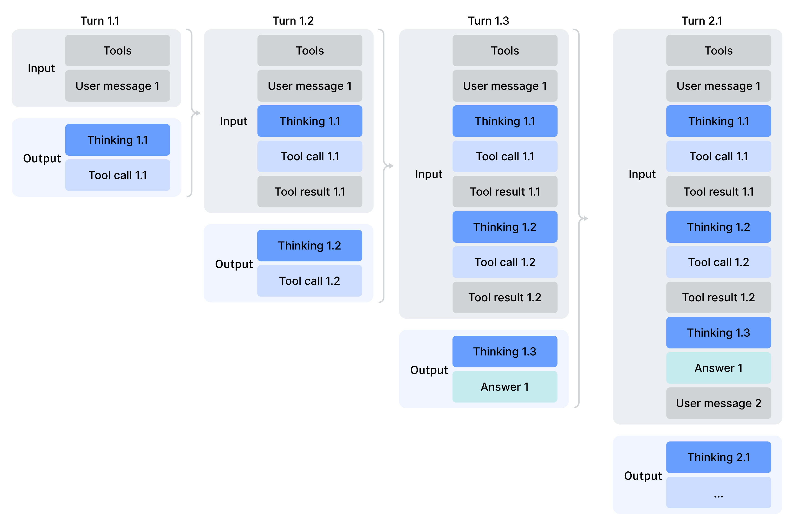{width=100%}

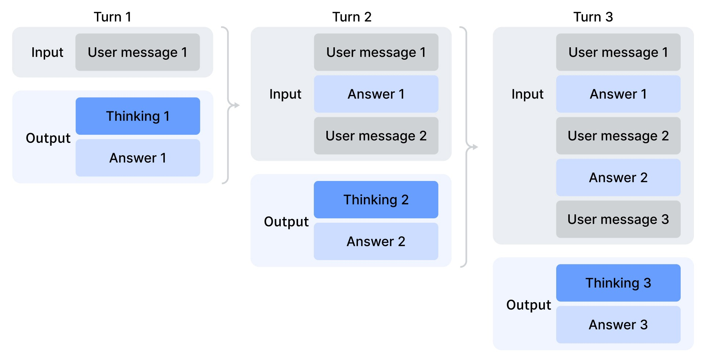{width=100%}

**快速指令**

在聊天机器人场景中，许多辅助任务，例如判断是否要触发网页搜索、进行意图识别等，都必须在正式生成响应前先执行。
传统做法通常由一个单独的小模型完成这些任务，但这样一来，它无法复用已存在的 KV cache，因此会引入冗余预填充。
为解决这一限制，我们引入了 Quick Instruction。
我们直接在输入序列后附加一组专门的特殊 tokens，每个 token 对应一个特定的辅助任务。
通过直接复用已计算好的 KV cache，这一机制完全避免了冗余预填充，并使得某些任务，例如生成搜索查询、判断来源权威性与所属领域，能够并行执行。
因此，这种方法显著降低了用户感知到的首 token 延迟（time-to-first-token, TTFT），并消除了维护和迭代一个额外小模型的工程负担。
原文表 5 汇总了目前支持的 Quick Instruction tokens。

**表 5.** 辅助任务使用的 Quick Instruction 特殊 tokens。

| 特殊 Token | 说明 | 格式 |
|---|---|---|
| `<|action|>` | 判断用户提示是否需要触发网页搜索，还是可直接回答。 | `...<|User|>{prompt}<|Assistant|><think><|action|>` |
| `<|title|>` | 在 assistant 首条回复后生成简洁的对话标题。 | `...<|Assistant|>{response}<|end_of_sentence|><|title|>` |
| `<|query|>` | 为用户提示生成搜索查询。 | `...<|User|>{prompt}<|query|>` |
| `<|authority|>` | 判断用户提示对来源权威性的要求。 | `...<|User|>{prompt}<|authority|>` |
| `<|domain|>` | 识别用户提示所属领域。 | `...<|User|>{prompt}<|domain|>` |
| `<|extracted_url|>` / `<|read_url|>` | 判断提示中的每个 URL 是否应被抓取并读取。 | `...<|User|>{prompt}<|extracted_url|>{url}<|read_url|>` |

### On-Policy Distillation（策略上蒸馏，OPD）

在通过专门的微调与 reinforcement learning 训练出多个领域专家模型之后，我们使用多教师 On-Policy Distillation (OPD) 作为将这些专家能力融合进最终模型的主要技术。
OPD 已经成为一种高效的后训练范式，能把多个领域专家的知识与能力迁移到一个统一模型中。
其做法是：让学生模型在自己生成的轨迹上，学习教师模型的输出分布。
形式化地说，给定一组 $N$ 个 expert models $\{ \pi_{E_1}, \pi_{E_2}, \ldots, \pi_{E_N} \}$，OPD 的 objective function 定义为：

$$
L_{\mathrm{OPD}}(\theta) =
\sum_{i=1}^{N}
w_i \cdot D_{\mathrm{KL}}(\pi_\theta \parallel \pi_{E_i}).
$$

在这个公式中，$w_i$ 表示分配给每个专家模型的权重，通常由该专家的相对重要性决定。
为了计算 reverse KL loss $D_{\mathrm{KL}}(\pi_\theta \parallel \pi_{E_i})$，需要从学生策略 $\pi_\theta$ 中采样训练轨迹，以保持 on-policy learning。
其底层逻辑是：统一后的策略 $\pi_\theta$ 会在当前任务上下文下，选择性地向最相关的专门专家学习，例如在数学推理任务上对齐数学专家，在编程任务上对齐代码专家。
通过这种机制，原本分布在物理上彼此独立专家权重中的知识，会通过 logits-level alignment 被整合到一个统一参数空间中，从实践上规避传统权重合并或混合 RL 技术中常见的性能退化问题。
在这个阶段，我们使用了十多个覆盖不同领域的教师模型，最终蒸馏成一个学生模型。

在处理上述 OPD 目标时，以往工作通常会把 full-vocabulary KL loss 简化成每个 token 位置上的 token-level KL estimate，并通过把 $\mathrm{sg}\!\left[\log \frac{\pi_{E_i}(y_t|x,y_{<t})}{\pi_\theta(y_t|x,y_{<t})}\right]$（其中 $\mathrm{sg}$ 表示 stop gradient）替换成 policy loss 中的 per-token advantage estimate 来复用 RL 框架。
这种方法虽然更节省资源，但会导致梯度估计方差很高，并且常常带来训练不稳定性。
因此，在我们的 OPD 中，我们采用了 full-vocabulary logit distillation。
在 reverse KL loss 的计算中保留完整 logits distribution，可以得到更稳定的梯度估计，并更忠实地蒸馏教师模型的知识。
下一小节将介绍那些让 full-vocabulary OPD 在大规模下变得可行的工程设计。

## RL 与 OPD 基础设施

我们的后训练基础设施建立在为 DeepSeek-V3.2 开发的可扩展框架之上。
更具体地说，我们复用了第 3.5 节所描述的分布式训练栈，以及此前引入的 rollout engine，以支持高效的自回归采样。
在这一基础上，我们又引入了若干关键增强。
这些设计使得在超过十个不同教师模型参与下，对超长上下文 RL 与 OPD 融合任务进行高效执行成为可能，并显著加快了模型发布的迭代周期。

### FP4 量化集成

我们引入 FP4 (MXFP4) quantization，用于加速 rollout 和所有仅推理 forward passes，其中包括教师模型与参考模型的 forward，从而降低内存流量与采样延迟。
如第 3.4 节所述，在 rollout 与 inference phases 中，我们直接使用 native FP4 weights。
而在训练步骤中，FP4 quantization 则通过无损的 FP4-to-FP8 反量化步骤来模拟。
这样一来，我们就能无缝复用现有的 FP8 混合精度框架以及 FP32 主权重，同时又无需对反向传播流程做任何修改。

### 面向 full-vocabulary OPD 的高效 teacher 调度

我们的框架支持 full-vocabulary On-Policy Distillation (OPD)，并且在教师模型数量上几乎没有上限；每个教师模型本身都可能达到 trillion-parameter 量级。
为实现这一点，我们把所有教师权重都卸载到集中式分布式存储中，并在教师 forward pass 时按需加载，同时使用类似 ZeRO 的参数分片来缓解 I/O 与 DRAM 压力。
更进一步地，如果直接为词表规模 `|V| > 100k` 的所有教师模型实例化 logits，即便把它们写到磁盘，也会带来难以承受的资源消耗。
我们对此的解决方案是：在 forward pass 中，只缓存最后一层的教师 hidden states，并把它们放进一个集中式缓冲区中。
在训练时，这些缓存状态会被取回，并送入对应的 prediction head module，从而在 on the fly 的过程中重建完整 logits。
这一设计几乎不引入额外重算开销，同时彻底规避了显式 materialize logits 所带来的内存负担。
为减轻教师 prediction head 的 GPU 内存占用，我们还会在数据分发时，按教师索引对训练样本排序。
这样可以保证在每个 mini-batch 中，每个不同的教师 head 只需加载一次，并且在任意时刻设备内存中最多只驻留一个教师 head。
所有参数与 hidden states 的加载/卸载操作都会在后台异步进行，不阻塞关键路径上的 computation。
最后，教师 logits 与学生 logits 之间的精确 KL divergence 通过专门的 TileLang kernel 计算，以加速该过程并减少动态内存分配。

### 可抢占、容错的 rollout 服务

为了最大化 GPU 资源利用率，并能为高优先级任务快速腾挪硬件资源，我们的 GPU 集群使用集群级可抢占任务调度器，因此任何运行中的任务都可能在任意时刻被抢占。
同时，在大规模 GPU 集群中，硬件故障也很常见。
为此，我们实现了一套可抢占且具备容错能力的 LLM generation service，用于 RL/OPD rollout。

更具体地说，我们为每个 generation request 实现了 token-granular Write-Ahead Log (WAL)。
每生成一个新 token，就会立刻把它 append 到该 request 的 WAL 中。
在 preemption 发生时，我们会暂停 inference engine，并保存尚未完成 requests 的 KV cache。
在恢复时，我们利用持久化的 WALs 和已保存的 KV cache 继续 decoding。
即便发生 fatal hardware error，我们也可以借助 WAL 中持久化的 tokens 重新运行 prefill phase，并重建 KV cache。

这里有一个重要点：把未完成 request 从头重新生成，在数学上是不正确的，因为这会引入 length bias。
由于较短的 responses 更容易在 interruption 中幸存，因此如果每次中断后都从头生成，模型会更倾向于在中断发生时输出更短序列。
如果 inference stack 同时满足 batch-invariant 与 deterministic，那么理论上也可以通过给 sampler 使用同一 pseudorandom seed，并重新生成来解决这一 correctness issue。
但这种做法依然需要重新执行 decoding phase，因此效率远低于我们的 token-granular WAL 方法。

### 面向 million-token context 的 RL 框架扩展

我们引入了一组定向优化，以支持在 million-token sequences 上高效执行 RL 与 OPD。
在 rollout phase 中，我们采用上一小节所述的 preemptible 和 fault-tolerant rollout service。
在 inference 与 training phase 中，我们则把 rollout data format 拆分为 lightweight metadata 与 heavy per-token fields。
在 data dispatching 时，整个 rollout data 的 metadata 可以被完整加载，用于执行 global shuffling 和 packing layout computation。
而 heavy per-token fields 则通过 shared-memory data loader 按需加载，以消除 node 内部的数据冗余；同时，它们在 mini-batch 粒度被消费完后就会立刻释放，从而显著降低 CPU 与 GPU memory pressure。
on-device mini-batches 的数量则会根据 workload 动态决定，以在 computational throughput 和 I/O overlap 之间取得高效平衡。

### Agentic AI 的沙箱基础设施

为了满足 agentic AI 在 post-training 与 evaluation 期间多样化的执行需求，我们构建了一套 production-grade sandbox platform，名为 DeepSeek Elastic Compute (DSec)。
DSec 由三个 Rust components 组成，分别是 API gateway（Apiserver）、per-host agent（Edge）和 cluster monitor（Watcher）。
它们通过自定义 RPC protocol 互连，并以 3FS distributed filesystem [DeepSeek-AI, 2025] 为底层做横向扩展。
在 production 中，单个 DSec cluster 就能够管理数十万并发 sandbox instances。

DSec 的设计基于四个观察：

- agentic workloads 的异质性很强，既有轻量 function calls，也有完整的软件工程 pipelines，同时还伴随不同的 OS 与 security requirements。
- environment images 数量多、体积大，但必须加载快，并支持迭代式 customization。
- 高密度部署要求对 CPU 与 memory utilization 做精细优化。
- sandbox lifecycles 必须与 GPU training schedules 协同，包括 preemption 与基于 checkpoint 的 resumption。

基于这些观察，作者进一步给出了 DSec 的四项核心设计。

**统一接口之下的四种执行基底**

DSec 提供单一 Python SDK，也就是 `libdsec`，对四种 execution substrates 做统一抽象。
Function Call 会把无状态调用分发到预热过的 container pool 中，以消除 cold-start overhead。
Container 完全兼容 Docker，并利用 EROFS [Gao et al., 2019] 的 on-demand loading 来高效组装 image。
microVM 基于 Firecracker [Agache et al., 2020] 构建，在安全敏感且高密度部署场景中提供 VM-level isolation。
fullVM 则基于 QEMU [Bellard, 2005] 构建，支持任意 guest operating systems。
这四种 substrates 共用统一的 API surface，包括 command execution、file transfer 与 TTY access，因此在不同执行后端间切换只需改一个参数。

**通过分层存储实现快速镜像加载**

DSec 通过 layered、on-demand loading 机制，同时兼顾了大规模 image corpus 与快速启动的需求。
对于 containers，base images 和 filesystem commits 会以 3FS-backed、readonly 的 EROFS layers 形式存储，并直接挂载到 overlay 的 lowerdirs 中。
我们在 mount 时把 file metadata 准备在 local disk 上，而真正的数据 blocks 则在访问时再从 3FS 拉取。
对于 microVMs，DSec 使用 overlaybd [Li et al., 2020] disk format：readonly base layer 放在 3FS 上以支持跨实例共享，而写入则落在本地 copy-on-write layer 上。
这类 snapshots 还可以形成链式结构，因此能支持高效 versioning 与毫秒级 resumption。

**大规模并发下的高密度优化**

为了在单个 cluster 中容纳数十万个 sandboxes，DSec 重点解决了两个资源瓶颈。
其一，它会缓解虚拟化环境中的重复 page-cache 占用，并通过 memory reclamation 支持安全 overcommitment。
其二，它会减轻 container runtime 中的 spinlock contention，从而降低每个 sandbox 的 CPU overhead，并显著提升单机装箱密度。

**轨迹日志与可安全抢占恢复**

DSec 会为每个 sandbox 维护一个全局有序的 trajectory log，并持久化记录每次 command invocation 及其结果。
这一 trajectory 有三个作用。
第一，它支持 client fast-forwarding：当 training task 被 preempt 时，sandbox resources 仍会保留；恢复后，DSec 能回放那些已缓存命令的结果，以加速任务恢复，并避免重复执行 non-idempotent operations。
第二，它提供 fine-grained provenance：每一次状态变化的来源与结果都可追踪。
第三，它支持 deterministic replay：任何历史 session 都可以依据 trajectory 被忠实复现。

## 标准基准评测

### 评测设置

**知识与推理**

知识与推理数据集包括 MMLU-Pro [Wang et al., 2024b]、GPQA [Rein et al., 2023]、Human Last Exam [Phan et al., 2025]、Simple-QA Verified [Haas et al., 2025]、Chinese-SimpleQA [He et al., 2024]、LiveCodeBench-v6 [Jain et al., 2024]、CodeForces（内部基准）、HMMT 2026 Feb、Apex [Balunović et al., 2025]、Apex Shortlist [Balunović et al., 2025]、IMOAnswerBench [Luong et al., 2025]，以及 PutnamBench [Tsoukalas et al., 2024]。
对于代码任务，我们在 LiveCodeBench-v6 和内部 Codeforces 基准上评测 DeepSeek-V4 系列。
对于 Codeforces，我们收集了 14 场 Codeforces Division 1 contests，共 114 道题，时间范围为 2025 年 5 月到 11 月。
其 Elo rating 的计算方式如下：对每场 contest 中的每道题，我们生成 32 个 candidate solutions；然后独立地从中无放回抽取 10 个解，并随机排列成 submission sequence。
每次 submission 都会在 domain experts 构造的 test suite 上评测。
若某道题被解决，则该题得分遵循 OpenAI (2025) 的 penalty scheme：模型获得的是在相同失败次数下成功解出该题的人类参赛者的 median score。
由此可得到每条 submission sequence 的总 contest score，再将其转换为 contest rank，最后用标准 Codeforces rating system 估算 rating。
每场 contest 的期望 rating 定义为：对每题所有可能的 10 次抽样与排列方式求期望所得的 estimated rating。
模型的总体 rating 则是这 14 场 contests 的 contest-level expected ratings 的平均值。

对于推理与知识任务，我们把 temperature 设为 1.0，并分别为 Non-think、High 和 Max 三种模式设置 8K、128K 与 384K tokens 的上下文窗口。
对于 math tasks，例如 HMMT、IMOAnswerBench、Apex 和 HLE，我们使用如下 prompt template：`{question}\nPlease reason step by step, and put your final answer within \boxed{}.`。
而对于 DeepSeek-V4-Pro-Max 在 math tasks 上的评测，我们还采用了更强调深度推理的 template：`Solve the following problem. The problem may ask you to prove a statement, or ask for an answer. If finding an answer is required, you should come up with the answer, and your final solution should also be a rigorous proof of that answer being valid.\n\n{question}`。

对于形式化数学任务，我们在 Lean v4.28.0-rc1 [Moura and Ullrich, 2021] 的智能体设定下进行评测，并开放 Lean compiler 与 semantic tactic search engine，最多允许 500 次 tool calls，并使用最高推理强度。
此外，我们还评测了一条更高计算开销的流程：先生成自然语言候选解，并通过 self-verification [Shao et al., 2025] 进行过滤；再把保留下来的解作为指导，交给 formal agent 去证明对应 Lean statement。
这种设计把非形式推理用作探索增强，同时又通过形式化验证保持严格正确性。
只有当严格 verifier Comparator 在这两种设置下都接受 submission 时，我们才将其记为正确。

由于 K2.6 和 GLM-5.1 的 APIs 过于繁忙，无法稳定返回我们的查询结果，因此我们为它们保留了一些空缺条目。

**1M-token 上下文**

由于 DeepSeek-V4 系列支持 1M-token 上下文，我们选择 OpenAI MRCR [OpenAI, 2024b] 与 CorpusQA [Lu et al., 2026] 作为长上下文场景下的评测基准。
我们还重新评测了 Claude Opus 4.6 和 Gemini 3.1 Pro，目的是在所有模型之间统一配置。
至于 GPT-5.4，则因为其 API 对相当一部分查询没有响应，所以未纳入此项评测。

**智能体**

agent datasets 包括 Terminal Bench 2.0 [Merrill et al., 2026]、SWE-Verified [OpenAI, 2024e]、SWE Multilingual [Yang et al., 2025]、SWE-Pro [Deng et al., 2025]、BrowseComp [Wei et al., 2025]、MCPAtlas [Bandi et al., 2026] 的公开评测集、GDPval-AA [AA, 2025; Patwardhan et al., 2025]，以及 Tool-Decathlon [Li et al., 2025]。
对于代码智能体任务，例如 SWE-Verified、Terminal-Bench、SWE-Pro 和 SWE Multilingual，我们使用一个内部开发的评测框架来评测 DeepSeek-V4 系列。
这一框架只提供极小工具集，也就是 bash tool 与 file-edit tool。
最大 interaction steps 设为 500，最大 context length 设为 512K tokens。
对于 Terminal-Bench 2.0，我们承认 GLM-5.1 所提到的 environment-related issues 的确存在；不过出于一致性考虑，我们仍然报告基于原始 Terminal-Bench 2.0 dataset 的结果。
在 Terminal-Bench 2.0 Verified subset 上，DeepSeek-V4-Pro 的得分约为 72.0。
对于搜索智能体任务，例如 BrowseComp 和带 tool 的 HLE，我们也使用内部 harness，并提供 websearch 与 Python tool，同样把 maximum interaction steps 设为 500，把 maximum context length 设为 512K tokens。
对于 BrowseComp，我们沿用了 DeepSeek-V3.2 [DeepSeek-AI, 2025] 中 discard-all 的上下文管理策略。

### 评测结果

原文表 6 展示了 DeepSeek-V4-Pro-Max 与闭源/开源对手模型的对比结果，而原文表 7 则给出了 DeepSeek-V4-Flash 和 DeepSeek-V4-Pro 在不同推理强度模式下的结果。

**表 6.** DeepSeek-V4-Pro-Max 与闭源/开源模型对比；"Max"、"xHigh" 与 "High" 表示推理强度。

<div style="overflow-x:auto;">
<table class="table table-sm table-striped table-hover caption-top">
<thead><tr><th>Category</th><th>Benchmark (Metric)</th><th>Opus-4.6 Max</th><th>GPT-5.4 xHigh</th><th>Gemini-3.1-Pro High</th><th>K2.6 Thinking</th><th>GLM-5.1 Thinking</th><th>DS-V4-Pro Max</th></tr></thead>
<tbody>
<tr><td>Knowledge & Reasoning</td><td>MMLU-Pro (EM)</td><td>89.1</td><td>87.5</td><td>91.0</td><td>87.1</td><td>86.0</td><td>87.5</td></tr>
<tr><td>Knowledge & Reasoning</td><td>SimpleQA-Verified (Pass@1)</td><td>46.2</td><td>45.3</td><td>75.6</td><td>36.9</td><td>38.1</td><td>57.9</td></tr>
<tr><td>Knowledge & Reasoning</td><td>Chinese-SimpleQA (Pass@1)</td><td>76.4</td><td>76.8</td><td>85.9</td><td>75.9</td><td>75.0</td><td>84.4</td></tr>
<tr><td>Knowledge & Reasoning</td><td>GPQA Diamond (Pass@1)</td><td>91.3</td><td>93.0</td><td>94.3</td><td>90.5</td><td>86.2</td><td>90.1</td></tr>
<tr><td>Knowledge & Reasoning</td><td>HLE (Pass@1)</td><td>40.0</td><td>39.8</td><td>44.4</td><td>36.4</td><td>34.7</td><td>37.7</td></tr>
<tr><td>Knowledge & Reasoning</td><td>LiveCodeBench (Pass@1)</td><td>88.8</td><td>-</td><td>91.7</td><td>89.6</td><td>-</td><td>93.5</td></tr>
<tr><td>Knowledge & Reasoning</td><td>Codeforces (Rating)</td><td>-</td><td>3168</td><td>3052</td><td>-</td><td>-</td><td>3206</td></tr>
<tr><td>Knowledge & Reasoning</td><td>HMMT 2026 Feb (Pass@1)</td><td>96.2</td><td>97.7</td><td>94.7</td><td>92.7</td><td>89.4</td><td>95.2</td></tr>
<tr><td>Knowledge & Reasoning</td><td>IMOAnswerBench (Pass@1)</td><td>75.3</td><td>91.4</td><td>81.0</td><td>86.0</td><td>83.8</td><td>89.8</td></tr>
<tr><td>Knowledge & Reasoning</td><td>Apex (Pass@1)</td><td>34.5</td><td>54.1</td><td>60.9</td><td>24.0</td><td>11.5</td><td>38.3</td></tr>
<tr><td>Knowledge & Reasoning</td><td>Apex Shortlist (Pass@1)</td><td>85.9</td><td>78.1</td><td>89.1</td><td>75.5</td><td>72.4</td><td>90.2</td></tr>
<tr><td>Long Context</td><td>MRCR 1M (MMR)</td><td>92.9</td><td>-</td><td>76.3</td><td>-</td><td>-</td><td>83.5</td></tr>
<tr><td>Long Context</td><td>CorpusQA 1M (ACC)</td><td>71.7</td><td>-</td><td>53.8</td><td>-</td><td>-</td><td>62.0</td></tr>
<tr><td>Agentic</td><td>Terminal Bench 2.0 (Acc)</td><td>65.4</td><td>75.1</td><td>68.5</td><td>66.7</td><td>63.5</td><td>67.9</td></tr>
<tr><td>Agentic</td><td>SWE Verified (Resolved)</td><td>80.8</td><td>-</td><td>80.6</td><td>80.2</td><td>-</td><td>80.6</td></tr>
<tr><td>Agentic</td><td>SWE Pro (Resolved)</td><td>57.3</td><td>57.7</td><td>54.2</td><td>58.6</td><td>58.4</td><td>55.4</td></tr>
<tr><td>Agentic</td><td>SWE Multilingual (Resolved)</td><td>77.5</td><td>-</td><td>-</td><td>76.7</td><td>73.3</td><td>76.2</td></tr>
<tr><td>Agentic</td><td>BrowseComp (Pass@1)</td><td>83.7</td><td>82.7</td><td>85.9</td><td>83.2</td><td>79.3</td><td>83.4</td></tr>
<tr><td>Agentic</td><td>HLE w/ tools (Pass@1)</td><td>53.1</td><td>52.0</td><td>51.6</td><td>54.0</td><td>50.4</td><td>48.2</td></tr>
<tr><td>Agentic</td><td>GDPval-AA (Elo)</td><td>1619</td><td>1674</td><td>1314</td><td>1482</td><td>1535</td><td>1554</td></tr>
<tr><td>Agentic</td><td>MCPAtlas Public (Pass@1)</td><td>73.8</td><td>67.2</td><td>69.2</td><td>66.6</td><td>71.8</td><td>73.6</td></tr>
<tr><td>Agentic</td><td>Toolathlon (Pass@1)</td><td>47.2</td><td>54.6</td><td>48.8</td><td>50.0</td><td>40.7</td><td>51.8</td></tr>
</tbody>
</table>
</div>

**表 7.** DeepSeek-V4 系列不同尺寸与推理强度模式的对比；"Non-Think"、"High" 与 "Max" 表示推理强度。

<div style="overflow-x:auto;">
<table class="table table-sm table-striped table-hover caption-top">
<thead><tr><th>Category</th><th>Benchmark (Metric)</th><th>Flash Non-Think</th><th>Flash High</th><th>Flash Max</th><th>Pro Non-Think</th><th>Pro High</th><th>Pro Max</th></tr></thead>
<tbody>
<tr><td>Knowledge & Reasoning</td><td>MMLU-Pro (EM)</td><td>83.0</td><td>86.4</td><td>86.2</td><td>82.9</td><td>87.1</td><td>87.5</td></tr>
<tr><td>Knowledge & Reasoning</td><td>SimpleQA-Verified (Pass@1)</td><td>23.1</td><td>28.9</td><td>34.1</td><td>45.0</td><td>46.2</td><td>57.9</td></tr>
<tr><td>Knowledge & Reasoning</td><td>Chinese-SimpleQA (Pass@1)</td><td>71.5</td><td>73.2</td><td>78.9</td><td>75.8</td><td>77.7</td><td>84.4</td></tr>
<tr><td>Knowledge & Reasoning</td><td>GPQA Diamond (Pass@1)</td><td>71.2</td><td>87.4</td><td>88.1</td><td>72.9</td><td>89.1</td><td>90.1</td></tr>
<tr><td>Knowledge & Reasoning</td><td>HLE (Pass@1)</td><td>8.1</td><td>29.4</td><td>34.8</td><td>7.7</td><td>34.5</td><td>37.7</td></tr>
<tr><td>Knowledge & Reasoning</td><td>LiveCodeBench (Pass@1-COT)</td><td>55.2</td><td>88.4</td><td>91.6</td><td>56.8</td><td>89.8</td><td>93.5</td></tr>
<tr><td>Knowledge & Reasoning</td><td>Codeforces (Rating)</td><td>-</td><td>2816</td><td>3052</td><td>-</td><td>2919</td><td>3206</td></tr>
<tr><td>Knowledge & Reasoning</td><td>HMMT 2026 Feb (Pass@1)</td><td>40.8</td><td>91.9</td><td>94.8</td><td>31.7</td><td>94.0</td><td>95.2</td></tr>
<tr><td>Knowledge & Reasoning</td><td>IMOAnswerBench (Pass@1)</td><td>41.9</td><td>85.1</td><td>88.4</td><td>35.3</td><td>88.0</td><td>89.8</td></tr>
<tr><td>Knowledge & Reasoning</td><td>Apex (Pass@1)</td><td>1.0</td><td>19.1</td><td>33.0</td><td>0.4</td><td>27.4</td><td>38.3</td></tr>
<tr><td>Knowledge & Reasoning</td><td>Apex Shortlist (Pass@1)</td><td>9.3</td><td>72.1</td><td>85.7</td><td>9.2</td><td>85.5</td><td>90.2</td></tr>
<tr><td>Long Context</td><td>MRCR 1M (MMR)</td><td>37.5</td><td>76.9</td><td>78.7</td><td>44.7</td><td>83.3</td><td>83.5</td></tr>
<tr><td>Long Context</td><td>CorpusQA 1M (ACC)</td><td>15.5</td><td>59.3</td><td>60.5</td><td>35.6</td><td>56.5</td><td>62.0</td></tr>
<tr><td>Agentic</td><td>Terminal Bench 2.0 (Acc)</td><td>49.1</td><td>56.6</td><td>56.9</td><td>59.1</td><td>63.3</td><td>67.9</td></tr>
<tr><td>Agentic</td><td>SWE Verified (Resolved)</td><td>73.7</td><td>78.6</td><td>79.0</td><td>73.6</td><td>79.4</td><td>80.6</td></tr>
<tr><td>Agentic</td><td>SWE Pro (Resolved)</td><td>49.1</td><td>52.3</td><td>52.6</td><td>52.1</td><td>54.4</td><td>55.4</td></tr>
<tr><td>Agentic</td><td>SWE Multilingual (Resolved)</td><td>69.7</td><td>70.2</td><td>73.3</td><td>69.8</td><td>74.1</td><td>76.2</td></tr>
<tr><td>Agentic</td><td>BrowseComp (Pass@1)</td><td>-</td><td>53.5</td><td>73.2</td><td>-</td><td>80.4</td><td>83.4</td></tr>
<tr><td>Agentic</td><td>HLE w/ tools (Pass@1)</td><td>-</td><td>40.3</td><td>45.1</td><td>-</td><td>44.7</td><td>48.2</td></tr>
<tr><td>Agentic</td><td>MCPAtlas Public (Pass@1)</td><td>64.0</td><td>67.4</td><td>69.0</td><td>69.4</td><td>74.2</td><td>73.6</td></tr>
<tr><td>Agentic</td><td>GDPval-AA (Elo)</td><td>-</td><td>-</td><td>1395</td><td>-</td><td>-</td><td>1554</td></tr>
<tr><td>Agentic</td><td>Toolathlon (Pass@1)</td><td>40.7</td><td>43.5</td><td>47.8</td><td>46.3</td><td>49.0</td><td>51.8</td></tr>
</tbody>
</table>
</div>

**知识**

在广义世界知识的评测中，DeepSeek-V4-Pro-Max，也就是 DeepSeek-V4-Pro 的最大推理强度模式，已经为开源大语言模型设立了新的最先进水平。
以 SimpleQA-Verified 为例，DeepSeek-V4-Pro-Max 相比现有所有开源基线都领先了 20 个绝对百分点。
尽管如此，它目前仍落后于领先的闭源模型 Gemini-3.1-Pro。
在教育知识与推理相关任务上，例如 MMLU-Pro、GPQA 和 HLE，DeepSeek-V4-Pro-Max 也在 Kimi 与 GLM 之上保持小幅领先，但仍落后于领先闭源模型。
总体来看，DeepSeek-V4-Pro-Max 在提升开源模型世界知识能力上是一个重要里程碑。
此外，DeepSeek-V4-Flash 与 DeepSeek-V4-Pro 在知识类任务上存在明显性能差距，这符合预期，因为更大的参数规模通常意味着更强的预训练知识保留能力。
值得注意的是，在更高推理强度下，这两个模型在知识基准上都会得到明显提升。

**推理**

DeepSeek-V4-Pro-Max 在推理基准上超过了所有此前的开源模型，并在许多指标上追平了最先进的闭源模型。
而更小的 DeepSeek-V4-Flash-Max 也在代码与数学推理任务上超过了此前最强的开源模型，也就是 K2.6-Thinking。
与此同时，DeepSeek-V4-Pro 与 DeepSeek-V4-Flash 在 coding competitions 中表现尤其突出。
根据我们的评测，它们的表现已经与 GPT-5.4 可比，这是开源模型首次在这类任务上追平闭源模型。
在 Codeforces leaderboard 上，DeepSeek-V4-Pro-Max 当前可以排到人类选手的第 23 名。
DeepSeek-V4 还在形式化数学任务上表现出强劲能力，无论是在智能体设定还是高计算开销设定下都是如此。
在智能体设定下，它取得了最先进结果，如原文 Figure 8 所示，超过了 Seed Prover [Chen et al., 2025] 等先前模型。
在更高计算开销的流程下，性能还能进一步提升，超过 Aristotle [Achim et al., 2025] 等系统，并在该设置下追平已知最佳结果。

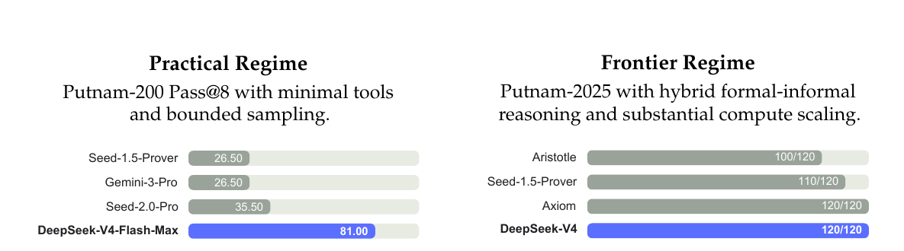{width=100%}

**智能体**

DeepSeek-V4 系列在智能体评测中也表现强劲。
对于代码智能体任务，DeepSeek-V4-Pro 的结果与 K2.6 和 GLM-5.1 相当，但这些开源模型仍整体落后于其闭源对手。
DeepSeek-V4-Flash 在代码任务上落后于 DeepSeek-V4-Pro，尤其是在 Terminal Bench 2.0 上更明显。
类似趋势也出现在其他智能体评测中。
值得注意的是，DeepSeek-V4-Pro 在 MCPAtlas 和 Toolathlon 这两个涵盖广泛工具与 MCP 服务的评测集上表现突出，这说明模型具备很强的泛化能力，而不是只在内部框架上表现好。

**1M-token 上下文**

在 MRCR 任务上，DeepSeek-V4-Pro 超过了 Gemini-3.1-Pro，但仍落后于 Claude Opus 4.6。
如原文 Figure 9 所示，在 128K 上下文窗口以内，检索性能保持了很高稳定性。
虽然超过 128K 后性能开始出现下降，但在 1M tokens 下，模型的检索能力相比开源和闭源对手依然很强。
与 MRCR 不同，CorpusQA 更接近真实应用场景。
该任务上的评测结果同样表明，DeepSeek-V4-Pro 优于 Gemini-3.1-Pro。

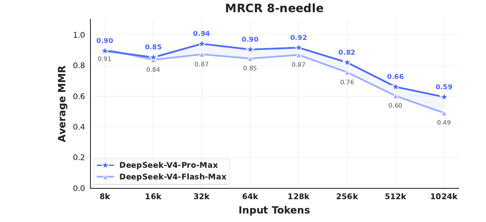{width=100%}

**推理强度**

如原文表 7 所示，使用更长上下文且在 RL 中采用更弱长度惩罚的 Max 模式，在最具挑战性的任务上普遍优于 High 模式。
原文 Figure 10 则比较了 DeepSeek-V4-Pro、DeepSeek-V4-Flash 与 DeepSeek-V3.2 在代表性推理与智能体任务上的性能与成本。
通过扩大 test-time compute，DeepSeek-V4 系列相较前代取得了显著提升。
此外，在 HLE 这类推理任务上，DeepSeek-V4-Pro 还表现出比 DeepSeek-V3.2 更高的 token 效率。

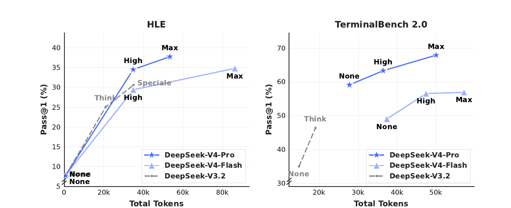{width=100%}

## 真实世界任务表现

### 中文写作

标准化基准往往难以完整覆盖真实世界任务的复杂性，因此测试结果与真实用户体验之间总会存在落差。
为弥合这一差距，我们开发了一套专有内部指标，它们更强调真实使用模式，而非传统基准形式。
这样做是为了确保模型优化真正能够转化为用户感知得到的收益。
我们的评测框架特别对齐了 DeepSeek API 和 Chatbot 的主要使用场景，使模型性能能更贴近实际需求。

中文写作是 DeepSeek 的核心使用场景之一。
我们对其功能写作与创意写作做了严格评测。
原文表 12 给出了 DeepSeek-V4-Pro 与 Gemini-3.1-Pro 在功能写作任务上的成对对比结果。
这些任务都是日常常见写作请求，prompts 通常简短直接。
之所以选择 Gemini-3.1-Pro 作为基线，是因为它在我们的中文写作外部模型评测中表现最好。
结果显示，DeepSeek-V4-Pro 以 62.7% 对 34.1% 的整体胜率超过了基线；其主要原因在于 Gemini 在中文写作场景中有时会让自身的文风偏好覆盖用户的显式要求。

原文表 13 给出了创意写作的对比结果，它沿着两个维度进行评测：指令遵循与写作质量。
与 Gemini-3.1-Pro 相比，DeepSeek-V4-Pro 在指令遵循上获得 60.0% 胜率，在写作质量上达到 77.5%，表现为前者小幅领先、后者大幅领先。
不过，如果只看最具挑战性的 prompts，尤其是那些包含高复杂度约束或多轮场景的请求，Claude Opus 4.5 仍然优于 DeepSeek-V4-Pro。
如原文表 14 所示，Claude Opus 4.5 的胜率为 52.0%，而 DeepSeek-V4-Pro 为 45.9%。

### 搜索

搜索增强问答是 DeepSeek chatbot 的核心能力之一。
在 DeepSeek web 和 app 中，"Non-think" 模式使用 Retrieval-Augmented Search (RAG)，而 "Thinking" 模式使用智能体式搜索。

**检索增强搜索**

我们对 DeepSeek-V4-Pro 与 DeepSeek-V3.2 在客观和主观 Q&A 两大类任务上做了成对评测。
如原文 Table 11 所示，DeepSeek-V4-Pro 以较大优势超过了 DeepSeek-V3.2，并在两类任务中都表现出稳定优势。
其中最明显的提升出现在 single-value search 与 planning & strategy 任务上，这说明 DeepSeek-V4-Pro 尤其擅长从检索上下文中定位精确事实，并进一步综合形成结构化方案。
不过，在 comparison 与 recommendation 任务上，DeepSeek-V3.2 依然较有竞争力，这说明 DeepSeek-V4-Pro 在需要对搜索结果进行均衡、多视角推理的场景中仍有改进空间。

**智能体式搜索**

与标准 RAG 不同，智能体式搜索允许模型针对每个 query 迭代式调用搜索与抓取工具，因此能显著增强整体搜索表现。
针对 DeepSeek-Chat 的 Thinking 模式，我们在预定义的 "thinking budget" 内对智能体式搜索功能做了专门优化，以最大化回答准确性。
如原文表 9 所示，智能体式搜索持续优于 RAG，尤其在复杂任务上优势明显。
同时，它的成本仍然很高效：从原文表 10 来看，智能体式搜索的成本只比标准 RAG 略高。

### 白领任务

为了严格评估模型在复杂企业生产力场景中的实用性，我们构建了一套包含 30 个高级中文专业任务的评测集。
这些工作流刻意覆盖高层次认知需求，包括深入信息分析、完整文档生成与精细文档编辑，并横跨 13 个关键行业，例如 finance、education、law 与 technology。
整个评测是在一个内部智能体 harness 中完成的，它提供了包括 Bash 和 web search 在内的基础工具。

由于这些任务天然开放，自动化指标往往无法准确刻画高质量回答的细微差异。
因此，我们采用了人工评估，将 DeepSeek-V4-Pro-Max 与 Opus-4.6-Max 做对比。
评审者会在盲评条件下，从四个维度评估模型输出：

- 任务完成度：核心问题是否被成功解决。
- 指令遵循：是否遵循具体约束与指令。
- 内容质量：事实准确性、逻辑连贯性与专业语气。
- 排版美观度：版式可读性与视觉呈现。

如原文 Figure 11 所示，DeepSeek-V4-Pro-Max 在多样中文白领任务上超过了 Opus-4.6-Max，non-loss rate 达到 63%，并在分析、生成与编辑三类任务上都展现出一致优势。
原文 Figure 12 给出的细分维度分数则显示，该模型最主要的优势在于任务完成度和内容质量。

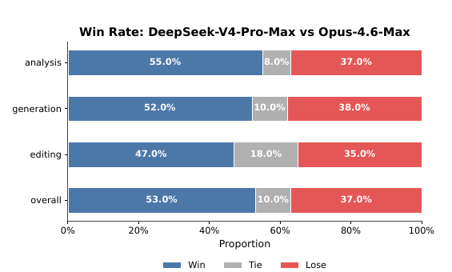{width=100%}

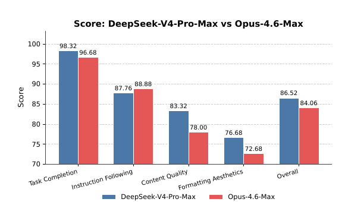{width=100%}

更具体地说，DeepSeek-V4-Pro-Max 往往能主动预判用户的隐含意图，频繁补充额外洞见与自校验步骤。
它在长篇生成上也表现更强，能输出深入且连贯的叙述，而不是像 Opus-4.6-Max 那样倾向于过度简单的 bullet points。
此外，模型在正式专业写作规范方面也更严格，例如标准化的中文分级编号。
不过，在指令遵循上，它有时会忽略某些细致的格式约束，因此略逊于 Opus。
同时，它在把长输入压缩成简洁摘要方面还不够擅长。
最后，它在排版美观度上仍有明显提升空间，尤其是演示文稿的整体视觉设计。
原文 Figure 13、Figure 14 和 Figure 15 展示了若干测试案例；由于部分输出过长，文中只展示了其中若干页面。

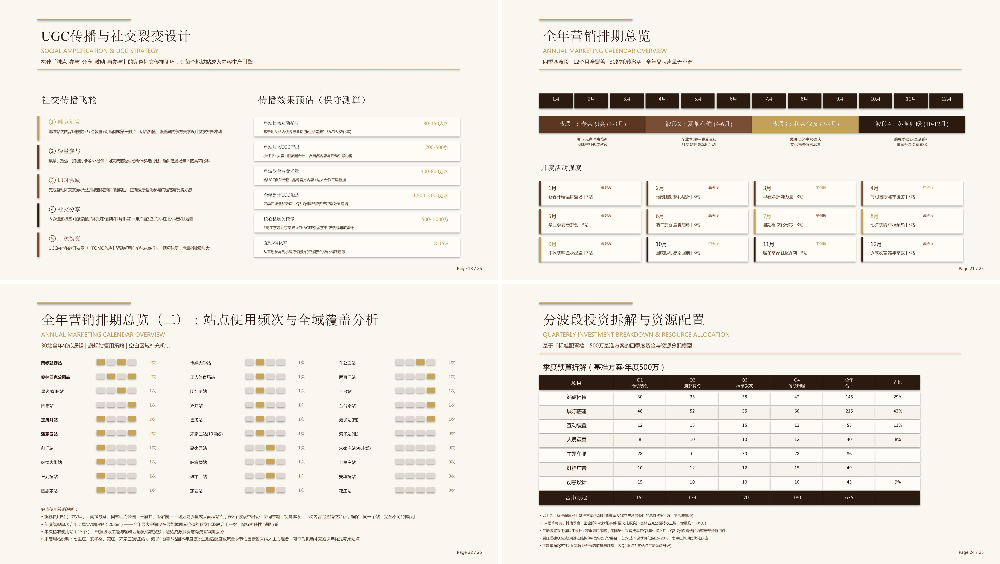{width=100%}

### 代码智能体

为了评测代码智能体能力，我们从真实的内部研发工作负载中整理了任务集。
我们从 50 多位内部工程师那里收集了约 200 个具有挑战性的任务，覆盖功能开发、缺陷修复、重构与诊断，并横跨 PyTorch、CUDA、Rust 与 C++ 等多种技术栈。
每个任务都附带原始仓库、对应执行环境，以及由人工标注的评分标准；经过严格质量过滤后，最终保留 30 个任务作为评测集。
如原文 Table 8 所示，DeepSeek-V4-Pro 明显优于 Claude Sonnet 4.5，并已接近 Claude Opus 4.5 的水平。

**表 8.** R&amp;D Coding Benchmark 对比（外部模型仅用于评测目的）。

<div style="overflow-x:auto;">
<table class="table table-sm table-striped table-hover caption-top">
<thead><tr><th>Model</th><th>Haiku 4.5</th><th>Sonnet 4.5</th><th>DeepSeek-V4-Pro-Max</th><th>Opus 4.5</th><th>Opus 4.5 Thinking</th><th>Opus 4.6 Thinking</th></tr></thead>
<tbody>
<tr><td>Pass Rate (%)</td><td>13</td><td>47</td><td>67</td><td>70</td><td>73</td><td>80</td></tr>
</tbody>
</table>
</div>

在一项针对 DeepSeek 开发者与研究人员（`N = 85`）的调查中，我们询问他们：相较其他前沿模型，DeepSeek-V4-Pro 是否已经可以作为默认且主要的代码模型。
这些受访者都在日常工作中使用过 DeepSeek-V4-Pro 做智能体式编码。
结果显示，52% 的受访者回答 yes，39% 回答 lean toward yes，而回答 no 的不到 9%。
受访者普遍认为，DeepSeek-V4-Pro 在大多数任务上都能给出令人满意的结果；不过它仍会出现一些低级错误、对模糊 prompt 的误解，以及偶尔过度思考的问题。

# 结论、局限与未来方向 {#sec-conclusion}

在本文中，我们给出了 DeepSeek-V4 系列的一个 preview 版本，其目标是构建能够打破超长上下文处理效率壁垒的下一代大语言模型。
通过结合同时集成 CSA 与 HCA 的混合注意力架构，DeepSeek-V4 系列在长序列效率上实现了显著跃升。
这些架构创新，再加上大规模的基础设施优化，使模型能够原生且高效地支持百万 token 上下文，并为未来的 test-time scaling、长时程任务，以及 online learning 等新范式建立必要基础。
评测结果表明，DeepSeek-V4-Pro-Max，也就是 DeepSeek-V4-Pro 的最大推理强度模式，重新定义了开源模型的最先进水平。
它在知识基准上显著超过此前的开源模型，在推理上逼近前沿闭源模型，并展现出具有竞争力的智能体能力。
与此同时，DeepSeek-V4-Flash-Max 在保持高成本效率架构的同时，也取得了与领先闭源模型可比的推理表现。
我们相信，DeepSeek-V4 系列为开源模型开启了百万长度上下文的新时代，并为更高的效率、更大的规模与更强的智能铺平了道路。

为了追求极致的长上下文效率，DeepSeek-V4 系列采用了一种较为大胆的架构设计。
为降低风险，我们保留了许多已经过初步验证的组件与技巧；这些做法虽然有效，但也让整体架构相对复杂。

在未来迭代中，我们会开展更系统、更 principled 的研究，把架构提炼为最本质的设计，使其在不牺牲性能的前提下更加优雅。
与此同时，尽管 Anticipatory Routing 与 SwiGLU Clamping 已被证明能够有效缓解训练不稳定性，但其底层原理仍理解不足。
我们将积极研究训练稳定性的基础问题，并加强内部指标监控，以期建立一种更 principled、更具预测性的稳定大规模训练方法。

除此之外，除了 MoE 与 sparse attention 架构之外，我们还会主动探索新的模型稀疏性维度，例如更 sparse 的 embedding modules [Cheng et al., 2026]，以在不牺牲能力的前提下进一步提升计算与内存效率。
我们也会持续研究低延迟架构与系统技术，让长上下文部署与交互更具响应性。
此外，我们认识到长时程、多轮智能体任务的重要性与实际价值，并将继续在这一方向上迭代探索。
我们也正在把多模态能力纳入模型中。
最后，我们致力于发展更好的数据构建与合成策略，以在越来越广泛的场景与任务上持续提升模型智能、鲁棒性与实际可用性。

# 参考文献 {#sec-references}

<div class="small">
<p>AA. Gdpval-aa leaderboard, 2025. URL https://artificialanalysis.ai/methodology/intelligence-benchmarking#gdpval-aa.</p>
<p>T. Achim, A. Best, A. Bietti, K. Der, M. Fédérico, S. Gukov, D. Halpern-Leistner, K. Henningsgard, Y. Kudryashov, A. Meiburg, et al. Aristotle: Imo-level automated theorem proving. arXiv preprint arXiv:2510.01346, 2025.</p>
<p>A. Agache, M. Brooker, A. Florescu, A. Iordache, A. Liguori, R. Neugebauer, P. Piwonka, and D.-M. Popa. Firecracker: lightweight virtualization for serverless applications. In Proceedings of the 17th Usenix Conference on Networked Systems Design and Implementation, NSDI’20, page 419–434, USA, 2020. USENIX Association. ISBN 9781939133137.</p>
<p>O. J. Aimuyo, B. Oh, and R. Singh. Flashmoe: Fast distributed moe in a single kernel. Advances in Neural Information Processing Systems, 2025. URL https://neurips.cc/virtual/2025/poster/119124.</p>
<p>J. Ainslie, J. Lee-Thorp, M. de Jong, Y. Zemlyanskiy, F. Lebrón, and S. Sanghai. Gqa: Training generalized multi-query transformer models from multi-head checkpoints. arXiv preprint arXiv:2305.13245, 2023.</p>
<p>J. Asher. LeanExplore: A search engine for Lean 4 declarations, 2025. URL https://arxiv.org/abs/2506.11085.</p>
<p>Y. Bai, Y. Bao, G. Chen, J. Chen, N. Chen, R. Chen, Y. Chen, Y. Chen, Y. Chen, Z. Chen, J. Cui, H. Ding, M. Dong, A. Du, C. Du, D. Du, Y. Du, Y. Fan, Y. Feng, K. Fu, B. Gao, H. Gao, P. Gao, T. Gao, X. Gu, L. Guan, H. Guo, J. Guo, H. Hu, X. Hao, T. He, W. He, W. He, C. Hong, Y. Hu, Z. Hu, W. Huang, Z. Huang, Z. Huang, T. Jiang, Z. Jiang, X. Jin, Y. Kang, G. Lai, C. Li, F. Li, H. Li, M. Li, W. Li, Y. Li, Y. Li, Z. Li, Z. Li, H. Lin, X. Lin, Z. Lin, C. Liu, C. Liu, H. Liu, J. Liu, J. Liu, L. Liu, S. Liu, T. Y. Liu, T. Liu, W. Liu, Y. Liu, Y. Liu, Y. Liu, Y. Liu, Z. Liu, E. Lu, L. Lu, S. Ma, X. Ma, Y. Ma, S. Mao, J. Mei, X. Men, Y. Miao, S. Pan, Y. Peng, R. Qin, B. Qu, Z. Shang, L. Shi, S. Shi, F. Song, J. Su, Z. Su, X. Sun, F. Sung, H. Tang, J. Tao, Q. Teng, C. Wang, D. Wang, F. Wang, and H. Wang. Kimi K2: open agentic intelligence. CoRR, abs/2507.20534, 2025a. URL https://doi.org/10.48550/arXiv.2507.20534.</p>
<p>Y. Bai, S. Tu, J. Zhang, H. Peng, X. Wang, X. Lv, S. Cao, J. Xu, L. Hou, Y. Dong, et al. Longbench v2: Towards deeper understanding and reasoning on realistic long-context multitasks. In Proceedings of the 63rd Annual Meeting of the Association for Computational Linguistics (Volume 1: Long Papers), pages 3639–3664, 2025b.</p>
<p>M. Balunović, J. Dekoninck, I. Petrov, N. Jovanović, and M. Vechev. Matharena: Evaluating llms on uncontaminated math competitions. Proceedings of the Neural Information Processing Systems Track on Datasets and Benchmark, 2025.</p>
<p>C. Bandi, B. Hertzberg, G. Boo, T. Polakam, J. Da, S. Hassaan, M. Sharma, A. Park, E. Hernandez, D. Rambado, et al. Mcp-atlas: A large-scale benchmark for tool-use competency with real mcp servers. arXiv preprint arXiv:2602.00933, 2026.</p>
<p>F. Bellard. Qemu, a fast and portable dynamic translator. In Proceedings of the Annual Conference on USENIX Annual Technical Conference, ATEC ’05, page 41, USA, 2005. USENIX Association.</p>
<p>I. Bello, H. Pham, Q. V. Le, M. Norouzi, and S. Bengio. Neural combinatorial optimization with reinforcement learning, 2017. URL https://openreview.net/forum?id=rJY3vK9eg.</p>
<p>J. Chen, W. Chen, J. Du, J. Hu, Z. Jiang, A. Jie, X. Jin, X. Jin, C. Li, W. Shi, Z. Wang, M. Wang, C. Wei, S. Wei, H. Xin, F. Yang, W. Gao, Z. Yuan, T. Zhan, Z. Zheng, T. Zhou, and T. H. Zhu. Seed-prover 1.5: Mastering undergraduate-level theorem proving via learning from experience, 2025. URL https://arxiv.org/abs/2512.17260.</p>
<p>M. Chen, J. Tworek, H. Jun, Q. Yuan, H. P. de Oliveira Pinto, J. Kaplan, H. Edwards, Y. Burda, N. Joseph, G. Brockman, A. Ray, R. Puri, G. Krueger, M. Petrov, H. Khlaaf, G. Sastry, P. Mishkin, B. Chan, S. Gray, N. Ryder, M. Pavlov, A. Power, L. Kaiser, M. Bavarian, C. Winter, P. Tillet, F. P. Such, D. Cummings, M. Plappert, F. Chantzis, E. Barnes, A. Herbert-Voss, W. H. Guss, A. Nichol, A. Paino, N. Tezak, J. Tang, I. Babuschkin, S. Balaji, S. Jain, W. Saunders, C. Hesse, A. N. Carr, J. Leike, J. Achiam, V. Misra, E. Morikawa, A. Radford, M. Knight, M. Brundage, M. Murati, K. Mayer, P. Welinder, B. McGrew, D. Amodei, S. McCandlish, I. Sutskever, and W. Zaremba. Evaluating large language models trained on code. CoRR, abs/2107.03374, 2021. URL https://arxiv.org/abs/2107.03374.</p>
<p>T. Chen, T. Moreau, Z. Jiang, L. Zheng, E. Yan, H. Shen, M. Cowan, L. Wang, Y. Hu, L. Ceze, C. Guestrin, and A. Krishnamurthy. TVM: An automated End-to-End optimizing compiler for deep learning. In 13th USENIX Symposium on Operating Systems Design and Implementation (OSDI 18), pages 578–594, Carlsbad, CA, Oct. 2018. USENIX Association. ISBN 978-1-939133-08-3. URL https://www.usenix.org/conference/osdi18/presentation/chen.</p>
<p>A. Cheng, A. Jacovi, A. Globerson, B. Golan, C. Kwong, C. Alberti, C. Tao, E. Ben-David, G. S. Tomar, L. Haas, et al. The facts leaderboard: A comprehensive benchmark for large language model factuality. arXiv preprint arXiv:2512.10791, 2025.</p>
<p>X. Cheng, W. Zeng, D. Dai, Q. Chen, B. Wang, Z. Xie, K. Huang, X. Yu, Z. Hao, Y. Li, H. Zhang, H. Zhang, D. Zhao, and W. Liang. Conditional memory via scalable lookup: A new axis of sparsity for large language models. CoRR, abs/2601.07372, 2026. doi: 10.48550/ARXIV.2601.07372. URL https://doi.org/10.48550/arXiv.2601.07372.</p>
<p>K. Cobbe, V. Kosaraju, M. Bavarian, M. Chen, H. Jun, L. Kaiser, M. Plappert, J. Tworek, J. Hilton, R. Nakano, et al. Training verifiers to solve math word problems. arXiv preprint arXiv:2110.14168, 2021.</p>
<p>D. Dai, C. Deng, C. Zhao, R. X. Xu, H. Gao, D. Chen, J. Li, W. Zeng, X. Yu, Y. Wu, Z. Xie, Y. K. Li, P. Huang, F. Luo, C. Ruan, Z. Sui, and W. Liang. Deepseekmoe: Towards ultimate expert specialization in mixture-of-experts language models. CoRR, abs/2401.06066, 2024. URL https://doi.org/10.48550/arXiv.2401.06066.</p>
<p>T. Dao, D. Haziza, F. Massa, and G. Sizov. Flash-decoding for long-context inference, 2023. URL https://pytorch.org/blog/flash-decoding/.</p>
<p>L. De Moura and N. Bjørner. Z3: an efficient smt solver. In Proceedings of the Theory and Practice of Software, 14th International Conference on Tools and Algorithms for the Construction and Analysis of Systems, TACAS’08/ETAPS’08, page 337–340, Berlin, Heidelberg, 2008. Springer-Verlag. ISBN 3540787992.</p>
<p>DeepSeek-AI. Deepseek-coder-v2: Breaking the barrier of closed-source models in code intelligence. CoRR, abs/2406.11931, 2024. URL https://doi.org/10.48550/arXiv.2406.11931.</p>
<p>DeepSeek-AI. Deepseek-v3 technical report. CoRR, abs/2412.19437, 2024. URL https://doi.org/10.48550/arXiv.2412.19437.</p>
<p>DeepSeek-AI. Deepseek-v2: A strong, economical, and efficient mixture-of-experts language model. CoRR, abs/2405.04434, 2024. URL https://doi.org/10.48550/arXiv.2405.04434.</p>
<p>DeepSeek-AI. Fire-flyer file system, 2025. URL https://github.com/deepseek-ai/3FS.</p>
<p>DeepSeek-AI. Deepseek-r1 incentivizes reasoning in llms through reinforcement learning. Nat., 645(8081):633–638, 2025. URL https://doi.org/10.1038/s41586-025-09422-z.</p>
<p>DeepSeek-AI. Deepseek-v3.2: Pushing the frontier of open large language models, 2025. URL https://arxiv.org/abs/2512.02556.</p>
<p>X. Deng, J. Da, E. Pan, Y. Y. He, C. Ide, K. Garg, N. Lauffer, A. Park, N. Pasari, C. Rane, K. Sampath, M. Krishnan, S. Kundurthy, S. Hendryx, Z. Wang, V. Bharadwaj, J. Holm, R. Aluri, C. B. C. Zhang, N. Jacobson, B. Liu, and B. Kenstler. Swe-bench pro: Can ai agents solve long-horizon software engineering tasks?, 2025. URL https://arxiv.org/abs/2509.16941.</p>
<p>H. Ding, Z. Wang, G. Paolini, V. Kumar, A. Deoras, D. Roth, and S. Soatto. Fewer truncations improve language modeling. arXiv preprint arXiv:2404.10830, 2024.</p>
<p>X. Dong, Y. Fu, S. Diao, W. Byeon, Z. CHEN, A. S. Mahabaleshwarkar, S.-Y. Liu, M. V. keirsbilck, M.-H. Chen, Y. Suhara, Y. C. Lin, J. Kautz, and P. Molchanov. Hymba: A hybrid-head architecture for small language models. In The Thirteenth International Conference on Learning Representations, 2025. URL https://openreview.net/forum?id=A1ztozypga.</p>
<p>X. Du, Y. Yao, K. Ma, B. Wang, T. Zheng, K. Zhu, M. Liu, Y. Liang, X. Jin, Z. Wei, et al. Supergpqa: Scaling llm evaluation across 285 graduate disciplines. arXiv preprint arXiv:2502.14739, 2025.</p>
<p>D. Dua, Y. Wang, P. Dasigi, G. Stanovsky, S. Singh, and M. Gardner. DROP: A reading comprehension benchmark requiring discrete reasoning over paragraphs. In J. Burstein, C. Doran, and T. Solorio, editors, Proceedings of the 2019 Conference of the North American Chapter of the Association for Computational Linguistics: Human Language Technologies, NAACL-HLT 2019, Minneapolis, MN, USA, June 2-7, 2019, Volume 1 (Long and Short Papers), pages 2368–2378. Association for Computational Linguistics, 2019. doi: 10.18653/V1/N19-1246. URL https://doi.org/10.18653/v1/n19-1246.</p>
<p>X. Gao, M. Dong, X. Miao, W. Du, C. Yu, and H. Chen. Erofs: a compression-friendly readonly file system for resource-scarce devices. In Proceedings of the 2019 USENIX Conference on Usenix Annual Technical Conference, USENIX ATC ’19, page 149–162, USA, 2019. USENIX Association. ISBN 9781939133038.</p>
<p>A. P. Gema, J. O. J. Leang, G. Hong, A. Devoto, A. C. M. Mancino, R. Saxena, X. He, Y. Zhao, X. Du, M. R. G. Madani, C. Barale, R. McHardy, J. Harris, J. Kaddour, E. van Krieken, and P. Minervini. Are we done with mmlu? CoRR, abs/2406.04127, 2024. URL https://doi.org/10.48550/arXiv.2406.04127.</p>
<p>F. Gloeckle, B. Y. Idrissi, B. Rozière, D. Lopez-Paz, and G. Synnaeve. Better &amp; faster large language models via multi-token prediction. In Forty-first International Conference on Machine Learning, ICML 2024, Vienna, Austria, July 21-27, 2024. OpenReview.net, 2024. URL https://openreview.net/forum?id=pEWAcejiU2.</p>
<p>L. Haas, G. Yona, G. D’Antonio, S. Goldshtein, and D. Das. Simpleqa verified: A reliable factuality benchmark to measure parametric knowledge. arXiv preprint arXiv:2509.07968, 2025.</p>
<p>Y. He, S. Li, J. Liu, Y. Tan, W. Wang, H. Huang, X. Bu, H. Guo, C. Hu, B. Zheng, et al. Chinese simpleqa: A chinese factuality evaluation for large language models. arXiv preprint arXiv:2411.07140, 2024.</p>
<p>D. Hendrycks, C. Burns, S. Basart, A. Zou, M. Mazeika, D. Song, and J. Steinhardt. Measuring massive multitask language understanding. arXiv preprint arXiv:2009.03300, 2020.</p>
<p>D. Hendrycks, C. Burns, S. Kadavath, A. Arora, S. Basart, E. Tang, D. Song, and J. Steinhardt. Measuring mathematical problem solving with the math dataset. arXiv preprint arXiv:2103.03874, 2021.</p>
<p>Y. Huang, Y. Bai, Z. Zhu, J. Zhang, J. Zhang, T. Su, J. Liu, C. Lv, Y. Zhang, J. Lei, et al. C-Eval: A multi-level multi-discipline chinese evaluation suite for foundation models. arXiv preprint arXiv:2305.08322, 2023.</p>
<p>D. Hupkes and N. Bogoychev. Multiloko: a multilingual local knowledge benchmark for llms spanning 31 languages. CoRR, abs/2504.10356, 2025. doi: 10.48550/ARXIV.2504.10356. URL https://doi.org/10.48550/arXiv.2504.10356.</p>
<p>B. Jacob, S. Kligys, B. Chen, M. Zhu, M. Tang, A. Howard, H. Adam, and D. Kalenichenko. Quantization and training of neural networks for efficient integer-arithmetic-only inference. In Proceedings of the IEEE Conference on Computer Vision and Pattern Recognition (CVPR), June 2018.</p>
<p>N. Jain, K. Han, A. Gu, W.-D. Li, F. Yan, T. Zhang, S. Wang, A. Solar-Lezama, K. Sen, and I. Stoica. Livecodebench: Holistic and contamination free evaluation of large language models for code. arXiv preprint arXiv:2403.07974, 2024.</p>
<p>K. Jordan, Y. Jin, V. Boza, J. You, F. Cesista, L. Newhouse, and J. Bernstein. Muon: An optimizer for hidden layers in neural networks. Cited on, page 10, 2024.</p>
<p>M. Joshi, E. Choi, D. Weld, and L. Zettlemoyer. TriviaQA: A large scale distantly supervised challenge dataset for reading comprehension. In R. Barzilay and M.-Y. Kan, editors, Proceedings of the 55th Annual Meeting of the Association for Computational Linguistics (Volume 1: Long Papers), pages 1601–1611, Vancouver, Canada, July 2017. Association for Computational Linguistics. doi: 10.18653/v1/P17-1147. URL https://aclanthology.org/P17-1147.</p>
<p>H. Li, Y. Yuan, R. Du, K. Ma, L. Liu, and W. Hsu. DADI: Block-Level image service for agile and elastic application deployment. In 2020 USENIX Annual Technical Conference (USENIX ATC 20), pages 727–740. USENIX Association, July 2020. ISBN 978-1-939133-14-4. URL https://www.usenix.org/conference/atc20/presentation/li-huiba.</p>
<p>H. Li, Y. Zhang, F. Koto, Y. Yang, H. Zhao, Y. Gong, N. Duan, and T. Baldwin. CMMLU: Measuring massive multitask language understanding in Chinese. arXiv preprint arXiv:2306.09212, 2023.</p>
<p>J. Li, W. Zhao, J. Zhao, W. Zeng, H. Wu, X. Wang, R. Ge, Y. Cao, Y. Huang, W. Liu, et al. The tool decathlon: Benchmarking language agents for diverse, realistic, and long-horizon task execution. arXiv preprint arXiv:2510.25726, 2025.</p>
<p>Y. Li, F. Wei, C. Zhang, and H. Zhang. EAGLE: speculative sampling requires rethinking feature uncertainty. In Forty-first International Conference on Machine Learning, ICML 2024, Vienna, Austria, July 21-27, 2024. OpenReview.net, 2024. URL https://openreview.net/forum?id=1NdN7eXyb4.</p>
<p>J. Liu, J. Su, X. Yao, Z. Jiang, G. Lai, Y. Du, Y. Qin, W. Xu, E. Lu, J. Yan, Y. Chen, H. Zheng, Y. Liu, S. Liu, B. Yin, W. He, H. Zhu, Y. Wang, J. Wang, M. Dong, Z. Zhang, Y. Kang, H. Zhang, X. Xu, Y. Zhang, Y. Wu, X. Zhou, and Z. Yang. Muon is scalable for LLM training. CoRR, abs/2502.16982, 2025. URL https://doi.org/10.48550/arXiv.2502.16982.</p>
<p>I. Loshchilov and F. Hutter. Decoupled weight decay regularization. arXiv preprint arXiv:1711.05101, 2017.</p>
<p>K. Lu and T. M. Lab. On-policy distillation. Thinking Machines Lab: Connectionism, 2025. doi: 10.64434/tml.20251026. URL https://thinkingmachines.ai/blog/on-policy-distillation.</p>
<p>Z. Lu, C. Li, Y. Shi, W. Shen, M. Yan, and F. Huang. Corpusqa: A 10 million token benchmark for corpus-level analysis and reasoning. arXiv preprint arXiv:2601.14952, 2026.</p>
<p>T. Luong, D. Hwang, H. H. Nguyen, G. Ghiasi, Y. Chervonyi, I. Seo, J. Kim, G. Bingham, J. Lee, S. Mishra, A. Zhai, C. H. Hu, H. Michalewski, J. Kim, J. Ahn, J. Bae, X. Song, T. H. Trinh, Q. V. Le, and J. Jung. Towards robust mathematical reasoning. In Proceedings of the 2025 Conference on Empirical Methods in Natural Language Processing, 2025. URL https://aclanthology.org/2025.emnlp-main.1794/.</p>
<p>M. A. Merrill, A. G. Shaw, N. Carlini, B. Li, H. Raj, I. Bercovich, L. Shi, J. Y. Shin, T. Walshe, E. K. Buchanan, et al. Terminal-bench: Benchmarking agents on hard, realistic tasks in command line interfaces. arXiv preprint arXiv:2601.11868, 2026.</p>
<p>MiniMax. Meet minimax-m2, 2025. URL https://github.com/MiniMax-AI/MiniMax-M2.</p>
<p>L. d. Moura and S. Ullrich. The lean 4 theorem prover and programming language. In International Conference on Automated Deduction, pages 625–635. Springer, 2021.</p>
<p>Y. Nesterov. A method of solving a convex programming problem with convergence rate 𝑂 (1/𝑘2 ). Soviet Mathematics Doklady, 27:372–376, 1983.</p>
<p>NVIDIA Corporation. cublas documentation, 2024. URL https://docs.nvidia.com/cuda/cublas/. Version 12.4. Accessed: 2024-09-16.</p>
<p>OpenAI. Multilingual massive multitask language understanding (mmmlu), 2024a. URL https://huggingface.co/datasets/openai/MMMLU.</p>
<p>OpenAI. Openai mrcr: Long context multiple needle in a haystack benchmark, 2024b. URL https://huggingface.co/datasets/openai/mrcr.</p>
<p>OpenAI. Learning to reason with llms, 2024c. URL https://openai.com/index/learning-to-reason-with-llms.</p>
<p>OpenAI. Introducing SimpleQA, 2024d. URL https://openai.com/index/introducing-simpleqa/.</p>
<p>OpenAI. Introducing SWE-bench verified, 2024e. URL https://openai.com/index/introducing-swe-bench-verified/.</p>
<p>OpenAI. gpt-oss-120b &amp; gpt-oss-20b model card. CoRR, abs/2508.10925, 2025. doi: 10.48550/ARXIV.2508.10925. URL https://doi.org/10.48550/arXiv.2508.10925.</p>
<p>M. Osama, D. Merrill, C. Cecka, M. Garland, and J. D. Owens. Stream-k: Work-centric parallel decomposition for dense matrix-matrix multiplication on the gpu. In Proceedings of the 28th ACM SIGPLAN Annual Symposium on Principles and Practice of Parallel Programming, pages 429–431, 2023.</p>
<p>T. Patwardhan, R. Dias, E. Proehl, G. Kim, M. Wang, O. Watkins, S. P. Fishman, M. Aljubeh, P. Thacker, L. Fauconnet, et al. Gdpval: Evaluating ai model performance on real-world economically valuable tasks. arXiv preprint arXiv:2510.04374, 2025.</p>
<p>L. Phan, A. Gatti, Z. Han, N. Li, J. Hu, H. Zhang, C. B. C. Zhang, M. Shaaban, J. Ling, S. Shi, et al. Humanity’s last exam. arXiv preprint arXiv:2501.14249, 2025.</p>
<p>W. Qi, Y. Yan, Y. Gong, D. Liu, N. Duan, J. Chen, R. Zhang, and M. Zhou. Prophetnet: Predicting future n-gram for sequence-to-sequence pre-training. In T. Cohn, Y. He, and Y. Liu, editors, Findings of the Association for Computational Linguistics: EMNLP 2020, Online Event, 16-20 November 2020, volume EMNLP 2020 of Findings of ACL, pages 2401–2410. Association for Computational Linguistics, 2020. URL https://doi.org/10.18653/v1/2020.findings-emnlp.217.</p>
<p>Qwen. Qwen3 technical report. CoRR, abs/2505.09388, 2025. doi: 10.48550/ARXIV.2505.09388. URL https://doi.org/10.48550/arXiv.2505.09388.</p>
<p>S. Rajbhandari, J. Rasley, O. Ruwase, and Y. He. Zero: Memory optimizations toward training trillion parameter models. In SC20: International Conference for High Performance Computing, Networking, Storage and Analysis, pages 1–16. IEEE, 2020.</p>
<p>J. K. Reed, Z. DeVito, H. He, A. Ussery, and J. Ansel. Torch.fx: Practical program capture and transformation for deep learning in python, 2022. URL https://arxiv.org/abs/2112.08429.</p>
<p>D. Rein, B. L. Hou, A. C. Stickland, J. Petty, R. Y. Pang, J. Dirani, J. Michael, and S. R. Bowman. GPQA: A graduate-level google-proof q&amp;a benchmark. arXiv preprint arXiv:2311.12022, 2023.</p>
<p>G. T. M. Riviere, S. Pathak, P. G. Sessa, C. Hardin, S. Bhupatiraju, L. Hussenot, T. Mesnard, B. Shahriari, A. Ram’e, J. Ferret, P. Liu, P. D. Tafti, A. Friesen, M. Casbon, S. Ramos, R. Kumar, C. L. Lan, S. Jerome, A. Tsitsulin, N. Vieillard, P. Stańczyk, S. Girgin, N. Momchev, M. Hoffman, S. Thakoor, J.-B. Grill, B. Neyshabur, A. Walton, A. Severyn, A. Parrish, A. Ahmad, A. Hutchison, A. Abdagic, A. Carl, A. Shen, A. Brock, A. Coenen, A. Laforge, A. Paterson, B. Bastian, B. Piot, B. Wu, B. Royal, C. Chen, C. Kumar, C. Perry, C. A. Welty, C. A. Choquette-Choo, D. Sinopalnikov, D. Weinberger, D. Vijaykumar, D. Rogozi’nska, D. Herbison, E. Bandy, E. Wang, E. Noland, E. Moreira, E. Senter, E. Eltyshev, F. Visin, G. Rasskin, G. Wei, G. Cameron, G. Martins, H. Hashemi, H. Klimczak-Pluci’nska, H. Batra, H. Dhand, I. Nardini, J. Mein, J. Zhou, J. Svensson, J. Stanway, J. Chan, J. Zhou, J. Carrasqueira, J. Iljazi, J. Becker, J. Fernandez, J. R. van Amersfoort, J. Gordon, J. Lipschultz, J. Newlan, J. Ji, K. Mohamed, K. Badola, K. Black, K. Millican, K. McDonell, K. Nguyen, K. Sodhia, K. Greene, L. L. Sjoesund, L. Usui, L. Sifre, L. Heuermann, L. cia Lago, L. McNealus, L. B. Soares, L. Kilpatrick, L. Dixon, L. L. B. Martins, M. Reid, M. Singh, M. Iverson, M. Gorner, M. Velloso, M. Wirth, M. Davidow, M. Miller, M. Rahtz, M. Watson, M. Risdal, M. Kazemi, M. Moynihan, M. Zhang, M. Kahng, M. Park, M. Rahman, M. Khatwani, N. Dao, N. shad Bardoliwalla, N. Devanathan, N. Dumai, N. Chauhan, O. Wahltinez, P. Botarda, P. Barnes, P. Barham, P. Michel, P. chong Jin, P. Georgiev, P. Culliton, P. Kuppala, R. Comanescu, R. Merhej, R. Jana, R. A. Rokni, R. Agarwal, R. Mullins, S. Saadat, S. M. M. Carthy, S. Perrin, S. M. R. Arnold, S. bastian Krause, S. Dai, S. Garg, S. Sheth, S. Ronstrom, S. Chan, T. Jordan, T. Yu, T. Eccles, T. Hennigan, T. Kociský, T. Doshi, V. Jain, V. Yadav, V. Meshram, V. Dharmadhikari, W. Barkley, W. Wei, W. Ye, W. Han, W. Kwon, X. Xu, Z. Shen, Z. Gong, Z. Wei, V. Cotruta, P. Kirk, A. Rao, M. Giang, L. Peran, T. Warkentin, E. Collins, J. Barral, Z. Ghahramani, R. Hadsell, D. Sculley, J. Banks, A. Dragan, S. Petrov, O. Vinyals, J. Dean, D. Hassabis, K. Kavukcuoglu, C. Farabet, E. Buchatskaya, S. Borgeaud, N. Fiedel, A. Joulin, K. Kenealy, R. Dadashi, and A. Andreev. Gemma 2: Improving open language models at a practical size. arXiv preprint arXiv:2408.00118, 2024.</p>
<p>S. Roller, S. Sukhbaatar, A. Szlam, and J. Weston. Hash layers for large sparse models. In M. Ranzato, A. Beygelzimer, Y. N. Dauphin, P. Liang, and J. W. Vaughan, editors, Advances in Neural Information Processing Systems 34: Annual Conference on Neural Information Processing Systems 2021, NeurIPS 2021, December 6-14, 2021, virtual, pages 17555–17566, 2021. URL https://proceedings.neurips.cc/paper/2021/hash/92bf5e6240737e0326ea59846a83e076-Abstract.html.</p>
<p>B. D. Rouhani, R. Zhao, A. More, M. Hall, A. Khodamoradi, S. Deng, D. Choudhary, M. Cornea, E. Dellinger, K. Denolf, S. Dusan, V. Elango, M. Golub, A. Heinecke, P. James-Roxby, D. Jani, G. Kolhe, M. Langhammer, A. Li, L. Melnick, M. Mesmakhosroshahi, A. Rodriguez, M. Schulte, R. Shafipour, L. Shao, M. Siu, P. Dubey, P. Micikevicius, M. Naumov, C. Verrilli, R. Wittig, D. Burger, and E. Chung. Microscaling data formats for deep learning, 2023.</p>
<p>K. Sakaguchi, R. L. Bras, C. Bhagavatula, and Y. Choi. Winogrande: An adversarial winograd schema challenge at scale, 2019.</p>
<p>Z. Shao, Y. Luo, C. Lu, Z. Z. Ren, J. Hu, T. Ye, Z. Gou, S. Ma, and X. Zhang. Deepseekmath-v2: Towards self-verifiable mathematical reasoning, 2025. URL https://arxiv.org/abs/2511.22570.</p>
<p>N. Shazeer. Fast transformer decoding: One write-head is all you need. CoRR, abs/1911.02150, 2019. URL http://arxiv.org/abs/1911.02150.</p>
<p>N. Shazeer. Glu variants improve transformer. arXiv preprint arXiv:2002.05202, 2020.</p>
<p>F. Shi, M. Suzgun, M. Freitag, X. Wang, S. Srivats, S. Vosoughi, H. W. Chung, Y. Tay, S. Ruder, D. Zhou, D. Das, and J. Wei. Language models are multilingual chain-of-thought reasoners. In The Eleventh International Conference on Learning Representations, ICLR 2023, Kigali, Rwanda, May 1-5, 2023. OpenReview.net, 2023. URL https://openreview.net/forum?id=fR3wGCk-IXp.</p>
<p>J. Su, M. Ahmed, Y. Lu, S. Pan, W. Bo, and Y. Liu. Roformer: Enhanced transformer with rotary position embedding. Neurocomputing, 568:127063, 2024.</p>
<p>M. Suzgun, N. Scales, N. Schärli, S. Gehrmann, Y. Tay, H. W. Chung, A. Chowdhery, Q. V. Le, E. H. Chi, D. Zhou, et al. Challenging big-bench tasks and whether chain-of-thought can solve them. arXiv preprint arXiv:2210.09261, 2022.</p>
<p>G. Tsoukalas, J. Lee, J. Jennings, J. Xin, M. Ding, M. Jennings, A. Thakur, and S. Chaudhuri. Putnambench: Evaluating neural theorem-provers on the putnam mathematical competition, 2024. URL https://arxiv.org/abs/2407.11214.</p>
<p>A. Vaswani, N. Shazeer, N. Parmar, J. Uszkoreit, L. Jones, A. N. Gomez, Ł. Kaiser, and I. Polosukhin. Attention is all you need. Advances in neural information processing systems, 30, 2017.</p>
<p>L. Wang, H. Gao, C. Zhao, X. Sun, and D. Dai. Auxiliary-loss-free load balancing strategy for mixture-of-experts. CoRR, abs/2408.15664, 2024a. URL https://doi.org/10.48550/arXiv.2408.15664.</p>
<p>L. Wang, Y. Cheng, Y. Shi, Z. Mo, Z. Tang, W. Xie, T. Wu, L. Ma, Y. Xia, J. Xue, et al. Tilelang: Bridge programmability and performance in modern neural kernels. In The Fourteenth International Conference on Learning Representations, 2026.</p>
<p>Y. Wang, X. Ma, G. Zhang, Y. Ni, A. Chandra, S. Guo, W. Ren, A. Arulraj, X. He, Z. Jiang, T. Li, M. Ku, K. Wang, A. Zhuang, R. Fan, X. Yue, and W. Chen. Mmlu-pro: A more robust and challenging multi-task language understanding benchmark. CoRR, abs/2406.01574, 2024b. URL https://doi.org/10.48550/arXiv.2406.01574.</p>
<p>J. Wei, Z. Sun, S. Papay, S. McKinney, J. Han, I. Fulford, H. W. Chung, A. T. Passos, W. Fedus, and A. Glaese. Browsecomp: A simple yet challenging benchmark for browsing agents. arXiv preprint arXiv:2504.12516, 2025.</p>
<p>T. Wei, J. Luan, W. Liu, S. Dong, and B. Wang. Cmath: Can your language model pass chinese elementary school math test?, 2023.</p>
<p>G. Xiao, Y. Tian, B. Chen, S. Han, and M. Lewis. Efficient streaming language models with attention sinks. In The Twelfth International Conference on Learning Representations, ICLR 2024, Vienna, Austria, May 7-11, 2024. OpenReview.net, 2024. URL https://openreview.net/forum?id=NG7sS51zVF.</p>
<p>Z. Xie, Y. Wei, H. Cao, C. Zhao, C. Deng, J. Li, D. Dai, H. Gao, J. Chang, K. Yu, L. Zhao, S. Zhou, Z. Xu, Z. Zhang, W. Zeng, S. Hu, Y. Wang, J. Yuan, L. Wang, and W. Liang. mhc: Manifold-constrained hyper-connections, 2026. URL https://arxiv.org/abs/2512.24880.</p>
<p>L. Xu, H. Hu, X. Zhang, L. Li, C. Cao, Y. Li, Y. Xu, K. Sun, D. Yu, C. Yu, Y. Tian, Q. Dong, W. Liu, B. Shi, Y. Cui, J. Li, J. Zeng, R. Wang, W. Xie, Y. Li, Y. Patterson, Z. Tian, Y. Zhang, H. Zhou, S. Liu, Z. Zhao, Q. Zhao, C. Yue, X. Zhang, Z. Yang, K. Richardson, and Z. Lan. CLUE: A chinese language understanding evaluation benchmark. In D. Scott, N. Bel, and C. Zong, editors, Proceedings of the 28th International Conference on Computational Linguistics, COLING 2020, Barcelona, Spain (Online), December 8-13, 2020, pages 4762–4772. International Committee on Computational Linguistics, 2020. doi: 10.18653/V1/2020.COLING-MAIN.419. URL https://doi.org/10.18653/v1/2020.coling-main.419.</p>
<p>J. Yang, K. Lieret, C. E. Jimenez, A. Wettig, K. Khandpur, Y. Zhang, B. Hui, O. Press, L. Schmidt, and D. Yang. Swe-smith: Scaling data for software engineering agents, 2025. URL https://arxiv.org/abs/2504.21798.</p>
<p>R. Zellers, A. Holtzman, Y. Bisk, A. Farhadi, and Y. Choi. HellaSwag: Can a machine really finish your sentence? In A. Korhonen, D. R. Traum, and L. Màrquez, editors, Proceedings of the 57th Conference of the Association for Computational Linguistics, ACL 2019, Florence, Italy, July 28-August 2, 2019, Volume 1: Long Papers, pages 4791–4800. Association for Computational Linguistics, 2019. doi: 10.18653/v1/p19-1472. URL https://doi.org/10.18653/v1/p19-1472.</p>
<p>C. Zhang, K. Du, S. Liu, W. Kwon, X. Mo, Y. Wang, X. Liu, K. You, Z. Li, M. Long, J. Zhai, J. Gonzalez, and I. Stoica. Jenga: Effective memory management for serving llm with heterogeneity. In Proceedings of the ACM SIGOPS 31st Symposium on Operating Systems Principles, SOSP ’25, page 446–461, New York, NY, USA, 2025a. Association for Computing Machinery. ISBN 9798400718700. doi: 10.1145/3731569.3764823. URL https://doi.org/10.1145/3731569.3764823.</p>
<p>S. Zhang, N. Zheng, H. Lin, Z. Jiang, W. Bao, C. Jiang, Q. Hou, W. Cui, S. Zheng, L.-W. Chang, Q. Chen, and X. Liu. Comet: Fine-grained computation-communication overlapping for mixture-of-experts. 2025b. URL https://arxiv.org/abs/2502.19811.</p>
<p>C. Zhao, L. Zhao, J. Li, Z. Xu, and C. Xu. Deepgemm: clean and efficient fp8 gemm kernels with fine-grained scaling, 2025. URL https://github.com/deepseek-ai/DeepGEMM.</p>
<p>W. Zhong, R. Cui, Y. Guo, Y. Liang, S. Lu, Y. Wang, A. Saied, W. Chen, and N. Duan. AGIEval: A human-centric benchmark for evaluating foundation models. CoRR, abs/2304.06364, 2023. doi: 10.48550/arXiv.2304.06364. URL https://doi.org/10.48550/arXiv.2304.06364.</p>
<p>D. Zhu, H. Huang, Z. Huang, Y. Zeng, Y. Mao, B. Wu, Q. Min, and X. Zhou. Hyper-connections. In The Thirteenth International Conference on Learning Representations, ICLR 2025, Singapore, April 24-28, 2025. OpenReview.net, 2025. URL https://openreview.net/forum?id=9FqARW7dwB.</p>
<p>X. Zhu, D. Cheng, H. Li, K. Zhang, E. Hua, X. Lv, N. Ding, Z. Lin, Z. Zheng, and B. Zhou. How to synthesize text data without model collapse? arXiv preprint arXiv:2412.14689, 2024.</p>
<p>T. Y. Zhuo, M. C. Vu, J. Chim, H. Hu, W. Yu, R. Widyasari, I. N. B. Yusuf, H. Zhan, J. He, I. Paul, S. Brunner, C. Gong, J. Hoang, A. R. Zebaze, X. Hong, W. Li, J. Kaddour, M. Xu, Z. Zhang, P. Yadav, and et al. Bigcodebench: Benchmarking code generation with diverse function calls and complex instructions. In The Thirteenth International Conference on Learning Representations, ICLR 2025, Singapore, April 24-28, 2025. OpenReview.net, 2025. URL https://openreview.net/forum?id=YrycTjllL0.</p>
</div>

# 附录 A：作者列表与致谢 {#sec-appendix-a}

## 作者列表

作者按 first name 的字母顺序列出。标有 `*` 的姓名表示该成员已离开团队。

**Research & Engineering:** Anyi Xu, Bangcai Lin, Bing Xue, Bingxuan Wang*, Bingzheng Xu, Bochao Wu, Bowei Zhang, Chaofan Lin, Chen Dong, Chengda Lu, Chenggang Zhao, Chengqi Deng, Chenhao Xu, Chenze Shao, Chong Ruan*, Conner Sun, Damai Dai, Daya Guo*, Dejian Yang, Deli Chen, Donghao Li, Erhang Li, Fangyun Lin, Fangzhou Yuan, Feiyu Xia, Fucong Dai, Guangbo Hao, Guanting Chen, Guoai Cao, Guolai Meng, Guowei Li, Han Yu, Han Zhang, Hanwei Xu, Hao Li, Haofen Liang, Haoling Zhang, Haoming Luo, Haoran Wei*, Haotian Yuan, Haowei Zhang*, Haowen Luo, Haoyu Chen, Haozhe Ji, Honghui Ding, Hongxuan Tang, Huanqi Cao, Huazuo Gao, Hui Qu, Hui Zeng, J. Yang, J.Q. Zhu, Jia Yu, Jialiang Huang, Jiasheng Ye, Jiashi Li, Jiaxin Xu, Jiewen Hu, Jin Yan, Jingchang Chen, Jingli Zhou, Jingting Xiang, Jingyang Yuan, Jingyuan Cheng, Jinhua Zhu, Jiping Yu, Joseph Sun, Jun Ran*, Junguang Jiang, Junjie Qiu, Junlong Li*, Junxiao Song, Kai Dong, Kaige Gao, Kang Guan, Kexing Zhou, Kezhao Huang*, Kuai Yu, Lean Wang, Lecong Zhang, Lei Wang, Li Zhang, Liang Zhao, Lihua Guo, Lingxiao Luo, Linwang Ma, Litong Wang, Liyu Cai, Liyue Zhang, Longhao Chen, M.S. Di, M.Y Xu, Max Mei, Mingchuan Zhang, Minghua Zhang, Minghui Tang, Mingxu Zhou, Panpan Huang, Peixin Cong, Peiyi Wang, Qiancheng Wang, Qihao Zhu, Qingyang Li, Qinyu Chen, Qiushi Du, Qiwei Jiang, Rui Tian, Ruifan Xu, Ruijie Lu, Ruiling Xu, Ruiqi Ge, Ruisong Zhang, Ruizhe Pan, Runji Wang, Runqian Chen, Runqiu Yin, Runxin Xu, Ruomeng Shen, Ruoyu Zhang, S.H. Liu, Shanghao Lu, Shangyan Zhou, Shanhuang Chen, Shaofei Cai, Shaoheng Nie, Shaoyuan Chen, Shengding Hu, Shengyu Liu, Shiqiang Hu, Shirong Ma, Shiyu Wang, Shuiping Yu, Shunfeng Zhou, Shuting Pan, Shuying Yu, Songyang Zhou, Tao Ni, Tao Yun, Tian Jin, Tian Pei, Tian Ye, Tianle Lin, Tianran Ji, Tianyi Cui, Tianyuan Yue, Tingting Yu, Tun Wang, W. Zhang, Wangding Zeng, Weilin Zhao, Wen Liu, Wenfeng Liang, Wenjie Pang, Wenjing Luo, Wenjing Yao, Wenjun Gao, Wenkai Yang, Wenlve Huang, Wentao Zhang, Wenting Ma, Xi Gao, Xiang He, Xiangwen Wang, Xiao Bi, Xiaodong Liu, Xiaohan Wang, Xiaokang Chen, Xiaokang Zhang, Xiaotao Nie, Xin Cheng, Xin Liu, Xin Xie, Xingchao Liu, Xingchen Liu, Xingkai Yu, Xingyou Li, Xinyu Yang, Xu Chen, Xuanyu Wang, Xuecheng Su, Xuheng Lin, Xuwei Fu, Y.C. Yan, Y.Q. Wang*, Y.W. Ma, Yanfeng Luo, Yang Zhang, Yanhong Xu, Yanru Ma, Yanwen Huang, Yao Li, Yao Li, Yao Zhao, Yaofeng Sun, Yaohui Wang, Yi Qian, Yi Yu, Yichao Zhang, Yifan Ding, Yifan Shi, Yijia Wu, Yiliang Xiong, Ying He, Ying Zhou, Yingjia Luo, Yinmin Zhong, Yishi Piao, Yisong Wang, Yixiang Zhang, Yixiao Chen, Yixuan Tan, Yixuan Wei, Yiyang Ma, Yiyuan Liu, Yonglun Yang, Yongqiang Guo, Yongtong Wu, Yu Wu, Yuan Cheng, Yuan Ou, Yuanfan Xu, Yuanhao Li, Yuduan Wang, Yuhan Wu, Yuhao Meng, Yuheng Zou, YuKun Li, Yunfan Xiong, Yupeng Chen, Yuqian Cao, Yuqian Wang, Yushun Zhang, Yutong Lin, Yuxian Gu, Yuxiang Luo, Yuxiang You, Yuxuan Liu, Yuxuan Zhou, Yuyang Zhou, Yuzhen Huang, Z.F. Wu, Zehao Wang, Zehua Zhao, Zehui Ren, Zhangli Sha, Zhe Fu, Zhean Xu, Zhenda Xie, Zhengyan Zhang, Zhewen Hao, Zhibin Gou, Zhicheng Ma, Zhigang Yan, Zhihong Shao, Zhixian Huang, Zhixuan Chen, Zhiyu Wu, Zhizhou Ren, Zhuoshu Li, Zhuping Zhang, Zian Xu, Zihao Wang, Zihui Gu, Zijia Zhu, Zilin Li, Zipeng Zhang*, Ziwei Xie, Ziyi Gao, Zizheng Pan, Zongqing Yao.

**Business & Compliance:** Chenchen Ling, Chengyu Hou, Dongjie Ji, Fang Wei, Hengqing Zhang, Jia Luo, Jia Song, Jialu Cai, Jian Liang, Jiangting Zhou, Jieyu Yang, Jin Chen, Jingzi Zhou, Junmin Zheng, Leyi Xia, Linyan Zhu, Miaojun Wang, Mingming Li, Minmin Han, Ning Wang, Panpan Wang, Peng Zhang, Ruyi Chen, Shangmian Sun, Shaoqing Wu, W.L. Xiao, Wei An, Wenqing Hou, Xianzu Wang, Xiaowen Sun, Xiaoxiang Wang, Xinyu Zhang, Xueyin Chen, Yao Xu, Yi Shao, Yiling Ma, Ying Tang, Yuehan Yang, Yuer Xu, Yukun Zha, Yuping Lin, Yuting Yan, Zekai Zhang, Zhe Ju, Zheren Gao, Zhongyu Wu, Zihua Qu, Ziyi Wan.

## 致谢

我们感谢 Dolly Deng 与其他 testers，就 DeepSeek-V4 系列模型的能力提供了宝贵建议与反馈。

# 附录 B：评测细节 {#sec-appendix-b}

**表 9.** DeepSeek-V4-Pro 上 Agentic Search 与 Retrieval-Augmented Search 的对比。

<div style="overflow-x:auto;">
<table class="table table-sm table-striped table-hover caption-top">
<thead><tr><th>Difficulty</th><th>Category</th><th>#</th><th>Agent Win</th><th>RAG Win</th><th>Tie</th><th>Agent%</th><th>RAG%</th><th>Tie%</th></tr></thead>
<tbody>
<tr><td>Easy</td><td>Objective Q&amp;A (客观问答)</td><td>196</td><td>110</td><td>43</td><td>43</td><td>56.1</td><td>21.9</td><td>21.9</td></tr>
<tr><td>Easy</td><td>Subjective Q&amp;A (主观问答)</td><td>321</td><td>198</td><td>56</td><td>67</td><td>61.7</td><td>17.4</td><td>20.9</td></tr>
<tr><td>Hard</td><td>Objective Q&amp;A (客观问答)</td><td>168</td><td>102</td><td>33</td><td>33</td><td>60.7</td><td>19.6</td><td>19.6</td></tr>
<tr><td>Hard</td><td>Subjective Q&amp;A (主观问答)</td><td>184</td><td>126</td><td>27</td><td>31</td><td>68.5</td><td>14.7</td><td>16.8</td></tr>
<tr><td><strong>Total</strong></td><td><strong>总计</strong></td><td><strong>869</strong></td><td><strong>536</strong></td><td><strong>159</strong></td><td><strong>174</strong></td><td><strong>61.7</strong></td><td><strong>18.3</strong></td><td><strong>20.0</strong></td></tr>
</tbody>
</table>
</div>

**表 10.** Agentic Search 与 Retrieval-Augmented Search 的成本对比（均值）；对 Agentic Search 而言，大多数 tool calls 是并行执行的。

<div style="overflow-x:auto;">
<table class="table table-sm table-striped table-hover caption-top">
<thead><tr><th>Version</th><th>Tool Calls</th><th>Prefill (tokens)</th><th>Output (tokens)</th></tr></thead>
<tbody>
<tr><td>V4 Agentic Search</td><td>16.2</td><td>13649</td><td>1526</td></tr>
<tr><td>V4 Retrieval Augmented Search</td><td>&mdash;</td><td>10453</td><td>1308</td></tr>
</tbody>
</table>
</div>

**表 11.** DeepSeek-V4-Pro 与 DeepSeek-V3.2 在 Search Q&amp;A tasks 上的对比。

<div style="overflow-x:auto;">
<table class="table table-sm table-striped table-hover caption-top">
<thead><tr><th>Category</th><th>Subcategory</th><th>#</th><th>V4 win</th><th>V3.2 win</th><th>tie</th><th>V4%</th><th>V3.2%</th><th>tie%</th></tr></thead>
<tbody>
<tr><td>Objective Q&amp;A (客观问答)</td><td>Single-value Search (单值信息查找)</td><td>95</td><td>36</td><td>10</td><td>49</td><td>37.9</td><td>10.5</td><td>51.6</td></tr>
<tr><td>Objective Q&amp;A (客观问答)</td><td>Entity Search (实体信息查找)</td><td>99</td><td>24</td><td>7</td><td>68</td><td>24.2</td><td>7.1</td><td>68.7</td></tr>
<tr><td>Objective Q&amp;A (客观问答)</td><td>Enumerative Search (枚举型信息查找)</td><td>95</td><td>19</td><td>8</td><td>68</td><td>20.0</td><td>8.4</td><td>71.6</td></tr>
<tr><td>Objective Q&amp;A (客观问答)</td><td><strong>Subtotal (小计)</strong></td><td><strong>289</strong></td><td><strong>79</strong></td><td><strong>25</strong></td><td><strong>185</strong></td><td><strong>27.3</strong></td><td><strong>8.7</strong></td><td><strong>64.0</strong></td></tr>
<tr><td>Subjective Q&amp;A (主观问答)</td><td>Causal Analysis (原因分析)</td><td>100</td><td>28</td><td>5</td><td>67</td><td>28.0</td><td>5.0</td><td>67.0</td></tr>
<tr><td>Subjective Q&amp;A (主观问答)</td><td>Comparison (对比)</td><td>96</td><td>28</td><td>20</td><td>48</td><td>29.2</td><td>20.8</td><td>50.0</td></tr>
<tr><td>Subjective Q&amp;A (主观问答)</td><td>Advice Seeking (寻求建议)</td><td>92</td><td>23</td><td>8</td><td>61</td><td>25.0</td><td>8.7</td><td>66.3</td></tr>
<tr><td>Subjective Q&amp;A (主观问答)</td><td>Recommendation (推荐)</td><td>95</td><td>26</td><td>19</td><td>50</td><td>27.4</td><td>20.0</td><td>52.6</td></tr>
<tr><td>Subjective Q&amp;A (主观问答)</td><td>Planning &amp; Strategy (攻略计划)</td><td>92</td><td>32</td><td>11</td><td>49</td><td>34.8</td><td>12.0</td><td>53.3</td></tr>
<tr><td>Subjective Q&amp;A (主观问答)</td><td>Opinion &amp; Evaluation (评价看法)</td><td>96</td><td>30</td><td>8</td><td>58</td><td>31.2</td><td>8.3</td><td>60.4</td></tr>
<tr><td>Subjective Q&amp;A (主观问答)</td><td>Trend Analysis (趋势分析)</td><td>96</td><td>23</td><td>3</td><td>70</td><td>24.0</td><td>3.1</td><td>72.9</td></tr>
<tr><td>Subjective Q&amp;A (主观问答)</td><td><strong>Subtotal (小计)</strong></td><td><strong>667</strong></td><td><strong>190</strong></td><td><strong>74</strong></td><td><strong>403</strong></td><td><strong>28.5</strong></td><td><strong>11.1</strong></td><td><strong>60.4</strong></td></tr>
<tr><td><strong>Total</strong></td><td><strong>总计</strong></td><td><strong>956</strong></td><td><strong>269</strong></td><td><strong>99</strong></td><td><strong>588</strong></td><td><strong>28.1</strong></td><td><strong>10.4</strong></td><td><strong>61.5</strong></td></tr>
</tbody>
</table>
</div>

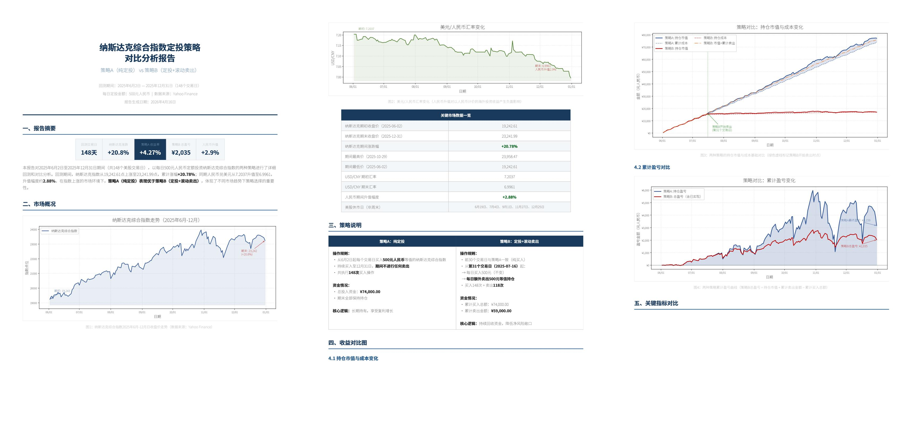{width=100%}

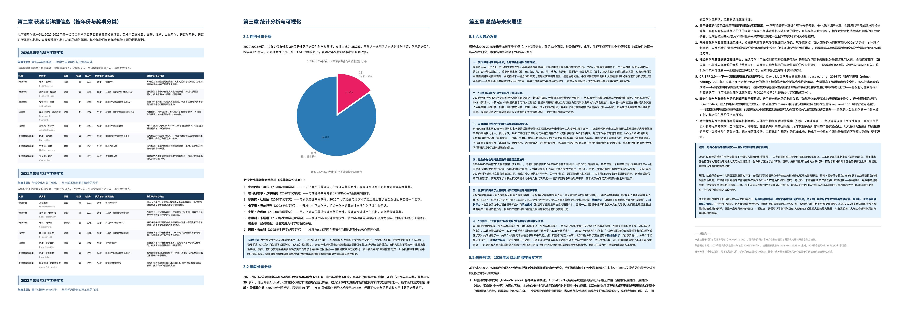{width=100%}

**表 12.** DeepSeek-V4-Pro 与 Gemini-3.1-Pro 在 Chinese Functional Writing 上的对比分析。

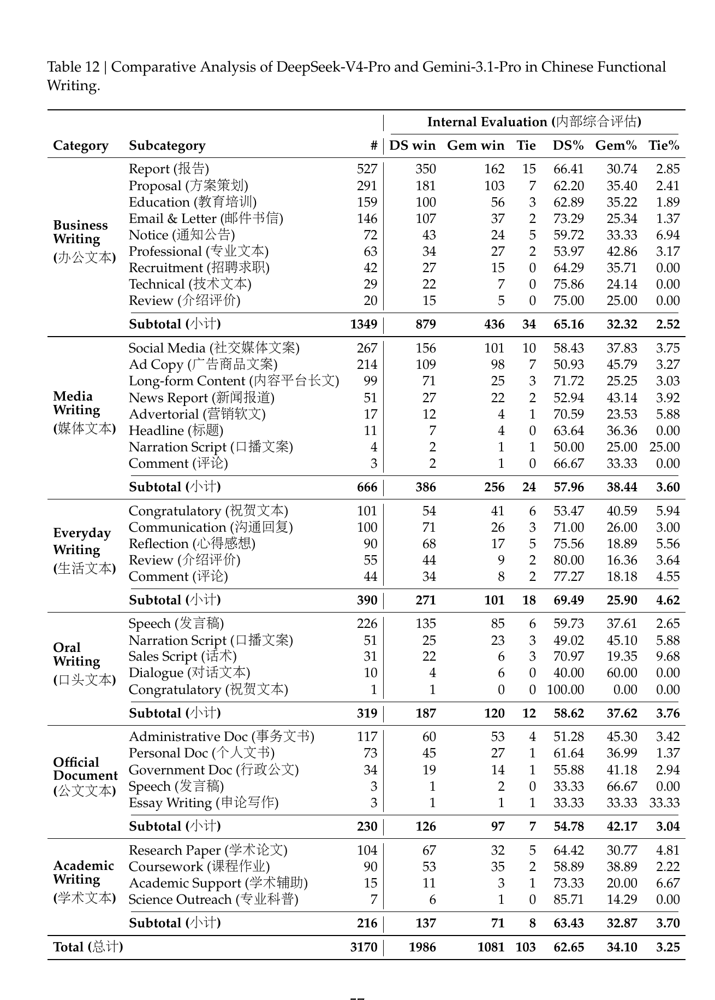{width=100%}

**表 13.** DeepSeek-V4-Pro 与 Gemini-3.1-Pro 在 Chinese Creative Writing 上的对比分析。

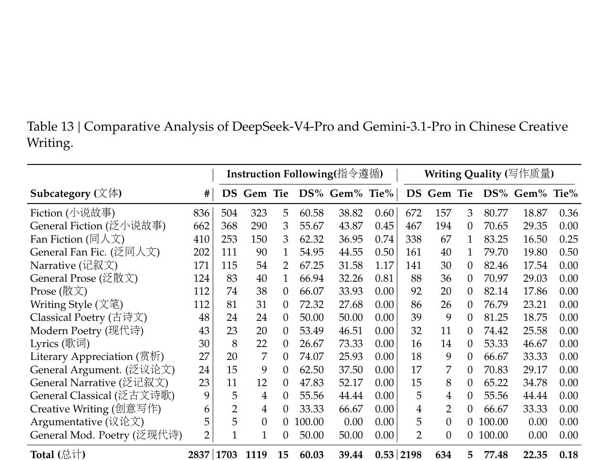{width=100%}

**表 14.** DeepSeek-V4-Pro 与 Claude Opus 4.5 在复杂指令跟随与 multi-turn writing 上的对比。

<div style="overflow-x:auto;">
<table class="table table-sm table-striped table-hover caption-top">
<thead><tr><th>Category</th><th>#</th><th>DS</th><th>Opus</th><th>Tie</th><th>DS%</th><th>Opus%</th><th>Tie%</th></tr></thead>
<tbody>
<tr><td>Complex Inst. Following (复杂指令跟随)</td><td>49</td><td>23</td><td>26</td><td>0</td><td>46.9%</td><td>53.1%</td><td>0.0%</td></tr>
<tr><td>Multi-Turn Writing (多轮写作)</td><td>147</td><td>67</td><td>76</td><td>4</td><td>45.6%</td><td>51.7%</td><td>2.7%</td></tr>
<tr><td><strong>Total (总计)</strong></td><td><strong>196</strong></td><td><strong>90</strong></td><td><strong>102</strong></td><td><strong>4</strong></td><td><strong>45.9%</strong></td><td><strong>52.0%</strong></td><td><strong>2.0%</strong></td></tr>
</tbody>
</table>
</div>
