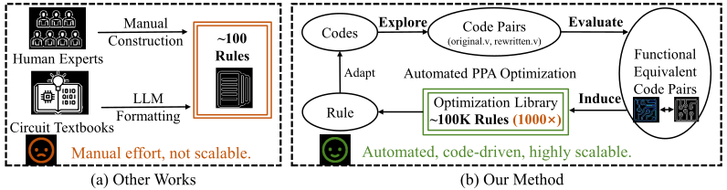
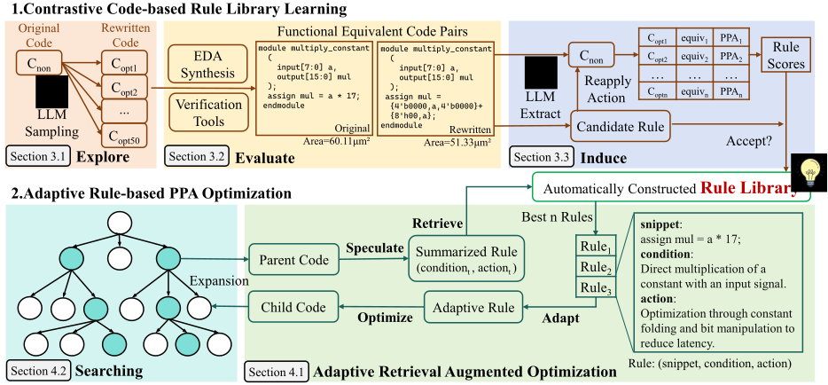
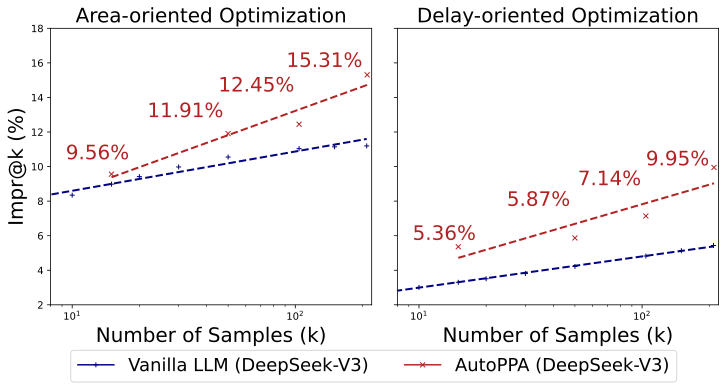

原文版权声明：本文依据公开来源论文 *AutoPPA: Automated Circuit PPA Optimization via Contrastive Code-based Rule Library Learning* 进行中文翻译整理，仅供学习与研究使用。
我仅提供翻译与网页整理，不拥有原文版权；原文版权归作者及发布方所有。
转载、分发或用于商业用途时，请遵守原论文及原始发布平台的版权规定。

原文信息：Chongxiao Li, Pengwei Jin, Di Huang, Guangrun Sun, Husheng Han, Jianan Mu, Xinyao Zheng, Jiaguo Zhu, Shuyi Xing, Hanjun Wei, Tianyun Ma, Shuyao Cheng, Rui Zhang, Ying Wang, Zidong Du, Qi Guo, Xing Hu. *AutoPPA: Automated Circuit PPA Optimization via Contrastive Code-based Rule Library Learning*. [arXiv:2604.18445v1](https://arxiv.org/abs/2604.18445)。

说明：以下内容按原文句序逐句对应翻译整理。
图注、表注、表格说明与参考文献信息尽量保留原貌；参考文献通过 Quarto 的 BibTeX 与 CSL 机制生成，作者名、标题和期刊会议信息不翻译。
原文中的 LaTeX 自定义宏已展开为普通可移植写法，例如 `AutoPPA`、`RTLRewriter`、`SymRTLO` 与 `E²I`。

作者：Chongxiao Li；Pengwei Jin；Di Huang；Guangrun Sun；Husheng Han；Jianan Mu；Xinyao Zheng；Jiaguo Zhu；Shuyi Xing；Hanjun Wei；Tianyun Ma；Shuyao Cheng；Rui Zhang；Ying Wang；Zidong Du；Qi Guo；Xing Hu。

单位：State Key Lab of Processors, Institute of Computing Technology, Chinese Academy of Sciences, Beijing, China；University of Chinese Academy of Sciences, Beijing, China；University of Science and Technology of China, Hefei, China；Institute of AI for Industries, Chinese Academy of Sciences, Nanjing, China。

# 摘要 {#sec-abstract}

性能、功耗和面积（PPA）优化是 RTL 设计中的一项基础任务，它需要精确理解电路功能，以及电路结构与 PPA 指标之间的关系。
近期研究尝试用 LLM 自动化这一过程，但无论是基于反馈的方法，还是基于知识的方法，都还不够高效，因为它们要么在没有任何先验知识的情况下进行设计，要么严重依赖人工总结的优化规则。

本文提出 AutoPPA，这是一个全自动的 PPA 优化框架。
其关键思想是自动生成优化规则，以增强对最优解的搜索。
为此，AutoPPA 采用一种 *Explore-Evaluate-Induce*（`E²I`）工作流，它不是依赖人工定义的先验知识，而是从多样化生成代码对中进行对比和抽象，以得到更好的优化模式。
为使抽象出的规则更具泛化性，AutoPPA 采用一个自适应多步搜索框架，为给定电路选择最有效的规则。
实验表明，AutoPPA 同时优于人工优化，以及最先进的方法 SymRTLO 和 RTLRewriter。

# 引言 {#sec-introduction}

性能、功耗和面积（PPA）构成了评估集成电路设计质量的基础指标。
作为一项关键设计挑战，PPA 优化需要大量硬件实现专业知识，尤其是在 RTL 设计中，因为它要求精确理解电路功能，以及电路结构如何影响综合后的 PPA 结果。

近期，一些基于大型语言模型（LLM）的工作尝试自动化这一过程。
这些研究分为两类：1）直接反馈方法，它们把综合后的 PPA 指标作为 LLM 输入 [@chipgpt; @thorat2024advancedlargelanguagemodel]。
这种方法虽然直接，但效果有限，因为 LLM 缺乏对电路结构与 PPA 指标之间相关性的理解。
2）基于知识的方法，它们使用人工整理或人工总结的 PPA 优化规则 [@yao2024rtlrewriter; @wang2025symrtlo]。
这类方案虽然可能更有针对性，但面临可扩展性挑战，因为劳动密集型的知识库构建天然限制了电路模式覆盖范围和优化技术多样性，从而限制了其实用价值。
即便在一些商业工具指南中，也只提供了几十条例子 [@synopsys2012datapath]。

为解决基于知识的优化中的可扩展性问题，本文研究一个根本问题：*能否仅从原始 RTL 代码中，在没有任何人工干预的情况下，自动合成可复用的 PPA 优化知识？*
我们观察到，借助 LLM 强大的代码生成能力，可以用多样化结构重写功能等价的 RTL 代码。
如图 @fig-insight 所示，这些对比式代码对可用于归纳优化规则库，而无需依赖人工规则。

然而，由于以下原因，自动合成 PPA 优化知识仍然极具挑战。
**挑战 1：优化规则的评估。**
评估重写后的 RTL 本质上是多方面的。
首先，任何功能不等价的候选都无法使用，因此必须对任意原始 RTL 与其重写版本进行稳健的等价性检查。
其次，除了功能正确性之外，评估还必须在 PPA 与 RTL 样本多样性之间取得平衡。
**挑战 2：高质量规则归纳。**
即使有了优化后的代码对，直接提取高质量规则也很困难。
朴素总结会产生充满底层、实现特定细节的规则，不同代码对还可能产生冗余或相互矛盾的规则。
这种噪声规则集难以应用，并会在实践中导致次优优化。
**挑战 3：规则与设计之间的抽象鸿沟。**
过于具体的规则会引入检索噪声，而过度抽象的规则缺乏优化价值，在实际使用中几乎无法改善 PPA 结果。
面对一个大规模、自动生成的规则库，高效地把规则纳入 PPA 优化具有挑战性，因为抽象规则与具体设计之间存在鸿沟。
规则提供的是一般性的电路描述，这使 LLM 难以定位相关 RTL 代码片段并实现符合规则的修改，进而导致功能不等价或次优结果。

{#fig-insight width=100%}

{#fig-method-overview width=100%}

为此，我们提出一个全自动 PPA 优化框架 AutoPPA，它包含一个 *Explore-Evaluate-Induce*（`E²I`）工作流和一个自适应多步搜索方法。
如图 @fig-insight 的 (b) 所示，`E²I` 工作流（1）通过多轮随机 LLM 重写采样来**探索** Verilog 代码对；（2）**评估**并验证原始代码与重写代码之间的功能等价性，并借助验证工具构建功能等价的 Verilog 代码对，以应对**挑战 1**；（3）通过分析成对代码片段及其 PPA 标签，以（*snippet*, *condition*, *action*）三元组形式**归纳**优化规则，以应对**挑战 2**。
自适应多步搜索框架是一种规则增强的 beam search 方法，它利用规则更好地引导 LLM 探索更高质量的 Verilog 代码样本，提高获得 PPA 优化实现的概率，以应对**挑战 3**。

实验表明，在 60 个综合性 benchmark 电路上，AutoPPA 最多实现了 15.31% 的面积改进和 11.28% 的延迟改进；在 11 个代表性电路上，它相较人工优化和最先进方法分别带来了 19.25% 和 7.56% 的面积优化提升。

# 概述 {#sec-overview}

## 背景：RTL PPA 优化 {#sec-background-rtl-ppa}

从电路质量角度看，集成电路（IC）设计会经过三个主要阶段 [@huang2021ml4edasurvey; @pan2025surveyllm4eda]：在寄存器传输级（RTL），工程师用 Verilog 或 VHDL 描述功能；随后，自动逻辑综合把 RTL 描述转换为门级网表；最后，物理设计阶段的布局布线工具在优化时序、功耗和面积的同时生成最终版图。
虽然每个阶段都会影响 PPA（性能、功耗和面积），但 RTL 位于设计层次的顶部，因此影响最大：冗余或次优的 RTL 会限制下游综合和物理工具能够弥补的空间。
因此，生成高质量 RTL 对满足严格 PPA 目标至关重要。
尽管自动化已经取得进展，RTL PPA 优化仍然严重依赖专业知识和人工调优，因为它耗时很长，而且结果会随着设计者经验而显著变化。

## AutoPPA {#sec-autoppa}

如图 @fig-method-overview 所示，AutoPPA 包含两个阶段：1. 对比式代码规则库学习（@sec-rule-library-learning），以及 2. 自适应规则驱动的 PPA 优化（@sec-rule-based-opt）。

提出对比式代码规则库学习，是为了在没有任何人工干预的情况下自动构建一个全面的规则库。
它由一个 *Explore-Evaluate-Induce* 工作流组成，其中我们先通过代码对采样探索优化机会，再基于等价性和 PPA 评估代码对，最后从代码对中归纳自然语言优化规则。

自适应规则驱动的 PPA 优化是一种新的检索增强优化方法，用于利用学到的规则库。
它把单步自适应检索与多步规则增强搜索结合起来，使系统能够自动选择并组合对电路 PPA 优化最有效的规则。

# 对比式代码规则库学习 {#sec-rule-library-learning}

提出对比式代码规则库学习，是为了在没有任何人工干预的情况下从原始 RTL 代码构建规则库。
它包含三个阶段，即 *Explore-Evaluate-Induce*，其细节如下。

## 探索：代码采样 {#sec-explore-code-sampling}

在这一阶段，我们的目标是创建一个足够大且足够多样的、功能有效的 RTL 代码语料库，使其中能够涌现有意义的优化规则。
我们从公开 GitHub 仓库中抓取了约 130K 份 Verilog RTL 代码。
这些代码经历了一个两阶段综合过程：

- **轻量级过滤：** 我们先使用轻量级 `Yosys` 工具 [@yosys] 综合所有收集到的设计，以丢弃任何非自包含或不可综合的设计。
- **精确综合与 PPA 指标：** 随后，剩余的过滤后代码会用 `SiliconCompiler` [@siliconcompiler] 综合，该工具结合 `Yosys` 和 `OpenSTA` [@ajayi2019openroad]，以更长综合时间为代价提供更精确的 PPA 测量。
  RTL 代码及其关联的 PPA 性能指标都会被保存，用于后续规则库学习。

有了大规模原始电路代码语料后，我们探索初始设计的多样化重写形式。
通用语言模型缺乏用于电路优化的准确且专业的知识，但展现出大规模采样多样化代码的强能力。
我们利用这种能力为初始电路生成多个重写版本，以发现潜在优化洞见。
我们先从过滤后的语料中选取 100K 个面积值处于中等范围的 RTL 代码。
每个代码由 LLM Qwen2.5-Coder-7B-Instruct [@hui2024qwen25codertechnicalreport] 重写 $N$ 次（默认 $N=50$），生成超过 5M 对电路代码。
这些经过广泛探索的代码对随后被传递到评估阶段，以识别并保留其中可能包含有价值优化洞见的样本。

## 评估：使用 EDA 工具评估对比式代码对 {#sec-evaluate-contrastive-pairs}

在这一阶段，我们的目标是评估海量代码对，通过评估识别出功能等价且 PPA 存在显著差异的代码对，为提取稳健优化规则奠定基础。
在获得大量具有多样化重写模式的代码对之后，我们先评估它们的 PPA 指标和功能等价性。

对于 PPA 评估，我们采用与 @sec-explore-code-sampling 相同的设置。
功能等价性评估更具挑战性，因为很难为具有多样触发模式、时序行为和功能的电路构造 testbench。
为解决这一问题，我们开发了一个自动 testbench 生成器。
使用 `Yosys`，我们自动提取每个电路的顶层模块、端口、时钟和复位信息。
随后，我们为所有代码对构造 testbench。
该 testbench 会完整验证时钟和复位行为，施加多条长随机激励序列，并比较原始电路与重写电路的输出，以验证等价性。
在我们的测试电路上，生成的 testbench 达到了 100% 行覆盖率和高可靠性。

在验证并综合每个 RTL 设计的所有重写版本之后，我们计算功能等价版本之间 PPA 分布的 Shannon entropy，以度量多样性。
更高的 entropy 值表明可以提取出更丰富的潜在优化模式。
非等价代码被赋予零 PPA 改进，并从计算中排除。
我们按 entropy 对设计排序，并选择前 $K\%$（$K=25$）作为候选。
对于每个被选中的设计，我们只保留相对 PPA 差异超过 5% 的等价代码对，并将其记为 $(C_{non}, C_{opt})$，分别表示非优化版本和优化版本。

## 归纳：基于对比式代码的规则归纳 {#sec-induce}

在这一阶段，我们把关键优化洞见总结为更高层规则。
为了提取可执行的电路优化策略，我们把每条规则定义为一个三元组（*snippet*, *condition*, *action*）：

- ***snippet***：具有代表性的低效率 RTL 代码片段，它们作为优化目标。
- ***condition***：描述优化规则何时适用的泛化上下文条件。
- ***action***：说明如何修改原始 RTL 代码以获得优化后 PPA 的变换动作。

对于每一对 $(C_{non}, C_{opt})$，我们首先通过 LLM 生成一组候选规则，从而得到 $n$ 条（默认 $n=2$）可能解释 $C_{opt}$ 中所观察到改进的不同规则。

随后，我们通过系统性评估识别高质量规则。
每条规则会被重新应用到原始电路上，并由 LLM 进行多次优化尝试，然后与该代码对中的原始非优化电路和优化电路的 PPA 进行比较。
我们使用公式 @eq-rewr-score 对结果进行归一化：

$$
s_i=\mathbf{1}_{\text{eq}}(i)\;\cdot\;\mathrm{clip}_{[0,1]}\!\left(\alpha+\beta\,\frac{\mathrm{PPA}_n - \mathrm{PPA}_i}{\mathrm{PPA}_n - \mathrm{PPA}_o}\right)
$$ {#eq-rewr-score}

其中，$s_i$ 表示第 $i$ 个重写电路的得分。
$\mathrm{PPA}_n$、$\mathrm{PPA}_o$ 和 $\mathrm{PPA}_i$ 分别是非优化电路 $C_{non}$、优化电路 $C_{opt}$ 和第 $i$ 个重写版本的 PPA 值。
$\mathbf{1}_{\text{eq}}(i)$ 确保只有功能等价的重写版本才能得到非零分数。
参数 $\alpha$（默认 0.25）和 $\beta$（默认 0.5）用于归一化改进：功能等价但没有 PPA 收益的重写版本得分为 0.25，而达到优化电路同等改进的重写版本得分为 0.75。

随后，对每条规则的所有尝试得分取平均。
平均分高于 0.7 的规则被归类为高质量规则，并被加入规则库，表示它们具有很强的电路改进潜力。

# 自适应规则驱动的 PPA 优化 {#sec-rule-based-opt}

为了在实际场景中充分利用优化规则库，我们提出一个集成框架，称为 *Adaptive Rule-based PPA Optimization*。
该框架把单步 Adaptive Retrieval Augmented Optimization（ARAO）与多步 Rule-based Enhanced Searching 结合起来。
单步优化从输入 RTL 代码中提取结构条件，并基于规则把最自适应的动作应用到电路上；多步搜索则通过 beam search 迭代细化候选，同时平衡 PPA 收益与电路多样性。

## Adaptive Retrieval Augmented Optimization {#sec-mthd-arao}

为了利用优化规则库进行 RTL 代码 PPA 优化，我们通过匹配 RTL 代码中的结构条件和潜在动作来检索规则，并使用检索到的规则指导 LLM 优化 RTL 代码。
我们观察到，有些规则包含面向其源代码对的描述，这可能污染当前电路的优化上下文。
我们还观察到，直接按语义 embedding 相似度检索可能会引入噪声。
因此，我们设计了一个 Adaptive Retrieval Augmented Optimization（ARAO）流程，以降低这些问题的影响。
该流程包含四个步骤：

- **Speculate：** 提示 LLM 为目标代码总结一条优化规则 $(\textit{snippet}_t, \textit{condition}_t, \textit{action}_t)$。
- **Retrieve：** 使用 $\textit{condition}_t$ 和 $\textit{action}_t$，我们基于规则 embedding 之间的 cosine similarity，从规则库中检索三条最相似的规则。
- **Adapt：** 为缓解检索规则中源特定信息带来的干扰，我们利用 LLM 结合目标代码调整这些规则，确保它们的适用性和相关性。
- **Optimize：** 目标代码和自适应规则被输入 LLM，后者生成优化代码变体。
  随后，这些变体会被验证功能等价性，并进行综合以评估 PPA 改进。

## Rule-based Enhanced Searching {#sec-mthd-kes}

虽然 ARAO 对单步优化有效，但全面的 PPA 改进往往需要在复杂代码优化的大搜索空间中进行高效搜索。
因此，我们提出一个基于 beam search 的多步搜索框架。
在每次迭代中，会选择得分最高的前 $k$ 个候选代码（beam width 为 $k$）。
对于每个候选，ARAO 流程会扩展出 $m$ 个优化变体。
下一轮迭代的候选池由所有新变体和当前最优候选组成，最多迭代 $s$ 次。

候选评分函数定义如下：

$$
\text{Score} = \omega \cdot \text{Score}_{diversity} + (1-\omega) \cdot \text{Score}_{ppa}
$$ {#eq-search-score}

其中，$\text{Score}_{diversity}$ 使用相对于父代码的 TF-IDF 相似度 [@aizawa2003information] 量化多样性，$\text{Score}_{ppa}$ 纳入功能等价性和相对 PPA 表现，且 $\omega=0.25$。
这会同时鼓励 PPA 改进和对多样化优化策略的探索。

# 实验 {#sec-experiments}

我们首先在 @sec-exp-setting 中介绍实验设置。
随后，我们在 @sec-exp-result 中进行全面实验和细致的消融研究，以验证方法的有效性。

## 实验设置 {#sec-exp-setting}

**Benchmarks.**
我们使用 RTLRewriter [@yao2024rtlrewriter] benchmark，该 benchmark 专门为 RTL 代码优化设计。
它包含 54 个具有全面优化模式的设计，以及 3 个可综合的实用大型设计。
遵循 RTLRewriter，我们把这 3 个实用设计划分为 6 个不同模块，最终得到总计 60 个设计。
对于每个设计，我们生成严格的 testbench（在非冗余代码上达到 100% 行覆盖率和分支覆盖率），以验证优化代码与原始实现之间的等价性。

**Baselines.**
***(1) SOTA RTL 代码优化方法。***
为与 RTLRewriter 比较，我们使用对齐后的综合流程，综合其公开仓库中的全部 11 个优化电路。
对于 SymRTLO [@wang2025symrtlo]，我们在 5 个实现复杂算法的电路上，把结果与其自报告结果进行比较。
***(2) 熟练 Verilog 工程师。***
我们把本方法与一位拥有两年以上经验的 Verilog 工程师在完整 benchmark 上手工优化得到的结果进行比较。
该工程师获得了标准验证与综合环境，并被允许使用 16 个工作小时进行充分优化，同时在这一过程中总结优化规则。
***(3) 代表性 LLM。***
我们把结果与表 @tbl-baseline-llms 中列出的代表性 LLM 进行比较。
为公平比较，我们在相同采样 RTL 代码数量下，评估每个 LLM 生成的最优代码。
在所有实验中，我们统一使用 0.6 的生成温度，并提供与本方法一致的 prompts。

**Metrics.**
我们报告综合后的总 cell area（单位为 $\mu m^2$）、cycle delay（单位为 $ns$）和 dynamic power（单位为 $mW$），用于评估电路面积、性能和功耗。
除非另有说明，所有综合都使用 `SiliconCompiler` 和 FreePDK 45nm 工艺 [@Stine2007freepdk]。
对于等价且优化后的电路，我们按 $Impr=1- { PPA_{opt}}/{ PPA_{original}}$ 报告其 PPA 改进。
如果生成电路不等价，或者目标 PPA 更差，则标记为 0 改进。
对于 vanilla LLM baseline，遵循代码生成任务中被广泛采用的 $Pass@k$ 指标 [@chen2021evaluatinglargelanguagemodels]，我们提出 **Impr@k** 指标，用于基于总计 $n > k$ 个样本的结果估计从 $k$ 个样本中获得的期望最优 PPA 优化，如公式 @eq-impr-at-k 所示：

$$
\operatorname{Impr@k} := \mathbb{E}_{\text{circuits}}\left[
\sum_{j=1}^n \left(
   Impr_j^{\downarrow} \cdot \frac{\binom{n-j}{k-1}}{\binom{n}{k}}
\right)
\right]
$$ {#eq-impr-at-k}

其中，${Impr}^{\downarrow}_j$ 表示 $n$ 个样本中的第 $j$ 大 PPA 改进，也就是 ${Impr}^{\downarrow}_1 \ge {Impr}^{\downarrow}_2 \ge \cdots \ge {Impr}^{\downarrow}_n$。

**AutoPPA 设置。**
我们根据表 @tbl-search-setting 配置不同搜索规模，为每种配置分别生成 15、50、104 和 210 个 RTL 代码样本。
我们使用 gte_Qwen2-7B-instruct [@li2023towards] 作为 embedding model，对规则库和检索查询进行 embedding。
在搜索中，我们为 AutoPPA 配置了较小的 Qwen2.5-7B-Instruct 和 Qwen2.5-Coder-7B-Instruct 模型，以及较大的 DeepSeek-V3-0324 模型，以展示框架的通用性。
我们把所有模型的 LLM 生成温度都设为 0.6。

| 类型 | 模型 | 缩写 | 参数量 |
|---|---|---|---:|
| RTL Specific | CodeV-All-QC | CodeV | 7.62B |
| RTL Specific | HaVen-DeepSeek | HaVen | 6.74B |
| Coding Specific | Qwen2.5-Coder-7B-Instruct | Qwen Coder | 7.62B |
| Reasoning | DeepSeek-R1-Distill-Qwen-7B | DS-R1-Dist | 7.62B |
| General Purpose | DeepSeek-V3-0324 | DeepSeek-V3 | 685B |

: 实验中的 baseline language models。 {#tbl-baseline-llms}

| 配置缩写 | Beam Width ($k$) | Num Expand ($m$) | Max Steps ($s$) | Total RTL Searched ($n$) |
|---|---:|---:|---:|---:|
| 2-3-3 | 2 | 3 | 3 | 15 |
| 3-5-4 | 3 | 5 | 4 | 50 |
| 3-8-5 | 3 | 8 | 5 | 104 |
| 5-10-5 | 5 | 10 | 5 | 210 |

: AutoPPA 搜索规模配置，其中 $n = (1 + k \cdot (s-1)) \cdot m$。 {#tbl-search-setting}

## 实验结果 {#sec-exp-result}

**AutoPPA 超过人工努力和 SOTA 方法。**
*(1) AutoPPA 在面向面积的电路优化上优于 RTLRewriter 和人工优化。*
我们对 RTLRewriter 开源的优化 RTL 代码和人工优化结果进行了逐电路比较。
我们使用 DeepSeek-V3 作为 AutoPPA 的 backbone model，采用 5-10-5 搜索设置，并将优化目标与 RTLRewriter 对齐为面向面积的优化。
结果如表 @tbl-comp-rtlrewriter 所示，最佳结果以粗体高亮，相较原始设计未能实现优化的结果以浅色显示。
我们的方法取得了更优性能，在 11 个电路中的 10 个上获得了最小面积。
平均来看，与 RTLRewriter 相比，本方法带来了显著改进：面积提升 7.56%，功耗提升 9.00%。
人工优化表现相对较差，这表明即使对有熟练经验的人类工程师而言，优化这些电路也具有相当大的挑战性。

::: {style="overflow-x:auto;"}
| Design | Original Area / Delay / Power | Manual Area / Delay / Power | RTLRewriter Area / Delay / Power | AutoPPA-DS Area / Delay / Power |
|---|---:|---:|---:|---:|
| `add3` | 65.17 / 0.26 / 0.85 | 65.17 / 0.26 / 0.85 | <strong>42.83</strong> / 0.21 / 0.62 | 65.17 / 0.26 / 0.85 |
| `mux_type1` | 2.39 / 0.04 / 0.00010 | 2.39 / 0.04 / 0.00010 | <strong>2.13</strong> / 0.04 / 0.00010 | <strong>2.13</strong> / 0.04 / 0.00010 |
| `mux_type3` | 2.39 / 0.05 / 0.00010 | 2.39 / 0.05 / 0.00010 | 2.39 / 0.05 / 0.00010 | 2.39 / 0.05 / 0.00010 |
| `mux_type5` | 6.12 / 0.13 / 0.00010 | 6.12 / 0.13 / 0.00010 | 6.12 / 0.13 / 0.00010 | 6.12 / 0.13 / 0.00010 |
| `example1` | 61.71 / 0.22 / 0.78 | 60.116 / 0.21 / 0.87 | 48.15 / 0.24 / 0.84 | <strong>29.26</strong> / 0.23 / 0.68 |
| `example3` | 52.40 / 0.27 / 2.33 | 49.476 / 0.31 / 2.07 | 37.51 / 0.21 / 1.54 | <strong>36.44</strong> / 0.21 / 1.25 |
| `com_subexp` | 11967.34 / 2.98 / 0.26 | 11370.17 / 3.00 / 0.24 | 11389.58 / 3.12 / 0.24 | <strong>11310.85</strong> / 3.06 / 0.24 |
| `add_bit_wid` | 63.57 / 0.32 / 0.0016 | 63.57 / 0.32 / 0.0016 | 63.57 / 0.32 / 0.0016 | <strong>36.44</strong> / 0.59 / 0.00070 |
| `add_subexp` | 132.73 / 0.57 / 0.0029 | 132.73 / 0.57 / 0.0029 | 132.74 / 0.57 / 0.0029 | 132.73 / 0.57 / 0.0029 |
| `m_con_mul` | 1374.16 / 1.17 / 0.031 | 1374.16 / 1.17 / 0.031 | 1026.76 / 1.13 / 0.023 | <strong>876.47</strong> / 1.04 / 0.02 |
| `m_con_mul2` | 1628.72 / 1.22 / 0.038 | 1628.72 / 1.22 / 0.038 | 1370.17 / 1.22 / 0.031 | <strong>873.01</strong> / 1.16 / 0.021 |
| Avg. Impr. | - | 1.20% / -0.99% / 0.60% | 12.89% / 2.83% / 9.35% | <strong>20.45%</strong> / -4.85% / 18.35% |

: AutoPPA 与人工努力和 RTLRewriter 的**面积导向**优化比较。AutoPPA 分别比人工努力和 RTLRewriter 高出 19.25% 和 7.56%。 {#tbl-comp-rtlrewriter}
:::

*(2) AutoPPA 在更具挑战性的复杂和大型电路优化任务上优于 SymRTLO。*
由于 SymRTLO 没有开源其优化 RTL 代码或综合脚本，我们无法在完全相同的标准下进行比较。
在表 @tbl-comp-symrtlo 中，我们展示了 SymRTLO 对复杂功能电路的自报告面积优化结果、人工优化结果、vanilla LLM 结果，以及以 DeepSeek-V3 [@deepseekai2025deepseekv3technicalreport] 作为 backbone model 并采用 5-10-5 搜索设置的 AutoPPA 结果。
为了尽可能与 SymRTLO 的综合设置对齐，我们使用 `Design Compiler` 2018，分别把电路综合到 SMIC 12nm 和 TSMC 65nm 工艺。
实验结果表明，在两个工艺上，AutoPPA 的电路面积改进都高于 SymRTLO（18.12% / 18.93% 对 17.58%）。
然而，我们再次强调，工艺节点和综合脚本的差异可能导致 PPA 结果出现显著变化。
由于我们无法访问 SymRTLO 使用的具体工艺节点和脚本，实现完全公平的比较仍然是一项挑战。

::: {style="overflow-x:auto;"}
| 工艺/设置 | 方法 | `spmv` | `subexp_elim` | `adder_architecture` | `vending_machine` | `fft` | Avg. Impr. |
|---|---|---:|---:|---:|---:|---:|---:|
| SSC | Original | 22908.69 / 7.95 / 1.46 | 9484.15 / 11.78 / 4.61 | 541.92 / 2.29 / 0.17 | 240079.30 / 7.90 / 11.46 | 1857805.00 / 7.90 / 51.12 | - |
| SSC | SymRTLO | 22908.69 / 7.95 / 1.46 | 6791.88 / 11.78 / 3.53 | 531.88 / 2.48 / 0.17 | 151593.90 / 7.90 / 8.18 | 1471378.00 / 8.98 / 26.32 | 17.58% / -4.39% / 20.12% |
| SMIC 12nm | Original | 423.94 / 0.16 / 6.71 | 162.75 / 1.27 / 0.22 | 8.48 / 0.15 / 0.01 | 3747.36 / 0.23 / 17.59 | 31271.32 / 0.75 / 46.68 | - |
| SMIC 12nm | Manual | 423.94 / 0.16 / 6.71 | 162.75 / 1.27 / 0.22 | 8.48 / 0.15 / 0.01 | 3747.36 / 0.23 / 17.59 | 29346.88 / 0.81 / 37.23 | 1.23% / -0.27% / 5.27% |
| SMIC 12nm | DeepSeek-V3 | <strong>295.28</strong> / 0.19 / 4.36 | 123.54 / 1.27 / 0.18 | 8.48 / 0.15 / 0.01 | 3608.39 / 0.23 / 17.59 | 31271.32 / 0.75 / 46.68 | 11.63% / -2.42% / 12.30% |
| SMIC 12nm | AutoPPA-DS | <strong>295.28</strong> / 0.19 / 4.36 | <strong>116.81</strong> / 1.27 / 0.17 | <strong>8.48</strong> / 0.14 / 0.01 | <strong>2966.91</strong> / 0.36 / 9.70 | <strong>27769.19</strong> / 0.79 / 42.85 | <strong>18.12%</strong> / -14.79% / 23.57% |
| TSMC 65nm | Original | 4021.20 / 0.60 / 4.61 | 1588.68 / 4.03 / 0.97 | 80.64 / 0.69 / 0.04 | 38829.96 / 0.72 / 26.75 | 304913.90 / 2.63 / 39.05 | - |
| TSMC 65nm | Manual | 4021.20 / 0.60 / 4.61 | 1588.68 / 4.03 / 0.97 | 80.64 / 0.69 / 0.04 | 38829.96 / 0.72 / 26.75 | 295164.72 / 2.51 / 35.67 | 0.64% / 0.91% / 1.73% |
| TSMC 65nm | DeepSeek-V3 | <strong>2904.12</strong> / 0.59 / 3.54 | 1195.92 / 4.03 / 0.78 | 80.64 / 0.69 / 0.04 | 37383.12 / 0.75 / 24.96 | 304913.88 / 2.63 / 39.05 | 11.25% / -0.50% / 10.00% |
| TSMC 65nm | AutoPPA-DS | <strong>2904.12</strong> / 0.59 / 3.54 | <strong>1130.04</strong> / 4.03 / 0.75 | <strong>79.92</strong> / 0.71 / 0.04 | <strong>29798.64</strong> / 1.12 / 13.51 | <strong>262633.70</strong> / 2.73 / 35.47 | <strong>18.93%</strong> / -12.12% / 21.85% |

: AutoPPA、人工优化、vanilla DeepSeek-V3 sampling 和 SymRTLO 的**面积导向**优化结果比较，使用 `Design Compiler` 综合。SymRTLO 的结果复制自其原始论文。每个数值单元为 Area / Delay / Power。 {#tbl-comp-symrtlo}
:::

*(3) AutoPPA 在面积导向和延迟导向优化上都优于所有 baseline LLM 方法。*
我们把评估扩展到完整 benchmark 中的全部 *60 个电路*，将本方法与 baseline LLM 比较，并应用从 2-3-3 到 5-10-5 的设置。
在搜索中使用 Qwen2.5-7B 系列模型和 DeepSeek-V3 作为 backbone model，我们把结果与表 @tbl-baseline-llms 中列出的语言模型进行比较，目标分别是面积优化和延迟优化。
结果见表 @tbl-main-area-delay，并在图 @fig-opt-vs-sample 中展示。

::: {style="overflow-x:auto;"}
| 优化目标 | 类型 | 方法 | Impr@15 (%) | Impr@50 (%) | Impr@104 (%) | Impr@210 (%) |
|---|---|---|---:|---:|---:|---:|
| Area-oriented | RTL-Specific Models | HaVen | 1.33% / 0.12% / 1.48% | 3.02% / 0.33% / 3.46% | 4.14% / 0.51% / 4.82% | 4.77% / 0.60% / 5.57% |
| Area-oriented | RTL-Specific Models | CodeV | 1.35% / 0.47% / 1.61% | 3.10% / 1.06% / 3.53% | 4.36% / 1.63% / 4.75% | 5.32% / 2.27% / 5.45% |
| Area-oriented | Reasoning | DS-R1-Dist | 3.74% / 0.55% / 3.86% | 6.01% / 1.21% / 6.27% | 7.78% / 1.90% / 8.11% | 9.22% / 2.76% / 9.55% |
| Area-oriented | General Models | Qwen-Coder | 4.79% / 1.29% / 5.52% | 6.90% / 1.97% / 8.00% | 8.74% / 2.87% / 10.10% | 10.60% / 3.97% / 12.37% |
| Area-oriented | General Models | DeepSeek-V3 | 8.98% / 1.63% / 9.95% | 10.55% / 1.85% / 11.40% | 11.04% / 2.09% / 11.97% | 11.20% / 2.36% / 12.29% |
| Area-oriented | Ours | AutoPPA-Qw | 4.98% / 2.12% / 5.41% | 8.83% / 3.25% / 9.97% | 9.50% / 2.94% / 11.13% | 11.05% / 4.87% / 14.31% |
| Area-oriented | Ours | AutoPPA-DS | <strong>9.56%</strong> / 1.66% / 10.84% | <strong>11.91%</strong> / 2.57% / 13.44% | <strong>12.45%</strong> / 2.05% / 13.58% | <strong>15.31%</strong> / 0.43% / 15.97% |
| Delay-oriented | RTL-Specific Models | HaVen | 1.00% / 0.46% / 0.93% | 1.88% / 1.38% / 1.89% | 2.33% / 2.11% / 2.60% | 2.49% / 2.97% / 3.30% |
| Delay-oriented | RTL-Specific Models | CodeV | 1.92% / 1.98% / 2.50% | 2.49% / 2.49% / 3.36% | 2.80% / 2.39% / 3.34% | 3.15% / 1.69% / 2.61% |
| Delay-oriented | Reasoning | DS-R1-Dist | 1.51% / 1.87% / 2.32% | 2.52% / 2.47% / 3.00% | 3.02% / 2.48% / 3.06% | 3.33% / 2.00% / 2.56% |
| Delay-oriented | General Models | Qwen-Coder | 2.76% / 3.61% / 4.51% | 4.61% / 4.02% / 5.11% | 6.11% / 4.56% / 5.89% | 7.74% / 5.83% / 7.49% |
| Delay-oriented | General Models | DeepSeek-V3 | 4.20% / 1.65% / 2.90% | 5.15% / 2.11% / 3.44% | 5.67% / 2.48% / 3.96% | 6.37% / 2.90% / 4.49% |
| Delay-oriented | Ours | AutoPPA-Qw | 4.65% / 3.10% / 4.62% | <strong>6.15%</strong> / 4.82% / 5.52% | <strong>9.80%</strong> / 9.75% / 11.79% | <strong>11.28%</strong> / 8.00% / 10.87% |
| Delay-oriented | Ours | AutoPPA-DS | <strong>5.36%</strong> / 1.09% / 1.54% | 5.87% / 0.73% / 1.74% | 7.14% / 2.10% / 2.44% | 9.95% / 6.37% / 7.78% |

: 在 **60** 个电路上，AutoPPA 与 vanilla LLM 的**面积导向**和**延迟导向**优化比较。Area-oriented 行中的数值为 Area / Delay / Power；Delay-oriented 行中的数值为 Delay / Area / Power。 {#tbl-main-area-delay}
:::

{#fig-opt-vs-sample width=80%}

表 @tbl-main-area-delay 的结果表明，在面积和延迟优化目标上，本方法在相近规模模型中都取得了最佳优化结果。
重要的是，随着搜索预算增加，本方法表现出持续改进。
图 @fig-opt-vs-sample 进一步展示了 AutoPPA 与 vanilla DeepSeek-V3 在优化上的比较：随着样本数量增长，AutoPPA 得到持续更高的 impr@k，并且增长率优于 DeepSeek-V3。
在最大搜索预算下，本方法在面积导向优化上比 vanilla LLM 高出 4.11%，在延迟导向优化上高出 3.58%。

值得注意的是，在以延迟优化为目标时，使用较小的 Qwen2.5-7B 系列模型作为搜索 backbone，效果优于使用 DeepSeek-V3。
我们把这一点归因于 Qwen2.5-7B 在延迟优化任务上的 baseline 表现优于 DeepSeek-V3。
尽管 DS-R1-Distill 从 DeepSeek-R1 蒸馏而来，并在 Qwen2.5-Math-7B 上微调，其优化能力仍弱于具有相同架构和参数规模的 Qwen2.5-Coder-Instruct 模型，这表明 reasoning model 的蒸馏会导致其在特定任务上的性能退化。
尽管 HaVen 和 CodeV 是面向 RTL 生成的专用模型，它们在 RTL 优化任务上的优化效果最低。
这凸显了多任务微调对于提升领域专用能力的重要性。

**AutoPPA 对多种综合设置有效。**
结合表 @tbl-comp-rtlrewriter 和表 @tbl-comp-symrtlo 的结果，AutoPPA 在开源和商业 EDA 工具链上都展现了显著 PPA 改进。
这一结果凸显了 AutoPPA 的广泛适用性。
值得注意的是，AutoPPA 在 RTLRewriter Benchmark 中的 2 个大型实用电路（*fft* 和 *vending_machine*）上，跨 12nm 到 65nm 工艺节点都取得了显著面积优化，在 12nm 工艺下分别达到 11.20% 和 20.83%，在 65nm 工艺下分别达到 13.87% 和 23.26%。
我们观察到，虽然同一个电路在不同工艺节点上表现出相似的优化趋势，但具体优化比例存在明显差异。
这突出了采用统一综合工具链和工艺节点来确保不同工作之间公平评估的重要性。
据我们所知，我们是首个在多个 EDA 工具（`SiliconCompiler` 和 `Design Compiler`）与多个工艺（从 12nm、45nm 到 65nm）上评估基于 LLM 的 RTL 代码 PPA 优化的工作。

**AutoPPA 的规则库超过人工构造的规则库。**
我们进行了一项实验，用以比较通过我们的 *explore-evaluate-induce*（`E²I`）流程自动导出的优化规则，与由 Verilog 工程师人工总结的优化规则之间的有效性。
该比较使用相同的 3-5-4 搜索设置，以 Qwen2.5 系列模型作为搜索 backbone，在全部 60 个电路上进行面积导向优化。
唯一差异是优化过程中使用的规则库。
表 @tbl-comp-manual-lib 给出了实验结果。
我们 `E²I` 流程的可扩展性生成了显著更多规则（101,987 条规则），相比之下，16 小时人工努力只得到 12 条规则，因此也带来了更好的优化结果。

| 设置 | Impr@50（Area / Delay / Power） |
|---|---:|
| AutoPPA-Qw with `E²I` rules (ours) | <strong>8.83%</strong> / 3.25% / 9.97% |
| with manual rules | 6.56% / 0.80% / 5.46% |

: AutoPPA 学到的规则库与人工构造规则库之间的**面积导向**优化比较，测试使用 AutoPPA-Qw。 {#tbl-comp-manual-lib}

**Ablation Study.**
为验证所提出方法中每个组件的有效性，我们进行了一系列消融研究。
完整设计包含 LLM 生成规则 **speculation**、使用这些 speculative 结果进行规则库 **retrieval**、对检索规则进行 **adaptation**，以及 **search** 框架。
我们在相同 RTL 代码采样开销下进行消融实验。
表 @tbl-ablation 给出了实验结果，展示了设计中每个组件的有效性。
每个消融设置下观察到的性能下降，都验证了我们集成方法对最佳性能的重要性。

| 设置 | Impr@50（Area / Delay / Power） |
|---|---:|
| AutoPPA-Qw (ours) | <strong>8.83%</strong> / 3.25% / 9.97% |
| w/o Search | 7.83% / 3.14% / 7.94% |
| w/o Adapt | 6.96% / 2.58% / 7.62% |
| w/o Retrieve, Adapt | 5.34% / 2.41% / 5.67% |
| w/o Speculate, Retrieve, Adapt | 6.39% / 1.95% / 5.84% |

: AutoPPA 自适应规则驱动 PPA 优化框架在**面积导向**优化上的消融。 {#tbl-ablation}

# 相关工作 {#sec-related-work}

**基于 LLM 的 RTL 生成。**
近期工作利用 Large Language Models（LLMs）辅助电路设计流程。
Chip-Chat [@chipchat]、OriGen [@cui2024origen]、RTLFixer [@tsai2024rtlfixer] 和 VerilogCoder [@verilogcoder] 等框架使用 self-reflection [@reflexion] 或 multi-agent systems 进行 RTL 生成。
其他工作，包括 VeriGen [@thakur2024verigen]、RTLCoder [@liu2024rtlcoder]、BetterV [@pei2024betterv]、CodeV [@zhao2025codev; @zhu2025codevr1] 和 HaVen [@yang2025haven]，构建领域专用数据集并微调 LLM，以提高生成质量。
然而，这些工作主要解决电路生成问题 [@liu2025openllm; @Pinckney2025revisitingverilogeval]，而不是电路优化挑战。

**基于 LLM 的 RTL 优化。**
电路优化不同于生成任务，因为它需要在保持功能等价的同时，理解硬件代码、电路结构和综合后 QoR 指标之间的复杂关系。
一些方法尝试直接处理电路优化。
ChipGPT [@chipgpt] 和 VeriPPA [@thorat2024advancedlargelanguagemodel] 把综合后的 PPA 指标反馈给 LLM，并直接请求优化。
RTLRewriter [@yao2024rtlrewriter] 构建人工知识库，从代码和图表中检索信息，并应用 Monte Carlo Tree Search（MCTS）进行重写。
SymRTLO [@wang2025symrtlo] 把人工收集的优化材料 [@Knoop1994deadcode; @Pasko1999subexpelim] 格式化，用于迭代细化过程中的检索。
这些方法依赖人工构建的知识库，其条目数量和任务特定优化能力都有限。

# 结论 {#sec-conclusion}

本文提出 AutoPPA，这是一个全自动 PPA 优化框架，由自动生成的优化规则库和增强优化搜索方法组成。
为缓解优化规则稀缺和规则归纳中的挑战，我们开发了一个基于 *Explore-Evaluate-Induce* 工作流的规则库学习框架。
为解决把抽象优化规则应用到具体设计时的低效问题，我们提出一种 Adaptive Retrieval Augmented Optimization（ARAO）机制，并将其与多步搜索策略集成。
实验结果表明，AutoPPA 超过 baseline LLM 方法，相较人工方法实现了 19.25% 的面积优化提升，相较 RTLRewriter 实现了 7.56% 的面积优化提升。
