原文版权声明：本文依据公开来源论文 *Striking the Balance: GEMM Performance Optimization Across Generations of Ryzen™ AI NPUs* 进行中文翻译整理，仅供学习与研究使用。
我仅提供翻译与网页整理，不拥有原文版权；原文版权归作者及发布方所有。
转载、分发或用于商业用途时，请遵守原论文及原始发布平台的版权规定。

原文信息：Endri Taka，Andre Roesti，Joseph Melber，Pranathi Vasireddy，Kristof Denolf，Diana Marculescu。*Striking the Balance: GEMM Performance Optimization Across Generations of Ryzen™ AI NPUs*。arXiv:2512.13282v1。

说明：以下内容按原文句序逐句对应翻译整理。
图注、表注、表格说明与参考文献信息尽量保留原貌；作者名、标题、期刊会议信息不翻译。
原文中的 LaTeX 自定义宏已尽量展开为普通可移植写法，数学表达式则保留为可渲染的公式形式。

# 摘要 {#sec-abstract}

现代深度学习（DL）工作负载对计算和内存的需求不断增长，这推动了从云到边缘的专用硬件设备发展，例如 AMD 的 Ryzen™ AI XDNA™ NPU。
为了提升 DL 工作负载性能，为这些架构优化通用矩阵乘法（GEMM）算法至关重要。
为此，本文提出一种通用的系统化方法，用于跨两代当前 NPU，即 XDNA 和 XDNA2，优化 GEMM 工作负载。
我们的实现利用了 AMD NPU 独特的体系结构特性，并在系统层面解决了关键性能瓶颈。
对不同 GEMM 尺寸的端到端性能评估表明，8 位整数（int8）精度下，XDNA 的吞吐量最高可达 6.76 TOPS，XDNA2 可达 38.05 TOPS。
类似地，对于脑浮点（bf16）精度，我们的 GEMM 实现在 XDNA 上最高可达 3.14 TOPS，在 XDNA2 上最高可达 14.71 TOPS。
这项工作为优化 Ryzen AI NPU 上 GEMM 工作负载的关键性能因素提供了重要洞见。

# 引言 {#sec-introduction}

深度学习（DL）应用的广泛采用，以及其密集的计算需求，推动了专用硬件平台的出现。
虽然云数据中心仍在提供大规模加速能力 [@NVIDIA_H100; @AMD_CDNA_4; @TPUv42021; @MAIA_microsoft_2024; @Meta_second_gen_chip; @Amazon_Inferentia2]，但能源效率、低延迟以及更强的隐私与安全需求不断上升，这也促使 DL 加速器向边缘侧集成 [@NPU_arch_MICRO_2024; @Versal_AI_Edge_gen_2; @Intel_NPU; @Qualcomm_Hexagon_NPU; @Nvidia_Jetson_nano]。
为此，AMD 发布了 Ryzen™ AI 处理器 [@NPU_arch_MICRO_2024]，其中包含多核 CPU、集成 GPU 和一颗新的神经处理单元（NPU）。
这颗 NPU 采用 XDNA™ 架构，是与 x86 处理器集成的专用 DL 加速器。
AMD NPU 是 AI Engine（AIE）架构的演进版本，该架构已用于 Versal™ 自适应 SoC 平台 [@Versal_Hot_chips_2019; @Versal_Hot_chips_2021] 和 Alveo™ V70 加速卡 [@AMD_CES_2023]。
NPU 架构利用了现代 DL 工作负载的特性，即编译器可以静态确定大部分控制流。
尤其是，AMD NPU 提供了显式的数据移动架构，这既降低了硬件复杂度，又能实现高性能，同时相比 CPU 和 GPU 等动态调度架构具有更高的能效 [@NPU_arch_MICRO_2024]。

由于现代 DL 工作负载主要由通用矩阵乘法（GEMM）操作构成，先前已有多项工作尝试在 Versal 平台上设计和优化 GEMM 工作负载 [@MaxEVA_2023; @CHARM_FPGA_2023; @AutoMM_DAC_2023; @Versal_vs_Stratix_FCCM_2024; @Charm_v2_2024; @AMA_FPL_2024; @ARIES_FPGA_2025; @RSN_ISCA_2025; @GAMA_FPL_2025]。
Versal SoC 器件集成了 FPGA 逻辑阵列，它相当于又增加了一层存储层次，并被用于高效利用 GEMM 中的数据复用机会。
此外，FPGA 的灵活性还允许设计自定义分块方案 [@Versal_vs_Stratix_FCCM_2024; @CHARM_FPGA_2023] 和定制的数据布局变换 [@RSN_ISCA_2025]。

在本文中，我们对 Ryzen AI NPU 上的 GEMM 工作负载进行了全面研究。
由于没有 FPGA 逻辑阵列，与 Versal 器件相比，在 AMD NPU 上进行 GEMM 映射和优化是一个本质不同的问题。
这表明，针对 NPU 需要一套单独的方法，以应对其带来的若干新设计挑战。
在识别到这一重要研究空白后，我们提出一个统一的系统化框架，以在当前两代 NPU，即 XDNA 和 XDNA2 上最大化 GEMM 性能。
我们重点关注端到端 GEMM 性能，并提出一种新的流程来实现系统级优化。
在该框架中，矩阵在主存（DRAM）中保持为常规顺序（*行主序*和*列主序*）。
这既便于与 GGML 等 DL 张量库集成 [@GGML_github]，也使得实现高性能 GEMM 库成为可能，类似于 GPU 上的做法 [@cublas_doc; @cutlass_doc; @hipBLAS_doc; @rocBLAS_doc]。
此外，我们的 GEMM 设计能够高效利用 NPU 的若干体系结构特性（例如按需张量变换），同时也通过精细设计 NPU 与 DRAM 之间的数据移动来解决关键性能瓶颈。
本文的主要贡献如下。

- 一种通过解析建模与硬件剖析相结合的方法，在 Ryzen AI NPU 上系统优化 GEMM 工作负载。
  该方法在适用范围上是通用的；本文将其应用于当前两代 NPU。
  观察到计算与片外内存之间存在*反比*关系后，我们的方法以寻找*平衡*点作为提升性能的核心。

- 一种精细的 GEMM 实现，它能够提供足够的连续 DRAM 访问，从而最大化性能。
  该设计利用了整个 NPU 层级上的多维张量寻址特性，将矩阵转换为 NPU 核心所期望的分块布局，使矩阵能够在 DRAM 中保持标准布局（即*行主序*和*列主序*），而无需显式预分块。

- 一项在两台迷你主机上的完整实验评估，每台主机都集成了不同代的 NPU，结果显示 GEMM 性能在 int8 下最高可达 6.76 TOPS（XDNA）和 38.05 TOPS（XDNA2），在 brain floating-point（bf16）下最高可达 3.14 TOPS（XDNA）和 14.71 TOPS（XDNA2）。
  此外，我们还给出了 roofline 扫描，以便从数百种 GEMM 尺寸出发，对每种数据类型形成整体性能视图。

- 我们给出了关于 AMD NPU 架构上 GEMM 优化关键性能考量的核心洞见。

# 相关工作 {#sec-related-work}

鉴于 GEMM 在 DL 中的重要性，已有多项工作提出了旨在优化 Versal 器件上 GEMM 工作负载的框架。
部分工作 [@CHARM_FPGA_2023; @AutoMM_DAC_2023; @Charm_v2_2024; @ARIES_FPGA_2025; @RSN_ISCA_2025] 研究了包括 DRAM 在内的端到端 GEMM 性能，而另一些工作 [@MaxEVA_2023; @Versal_vs_Stratix_FCCM_2024; @AMA_FPL_2024; @GAMA_FPL_2025] 则只关注 AIE 计算部分（即不考虑片外因素）。
这些工作有一个共同的设计选择，那就是沿着归约维度对 GEMM 进行分割，这一做法由 AIE-FPGA 接口中有限的端口数所驱动。
例如，MaxEVA [@MaxEVA_2023; @Versal_vs_Stratix_FCCM_2024] 使用 20% 的 AIE 核心执行加法树归约，这将 GEMM 的计算效率限制在 80%。
类似地，GAMA [@GAMA_FPL_2025] 利用 cascade 接口在 AIE 核心之间传递部分累加结果，并观察到由于 cascade 停顿导致平均性能下降 7%。
相比之下，正如我们在本文中展示的，AMD NPU 上的所有核心都可以*独立*执行 GEMM 计算，从而实现最高的计算效率。

一些工作也探索了在 AMD NPU 上映射 GEMM。
在 [@roesti2025unlocking] 中，作者研究了在 Ryzen AI 处理器上微调 GPT-2 的场景。
具体而言，他们将耗时的 GEMM 计算卸载到 XDNA 上，相比仅使用 CPU 的实现获得了 2.8× 的加速。
此外，他们使用了一个与 [@GEMM_example_mlir_aie] 中未优化编程示例相似的 GEMM 实现。
在 [@fang2025dato_paper] 中，作者提出了一种面向数据流加速器的任务式编程模型，并展示了一个在 XDNA 上的 GEMM 实现。
特别地，他们在 int8 和 bf16 数据类型上分别达到最高 5.04 TOPS 和 1.95 TOPS，这与 [@GEMM_example_mlir_aie] 中的性能非常接近。
相比之下，我们优化后的 GEMM 设计在 XDNA 上分别实现了最高 6.76 TOPS（高 34%）和 3.14 TOPS（高 62%），适用于 int8 和 bf16。

相关工作还包括其他负载。
[@ARIES_FPGA_2025] 的作者将一个 ResNet 层映射到 XDNA 上，但只使用了 XDNA 核心的 20%。
在 [@Zen_attention_AMD_paper] 中，作者提出了一个用于 AMD NPU 上动态注意力折叠的编译器框架。
此外，[@karami2025exploringdynamicschedulingspace] 对 Ryzen AI 处理器上的生成式 AI 工作负载进行了特征分析。
最后，还有一些工作利用 NPU 执行 stencil 应用 [@Stensil_NPU_FPGA2025]、加速 Fortran 内建函数 [@Fortran_instrinsics_FPGA2025]，以及实现快速傅里叶变换（FFT）的一个变体 [@Variant_FFT_NPU_2024]。

# NPU 架构、特性与编程 {#sec-npu-architecture}

## NPU 架构概览 {#sec-npu-architecture-overview}

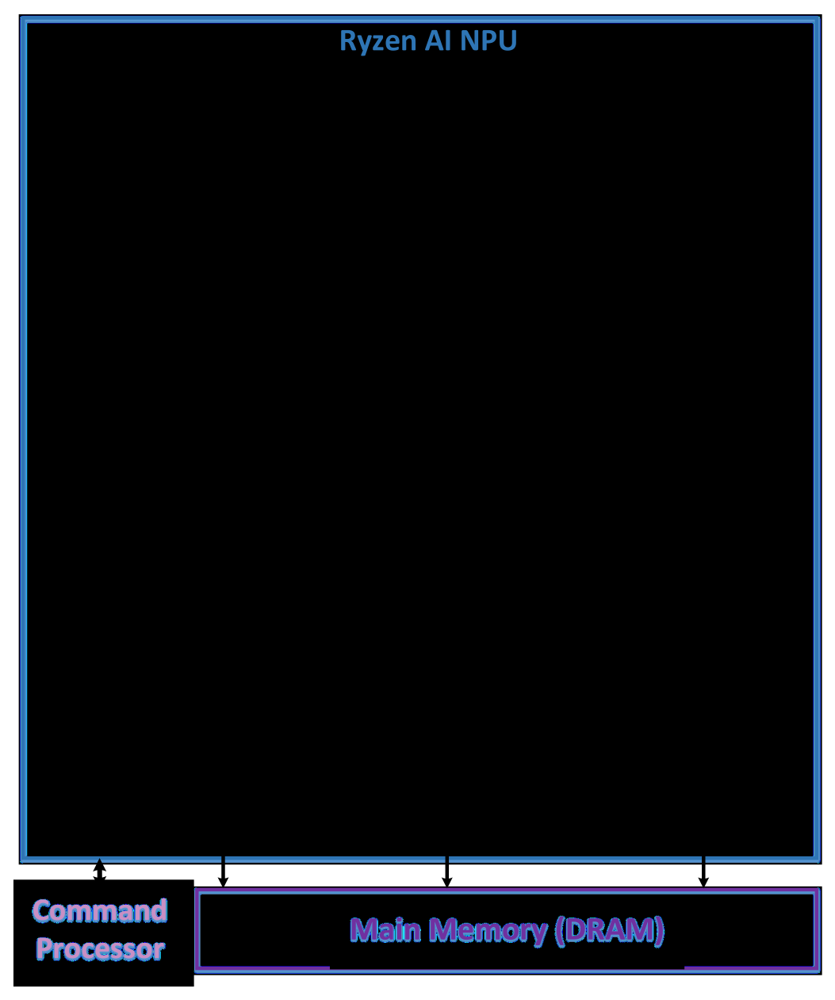{#fig-npu-architecture width=74%}

XDNA 和 XDNA2 的体系结构如图 @fig-npu-architecture 所示。
NPU 是一种模块化且可扩展的架构，由一个由同质计算块（CompTile）组成的二维阵列构成 [@NPU_arch_MICRO_2024; @AMD_AIE_ML_architecture_manual]。
CompTile 包含在本地内存（L1）上运行的处理核心。
NPU 核心是一个超长指令字（VLIW）处理器，带有单指令多数据（SIMD）数据通路，同时支持定点与浮点运算。
NPU 还通过内存块（MemTile）引入了第二层片上存储（L2）。
这些 MemTile 以单行方式排列，位于 CompTile 阵列下方（见图 @fig-npu-architecture）。
最后，NPU 还包含最下方一行接口块（ShimTile），用于与 DRAM 通信。

存储层次之间的数据移动由直接内存访问（DMA）引擎完成，这些引擎集成在所有 NPU tile 中。
DMA 通过可配置互连（switch）在 NPU tile 之间移动数据，这些 switch 在图 @fig-npu-architecture 中以黑色方块表示。
ShimTile 的 DMA 引擎通过 NPU 片上网络（NoC）和 Ryzen AI 芯片的 SoC 级互连，对 DRAM 进行读写 [@NPU_arch_MICRO_2024; @NPU_HOT_CHIPS_2023]。
任务调度和数据移动由片上命令处理器统一编排。
该处理器在运行时控制 ShimTile 与 DRAM 之间的数据移动，使 NPU 能够专注于主计算。
命令处理器还负责对 NPU 计算内核、switch 和 DMA 传输进行（重新）配置。

XDNA 共有 20 个计算核心，组织为 4×5 的 CompTile 阵列（行×列）[@NPU_arch_MICRO_2024]，而 XDNA2 则包含 32 个核心，组织为 4×8 阵列 [@IRON_MICRO_2024]。
两代 NPU 的每个 L1 tile 都有 64 KB 存储，每个 L2 tile 都有 512 KB 存储 [@NPU_arch_MICRO_2024; @AMD_AIE_ML_architecture_manual; @Zen_attention_AMD_paper]。
XDNA 和 XDNA2 原生支持 int8、int16 和 bf16 精度。
此外，XDNA2 还在硬件上支持 block floating-point（bfp16）数据类型 [@AMD_AIE_API_user_guide_2025.1]，其中一组 8 个数值共享一个公共指数 [@AMD_quark_bfp16; @Microsoft_block_floating_point_NEURIPS_2020]。
XDNA2 提供了更高的理论峰值计算能力，在最高频率下可达 50 TOPS [@AMD_CES; @IRON_MICRO_2024]，而 XDNA 的理论峰值为 10 TOPS [@NPU_arch_MICRO_2024]。

## 数据移动架构 {#sec-data-movement-architecture}

Ryzen AI NPU 具有专用的数据移动架构，它允许程序员显式配置存储层次各级之间的数据传输。
数据从源 DMA 通道移动到目标 DMA 通道时，会通过基于电路交换或分组交换的流，并使用其间一个或多个可配置 switch。
源通道是 memory-map to stream（MM2S）通道，它从内存读取数据并把数据推送到流式 switch。
相反，目标通道从流式 switch 接收数据，并把数据写回 memory-mapped 空间（S2MM）。
每个 CompTile 和 ShimTile 各包含两个 MM2S 和两个 S2MM DMA 通道，而 MemTile 则包含六个 MM2S 和六个 S2MM 通道 [@AMD_AIE_ML_architecture_manual]。

图 @fig-data-movement-matrix-a 展示了输入缓冲区 A 从 DRAM 到 L2 MemTile，再到 L1 的数据移动过程，最终由对应核心使用。
类似地，图 @fig-data-movement-matrix-c 展示了输出缓冲区从 L1 到 L2，再到 DRAM 的数据移动过程。
这些数据缓冲区与对应模块（例如 NPU 核心或 DRAM）之间的同步由硬件锁单元管理 [@AMD_AIE_ML_architecture_manual; @NPU_arch_MICRO_2024]。

DMA 独立运行，并且可与核心上的计算并行执行。
它们通过配置一系列 buffer descriptor（BD）进行编程。
BD 包含与特定 DMA 传输相关的全部必要信息，例如要读写的数据量、涉及的内存地址，以及在每次传输前后需要获取或释放的锁 [@AMD_AIE_ML_architecture_manual; @AMD_AIE_ML_kernel_guide]。
BD 同时支持线性内存寻址和多维地址生成，从而支持 DL 张量所需的按需数据布局变换。
CompTile 和 ShimTile 各支持 3D 张量寻址，而 MemTile 则支持 4D 寻址。
这一重要的 DMA 寻址特性被我们的 GEMM 实现广泛利用，并贯穿 NPU 架构中的所有 tile（参见第 @sec-dma-transformations 节），从而使张量能够以常规顺序存储在 DRAM 中。

::: {.columns}
::: {.column width="50%"}
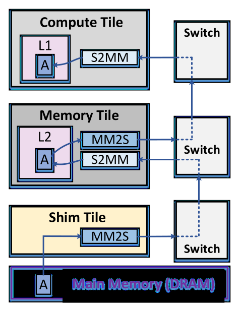{#fig-data-movement-matrix-a width=100%}
:::
::: {.column width="50%"}
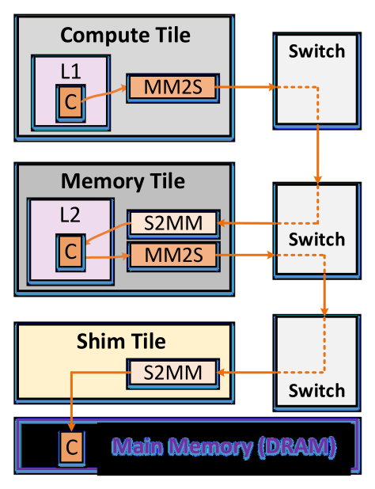{#fig-data-movement-matrix-c width=100%}
:::
:::

Ryzen AI NPU 中的存储层次数据移动如上两图所示：左图对应输入缓冲区 A，右图对应输出缓冲区 C。

## 编程工具 {#sec-programming-tools}

在本文中，我们使用 IRON，这是一个面向 Ryzen AI NPU 的开源近硬件编程工具链 [@mlir_aie_github_repo; @Erika_IRON_FCCM_2025]。
作为一个低层工具包，IRON 允许对 NPU 的体系结构属性进行细粒度控制，例如显式数据移动和 DMA 所支持的复杂访问模式，同时又提供了便捷的编程抽象。
这些特性使 IRON 成为 GEMM 实现的理想选择，因为性能取决于对 NPU 架构特性的显式控制。

IRON 基于一个名为 “AIE” 的多级中间表示（MLIR）方言 [@mlir_paper]，并通过 Python 绑定 [@mlir_python_bindings] 为该方言提供了更易用的接口。
因此，可以使用 Python 脚本来生成描述 NPU 层次间数据移动以及运行于核心上的计算内核的代码。
单核计算内核可以用高级 C++ 编写 [@AMD_AIE_API_user_guide_2025.1]，也可以用低层 SIMD intrinsic 编写 [@AIE_intrinsics]。
最后，单核内核有两种可选编译方式：专有的 `xchesscc` 编译器 [@AMD_AIE_ML_kernel_guide; @mlir_aie_github_repo]，以及开源的 `Peano` 工具 [@peano_github_repo]。

# GEMM 设计与优化 {#sec-gemm-design}

## GEMM 多级分块与映射 {#sec-gemm-tiling-mapping}

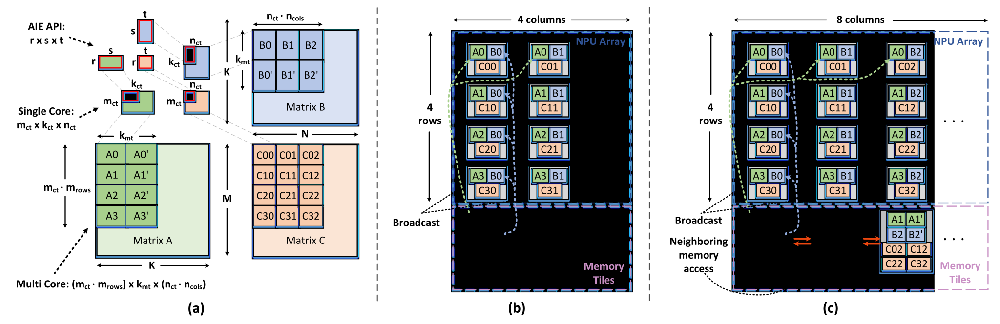{#fig-gemm-tiling-mapping width=100%}

图 @fig-gemm-tiling-mapping 展示了我们用于划分输入矩阵和输出矩阵的多级分块方案。
最内层（第一层）分块由单核 GEMM 内核所支持的 AIE API 库形状决定 [@AMD_AIE_API_user_guide_2025.1]，并通过参数 $r \times s \times t$ 表示。
AIE API 为每种受支持的精度提供了多种优化模式，并支持跨 NPU 代际的可移植性。
第二层分块由驻留在本地 L1 内存中的 GEMM 内核决定，记作 $m_\text{ct} \times k_\text{ct} \times n_\text{ct}$。
由于 NPU 是多核架构，我们把 GEMM 划分到多个核心上，以利用空间层面的并行性并最大化性能。
第三层分块实现了这种划分，它对应于整个 NPU 阵列上运行的 GEMM 尺寸（参数和映射在下一节中说明）。
最后，最外层（第四层）分块由输入矩阵 $A$（通常是 *activations*）、矩阵 $B$（通常是 *weights*）以及输出矩阵 $C$ 的最终 GEMM 尺寸决定，记作 $M \times K \times N$。

## NPU 上的 GEMM 映射策略 {#sec-gemm-mapping-strategy}

我们的映射策略是在 $M$ 和 $N$ 维度上以 *空间* 方式并行化 GEMM，而在 $K$ 维度上的归约则在 *时间* 维度完成。
通过这种方式，所有 NPU 核心都在不同数据上执行*相同*的 GEMM 计算，并且彼此*独立*运行。
这会带来最高性能，因为核心之间不会发生数据通信；这与 Versal 器件不同，后者通常会把归约维度分配给多个核心 [例如 @MaxEVA_2023; @GAMA_FPL_2025]。
借助 NPU 架构中的广播特性，我们能够获得空间并行化，并利用 GEMM 算法内在的数据复用。
这种并行化由 $M$ 和 $N$ 维度上的单核 tile 数来表示，分别由参数 $m_\text{rows}$ 和 $n_\text{cols}$ 定义（见图 @fig-gemm-tiling-mapping）。
在本文中，我们把参数 $m_\text{rows}$ 和 $n_\text{cols}$ 直接映射为两种 NPU 架构中阵列的行数和列数。
具体而言，我们把每个输入 $A$ tile 广播到 NPU 阵列中的一整行上（例如，XDNA 和 XDNA2 分别对应图 @fig-gemm-tiling-mapping 中的 $A0$）。
类似地，每个 $B$ tile 会广播到一整列 NPU 核心上。
需要注意的是，由于 XDNA 的最后一列中没有 ShimTile，我们选择把该架构上的 GEMM 映射到 4 行 4 列，类似于 [@GEMM_example_mlir_aie; @roesti2025unlocking; @fang2025dato_paper]。
这使得我们可以实现一个对称的 4×4（$m_\text{rows} \times n_\text{cols}$）GEMM，如图 @fig-gemm-tiling-mapping 的 (b) 所示。
对于 XDNA2，我们利用了完整的 4×8 阵列，因此得到的是一个非对称映射（图 @fig-gemm-tiling-mapping 的 (c)）。

每个核心执行一个尺寸为 $m_\text{ct} \times k_\text{ct} \times n_\text{ct}$ 的 GEMM。
为了处理对 $K$ 的归约，单核内核还会加载之前的部分结果，尺寸为 $m_\text{ct} \times n_\text{ct}$，执行累加，并将更新后的结果写回输出 tile。
例如，图 @fig-gemm-tiling-mapping (b) 中左上角核心会按顺序加载 $A0$ 与 $B0$、$A0'$ 与 $B0'$ 等 tile，以完成归约。
这样一来，输出 $C$ tile 就保持在每个核心的 L1 内存中不动，也就是输出驻留（output stationary）映射。
当所有 tile 完成累加（总共 $K/k_\text{ct}$ 个 tile）后，输出 tile 会被传送到 L2 MemTile，最终再传到 DRAM。
MemTile 的设计会在第 @sec-memtile-design 节中详细说明。
随后，一个快速的向量化内核会把输出 $C$ tile 初始化为零，为下一轮 GEMM 分块的累加做准备。

为了让 GEMM 计算与矩阵 tile 的 DMA 传输重叠，我们在输入 tile $A$ 和 $B$ 上同时采用 L1 与 L2 的双缓冲。
然而，输出 $C$ tile 在每个核心上只保留单缓冲。
由于输出 tile 只会在完整归约完成后传输一次，当 $K/k_\text{ct}$ 足够大时，单缓冲输出传输带来的少量额外延迟就会变得可以忽略。
与此同时，这一设计选择释放了宝贵的 L1 内存，从而使分块参数优化具有更高的灵活性。
最终，这种额外内存所支持的更大 tile 尺寸，会在一般情况下带来更高的端到端 GEMM 性能（见第 @sec-single-output-buffer 节）。

## MemTile 设计 {#sec-memtile-design}

输入 tile 会暂存在 L2 MemTile 中，然后再广播给每个 NPU 核心。
需要注意的是，我们会沿着归约维度 $K$ 在 MemTile 中加载多个输入 tile（例如，图 @fig-gemm-tiling-mapping 的 (b) 和 (c) 中的 $A0$ 与 $A0'$）。
这是映射中的一个重要方面。
加载多个 tile 让我们能够从 DRAM 中访问更大范围的*连续*数据，而 DRAM 中的矩阵是按常规顺序（*行主序*和*列主序*）存放的。
这种长连续读取会提高 DRAM 带宽（BW）利用率，而这对于在系统层面最大化 GEMM 性能至关重要。
在本文中，我们让矩阵 $A$ 和 $C$ 保持 *行主序*，而矩阵 $B$ 则可以是 *行主序* 或 *列主序*。
为此，我们引入另一个参数 $k_\text{mt}$，用于指定加载到 L2 中的 tile 大小。
具体而言，对于矩阵 $A$，每个 L2 MemTile 会加载一个尺寸为 $m_\text{ct} \times k_\text{mt}$ 的 tile。
类似地，当矩阵 $B$ 为 *列主序* 时，每个 L2 MemTile 会加载一个尺寸为 $k_\text{mt} \times n_\text{ct}$ 的 tile。
把矩阵 $A$ 存为 *行主序*、矩阵 $B$ 存为 *列主序*，可以为这两个矩阵提供足够的连续 DRAM 访问，从而带来更高的 GEMM 性能（见第 @sec-gemm-performance-sweeps 节）。
不过，当 $B$ 为 *行主序* 时，MemTile 会加载与 CompTile 相同的 tile（即 $k_\text{ct} \times n_\text{ct}$），因为连续数据可以沿着 $n_\text{ct}$ 维度访问。

由于 XDNA 的 4×4 对称设计，每个 MemTile 会持有相同数量的输入 tile，如图 @fig-gemm-tiling-mapping 的 (b) 所示。
具体而言，每个 MemTile 会在其所在列内广播 $B$ tile。
$A$ tile 则跨四行广播；我们把它们按常规方式映射到四个 MemTile：第 0 列中的 MemTile 持有 $A0$（它会广播到第 0 行），第 1 列中的 MemTile 持有 $A1$（它会广播到第 1 行），依此类推。
相比之下，对于 XDNA2，我们由于其 4×8 的非对称设计，把四个 $A$ tile 交错地映射到偶数列上的八个 MemTile 中。
$B$ 的映射方式保持不变。
在这种设计下，偶数列上的 MemTile 比奇数列持有更多 tile，如图 @fig-gemm-tiling-mapping 的 *逻辑* 视图所示。
这种特殊映射有助于 IRON 利用 NPU 架构中直接访问相邻 MemTile 内存的特性 [@AMD_AIE_ML_architecture_manual]。
因此，当缓冲区大小超过某个 MemTile 的容量时，IRON 会把缓冲区*物理上*分配到邻近的 MemTile。

需要注意的是，每一列会把四个输出 $C$ tile 聚合到一个 MemTile 中（图 @fig-gemm-tiling-mapping 的 (b) 和 (c)）。
这是因为四个 $C$ tile 需要同时传输，而 ShimTile 只提供两个 S2MM 通道。
因此，我们利用每个 MemTile 提供的六个 S2MM 通道 [@AMD_AIE_ML_architecture_manual]，先临时存放这四个输出 tile，再通过 ShimTile 将它们传到 DRAM。

我们把*原生* GEMM 尺寸定义为 $(m_\text{ct} \cdot m_\text{rows}) \times k_\text{mt} \times (n_\text{ct} \cdot n_\text{cols})$。
这对应于能够在整个 NPU 阵列上原生运行、同时还能保证高性能的 GEMM 尺寸。
此外，需要注意的是，尽管我们任意地把矩阵 $A$ 映射到行方向、把矩阵 $B$ 映射到列方向，反向映射同样可行，因此在 $M$ 和 $N$ 维度上存在对称解。
最后，虽然也可以采用输入驻留映射，但它并不适合高效支持任意 GEMM 尺寸。
具体来说，部分结果需要临时存放在 MemTile 中，随后再重新加载到 CompTile，以便利用 GEMM 中的数据复用。
这会需要三个输入通道才能高效执行 GEMM，而 CompTile 只有两个输入通道。

## 按需张量变换 {#sec-dma-transformations}

我们广泛利用 DMA 的多维寻址特性，把数据重组为 NPU 核心所需的分块布局。
这使得矩阵能够以标准顺序存放在 DRAM 中（*行主序*和*列主序*）。
单核 GEMM 内核假定矩阵已经预先分块 [@AMD_AIE_API_user_guide_2025.1]。
具体而言，每个核心上运行的内核期望接收 $r \times s \times t$ 大小的 tile，而且 tile *内部* 与 tile *之间* 的数据都应为 *行主序*，如图 @fig-dma-transformations-mat-a 上半部分所示，以矩阵 $A$ 为例。
前述跨多个核心分布 tile 的方式，加上连续 DRAM 访问的要求，会带来多次数据布局变换，下面将对此进行说明。

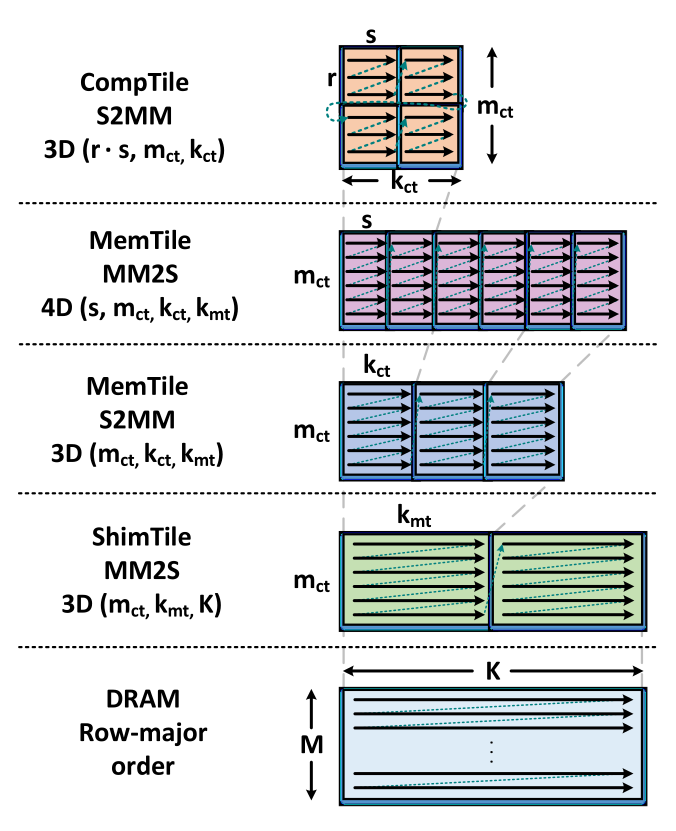{#fig-dma-transformations-mat-a width=70%}

当矩阵从 DRAM 传送到 NPU 时，DMA 会根据每个 NPU tile 的寻址能力执行一系列变换。
图 @fig-dma-transformations-mat-a 展示了与矩阵 $A$ tile 传输相关的各 DMA 通道的变换过程（DMA 通道见图 @fig-data-movement-matrix-a）。
起初，ShimTile 的 MM2S 通道会从 DRAM 中读取一个尺寸为 $m_\text{ct} \times K$ 的 tile。
由于 ShimTile 支持 3D 寻址，这个 *行主序* 的 $m_\text{ct} \times K$ tile 会通过 MM2S 通道被转换为多个更小的 $m_\text{ct} \times k_\text{mt}$ tile（参数为 $m_\text{ct}$、$k_\text{mt}$、$K$）。
在每个 $m_\text{ct} \times k_\text{mt}$ tile 存入 MemTile 之前，S2MM MemTile 通道会再进行一次 3D 变换，把它分割成若干个 $m_\text{ct} \times k_\text{ct}$ tile（参数为 $m_\text{ct}$、$k_\text{ct}$、$k_\text{mt}$）。

每个 MemTile 持有一个 $m_\text{ct} \times k_\text{mt}$ tile，并将其按一系列更小的 $m_\text{ct} \times k_\text{ct}$ tile 顺序传送到对应的 CompTile。
由于 CompTile 期望的是预分块数据，因此这些更小 tile 的数据布局也需要变换。
要描述这次传输，需要五个参数，即 $r$、$s$、$m_\text{ct}$、$k_\text{ct}$ 和 $k_\text{mt}$。
然而，MemTile 只支持 4D 寻址。
为绕过这一限制，我们把这个变换拆成两个独立的变换，分别利用 MM2S MemTile（输出）通道和 S2MM CompTile（输入）通道中的硬件数据布局变换能力。
首先，MM2S MemTile 通道把数据分割成若干个 $m_\text{ct} \times s$ tile，如图 @fig-dma-transformations-mat-a 所示（参数为 $s$、$m_\text{ct}$、$k_\text{ct}$、$k_\text{mt}$）。
这使得 $r \times s$ tile 内的地址能够线性化，从而让随后在 S2MM CompTile 通道中进行的 3D 变换能够把数据重组为所需布局（*有效*参数为 $r \cdot s$、$m_\text{ct}$、$k_\text{ct}$）。

DMA 中的地址生成以 32 位粒度进行 [@AMD_AIE_ML_architecture_manual; @AMD_AIE_ML_kernel_guide]。
DMA 本身无法对更小精度的数据类型执行布局变换（例如 int8 或 bf16 数据类型中的单个元素）。
不过，可以利用运行在 AIE 核心上的 shuffle 指令来支持这种操作，并实现细粒度的数据置换。
在我们的应用中，这在矩阵 $B$ 以 *列主序* 存于 DRAM 的场景下尤为重要。
为此，我们修改 GEMM 内核，使用 AIE API 的 transpose 函数 [@transpose_AIE_API]，使得 tile 内部和 tile 之间的数据都以 *列主序* 组织。
随后，我们再像矩阵 $A$ 那样，在整个 NPU 层次上对矩阵 $B$ 应用类似的变换（见图 @fig-dma-transformations-mat-a）。

此外，当矩阵 $B$ 为 *行主序* 时，只需要在 MemTile 中执行一次 4D 变换（参数为 $s$、$t$、$k_\text{ct}$、$n_\text{ct}$），因为每个 MemTile 持有一个 $k_\text{ct} \times n_\text{ct}$ tile（见第 @sec-gemm-mapping-strategy 节）。
类似地，矩阵 $C$ 的 tile（*行主序*）也只需要在 MemTile 中执行一次 4D 变换（参数为 $r$、$t$、$m_\text{ct}$、$n_\text{ct}$）。

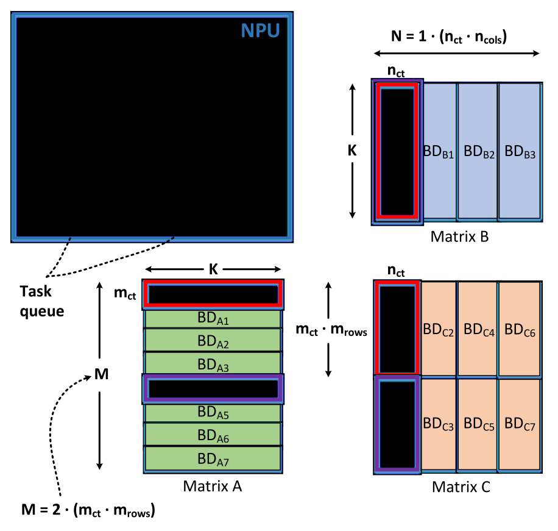{#fig-dram-npu-data-movement width=78%}

## NPU 与 DRAM 之间的数据移动 {#sec-npu-dram-data-movement}

最外层（第四层）GEMM 分块涵盖 NPU 与 DRAM 之间的数据移动。
NPU 通过 ShimTile 与 DRAM 连接，而数据移动的控制由片上命令处理器统一编排。
ShimTile 配有输入任务队列，以便顺序提交 DMA 传输任务。
当某个任务结束时，它会发出一个任务完成 token，命令处理器借此在多次 DRAM 传输之间进行同步。
每个 ShimTile 可访问 16 个 BD [@AMD_AIE_ML_architecture_manual]，它们用于指定 DMA 传输。
当复杂的数据移动模式需要的 BD 数量超过 16 个时，我们可以复用（重新配置）这些 BD。
在重新配置 BD 之前，必须正确同步，并确保与该 BD 关联的上一笔传输已经完成 [@runtime_data_movement_mlir_aie]。

图 @fig-dram-npu-data-movement 展示了 NPU 与 DRAM 之间数据移动的简化视图。
每个 BD 都用于细粒度地描述数据移动。
具体而言，对于矩阵 $A$，每个 BD 定义一次尺寸为 $m_\text{ct} \times K$ 的 ShimTile DMA 传输。
类似地，对于矩阵 $B$，每个 BD 定义一次尺寸为 $K \times n_\text{ct}$ 的传输。
对于矩阵 $C$，每个 BD 描述一次尺寸为 $(m_\text{ct} \cdot m_\text{rows}) \times n_\text{ct}$ 的传输，因为每一列会聚合 $m_\text{rows}$ 个输出 tile。
我们实现中的命令处理器程序会根据 GEMM 映射策略，把 BD 映射并插入到各个 ShimTile 的任务队列中（例如把 $BD_{A0}$、$BD_{B0}$ 和 $BD_{C0}$ 放入 ShimTile 0，把 $BD_{A1}$、$BD_{B1}$ 和 $BD_{C2}$ 放入 ShimTile 1，等等）。
此外，$BD_{A4}$、$BD_{B0}$ 和 $BD_{C1}$ 也会按照 GEMM 分块要求被推入 ShimTile 0 的队列。
类似地，我们的程序会按顺序把描述 GEMM 传输的 BD 排队到每个 ShimTile 的输入任务队列中。
需要指出的是，图 @fig-dram-npu-data-movement 中的简化示例可直接用于 XDNA（$n_\text{cols}=4$，见第 @sec-gemm-mapping-strategy 节），而 XDNA2 的 BD 映射可以直接按同样方式推导。

根据目标 GEMM 尺寸（即 $M$、$K$、$N$），每个 ShimTile 所需的 BD 可能会超过 16 个的上限。
在这种情况下就需要进行 BD 重配置，这可能会带来性能下降（见第 @sec-bd-reconfiguration 节）。
为解决这一挑战，我们提出如下流程，使 DMA 数据传输能够与 BD 重配置重叠。
起初，我们为 $A$、$B$ 和 $C$ 这三类 DMA 传输各自向任务队列提交 5 个 BD。
这样可以高效利用每个 ShimTile 可用的 16 个 BD 中的 15 个。
每次 DMA 传输一旦到达队列前端，就会立即开始。
例如，图 @fig-dram-npu-data-movement 中会先启动 $BD_{A0}$ 和 $BD_{B0}$ 的传输。
随后，命令处理器会按顺序等待每一次输出传输的任务完成 token（例如先等 $BD_{C0}$，再等 $BD_{C1}$，以此类推）。
需要注意的是，命令处理器只需要等待输出矩阵对应的 BD 完成（例如 $BD_{C0}$），因为一旦它完成，与之对应的输入 BD（例如 $BD_{A0}$ 和 $BD_{B0}$）也已经完成。
因此，每当某个输出 BD 完成后，这三个已退役的 BD 就可以安全地重新配置，并在队列中插入下一组三个 BD（如果有可用项）。
这样就能在稳态下始终让 15 个 BD 保持在队列中，使 DMA 数据移动与 BD 重配置高效重叠。
这一过程会迭代重复，直到完成 GEMM 分块。

上文所述对 NPU 与 DRAM 数据移动的细粒度 BD 描述，使我们能够支持非常大的 GEMM 尺寸。
GEMM 的维度受限于多维张量寻址所使用的 NPU 寄存器位宽 [@AMD_AIE_ML_kernel_guide]。
例如，当 $B$ 以 *列主序* 存放时，[@GEMM_example_mlir_aie] 中的 GEMM 编程示例在 XDNA2 上对 bf16 的归约维度 $K$ 只支持到约 4K，而我们的方法可以在所有维度上支持大于 64K 的尺寸。

## 解析建模优化 {#sec-analytical-modeling-optimization}

为了最大化 GEMM 性能，我们提出一种基于解析建模的优化方法。
首先，我们关注单核性能，以便获得片上计算部分的洞见。
随后，我们把该方法扩展到系统层面优化，并把片外 DRAM 带宽约束纳入其中。

### 单核 GEMM 优化 {#sec-single-core-optimization}

我们的模型使用体系结构参数，例如核心的峰值计算吞吐量（以 $peak\_MACs$ 表示，单位为 MACs/cycle）以及 DMA 带宽（以 $DMA\_BW$ 表示，单位为 Bytes/cycle），来寻找能够最大化性能的 $m_\text{ct}$、$k_\text{ct}$、$n_\text{ct}$ 参数。
我们把效率（$eff$）定义为已获得计算吞吐量占核心峰值吞吐量的比例。
式 @eq-compute-cycles 给出了 GEMM 内核的计算周期数（$C_{comp}$），而式 @eq-comm-a-cycles 和 @eq-comm-b-cycles 分别给出了 $A$（$CA_{comm}$）和 $B$（$CB_{comm}$）tile 的 DMA 传输所需周期数。
这里，$ty(\cdot)$ 表示矩阵的数据类型大小（以 Bytes 为单位）。

$$
C_{comp} = m_\text{ct} \cdot k_\text{ct} \cdot n_\text{ct}/ (eff \cdot peak\_MACs)
$$ {#eq-compute-cycles}

$$
CA_{comm} = m_\text{ct} \cdot k_\text{ct} \cdot ty(A)/ DMA\_BW
$$ {#eq-comm-a-cycles}

$$
CB_{comm} = k_\text{ct} \cdot n_\text{ct} \cdot ty(B)/ DMA\_BW
$$ {#eq-comm-b-cycles}

接下来，我们用式 @eq-compute-bound-constr 定义约束，以确保单核 GEMM 保持计算受限，也就是不受 $A$ 和 $B$ tile 的 DMA 带宽限制。
此外，式 @eq-memory-constr 约束 GEMM 缓冲区必须能够放入 64 KB 的 L1 内存容量中（其中 1 KB 预留给栈）。
最后，我们施加一个直接的约束，即 $m_\text{ct}$、$k_\text{ct}$、$n_\text{ct}$ 必须分别是 $r$、$s$、$t$ 的倍数（此处不展开）。

$$
C_{comp} \geq \{CA_{comm},\ CB_{comm}\}
$$ {#eq-compute-bound-constr}

$$
\begin{aligned}
\{2 \cdot m_\text{ct} \cdot k_\text{ct} \cdot ty(A)
&+ 2 \cdot k_\text{ct} \cdot n_\text{ct} \cdot ty(B) \\
&+ m_\text{ct} \cdot n_\text{ct} \cdot ty(C)\} \leq 63\,\text{KB}
\end{aligned}
$$ {#eq-memory-constr}

$m_\text{ct}$、$k_\text{ct}$、$n_\text{ct}$ 的求解可以被表述为一个整数规划（IP）优化问题，并使用上述约束。
我们通过穷举方式求解该 IP，并把 MAC 数量的最大化（即 $m_\text{ct} \cdot k_\text{ct} \cdot n_\text{ct}$）作为主目标。
这会增加 GEMM 中的数据复用，从而最大化整体效率。
此外，由于采用输出驻留的 GEMM 映射，我们还设置第二个目标，即最小化输出 $C$ tile（也就是 $m_\text{ct} \cdot n_\text{ct}$ 的乘积）。
这对于减少累加时的 load/store 次数以及降低由 bank 冲突造成的内存停顿至关重要。
显然，这两个优化目标会推动 $k_\text{ct}$ 增大，同时让 $m_\text{ct}$ 和 $n_\text{ct}$ 减小（但仍需足够大，以免受 DMA 带宽限制）。
此外，请注意我们并没有像对 $A$ 和 $B$ 那样，对输出 $C$ 缓冲区施加 DMA 约束（式 @eq-comm-a-cycles 与 @eq-comm-b-cycles），同时还把 $C$ 保留为单缓冲（式 @eq-memory-constr）。
这会显著扩大搜索空间，从而在*一般* GEMM 情况下提高性能，这也是下文系统级优化所依赖的关键因素。

### 系统级 NPU 阵列优化 {#sec-system-level-optimization}

首先，我们以解析形式表达 GEMM 中每个矩阵的 DRAM 访问量。
式 @eq-a-dram-footprint 给出了矩阵 $A$ 的 DRAM 读访问量（$A_{mem}$）。
其中第一项 $m_\text{ct} \cdot m_{\text{rows}} \cdot K \cdot ty(A)$ 表示在沿 $K$ 维进行 GEMM 分块时发生的 DRAM 读访问（单位 Bytes）。
这是由输出驻留映射以及 $A$ 会沿行广播这一事实决定的（见第 @sec-gemm-mapping-strategy 节）。
第二项 $N/(n_\text{ct} \cdot n_\text{cols})$ 描述了由于沿 $N$ 维分块而带来的上述读访问重复次数。
类似地，第三项 $M/(m_\text{ct} \cdot m_\text{rows})$ 则刻画了沿 $M$ 维的重复。

$$
\begin{aligned}
A_{mem} &=
\left(m_\text{ct} \cdot m_{\text{rows}} \cdot K \cdot ty(A)\right)
\left(\frac{N}{n_\text{ct} \cdot n_\text{cols}}\right)
\left(\frac{M}{m_\text{ct} \cdot m_\text{rows}}\right) \\
\Rightarrow\ A_{mem} &= M \cdot K \cdot N \cdot ty(A)/(n_\text{ct} \cdot n_\text{cols})
\end{aligned}
$$ {#eq-a-dram-footprint}

类似地，式 @eq-b-dram-footprint 表示矩阵 $B$ 的 DRAM 读访问量（$B_{mem}$），而式 @eq-c-dram-footprint 则给出了输出矩阵 $C$ 的 DRAM 写访问量（$C_{mem}$）。
我们注意到，这些方程为 GEMM 中的数据复用和分块方案提供了一个优雅而紧凑的表达。

$$
B_{mem} = M \cdot K \cdot N \cdot ty(B)/(m_\text{ct} \cdot m_\text{rows})
$$ {#eq-b-dram-footprint}

$$
C_{mem} = M \cdot N \cdot ty(C)
$$ {#eq-c-dram-footprint}

此外，式 @eq-npu-time 描述了 NPU 上的 GEMM 计算时间（$T_{comp}$），而式 @eq-dram-time 则表示总 DRAM 访问时间（$T_{mem}$）。
这里，$peak\_TOPS$ 表示 NPU 阵列在最大运行频率下计算得到的*理论峰值*吞吐量。
此外，$DRAM\_BW$ 是 NPU 执行 GEMM 时所达到的*有效* DRAM 带宽。
需要注意的是，由于所有 NPU 核心都在*独立*执行同一个 GEMM 内核，式 @eq-npu-time 中定义的单核效率 $eff$ 会直接对应整个 NPU 阵列的效率。

$$
T_{comp} = 2 \cdot M \cdot K \cdot N /(eff \cdot peak\_TOPS)
$$ {#eq-npu-time}

$$
T_{mem} = (A_{mem} + B_{mem} + C_{mem})/ DRAM\_BW
$$ {#eq-dram-time}

正如前文在第 @sec-single-core-optimization 节中所讨论的，减小 $m_\text{ct}$ 和 $n_\text{ct}$、以及增大 $k_\text{ct}$，对于获得高效率、从而实现最大化的 GEMM 性能（等价于最小化 $T_{comp}$）是至关重要的。
然而，从式 @eq-a-dram-footprint 和式 @eq-b-dram-footprint 可以看出，$n_\text{ct}$ 和 $m_\text{ct}$ 分别出现在 $A$ 和 $B$ 的 DRAM 访问分母中。
因此，随着 $m_\text{ct}$ 和 $n_\text{ct}$ 的减小，DRAM 访问时间 $T_{mem}$ 会增加。
这说明了计算时间与内存时间之间的*反比*关系：*一个增加，另一个就减少*。
因此，最优 GEMM 性能出现在两者相交的*平衡*点（即 $T_{comp} \approx T_{mem}$）上。

为了找到上述最优*平衡*点，我们先经验性地设定 $m_\text{ct}$、$k_\text{ct}$、$n_\text{ct}$ 和 $eff$ 的起始值，然后执行下面说明的迭代过程（这些起始值可把迭代次数通常减少到 5 次以下）。
这些起始值基于单核内核优化的结果（见第 @sec-single-core-optimization 节）以及 GEMM 运行期间的有效 $DRAM\_BW$（通过 micro-benchmarking 测量，见第 @sec-optimal-balanced-gemm-kernel 节）。
首先，我们测量起始值下 NPU 设备上的实际 GEMM 性能以及单核效率，并验证 GEMM 处于内存受限状态（$T_{comp} < T_{mem}$，这是由较小的 $m_\text{ct}$、$n_\text{ct}$ 和较大的 $k_\text{ct}$ 导致的）。
在每次迭代中，我们都会减小参数 $k_\text{ct}$（取 $s$ 的倍数），并求解一个与前一小节相似的 IP。
不过，在该特定迭代中，我们固定 $k_\text{ct}$ 参数，目标改为最大化 $m_\text{ct} \cdot n_\text{ct}$ 的乘积。
在给定 DMA 带宽与 L1 内存约束的情况下，这会让 $m_\text{ct}$ 和 $n_\text{ct}$ 取到尽可能大，从而确保得到一个高度优化的 GEMM 内核（MAC 数量最大）。
这一点对于找到最优*平衡*点至关重要，因为它能让每次迭代中的 $T_{comp}$ 增量尽可能小，同时还保证该迭代下 GEMM 性能最大。
这里我们注意到，$eff$ 是根据每次迭代的上一轮测量值估计出来的。
我们会针对每个 IP 的最优解，在 NPU 设备上迭代测量 GEMM 性能，并在每一步都验证当前性能高于前一步。
随着 GEMM 性能在各步中逐渐上升，最终我们会观察到性能下降，此时迭代停止。
显然，在这一特定点上，GEMM 已经转为计算受限（$T_{comp} > T_{mem}$），同时性能也更低。
因此，性能达到最大值的*平衡*点就已经被识别出来了（即上一轮迭代中的 $m_\text{ct}$、$k_\text{ct}$、$n_\text{ct}$ 参数）。

# 评估 {#sec-evaluation}

## 实验设置 {#sec-experimental-setup}

对于实验评估，我们使用了两台代表性的迷你主机，对应两代 NPU。
用于 XDNA 的是 Minisforum UM790 Pro [@Phoenix_mini_PC]，它搭载 Ryzen 9 7940HS 处理器（Phoenix Point）[@Phoenix_processor]。
用于 XDNA2 的是 ASRock 4×4 Box [@Krackan_mini_PC]，它搭载 AMD Ryzen AI 7 350 处理器（Krackan Point）[@Krackan_processor]。
两台迷你主机都配备了双通道 DDR5-5600 MT/s DRAM。
CPU 运行 Ubuntu 24.04 LTS，并充当主机。
具体而言，CPU 使用 Xilinx Runtime（XRT）[@xrt_github_repo] 在 DRAM 中分配连续的矩阵缓冲区，配置 NPU，调用 NPU 执行 GEMM，并处理完成通知。
最后，在所有实验中，NPU 都被配置在其最高性能级别，也就是 *turbo* 模式 [@xrt_smi_commands]，并使用 XDNA 驱动命令 [@xdna_driver_github_repo]。

## 单核 GEMM 性能 {#sec-single-core-gemm-performance}

我们利用 AIE API [@AMD_AIE_API_user_guide_2025.1] 设计了高度优化的单核 GEMM 内核。
这些内核使用 `xchesscc` 工具编译，并采用多种编译器指令（例如软件流水化以及循环展开/展开平坦化）来获得高效率。
性能通过利用 NPU trace 单元进行硬件剖析来评估 [@AMD_AIE_ML_architecture_manual; @tracing_mlir_aie]，从而获得周期精度的测量结果。
对于 int8，除了完整输出精度（int32）之外，我们还进行了精度缩减到 16 位和 8 位的实验；这是一种在 AIE 架构中提高 GEMM 性能的常见技术 [@Vitis_tutorials; @Charm_v2_2024; @AMA_FPL_2024; @GAMA_FPL_2025]。
此外，对于 bf16，我们保留输出精度为 bf16。
最后，对于 XDNA2，我们使用 bfp16 硬件数据通路来模拟 bf16 精度，这会进一步提高 GEMM 性能（这种模拟通过编译时的特定 `xchesscc` 标志实现，正如 [@AMD_AIE_API_user_guide_2025.1] 中所述）。

| 设备 | 精度（输入-输出） | 内核尺寸 $m_\text{ct}\times k_\text{ct}\times n_\text{ct}$ | 吞吐量（MACs/cycle） | L1 核心内存（KB） |
|---|---|---:|---:|---:|
| **XDNA** | int8-int8 | 64 × 232 × 64 | 233.0 | 62.0 (97%) |
| **XDNA** | int8-int16 | 64 × 216 × 64 | 217.6 | 62.0 (97%) |
| **XDNA** | int8-int32 | 48 × 280 × 48 | 192.0 | 61.5 (96%) |
| **XDNA** | bf16-bf16 | 64 × 104 × 64 | 112.6 | 60.0 (94%) |
| **XDNA2** | int8-int8 | 64 × 232 × 64 | 450.6 | 62.0 (97%) |
| **XDNA2** | int8-int16 | 64 × 216 × 64 | 419.8 | 62.0 (97%) |
| **XDNA2** | int8-int32 | 48 × 280 × 48 | 384.0 | 61.5 (96%) |
| **XDNA2** | bf16-bf16 | 48 × 152 × 48 | 158.1 | 61.5 (96%) |

: XDNA 与 XDNA2 的单核 GEMM 结果。 {#tbl-single-core-gemm-results}

在表 @tbl-single-core-gemm-results 中，我们给出了第 @sec-single-core-optimization 节所述单核优化过程的最优解。
对于 int8 精度，我们在 XDNA 和 XDNA2 上分别获得了 192.0–233.0 MACs/cycle 和 384.0–450.6 MACs/cycle 的高吞吐量。
类似地，对于 bf16，我们在 XDNA 上达到 112.6 MACs/cycle，在 XDNA2 上达到 158.1 MACs/cycle。
可以看出，在这两种情况下，XDNA2 的吞吐量都高于 XDNA，因为它在单核层面拥有更高的峰值计算能力。
需要注意的是，由于性能是通过硬件 trace 测得的，表 @tbl-single-core-gemm-results 的结果包含了由 bank 冲突带来的不可避免的内存停顿，因此反映的是*实际* NPU 性能（只要不受 DRAM 带宽限制）。
最后，所有解都达到了很高的 L1 内存利用率，范围为 94–97%。

| 设备 | 精度（输入-输出） | 内核尺寸 $m_\text{ct}\times k_\text{ct}\times n_\text{ct}$ | 乘积 $m_\text{ct}\cdot n_\text{ct}$ | 吞吐量（MACs/cycle） | L1 核心内存（KB） | L2 总内存（KB） | 峰值（Comp. TOPS） | GEMM 尺寸 $M\times K\times N$ | 实际（NPU TOPS） |
|---|---|---:|---:|---:|---:|---:|---:|---:|---:|
| **XDNA** | **int8-int8** | **112 × 112 × 112** | **12.3K** | **212.5** | **61.3 (96%)** | **980 (48%)** | **6.80** | **4032 × 4032 × 4032** | **6.52** |
| XDNA | int8-int8 | 112 × 104 × 128 | 14.0K | 207.4 | 62.8 (98%) | 1004 (49%) | 6.63 | 4032 × 4160 × 4096 | 6.48 |
| **XDNA** | **int8-int16** | **96 × 112 × 96** | **9.0K** | **192.0** | **60.0 (94%)** | **960 (47%)** | **6.14** | **4224 × 4032 × 4224** | **5.85** |
| XDNA | int8-int16 | 80 × 104 × 128 | 10.0K | 186.9 | 62.3 (97%) | 996 (49%) | 5.98 | 4160 × 4160 × 4096 | 5.75 |
| **XDNA** | **int8-int32** | **80 × 88 × 96** | **7.5K** | **146.0** | **60.3 (94%)** | **964 (47%)** | **4.67** | **4160 × 4224 × 4224** | **4.42** |
| XDNA | int8-int32 | 64 × 80 × 128 | 8.0K | 133.1 | 62.0 (97%) | 992 (48%) | 4.26 | 4096 × 4160 × 4096 | 4.09 |
| **XDNA** | **bf16-bf16** | **96 × 56 × 96** | **9.0K** | **99.8** | **60.0 (94%)** | **960 (47%)** | **3.19** | **4224 × 4032 × 4224** | **3.12** |
| XDNA | bf16-bf16 | 96 × 48 × 112 | 10.5K | 97.3 | 60.0 (94%) | 960 (47%) | 3.11 | 4224 × 4032 × 4032 | 3.02 |

: XDNA 上跨不同数据类型的两组 top-ranked 方案评估（$B$ 为 *列主序*）。 {#tbl-top-ranked-solutions-gemm-xdna-array}

| 设备 | 精度（输入-输出） | 内核尺寸 $m_\text{ct}\times k_\text{ct}\times n_\text{ct}$ | 乘积 $m_\text{ct}\cdot n_\text{ct}$ | 吞吐量（MACs/cycle） | L1 核心内存（KB） | L2 总内存（KB） | 峰值（Comp. TOPS） | GEMM 尺寸 $M\times K\times N$ | 实际（NPU TOPS） |
|---|---|---:|---:|---:|---:|---:|---:|---:|---:|
| **XDNA2** | **int8-int8** | **144 × 72 × 144** | **20.3K** | **343.0** | **60.8 (95%)** | **2106 (51%)** | **39.52** | **4032 × 4320 × 4608** | **37.35** |
| XDNA2 | int8-int8 | 160 × 64 × 144 | 22.5K | 322.6 | 60.5 (95%) | 2064 (50%) | 37.16 | 4480 × 4224 × 4608 | 36.13 |
| **XDNA2** | **int8-int16** | **128 × 72 × 112** | **14.0K** | **307.2** | **61.8 (97%)** | **2084 (51%)** | **35.39** | **4096 × 4320 × 4480** | **30.77** |
| XDNA2 | int8-int16 | 160 × 64 × 96 | 15.0K | 271.4 | 62.0 (97%) | 2016 (49%) | 31.26 | 4480 × 4224 × 4608 | 29.59 |
| **XDNA2** | **int8-int32** | **96 × 64 × 96** | **9.0K** | **256.0** | **60.0 (94%)** | **2016 (49%)** | **29.49** | **4224 × 4224 × 4608** | **24.74** |
| XDNA2 | int8-int32 | 128 × 56 × 80 | 10.0K | 209.9 | 62.3 (97%) | 2036 (50%) | 24.18 | 4096 × 4032 × 4480 | 21.67 |
| **XDNA2** | **bf16-bf16** | **112 × 48 × 96** | **10.5K** | **137.2** | **60.0 (94%)** | **2496 (61%)** | **15.81** | **4032 × 4224 × 4608** | **14.52** |
| XDNA2 | bf16-bf16 | 160 × 40 × 80 | 12.5K | 124.1 | 62.5 (98%) | 2400 (59%) | 14.30 | 4480 × 4160 × 4480 | 13.67 |

: XDNA2 上跨不同数据类型的两组 top-ranked 方案评估（$B$ 为 *列主序*）。 {#tbl-top-ranked-solutions-gemm-xdna2-array}

在 XDNA2 的 bf16-bf16 情况下，我们使用 bfp16 硬件数据通路来进行模拟。

## NPU 阵列上的 GEMM 性能 {#sec-npu-array-gemm-performance}

在本节中，我们介绍整个 NPU 阵列上的 GEMM 性能。
性能使用 *wall-clock* 时间评估，因此能捕捉到用户实际观测到的*真实*性能（包括操作系统开销、NPU 派发时间等）[@wall_clock_time_mlir_aie]。
所有结果都是 100 次运行的平均值。

### 最优平衡 GEMM 内核 {#sec-optimal-balanced-gemm-kernel}

正如上一节所示，GEMM 内核可以达到很高的吞吐量。
然而，当使用表 @tbl-single-core-gemm-results 中的最佳计算内核尺寸时，我们发现 GEMM 在 NPU 阵列上的性能仍然很低。
例如，对于 int8-int16 精度，在 XDNA2 上我们在约 4K 的方阵 GEMM 上只得到 17.86 TOPS。
不过，当以最大运行频率计算时，该内核在 XDNA2 阵列上的峰值计算能力可达 48.36 TOPS（该最大频率通过 XDNA 驱动命令 [@xdna_driver_github_repo] 识别，即 XDNA 和 XDNA2 分别为 1 GHz 和 1.8 GHz）。
这说明在该特定内核尺寸下，GEMM 受内存限制，这是由于 $m_\text{ct}$ 和 $n_\text{ct}$ 值较小所致，也就是前文所述的计算与内存的反比关系。
因此，我们利用第 @sec-system-level-optimization 节所述的优化方法来识别最优*平衡*内核（即计算与内存达到平衡的位置）。
首先，我们使用 micro-benchmarking 来估计 NPU 在运行 GEMM 工作负载时可获得的*有效* DRAM 带宽。
在 micro-benchmarking 中，我们模拟 DRAM 与 NPU 阵列之间及其反向的 GEMM 传输，在 XDNA 和 XDNA2 上分别观察到约 15 GB/s 和约 50 GB/s。
随后，我们利用这些值来为第 @sec-system-level-optimization 节的迭代优化过程选择起始点。

表 @tbl-top-ranked-solutions-gemm-xdna-array 和表 @tbl-top-ranked-solutions-gemm-xdna2-array 分别给出了 XDNA 和 XDNA2 的两组 top-ranked 方案。
首先需要注意的是，与表 @tbl-single-core-gemm-results 中的内核相比，这些内核的 $k_\text{ct}$ 更低，而 $m_\text{ct}$、$n_\text{ct}$ 更高。
这会降低它们的计算吞吐量；例如，XDNA 上 int8-int16 的 96×112×96（表 @tbl-top-ranked-solutions-gemm-xdna-array）能够达到 192.0 MACs/cycle，而 64×216×64（表 @tbl-single-core-gemm-results）则能达到 217.6 MACs/cycle。
不过，NPU 阵列上的 GEMM 性能却提升了，因为此时计算与内存达到了平衡。
例如，在使用 96×112×96 内核时，XDNA 在约 4K GEMM 尺寸上的性能为 5.85 TOPS（见表 @tbl-top-ranked-solutions-gemm-xdna-array），而使用 64×216×64 内核时则只有 4.03 TOPS（未列于表 @tbl-single-core-gemm-results）。

其次，当进一步增大 $m_\text{ct}\cdot n_\text{ct}$ 的乘积（因此需要减小 $k_\text{ct}$ 以适应 L1）时，NPU 阵列上的 GEMM 性能会下降。
例如，对于 int8-int8，内核 160×64×144 的 $m_\text{ct}\cdot n_\text{ct}$ 乘积高于 144×72×144（22.5K 对 20.3K），但性能更低：36.13 TOPS 对 37.35 TOPS（见表 @tbl-top-ranked-solutions-gemm-xdna2-array）。
这是因为此时 GEMM 已经变为计算受限，但计算本身也更低了（吞吐量从 343.0 MACs/cycle 降到 322.6 MACs/cycle）。
当单核吞吐量达到 322.6 MACs/cycle 时，整个 XDNA2 阵列上的峰值计算吞吐量为 37.16 TOPS。
然而，如表 @tbl-top-ranked-solutions-gemm-xdna2-array 所示，在约 4K 的 GEMM 尺寸下，实际性能为 36.13 TOPS。
这约 3% 的差异主要归因于输出 $C$ tile 的 DMA 传输（单输出缓冲），它发生在每一轮沿 $K$ 的完整归约结束时（每隔 $K/k_\text{ct}$ 个 tile）。
另一个较小的贡献来自每隔 $K/k_\text{ct}$ 个 tile 执行一次的向量化清零内核（见第 @sec-gemm-mapping-strategy 节）；这通常只占 GEMM 内核时间的不到 10%（因此在这个约 4K 的示例中小于 0.15%）。
输出 DMA 传输和清零内核周期都已通过 NPU tracing 验证。
需要注意的是，随着 $K$ 增大，这些影响会进一步被摊薄。
其他贡献还包括初始 $A$ 和 $B$ tile 的 DRAM 传输时间、最终输出 $C$ tile 的传输时间，以及 *wall-clock* 时间测量中的开销（例如 NPU 派发时间）[@wall_clock_time_mlir_aie]。
总之，表 @tbl-top-ranked-solutions-gemm-xdna-array 和表 @tbl-top-ranked-solutions-gemm-xdna2-array 中加粗的方案，代表了计算与内存之间最优的*平衡*点，也就是 GEMM 性能最大化的位置。

需要说明的是，表 @tbl-top-ranked-solutions-gemm-xdna-array 与表 @tbl-top-ranked-solutions-gemm-xdna2-array 的结果对应于矩阵 $B$ 采用 *列主序* 的情况（关于 $B$ 为 *行主序* 的结果，见第 @sec-gemm-performance-sweeps 节）。
在所有结果中，用来提升有效 DRAM 带宽（从而提升 GEMM 性能）的连续参数 $k_\text{mt}$，都按下文所示方式配置（见第 @sec-contiguous-k-mt-parameter 节）。
最后，对于每种数据类型，寻找最优解的优化过程少于 30 分钟（在相应的迷你主机上评估）。
整个执行时间主要由 `xchesscc` 和 IRON 的编译时间主导（每次迭代最多 5 分钟），而穷举搜索在所有情况下都少于 1 秒。

### 连续 $k_\text{mt}$ 参数 {#sec-contiguous-k-mt-parameter}

在本节中，我们展示连续参数 $k_\text{mt}$ 对 GEMM 性能的影响。
图 @fig-contiguous-bf16-bf16-xdna 与图 @fig-contiguous-int8-int16-xdna2 展示了在使用最优*平衡*内核、且矩阵规模约为 4K、$B$ 为 *列主序* 时，改变参数 $k_\text{mt}$ 所得到的 GEMM 性能。
例如，对于 XDNA，当 $k_\text{mt}$ 等于 $k_\text{ct}$（图 @fig-contiguous-bf16-bf16-xdna 中为 56）时，GEMM 性能非常低（即 1.27 TOPS）。
随着 $k_\text{mt}$ 增大（并且以 $k_\text{ct}$ 的倍数增长），性能会改善。
这是因为更大的 $k_\text{mt}$ 使得能够在 $A$（*行主序*）和 $B$（*列主序*）矩阵上遍历更多连续元素，从而提高*有效* DRAM 带宽。
然而，在某个点之后，这种提升会饱和（即更高的 $k_\text{mt}$ 只会带来边际改进）。
因此，我们会针对每种数据类型*经验性*地选择那个使性能达到饱和的较小值（即图 @fig-contiguous-bf16-bf16-xdna 中的 $k_\text{mt}=224$）。
需要注意的是，在保持较高 GEMM 性能的同时选择最小值非常重要，因为这会减少将最终 GEMM 尺寸对齐到*原生* GEMM 尺寸时可能需要的零填充。
例如，对于 bf16-bf16 情况，在整个 4×4 XDNA 阵列上原生运行的*原生* GEMM 尺寸为 384×224×384。
我们还注意到，这会导致 L2 内存利用率下降，在所有数据类型上介于 47–61% 之间（见表 @tbl-top-ranked-solutions-gemm-xdna-array 与表 @tbl-top-ranked-solutions-gemm-xdna2-array）。
虽然当 $k_\text{mt}$ 更高时可以获得更高的 L2 内存利用率（例如图 @fig-contiguous-bf16-bf16-xdna 中 $k_\text{mt}=560$ 时可达 96%），但 GEMM 性能只会带来不到 1% 的边际提升。

::: {.columns}
::: {.column width="50%"}
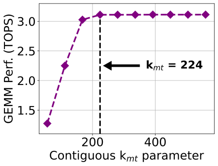{#fig-contiguous-bf16-bf16-xdna width=100%}
:::
::: {.column width="50%"}
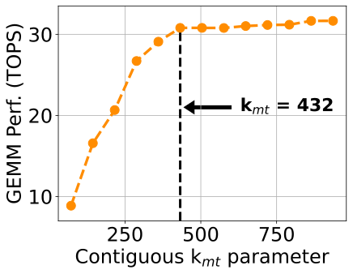{#fig-contiguous-int8-int16-xdna2 width=100%}
:::
:::

图 @fig-contiguous-bf16-bf16-xdna 与图 @fig-contiguous-int8-int16-xdna2 展示了连续参数 $k_\text{mt}$ 对性能的影响。
左图对应 bf16-bf16 96×56×96，右图对应 int8-int16 128×72×112。

类似地，对于 XDNA2，在 int8-int16 情况下，我们把 $k_\text{mt}$ 设为 432（图 @fig-contiguous-int8-int16-xdna2）。
在这种情况下，在 XDNA2 阵列上原生运行的*原生* GEMM 尺寸变为 512×432×896。
我们注意到，图 @fig-contiguous-int8-int16-xdna2 的最后三个点，得益于 MemTile 中的相邻内存共享能力，而这正是 XDNA2 上 GEMM 映射策略的直接结果（见第 @sec-memtile-design 节）。
对于其他所有数据类型，我们也以类似方式设置参数 $k_\text{mt}$。
具体而言，在 XDNA 上，我们把 int8-int8 和 int8-int16 的 $k_\text{mt}$ 设为 448，而 int8-int32 则设为 352。
在 XDNA2 上，我们把 int8-int8 的 $k_\text{mt}$ 设为 432，而 int8-int32 与 bf16-bf16 均设为 384。

这里有必要指出，[@GEMM_example_mlir_aie] 中的非优化 GEMM 示例无法支持足够多的连续元素。
为了公平比较，我们使用了优化后的*平衡*内核，并修改其实现以支持单输出 $C$ 缓冲区（使其能够放入 L1）。
例如，对于图 @fig-contiguous-bf16-bf16-xdna 和图 @fig-contiguous-int8-int16-xdna2 所示的数据类型，我们分别在 XDNA 和 XDNA2 上获得了 2.4× 和 3.6× 更高的性能。
这些结果凸显了在 GEMM 性能中访问足够连续元素的重要性。

### GEMM 性能扫描 {#sec-gemm-performance-sweeps}

在图 @fig-gemm-sweep-int8-int8-phoenix、图 @fig-gemm-sweep-int8-int16-phoenix 与图 @fig-gemm-sweep-bf16-bf16-phoenix 中，我们展示了 roofline GEMM 性能扫描（线性坐标）。
每个点代表一个是*原生* GEMM 尺寸整数倍的矩阵尺寸（使用最优*平衡*内核）。
我们在每种情况下都选取了 400 多个点（分别针对 $B$ 为 *列主序* 和 *行主序*），矩阵尺寸最大到 8K，并且没有偏向任何特定的 $M$、$K$、$N$ 维度。
首先需要注意，当算术强度（ARI）较低（即矩阵尺寸较小时）时，性能会受限。
在这种情况下，GEMM 严重受内存限制。
然而，随着 ARI 增大，GEMM 性能会提升，并在达到某个值后逐渐稳定下来。
在所有情况下，把矩阵 $B$ 存为 *列主序* 的平均性能都高于 *行主序*。
这是因为这样能够为 $A$ 和 $B$ 两个矩阵都访问到足够的连续数据（这由 $k_\text{mt}$ 参数决定）。
不过，当 $B$ 为 *行主序* 时，连续访问仅限于 $n_\text{ct}$ 参数，而只有对于 $A$（*行主序*）才能遍历到 $k_\text{mt}$ 个连续数据。
为此，在 XDNA 上，我们观察到 int8-int8、int8-int16 和 bf16-bf16 的平均性能分别高出 4.8%、4.4% 和 0.57%。

此外，我们注意到，对于 XDNA2，*列主序* 与 *行主序* 之间的差异更大。
具体而言，对于 int8-int8、int8-int16 和 bf16-bf16，我们分别观察到平均高出 19.1%、25.2% 和 8.7% 的性能。
XDNA 与 XDNA2 之间这种差异，推测是由 NPU NoC、SoC 级互连以及 DRAM 之间的复杂相互作用所致 [@NPU_arch_MICRO_2024; @NPU_HOT_CHIPS_2023]，它会影响 NPU 所感知到的*有效* DRAM 带宽（尽管两台迷你主机都配备了相同的 DRAM）。
另外，我们注意到，对于 XDNA 和 XDNA2，bf16 下 *列主序* 与 *行主序* 之间的差异都比 int8 更小。
这是因为 bf16 在 $n_\text{ct}$ 维度上访问了更多字节（当 $B$ 为 *行主序* 时），这反而在该情况下提高了 GEMM 性能，从而缩小了两者之间的差距。

对于 XDNA，我们注意到，在 $B$ 为 *行主序* 和 *列主序* 时，性能都会在某个 ARI 值之后趋于稳定，几乎呈现为一条线。
此外，对于 XDNA2，我们观察到，当 $B$ 为 *列主序* 时，GEMM 性能同样呈现稳定的线状分布。
然而，当 $B$ 为 *行主序* 时，它的分布则更为散乱。
这是因为 XDNA2 对*有效* DRAM 带宽的依赖更强（由于它能够达到显著更高的绝对 TOPS），而当在 $A$ 和 $B$ 两个矩阵上都访问到足够连续的数据时，这种带宽会被显著提升并稳定下来。
例如，对于 XDNA2 上的 int8-int16，我们测得当 $B$ 为 *列主序* 时的波动仅为 5%，而当 $B$ 为 *行主序* 时则达到 19%（ARI > 1600）。
最后，在所有 GEMM 扫描点中，XDNA 分别在 int8-int8、int8-int16、int8-int32 和 bf16-bf16 上达到了最高 6.76、6.05、4.57 和 3.14 TOPS。
类似地，XDNA2 分别在 int8-int8、int8-int16、int8-int32 和 bf16-bf16 上达到了最高 38.05、31.52、25.31 和 14.71 TOPS（为了简洁起见，省略了 int8-int32 扫描）。

::: {.columns}
::: {.column width="33.33%"}
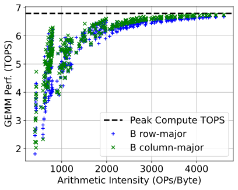{#fig-gemm-sweep-int8-int8-phoenix width=100%}
:::
::: {.column width="33.33%"}
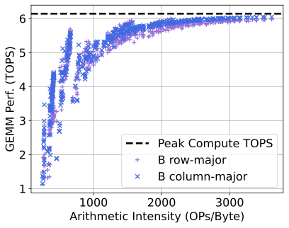{#fig-gemm-sweep-int8-int16-phoenix width=100%}
:::
::: {.column width="33.33%"}
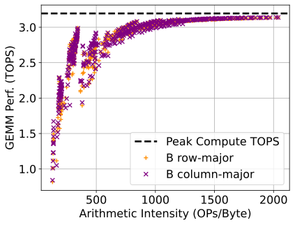{#fig-gemm-sweep-bf16-bf16-phoenix width=100%}
:::
:::

XDNA 的 roofline GEMM 性能扫描如上三图所示。

::: {.columns}
::: {.column width="33.33%"}
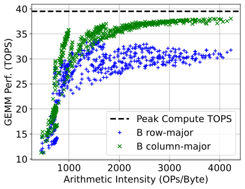{#fig-gemm-sweep-int8-int8-kracken width=100%}
:::
::: {.column width="33.33%"}
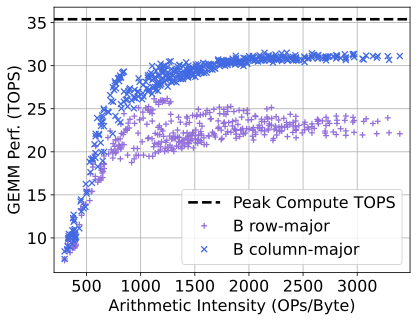{#fig-gemm-sweep-int8-int16-kracken width=100%}
:::
::: {.column width="33.33%"}
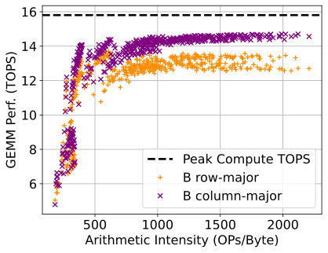{#fig-gemm-sweep-bf16-bf16-kracken width=100%}
:::
:::

XDNA2 的 roofline GEMM 性能扫描如上三图所示。

### 洞见与讨论 {#sec-insights-and-discussion}

#### 多种 GEMM 尺寸下的性能 {#sec-gemm-performance-multiple-sizes}

现代 DL 工作负载会在其各层中执行尺寸差异很大的 GEMM。
我们采用的输出驻留映射允许通过零填充来支持*任意* GEMM 尺寸，使其对齐到*原生* GEMM 尺寸（见第 @sec-gemm-mapping-strategy 节）。
零填充可以利用 NPU 架构在 MemTile 通道中对按需零填充的支持来高效完成 [@AMD_AIE_ML_architecture_manual]；如何充分利用这一特性留待未来工作。

在不同 GEMM 尺寸之间切换会带来关键的性能低效。
为此，一种做法可能是针对每个尺寸都重新配置 NPU 阵列并设计专用 GEMM。
当量化整个 GEMM 设计的重配置延迟时，我们在 XDNA 和 XDNA2 上分别测得 3.4 ms 和 4.9 ms 的延迟。
然而，这种重配置延迟与 GEMM 执行时间相当（例如，XDNA2 上一个约 4K 的方阵 int8-int16 GEMM 需要 5.2 ms）。
这说明，对整个设计进行重配置会带来相当可观的开销。

当在 NPU 上保持*同一个* GEMM 设计时，对于不同问题尺寸（$M$、$K$、$N$）只需要重新配置两个参数：（i）输出 tile 的总数 $M\cdot N/(m_\text{ct} \cdot n_\text{ct})$，以及（ii）沿归约维度 $K/k_\text{ct}$ 的 tile 数量 [@roesti2025unlocking]。
根据我们的测量，这种很小的重配置在系统层面不会带来任何可见的性能开销。
因此，识别最优参数（即 $m_\text{ct}$、$k_\text{ct}$、$n_\text{ct}$、$k_\text{mt}$，见第 @sec-gemm-design 节）并将其复用于不同 GEMM 尺寸，是实现高性能 DL 部署的关键。
最后，我们指出，这里给出的系统级 GEMM 结果是针对评估中使用的迷你主机而言的。
不过，我们提出的优化方法可以推广到当前两代中的任何 NPU 设备。

#### 单输出缓冲区 {#sec-single-output-buffer}

由于采用输出驻留映射，我们把输出 $C$ tile 保留为单缓冲，只对输入 $A$ 和 $B$ 使用双缓冲（见第 @sec-gemm-mapping-strategy 节）。
这对于在*一般* GEMM 情况下最大化性能至关重要，因为它让单核参数优化具有更高的灵活性。
具体而言，与对 $C$ 采用双缓冲相比，这种做法允许使用更大的 $m_\text{ct} \times k_\text{ct} \times n_\text{ct}$ 参数组合（受 L1 内存大小约束）。
这会帮助我们识别出一个性能更高的*平衡*内核，从而在系统层面实现更高的 GEMM 性能。
例如，当我们使用第 @sec-system-level-optimization 节中的优化方法，并对 $C$ 采用双缓冲时，会为 XDNA2 上的 int8-int16 数据类型识别出 112×48×96 作为最优*平衡*内核。
对于约 4K 的方阵 GEMM，这个内核可以提供 26.1 TOPS。
然而，表 @tbl-top-ranked-solutions-gemm-xdna2-array 中的 128×72×112 内核（单 $C$ 缓冲）可提供 30.77 TOPS，性能提升 18%。
类似地，在 XDNA 上，$C$ 的双缓冲可提供 2.76 TOPS（80×40×96 内核），而单缓冲可提供 3.12 TOPS（表 @tbl-top-ranked-solutions-gemm-xdna-array 中的 96×56×96 内核，高 13%）。
当归约维度 $K$ 足够大时，单缓冲情况下输出 $C$ tile 的传输开销会被摊薄（通常在 $K/k_\text{ct} > 20$ 时，GEMM 性能下降小于 5%）。

#### NPU-DRAM 数据移动与 BD 重配置 {#sec-bd-reconfiguration}

第 @sec-npu-dram-data-movement 节所述流程可以让 NPU 与 DRAM 的数据移动和 BD 重配置高效重叠。
为了量化其对性能的影响，我们把设计修改为按顺序同步并重配置 BD（也就是不进行重叠）。
在这种情况下，对于 XDNA2 上的 int8-int16，我们在约 4K 的方阵 GEMM 上只测得 22.21 TOPS，而表 @tbl-top-ranked-solutions-gemm-xdna2-array 中的重叠设计可达到 30.77 TOPS（非重叠设计下降 28%）。
类似地，对于 XDNA 上的 int8-int16（见表 @tbl-top-ranked-solutions-gemm-xdna-array），我们观察到 27% 的性能退化。
这说明，把 DMA 传输与 BD 重配置重叠起来，对于获得高 GEMM 性能至关重要。

#### 未来研究 {#sec-future-work}

XDNA2 集成了对 bfp16 精度的硬件支持，其中多个数值共享一个公共指数。
这会给利用 NPU 多维 DMA 寻址特性的数据布局变换带来额外挑战（见第 @sec-dma-transformations 节）。
不过，这超出了本文范围，因此留待未来工作解决。
此外，我们提出的优化方法也可以用于 GEMM 的特殊情形，例如 general matrix-vector multiplication（GEMV），这同样留待未来工作。

# 结论 {#sec-conclusion}

在本文中，我们提出了一种新的优化方法，用于最大化 Ryzen AI NPU 上的 GEMM 性能。
我们观察到计算与片外内存之间存在*反比*关系，并据此确定了性能最大化的最优平衡点。
为了识别这一最优性能点，我们利用了解析建模和硬件剖析技术。
我们的方法达到了最先进的 GEMM 性能，并且可以推广到当前 AMD Ryzen AI 的两代 NPU。
