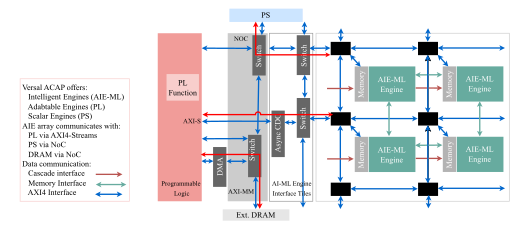
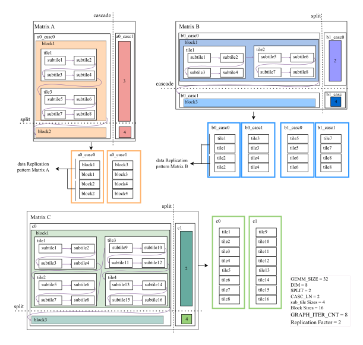
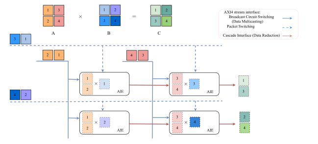

原文版权声明：本文依据公开来源论文 *Tempus: A Temporally Scalable Resource-Invariant GEMM Streaming Framework for Versal AI Edge* 进行中文翻译整理，仅供学习与研究使用。
我仅提供翻译与网页整理，不拥有原文版权；原文版权归作者及发布方所有。
转载、分发或用于商业用途时，请遵守原论文及原始发布平台的版权规定。

原文信息：Mahdieh Grailoo，José Núñez-Yáñez。*Tempus: A Temporally Scalable Resource-Invariant GEMM Streaming Framework for Versal AI Edge*。arXiv:2605.00536v2。

说明：以下内容按原文句序逐句对应翻译整理。
图注、表注、表格说明、算法和参考文献信息尽量保留原貌；作者名、标题、期刊会议信息不翻译。
原文中的 LaTeX 样式宏已展开为普通可移植写法，代码和算法中的标识符保持原样。

作者：Mahdieh Grailoo；José Núñez-Yáñez。

单位：Linköping University, Sweden；Universidad Politecnica de Madrid, Spain。

# 摘要 {#sec-abstract}

大语言模型（LLM）的 scaling laws 表明，模型质量会随着计算规模提升而改善，但边缘部署会对计算、内存和功耗施加严格约束。
由于通用矩阵乘法（GEMM）最多占推理时间的 $90\%$，高效的 GEMM 加速对边缘 AI 至关重要。
AMD Versal adaptive SoC 中的 Adaptive Intelligent Engines 很适合这项任务，但现有最先进（SOTA）框架通过空间扩展来最大化性能，也就是把工作负载分布到数百个核心上；这种方法在资源受限的 edge SoC 上会因为物理实现失败、带宽饱和和过高资源消耗而失效。
我们提出 Tempus，这是一个面向 AMD Versal AI Edge SoC 的 Resource-Invariant Temporal GEMM 框架。
Tempus 不会随着矩阵尺寸增大而扩展硬件资源，而是使用固定的 16 个 AIE-ML 核心计算块，并通过迭代式 graph 执行，以及 Programmable Logic 中的算法化数据分块与复制来实现可扩展性。
高速 cascade streaming 可在 Initiation Interval（II）为 1 时实现低延迟 partial sum reduction，而无死锁的 DATAFLOW 协议则最大化传输-计算重叠与 PLIO 复用。
在 GEMM 工作负载上评估时，Tempus 在总片上功耗 $10.677$ W 下达到 $607$ GOPS。
通过 Platform-Aware Utility（PAU）指标刻画系统级效率，我们证明 Tempus 的 prominence factor 比领先的空间 SOTA（ARIES）高 $211.2\times$。
此外，该框架保持 $0.00\%$ 的 URAM/DSP 利用率，实现 $22.0\times$ core frugality、$7.1\times$ power frugality 和 $6.3\times$ I/O demand 降低，为边缘 LLM 推理建立了可持续、可扩展的基础。

关键词：Hardware-Software Co-design；Versal ACAP System-on-Chip；Intelligent Engine；Large Language Models；Temporal Scaling；Resource-Constrained Edge Devices；Parallelization；Sustainable Inference。

# 引言 {#sec-introduction}

大语言模型（LLM）的 scaling laws 已经表明，即便能够访问庞大的资源池，temporal scaling 也是完整模型部署的唯一可行路径 [@hoffmann2022training; @kaplan2020scaling; @pearce2024reconciling]。
因此，现代 LLM 前所未有的规模和计算需求，需要为部署提供专用硬件加速 [@xu2025slim; @jiang2025comprehensive; @guo2025survey; @li2025tiny; @nunez2025sgrace; @grailoo2024heterogeneous]，尤其是在受限的边缘设备中 [@CHARMtwo; @ARIES; @AutoMM; @CHARM; @AutoSA]。
在这些模型中，General Matrix Multiplication（GEMM）的效率是工作负载的核心性能瓶颈，在推理期间通常消耗超过 $90\%$ 的总执行时间。
Tempus 聚焦于在 AMD Versal Adaptive Compute Acceleration（ACAP）Edge 平台上，对 rectangular GEMM 进行可持续加速；这些平台是由 processing system（PS）、programmable logic（PL）和 adaptable intelligent engines（AIE-ML）组成的异构 System-on-Chip [@AMD_Versal_AI_Edge_PSG_2024; @AMD_UG1079_2025; @Xilinx_Versal_AI_Edge_WP518_2021]。

此前为 Versal ACAP 设计的最先进（SOTA）优化框架，主要依赖大规模空间扩展来竞争峰值吞吐量，即把工作负载分布到数百个 intelligent engine 上；这些核心通常存在于 VC Versal Core 和 VE Versal 等更大器件中，它们拥有 300 到 400 个核心 [@aie4ml; @ARIES; @AutoMM; @AutoSA; @CHARM; @CHARMtwo; @GAMA; @MaxEVA]。
当移植到资源受限的边缘设备时，这种方法会从根本上失效。
这些设计需要很高的核心和资源利用率，会导致过高功耗，并使稀缺的 PL 组件饱和。
这种饱和会限制 PL fabric 用于集成完整模型推理所需的关键非矩阵乘法 kernel，例如 Softmax 或 Layer normalization [@grailoo2024activation]。
此外，推动空间规模达到极限通常会导致物理实现失败。
因此，性能会随着核心数线性扩展这一内在假设，在这种受限场景下会崩溃。

为克服边缘侧性能与资源之间的不匹配，我们引入 Temporal rectangular GEMM Scaling，这是一个新的框架，它通过限制并固定硬件资源分配来获得高性能和可扩展性，并优先考虑效率而非空间并行。
我们的主要贡献如下。

1. **Resource-Invariant Frugality Framework：** Tempus 通过考虑一个固定空间计算块，将资源利用率与矩阵尺寸解耦。
   大规模工作负载的扩展通过迭代式 AIE-ML graph 执行和算法化数据复制来实现。
   此外，3D MatMul 结构使用数据归约和多播映射到固定 2D 阵列（例如 Split×Cascade）。
   与 SOTA 相比，Tempus 实现了 core、power 和 I/O frugality。
   同时，通过把 programmable logic 限制在轻量 streaming FIFO 和固定大小 tiling buffer 上，该架构使用 $0.00\%$ 的 URAM/DSP，为 foundation model 所需的非 GEMM kernel（例如 Softmax、Layer-normalization）保留 fabric。

2. **Platform-Aware Utility and Architectural Efficiency：** Tempus 通过 Platform-Aware Utility（PAU）指标，将性能按物理潜力归一化，从而优先考虑体系结构 proficiency，并达到比领先空间 SOTA 高 $211.2\times$ 的 prominence。
   评估展示了近似理想的扩展性：$32,\!768\times$ 的工作负载增长只造成 $6.8\times$ 的延迟增长，从而有效摊薄固定系统初始化成本。
   我们还进一步展示，效率会受到 micro-kernel dimension（DIM）调节，优化后的 tile 尺寸带来 $10.5\times$ 的延迟下降；如果增加本地内存，这一数字还可以进一步改善。

3. **Compute-Transfer Overlapping Efficiency：** 通过 cascade interface 进行高速 streaming，可实现低延迟 partial sum reduction，避免约 $50\%$ 更慢的 buffer-sharing 方法，同时保证 pipeline initiation interval（II）为 1。
   为绕过边缘设备的 “Bandwidth Wall”，我们通过 hybrid packet/broadcast switching 和无死锁 DATAFLOW 协议最大化 PLIO 复用。
   PL streaming 还会把计算与 programmable logic 和 AIE array 之间的数据传输重叠起来，从而有效隐藏通信延迟。

4. **Analytical Modeling of Performance-Critical Parameters：** 我们的工作引入了解析模型，用于推导支配系统级效率的参数。
   这些模型确定了 scheduling 参数，例如用于 temporal scaling 的 `GRAPH_ITER_CNT`、用于 tiling 的 Kernel size，以及用于数据复用的 Replication Factor。

该框架的源代码已开放在 <https://github.com/mgrailoo/TEMPUS>。

{#fig-speedup-scaling width=100%}

# 相关工作：空间扩展与时间扩展 {#sec-related-work}

Versal ACAP 上的先前 GEMM 加速经历了两代 AI Engine，目标是在大型器件（300-400 个核心）上通过空间扩展最大化吞吐量。
这种思路在资源受限的边缘平台上会失败。
我们的工作提出 temporal GEMM scaling，作为一种替代性的 resource-invariant 范式。

## 空间扩展框架与利用率挑战（第一代：AIE） {#sec-spatial-scaling-frameworks}

这些框架专注于在大型 AIE 阵列上实现最大理论性能，将吞吐量置于资源节俭性之上。

- **CHARM 与 2.0（Heterogeneity-Aware Partitioning）：** CHARM 率先使用 Cascade Stream interface 在 AIE 阵列上执行 GEMM。
  单体式 CHARM 设计在不同 layer sizes 下效率严重不足，性能下降最高可达 $5760\times$。
  CHARM 2.0 通过把阵列划分为异构 accelerator 来解决这一问题，使 BERT 吞吐量最高提高 $5.29\times$。
  它使用 288 个 AIE 核心（VCK1902 的 72%）、91.52% BRAM 和 82.94% URAM 利用率，在 $1024^3$ INT16 GEMM 上达到 10.03 TOPS [@CHARM; @CHARMtwo]。
  CHARM 还面临显著资源问题，导致某些 INT8 设计由于拥塞问题只能利用 $48\%$ 的 AIE 核心 [@CHARM]。

- **MaxEVA（Throughput-Centric Optimization）：** MaxEVA 解决了 CHARM 等先前方案遇到的小矩阵瓶颈，并在仿真中达到很高的 AIE-only 吞吐量。
  然而，它受到低效 buffer-sharing 的限制，并把专用 AIE 核心用于 reduction kernel，从而限制了真实世界效率。
  对最大空间利用率的追求导致了物理实现失败。
  例如，MaxEVA 最初吞吐量最高的设计需要 $100\%$ 使用全部 400 个 AIE 核心，但由于 routing congestion 在 Place-and-Route（PnR）阶段失败 [@MaxEVA]。
  这种以仿真为中心的方法提供了理论性能，但缺乏系统实现 [@MaxEVA]。

- **AMA（Algorithmic Efficiency）：** AMA 是 MaxEVA 的高级后继方案，它通过增强 MAC kernel 使其直接执行累加，从而消除了专用 reduction kernel。
  这一创新带来了性能和能效收益。
  然而，AMA 保持了相同的根本限制：它依赖更慢的 buffer-sharing interface 进行 reduction，并且其 AIE-only 仿真方法使其脱离真实世界约束，尽管它使用了多达 342 个核心 [@AMA]。

- **AutoMM（Resource-Conscious DSE）：** AutoMM 在 CHARM 方法基础上引入了针对 INT8/INT16 精度优化的资源保守设计空间探索（DSE）。
  它使用 288 个 AIE 核心（VCK1902 的 72%），达到 7.51 TOPS 和 56.8 W 总功耗，并且相较空间替代方案具有更低的 BRAM 利用率（49.33%）。
  然而，它的保守资源方法限制了性能可扩展性，后来的 ARIES 展示了 INT16 上 $1.57\times$ 更高的能效 [@AutoMM]。

## 高级框架（第二代：AIE-ML）与编译器辅助扩展 {#sec-advanced-frameworks}

随着体系结构优化空间不断扩大，编译流程提供了自动化方案，用于管理复杂的资源利用模式。

- **GAMA（AIE-ML Optimization）：** GAMA 是首个关于第二代 intelligent engine（AIE-ML）架构，即 VE2802，的研究 [@GAMA]。
  它的创新点是自定义 buffer placement algorithm，可达到最高 100% 的内存利用率，并相比标准编译器减少 12% stalls。
  通过使用 staggered kernel placement 来缓解拥塞，它在仿真中实现了阵列利用率和性能。
  关键的是，GAMA 使用更快的 Cascade interface，因此达到比 MaxEVA 和 ARIES 更高的 throughput efficiency。

- **ARIES（MLIR Compilation Flow）：** ARIES 引入了一个 agile MLIR-based flow，用于跨 Versal 平台实现多级并行 [@ARIES]。
  它的核心创新是统一的 MLIR 表示，横跨 AIE 和 PL，从而支持 AIE 器件上的优化与可移植性。
  与基于仿真的方法不同，ARIES 提供了真实板上评估结果。
  它通过大规模空间扩展实现高吞吐量，使用 88%（352 个核心）的 AIE，并伴随很高的 PL 资源使用率（76% URAM），因此不适合资源受限的边缘设备。

- **AutoSA（Polyhedral Compilation）：** AutoSA 是一个 polyhedral compiler，可生成带有硬件优化（SIMD、II=1、double buffering）的单体 systolic array [@AutoSA]。
  尽管它在 16 nm AMD U250 FPGA 上取得了高性能，CHARM 在相同精度下仍实现了高 2.9× 的吞吐量。

与 SOTA 相比，我们的 resource-invariant temporal scaling 通过迭代执行、维度归约和数据复制来提供性能。
它位于一个小型固定核心块中，使用高速 cascade 和 DATAFLOW streaming，从而保证资源保守性和 edge 兼容性。

# Versal ACAP 架构：AI Edge VE2302 {#sec-versal-acap-architecture}

AMD Versal AI Edge VE2302 SoC 将三类不同处理引擎集成到单个异构架构中，如图 @fig-speedup-scaling 所示。
Intelligent Engines 构成一个由 34 个 VLIW/SIMD 处理器（AIE-ML）组成的阵列，每个处理器都带有本地内存 [@lei2024mapping]（绿色灰色框），并针对该架构核心处的深度学习计算 kernel 进行优化。
Adaptive Engines（Programmable Logic）（红色框）提供可重配置硬件（328K system logic cells、464 DSP），用于 flexible logic 和数据移动，例如 data streaming control（FIFO）、data tiling、de-tiling 和 replications。
Scalar Engines（Processing System）（蓝色框）包含双核 Arm Cortex-A72 和 Cortex-R5F 处理器，用于系统编排和通用任务 [@AMD_Versal_AI_Edge_PSG_2024; @AMD_UG1079_2025; @Xilinx_Versal_AI_Edge_WP518_2021]。

AIE-ML 阵列通过两条关键路径与更广泛的系统连接。
它通过高速 AXI4-Streams（PLIO）直接连接到 PL，这是把数据送入阵列的主要通道。
与 Processing System（PS）的通信以及对外部 DRAM 的访问，都通过高带宽 Network-on-Chip（NoC）实现。
在 AIE-ML 阵列内部，三种专用数据通信机制支持高效计算，并且对我们的扩展方法至关重要。
Cascade Interface 在相邻核心之间提供直接、低延迟连接（AIE-ML 中为 512-bit 宽），用于快速 partial sum reduction，从而支持我们的 temporal scaling 方法。
Memory Interface 支持相邻核心之间的 buffer sharing，而 AXI4 Switch 则连接非相邻核心，并被配置为高效 packet-switching 与 broadcasting。
为简化说明，后续所有解释和图示都考虑一个 2×2 的 AIE-ML 核心阵列。

# 方法：Resource-Invariant Temporal GEMM Scaling {#sec-methodology}

我们的框架把大矩阵乘法转换成可预测的迭代式流处理过程。
通过把 3D MatMul 映射到固定 2D AIE-ML 阵列（Split×Cascade，例如 2×8），并且只为 dataflow 使用一组固定 PL 资源，我们实现了 resource-invariant performance。

## 系统编排与控制流（PS 侧） {#sec-system-orchestration}

Versal ACAP 异构系统的协调，以及我们的 Temporal Scaling 框架中的 dataflow，由 Processing System/Host CPU 管理；它作为中央 orchestrator，如图 @fig-speedup-scaling 所示。
该流程从 scalar engines 发起执行开始。
输入矩阵存储在外部 DRAM 中。
随后，一个专用 DMA HLS kernel 使用无死锁 DATAFLOW 设计，管理从外部 DRAM 到 AIE-ML 阵列的数据传输，从而确保连续高速数据流。
数据使用 AXI4-MM 协议，通过高带宽 NoC（蓝色箭头）从外部 DRAM 传输。
随后，数据通过 AXI4-Stream（AXIS）网络（红色箭头）流入 AIE-ML 阵列。
之后，数据通过 AXI4-Stream（AXIS）网络（红色路径）流入 AIE-ML 阵列。
在这一步中，为最大化稀缺 PLIO 资源的复用，会采用专门路由，即 Broadcast circuit-switching 和 Packet Switching。
当固定核心 AIE-ML graph 执行矩阵乘法时，内部 AIE-to-AIE 的 partial sum reduction 通信由高速 512-bit Cascade Stream 处理（图 @fig-speedup-scaling 中的深红色箭头）[@AMD_UG1079_2025]。
Memory Interface（绿色箭头）则用于每个核心内存中的本地数据访问。
最后，得到的矩阵 C 从 AIE-ML 阵列流回 PL，DMA kernel 在其中收集结果，并通过 NoC（红色路径）写回 External DRAM，从而完成执行周期。

系统的详细执行由 PS 编排的 7-phase timed control flow 管理，如算法 1 所示。
在 Phase 0（INIT）中，host 计算 temporal scaling 的关键参数 `GRAPH_ITER_CNT`。
它使用 XRT 的 aligned allocator 为矩阵 A、B 和 C 分配内存缓冲区，确保 4096-byte boundary alignment，以获得最佳 DMA 性能。
Phase 1-2（DATA_PREP、DEVICE_INIT）把生成的 PLIO streams 和硬件 binary（`.xclbin`）加载到 Versal 设备上，并初始化 AIE-ML 阵列和 PL kernel。
Phase 3（BUFFER_CREATE）把已分配的缓冲区映射到 External DRAM，从而建立 host-device 数据通道。
Phase 4（DATA_XFER_HOST2DEV）把输入矩阵从 host memory 传输到 device DRAM，并实例化 PL kernel 和 AIE graph。
核心计算从 Phase 5（KERNEL_LAUNCH）开始，即启动 kernel，随后进入 Phase 6（CORE_COMPUTATION），其中 temporal scaling 通过迭代式 AIE graph 执行（`gemm_aie_gr.run(GRAPH_ITER_CNT)`）实现，并与 PL kernel 运行（`dma_krnl.wait()`）并发。
最后，host 同步完成状态，并把结果传回 host memory。

::: {#alg-host-execution}
**算法 1：主机应用执行流程（7 个阶段）**

```text
Function main(argc, argv)
  PHASE 0: Configuration and Memory Setup
  Calculate GRAPH_ITER_CNT for temporal scaling.
  Load matrix data or generate test patterns.
  Allocate host memory using aligned_allocator (4096-byte aligned).
  PHASE 1-4: Initialization and Setup
  Initialize XRT device and load XCLBIN.
  Create buffer objects and map them.
  Transfer A and B to device.
  Instantiate FPGA HLS kernel and AIE graph.
  PHASE 5: Kernel Launch  // Start timer
  Launch dma_hls_rhdl.
  PHASE 6: CORE COMPUTATION
  Run AIE graph for GRAPH_ITER_CNT times.
  Wait for kernel.
  Record compute total.  // Stop timer
  PHASE 7: Output/Validation
  Sync output.
  Write output and validate.
  Print summary.
EndFunction
```
:::

## 算法化数据准备（Tiling、Data Decomposition 与 3D-to-2D Mapping） {#sec-algorithmic-data-preparation}

这一阶段说明框架如何通过维度归约、精确 tiling 和专门的数据重复来克服硬件限制，如图 @fig-hierarchical-tiling 所示。
维度归约把 3D MatMul 计算映射到固定 2D 核心阵列（$\mathrm{SPLIT} \times \mathrm{CASC\_LN}$ cores）。
其原始工作负载尺寸为：

$$
\begin{aligned}
\mathrm{GEMM\_SIZE\_A} \times \mathrm{GEMM\_SIZE\_AB} \\
\times \mathrm{GEMM\_SIZE\_B}
\end{aligned}
$$

其中 $\mathrm{CASC\_LN}$ 通过 cascade streams 把核心串联起来，以对 $\mathrm{GEMM\_SIZE\_AB}$ 维度做 reduction，而 $\mathrm{SPLIT}$ 定义并行组。
$\mathrm{GEMM\_SIZE\_AB}$ 维度通过 temporal iteration 处理，而 $\mathrm{GEMM\_SIZE\_A}$ 和 $\mathrm{GEMM\_SIZE\_B}$ 维度则在阵列上进行空间分布。

图 @fig-hierarchical-tiling 展示了层次化 decomposition 策略。
split boundaries（虚线）表示为 temporal scaling 而进行的横向划分，形成并行处理组，而 cascade paths 表示用于 partial sum reduction 的纵向 AIE-to-AIE 通信（由 CASC_LN 管理）。
该图展示了大型输入矩阵（A 和 B）如何被转换为低延迟 streams（a0_casc0、a0_casc1、b0_casc0、b0_casc1、b1_casc0、b1_casc1），并按 Blocks（temporal units）、Tiles（由 DIM 定义的内存单元）和 Sub-tiles（vector units）进行层次化组织。
在 block 层级，矩阵被分解为 sequential Blocks（例如 `block1`、`block2`）。
在 blocks 内部，数据组织为 Tiles（`tile1` 到 `tile4`）或对应于 DIM 参数的 micro-kernel。
最大 DIM 受到 AIE-ML 核心本地内存容量限制，该内存需要在多个矩阵之间划分。

最小单元是 Subtiles（`subtile1` 到 `subtile8`），表示为 AIE-ML vector execution 优化的最小数据段。
为简化说明，后续所有图示和解释都考虑一个最小 2×2 AIE-ML 核心阵列、$32\times16\times32$ 的 rectangular GEMM size、DIM 为 8、sub_tile size 为 4，以及 A、B、C 分别为 $16\times8$、$8\times16$ 和 $16\times16$ 的 block size。
在 PLIO_Cascade_Stream_Generation 期间，Matrix A tiles 遵循 row-major ordering，而 Matrix B 使用 column-major ordering，与 core cluster 的通信模式对齐。
Matrix A replication 发生在每个 block processing cycle 之后的 tiles 之间，而 Matrix B replication 发生在 blocks 中的每一列之后。
Subtile 维度针对 AIE-ML 指令效率优化，其物理维度随 DATA_TYPE 调整（例如 int16 和 int32 为 4×4×4），同时保持 subtiles 内部元素 serialization 为 row-major。

{#fig-hierarchical-tiling width=100%}

::: {#alg-plio-generation}
**算法 2：PLIO 流生成与分块（Tiling）**

```text
Require MatA, MatB; Config parameters (GEMM_SIZE, DIM, SPLIT, CASC_LN, DATA_TYPE)
Ensure Cascade input streams (a0_casc*), (b*_casc*)
WRD_LN <- 128 / DATA_TYPE_bits  // Elements per 128-bit PLIO chunk
GRAPH_ITER_CNT <- calculated via graph iteration count equation
Replication Factor <- calculated via replication factor equation
For each temporal block
  Matrix A Ordering: Process MatA tiles in row-major order.
  Matrix B Ordering: Process MatB tiles in column-major order.
  Apply algorithmic data repetition (replication factor) patterns.
  PLIO formatting: ensure WRD_LN elements per line.
EndFor
```
:::

| Data Level | A | B | C |
|---|---|---|---|
| Elements within sub-tiles | Row-major | Row-major | Row-major |
| Sub-tiles within tiles | Row-major | Row-major | Row-major |
| Tiles within blocks | Row-major | Column-major | Column-major |

: Data Ordering Summary for Stream Generation。 {#tbl-data-ordering}

算法 2（PLIO_Stream_Generation）把大型输入矩阵转换成固定核心 AIE-ML graph 的顺序数据流。
第 1 行计算每个 128-bit PLIO chunk 中的元素数量，即 WRD_LN。
处理完整工作负载所需的 temporal iterations 数量，由 graph iteration count 定义：

$$
\mathrm{GRAPH\_ITER\_CNT} =
\frac{\mathrm{GEMM\_SIZE\_A} \times \mathrm{GEMM\_SIZE\_B}}
{\mathrm{DIM\_A} \times \mathrm{DIM\_B} \times \mathrm{SPLIT}}.
$$ {#eq-gic}

$$
\mathrm{REPLICATION\_FACTOR\_A/B} =
\frac{\mathrm{GEMM\_SIZE\_B/A}}{\mathrm{DIM\_B/A} \times \mathrm{SPLIT}}.
$$ {#eq-rf}

这里，Matrix A 会在每个 block processing cycle 之后于 tiles 之间复制，而 Matrix B 会在 blocks 内处理每一列之后复制，如图 @fig-hierarchical-tiling 所示。
随后的循环（第 5-9 行）在这一数据重复框架内使用 row-major 和 column-major ordering 处理矩阵，以最大化 computational density。

## 硬件流水线与 AIE-ML Graph 执行 {#sec-hardware-pipelining}

本小节描述固定核心 AIE-ML graph 如何执行已准备好的 data streams，并详细说明支持高效计算与数据传输重叠的高速 pipeline protocols。

{#fig-system-integration width=90%}

### AIE-ML Engine Graph（AIE-ML Cores 阵列） {#sec-aie-ml-engine-graph}

图 @fig-system-integration 展示了处理已准备 data streams 的 AIE-ML graph 执行过程。
该图展示了 graph 如何由 CASC_LN（cascade levels）和 SPLIT（parallel splits）参数化，并且 AIE-ML 阵列如何通过 PLIO interfaces 连接到 FPGA/PL kernel。
该图说明了高速 streaming protocols 如何在重叠计算的同时支持高效数据移动。
cascade stream chains 作为核心之间的水平连接可见，为 AIE-to-AIE partial sum reduction 提供 512-bit 宽路径（红色箭头），并生成 c1 和 c2 输出 streams。
它直接实现了从 3D MatMul 到 2D array 的维度归约，即通过 chaining 处理 $\mathrm{GEMM\_SIZE\_AB}$ 维度的累加。
这将 synchronization overhead 最小化，以实现 Initiation Interval（II）为 1，并避免约 50% 更慢的 buffer sharing interface。
输入分布遵循图中可见的专门路由模式：Matrix A 使用 broadcast circuit-switching（显示为从单个源分支到多个目标的实线蓝色箭头），将 a0_casc* input streams 同时路由到所有 SPLIT groups；Matrix B 则使用 packet switching（表示为 time-multiplexed streams 的虚线蓝色箭头），把不同 b*_casc* input streams 动态路由到不同 splits，从而最大化受限 VE2302 的 PLIO 资源复用。

AIE-ML graph construction 和 streaming connections 在算法 3 中形式化。
第 2-3 行实例化核心计算 graph `mmult[SPLIT]`。
第 4 行创建 Matrix A 的 PLIO interfaces，实现 broadcast circuit-switched distribution。
嵌套循环（第 5-16 行）建立所有连接。
Matrix A 被 broadcast 到所有 splits（第 10 行），从而支持 data multi-casting。
第 11 行中 Matrix B 的 split-specific connections 实现 packet-switched routing。
第 14 行，output collection 通过 cascade streams 收集结果。
第 8 行设置 runtime ratios 以进行性能优化，完成高效 MatMul 执行的 graph construction。

::: {#alg-aie}
**算法 3：AI Engine 图构建**

```text
Input: CASC_LN, SPLIT
Function GeMM Constructor()
  Instantiate mmult[SPLIT]
  Create PLIO matA_inp[CASC_LN]
  For i = 0 to SPLIT - 1
    Create PLIO matB_inp[CASC_LN]
    Create PLIO matC_out[i]
    For k = 0 to CASC_LN - 1
      runtime(mmult[i].kernels[k]) <- 1.0
      Connect matA_inp[k] to mmult[i].inA[k]
      Connect matB_inp[idx] to mmult[i].inB[k]
    EndFor
    Connect mmult[i].out to matC_out[i]
  EndFor
EndFunction
```
:::

### FPGA/PL Kernel（dma_hls） {#sec-fpga-pl-kernel}

`dma_hls` kernel 通过 PLIO streams 在 External DRAM memory 和固定核心 AIE-ML array 之间编排高速数据传输。
该 kernel 使用 Vitis HLS 实现，并采用无死锁 dataflow 设计；该设计只使用轻量 streaming FIFO，避免像 SOTA 一样使用单体 buffering，因此符合 PL Resource Conservation [@CHARM; @CHARMtwo]。
算法 4 详细描述了该 kernel 的高速执行。
在该算法中，memory pointers 通过 AXI4 Memory-Mapped streams 映射到 NoC DDR4 interfaces。
第 4 行的 top-level DATAFLOW pragma 支持 input/output functions 并发执行。
第 8 行通过 modulo addressing 实现顺序分发，使 128-bit burst data transfer 能够高效送入 AIE-ML array。
第 6 行展示了该设计在整个 data path 上保持 II=1 pipeline efficiency。

::: {#alg-pl-execution}
**算法 4：FPGA/PL 顶层执行与数据流（DMA_HLS）**

```text
Require Memory pointers: matA, matB, matC; Streams: strmInp
Ensure Streams: strmOut
Function DMA_HLS(matA, matB, matC, streams)
  Constants: NUM_A_FILES = 8
  Constants: NUM_B_FILES = 16
  #pragma HLS DATAFLOW
  For each memory read transaction
    #pragma HLS PIPELINE II=1  // Enforce throughput
    ReadData <- matX[i]  // 128-bit burst
    stream_idx <- i mod NUM_A_FILES  // Sequential distribution
    Write ReadData to strmOut[stream_idx]
  EndFor
  out_C(strmInp_C, matC)  // Deadlock-free Matrix C collection (pairwise writes)
EndFunction
```
:::

# 环境设置 {#sec-environmental-setup}

该框架在 AMD Versal AI Edge VE2302 ACAP（XCVE2302-1LSESFVA784-E）上实现，采用 AIE-MLv1 架构，PL 组件运行在 312.5 MHz，而受限的 PLIO 资源会约束 split（SPLIT）和 cascade paths（CASC_LN）。
对于 $(32-1024)^3$ 的矩阵工作负载以及 INT16/INT32 精度，本文使用一个固定的 16 个 AIE-ML 核心空间计算块。
使用 16 个核心配置，是因为该 area group 的 24 条 registered 128-bit PLIO channels 能够支持它。
VE2302 ACAP 架构在编译器中由 `__AIE_ARCH__ == 20` 标识，除 `INT16` 和 `INT32` 之外，还具备对 `INT4`、`INT8` 和 `BFLOAT16` 数据类型的原生硬件支持。
然而，我们的评估受到 AMD Vitis 2024.1 toolchain 中可用软件支持的限制。
具体而言，我们的设计依赖 AMD Xilinx DSP Library 中的模板化矩阵乘法 kernel，这限制了我们能够同时为仿真和硬件结果报告的数值格式范围。

所有设计都使用 AMD Vitis 2024.1 编译。
我们报告完整系统吞吐量和资源利用率，其中包括 PL 和 DDR memory controller。
这种整体实现使其能够与提供板上结果的 SOTA 框架直接比较，同时排除仅有仿真的研究。
最后，功耗使用 AMD AIE-specific Xilinx Power Estimator（XPE）工具估算。

| 指标 | 数值 | 上下文 |
|---|---:|---|
| **I. Performance and Timing (ms)** |  |  |
| AIE Cores Used | 16 (47%) | 固定，Resource-Invariant |
| Core Computation ($t_{\text{actual}}$) | 3.537 | 实测执行 |
| Achieved Throughput | 607 GOPS | 由延迟推导 |
| Device/XCLBIN Init | 226.928 | 一次性设置 |
| Buffer Creation/Mapping | 20.362 | 内存分配 |
| Kernel/Graph Create | 55.882 | 编译开销 |
| Kernel Launch | 0.218 | 启动 kernel |
| PL Tiling | 13.276 | PL Tiling/Replication 开销 |
| Graph Run/DMA Wait | 3.319 | Runtime scheduling |
| Output Sync | 0.013 | 结果收集 |
| PL performance | 312.5 | PL performance |
| **II. Power and Energy** |  |  |
| AIE Engine Power | 2.381 W | 16 cores active |
| Memory Power | 3.173 W | B/XRAM + NoC-DDRMC |
| Total On-Chip Power | 10.677 W | Frugal consumption |
| Energy Eff. (AIE) | 255 GOPS/W | Core efficiency |
| Energy Eff. (Total) | 56.87 GOPS/W | System efficiency |
| **III. Resource Utilization** |  |  |
| LUT | 6.16% | PL capacity preserved |
| BRAM | 62.58% | Streaming FIFOs |
| URAM | 0.00% | Resource conservation |
| DSP | 0.00% | Resource conservation |
| CLB Registers | 7.65% | Resource conservation |

: Tempus 中 $1024^3$ INT16 GEMM 的性能和资源利用率。 {#tbl-resource-utilization-full}

# 仿真结果与可持续性分析 {#sec-simulation-results}

本节评估 Resource-Invariant Temporal Scaling rectangular GEMM 框架的性能与可持续性。

## 系统级表征：性能、功耗和资源使用 {#sec-system-level-characterization}

运行指标详见表 @tbl-resource-utilization-full，它表示的是 $1024^3$ INT16 工作负载的系统实现，而不是仅 AIE 仿真。
该框架达到 $607$ GOPS，core computation latency 为 $3.537$ ms，总片上功耗为 $10.677$ W。
执行时间线的详细分解表明，core computation 高度高效，突出了该设计的 streaming 与 computation efficiency。
功耗分析表明，AIE engines 仅消耗 2.381 W，而 memory subsystems（包括 B/XRAM 和 NoC-DDRMC）消耗 $3.173$ W，占总 $10.677$ W 片上功耗的很大一部分，并确认该工作负载具有 I/O-bounded 特性。

| Type | DIM | Latency (ms) | Throughput (GOPS) |
|---|---:|---:|---:|
| INT16 | 4 | 6.194 | 43.338 |
| INT16 | 8 | 3.230 | 83.107 |
| INT16 | 16 | 1.811 | 148.225 |
| INT16 | 32 | 1.123 | 239.034 |
| **INT16** | **64** | **0.792** | **338.934** |
| INT16 | 128 | 0.586 | 458.081 |
| INT32 | 4 | 11.848 | 22.657 |
| INT32 | 8 | 6.171 | 43.500 |
| INT32 | 16 | 3.225 | 83.236 |
| INT32 | 32 | 1.779 | 150.891 |
| **INT32** | **64** | **1.150** | **233.422** |

: 不同数据类型下，Tempus 在固定工作负载（$512^3$）上的 Tile Dimension（DIM）扩展。 {#tbl-dim-scaling-timing}

## Temporal Scaling 与工作负载分析验证 {#sec-validation-temporal-scaling}

性能分析验证了这样一个原则：可扩展性可以通过 temporal iteration 而不是物理核心扩展实现，从而证明 resource-invariant 方法的有效性。

### Tile Dimension Scaling {#sec-tile-dimension-scaling}

表 @tbl-dim-scaling-timing 揭示了 micro-kernel tile size（DIM）与 $512^3$ 工作负载计算效率之间的关键关系。
把 DIM 从 4 增加到 128，会使吞吐量提升 $10.5\times$。
这表明，为每个核心提供更多本地内存，会通过启用更大的 micro-kernel 来直接降低延迟。
理论上，DIM 可以增加到 256 以进一步改进；然而，每个 AIE-ML tile 的本地内存约束从根本上把 INT16 的实际上限限制在 DIM=128。
精度扩展仍然可预测：INT32 在其 DIM=64 上限下达到 233.422 GOPS，约为 INT16 吞吐量的一半，这反映了硬件的 $2\times$ 数据宽度惩罚，同时确认 Tempus 在固定计算 fabric 内具有稳健的 architectural proficiency。

| Type | Size | DIM | Latency (ms) | Throughput (GOPS) |
|---|---|---:|---:|---:|
| INT16 | $32^3$ | 16 | 0.396 | 0.165 |
| INT16 | $64^3$ | 32 | 0.389 | 1.348 |
| INT16 | $128^3$ | 64 | 0.395 | 10.618 |
| INT16 | $256^3$ | 128 | 0.407 | 82.443 |
| INT16 | $512^3$ | 128 | 0.586 | 458.081 |
| INT16 | $768^3$ | 64 | 1.637 | 553.433 |
| INT16 | $1024^3$ | 64 | 3.537 | 607.148 |
| INT32 | $32^3$ | 16 | 0.397 | 0.165 |
| INT32 | $64^3$ | 32 | 0.403 | 1.301 |
| INT32 | $128^3$ | 64 | 0.396 | 10.592 |
| INT32 | $256^3$ | 64 | 0.483 | 69.471 |
| INT32 | $512^3$ | 64 | 1.150 | 233.422 |
| INT32 | $768^3$ | 32 | 5.412 | 167.400 |
| INT32 | $1024^3$ | 32 | 14.757 | 145.523 |

: 不同数据类型下，Tempus 使用最大可用 DIM 时的 workload scaling。 {#tbl-gemm-scaling-timing}

### Workload Scaling Analysis and Architectural Efficiency {#sec-workload-scaling-analysis}

表 @tbl-gemm-scaling-timing 刻画了 Tempus 在 operations 增长 $32,\!768\times$（从 $32^3$ 到 $1024^3$）时的 temporal scaling。
Tempus 摊薄固定开销，从 $32^3$ 时的次优效率过渡到 $1024^3$（INT16）时持续的 607 GOPS。
关键洞见是，$512^3$ 工作负载在 DIM=128 时达到近似理想扩展，但 $1024^3$ 被限制在 DIM=64，这会增加 iteration counts，并导致延迟非线性跳升到 3.537 ms。
值得注意的是，精度扩展仍然可预测，因此 $1024^3$ 上的 INT32 被限制在 DIM=32，并由于 $2\times$ 数据宽度惩罚而给出约为 INT16 四分之一的吞吐量（145.5 GOPS）。
这种自适应扩展证明 Tempus 会自动遵守硬件边界，为实时 edge AI 提供可预测、可持续的性能。

| Workload | Total On-Chip Power (W) | LUT (%) | BRAM (%) | CLB Regs (%) |
|---|---:|---:|---:|---:|
| $32^3$ | 10.698 | 6.09 | 62.58 | 7.63 |
| $64^3$ | 10.639 | 6.11 | 62.58 | 7.64 |
| $128^3$ | 10.315 | 6.13 | 62.58 | 7.65 |
| $256^3$ | 10.692 | 6.11 | 62.58 | 7.64 |
| $512^3$ | 10.661 | 6.18 | 62.58 | 7.65 |
| $768^3$ | 10.631 | 6.20 | 62.58 | 7.67 |
| $1024^3$ | 10.677 | 6.16 | 62.58 | 7.65 |
| $8\times32\times8$ | 10.701 | 6.11 | 62.58 | 7.64 |
| $128\times768\times64$ | 10.236 | 6.14 | 62.58 | 7.66 |
| $512\times64\times512$ | 10.281 | 6.11 | 62.58 | 7.64 |
| $512\times1024\times512$ | 10.680 | 6.17 | 62.58 | 7.65 |
| $128\times768\times3072$ | 10.721 | 6.17 | 62.58 | 7.66 |
| $768\times3072\times768$ | 10.788 | 6.18 | 62.58 | 7.68 |
| $8\times1024\times1024$ | 10.282 | 6.15 | 62.58 | 7.65 |
| $8\times2048\times2048$ | 10.703 | 6.15 | 62.58 | 7.65 |
| $8\times4096\times4096$ | 10.715 | 6.19 | 62.58 | 7.65 |

: Tempus 在 INT16 下的 PL Resource Utilization and Power Consistency；所有工作负载中的 URAM/DSP 利用率均为 0.00%。 {#tbl-consistency}

::: {style="overflow-x:auto;"}
| Framework | Cores | Lat. (ms) | TOPS | Pwr (W) | U% (1) | PLIO | T/C (2) | T/P (3) | C-Fru (4) | P-Fru (5) | I-Fru (6) | PAU(n) (7) |
|---|---:|---:|---:|---:|---:|---:|---:|---:|---:|---:|---:|---:|
| **Tempus (Temporal)** | **16** | 3.537 | 0.607 | **10.677** | **0.00** | **26** | 0.038 | 0.057 | **22.0$\times$** | **7.1$\times$** | **6.3$\times$** | **211.2$\times$** |
| ARIES (Spatial) | 352 | 0.1354 | 15.86 | 76.30 | 76.03 | 164 | 0.045 | 0.208 | 1.0$\times$ | 1.0$\times$ | 1.0$\times$ | 1.0 |
| CHARM 2.0 (Spatial) | 288 | 0.2141 | 10.03 | 64.80 | 82.94 | 120 | 0.035 | 0.155 | 1.2$\times$ | 1.1$\times$ | 1.4$\times$ | 1.2$\times$ |
| AutoMM (Spatial) | 288 | 0.2859 | 7.51 | 56.80 | 82.94 | 120 | 0.026 | 0.132 | 1.2$\times$ | 1.3$\times$ | 1.4$\times$ | 1.1$\times$ |
| AutoSA (Spatial) | -- | 0.6298 | 3.41 | 84.90 | -- | -- | -- | 0.0401 | -- | -- | -- | -- |

: $1024^3$ INT16 GEMM 的 throughput、power 与 Platform-Aware Utility 综合比较分析 [@CHARMtwo; @ARIES; @AutoMM; @CHARM; @AutoSA]。 {#tbl-comparison-combined}
:::

注：（1）URAM% Utilization。（2）TOPS/Core density。（3）TOPS/Power efficiency（AI Efficiency）。（4）C-Fru: Core Frugality。（5）P-Fru: Power Frugality。（6）I-Fru: I/O Frugality（PLIO）。（7）Platform-Aware Utility Factor。

::: {style="overflow-x:auto;"}
| Feature | VCK190 (VC1902) | VE2802 | VE2302 |
|---|---|---|---|
| **AI Compute & Efficiency** |  |  |  |
| AI Engine Type | 1st Gen AI Engine [@AMD_UG1079_2025] | AIE-ML v2 [@AMD_Versal_AI_Edge_PSG_2024] | AIE-ML [@Xilinx_Versal_AI_Edge_WP518_2021] |
| Cores | 400 | 304 | 34 |
| Peak AIE INT16 Performance | 64 TOPS | 101 TOPS | 11.5 TOPS |
| AI Efficiency (TOPS/W) | 0.71--1.28 | 2.69 | 1.15--1.53 |
| **Power & Thermal** |  |  |  |
| Total Chip Power (TCP) | 100--180 W | Up to 75 W | 15--20 W |
| **Programmable Logic & Resources** |  |  |  |
| System Logic Cells | 1,968K | 1,139K | 328K |
| DSP Engines | 1,968 | 1,312 | 464 |
| **External Memory Support** |  |  |  |
| DDR4 Support | 8 GB @ 3200 Mb/s | Up to 16 GB | 4 GB (64-bit, upgradable to 8 GB) |
| LPDDR4 Support | 8 GB @ 3900 Mb/s | 12 GB @ 3733 Mb/s (192-bit) | 4 GB (64-bit) |

: Compute、Resource 与 Power Strengths Comparison。 {#tbl-versal-strengths}
:::

一般说明：INT16 performance 从 INT8 specifications 推断（$\frac{1}{2}\times$ INT8）。
AI Efficiency = Peak INT8 TOPS $\div$ Max TCP。

## 资源与功耗不变性 {#sec-resource-power-invariance}

表 @tbl-consistency 表明，Tempus 在指数级工作负载增长下保持严格的 resource invariance。
总片上功耗保持节俭，约为 10.6 W，而关键 PL 资源（DSP、URAM）保持 0.00% 利用率。
这与 SOTA spatial designs 形成鲜明对比，后者会使资源饱和，例如 CHARM 2.0 使用 82.94% 的 URAM。
低 LUT 和 BRAM 用量仅来自轻量 streaming FIFOs（FIFO_depth=16、outstanding=32、BURST=32），它为完整模型 pipeline 中 Softmax 和 LayerNorm 等 essential kernels 的 heterogeneous orchestration 保留了 PL 容量。
进一步降低 FIFO depth、outstanding transactions 和 burst size 可以带来更大的 BRAM 节省。

# 比较可持续性与资源节俭性 {#sec-comparative-sustainability}

我们在表 @tbl-comparison-combined 中，将 resource-invariant Tempus 框架与 spatial SOTA frameworks（ARIES、CHARM 2.0、AutoMM、AutoSA）进行评估。
这些基线优先追求高端 Versal devices（VCK190/VE2802，约 300-400 个核心）上的峰值吞吐量，而这些设备与 Tempus 所用 VE2302 在计算效率和内存容量上有所不同，见表 @tbl-versal-strengths。
然而，它们在 edge-class SoC 上会失败，因为减少核心数会违背其关于 spatial parallelism 的假设，进而导致编译失败。
为了在存在硬件不对称的情况下实现公平比较，我们引入 platform-aware metrics，将 algorithmic efficiency 与绝对资源预算解耦。

## 平台感知效用（PAU(n)） {#sec-platform-aware-utility}

Architectural proficiency 通过测量提取出的计算工作量相对于部署平台总物理潜力和资源足迹（cores、power、I/O 和 peak throughput）的关系来评估。
它奖励在资源受限板卡上表现良好的设计，并惩罚 brute-force spatial arrays。
PAU 定义如下：

$$
\mathrm{PAU} =
\frac{\mathrm{TOPS}}
{\mathrm{Cores} \times \mathrm{Power(W)} \times \mathrm{PLIO} \times \mathrm{Theoretical\ Peak(Pk)}}.
$$ {#eq-pau}

为突出 Tempus 的体系结构优势，我们定义 Platform-Aware Utility Factor $n = \mathrm{PAU}_{\mathrm{other}} / \mathrm{PAU}_{\mathrm{ARIES}}$，其中 $n > 1$ 表示比 SOTA ARIES 基线具有更高 utility。
表 @tbl-comparison-combined 显示，尽管 Tempus 的绝对延迟更高（VE2302 上为 $3.537\,\text{ms}$，而 ARIES 在 VCK190 上为 $0.135\,\text{ms}$），它仍达到 $211.2\times$ 更高的 utility factor，避免了 rigid spatial architectures 固有的 utilization collapse。

## 资源不变的节俭性与异构编排 {#sec-resource-invariant-frugality}

Tempus 的可持续执行通过 core、power 和 I/O domains 上的多维 frugality 来刻画。
这些指标定义如下：

$$
\mathcal{C}\text{-Fru} =
\frac{\mathrm{Cores}_{\mathrm{other}}}{\mathrm{Cores}_{\mathrm{Tempus}}},
\qquad
\mathcal{P}\text{-Fru} =
\frac{\mathrm{Power}_{\mathrm{other}}}{\mathrm{Power}_{\mathrm{Tempus}}}.
$$ {#eq-frugality-core-power}

$$
\mathcal{I}\text{-Fru} =
\frac{\mathrm{PLIO}_{\mathrm{other}}}{\mathrm{PLIO}_{\mathrm{Tempus}}}.
$$ {#eq-frugality-io}

如表 @tbl-comparison-combined 所详述，Tempus 相对于 ARIES 基线达到 $22.0\times$ Core Frugality、$7.1\times$ Power Frugality 和 $6.3\times$ I/O Frugality。
spatial scaling SOTA frameworks 会在 compact devices 上走向体系结构死胡同，因为它们会为单个 GEMM kernel 占满片上 URAM 的 $76\%$--$83\%$，而 Tempus 保持 $0.00\%$ URAM/DSP utilization components。
I/O 优势同样显著且保持不变。
我们的 hybrid streaming 方法结合了 packet switching 与 cascade streaming，前者用于 data streams 的 dynamic time-multiplexing，后者消除 intermediate results 的冗余 I/O，从而保证 I/O 约束永远不会限制可扩展性。
这种 resource invariance 对 heterogeneous orchestration 至关重要，因为它为并发集成其他关键模型 kernel（例如 Softmax、Layer Normalization）保留了 programmable logic fabric 和 memory resources。

## 归一化计算效率（$T/\mathcal{C}$, $T/\mathcal{P}$） {#sec-normalized-computational-efficiencies}

报告 throughput per core（$T/\mathcal{C}$）和 performance per watt（$T/\mathcal{P}$），是为了在严格热边界内刻画 computational density 与 AI efficiency：

$$
T/\mathcal{C} =
\frac{\mathrm{TOPS}}{\mathrm{Cores}},
\qquad
T/\mathcal{P} =
\frac{\mathrm{TOPS}}{\mathrm{Power(W)}}.
$$ {#eq-normalized-efficiencies}

尽管 Tempus 的硬件预算比 spatial reference 低近 $6\times$（11.5 vs. 64.0 Peak TOPS），它仍达到有竞争力的 $T/\mathcal{P}$，并保持高 computational density。
这种效率确保 foundation models 能够进行可持续、对能耗敏感的执行，而传统 massive parallelism 会在 edge devices 上导致热失效。

::: {style="overflow-x:auto;"}
| Architectural Role | Rectangular GEMM | Rectangular Latency (ms) | Cubic Equivalent | Cubic Latency (ms) |
|---|---|---:|---|---:|
| **Decoding Phase (Attention Projection Layers) (narrow shapes)** |  |  |  |  |
| Small/Mobile LLM (e.g., Pythia/MobileLLM) | $8\times1024\times1024$ (DIM=128) | 0.604 | $192^3$ (DIM=96) | 0.403 |
| Small/Mobile LLM (TinyLlama/Gemma) | $8\times2048\times2048$ (DIM=64) | 1.527 | $768^3$ (DIM=64) | 1.637 |
| Production LLM (LLaMA-2 7B) | $8\times4096\times4096$ (DIM=32) | 5.241 | $1024^3$ (DIM=64) | 3.537 |
| **Attention Head Logic (fragmented shapes)** |  |  |  |  |
| Tiny head (experimental) | $8\times32\times8$ (DIM=4) | 0.394 | $32^3$ (DIM=4) | 0.396 |
| BERT-base single head [@devlin2018bert] | $128\times768\times64$ (DIM=64) | 0.394 | $192^3$ (DIM=96) | 0.403 |
| Attention score matrix (seq=512) [@vaswani2017attention] | $512\times64\times512$ (DIM=128) | 0.446 | $256^3$ (DIM=128) | 0.407 |
| Vision Transformer (ViT) head | $128\times128\times128$ (DIM=64) | 0.395 | $128^3$ (DIM=64) | 0.395 |
| **Feed-forward networks (FFN) (wide shapes)** |  |  |  |  |
| BERT-base FFN Up-projection [@devlin2018bert] | $128\times768\times3072$ (DIM=96) | 1.258 | $768^3$ (DIM=64) | 1.637 |
| Production-scale mid-size [@koroteev2021bert] | $512\times1024\times512$ (DIM=64) | 1.147 | $512^3$ (DIM=128) | 0.586 |
| BERT-base FFN expansion [@devlin2018bert] | $768\times3072\times768$ (DIM=16) | 19.674 | $1216^3$ (DIM=32) | 9.907 |

: 形状无关的 Tempus 性能：矩形 GEMM 与时延等效的立方工作负载（INT16）。 {#tbl-rectangular-cubic-equivalence}
:::

## 跨 LLM 架构的形状无关效率 {#sec-shape-agnostic-efficiency}

为展示通用性，我们在来自 LLM components 的代表性 rectangular GEMM shapes 上评估 Tempus，包括 decoding projection layers、multi-head attention 和 feed-forward networks（FFNs）。
表 @tbl-rectangular-cubic-equivalence 比较了每个 rectangular workload 与一个 latency matching 的 cubic shape。
结果表明，Tempus 在不均衡维度上保持可预测的高效率，而 spatial frameworks 在这些维度上会遭遇“utilization collapse”，性能下降最高可达 $5760\times$。

### 解码阶段（窄形状） {#sec-decoding-phase}

在 LLM 中，训练会使用 200 万 tokens 的 massive batches [@zhang2024tinyllama] 来饱和硬件，而移动端部署则要求在 $\mathrm{GEMM\_SIZE\_A} \leq 8$ 时保持效率。
因此，decoding phase 建模的是 single-token inference step，其中输入是一个单向量 [@dao2023flashattention]。
对于 TinyLlama-1.1B [@zhang2024tinyllama]、Pythia-410M 和 Gemma-2B [@team2024gemma] 等 Mobile LLMs，hidden dimension 分别为 1024 和 2048。
类似地，更大的 LLaMA-2 7B 具有一个（$8\times4096\times4096$）projection。
如表中所列，rectangular 与 cubic 之间的小差异来自 micro-kernel tile size（DIM）从最佳 DIM=128 降低到 DIM=64，这是由本地内存限制强制导致的，而不是根本性的低效率。

### 注意力头（碎片化形状） {#sec-attention-heads}

Multi-head attention 会把 embeddings 分成更小、更碎片化的 heads [@vaswani2017attention]。
这会产生从 tiny experimental shapes（$8\times32\times8$）到标准 BERT-base single heads（$128\times768\times64$）的一系列 rectangular GEMMs。
Fragmented heads 与 cubic equivalent 几乎相同。
这证明 Tempus 能够抵御 narrow dimensions，而这些维度会导致 massive spatial arrays 的资源利用不足。

### 前馈网络（宽形状） {#sec-feed-forward-networks}

Feed-forward network（FFN）会在 up-projections 和 expansions 期间产生“wide”或“tall” rectangular GEMMs。
对于 BERT-Base，$128\times768\times3072$ 的 up-projection 和 $768\times3072\times768$ 的 full expansion 表示 production-scale workloads [@devlin2018bert; @koroteev2021bert]。
这些结果确认 Tempus 是 shape-agnostic 的：它能从 rectangular LLM workloads 中提取高 utility，而不会遭遇 spatial accelerators 的体系结构错配。

# 结论 {#sec-conclusion}

本文介绍 Tempus，这是首个面向 Versal AI Edge VE2302 的 resource-invariant GEMM streaming framework。
通过把 3D MatMul 映射到一个固定 2D array，它只使用 16 个 AIE-ML cores，并通过 algorithmic iteration 达到 607 GOPS。
相较 spatial SOTA（ARIES），Tempus 提供 $211.2\times$ 更高的 PAU prominence factor，从形式上证明了其面向边缘部署的体系结构优越性。
该框架通过多维 frugality（$22.0\times$ core、$7.1\times$ power、$6.3\times$ I/O）确保可持续性能。
关键的是，resource utilization 在不同工作负载上保持不变，功耗为 $10.677$ W。
这种节省为 foundation model inference 所需的非 GEMM kernels（Softmax、Layer-normalization）的 heterogeneous orchestration 保留了 programmable logic。
