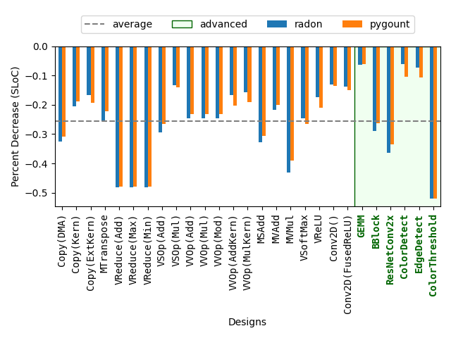
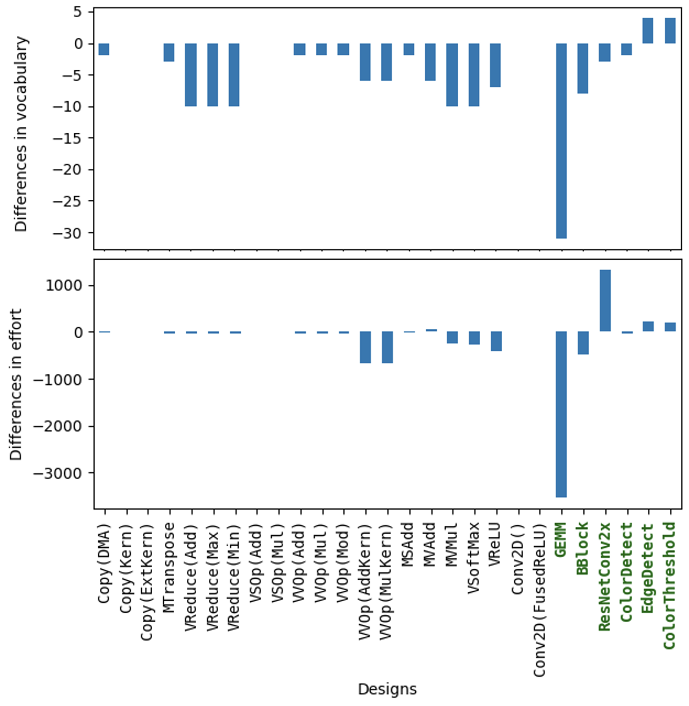

原文版权声明：本文依据公开来源论文 *Efficiency, Expressivity, and Extensibility in a Close-to-Metal NPU Programming Interface* 进行中文翻译整理，仅供学习与研究使用。
我仅提供翻译与网页整理，不拥有原文版权；原文版权归作者及发布方所有。
转载、分发或用于商业用途时，请遵守原论文及原始发布平台的版权规定。

原文信息：Erika Hunhoff，Joseph Melber，Kristof Denolf，Andra Bisca，Samuel Bayliss，Stephen Neuendorffer，Jeff Fifield，Jack Lo，Pranathi Vasireddy，Phil James-Roxby，Eric Keller。*Efficiency, Expressivity, and Extensibility in a Close-to-Metal NPU Programming Interface*。2025 IEEE 论文。

说明：以下内容按原文句序逐句对应翻译整理。
图注、表注、表格说明、代码清单和参考文献信息尽量保留原貌；作者名、标题、期刊会议信息不翻译。
原文中的术语、接口名、代码标识符和缩写保持原样，便于对照原文。

作者：Erika Hunhoff；Joseph Melber；Kristof Denolf；Andra Bisca；Samuel Bayliss；Stephen Neuendorffer；Jeff Fifield；Jack Lo；Pranathi Vasireddy；Phil James-Roxby；Eric Keller。

单位：AMD；University of Colorado at Boulder, USA；Work performed at AMD。

# 摘要 {#sec-abstract}

神经处理单元（NPU）等加速器在性能和效率之间提供了很有吸引力的平衡，相比通用计算架构更具优势。
然而，有效利用加速器能力并不总是简单：低层编程工具包可能需要开发者付出大量精力，而高层编程工具包又可能抽象掉关键优化特性。
本文旨在提升使用 IRON 的设计者效率，IRON 是一个面向 close-to-metal NPU 性能工程师的工具包。
我们为 IRON 提供了一个更新后的程序员接口，其中包含新的和改进后的编程构造。
新接口加入了用于 placement 和 data transformation 的可扩展特性。
这些贡献从三个方面进行评估：1）效率，分析显示不同设计的代码行数平均减少约 26%，Halstead 指标也随之下降；2）表达力，证明新接口支持 IRON 已支持的广泛特性与模式；3）可扩展性，说明新的 placement 与 tiling 工具可以扩展以适配常见用例。

# I. 引言 {#sec-introduction}

神经处理单元（NPU）等加速器能够比通用处理器提供更高的性能和效率；然而，有效利用加速器能力并不总是容易 [40]。
一种方法是构建高层框架，由操作与编译器组成，以抽象加速器架构的细节。
这一类面向 NPU 的框架包括 AMD Ryzen™ AI Software [5]、Intel® OpenVINO™ [34] 和 Qualcomm® Neural Processing SDK [38]。
这些平台使开发者能够使用 PyTorch 和 TensorFlow 等常见框架训练并部署机器学习模型。
第二种方法是构建低层工具包和库，支持利用加速器特定特性来创建定制化、优化过的设计。
IRON 就是这类方法的一个例子，它是一个面向 AMD XDNA™ NPU 的 close-to-metal、通用、开源工具包 [28]、[29]、[31]。
这两种方法各自服务于不同但都很重要的目的。

在低层工具包中，编程接口要在两种诉求之间寻求平衡：一方面要让程序员容易表达意图（设计者效率），另一方面又要暴露实现清晰和精确所需的细粒度硬件能力（复杂性）。
虽然这种张力有一部分是不可避免的，但具体取舍仍然可以通过有意设计接口来调节。
本文详细介绍了对 IRON 的贡献，使设计者能够清楚地表达设计（原则 1：效率），同时不牺牲设计者对低层决策的影响能力（原则 2：表达力）。
这些贡献还使设计者能够创建新的工具来生成设计的部分内容（原则 3：可扩展性）。
本文贡献的核心是一个建立在现有 IRON 编程接口之上的新 API。
这个 API 对 IRON 编程构造进行了改进，提供了一个新的接口来支持面向 placement 的可扩展工具（即把设计构造匹配到物理资源上），并包含一个新的辅助 data transformation 库，同样用于支持自定义扩展。
新 API 与现有 IRON API 共存，并作为开源仓库中的核心编程接口集成到 IRON 中，仓库地址是 <https://github.com/Xilinx/mlir-aie>。

对 IRON 的贡献使用 27 个 IRON 设计进行评估，这些设计从最简单的数据直通到最复杂的边缘检测流式视觉流水线不等。
在表达力方面，使用新 API 可以表达所有评估过的设计，而且与旧版设计实现相比，性能保持一致。
在设计者效率方面，我们发现单行代码（SLOC）平均减少约 26%，并且在所有设计上 Halstead 指标也平均下降。
在可扩展性方面，我们使用新 API 构造了一个自定义 placement 生成器和一个自定义 data transformation 生成器，并考察了自定义扩展的价值。
24 个示例 IRON 设计使用了 placement 工具。
其中 5 个设计，包括一个具有复杂运行时数据移动 tiling 模式的 GEMM 设计，使用了 data transformation 生成器。

本文其余部分安排如下。
第 II 节给出 NPU 概览。
第 III 节总结 IRON。
第 IV 到 VII 节介绍本文贡献的设计、实现与评估。
第 VIII 节讨论相关工作，第 IX 节给出结论性思考。

# II. AMD XDNA™ NPU 架构概览 {#sec-architectural-overview}

本节介绍 AMD XDNA™ NPU 架构（第 II-A 节）以及该架构对编程与优化的影响（第 II-B 节）。

## A. AMD XDNA™ NPU 架构 {#sec-xdna-architecture}

AMD XDNA™ 神经处理单元（NPU）由多种类型的 tile 组成，这些 tile 在二维网格中按空间方式排列，并由流式互连连接。
NPU 的设计目标是实现功耗和面积都高效的推理：Ryzen™ 7040 和 8040 SoC 中的 AMD XDNA™ NPU 可提供超过 10 TOPS 的性能；使用 XDNA™ DNN 编程栈时，模型相较片上 x86 处理器可获得 4.3 到 33 倍的每瓦性能提升 [41]。
XDNA™ 2 架构最高可提供 50 TOPS [6]。

@fig-xdna-npu 给出了一个简化的架构图；更全面的描述可参见其他资料 [41]。
AI Engine（AIE）tile（也存在于 Versal™ 架构中 [1]、[2]）包含一个 VLIW 向量处理器核心，以及相关的数据存储器、程序存储器、程序计数器、寄存器文件和功能单元 [41]。
Memory tile 提供额外的片上 SRAM scratchpad 存储，而 shim tile（或接口 tile）负责管理外部接口 [41]。
流式 network-on-chip（NoC）支持 tile 之间的点对点数据传输，并可配置为广播或选择性多播。
与带硬件管理缓存的架构不同，NPU 上的片上数据缓存在 scratchpad 中，并采用软件管理的数据移动方式，因此既显式又确定性强 [41]。
Data movement accelerator（DMA）负责异步数据移动，并借助 buffer descriptor（BD）支持 reorder、reshape 和 repeat 模式。[^dma]

![AMD XDNA™ NPU 的简化示意图，示例来自 Ryzen™ 7040 处理器 [41]。](../assets/efficiency-expressivity-and-extensibility-in-a-close-to-metal-npu-programming-interface/fig1-xdna-npu.png){#fig-xdna-npu width=100%}

[^dma]: 此处的 DMA 指的是一个物理组件，而不是“直接内存访问”这一动作。

## B. 编程与优化的含义 {#sec-programming-optimization}

虽然在大多数基于缓存的架构中，显式控制数据移动只是一个可选优化，但 NPU 的架构使所有 NPU 设计都必须显式进行数据移动。
显式数据移动可以提高应用延迟和吞吐量的可预测性，并降低功耗 [41]。

NPU 架构为优化数据移动提供了丰富特性。
利用 memory tile 中的 L2 buffer 可以降低某些应用所需的片外带宽。
借助 NoC 支持的广播复制数据，可以进一步减少片外内存带宽需求。
DMA 支持的即时数据转换可以减少表示一种数据移动模式所需的 DMA 操作数量。
这对于按照算法对数据进行分块，以及为向量化指令组织合适的数据结构都很有用。
这些属性使性能工程师或编译器能够精细调节数据移动。

NPU 中的存储层次和 AIE 的排列是空间化的。
在 NPU 设计中，计算和数据必须被放置在设备上的明确位置。
NPU 设计也具有时间性。
硬件通过锁以及这些锁与 DMA 操作的集成来支持同步 [41]。
为了让程序员能够精细调节动作在设备上何时以及如何发生，程序员必须能够表达空间和时间两类关系 [27]。

# III. IRON：面向 NPU 的性能工具包 {#sec-iron}

本节总结 IRON，这是一个面向 AMD XDNA™ NPU 的开源编程工具包 [31]。
IRON 为 NPU 设计的空间和时间方面提供了细粒度控制，重点放在数据移动上。

## A. IRON 概览 {#sec-iron-overview}

IRON 的核心是一个多层中间表示（MLIR）方言，mlir-aie [31]。
MLIR 是一种支持可复用、模块化和领域特定编译器基础设施的技术 [21]，也是面向多种架构（例如加速器）的常见选择 [11]、[44]、[45] 等。
mlir-aie 为 NPU 定义了原语与抽象，重点在于：1）清晰且完整地表达硬件能力；2）简化表达数据移动、同步和设计结构等关键设计组件。
mlir-aie 是 IRON 低层编程接口的核心，并定义了一个 IR，供更高层方言的编译器用来针对 NPU 生成代码。

IRON 中的抽象通过捕捉常见模式来提供编程便利，但并不会隐藏 NPU 设计的基本特征，包括 placement、显式数据移动、资源限制以及 DMA 支持的复杂访问模式。
IRON 的这些抽象并不针对某个特定应用领域，不过其中一些模式对数字信号处理和机器学习很有用。

IRON Python API 的核心是通过 MLIR Python bindings [32] 从 mlir-aie 自动生成的。
对这些绑定的定制扩展隐藏了 MLIR 的实现细节，比如常见 Python 类型与 MLIR 类型之间的转换。
IRON 特有的扩展还辅以 mlir-python-extras，这是一个开源库，提供了许多能用来在 Python 中清晰、简洁表达 MLIR 的辅助工具 [26]。
IRON Python API 支持元编程，允许程序员把传统 Python 与由 Python 驱动的 MLIR 操作生成混合在一起使用。

## B. IRON 设计的生命周期 {#sec-iron-lifecycle}

IRON 设计可以使用 IRON Python API 以 Python 编写，也可以使用 mlir-aie 以 MLIR 编写。
如果用 Python 编写，脚本会输出 MLIR assembly。
IRON 设计使用 core block 来指定在设计所用的每个处理器核心上执行的代码。
core block 中的代码可以执行计算、调用外部定义的 kernel，或者两者都做。
外部 kernel 使用 Peano [36] 等工具单独编译。
aiecc 是 IRON 的主编译驱动器，它接受 MLIR assembly 以及任何 kernel 对象文件作为输入，并生成两种工件：一个 binary，包含设计运行所需的程序；以及一组指令，在运行时由 host 处理器加载，用于对 NPU 进行（重新）配置。

IRON 通过 Xilinx® Runtime（XRT）[47] 执行设计。
IRON 设计通过对生成的 MLIR 做静态分析，以及通过运行时 tracing 做动态分析来调试。
IRON 还提供了配置硬件支持的 tracing 机制的工具 [3]。

## C. IRON 设计的结构 {#sec-iron-outline}

如 @fig-iron-design 所示的 IRON 示例设计中，所有会生成 MLIR 的构造都必须在一个 MLIR context 中创建（第 1 行）。
在设计结束时，使用由该 context 构造出的 module 输出 MLIR（第 29 行）。
设计的第一个逻辑小节是资源声明（第 4-9 行），其中包括物理组件（例如 tile）和会被降低为物理资源的 IRON 抽象（例如 ObjectFifo，参见第 III-D 节）。
类型使用 NumPy [15] 类型表达（第 4-5 行）。

core block 被声明为带装饰器的函数（第 11 行）。
AIE 获取 tile 尺寸（TH, TW）对应的输入和输出 buffer 的访问权（第 14-15 行）。
同步由 ObjectFifo 控制，这些 buffer 的所有权也由它管理。
AIE 执行逐元素标量加法（第 16-18 行），然后释放每个 buffer（第 19-20 行）。
循环使用 `range_` 表示，它是 MLIR `scf` 方言提供的循环结构的 Python 包装 [42]。

runtime sequence（第 22-28 行）用于把一个子矩阵（tile）数据发送到带 shim tile 端点的 ObjectFifo 中。
这个子矩阵使用根据矩阵和 tile 尺寸计算出来的 sizes 和 strides 进行指定。
输出 tile 也以类似方式接收。
runtime sequence 由声明（`shim_dma_single_bd_task`）、异步操作（`dma_start_task`）和同步操作（`dma_await_task`）混合构成。

::: {#fig-iron-design}

(a) 原始写法：

```text
 1 with mlir_mod_ctx() as ctx:
 2   @device(AIEDevice.npu1_1col)
 3   def device_body():
 4     mty = np.ndarray[(MH, MW), np.dtype[np.int32]]
 5     tty = np.ndarray[(TH, TW), np.dtype[np.int32]]
 6     shm0 = tile(0, 0)
 7     aie2 = tile(0, 2)
 8     fi = object_fifo("in", shm0, aie2, 2, tty)
 9     fo = object_fifo("out", aie2, shm0, 2, tty)
10
11     @core(aie2)
12     def core_body():
13       for _ in range_(sys.maxsize):
14         a = fi.acquire(ObjectFifoPort.Consume, 1)
15         b = fo.acquire(ObjectFifoPort.Produce, 1)
16         for i in range_(TH):
17           for j in range_(TW):
18             b[i, j] = a[i, j] + 1
19         fi.release(ObjectFifoPort.Consume, 1)
20         fo.release(ObjectFifoPort.Produce, 1)
21
22     @runtime_sequence(mty, mty)
23     def sequence(dati, dato):
24       in_task = shim_dma_single_bd_task(fi, dati,
25         sizes=[1, 1, TH, TW], strides=[0, 0, MW, 1])
26       out_task = shim_dma_single_bd_task(fo, dato,
27         issue_token=True, sizes=[1, 1, TH, TW],
28         strides=[0, 0, MW, 1])
29       dma_start_task(in_task, out_task)
30       dma_await_task(out_task)
31       dma_free_task(in_task)
32   print(ctx.module)
```

(b) 使用新 API 的写法：

```text
 1 mty = np.ndarray[(MH, MW), np.dtype[np.int32]]
 2 tty = np.ndarray[(TH, TW), np.dtype[np.int32]]
 3 fi = ObjectFifo(tty)
 4 fo = ObjectFifo(tty)
 5
 6 def core_fn(of_in, of_out):
 7   a = of_in.acquire(1)
 8   b = of_out.acquire(1)
 9   for i in range_(TH):
10     for j in range_(TW):
11       b[i, j] = a[i, j] + 1
12   of_in.release(1)
13   of_out.release(1)
14 my_worker = Worker(core_fn, fn_args=[fi.cons(), fo.prod()])
15
16 rt = Runtime()
17 with rt.sequence(mty, mty) as (dati, dato):
18     rt.start(my_worker)
19     rt.fill(fi.prod(), dati, sizes=[1, 1, TH, TW],
20             strides=[0, 0, MW, 1])
21     rt.drain(fo.cons(), dato, sizes=[1, 1, TH, TW],
22              strides=[0, 0, MW, 1], wait=True)
23 print(Program(NPU1Col1(), rt).resolve_program(SequentialPlacer()))
```

一个矩阵-标量加法 IRON 设计，分别在没有贡献（a）和有贡献（b）时的写法。
:::

## D. IRON 中的数据移动 {#sec-data-movement}

如第 II 节所述，NPU 的一个关键架构组件是显式数据移动。
IRON 支持在不同抽象层次上进行数据移动，但其主要抽象是 `ObjectFifo`。
`ObjectFifo` 是一个循环缓冲区，包含可配置数量（深度）的对象，并且在理论上有 dataflow 理论 [9] 的根源。
属于某个 `ObjectFifo` 的对象共享形状和数据类型，其分配由编译器决定。
对 `ObjectFifo` 对象的访问通过 `ObjectFifo` 管理的锁进行协调，访问通过 acquire 和 release 操作被授予与撤销。

`ObjectFifo` 被设计用于支持广播、滑动窗口、pipeline 平衡、在 L2 中拆分与连接数据，以及 L2 缓冲等常见模式。
在滑动窗口模式中，如果已经获取了 `n` 个 buffer，调用 `acquire(n + 1)` 只会再获取一个；类似地，如果已经获取了 `m` 个 buffer，调用 `release(1)` 只会释放第一个 buffer，留下最后的 `m - 1` 个 buffer 仍处于已获取状态。
在 pipeline balancing 模式中，关键路径上的 `ObjectFifo` 深度可以增加或减少。
在 L2 中拆分和连接数据时，可以使用 `link` 操作通过共享的 memory tile 端点连接两个 `ObjectFifo`。
L2 buffering 也同样使用 `link`。

# IV. 效率、表达力与可扩展性 {#sec-principles}

对 IRON 的扩展是为了在保持设计者表达力的同时提高设计者效率，并为进一步扩展提供路径。

**效率**：我们希望通过允许设计的某些特性在设计者没有选择调优它们时被最小化表达，来实现高效表达。
设计是多面的，性能工程师可以关注许多有趣方面（placement、dataflow、runtime 操作、data tiling、kernel 等）。
并非所有设计都要求在每个方面都具有高细节级别。
我们的贡献旨在让设计者能够高效表达那些并非其关注重点的部分。

**表达力**：我们希望在提升效率的同时不牺牲表达力。
我们对 IRON 的贡献应当允许程序员表达与 IRON 相同的构造，而且使用新贡献编写的设计应当表现出与使用现有 IRON API 编写的设计相同的特征（包括性能）。

**可扩展性**：我们希望在 IRON 中建立路径，使性能工程师，即便他们并不一定也是编译器工程师，也可以用自定义算法和工具生成设计的部分内容。
IRON 对设计的许多方面提供了完全控制，这使它特别适合被用作自动化工具的实验沙盒，这些工具正在为更高层编译器工作流而开发。
我们的贡献旨在支持将自定义扩展集成到设计空间探索、placement、tiling，以及运行时操作结构化等特定关注点上。

# V. 对 IRON 的贡献 {#sec-contributions}

对 IRON 的贡献围绕一个新 API 组织（第 V-1 节），该 API 包括一个改进版 ObjectFifo API（第 V-2 节）以及面向现有 IRON 设计组件的新构造（第 V-3 节）。
该新 API 还支持一个可扩展的 placement 接口（第 V-4 节），并包含一个用于生成即时 data transformation 的库（第 V-5 节）。

## 1) 脱离 MLIR 的耦合：Creating Distance from MLIR {#sec-creating-distance}

IRON 设计的结构继承自 MLIR 所要求的结构。
虽然可以使用一些技术来控制和隐藏 context block（例如 mlir-python-extras [26] 提供的那些技术），但如果在创建相应 Python 对象时就立即创建 MLIR 操作，那么这些 Python 对象就会受到与对应 MLIR 操作相同的规则约束。
MLIR 要求一个操作必须是完整的（也就是说，在构造时所有重要信息都已知），并且必须在 MLIR context 中按正确的 placement 实例化。
当然，可以在 Python 中插入和重排 MLIR 操作。
不过，如果把这些技术同时用于 compiler driver 和 Python 编程前端，我们认为这会增加复杂性，并让人类理解 IRON 编程栈变得困难，所以我们把这些技术留给 `aiecc`。

MLIR 约束可能与提升 IRON 可用性的目标相冲突。
例如，对 IRON 的一个理想改进，是减少重复信息。
IRON 设计中的重复信息示例包括：`ObjectFifo` 端点的 placement，以及使用该端点的 core block 的 placement（图 2a 第 8-9 行、第 11 行）；placement 位置本可以只提供一次，而不是两次。
然而，要构造 core block 和 `ObjectFifo`，两个 Python 构造器都必须在实例化时提供 placement，这就要求重复提供信息。

为了放宽对位置和信息完整性的要求，我们创建了一个新的顶层 IRON Python API。
新 API 中的 Python 类都继承自一个可解析（resolvable）接口，并把 MLIR 操作的创建延迟到调用其 `resolve` 函数时。
如果 Python 类没有足够的信息来解析为一个 MLIR 操作，那么 `resolve` 就会失败。
图 2b 展示了使用新 API 以及相关贡献重写后的图 2a 设计。

## 2) ObjectFifo API {#sec-objectfifo}

延迟解析被用来改进 `ObjectFifo` API。
`ObjectFifo` 声明（图 2a 第 8-9 行）可以简洁地重写（图 2b 第 3-4 行）。
`ObjectFifo` 的默认深度被设为 2（这是因为 ping-pong buffer 很常见）；`ObjectFifo` 的名字（它会成为 MLIR 标识符）自动生成；`ObjectFifo` 的端点则由系统推导。

当 `ObjectFifo` 被交给某个操作或构造以供使用时，通过调用 `prod` 获取生产者句柄，或通过调用 `cons` 获取消费者句柄，会生成 `ObjectFifoHandle`（图 2b 第 14 行）。
`prod` 总是返回同一个对象，因为一个 `ObjectFifo` 只能有一个生产者。
对 `cons` 的多次调用会生成多个消费者句柄，从而表达广播。
由于句柄知道自己是生产者还是消费者，因此在 `acquire` 和 `release` 中就无需再指定 `ObjectFifoPort`，这进一步减少了冗余（图 2a 第 14-15 行、第 19-20 行 vs. 图 2b 第 7-8 行、第 12-13 行）。

与其把 `link` 移植到新 API，不如让 `ObjectFifoHandle` 类提供 `forward`、`split` 和 `join` 方法。
这些方法允许数据跨 tile 前向传递（对 L2 buffering 有用）、跨 tile 拆分（适用于在一个 L2-L3 流中拆分在 L2 中暂存的数据，以节省通道），或者跨 tile 合并（用途相同，但方向相反）。
在解析阶段，这些方法会确保生成所需的 `ObjectFifo` 和 link。

## 3) Worker、Runtime 和 Program 构造 {#sec-worker-runtime-program}

我们引入了一个新构造 `Worker`（图 2b 第 14 行）。
`Worker` 的构造方式在很多多线程库中都类似于 thread。
`Worker` 接受一个要运行的例程（`core_fn`）以及运行它所需的上下文（`fn_args`）。
设计 `Worker` 的一个动机是熟悉性；另一个动机是显式地把任务定义（也就是图 2b 第 6 行的 `core_fn`）与任务运行配置（也就是传给 `Worker` 的参数，图 2b 第 14 行）分离开来。
这种模式为元编程提供了清晰路径，因为 `fn_args` 可以包含任意 Python 值，用来定制 `core_fn` 所生成的 MLIR。
这种元编程常用于把计算任务适配到不同的数据类型、维度或数据分布。

新的 `Runtime` 构造表示运行时序列（图 2b 第 16-20 行）。
`Runtime` 序列不能表示任意计算，这一点对 IRON 程序员来说可能不太直观，因为它在视觉上与 AIE 在 IRON 设计中执行的命令式块很相似。
`Runtime` 支持的操作包括：`start`，表示应当为执行配置一个 worker（图 2b 第 18 行）；`fill`，表示使用 DMA 操作把来自 L3 buffer 的数据填充到 `ObjectFifo` 中（图 2b 第 19 行）；以及 `drain`，表示把 `ObjectFifo` 中的数据收集到 L3 buffer（图 2b 第 20 行）。
最后一个方法 `inline_ops` 允许高级设计者向运行时序列插入一个生成任意 MLIR op 的 Python 函数；这大致类似于 C 程序中的 inline assembly。
这种技术支持专门定制配置，并将在未来工作中用于在新 API 中完整支持 tracing 配置。

为了把这些组件组合成一个设计，新 `Program` 构造会把一个 `Runtime` 应用于一个 `Device` 来创建设计。
设计的 MLIR 由 `resolve_program` 生成（图 2b 第 21 行）。

## 4) Placement 接口 {#sec-placement-interface}

新 API 支持手动 placement 的程序，这满足了表达力的目标。
然而，如果程序员没有提供足够的 placement 信息，`resolve_program` 就会失败。
如果没有额外扩展，这就意味着所有 IRON 设计都必须是 fully placed 的。
为了同时满足效率和可扩展性的目标，我们构造了一个支持 placement 生成的接口。

新 IRON API 中属于 `Placeable` 的对象提供一个 `place` 方法，该方法接收一个 placement tile 作为参数。
`resolve_program` 可以选择性地接收一个 `Placer` 参数（图 2b 第 21 行）。
`Placer` 必须实现 `make_placement`。
在 `resolve_program` 执行期间，会调用 `make_placement`，从而允许 `Placer` 在生成 MLIR 之前对所有 `Placeable` 设计组件调用 `place`。
该 placement 接口支持部分 placement 的设计，也支持诸如 `AnyShim`、`AnyMemTile` 和 `AnyComputeTile` 这样的 placement hints。
未来工作包括支持为 `Placeable` 组件添加程序员自定义属性，以支持任意 placement hint。

placement 接口实现了效率目标（不关心手动 placement 的设计者可以使用并复用 placement 生成器）、表达力目标（更换 `Placer` 或为某个设计指定部分 placement 都很直接）以及可扩展性目标（用户有一个定义明确的机制来构建新的 `Placer`）。
图 2b 第 21 行中的 `SequentialPlacer` 是一个 `Placer` 的示例，并将在第 VII-C1 节进一步讨论。
`Placer` API 用 Python 编写，但常见的语言绑定工具可以将其他语言编写的现有 placement 和 design space exploration 工具封装为 `Placer`。

## 5) 即时 Data Transformation 的原语 {#sec-taplib}

图 2b 中有一个复杂点很突出：sizes 和 strides（第 19-20 行）。
仅仅看 sizes 和 strides 来推理变换可能很困难。
为了解决这个问题，我们创建了 `taplib`，它包含两个用于表达和推理变换的原语抽象。
`TensorAccessPattern`（tap）由一组 tensor 维度、sizes、strides 以及 tensor 内部的一个 offset 构成。
`TensorAccessSequence`（tas）是若干 tap 的集合，这些 tap 的 tensor 维度必须匹配。
考虑一个例子：程序员希望把一个 6 × 4 tensor 切成四个 3 × 2 的、互不重叠的 row-major tile，并选取左上角和右下角两个 tile。
使用 `taplib`，可以写成如下形式：

```text
tap00 = TensorAccessPattern((6, 4), offset=0,
  sizes=[1, 1, 3, 2], strides=[0, 0, 4, 1])
tap11 = TensorAccessPattern((6, 4), offset=14,
  sizes=[1, 1, 3, 2], strides=[0, 0, 4, 1])
taps0 = TensorAccessSequence.from_taps([tap00, tap11])
```

`taplib` 提供了推理 `tap` 和 `tas` 的机制，包括用于一维和二维 tensor 的可视化与动画（@fig-taplib-heatmaps）。
`taplib` 还支持程序化分析工具。
@fig-taplib-heatmaps 中展示的图形是使用 `taplib` 的 access map 生成的。
access count map 是一个 tensor，其中每个元素表示相应元素在原始 tensor 中被某个 tap 或 tas 访问的次数。
access order map 是一个 tensor，其中每个元素表示 tap 或 tas 所定义的访问顺序中的元素级编号。
access map 对于发现 bug 很有用，因为 `tap` 定义中的逻辑错误可以形式化为：其访问模式在计数或顺序上与程序员意图不一致。
下面的代码片段演示了如何使用 access map 验证 `tap00` 和 `taps0` 的特性：

```text
# Num accessed: Count starts at 0, so highest is 5
assert tap00.access_order().max() == 3*2 - 1
# Count of elements accessed by tap00
assert tap00.access_count().sum() == 3*2
# Num accessed: Highest count for two tiles is 11
assert taps0.access_order().max() == 2*(3*2) - 1
# The tas does not access any element more than once
assert taps0.access_count().max() == 1
```

我们使用 access map 为访问模式定义了一个新的等价性概念。
严格的等价性定义要求两个 tap 的 tensor 维度、sizes、strides 和 offset 都相同。
我们用 `access equivalent` 这个术语来描述那些生成相同 access order 和 access count map 的 tap。
access equivalence 在 IRON 的语境中很有用，因为 NPU 中的 DMA 单元对 sizes 和 strides 支持的最大维度有不同限制，而且每个维度支持的最大位数也不同。
因此，两个访问模式可能在严格意义上不相等，但却是 access equivalent，其中一个能生成有效的 IRON 设计，而另一个不能。
`taplib` 允许程序员精确表达这些细节。
新的 IRON API 将 `taplib` 集成了进来（例如，`Runtime` 的 `fill` 和 `drain` 方法使用 tap 来代替 sizes 和 strides）。

::: {#fig-taplib-heatmaps layout-ncol=1}

{#fig-tap00-heatmap width=70%}

{#fig-taps0-heatmap width=70%}

taplib 生成的热图。
:::

# VI. 实现 {#sec-implementation}

我们的贡献用 Python 实现，其中新的顶层 API 约 1,400 行代码（LOC），`taplib` 额外实现约 560 行 LOC。
这些贡献的有效性在很大程度上不依赖具体实现机制；其中一些贡献未来可以作为 `mlir-aie` 的一部分集成进去。

# VII. 评估 {#sec-evaluation}

本文的贡献旨在提升设计者效率（第 VII-A 节）、同时保持同样的表达力（第 VII-B 节），并为进一步扩展提供清晰机制（第 VII-C 节）。
第 VII-B 节与第 VII-C 节在对 IRON 进行贡献之前与之后，对 @tbl-evaluation-designs 中概括的 27 个设计进行对比。

::: {style="overflow-x:auto"}
: 用于评估 IRON 贡献的 27 个设计（21 个直白的 block 设计，6 个优化过的高级设计） {#tbl-evaluation-designs}

| Name | Description | SLOC Before | SLOC After |
|---|---|---:|---:|
| Copy (DMA only) | 通过仅 DMA 将数据不改变地传过 NPU。 | 42 | 29 |
| Copy (DMA + kernel) | 通过 DMA 加 kernel 将数据不改变地传过 NPU。 | 48 | 39 |
| Copy (DMA + external kernel) | 通过 DMA 加外部 kernel 将数据不改变地传过 NPU。 | 52 | 42 |
| MTranspose | 使用 DMA 转置矩阵。 | 36 | 28 |
| VReduce (add) | 逐元素向量归约（加法）。 | 50 | 26 |
| VReduce (max) | 逐元素向量归约（最大值）。 | 50 | 26 |
| VReduce (min) | 逐元素向量归约（最小值）。 | 50 | 26 |
| VSOp (add) | 逐元素向量-标量操作（加法）。 | 49 | 36 |
| VSOp (mul) | 逐元素向量-标量操作（乘法）。 | 64 | 55 |
| VVOp (add) | 逐元素向量-向量操作（加法）。 | 56 | 43 |
| VVOp (mul) | 逐元素向量-向量操作（乘法）。 | 56 | 43 |
| VVOp (mod) | 逐元素向量-向量操作（取模）。 | 56 | 43 |
| VVOp (addKern) | 向量化的 addKern。 | 94 | 75 |
| VVOp (mulKern) | 向量化的 mulKern。 | 94 | 76 |
| MSAdd | 矩阵中子矩阵的标量加法。 | 62 | 43 |
| MVAdd | 分块的、按行的矩阵-向量加法。 | 55 | 44 |
| MVMul | 矩阵-向量乘法。 | 105 | 69 |
| VSoftMax | 使用查找表近似实现的 softmax，应用到所有向量元素。 | 79 | 58 |
| VReLU | 逐元素 ReLU，`ReLU(x)=max(0, x)`，一种常见的 DNN 激活函数。 | 76 | 60 |
| Conv2d (base) | 2 维卷积。 | 89 | 77 |
| Conv2d + ReLU | 2 维卷积；第二个设计把 kernel 与 ReLU 融合。 | 86 | 73 |
| GEMM | 矩阵-矩阵乘法。矩阵在与 NPU 内在函数匹配的块中相乘，子块分配给 AIE。 | 308 | 279 |
| BBlock | 用于 ResNet 等 DNN 的 bottleneck block，使用 3 级流水线实现。 | 332 | 245 |
| ResNetConv2x | ResNet 中的 Conv2D X 层，由三个 BBlock 组成。 | 623 | 414 |
| ColorDetect | 以 3 级流水线结构检测图像中的两种颜色。 | 163 | 146 |
| EdgeDetect | 使用 4 级流水线在图像中检测边缘。 | 198 | 177 |
| ColorThresh | 分块的数据并行颜色阈值检测。 | 169 | 81 |
:::

@tbl-evaluation-designs 记录了每个设计的 SLOC，@fig-sloc-decrease 展示了设计版本之间的百分比下降。
很多设计都包含一定程度的参数解析和验证（这两部分在两版之间是相同的），因此会略微稀释百分比。
即便如此，使用本文贡献编写的 IRON 设计平均需要少 25.53% 的 SLOC，平均每个设计减少 31 行。

{#fig-sloc-decrease width=100%}

## A. 效率 {#sec-efficiency}

本节把效率分解为两个指标：单行代码（SLOC），它反映简洁性；以及 Halstead 指标，它反映工作量。
这些指标并不完美，但我们认为，评估设计的数量和类型足以让这些结果代表总体趋势。

### 1) 简洁性 {#sec-brevity}

SLOC 使用 `pygount` [37] 和 `radon` [39] 进行测量。
所有设计都通过程序化方式使用 `black` [20] 格式化。
@fig-sloc-decrease 展示了各设计版本之间的百分比下降，而 @tbl-evaluation-designs 记录了每个设计的 SLOC。
许多设计都包含一定程度的参数解析和验证（两版之间相同），这会让百分比略微下降。
即便如此，使用本文贡献编写的 IRON 设计平均少 25.53% 的 SLOC，每个设计平均减少 31 行。

### 2) 工作量 {#sec-effort}

我们使用 Halstead 指标，这是一套常见的软件评估指标 [4]、[7]、[12]、[14]，来分析这些示例设计。
Halstead 指标使用从源代码中提取的属性（操作符数量、操作数数量以及两者的计数）来定义 vocabulary 和 effort 等概念 [13]。
对所有设计而言，所有负向 Halstead 指标的平均值（使用 `radon` [39] 计算）在贡献之后写成的设计中都低于贡献之前写成的设计。
@fig-halstead-differences 展示了 vocabulary（基于源代码中唯一操作符和操作数数量的度量）以及 effort（旨在反映作为作者、维护者或读者与程序交互所需努力的度量）的计算结果 [14]。
vocabulary 的平均下降为 4.59（平均百分比下降 23.32%），而 effort 的平均下降为 179.97（平均百分比下降 24.82%）。

{#fig-halstead-differences width=100%}

## B. 表达力 {#sec-expressivity}

本节评估加入贡献后的 IRON 是否与贡献前的 IRON 同样具有表达力。
示例设计，尤其是高级设计，覆盖了 IRON 支持的关键特性与模式。
在 @tbl-advanced-features 中，`L2Mem` 指使用 memory tile，而 `SharedMem` 指 AIE 访问另一个 AIE 的 L1 memory 的能力（从而节省 DMA 通道）。
`Tiling` 指即时 data transformation。
`Broadcast`、`Split/Join`、`sliding Window` 和 `Skip` 连接是数据移动特性。
`Pipeline` 指任务并行的设计；其他设计是数据并行的。
`Metaprog` 指设计中的元编程。
`NPUCols` 报告设计需要的 NPU 列数。
贡献后的所有示例 IRON 设计都会产生与对应原始设计相同且正确的输出；这是正确性的第一次检验。
为了进一步分析，我们使用静态 MLIR 分析并测量性能数据。

::: {style="overflow-x:auto"}
: 高级设计的特征 {#tbl-advanced-features}

| Name | L2Mem | SharedMem | Tiling | Broadcast | Split/Join | Window | Skip | Pipeline | Metaprog | NPUCols |
|---|---|---|---|---|---|---|---|---|---|---|
| GEMM | ✓ | — | ✓ | ✓ | ✓ | — | — | — | ✓ | 1-4 |
| BBlock | ✓ | ✓ | — | ✓ | ✓ | ✓ | ✓ | ✓ | — | 1 |
| ResNetConv2x | ✓ | ✓ | — | ✓ | ✓ | ✓ | ✓ | ✓ | ✓ | 3 |
| ColorDetect | ✓ | — | — | ✓ | — | — | ✓ | ✓ | — | 1 |
| EdgeDetect | ✓ | — | — | ✓ | — | ✓ | ✓ | ✓ | — | 1 |
| ColorThresh | ✓ | — | ✓ | — | ✓ | — | — | — | ✓ | 1 |
:::

为了验证两版相同设计是否以相同方式使用 NPU 特性，我们比较了每个版本生成的 MLIR。
朴素比较会发现，所有设计生成的 MLIR 都不同。
然而，这些差异大多只是声明顺序不同（例如 tile 的声明顺序不同），因此不应影响设计功能。
在控制声明顺序后，27 个设计中的 20 个会生成完全相同的 MLIR。
三个设计（GEMM、MVAdd、MTranspose）使用了不同的运行时 DMA 传输尺寸和 strides，但它们表达的访问模式是 access equivalent，因此在功能上等价。
四个设计（ColorDetect、ResNetConv2x、BBlock、EdgeDetect）使用了一个或多个带广播的 `ObjectFifo`，而接收者列表发生了重排；这种重排不会导致功能差异。

为了佐证静态分析，我们记录了每个设计的平均延迟（100 次 warm up 迭代后再进行 1000 次迭代）。
两版设计之间的平均百分比差异约为 3.36%。
27 个设计中有 11 个在使用本文贡献的 IRON 时表现出略高的延迟。
对每一版设计的平均延迟求和后，其百分比差异小于 0.09%，可归因于系统噪声。

## C. 可扩展性 {#sec-extensibility}

对 IRON 的贡献包括两个专为扩展而设计的接口：placement 接口和 `taplib`。
我们之所以把手工 placement 和 data transformation 规范化作为扩展目标，是因为它们既繁琐又容易出错，因此设计者既能从可编程性中获益（可以通过算法生成解决方案），又能在不需要时忽略设计中的这些方面。
在本节中，我们验证使用这些接口构建扩展是可行的。

### 1) 定义 Placer {#sec-defining-placer}

这个实验的目的有两个：a）展示 `Placer` 接口可以用于生成可运行的设计；b）展示仅凭 IRON 和 NPU 架构知识，用户就能成功创建一个 `Placer`。
为此，我们实现了 `SequentialPlacer`，它只用了 64 行 SLOC，而且只使用了新 IRON API 中的构造。
`SequentialPlacer` 以类似网格的方式分配 AIE，然后分配 memory tile 和 shim tile，使得 `ObjectFifo` 端点保持在同一列。
这个 `Placer` 很基础；它尊重 AIE 阵列的维度约束，但可能因为其他资源约束而生成无效 placement。
在 27 个示例设计中，`SequentialPlacer` 被 24 个设计用于完整 placement；1 个设计用于部分 placement（BBlock）；另外 2 个设计（ResNetConv2x、GEMM）是完全手工 placement，因为 `SequentialPlacer` 由于资源分配过量而生成了无效设计。
这说明 `Placer` API 确实允许构建并应用新的 placer 到 IRON 设计中。

### 2) TensorAccessPattern 生成器 {#sec-tap-generators}

`taplib` 原语真正的价值在于，它们可以被生成出来以替代手工编写的 sizes 和 strides。
程序员的意图很难仅从计算 sizes 和 strides 的算术表达式中看出来。
这会影响可读性和可维护性，也会让程序员在每个新设计中都要独自承担构造这类算术的负担。
为了说明 taps 和 tases 如何被生成来服务某一类变换，我们实现了一个示例生成器 `TensorTiler2D`。
`TensorTiler2D` 会基于 tile 大小、tile 内按列或按行的元素访问、tile 的分组（例如在一个 tap 中访问多个 tile）、以及 tile 的按列或按行访问来生成 tases。
`TensorTiler2D` 只用了 277 行 SLOC，并被 5 个设计使用（MSAdd、MVAdd、MVMul、GEMM、MTranspose）。
我们认为，GEMM 设计中 vocabulary 和 effort 的差异主要来自 `TensorTiler2D`，因为它大幅减少了该设计运行时中的算术量。

# VIII. 相关工作 {#sec-related-work}

面向 NPU 的一类框架，包括 AMD Ryzen™ AI Software [5]、Intel® OpenVINO™ [34] 和 Qualcomm® Neural Processing SDK [38]，相比 IRON 提供了更高层的抽象，并且专注于机器学习。
CUDA [10]、OpenCL [33] 和 HLS [35] 在抽象层次上更接近 IRON，但 IRON 专门面向带 AIE 的加速器。
许多带 Python 前端的工作 [8] 都包含运行时代码生成（RCG），通常通过即时编译 [17]、[19]、[44] 实现。
另一些工作提供领域特定语言（DSL）[18] 或嵌入式 DSL（eDSL）[22]、[24]、[30]。
本文关注的是对优化设计的高效表达，而不是 RCG。
`Worker` 核心函数可以看作是用 `mlir-python-extras` [26] 提供的 eDSL 编写的。
本文对 IRON 的贡献则关注设计的其他方面，例如 data transformation，以及表示设计结构的构造的细化。
[23]、[25] 提出了一个用于端到端管理 AIE 架构的编程模型，它们与我们的部分目标相同（支持性能调优和元编程），但优先级不同。
我们的工作不涉及 RCG，而 [23]、[25] 则不关注可扩展接口或设计者效率的度量。
[46] 展示了 scratchpad 架构中 DMA transformation 的复杂性；`taplib` 提供的表达 DMA transformation 的工具可能有助于这方面的进一步研究。
关于用于性能工程师的热图和可视化工具的使用，文献 [43] 作了描述，它使用了类似的术语（access patterns）和技术（基于 tensor 的热图）[43]。
然而，那项工作关注的是缓存架构中访问和移动之间的关系，而 `taplib` 在 IRON 语境中支持的 access pattern 则是数据移动配置。
文献 [43] 中描述的仿真和建模未来可以作为 IRON 设计的扩展来实现。

# IX. 结论 {#sec-conclusion}

本文描述、实现并分析了对 IRON 的贡献，这些贡献在不牺牲表达力的前提下提升了设计者效率，并提供了进一步扩展的机制。
这些贡献通过一个新的 API 以及更精炼的编程构造和可扩展接口，成功改变了 27 个示例 IRON 设计的源代码特征，同时保留了功能正确性。
我们观察到，示例设计的 SLOC 平均减少约 26%。
尽管本文的大多数贡献都特定于 IRON，但这项工作提供了一个数据点，说明即便不改变接口的抽象层次，针对加速器微调编程接口的设计，也会显著影响设计特征。

# 参考文献 {#sec-references}

[1] Sagheer Ahmad, Sridhar Subramanian, Vamsi Boppana, Shankar Lakka, Fu-Hing Ho, Tomai Knopp, Juanjo Noguera, Gaurav Singh, and Ralph Wittig. Xilinx first 7nm device: Versal AI Core (VC1902). In 2019 IEEE Hot Chips 31 Symposium (HCS), Cupertino, CA, USA, August 18-20, 2019, pages 1–28. IEEE, 2019.

[2] AI Engine: Meeting the compute demands of next-generation applications. <https://www.amd.com/en/products/adaptive-socs-and-fpgas/technologies/ai-engine.html>. Accessed 5 January 2025.

[3] AIE-ML trace and profiling. <https://docs.amd.com/r/en-US/am020-versal-aie-ml/AIE-ML-Trace-and-Profiling>. Accessed 5 January 2025.

[4] Mahmoud Alfadel, Armin Kobilica, and Jameleddine Hassine. Evaluation of Halstead and cyclomatic complexity metrics in measuring defect density. In 2017 9th IEEE-GCC Conference and Exhibition (GCCCE), pages 1–9, 2017.

[5] AMD Ryzen™ AI software. <https://www.amd.com/en/developer/resources/ryzen-ai-software.html>. Accessed 5 January 2025.

[6] AMD unveils next-gen “Zen 5” Ryzen processors to power advanced AI experiences. <https://www.amd.com/en/newsroom/press-releases/2024-6-2-amd-unveils-next-gen-zen-5-ryzen-processors-to-p.html>, June 2024. Accessed 5 January 2025.

[7] C. T. Bailey and W. L. Dingee. A software study using Halstead metrics. SIGMETRICS Perform. Eval. Rev., 10(1):189–197, January 1981.

[8] Oscar Castro, Pierrick Bruneau, Jean-Sebastien Sottet, and Dario Torregrossa. Landscape of high-performance Python to develop data science and machine learning applications. ACM Computing Surveys, 56(3), October 2023.

[9] Kristof Denolf, Marco Bekooij, Johan Cockx, Diederik Verkest, and Henk Corporaal. Exploiting the expressiveness of cyclo-static dataflow to model multimedia implementations. EURASIP Journal on Advances in Signal Processing, 2007:1–14, 2007.

[10] Michael Garland, Scott Le Grand, John Nickolls, Joshua Anderson, Jim Hardwick, Scott Morton, Everett Phillips, Yao Zhang, and Vasily Volkov. Parallel computing experiences with CUDA. IEEE Micro, 28(4):13–27, 2008.

[11] Shikha Goel, Rajesh Kedia, Rijurekha Sen, and M Balakrishnan. EXPRESS: A framework for execution time prediction of concurrent CNNs on Xilinx DPU accelerator. ACM Trans. Embed. Comput. Syst., 24(1), November 2024.

[12] Nikhil Govil. Applying Halstead software science on different programming languages for analyzing software complexity. In 2020 4th International Conference on Trends in Electronics and Informatics (ICOEI)(48184), pages 939–943, 2020.

[13] Halstead metrics. <https://radon.readthedocs.io/en/latest/intro.html#halstead-metrics>. Accessed 7 January 2025.

[14] T Hariprasad, G Vidhyagaran, K Seenu, and Chandrasegar Thirumalai. Software complexity analysis using Halstead metrics. In 2017 International Conference on Trends in Electronics and Informatics (ICEI), pages 1109–1113, 2017.

[15] Charles R. Harris, K. Jarrod Millman, Stefan J. van der Walt, Ralf Gommers, Pauli Virtanen, David Cournapeau, Eric Wieser, Julian Taylor, Sebastian Berg, Nathaniel J. Smith, Robert Kern, Matti Picus, Stephan Hoyer, Marten H. van Kerkwijk, Matthew Brett, Allan Haldane, Jaime Fernandez del Rio, Mark Wiebe, Pearu Peterson, Pierre Gerard-Marchant, Kevin Sheppard, Tyler Reddy, Warren Weckesser, Hameer Abbasi, Christoph Gohlke, and Travis E. Oliphant. Array programming with NumPy. Nature, 585(7825):357–362, September 2020.

[16] Kaiming He, Xiangyu Zhang, Shaoqing Ren, and Jian Sun. Deep residual learning for image recognition. In Proceedings of the IEEE Conference on Computer Vision and Pattern Recognition (CVPR), June 2016.

[17] Andreas Klockner, Nicolas Pinto, Yunsup Lee, Bryan Catanzaro, Paul Ivanov, and Ahmed Fasih. PyCUDA and PyOpenCL: A scripting-based approach to GPU run-time code generation. In Proceedings of the 2019 ACM/SIGDA International Symposium on Field-Programmable Gate Arrays, Parallel Computing, pages 157–174. ScienceDirect, 2012.

[18] Yi-Hsiang Lai, Yuze Chi, Yuwei Hu, Jie Wang, Cody Hao Yu, Yuan Zhou, Jason Cong, and Zhiru Zhang. HeteroCL: A multi-paradigm programming infrastructure for software-defined reconfigurable computing. In Proceedings of the 2019 ACM/SIGDA International Symposium on Field-Programmable Gate Arrays, FPGA ’19, pages 242–251, New York, NY, USA, 2019. Association for Computing Machinery.

[19] Siu Kwan Lam, Antoine Pitrou, and Stanley Seibert. Numba: a LLVM-based Python JIT compiler. In Proceedings of the Second Workshop on the LLVM Compiler Infrastructure in HPC, LLVM ’15, New York, NY, USA, 2015. Association for Computing Machinery.

[20] Lukasz Langa and contributors to Black. Black: The uncompromising Python code formatter. <https://github.com/psf/black>. Accessed 5 January 2025.

[21] Chris Lattner, Mehdi Amini, Uday Bondhugula, Albert Cohen, Andy Davis, Jacques Pienaar, River Riddle, Tatiana Shpeisman, Nicolas Vasilache, and Oleksandr Zinenko. MLIR: Scaling compiler infrastructure for domain specific computation. In 2021 IEEE/ACM International Symposium on Code Generation and Optimization (CGO), pages 2–14, 2021.

[22] Kevin Lee and Kai-Ting Wang. PyDSL: A Python subset for a better MLIR programming experience (part II). <https://llvm.org/devmtg/2024-10/slides/quicktalks/Wang-PyDSL.pdf>, 2022.

[23] Maksim Levental. An End-to-End Programming Model for AI Engine Architectures. PhD thesis, University of Chicago, June 2024.

[24] Maksim Levental, Alok Kamatar, Ryan Chard, Kyle Chard, and Ian Foster. nelli: a lightweight frontend for MLIR, 2023.

[25] Maksim Levental, Arham Khan, Ryan Chard, Kyle Chard, Stephen Neuendorffer, and Ian Foster. An end-to-end programming model for AI Engine architectures. In Proceedings of the 14th International Symposium on Highly Efficient Accelerators and Reconfigurable Technologies (HEART), HEART ’24, pages 135–136, New York, NY, USA, 2024. Association for Computing Machinery.

[26] Maksim Levintal. mlir-python-extras. <https://github.com/makslevental/mlir-python-extras>. Accessed 28 December 2024.

[27] Leibo Liu, Jianfeng Zhu, Zhaoshi Li, Yanan Lu, Yangdong Deng, Jie Han, Shouyi Yin, and Shaojun Wei. A survey of coarse-grained reconfigurable architecture and design: Taxonomy, challenges, and applications. ACM Comput. Surv., 52(6), October 2019.

[28] Jack Lo, Joseph Melber, Kristof Denolf, Phil James-Roxby, and Samuel Bayliss. Levering MLIR to design for AI Engines on Ryzen™ AI. <https://github.com/Xilinx/mlir-aie/blob/main/docs/conferenceDescriptions/micro24TutorialDescription.md>, April 2024. ACM International Conference on Architectural Support for Programming Languages and Operating Systems (ASPLOS’24) Tutorial.

[29] Joseph Melber, Kristof Denolf, and Andrew Schmidt. Leveraging the IRON AI Engine API to program the Ryzen™ AI NPU. <https://github.com/Xilinx/mlir-aie/blob/main/docs/conferenceDescriptions/micro24TutorialDescription.md>, Nov 2024. 57th IEEE/ACM International Symposium on Microarchitecture (MICRO’24) Tutorial.

[30] Jackson Melchert, Keyi Zhang, Yuchen Mei, Mark Horowitz, Christopher Torng, and Priyanka Raina. Canal: A flexible interconnect generator for coarse-grained reconfigurable arrays. IEEE Computer Architecture Letters, 22(1):45–48, 2023.

[31] mlir-aie: MLIR-based AI Engine toolchain. <https://github.com/Xilinx/mlir-aie>. Accessed 5 January 2025.

[32] MLIR Python bindings. <https://mlir.llvm.org/docs/Bindings/Python/>. Accessed 28 December 2024.

[33] Aaftab Munshi. The OpenCL specification. In 2009 IEEE Hot Chips 21 Symposium (HCS), pages 1–314, 2009.

[34] Intel® distribution of OpenVINO™ toolkit. <https://www.intel.com/content/www/us/en/developer/tools/openvino-toolkit/overview.html>. Accessed 8 January 2025.

[35] Mark Oskin, Frederic T. Chong, and Matthew Farrens. HLS: combining statistical and symbolic simulation to guide microprocessor designs. In Proceedings of the 27th Annual International Symposium on Computer Architecture, ISCA ’00, pages 71–82, New York, NY, USA, 2000. Association for Computing Machinery.

[36] peano: AI Engine fork of LLVM. <https://github.com/Xilinx/llvm-aie>. Accessed 28 December 2024.

[37] pygount. <https://github.com/roskakori/pygount>. Accessed 5 January 2025.

[38] Qualcomm® neural processing SDK for AI. <https://www.qualcomm.com/developer/software/neural-processing-sdk-for-ai>. Accessed 8 Jan 2025.

[39] radon. <https://github.com/rubik/radon>. Accessed 5 January 2025.

[40] Jonathan Ragan-Kelley. The future of fast code: Giving hardware what it wants. <https://youtu.be/vU3ryvZYlkk?si=Zk-jRdYFqQ3jcbJp>, June 2024. 44th ACM SIGPLAN International Conference on Programming Language Design and Implementation (PLDI’24) Keynote.

[41] Alejandro Rico, Satyaprakash Pareek, Javier Cabezas, David Clarke, Baris Ozgul, Francisco Barat, Yao Fu, Stephan Munz, Dylan Stuart, Patrick Schlangen, Pedro Duarte, Sneha Date, Indrani Paul, Jian Weng, Sonal Santan, Vinod Kathail, Ashish Sirasao, and Juanjo Noguera. AMD XDNA™ NPU in Ryzen™ AI processors. IEEE Micro, 44(6):73–82, 2024.

[42] ‘scf’ dialect. <https://mlir.llvm.org/docs/Dialects/SCFDialect/>. Accessed 28 December 2024.

[43] Philipp Schaad, Tal Ben-Nun, and Torsten Hoefler. Boosting performance optimization with interactive data movement visualization. In SC22: International Conference for High Performance Computing, Networking, Storage and Analysis, pages 1–16, 2022.

[44] Philippe Tillet, H. T. Kung, and David Cox. Triton: an intermediate language and compiler for tiled neural network computations. In Proceedings of the 3rd ACM SIGPLAN International Workshop on Machine Learning and Programming Languages, MAPL 2019, pages 10–19, New York, NY, USA, 2019. Association for Computing Machinery.

[45] Torch-MLIR. <https://github.com/llvm/torch-mlir>. Accessed 5 January 2025.

[46] Mingchuan Wu, Ying Liu, Huimin Cui, Qingfu Wei, Quanfeng Li, Limin Li, Fang Lv, Jingling Xue, and Xiaobing Feng. Bandwidth-aware loop tiling for DMA-supported scratchpad memory. In Proceedings of the ACM International Conference on Parallel Architectures and Compilation Techniques, PACT ’20, pages 97–109, New York, NY, USA, 2020. Association for Computing Machinery.

[47] Xilinx runtime (XRT) architecture. <https://xilinx.github.io/XRT/2024.2/html/index.html>. Accessed 5 January 2025.
