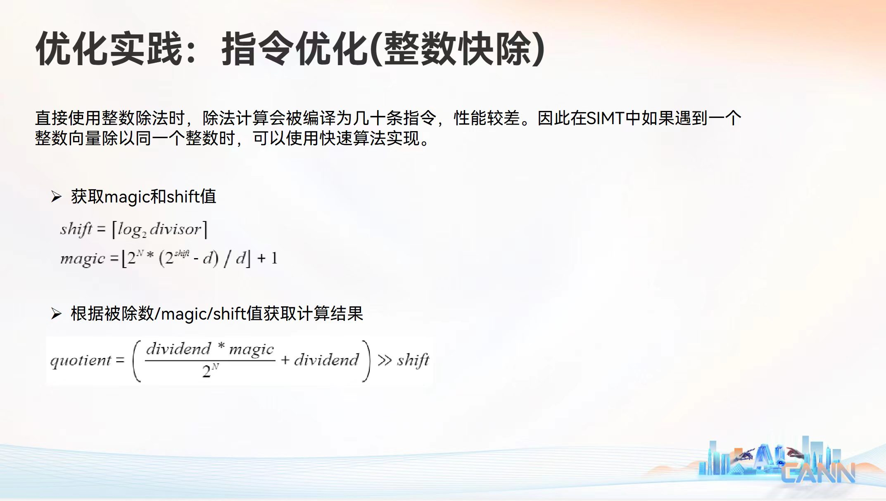

{width=100%}

朋友发给我一个幻灯片，让我研究一下华为这个整数除法是什么原理。

本文将完整梳理该算法的执行步骤、核心代数推导过程，并解答其在底层硬件上的边界设计问题。

## 一、算法核心步骤总结

该算法将高延迟的除法运算严格拆分为两个阶段：**预计算阶段**（编译期或 Host 端完成）和**运行时阶段**（设备端硬件流水线执行）。

### 1. 预计算阶段（仅执行一次）

给定除数 $d$（已知常数）和硬件原生位宽 $N$（如 32 位），计算出两个关键的编译期常量：

* **偏移量 (shift)：**
    $$shift = \lceil \log_2 d \rceil$$
* **魔法常数 (magic)：**
    $$magic = \lfloor \frac{2^N \times (2^{shift} - d)}{d} \rfloor + 1$$

### 2. 运行时阶段（执行成千上万次）

当程序执行 `quotient = dividend / d` 时，底层硬件只需串行执行三条低延迟的基础指令。其完整公式等价为：

$$quotient = ( ((dividend \times magic) \gg N) + dividend ) \gg shift$$

1. **高位乘法 (`mul.hi`)：** 即 $(dividend \times magic) \gg N$。提取 64 位乘积的高 32 位。
2. **加法补偿 (`add`)：** 将上一步结果 $+ dividend$，补偿因截断而丢失的魔数权重。
3. **逻辑右移 (`shr`)：** 将加法结果 $\gg shift$，得到最终精确的商。

## 二、核心数学原理剖析

整数除法的本质是乘以倒数：$x / d = x \times \frac{1}{d}$。

由于整型寄存器无法存储小数 $\frac{1}{d}$，我们需要将其放大 $2^K$ 倍，使其变成一个整数（即理想魔数 $M_{true}$），乘完之后再缩小回去（右移 $K$ 位）。

为了保证计算结果在任何情况下都不会偏小（详见文末补充说明），我们必须对放大的倒数进行**向上取整**。因此，我们假设理想魔数 $M_{true}$ 的定义为：

$$M_{true} = \lceil \frac{2^K}{d} \rceil$$

此时，除法运算被近似为：
$$x / d \approx \frac{x \times M_{true}}{2^K}$$

既然确立了 $M_{true}$ 的形式，接下来的核心问题是：**放大倍数（缩放精度） $K$ 到底需要多大，才能保证在全定义域下计算绝对正确？**

## 三、精度边界推导：为什么 $K$ 的取值必须是 $N + shift$？

令向上取整引入的小数误差为 $\epsilon$（$0 \le \epsilon < 1$），则理想魔数可以表示为：

$$M_{true} = \frac{2^K}{d} + \epsilon$$

对于任意被除数 $n$，其实际除法结果可写为商 $q$ 和余数 $r$（即 $n = q \times d + r$）。带入我们的近似除法公式中，机器实际计算的中间值为：

$$\frac{n \times M_{true}}{2^K} = \frac{n \times (\frac{2^K}{d} + \epsilon)}{2^K} = \frac{n}{d} + \frac{n \times \epsilon}{2^K} = q + \left( \frac{r}{d} + \frac{n \times \epsilon}{2^K} \right)$$

为了保证最终右移截断（向下取整）后的结果正好等于 $q$，必须保证括号内的小数部分在**最极端的最坏情况（Worst-case）**下也严格小于 1。我们寻找极端值：

1. 最大余数：$r = d - 1$
2. 最大误差：$\epsilon \to 1$
3. 最大被除数：$n \to 2^N$

代入临界条件不等式：

$$\frac{d - 1}{d} + \frac{2^N}{2^K} < 1$$
$$1 - \frac{1}{d} + \frac{2^N}{2^K} < 1$$
$$\frac{2^N}{2^K} < \frac{1}{d}$$

两边取倒数并取以 2 为底的对数：

$$2^{K - N} > d \implies K - N > \log_2 d \implies K > N + \log_2 d$$

由于移位量必须是整数，我们将对 $\log_2 d$ 的向上取整定义为 `shift`（即 $shift = \lceil \log_2 d \rceil$）。
因此，能压制住全范围被除数误差的**最小安全 $K$ 值**为：

$$K = N + shift$$

至此，理想魔数的完整定义变为：$M_{true} = \lceil \frac{2^{N+shift}}{d} \rceil$。

## 四、硬件限制：魔数的溢出与截断补偿

明确了 $M_{true}$ 之后，工程实现上遇到了一个严峻的硬件问题：**它一定需要 33 位（33-bit）来存储。**

根据 `shift` 的定义，$2^{shift}$ 是刚好大于或等于 $d$ 的最小 2 的幂次，必然满足：

$$1 \le \frac{2^{shift}}{d} < 2$$

带入 $M_{true}$ 的定义（以位宽 $N=32$ 为例）：

$$M_{true} = \lceil 2^{32} \times \frac{2^{shift}}{d} \rceil \ge 2^{32}$$

在二进制中，$2^{32}$ 是一个最高位（第 33 位）为 1 的数。32 位的物理寄存器无法直接存下它。

**截断与补偿策略：**
为了解决溢出，我们将魔数“砍掉最高位”，只存入低 32 位数据，这便是代码中实际使用的 `magic`：

$$magic = M_{true} - 2^{32}$$

因为乘数变小了（少了 $2^{32}$），所以在运行时阶段的高位乘法后，我们得到的结果比预期少了恰好一个被除数的值。这就是为什么在底层的指令流水线中，必须额外加上一步 `+ dividend`（加法补偿），用以补回被砍掉的最高位权重。

## 五、公式推导：从理论魔数到工程公式

最后一步，我们需要将理论上表达的 $magic = M_{true} - 2^N$，转化为仅用标准 32 位整型运算就能在编译期算出的纯显式公式。

* **Step 1：代入理论定义**
    $$magic = \lceil \frac{2^{N+shift}}{d} \rceil - 2^N$$

* **Step 2：将整数 $2^N$ 移入向上取整符号内部**（利用 $\lceil X \rceil - C = \lceil X - C \rceil$）
    $$magic = \lceil \frac{2^{N+shift}}{d} - 2^N \rceil$$

* **Step 3：通分合并并提取公因式**
    $$magic = \lceil \frac{2^{N+shift} - 2^N \times d}{d} \rceil = \lceil \frac{2^N \times (2^{shift} - d)}{d} \rceil$$

* **Step 4：转换为通用的“向下取整”**
    在主流编程语言中，整数除法默认行为是向下取整（Floor $\lfloor \dots \rfloor$）。对于非整数 $X$，有 $\lceil X \rceil = \lfloor X \rfloor + 1$。
    因为该算法针对的是非 2 的幂次的除数 $d$，括号内结果必有小数，我们得以安全转换：
    $$magic = \lfloor \frac{2^N \times (2^{shift} - d)}{d} \rfloor + 1$$

至此，我们得到了与 PPT 完全一致的编译期常量计算公式。

## 六、补充说明：为什么要“向上取整”而不是“向下取整”？

在第二节中，我们确立基础模型时，假设了 $M_{true} = \lceil 2^K / d \rceil$。为什么必须是 $\lceil \dots \rceil$ 而不是 $\lfloor \dots \rfloor$？

**这是出于“宁可多算，绝不少算”的误差控制原则。**

如果使用向下取整：$M_{true} = \lfloor 2^K / d \rfloor$，则估算的倒数严格**小于**真实的 $1/d$。
当遇到能被完美整除的情况（例如 $x = d$）时：
$x \times \frac{M_{true}}{2^K}$ 的计算结果就会略微小于 1（例如 `0.9999...`）。
经过硬件移位操作（本质是向下取整）后，商会被截断成 `0`，而正确的答案应该是 `1`。

只要产生微小的负向误差，就会导致整除边界上的结果全面崩溃。因此，必须使用**向上取整**，引入可控的正向误差 $\epsilon$，并在推导缩放精度 $K$ 时（第三节）通过提升位数将其彻底压制在安全范围内。
