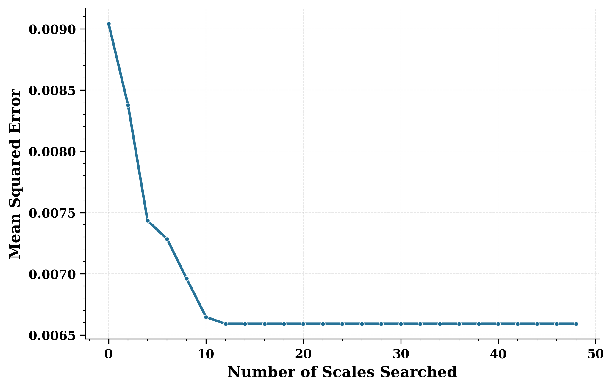
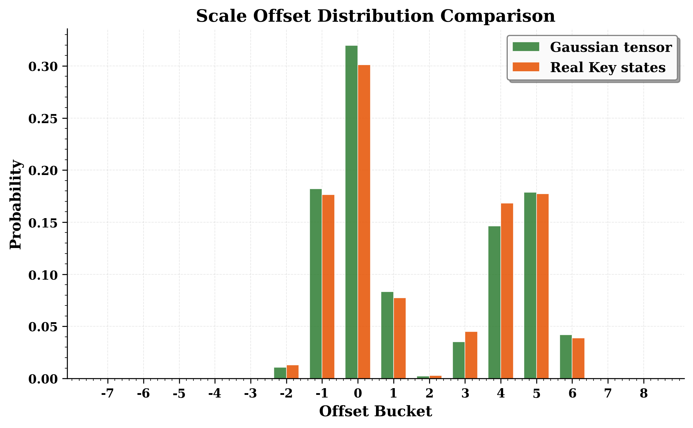
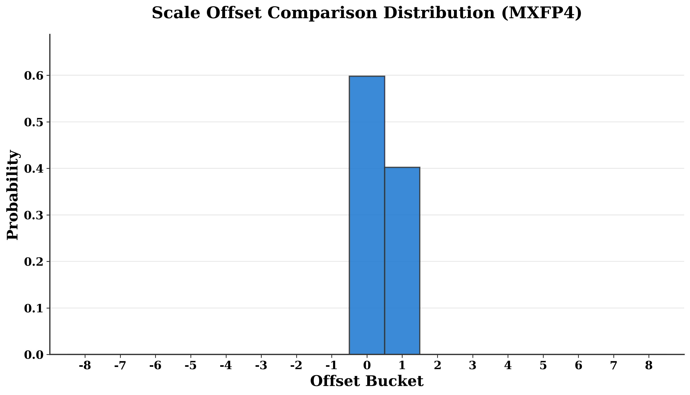

原文版权声明：本文依据公开来源论文 *Search Your Block Floating Point Scales!* 进行中文翻译整理，仅供学习与研究使用。
我仅提供翻译与网页整理，不拥有原文版权；原文版权归作者及发布方所有。
转载、分发或用于商业用途时，请遵守原论文及原始发布平台的版权规定。

原文信息：Tanmaey Gupta，Hayden Prairie，Xiaoxia Wu，Reyna Abhyankar，Qingyang Wu，Austin Silveria，Pragaash Ponnusamy，Jue Wang，Ben Athiwaratkun，Leon Song，Tri Dao，Daniel Y. Fu，Chris De Sa。*Search Your Block Floating Point Scales!*。arXiv:2605.12464v1。

说明：以下内容按原文句序逐句对应翻译整理。
图注、表注、表格说明、算法和参考文献信息尽量保留原貌；作者名、标题、期刊会议信息不翻译。
原文中的 LaTeX 样式宏已展开为普通可移植写法，代码和算法中的标识符保持原样。

作者：Tanmaey Gupta；Hayden Prairie；Xiaoxia Wu；Reyna Abhyankar；Qingyang Wu；Austin Silveria；Pragaash Ponnusamy；Jue Wang；Ben Athiwaratkun；Leon Song；Tri Dao；Daniel Y. Fu；Chris De Sa。

单位：Cornell University, Ithaca, NY, USA；University of California San Diego, La Jolla, CA, USA；Princeton University, Princeton, NJ, USA；Together AI, USA。

# 摘要 {#sec-abstract}

量化已经成为优化生成式模型推理效率的标准技术，因为它能够支持更快的低精度计算并减少内存传输。
近期，GPU 加速器已经对 microscaling Block Floating Point（BFP）格式提供了一级支持。
标准 BFP 算法通常根据块内绝对值最大的元素来固定选择 scale。
我们观察到，这种 scale 选择在量化误差上并不一定最优。
在本文中，我们提出 `ScaleSearch`，一种用于选择这些 scale 因子的替代策略。
`ScaleSearch` 可以与现有量化方法集成，例如 Post Training Quantization 和低精度 attention。
此外，我们还提出 `ScaleSearchAttention`，一种基于 NVFP4 的加速 attention 算法，它使用 `ScaleSearch` 并结合改造后的先前技术，以确保因果语言建模几乎没有性能损失。
实验表明，`ScaleSearch` 在 NVFP4 上可将量化误差降低 27%，并让 Qwen3-8B 在 MATH500 上的语言模型 PTQ 最多提升 15 个点；而 `ScaleSearchAttention` 则让 Llama 3.1 70B 的 Wikitext-2 困惑度最多下降 0.77。
这些方法在提升量化精度的同时，整体性能与基线保持接近。

# 1 引言 {#sec-intro}

量化在优化生成式模型的推理效率中扮演关键角色，不过要在极低比特宽度下维持精度并不容易。
Block Floating Point（BFP）格式近期相较于定点和浮点格式更受关注，因为它在动态范围、内存效率与计算吞吐之间提供了平衡的折中。
近期进展进一步提高了低比特宽度 BFP 格式的算法精度和硬件支持。
特别是，NVIDIA 的 Blackwell 架构通过 NVFP4 和 MXFP4 microscaling 格式引入了快速 FP4 运算，使得 Tensor Cores 可以直接执行 4-bit 矩阵乘法；与 B200 GPU 上的 FP8 计算相比，其吞吐高 2 倍，而在 B300 上则高 3 倍。
关键问题在于如何最有效地利用这些格式来优化机器学习模型。

{#fig-scale-search width=100%}

无论是研究框架还是生产框架（例如 TensorRT、vLLM），现有 BFP 实现 [@tensorrt; @kwon2023vllm; @shared_exponents; @msfp; @bfp1; @quant_survey; @svdquant] 主要都依赖一个合理的基线：块 scale 由每个块中的最大绝对值决定，以便把数值映射到低精度格式可表示的范围内。
我们观察到，这种做法并不一定最优，而其他 scale 选择可以降低量化误差。

在本文中，我们提出一个替代方案 `ScaleSearch`（见图 @fig-scale-search）。
近期的 microscaling BFP 格式，如 NVFP4，引入了更精细的 E4M3 浮点 block scale，因此可以对 scale 进行更细粒度的调优。
基于这一观察，`ScaleSearch` 通过搜索最优 block scale 来最小化给定分布的量化误差。
`ScaleSearch` 是架构无关的，可以集成到多种量化流水线中。
我们展示了它在权重的 Post-Training Quantization（PTQ）以及低精度 attention 计算中的收益。

此外，我们把 FP4 优化扩展到 attention 机制和 KV cache。
由于其二次复杂度，这两部分主导了推理时的内存与计算开销 [@fa1]。
尽管近期工作已经探索了在 PTQ 和 QAT 中对权重与激活进行 FP4 量化，甚至进行了几乎没有精度损失的全 FP4 训练 [@fp4train1; @fp4train2; @fp4train3; @blackwell_infer]，原生 FP4 的 attention 和 KV cache 压缩仍然研究不足。
为此，我们提出 `ScaleSearchAttention`，它扩展了 `ScaleSearch`，使得 NVFP4 可以用于因果语言建模中的 KV cache 和 attention 量化。
我们利用 `ScaleSearch` 为 attention 中的 query、key、value 以及 FlashAttention 中的部分 attention matrix 选择 scale 值。
`ScaleSearchAttention` 使得 `QK^T` 和 `PV` 矩阵乘法可以直接使用快速的 NVFP4 Tensor Core 运算，而无需反量化。
为实现几乎为零的模型精度退化，`ScaleSearchAttention` 进一步结合了 Incoherence Processing 和矩阵分解，以减少 Q 和 K 的离群值及其平均幅值，从而降低量化误差。
我们还采用了 attention-sink-aware 的 mixed-precision cache，其中前几个 token 以及最近的 token 以全精度存储，并在生成足够多 token 后再量化为 NVFP4。

我们在三种常见 FP4 量化设置上评估 `ScaleSearch`：权重 PTQ、用于扩散模型生成和因果语言建模的低精度 attention。
对于权重 PTQ，`ScaleSearch` 在 Qwen3-8B 的 MATH500 上把性能最多提升 15 个点。
对于 FP4 attention，`ScaleSearch` 在 Mochi 生成的视频评测 VQA-t 上相较 SageAttention3 提升了 14 个点。
`ScaleSearchAttention` 将 Llama 3.1 70B 的 Wikitext-2 困惑度从 3.4 降到 2.6348，并将 Llama 3.1 8B Instruct 模型在 GPQA Diamond 测试基准上的准确率提升 5 个点。
本文提出的方法在给出量化精度提升的同时，整体性能与基线保持接近。
`ScaleSearch` 在从 FP32 到 NVFP4 的量化过程中只带来 1.74x 的额外开销，并且实现了 SageAttention3 注意力吞吐的 98.3%。

总的来说，我们在本文中做出如下贡献：

1. 我们提出 `ScaleSearch`，一种用于 Block Floating Point 量化的 scale 搜索算法，它通过在相邻的可表示 scale 中做探索，最小化 block 级量化误差。
   我们的分析主要基于 NVFP4 的 E4M3 格式，在这种格式下，不同于传统的 max-scaling，`ScaleSearch` 利用了 block scale 的尾数分辨率来选择能得到最低均方误差的 quantizer。
   我们证明，`ScaleSearch` 在高斯合成数据上可以把量化误差降低 26%，并且能够无缝集成到现有的 PTQ 和 attention 工作流中，持续提升量化模型的性能。

2. 我们提出 `ScaleSearchAttention`，一种协同优化的 FP4 attention 机制，它可以直接在 Tensor Cores 上用 NVFP4 精度执行 \(QK^T\) 和 \(PV\) 两个矩阵乘法，而无需任何反量化开销，并以紧凑的 4.5-bit NVFP4 格式存储 KV cache。
   `ScaleSearchAttention` 结合了 `ScaleSearch` 和其他改造过的量化技术，使端到端 FP4 推理在保持几乎零精度退化的同时成为可能。

3. 我们在大规模语言模型上进行了系统实验，以评估 `ScaleSearch` 和 `ScaleSearchAttention` 的有效性。
   结果表明，相比 SageAttention3 等先前 FP4 基线，我们的方法在语言和扩散模型上都能在 perplexity 和基准准确率方面持续带来收益。

该框架的源代码已开放在 <https://github.com/mgrailoo/TEMPUS>。

# 2 相关工作 {#sec-related-work}

## 面向 DNN 的块缩放量化

量化数值表示格式是在精度、动态范围和硬件支持之间做取舍的关键设计选择。
定点数 [@fixed_point_1; @fixed_point2] 的硬件实现很快，但其有限的动态范围不足以表示 DNN 模型中的离群值。
浮点数 [@fp8_nvidia] 另一方面需要在 MAC 运算中对尾数做对齐，因此计算开销较高，而且窄格式的动态范围也更小。
因此，Block Floating Point（BFP）格式近年来成为这两种极端之间很有吸引力的折中方案 [@bfp1; @msfp; @fast]。
BFP 的核心思想是：张量块内的元素往往具有相近的幅值，因此可以用共享指数和各自的整数尾数来表示。
这种共享指数结构显著减少了存储开销，同时保留了浮点表示的大部分动态范围灵活性，并且能够使用整数矩阵乘法流水线。

近期进展催生了 MXFP4、NVFP4 和 MXFP8 等 microscaled BFP 格式 [@mxfp4; @nvfp4]，它们面向现代加速器进一步改进了传统块缩放。
这些格式引入了紧凑的逐块 scale 编码，专门优化 Tensor Core 运算，使得无需反量化就能完成高效低比特运算。
与早期只存储指数位的 BFP 变体不同，NVFP4 [@nvfp4] 还把尾数位纳入 scale 表示，从而在很小开销下提供更细的粒度和更好的动态范围。
标准 BFP 和 microscaled 格式都采用基于最大值的缩放方式，也就是从块内最大绝对值推导 block scale，以保证数值可表示 [@msfp; @bfp1; @quant_survey]。

## 生成式模型量化

量化是一项基础技术，它通过降低不同模型组件的数值精度，来优化内存传输、矩阵乘法速度以及端到端训练时间等多个维度。
总体上，量化方法可分为三类：post-training quantization（PTQ）、quantization-aware training（QAT）以及 fully quantized training。
GPTQ [@gptq]、AWQ [@awq] 和 ZeroQuant [@zeroquant] 等 PTQ 算法会在训练后量化模型权重，通常借助二阶误差度量、感知激活的启发式方法或离群通道处理来尽量减小退化。
SmoothQuant [@smoothquant] 通过学习逐通道仿射变换来降低激活方差，把 PTQ 扩展到激活上。
Qserve [@qserve] 和 llm.int8() [@llmint8] 等工作展示了针对不同组件或离群值的混合精度量化。
QuIP [@quip] 通过自适应舍入和 incoherence processing 推进了 PTQ，而 QuIP# [@quipsharp] 则引入了 Hadamard 变换和 E8 格向量量化。
我们的方法中的 incoherence processing 就借鉴自这些工作。
相较之下，QAT [@qat1; @qat2] 会在训练期间把量化模拟纳入前向传播，使低比特推理更能抵抗量化损失。
最后，fully quantized training 即同时量化权重、激活和梯度，随着低比特数值格式的发展而变得可行 [@fp4train1; @fp4train2]。
近期的创新，例如使用 NVFP4 和 MXFP4 格式的 FP4 训练，也使得可以在 4-bit 浮点硬件上完成训练和推理。

## KV 缓存压缩

随着 KV cache 随序列长度和 batch size 线性增长，业界投入了大量工作来降低它的内存占用。
稀疏 transformer [@spa1; @spa2]、低秩近似 [@performers] 和共享 KV head 方法 [@mqa; @gqa; @mhla] 等架构变体，都能从机制上减小缓存大小。
在另一条使用 KV cache 子集的方向上，StreamingLLM [@spa5] 只保留初始 token 和最近 token，而 Gist Tokens 和 SnapKV [@gist; @snapkv] 则基于学习方法把初始 prompt 压缩成 “重要 token”。
H2O [@h20]、RocketKV [@rocketkv] 和 FastGen [@discard] 则采用另一种思路：动态识别关键 token 并将其淘汰。
另一些方法 [@minicache; @kvsharer] 会在层之间共享 KV cache，并且还可能存储相对向量。

既有 KV-cache 量化方法会受到 attention 动态性和离群通道的挑战，因此慢速压缩方式，例如自适应舍入和 lattice codebook，对于高吞吐推理并不现实。
Token-wise 方法，如 ZipCache [@zipcache] 和 WKVQuant [@wkvquant]，会把误差局部化；而 channel-wise 方法，如 KVQuant [@kvquant] 和 KIVI [@kivi]，则更能适配幅值变化。
误差修正技术包括 Gear 的低秩建模 [@gear] 和 QuaRot 的正交变换 [@quarot]。
混合精度策略，例如 KIVI [@kivi]、IntactKV [@intactkv] 和 KVTuner [@kvtuner]，会静态地给关键 token 分配更高精度，但其固定启发式和运行时复杂度限制了可扩展性。
动态方法（MiKV [@mikv]、ZipCache [@zipcache]）则会带来额外开销，并且与静态图推理不兼容。

# 3 FP4 格式背景 {#sec-background}

4-bit 浮点运算如今已被用于支持超低精度下高内存效率和高计算效率的推理与训练。
这里讨论的所有 FP4 格式都遵循标准的 E2M1 结构：1 个符号位、2 个指数位和 1 个尾数位。
这个 FP4 格式可以表示如下实数集：

$$
\mathbb{R}_{\text{E2M1}} = \{0, \pm 0.5, \pm 1, \pm 1.5, \pm 2, \pm 3, \pm 4, \pm 6\}.
$$

Block Floating Point 格式已经被广泛用于 DNN 和生成式模型量化，因为它在精度、动态范围和硬件加速之间提供了理想折中。
BFP 格式的标准底层结构，是给一组低精度浮点数共享一个仅由指数构成的 scale 因子。
这个共享 scale 负责把未量化的数投影到低精度格式可表示的数值范围内。
这种 “校准” 的标准做法，是把 scale 计算为块中最大值与低精度格式可表示最大值的比值。

NVIDIA Blackwell 架构为两种 4-bit block floating-point 格式提供了支持：`NVFP4` 和 `MXFP4`。
这两种格式都会把一个 micro-block，也就是向量中固定长度的一段，表示为 FP4 数值向量乘以一个单独的 8-bit scale 因子。

### NVFP4

NVFP4 [@nvfp4] 是一种硬件加速的 FP4 格式，它作用于 16 个值组成的 micro-block，每个 micro-block 共享一个存储为 8-bit E4M3 浮点数的 scale 因子。
设 \(\mathbb{R}_{\text{UE4M3}} \subset \mathbb{R}_+\) 为该 FP8 格式中可表示的正 scale 集合。
那么，NVFP4 中可表示的 block 可写为：

$$
V_{\text{NVFP4}} = \{
    s \cdot q \mid
    q \in \mathbb{R}_{E2M1}^{16}, \, s \in \mathbb{R}_{\text{UE4M3}}
\} \subset \mathbb{R}^{16}.
$$

对于张量 \(X \in \mathbb{R}^{\cdots \times N \times D}\)（其中 \(D\) 能被 16 整除），NVFP4 会把每一行按长度为 16 的非重叠 block 进行量化，从而得到一对 \((Q,S)\)：

$$
Q \in \mathbb{R}_{\text{E2M1}}^{\cdots \times N \times D}, \qquad S \in \mathbb{R}_{\text{UE4M3}}^{\cdots \times N \times (D/16)}.
$$

这相当于平均每个数 4.5 bit。

**图：VLLM 如何舍入到 NVFP4 的伪代码。下面的代码是对 `vllm/csrc/quantization/fp4/nvfp4_utils.cuh` 中舍入逻辑的简化。**

```c
// input float SFScaleVal is global scale
// vecMax = max of abs of input vector
float SFValue = SFScaleVal * 
  (vecMax * __frcp_rz(6.0f));
__nv_fp8_e4m3 tmp = __nv_fp8_e4m3(SFValue);
float SFValue = float(tmp);
float outputScale = SFValue == 0 ? 0.0f : 
  __frcp_rz(SFValue*__frcp_rz(SFScaleVal));
// set fp2Vals = input vec * outputScale
uint32_t e2m1Vec=fp32_vec_to_e2m1(fp2Vals);
```

要把一个实数 micro-block 向量 \(x \in \mathbb{R}^{16}\) 量化（round）到 NVFP4，标准做法是先在做完行、列或张量级 global scale 缩放之后，计算一个共享 scale \(s \in \mathbb{R}_{\text{FP8}}\)，然后得到向量 \(q \in \mathbb{R}_{FP4}^{16}\)：

$$
s = \operatorname{round}_{\text{UE4M3}}\left( \frac{\| x \|_{\infty}}{6.0} \right),
\qquad
q_i = \operatorname{round}_{\text{E2M1}}\left( \frac{x_i}{s} \right).
$$

这里，\(6.0\) 是 \(\mathbb{R}_{\text{E2M1}}\) 中可表示的最大幅值，\(\operatorname{round}_F\) 表示向格式 \(F\) 的普通最近邻舍入，而无穷范数 \(\| x \|_{\infty} = \max_i |x|\) 则是输入中最大绝对值。
完成这些操作所需的基本算术步骤，也就是求绝对值最大值、除以 6、再除以 scale，通常都在 FP32 中完成。
上面的代码图 1 就展示了这一点，它是从 vLLM 代码库 [@kwon2023vllm] 中略作简化得到的；这段代码可以代表当前对 NVFP4 舍入的标准做法。

要把整个张量量化，标准做法只是把这套舍入算法独立地应用到张量中每个长度为 16 的 block 上。

**反量化** 会通过下式重建全精度张量：

$$
\hat{x}_i = \operatorname{decode}_{\text{E2M1}}(q_i) \cdot s
$$

或者写成矩阵形式，得到 \(\hat{X} \in \mathbb{R}^{N \times D}\)：

$$
\hat{X} = D(Q,S)=\operatorname{decode}(Q) \odot \operatorname{Broadcast}(S)
$$

其中，\(\operatorname{Broadcast}(S) \in \mathbb{R}^{N \times D}\) 会把每个 \(s_g\) 扩展到它对应的 block 上，而 \(\odot\) 表示逐元素乘法。
但需要注意的是，在通常使用 FP4 Tensor Core 的运算里，不会显式做反量化：硬件会直接使用 NVFP4 值来完成低精度矩阵乘法。

### MXFP4

MXFP4 格式沿用相同的 4-bit E2M1 编码，但每个 block 使用更大的 32 值分组，并配合更简单的二的幂 scale 因子。
具体来说，它使用 UE7M0 8-bit 浮点格式，而不是 NVFP4 所用的 UE4M3 格式；除此之外，量化与反量化算法完全相同。
NVFP4 由于 block 更小且 FP8 scale 精度更高，实践中通常能获得更低的量化误差和更好的精度保持，但代价是动态范围更差，并且每个数的 bit 开销会稍微高一点。

# 4 ScaleSearch {#sec-scalesearch}

标准的做法，是只根据输入向量 \(x\) 的最大幅值来选择 scale。
这显然不是最优的，因为它并不能保证找到在 \(V_{\text{NVFP4}}\) 中距离 \(x\) 最近的向量，不过大家通常把这种 scale 选择视为“足够接近最优”的启发式。
出乎意料的是，我们会在这一节里看到，它可能明显次优，而其他 scale 能在合成随机向量和真实神经网络数据上给出更低的均方误差。

**算法 1：NVFP4 Scale Search**

```text
Input: Block x in R^16, search range [f_min, f_max]
Output: Best scale s*, fp4 vector q*, best offset f*
x_max <- max_{i in {1,...,16}} |x_i|
s <- round_{UE4M3}(x_max * (1.0/6.0))   # Standard scale
s_int8 -> reinterpret(s, int8)
l* <- +infty                            # Initialize best loss
for f = f_min to f_max:
    if 1 <= s_int8 + f <= 127:          # If scale in range
        s^(f) <- reinterpret(s_int8 + f, fp8_UE4M3)
        q_i <- round_E2M1(x_i / s^(f)), for all i   # Quantize
        \hat{x}_i <- q_i * s^(f), for all i         # Dequantize
        l <- sum_{i=1}^{16} (x_i - \hat{x}_i)^2      # Compute loss
        if l < l*:                                  # Update best scale
            l* <- l
            s* <- s^(f)
            q* <- q
return s*, q*, f*
```

我们注意到，NVFP4 里额外的 scale 尾数位预算，为 block scale 因子的细粒度搜索提供了机会，而不是只使用基于块最大值的默认 scale。
我们通过给默认 scale \(s\) 加上偏移量，并选择能使 block 的量化误差最小的 scale，来实现这一搜索机制。
我们聚焦 NVFP4 格式来实现 `ScaleSearch`，因为据我们所知，它是唯一一种同时具有浮点 scale 因子并且已经被现代硬件支持用于加速计算的格式。
在此基础上，我们提出 `ScaleSearch`，它通过搜索多个 FP8 scale 来降低 micro-block 浮点量化误差。

`ScaleSearch` 的核心算法思想，是搜索若干个靠近标准最大值 scale 的候选值。
具体来说，如果 \(s \in \mathbb{R}_{\text{UE4M3}}\) 表示第 3 节中的“标准” scale，那么我们考虑那些相对 \(s\) 偏移了整数 \(f\) 的 scale \(s^{(f)}\)：

$$
s^{(f)} = \operatorname{reinterpret}(\operatorname{reinterpret}(s, \text{int8}) + f, \text{fp8}_{\text{UE4M3}}).
$$

也就是说，\(s^{(0)} = s\)，\(s^{(1)}\) 是比 \(s\) 大的最小 UE4M3 值，\(s^{(-1)}\) 是比 \(s\) 小的最大 UE4M3 值，依此类推，使得：

$$
\cdots < s^{(-2)} < s^{(-1)} < s^{(0)} < s^{(1)} < s^{(2)} < \cdots.
$$

`ScaleSearch` 会在 \(f_{\min}\) 与 \(f_{\max}\) 之间穷举所有偏移 \(f\)，寻找能最小化（均方）量化误差的那个 scale。
NVFP4 的完整算法见算法 1；这套算法也很容易改写成支持其他 micro-block 浮点格式的版本。

显然，如果我们令 \(f_{\min} = -127\) 且 \(f_{\max} = +127\)，即对所有 scale 做穷举搜索，那么算法 1 一定能找到与输入 \(x\) 最近的可表示向量。
但是，这样做的计算代价会很高。
在下一小节中，我们会通过合成数据和真实数据上的实验说明，只搜索一小部分 scale 偏移就足以显著降低误差，并且已经非常接近最优 MSE。

### Synthetic Validation

我们首先在合成数据上测试这一方法：生成一个值服从标准高斯分布的大型 FP32 张量，并使用算法 1 在不同搜索范围下把它量化到 NVFP4。
这里被搜索的 scale 数量等于 \(f_{\max} - f_{\min} + 1\)，而我们选取的范围满足 \(f_{\min} = 1 - f_{\max}\)。
图 @fig-mse 展示了这个张量的量化均方误差（MSE）：随着搜索的 scale 数量增加，量化误差逐渐下降，直到搜索范围继续扩大也不再带来额外收益。
在这些合成数据上，MSE 从 0.0990 降到 0.0066，约降低了 25%。

{#fig-mse width=100%}

#### Offset distribution

为了压缩搜索范围，我们进一步考察不同 block 选择的 offset 分布。
图 @fig-histogram 展示了通过穷举搜索得到的 offset 经验分布。
对于一个高斯采样的张量，这个分布呈现双峰结构，两条曲线大致以 offset 0 和 4 为中心。
同一张图还画出了从 Llama 3.1 8B 模型中取出的一个真实 Key state tensor 的分布，说明这种行为在真实数据上也会持续存在。
这表明，针对高斯采样张量得到的 scale search 分析，也可以安全地应用到真实模型张量的量化中，因为它们的 offset 分布非常相似。
基于这个经验分析，我们为真实模型量化流程选择 \(f_{\min} = -2\) 到 \(f_{\max} = +6\) 的 offset 搜索范围，并在本文后续的 NVFP4 实验中一直沿用它。

{#fig-histogram width=100%}

这种分布的直觉是：默认的 block scale（offset 0）被选得恰好能让最大幅值元素用最大的 FP4 数值 6（或 -6）表示时误差很小。
offset 接近 0 的受欢迎程度，对应的是这样一种量化：最大幅值元素会被表示成 6（或 -6）。
但最大幅值元素也可以被存成 4（或 -4），也就是第二大的 FP4 数值。

这时，我们希望 scale 大约比“默认” block scale 大 \(1.5x = 6/4\)，以补偿最大幅值元素是用 4 而不是 6 存储这一事实。
offset 大约为 4 或 5 时，通常就对应大约 \(1.5x\) 的因子：举例来说，E4M3 数值 1.0 对应的 bit pattern 是 0 1000 000 = 64，而在此基础上加 4 后变成 0 1000 100 = 68，对应的数值是 1.5。
图 @fig-histogram 中 4 和 5 附近的模式，就对应于最大幅值元素会被表示成 4（或 -4）的量化情形。
不存在用 3（或 -3）来表示最大幅值元素的“第三个模式”，因为这样做不会比用 6（或 -6）并把 scale 减半更有优势。

上述考虑具有普适性，并不依赖于某个特定的数据分布。
这一点也被我们的经验观察所证实：图 @fig-histogram 中出现的 mode，会同时出现在合成高斯张量和真实激活张量上。

#### Other formats

`ScaleSearch` 可以用于任何 block 量化格式，其收益大小取决于所用的 scale 和 value 格式。
我们针对多种配置做了模拟实验，考察不同 exponent 位数和 mantissa 位数下的 scale 与 value 格式。
图 @fig-search-improvements 展示了 `ScaleSearch` 在不同 scale 表示位数下的百分比提升，而 value 格式固定为 E2M1，也就是 NVFP4 的配置。
图 @fig-search-improvements 也展示了当 scale 格式固定为 E4M3（与 NVFP4 相同）时，不同 value 表示位数下的结果。
`ScaleSearch` 最多可以把量化误差降低约 80%，而对 NVFP4 格式尤其可以降低 27%。
我们还研究了 `ScaleSearch` 在标准化 MXFP 格式上的效果（图 @fig-search-improvements），并观察到：对于使用 E2M3 value 的 MXFP6，MSE 下降 11%；对于 MXFP4，MSE 下降 8%。

{#fig-search-improvements width=100%}

我们进一步注意到，对于最近的低精度格式而言，`ScaleSearch` 的表现更好，原因有两个。
第一，我们观察到，`ScaleSearch` 的收益在更小的 block size 下更明显。
图 @fig-block-size 表明，随着 block size 增大，search 与 no-search 情况之间的 MSE 差距会缩小。
先前的量化方法往往使用更大的 block size，从按列或按行到按整个张量缩放都有，这会削弱 `ScaleSearch` 的收益。
第二，正如图 @fig-histogram 所示，最有利的搜索位置通常就在 max-abs scale \(s\) 附近，而 MXFP4 中可表示的 scale 值在更大的范围内分布得更稀疏，因此真正“靠近” \(s\) 的候选更少。
这一点在图 @fig-mxfp4 中可以直接看到：在 MXFP4 scaling 下，实际上只会用到两个 offset，而且最常见的选择是没有 offset。

{#fig-mxfp4 width=100%}

{#fig-block-size width=60%}

### 应用于语言建模

我们把 `ScaleSearch` 扩展为 `ScaleSearchAttention`，它是一个端到端的 attention 方法，通过构造一个没有任何反量化开销的、硬件感知型流水线，来优化推理中的 attention 计算。
attention 层中的所有张量（\(Q,K,P,V\)）都被量化到 NVFP4 格式，并且直接使用带 FP32 accumulator 的 NVFP4 Tensor Core 进行乘法，从而获得更高吞吐。
除了计算收益之外，这还会把 KV cache 以 NVFP4 格式（4.5 bit）存储，从而降低内存占用。
\(Q,K,P,V\) 的 block scale 会在 row-wise scaling 之后通过 `ScaleSearch` 计算出来，而量化则沿着矩阵乘法的 reduction 维度进行，这受到 NVFP4 MMA 指令要求的约束 [@scale_dims]。
为了缩小与未量化模型之间的精度差距，`ScaleSearchAttention` 在 `ScaleSearch` 之外又集成了两种额外技术。

{#fig-ssa width=100%}

#### Incoherence Processing with magnitude reduction

QuIP [@quip]、QuIP# [@quipsharp] 和 QuaRot [@quarot] 等多个先前工作，都把 Incoherence Processing（IP）作为一种降低待量化张量离群值的原则性方法。
按照 QuIP# [@quipsharp] 的做法，我们使用 Hadamard 矩阵 \(H\) 来变换 \(Q\) 和 \(K\) 矩阵，同时保持 attention score 不变，并降低量化误差。
在传统 IP 之外，我们还实现了一个额外的变换，以降低投影后的 query（\(Q\)）和 key（\(K\)）表示的平均平方幅值，因为这会直接降低量化误差。
具体来说，我们引入如下两个线性变换：

$$
Q' = Q R^{-T}, \qquad K' = K R,
$$

其中 \(R \in \mathbb{R}^{d \times d}\) 是一个可逆变换。
这个变换会保留 attention score，同时降低 query（\(Q\)）和 key（\(K\)）的量化误差：

$$
Q' {K'}^\top = (Q R^{-T})(K R)^\top = Q R^{-T} R^\top K^\top = Q K^\top.
$$

这些公式的推导，以及它们在某种意义上最小化投影后 \(Q\) 和 \(K\) 矩阵平均平方幅值的证明，都放在附录中；这里为了简洁起见并且因为它在某种意义上与我们的核心贡献 `ScaleSearch` 相对独立，所以不再展开。

#### Attention-sink-aware mixed-precision cache

Attention sink 分析 [@spa5] 表明，attention score 会集中到上下文中最近的 “local” token 以及最初的 token 上。
基于这个观察，一些先前的 KV cache 压缩方法，例如 KVQuant [@kvquant] 和 IntactKV [@intactkv]，会把对应于初始 token 和 “pivot” token 的 KV cache 以高精度保留。
在此基础上，`ScaleSearchAttention` 使用 mixed-precision attention 计算：整个 attention matrix（\(QK^T\)）按大小为 \(B\) 的 block 划分，最前面的 block 和最后一个（最新的）block 用高精度计算，其余 block 则用更低精度计算。
这通过把一个大小为 \(O(B)\) 的常量 KV cache 以未量化形式存储来实现。
这样做不会随着上下文或生成长度增长，因此不会让推理变得更偏向内存瓶颈。
block size \(B\) 可以根据给定的内存和计算资源，在性能最优性方面进行调节。
唯一要求是 block 至少要有 16 个 token，因为 V 是沿 token 维度量化的，而 NVFP4 的量化以 16 个一组进行。

#### `ScaleSearchAttention` 工作流程

图 @fig-ssa 展示了 `ScaleSearchAttention` 的实现与工作流程，这里给出的推理示例位于 prefill 阶段，此时已经处理了 \(n\) 个 token（满足 \(n \% B=B-1\)）。
与这些 \(n\) 个 token 对应的 mixed-precision KV cache 中，第一块和最后那个不完整 block（包含 \(B-1\) 个 token）都以全精度形式存储，而其余 KV cache 则处于 NVFP4 格式。
量化后的 K 会与量化后的 Q 通过 nvFP4 Tensor Core 指令相乘，而全精度矩阵乘法则通过高精度 matmul 指令完成。
由于未量化的值不会随着上下文长度增长，绝大多数计算都可以在快速的 nvFP4 Tensor Core 上完成，而这些运算会把结果累积到 FP32 中。
两个矩阵乘法的结果会拼接起来组成 \(QK^T\)，随后用 softmax 计算概率。
接着 P 矩阵还会进一步量化，并与 V 做一次 mixed-precision 乘法，过程与 \(QK^T\) 类似；唯一的区别是 V 矩阵是沿行划分的，因此 P 矩阵需要沿列切分，才能分别执行高精度和低精度的部分矩阵乘法，最后再把它们加起来得到 \(PV\) 矩阵。
新采样 token 对应的 Key 和 Value 状态会分别拼接到未完成的 K 和 V block 末尾，完整 block 再量化成 nvFP4 并存为压缩后的 KV cache。
由于所有矩阵都被量化，而且 nvFP4 Tensor Core 会在 FP32 中累积，所以这里不会有反量化步骤。

# 5 实验 {#sec-scale_search_integration}

我们通过验证 `ScaleSearch` 在数值稳定性和最小开销方面的改进，来评估它的影响。
首先，我们考察它在语言模型 PTQ 和扩散模型超低精度 attention 中的质量提升。
接着，我们对比它与其他低精度 attention 方法的吞吐，以说明 `ScaleSearch` 的额外开销很小。
最后，我们评估 `ScaleSearchAttention` 在语言模型上的表现。

## `ScaleSearch` {#sec-attention}

| 模型 | 方法 | GPQA | MATH-500 | AIME-120 | MMLU |
|:--|:--|--:|--:|--:|--:|
| DeepSeek-R1-Distill-Qwen-1.5B | Baseline | 32.6 (3.2) | 64.6 (1.4) | 24.5 (2.3) | 48.0 |
|  | NVFP4 | 30.4 (4.2) | 51.6 (2.9) | 18.7 (1.4) | 45.2 |
|  | `ScaleSearch` | **31.3** (1.8) | **62.1** (1.9) | **19.8** (1.9) | **45.4** |
| Qwen3-8B | Baseline | 51.3 (3.8) | 72.8 (3.4) | 71.0 (3.0) | 79.7 |
|  | NVFP4 | 42.4 (5.5) | 73.1 (4.3) | **63.7** (1.3) | 77.7 |
|  | `ScaleSearch` | **49.9** (1.6) | **88.1** (0.6) | 63.0 (2.2) | **79.4** |

: `ScaleSearch` 作为 PTQ 技术，在若干通用能力基准上的评估结果，5 次运行取平均（MMLU 只运行一次）。数值越高越好，粗体为最佳。 {#tbl-ptq}

### Post-Training Quantization

我们评估 `ScaleSearch` 作为一种离线 Post-Training Quantization（PTQ）技术的效果，模型包括 DeepSeek-R1-Distill-Qwen-1.5B [@guo2025deepseek] 和 Qwen3-8B [@qwen3]。
我们把它与基础模型以及使用 TensorRT-Model-Optimizer [@trt_opt]（ModelOpt）量化出的 NVFP4 模型进行比较。
对于 `ScaleSearch`，我们修改了 ModelOpt 的 NVFP4 量化路径，让它执行 `ScaleSearch`。
我们使用了五个通用能力基准（GPQA [@gpqa]、MATH-500 [@math500]、AIME-120 [@aime_2024]、MMLU [@mmlu]）。
GPQA 测试研究生水平的科学推理和多跳推断，体现量化对领域知识的影响。
AIME 和 MATH-500 侧重高中数学，考验符号推理和精度。
MMLU 涵盖历史和法律等多个学科，用来评估常识知识和问题求解能力。
结果如表 @tbl-ptq 所示。

我们观察到，`ScaleSearch` 在所有基准上都优于 NVFP4，最高提升 15 个百分点。
在唯一一个 NVFP4 更好的例子里（Qwen3-8B 上的 AIME-120），`ScaleSearch` 仍然落在一个标准差以内，我们认为这来自这些基准本身的随机性。
值得注意的是，当非量化基线和 NVFP4 之间存在较大差距时，`ScaleSearch` 也能把差距显著缩小（例如 MATH-500 上的 10.5 分、GPQA 上的 7.5 分、MMLU 上的 1.7 分）。
这些趋势在不同模型规模上都保持一致。

| 模型 | 方法 | VQA-a | VQA-t | FScore | CLIPSIM | CLIP-T |
|:--|:--|--:|--:|--:|--:|--:|
| Mochi | Full-Precision | 62.919 | 70.216 | 2.466 | 0.1834 | 0.9991 |
|  | SageAttention3 | 49.635 | 55.738 | 1.874 | **0.1829** | 0.9988 |
|  | SageAttention3 + `ScaleSearch` | **57.424** | **70.362** | **2.143** | 0.1826 | **0.9989** |
| CogvideoX | Full-Precision | 74.969 | 75.345 | 5.969 | 0.1850 | 0.9976 |
|  | SageAttention3 | 72.915 | 74.912 | 5.118 | **0.1845** | 0.9973 |
|  | SageAttention3 + `ScaleSearch` | **75.753** | **75.873** | **5.402** | 0.1833 | **0.9974** |

: 使用 SageAttention3 以及 SageAttention3 + `ScaleSearch` 在 SageAttention3 评测集上的 Mochi 和 CogVideoX 质量（VQA-a、VQA-t、FScore）以及 video-caption 对齐（CLIPSIM、CLIP-T）。数值越高越好，粗体为最佳。 {#tbl-diffusion-quality}

### Diffusion Inference attention

我们还把 `ScaleSearch` 与 SageAttention3 [@sageattention3] 结合起来，评估它在端到端视频扩散模型推理中的质量。
我们在 Mochi [@genmo2024mochi] 和 CogVideoX-2B [@yang2024cogvideox] 上分别比较了是否加入 `ScaleSearch` 的 SageAttention3，并使用 CLIPSIM 和 CLIP-Temp（CLIP-T）衡量 text-to-video 对齐，用 VQA-a、VQA-t 和 FScore 衡量质量和一致性。
我们在 SageAttention3 的评测数据集 [@sageattention3] 上进行了测试。

如表 @tbl-diffusion-quality 所示，`ScaleSearch` 在 Mochi 和 CogVideoX 上都能优于 SageAttention3 的 VQA-a、VQA-t 和 FScore，同时在 CLIPSIM 和 CLIP-T 上保持一致。
和 PTQ 的结果类似，我们观察到，在 SageAttention3 已经接近全精度 attention 的指标上，`ScaleSearch` 会与朴素 SageAttention3 保持一致；但在 SageAttention3 相比全精度 attention 表现较差的指标上，引入 `ScaleSearch` 会显著提升质量。

## `ScaleSearchAttention` {#sec-swiftattention-eval}

我们使用基于 PyTorch [@PyTorch] 搭建的模拟量化框架来评估 `ScaleSearchAttention`。
我们测试量化和未量化模型的任务无关 PPL。

| 方法 | Llama 3.1 8B | Llama 3.1 70B | Qwen3 4B | Qwen3 8B |
|:--|--:|--:|--:|--:|
| FullPrec | 5.4837 | 2.5554 | 11.1327 | 8.3013 |
| naive-FP4 | 5.9988 | 3.4000 | 11.5258 | 8.4429 |
| naive-FP4 + `ScaleSearch` | 5.8330 | 3.3441 | 11.3618 | 8.4378 |
| SA3 | 5.9542 | 3.3899 | 11.3672 | 8.4575 |
| SA3 + `ScaleSearch` | 5.8060 | 3.2972 | 11.2441 | 8.4181 |
| `ScaleSearchAttention` | **5.4977** | **2.6348** | **11.2088** | **8.3018** |

: Wikitext-2 测试集上的 perplexity 评估。数值越低越好，粗体为最佳。 {#tbl-ppl}

| 方法 | Accuracy |
|:--|--:|
| FullPrec | 31.81 |
| SA3 | 26.26 |
| `ScaleSearchAttention` | **32.32** |

: 在 Llama 3.1 8B Instruct 模型上对 GPQA:diamond 的语言基准评估。粗体为最佳。 {#tbl-gpqa}

| 方法 | PPL |
|:--|--:|
| SSA | 5.4977 |
| SSA w/o ScaleSearch | 5.5024 |
| SSA w/o IP and Magnitude Reduction | 5.5283 |
| SSA w/o Mixed-precision KV cache | 5.5768 |

: `ScaleSearchAttention`（SSA）各个变体的消融分析。注：w/o 表示 without。 {#tbl-ablation}

#### Perplexity

我们使用 Llama 3.1 8B、Llama 3.1 70B [@llama3]、Qwen3 4B 和 Qwen3 8B [@qwen3] 来测量 Wikitext-2 数据集 [@Wikitext-2] 测试集上的 token perplexity。
在 PPL 评估中，我们把结果与各模型的全原生精度（FullPrec）、普通 FP4 量化（Naive-FP4） [@nvfp4] 以及 SageAttention3（SA3） [@sageattention3] 进行比较。
对于 SageAttention3，我们使用自己的 FP4 simulator 来模拟给定算法（算法 1），因为论文提供的代码在因果场景下数值不稳定。
表 @tbl-ppl 给出了这些结果。
`ScaleSearchAttention` 在所有模型上都优于 SageAttention3 和 Naive-FP4，并且在 Llama 3.1 70B 上最多把 PPL 降低了 22%。
需要注意的是，对于更大的模型，`ScaleSearchAttention` 的改进也非常明显，而这些模型通常更不容易受到量化影响 [@reasoninghurtsquant]。
我们还通过把 `ScaleSearch` 加到 naive NVFP4（naive-FP4）和 SageAttention3（SA3）之上，研究了它对 PPL 的影响。
naive-FP4 指的是按 NVIDIA 给出的算法对 \(Q,K,V,P\) 做模拟量化 [@nvfp4]。
把 `ScaleSearch` 加进去后，SageAttention3 和 Naive-FP4 的 PPL 都得到了改善，这验证了它的有效性，也说明它可以应用到很广的一类量化算法上。

#### Language benchmark

我们进一步在 GPQA Diamond [@gpqa] 基准上，用 Llama 3.1 8B Instruct 模型评估了该方法。
与 perplexity 结果一致，`ScaleSearchAttention` 取得了最佳表现，准确率达到 32.32，超过了 SA3 的 26.26，并且与全精度评估相匹配。

#### `ScaleSearchAttention` ablation

我们还在表 @tbl-ablation 中的消融实验里研究了 `ScaleSearchAttention` 各组成部分的重要性。
完整的 `ScaleSearchAttention` 配置取得了最低 perplexity（5.4977），说明把所有提出的组件联合起来是有效的。
去掉 `ScaleSearch` 会带来明显退化（5.5024），说明最优 microscaling 很重要。
同样，关闭 IP 和 magnitude reduction 之后，perplexity 会进一步升高（5.5283），而当移除 mixed-precision KV cache 时，性能下降最大（5.5768），这强调了它在保持 attention 质量方面的关键贡献。

### Overhead and Efficiency

在这一节里，我们通过考察以下三项来分析 `ScaleSearch` 的性能：(i) 不同搜索范围下的量化开销，(ii) attention 吞吐，(iii) 端到端生成延迟。

#### Quantization overhead

我们首先测量 `ScaleSearch` 在 FP32 到 NVFP4 量化过程中引入的开销。
实验在一个随机高斯矩阵上进行，矩阵大小为 \(2048 \times 2048\)，基线采用 vLLM 的量化实现，而 `ScaleSearch` 被集成在其上。
如表 @tbl-quant-overhead 所示，基线量化耗时 0.0258 ms；把 `ScaleSearch` 加进去并限制搜索范围为 `[-1,1]` 时，耗时变为 0.0328 ms，也就是 1.27x 开销。
把搜索范围扩大到完整的 `[-2,6]` 时，耗时变为 0.0449 ms，也就是 1.74x 开销。
这说明，`ScaleSearch` 在提供稳定 MSE 改进的同时，实际带来的量化开销非常小。

| 方法 | Time (ms) | Overhead |
|:--|--:|--:|
| FP32 → NVFP4 (baseline) | 0.0258 | 1.00x |
| + `ScaleSearch` (`[-1,1]`) | 0.0328 | 1.27x |
| + `ScaleSearch` (`[-2,6]`) | 0.0449 | 1.74x |

: 不同搜索范围下 `ScaleSearch` 的量化开销。 {#tbl-quant-overhead}

![我们将 SageAttention3 [@sageattention3] 与 `ScaleSearch` 的组合，与其他超低精度技术 [@sageattention1; @sageattention2]、flash-attention [@fa3]、xformers [@xFormers2022] 以及 eager torch 做比较，输入数据类型为 bfloat16。我们发现，`ScaleSearch` 并不会显著影响 causal 和 non-causal attention 的吞吐，尤其是在更长序列长度下更是如此。](../assets/search-your-block-floating-point-scales/sageattention_perf_5090_hd_128_dtype_bf16.png){#fig-throughput width=100%}

#### Attention throughput

接下来，我们在一个受 SageAttention3 [@sageattention3] 启发的实验设置中，评估 `ScaleSearch` 对 attention 吞吐的影响。
如图 @fig-throughput 所示，把 `ScaleSearch` 和 SageAttention3 结合后，在 causal 和 non-causal 两种设置下的吞吐都几乎和基线一致。
特别是在长序列长度（32K）下，`ScaleSearch` 在 non-causal attention 中最多能达到基线 TOPs 的 98.3%，在 causal attention 中则达到 97.5%。
这表明，额外的 scale search 并不会给关键 attention kernel 带来显著运行时开销，尤其是在高吞吐场景下更是如此。

#### End-to-end latency

最后，我们测量了 text-to-video 生成模型的端到端延迟。
如表 @tbl-e2e-latency 所示，相较于 full-precision attention，SageAttention3 和 SageAttention3 + `ScaleSearch` 都显著降低了延迟。
值得注意的是，`ScaleSearch` 只比 SageAttention3 略慢一点点，例如 Mochi 上是 353.40 s 对 364.68 s，CogVideoX 上是 61.72 s 对 63.09 s，这说明它在真实生成工作负载中的额外开销非常小。
总体而言，这些结果说明 `ScaleSearch` 在几乎不影响系统效率的前提下，就能带来更好的数值表现。

| Model | Method | E2E Latency |
|:--|:--|--:|
| Mochi | Full-Precision | 503.38 |
|  | SageAttention3 | **353.40** |
|  | SA3 + `ScaleSearch` | <u>364.68</u> |
| CogVideoX | Full-Precision | 91.67 |
|  | SageAttention3 | **61.72** |
|  | SA3 + `ScaleSearch` | <u>63.09</u> |

: 文本到视频生成模型 Mochi [@genmo2024mochi] 和 CogVideoX [@yang2024cogvideox] 在 12 个不同 prompt 上的平均端到端延迟。数值越低越好。粗体为最佳，下划线为第二名。 {#tbl-e2e-latency}

# 6 结论 {#sec-conclusion}

本文提出 `ScaleSearch`，一种用于选择 micro-block scaling 值的 nvFP4 量化技术。
我们发现，`ScaleSearch` 能降低量化误差，从而提升语言建模和视频扩散任务的端到端质量。
作为扩展，我们又提出 `ScaleSearchAttention`，这是第一种使用 `ScaleSearch` 对 KV cache 做 nvFP4 量化的 attention 算法。
我们希望这些方法能够推动量化领域进一步的发展与创新。

# 附录：幅值缩减变换的证明 {#appendix-algo}

设原始的 query 和 key 矩阵为 \(Q, K \in \mathbb{R}^{B \times d}\)。
我们引入一对线性变换：

$$
Q' = Q R^{-T}, \qquad K' = K R,
$$

其中 \(R \in \mathbb{R}^{d \times d}\) 是一个可逆变换。
这个变换会保留 attention score：

$$
Q' {K'}^\top = (Q R^{-T})(K R)^\top = Q R^{-T} R^\top K^\top = Q K^\top.
$$

设 \(Q\) 和 \(K\) 的二阶矩阵（或者 Hessian 矩阵）分别为：

$$
X = \mathbb{E}[Q^\top Q], \qquad Y = \mathbb{E}[K^\top K],
$$

它们刻画了 \(Q\) 和 \(K\) 在各个特征方向上的能量分布。

在应用重参数化 \(R\) 之后，变换后的 query 和 key 的平均平方幅值变为：

$$
\mathbb{E}[\|Q'\|^2] = \mathrm{tr}(R^{-1} X R^{-T}), \qquad 
\mathbb{E}[\|K'\|^2] = \mathrm{tr}(R^\top Y R).
$$

为了联合最小化它们的整体能量，也就等价于最小化量化误差，我们最小化这两个量的乘积：

$$
\min_R \; \mathrm{tr}(R^{-1} X R^{-T}) \cdot \mathrm{tr}(R^\top Y R).
$$ {#eq-joint-objective}

我们使用奇异值分解（SVD）对式 @eq-joint-objective 做解析求解。
设

$$
X^{1/2} Y^{1/2} = U S V^\top
$$

是对对称半正定矩阵乘积 \(X^{1/2} Y^{1/2}\) 的 SVD，其中 \(U, V\) 是正交矩阵，\(S = \mathrm{diag}(s_i)\) 包含奇异值。

定义最优变换为：

$$
R = Y^{-1/2} V S^{1/2}, \qquad R^{-1} = S^{-1/2} V^\top Y^{1/2},
$$

这样就能让两个 trace 相等。

$$
\begin{aligned}
\mathrm{tr}(R^{-1} X R^{-T}) 
&= \mathrm{tr}\!\left(S^{-1/2} V^\top Y^{1/2} X Y^{1/2} V S^{-1/2}\right) \\
&= \mathrm{tr}(S), \\[4pt]
\mathrm{tr}(R^\top Y R)
&= \mathrm{tr}\!\left(S^{1/2} V^\top Y^{-1/2} Y Y^{-1/2} V S^{1/2}\right) \\
&= \mathrm{tr}(S).
\end{aligned}
$$

因此，最小化后的联合能量为：

$$
\mathrm{tr}(R^{-1} X R^{-T}) \cdot \mathrm{tr}(R^\top Y R) = \left(\mathrm{tr}(S)\right)^2.
$$

这就是式 @eq-joint-objective 所能达到的最小值，而对应的 \(R\) 会把 \(X\) 和 \(Y\) 的谱基最优地对齐。
